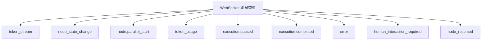
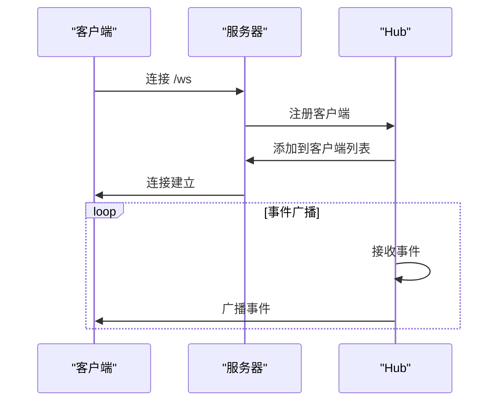

# API参考

<cite>
**本文档中引用的文件**  
- [main.go](file://cmd/council/main.go)
- [workflow.go](file://internal/api/handler/workflow.go)
- [agent.go](file://internal/api/handler/agent.go)
- [group.go](file://internal/api/handler/group.go)
- [template.go](file://internal/api/handler/template.go)
- [memory.go](file://internal/api/handler/memory.go)
- [llm.go](file://internal/api/handler/llm.go)
- [workflow_mgmt.go](file://internal/api/handler/workflow_mgmt.go)
- [hub.go](file://internal/api/ws/hub.go)
- [types.go](file://internal/core/workflow/types.go)
- [session.go](file://internal/core/workflow/session.go)
- [versioning.go](file://internal/core/middleware/versioning.go)
- [websocket.ts](file://frontend/src/types/websocket.ts)
- [useWebSocketRouter.ts](file://frontend/src/hooks/useWebSocketRouter.ts)
</cite>

## 目录
1. [简介](#简介)
2. [RESTful API](#restful-api)
   1. [工作流管理](#工作流管理)
   2. [智能体操作](#智能体操作)
   3. [群组操作](#群组操作)
   4. [模板管理](#模板管理)
   5. [内存管理](#内存管理)
   6. [LLM提供者](#llm提供者)
3. [WebSocket API](#websocket-api)
   1. [连接建立](#连接建立)
   2. [消息类型](#消息类型)
   3. [事件订阅](#事件订阅)
   4. [实时状态推送](#实时状态推送)
4. [认证与版本控制](#认证与版本控制)
5. [示例与用法](#示例与用法)

## 简介
本API文档全面覆盖了"Council"系统的所有公开接口，包括RESTful API和WebSocket API。系统支持工作流管理、执行控制、智能体/群组操作、模板调用等核心功能。RESTful API用于资源的CRUD操作和工作流执行控制，而WebSocket API提供实时通信能力，用于监控工作流执行状态、接收实时消息和进行人机交互。

**Section sources**
- [main.go](file://cmd/council/main.go#L1-L150)

## RESTful API

### 工作流管理
工作流管理API提供对工作流的创建、读取、更新、删除以及执行控制功能。

#### 获取工作流列表
获取所有可用工作流的简要信息。

- **HTTP方法**: `GET`
- **URL路径**: `/api/v1/workflows`
- **请求头**: 
  - `Content-Type: application/json`
  - `Authorization: Bearer <JWT Token>`
- **请求体**: 无
- **响应格式**:
```json
[
  {
    "id": "string",
    "name": "string",
    "updated_at": "string"
  }
]
```
- **可能的错误码**:
  - `500 Internal Server Error`: 数据库查询失败

**Section sources**
- [workflow_mgmt.go](file://internal/api/handler/workflow_mgmt.go#L37-L54)

#### 获取特定工作流
获取指定ID的工作流完整定义。

- **HTTP方法**: `GET`
- **URL路径**: `/api/v1/workflows/:id`
- **请求头**: 
  - `Content-Type: application/json`
  - `Authorization: Bearer <JWT Token>`
- **请求体**: 无
- **响应格式**: `GraphDefinition` 对象
- **可能的错误码**:
  - `404 Not Found`: 工作流不存在
  - `500 Internal Server Error`: 内部错误

**Section sources**
- [workflow_mgmt.go](file://internal/api/handler/workflow_mgmt.go#L57-L66)

#### 创建工作流
保存一个新的工作流定义。

- **HTTP方法**: `POST`
- **URL路径**: `/api/v1/workflows`
- **请求头**: 
  - `Content-Type: application/json`
  - `Authorization: Bearer <JWT Token>`
- **请求体**: `GraphDefinition` 对象
- **响应格式**: 创建的工作流对象
- **可能的错误码**:
  - `400 Bad Request`: 请求体格式错误
  - `500 Internal Server Error`: 保存失败

**Section sources**
- [workflow_mgmt.go](file://internal/api/handler/workflow_mgmt.go#L69-L86)

#### 更新工作流
更新现有工作流的定义。

- **HTTP方法**: `PUT`
- **URL路径**: `/api/v1/workflows/:id`
- **请求头**: 
  - `Content-Type: application/json`
  - `Authorization: Bearer <JWT Token>`
- **请求体**: `GraphDefinition` 对象
- **响应格式**: 更新后的工作流对象
- **可能的错误码**:
  - `400 Bad Request`: 请求体格式错误
  - `404 Not Found`: 工作流不存在
  - `500 Internal Server Error`: 更新失败

**Section sources**
- [workflow_mgmt.go](file://internal/api/handler/workflow_mgmt.go#L89-L108)

#### 生成工作流
根据自然语言提示生成工作流定义。

- **HTTP方法**: `POST`
- **URL路径**: `/api/v1/workflows/generate`
- **请求头**: 
  - `Content-Type: application/json`
  - `Authorization: Bearer <JWT Token>`
- **请求体**:
```json
{
  "prompt": "string"
}
```
- **响应格式**:
```json
{
  "graph": "GraphDefinition",
  "explanation": "string"
}
```
- **可能的错误码**:
  - `400 Bad Request`: 缺少提示
  - `502 Bad Gateway`: LLM生成失败
  - `500 Internal Server Error`: 解析生成的工作流失败

**Section sources**
- [workflow_mgmt.go](file://internal/api/handler/workflow_mgmt.go#L111-L188)

#### 估算工作流成本
计算工作流执行的预估成本。

- **HTTP方法**: `POST`
- **URL路径**: `/api/v1/workflows/estimate`
- **请求头**: 
  - `Content-Type: application/json`
  - `Authorization: Bearer <JWT Token>`
- **请求体**: `GraphDefinition` 对象
- **响应格式**: 成本估算对象
- **可能的错误码**:
  - `400 Bad Request`: 请求体格式错误
  - `404 Not Found`: 指定ID的工作流不存在
  - `500 Internal Server Error`: 内部错误

**Section sources**
- [workflow_mgmt.go](file://internal/api/handler/workflow_mgmt.go#L191-L218)

#### 执行工作流
启动一个工作流的执行实例。

- **HTTP方法**: `POST`
- **URL路径**: `/api/v1/workflows/execute`
- **请求头**: 
  - `Content-Type: application/json`
  - `Authorization: Bearer <JWT Token>`
- **请求体**:
```json
{
  "graph": "GraphDefinition",
  "input": "object"
}
```
- **响应格式**:
```json
{
  "session_id": "string",
  "status": "started"
}
```
- **可能的错误码**:
  - `400 Bad Request`: 请求体格式错误
  - `500 Internal Server Error`: 执行启动失败

**Section sources**
- [workflow.go](file://internal/api/handler/workflow.go#L58-L123)

#### 控制执行
对正在运行的工作流会话进行暂停、恢复或停止操作。

- **HTTP方法**: `POST`
- **URL路径**: `/api/v1/sessions/:id/control`
- **请求头**: 
  - `Content-Type: application/json`
  - `Authorization: Bearer <JWT Token>`
- **请求体**:
```json
{
  "action": "pause|resume|stop"
}
```
- **响应格式**:
```json
{
  "id": "string",
  "status": "string",
  "action": "string"
}
```
- **可能的错误码**:
  - `400 Bad Request`: 动作无效
  - `404 Not Found`: 会话不存在
  - `500 Internal Server Error`: 控制操作失败

**Section sources**
- [workflow.go](file://internal/api/handler/workflow.go#L129-L166)

#### 发送信号
向特定节点发送信号以触发特定行为。

- **HTTP方法**: `POST`
- **URL路径**: `/api/v1/sessions/:id/signal`
- **请求头**: 
  - `Content-Type: application/json`
  - `Authorization: Bearer <JWT Token>`
- **请求体**:
```json
{
  "node_id": "string",
  "payload": "object"
}
```
- **响应格式**:
```json
{
  "status": "signal_sent"
}
```
- **可能的错误码**:
  - `400 Bad Request`: 请求体格式错误
  - `404 Not Found`: 会话不存在
  - `409 Conflict`: 节点不接受信号

**Section sources**
- [workflow.go](file://internal/api/handler/workflow.go#L180-L201)

#### 人工审核
处理需要人工干预的节点，提供批准、拒绝或修改的决策。

- **HTTP方法**: `POST`
- **URL路径**: `/api/v1/sessions/:id/review`
- **请求头**: 
  - `Content-Type: application/json`
  - `Authorization: Bearer <JWT Token>`
- **请求体**:
```json
{
  "node_id": "string",
  "action": "approve|reject|modify",
  "data": "object"
}
```
- **响应格式**:
```json
{
  "status": "resumed"
}
```
- **可能的错误码**:
  - `400 Bad Request`: 请求体格式错误
  - `404 Not Found`: 会话不存在
  - `409 Conflict`: 节点不处于审核状态

**Section sources**
- [workflow.go](file://internal/api/handler/workflow.go#L209-L245)

### 智能体操作
智能体操作API提供对智能体的CRUD功能。

#### 创建智能体
创建一个新的智能体。

- **HTTP方法**: `POST`
- **URL路径**: `/api/v1/agents`
- **请求头**: 
  - `Content-Type: application/json`
  - `Authorization: Bearer <JWT Token>`
- **请求体**: `Agent` 对象
- **响应格式**: 创建的智能体对象
- **可能的错误码**:
  - `400 Bad Request`: 请求体格式错误
  - `500 Internal Server Error`: 创建失败

**Section sources**
- [agent.go](file://internal/api/handler/agent.go#L19-L32)

#### 获取智能体
获取指定ID的智能体信息。

- **HTTP方法**: `GET`
- **URL路径**: `/api/v1/agents/:id`
- **请求头**: 
  - `Content-Type: application/json`
  - `Authorization: Bearer <JWT Token>`
- **请求体**: 无
- **响应格式**: `Agent` 对象
- **可能的错误码**:
  - `400 Bad Request`: ID格式无效
  - `404 Not Found`: 智能体不存在

**Section sources**
- [agent.go](file://internal/api/handler/agent.go#L34-L49)

#### 获取智能体列表
获取所有智能体的列表。

- **HTTP方法**: `GET`
- **URL路径**: `/api/v1/agents`
- **请求头**: 
  - `Content-Type: application/json`
  - `Authorization: Bearer <JWT Token>`
- **请求体**: 无
- **响应格式**: `Agent[]` 数组
- **可能的错误码**:
  - `500 Internal Server Error`: 查询失败

**Section sources**
- [agent.go](file://internal/api/handler/agent.go#L51-L59)

#### 更新智能体
更新现有智能体的信息。

- **HTTP方法**: `PUT`
- **URL路径**: `/api/v1/agents/:id`
- **请求头**: 
  - `Content-Type: application/json`
  - `Authorization: Bearer <JWT Token>`
- **请求体**: `Agent` 对象
- **响应格式**: 更新后的智能体对象
- **可能的错误码**:
  - `400 Bad Request`: ID格式无效或请求体格式错误
  - `500 Internal Server Error`: 更新失败

**Section sources**
- [agent.go](file://internal/api/handler/agent.go#L61-L82)

#### 删除智能体
删除指定ID的智能体。

- **HTTP方法**: `DELETE`
- **URL路径**: `/api/v1/agents/:id`
- **请求头**: 
  - `Content-Type: application/json`
  - `Authorization: Bearer <JWT Token>`
- **请求体**: 无
- **响应格式**: 无内容 (204)
- **可能的错误码**:
  - `400 Bad Request`: ID格式无效
  - `500 Internal Server Error`: 删除失败

**Section sources**
- [agent.go](file://internal/api/handler/agent.go#L84-L98)

### 群组操作
群组操作API提供对群组的CRUD功能。

#### 创建群组
创建一个新的群组。

- **HTTP方法**: `POST`
- **URL路径**: `/api/v1/groups`
- **请求头**: 
  - `Content-Type: application/json`
  - `Authorization: Bearer <JWT Token>`
- **请求体**: `Group` 对象
- **响应格式**: 创建的群组对象
- **可能的错误码**:
  - `400 Bad Request`: 请求体格式错误
  - `500 Internal Server Error`: 创建失败

**Section sources**
- [group.go](file://internal/api/handler/group.go#L19-L32)

#### 获取群组
获取指定ID的群组信息。

- **HTTP方法**: `GET`
- **URL路径**: `/api/v1/groups/:id`
- **请求头**: 
  - `Content-Type: application/json`
  - `Authorization: Bearer <JWT Token>`
- **请求体**: 无
- **响应格式**: `Group` 对象
- **可能的错误码**:
  - `400 Bad Request`: ID格式无效
  - `404 Not Found`: 群组不存在

**Section sources**
- [group.go](file://internal/api/handler/group.go#L34-L49)

#### 获取群组列表
获取所有群组的列表。

- **HTTP方法**: `GET`
- **URL路径**: `/api/v1/groups`
- **请求头**: 
  - `Content-Type: application/json`
  - `Authorization: Bearer <JWT Token>`
- **请求体**: 无
- **响应格式**: `Group[]` 数组
- **可能的错误码**:
  - `500 Internal Server Error`: 查询失败

**Section sources**
- [group.go](file://internal/api/handler/group.go#L51-L59)

#### 更新群组
更新现有群组的信息。

- **HTTP方法**: `PUT`
- **URL路径**: `/api/v1/groups/:id`
- **请求头**: 
  - `Content-Type: application/json`
  - `Authorization: Bearer <JWT Token>`
- **请求体**: `Group` 对象
- **响应格式**: 更新后的群组对象
- **可能的错误码**:
  - `400 Bad Request`: ID格式无效或请求体格式错误
  - `500 Internal Server Error`: 更新失败

**Section sources**
- [group.go](file://internal/api/handler/group.go#L61-L82)

#### 删除群组
删除指定ID的群组。

- **HTTP方法**: `DELETE`
- **URL路径**: `/api/v1/groups/:id`
- **请求头**: 
  - `Content-Type: application/json`
  - `Authorization: Bearer <JWT Token>`
- **请求体**: 无
- **响应格式**: 无内容 (204)
- **可能的错误码**:
  - `400 Bad Request`: ID格式无效
  - `500 Internal Server Error`: 删除失败

**Section sources**
- [group.go](file://internal/api/handler/group.go#L84-L98)

### 模板管理
模板管理API提供对工作流模板的管理功能。

#### 获取模板列表
获取所有可用模板的列表。

- **HTTP方法**: `GET`
- **URL路径**: `/api/v1/templates`
- **请求头**: 
  - `Content-Type: application/json`
  - `Authorization: Bearer <JWT Token>`
- **请求体**: 无
- **响应格式**: `Template[]` 数组
- **可能的错误码**:
  - `500 Internal Server Error`: 查询失败

**Section sources**
- [template.go](file://internal/api/handler/template.go#L20-L27)

#### 创建模板
创建一个新的工作流模板。

- **HTTP方法**: `POST`
- **URL路径**: `/api/v1/templates`
- **请求头**: 
  - `Content-Type: application/json`
  - `Authorization: Bearer <JWT Token>`
- **请求体**:
```json
{
  "name": "string",
  "description": "string",
  "category": "string",
  "graph": "GraphDefinition"
}
```
- **响应格式**: 创建的模板对象
- **可能的错误码**:
  - `400 Bad Request`: 请求体格式错误
  - `500 Internal Server Error`: 创建失败

**Section sources**
- [template.go](file://internal/api/handler/template.go#L29-L58)

#### 删除模板
删除指定ID的模板。

- **HTTP方法**: `DELETE`
- **URL路径**: `/api/v1/templates/:id`
- **请求头**: 
  - `Content-Type: application/json`
  - `Authorization: Bearer <JWT Token>`
- **请求体**: 无
- **响应格式**:
```json
{
  "status": "deleted"
}
```
- **可能的错误码**:
  - `500 Internal Server Error`: 删除失败

**Section sources**
- [template.go](file://internal/api/handler/template.go#L60-L67)

### 内存管理
内存管理API提供对长期记忆的管理和查询功能。

#### 内存摄入
将内容摄入到指定群组的长期记忆中。

- **HTTP方法**: `POST`
- **URL路径**: `/api/v1/memory/ingest`
- **请求头**: 
  - `Content-Type: application/json`
  - `Authorization: Bearer <JWT Token>`
- **请求体**:
```json
{
  "group_id": "string",
  "content": "string"
}
```
- **响应格式**:
```json
{
  "status": "ingested"
}
```
- **可能的错误码**:
  - `400 Bad Request`: 请求体格式错误
  - `500 Internal Server Error`: 摄入失败

**Section sources**
- [memory.go](file://internal/api/handler/memory.go#L25-L43)

#### 内存查询
在指定群组的长期记忆中查询相关信息。

- **HTTP方法**: `POST`
- **URL路径**: `/api/v1/memory/query`
- **请求头**: 
  - `Content-Type: application/json`
  - `Authorization: Bearer <JWT Token>`
- **请求体**:
```json
{
  "group_id": "string",
  "query": "string"
}
```
- **响应格式**:
```json
{
  "results": "array"
}
```
- **可能的错误码**:
  - `400 Bad Request`: 请求体格式错误
  - `500 Internal Server Error`: 查询失败

**Section sources**
- [memory.go](file://internal/api/handler/memory.go#L50-L67)

### LLM提供者
LLM提供者API提供可用LLM提供者和模型的信息。

#### 获取提供者选项
获取可用的LLM提供者及其支持的模型列表。

- **HTTP方法**: `GET`
- **URL路径**: `/api/v1/llm/providers`
- **请求头**: 
  - `Content-Type: application/json`
  - `Authorization: Bearer <JWT Token>`
- **请求体**: 无
- **响应格式**:
```json
{
  "providers": [
    {
      "id": "string",
      "name": "string",
      "icon": "string",
      "models": ["string"]
    }
  ]
}
```
- **可能的错误码**:
  - `500 Internal Server Error`: 获取提供者失败

**Section sources**
- [llm.go](file://internal/api/handler/llm.go#L32-L105)

## WebSocket API

### 连接建立
客户端通过WebSocket连接到服务器以接收实时事件。

- **URL路径**: `/ws`
- **协议**: `ws://` 或 `wss://`
- **认证**: 通过JWT Token在连接时进行认证
- **连接示例**:
```javascript
const socket = new WebSocket('ws://localhost:8080/ws');
socket.onopen = () => console.log('Connected');
socket.onmessage = (event) => console.log('Message:', JSON.parse(event.data));
```

**Section sources**
- [main.go](file://cmd/council/main.go#L98-L100)
- [hub.go](file://internal/api/ws/hub.go#L110-L125)

### 消息类型
WebSocket API支持多种消息类型，用于不同的实时通信场景。



**Diagram sources**
- [websocket.ts](file://frontend/src/types/websocket.ts#L1-L10)

#### token_stream
当智能体生成文本流时发送此事件。

- **事件类型**: `token_stream`
- **数据格式**:
```json
{
  "node_id": "string",
  "agent_id": "string",
  "chunk": "string",
  "is_thinking": "boolean"
}
```

**Section sources**
- [useWebSocketRouter.ts](file://frontend/src/hooks/useWebSocketRouter.ts#L19-L29)

#### node_state_change
当节点状态发生变化时发送此事件。

- **事件类型**: `node_state_change`
- **数据格式**:
```json
{
  "node_id": "string",
  "status": "pending|running|completed|failed"
}
```

**Section sources**
- [useWebSocketRouter.ts](file://frontend/src/hooks/useWebSocketRouter.ts#L32-L46)

#### node:parallel_start
当并行节点开始执行时发送此事件。

- **事件类型**: `node:parallel_start`
- **数据格式**:
```json
{
  "node_id": "string",
  "branches": ["string"]
}
```

**Section sources**
- [useWebSocketRouter.ts](file://frontend/src/hooks/useWebSocketRouter.ts#L48-L53)

#### token_usage
当节点完成执行时发送此事件，包含Token使用统计。

- **事件类型**: `token_usage`
- **数据格式**:
```json
{
  "node_id": "string",
  "agent_id": "string",
  "input_tokens": "number",
  "output_tokens": "number",
  "estimated_cost_usd": "number"
}
```

**Section sources**
- [useWebSocketRouter.ts](file://frontend/src/hooks/useWebSocketRouter.ts#L55-L68)

#### execution:paused
当工作流执行被暂停时发送此事件。

- **事件类型**: `execution:paused`
- **数据格式**: 无

**Section sources**
- [useWebSocketRouter.ts](file://frontend/src/hooks/useWebSocketRouter.ts#L70-L73)

#### execution:completed
当工作流执行完成时发送此事件。

- **事件类型**: `execution:completed`
- **数据格式**: 无

**Section sources**
- [useWebSocketRouter.ts](file://frontend/src/hooks/useWebSocketRouter.ts#L75-L78)

#### error
当发生错误时发送此事件。

- **事件类型**: `error`
- **数据格式**:
```json
{
  "node_id": "string",
  "error": "string"
}
```

**Section sources**
- [useWebSocketRouter.ts](file://frontend/src/hooks/useWebSocketRouter.ts#L97-L109)

#### human_interaction_required
当需要人工干预时发送此事件。

- **事件类型**: `human_interaction_required`
- **数据格式**:
```json
{
  "node_id": "string",
  "reason": "string",
  "timeout": "number"
}
```

**Section sources**
- [useWebSocketRouter.ts](file://frontend/src/hooks/useWebSocketRouter.ts#L80-L90)

#### node_resumed
当节点从人工干预中恢复执行时发送此事件。

- **事件类型**: `node_resumed`
- **数据格式**: 无

**Section sources**
- [useWebSocketRouter.ts](file://frontend/src/hooks/useWebSocketRouter.ts#L92-L95)

### 事件订阅
客户端通过订阅WebSocket连接来接收实时事件。系统使用发布-订阅模式，所有连接的客户端都会收到广播事件。



**Diagram sources**
- [hub.go](file://internal/api/ws/hub.go#L39-L68)

### 实时状态推送
服务器通过WebSocket连接实时推送工作流执行状态，包括节点状态变化、Token流、成本估算等。

**Section sources**
- [useWebSocketRouter.ts](file://frontend/src/hooks/useWebSocketRouter.ts#L17-L112)

## 认证与版本控制
系统使用JWT进行认证，并通过URL路径进行版本控制。

### 认证方式
所有API端点都需要JWT认证。客户端需要在请求头中包含Authorization字段。

- **认证方式**: JWT (JSON Web Token)
- **请求头**: `Authorization: Bearer <JWT Token>`
- **Token获取**: 通过独立的认证API获取

### 版本控制策略
API版本通过URL路径进行控制，当前版本为v1。

- **版本控制**: URL路径版本控制
- **基础路径**: `/api/v1/`
- **策略**: 向后兼容，新功能在新版本中引入

**Section sources**
- [main.go](file://cmd/council/main.go#L102-L103)

## 示例与用法
以下是一些常见的API使用示例。

### 执行工作流的curl命令
```bash
curl -X POST http://localhost:8080/api/v1/workflows/execute \
  -H "Content-Type: application/json" \
  -H "Authorization: Bearer YOUR_JWT_TOKEN" \
  -d '{
    "graph": {
      "id": "demo-workflow",
      "name": "Demo Workflow",
      "start_node_id": "start-1",
      "nodes": {
        "start-1": {
          "id": "start-1",
          "type": "start",
          "name": "Start",
          "next_ids": ["agent-1"]
        },
        "agent-1": {
          "id": "agent-1",
          "type": "agent",
          "name": "Main Agent",
          "properties": {
            "agent_id": "default-agent",
            "prompt": "Hello, how can I help you?"
          }
        }
      }
    },
    "input": {}
  }'
```

### 客户端WebSocket调用片段
```typescript
// 连接WebSocket
const socket = new WebSocket('ws://localhost:8080/ws');

// 处理消息
socket.onmessage = (event) => {
  const message = JSON.parse(event.data);
  switch (message.event) {
    case 'token_stream':
      console.log('Token:', message.data.chunk);
      break;
    case 'node_state_change':
      console.log('Node', message.data.node_id, 'status:', message.data.status);
      break;
    case 'execution:completed':
      console.log('Workflow execution completed');
      break;
  }
};

// 发送控制命令
function pauseExecution() {
  socket.send(JSON.stringify({
    cmd: 'pause_session'
  }));
}
```

**Section sources**
- [useWebSocketRouter.ts](file://frontend/src/hooks/useWebSocketRouter.ts#L17-L112)
- [workflow.go](file://internal/api/handler/workflow.go#L58-L123)