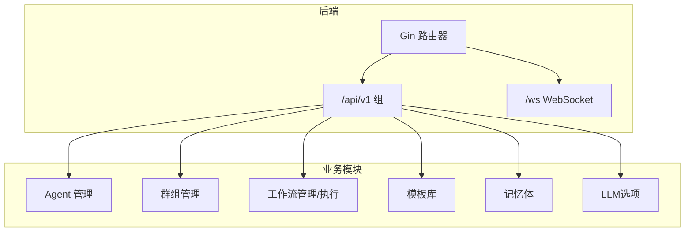
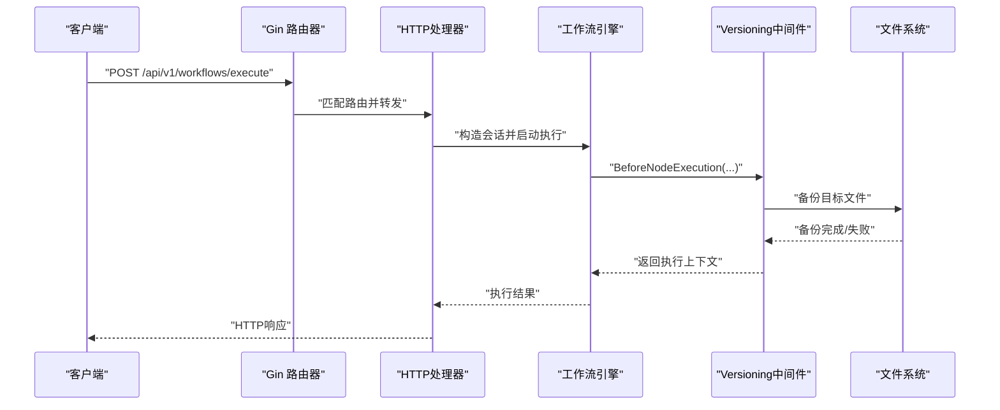
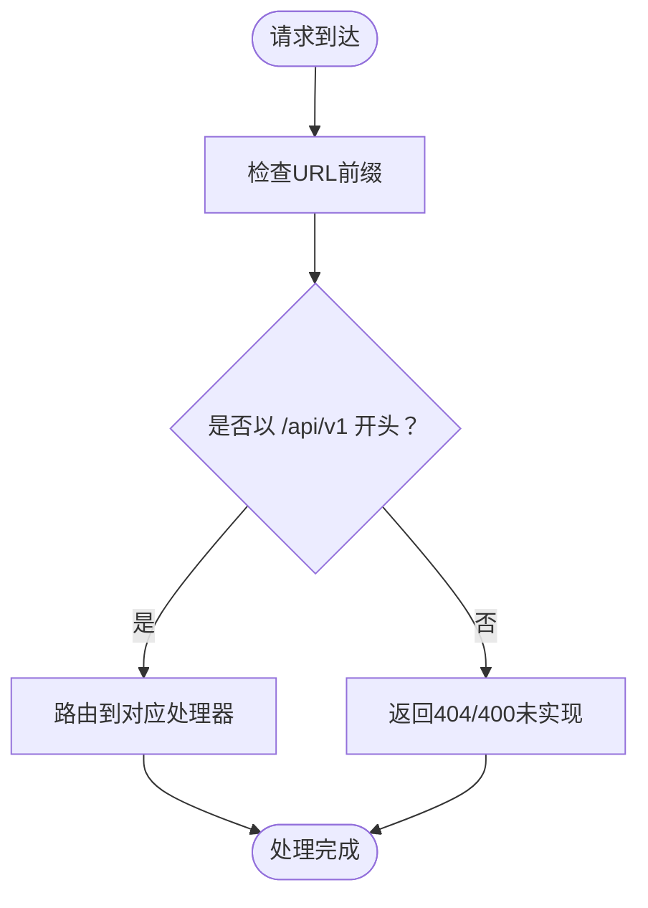
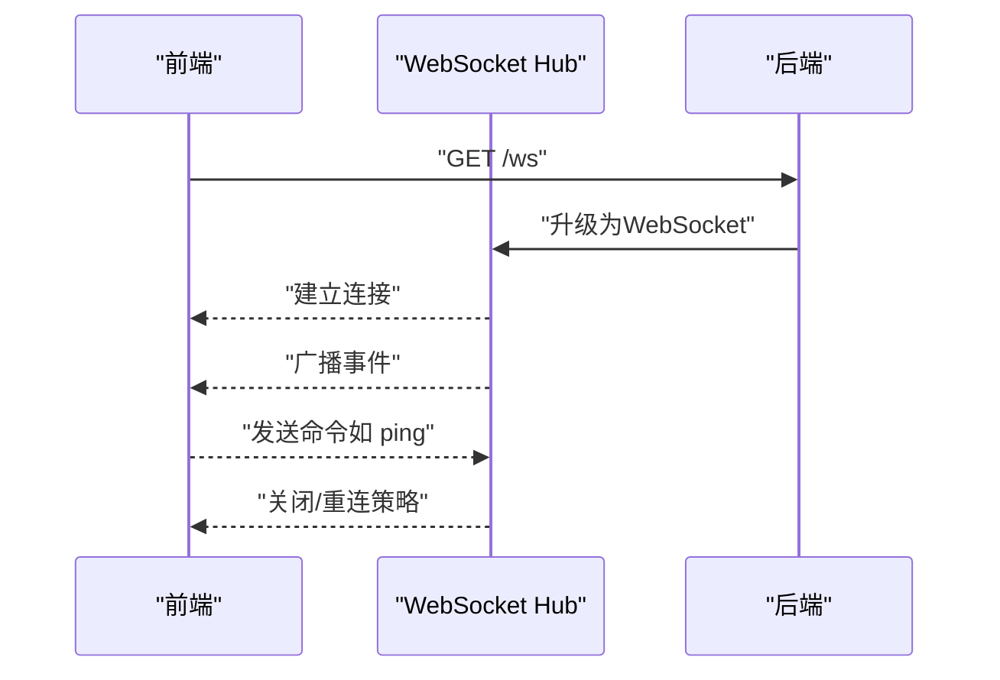
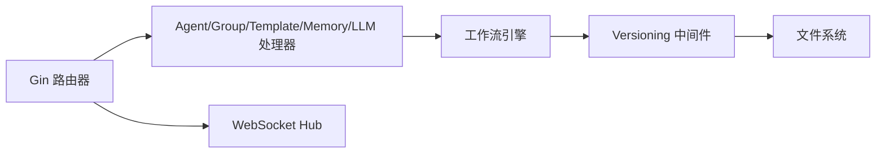

# API版本控制

<cite>
**本文引用的文件**
- [cmd/council/main.go](file://cmd/council/main.go)
- [docs/api/README.md](file://docs/api/README.md)
- [internal/core/middleware/versioning.go](file://internal/core/middleware/versioning.go)
- [internal/core/middleware/versioning_test.go](file://internal/core/middleware/versioning_test.go)
- [docs/specs/sprint6/SPEC-605-versioning-middleware.md](file://docs/specs/sprint6/SPEC-605-versioning-middleware.md)
- [internal/api/ws/hub.go](file://internal/api/ws/hub/hub.go)
- [frontend/src/stores/useConnectStore.ts](file://frontend/src/stores/useConnectStore.ts)
- [docs/specs/sprint1/SPEC-005-websocket-optimization.md](file://docs/specs/sprint1/SPEC-005-websocket-optimization.md)
</cite>

## 目录
1. [简介](#简介)
2. [项目结构与版本入口](#项目结构与版本入口)
3. [核心组件](#核心组件)
4. [架构总览](#架构总览)
5. [详细组件分析](#详细组件分析)
6. [依赖关系分析](#依赖关系分析)
7. [性能与可维护性考量](#性能与可维护性考量)
8. [故障排查指南](#故障排查指南)
9. [结论](#结论)
10. [附录：客户端调用示例与WebSocket处理](#附录客户端调用示例与websocket处理)

## 简介
本文件系统化梳理本项目的API版本控制策略与实践，重点围绕以下目标展开：
- 通过URL路径（如/api/v1/workflows）实现版本隔离，确保向后兼容性。
- 解释版本化中间件（versioning.go）的实现原理及其在工作流引擎中的作用。
- 阐述版本发布流程，包括新版本引入、旧版本弃用通知期与最终下线计划。
- 提供客户端在调用时如何指定版本的示例，并说明在WebSocket连接中是否以及如何处理版本问题。

## 项目结构与版本入口
- 后端通过Gin路由为API统一挂载在/v1子路径下，形成“版本即路径”的隔离策略，便于未来引入/v2等新版本端点而不影响现有客户端。
- WebSocket端点为/ws，独立于HTTP版本路径，用于实时事件推送。



图表来源
- [cmd/council/main.go](file://cmd/council/main.go#L97-L143)
- [docs/api/README.md](file://docs/api/README.md#L37-L46)

章节来源
- [cmd/council/main.go](file://cmd/council/main.go#L97-L143)
- [docs/api/README.md](file://docs/api/README.md#L37-L46)

## 核心组件
- 版本化中间件（VersioningMiddleware）：在工作流节点执行前对目标文件进行备份，支持回滚能力。该中间件属于工作流引擎的扩展机制，而非HTTP路由层的版本解析器。
- HTTP路由与版本隔离：通过Gin的分组路由将所有API置于/api/v1下，形成稳定的版本入口。
- WebSocket Hub：负责实时事件广播，不涉及HTTP版本路径。

章节来源
- [internal/core/middleware/versioning.go](file://internal/core/middleware/versioning.go#L1-L156)
- [cmd/council/main.go](file://cmd/council/main.go#L97-L143)
- [internal/api/ws/hub.go](file://internal/api/ws/hub.go#L1-L125)

## 架构总览
下图展示API版本隔离与工作流执行链路的关系，突出HTTP版本路径与工作流中间件职责的边界。



图表来源
- [cmd/council/main.go](file://cmd/council/main.go#L118-L131)
- [internal/core/middleware/versioning.go](file://internal/core/middleware/versioning.go#L31-L66)

## 详细组件分析

### 版本化中间件（VersioningMiddleware）
- 职责边界：仅在工作流节点执行前对指定目标文件进行备份；不参与HTTP路由或版本解析。
- 触发条件：仅当节点类型为“人类评审”且会话输入包含目标文件路径时触发。
- 备份策略：按会话ID创建独立备份目录，文件名包含时间戳，便于排序与回滚。
- 回滚能力：提供查找最新备份、从备份恢复、列出备份等方法，支撑UI回滚按钮。

```mermaid
classDiagram
class VersioningMiddleware {
+string BackupDir
+Name() string
+BeforeNodeExecution(ctx, session, node) error
+AfterNodeExecution(ctx, session, node, output) map[string]interface{}
+CreateBackup(sessionID, targetPath) error
+FindLatestBackup(sessionID, targetPath) string
+RestoreFromBackup(backupPath, targetPath) error
+ListBackups(sessionID, targetPath) []string
}
```

图表来源
- [internal/core/middleware/versioning.go](file://internal/core/middleware/versioning.go#L1-L156)

章节来源
- [internal/core/middleware/versioning.go](file://internal/core/middleware/versioning.go#L1-L156)
- [internal/core/middleware/versioning_test.go](file://internal/core/middleware/versioning_test.go#L1-L150)
- [docs/specs/sprint6/SPEC-605-versioning-middleware.md](file://docs/specs/sprint6/SPEC-605-versioning-middleware.md#L1-L143)

### HTTP路由与版本隔离
- 所有API端点均位于/api/v1组内，形成稳定的版本入口，便于未来新增/api/v2等新版本。
- WebSocket端点为/ws，独立于HTTP版本路径，用于实时事件推送。



图表来源
- [cmd/council/main.go](file://cmd/council/main.go#L102-L143)

章节来源
- [cmd/council/main.go](file://cmd/council/main.go#L102-L143)
- [docs/api/README.md](file://docs/api/README.md#L37-L46)

### WebSocket Hub与版本
- WebSocket端点为/ws，不带HTTP版本路径；客户端通过动态构建URL适配不同环境。
- Hub负责连接生命周期管理、消息广播与断开清理，不涉及HTTP版本解析。



图表来源
- [internal/api/ws/hub.go](file://internal/api/ws/hub.go#L1-L125)
- [frontend/src/stores/useConnectStore.ts](file://frontend/src/stores/useConnectStore.ts#L1-L127)
- [docs/specs/sprint1/SPEC-005-websocket-optimization.md](file://docs/specs/sprint1/SPEC-005-websocket-optimization.md#L107-L204)

章节来源
- [internal/api/ws/hub.go](file://internal/api/ws/hub.go#L1-L125)
- [frontend/src/stores/useConnectStore.ts](file://frontend/src/stores/useConnectStore.ts#L1-L127)
- [docs/specs/sprint1/SPEC-005-websocket-optimization.md](file://docs/specs/sprint1/SPEC-005-websocket-optimization.md#L107-L204)

## 依赖关系分析
- 路由层依赖处理器层；处理器层不直接依赖版本中间件，但工作流引擎可挂载中间件。
- WebSocket Hub与HTTP路由解耦，不参与HTTP版本路径解析。



图表来源
- [cmd/council/main.go](file://cmd/council/main.go#L97-L143)
- [internal/core/middleware/versioning.go](file://internal/core/middleware/versioning.go#L1-L156)
- [internal/api/ws/hub.go](file://internal/api/ws/hub.go#L1-L125)

章节来源
- [cmd/council/main.go](file://cmd/council/main.go#L97-L143)
- [internal/core/middleware/versioning.go](file://internal/core/middleware/versioning.go#L1-L156)
- [internal/api/ws/hub.go](file://internal/api/ws/hub.go#L1-L125)

## 性能与可维护性考量
- 版本隔离采用URL路径方式，简单直观，便于灰度与并行演进。
- 备份文件按会话隔离，避免跨会话干扰；时间戳命名便于排序与清理。
- WebSocket不带HTTP版本路径，减少协议复杂度，便于跨版本共用。

[本节为通用指导，无需特定文件来源]

## 故障排查指南
- 备份失败但流程不中断：中间件在备份失败时记录警告并继续执行，避免阻塞工作流。
- 无法找到备份：确认会话ID与目标文件路径一致，检查备份目录权限与磁盘空间。
- WebSocket连接异常：检查URL构建、CORS策略与心跳机制；关注断线重连与清理逻辑。

章节来源
- [internal/core/middleware/versioning.go](file://internal/core/middleware/versioning.go#L49-L56)
- [internal/core/middleware/versioning_test.go](file://internal/core/middleware/versioning_test.go#L112-L119)
- [internal/api/ws/hub.go](file://internal/api/ws/hub.go#L1-L125)
- [frontend/src/stores/useConnectStore.ts](file://frontend/src/stores/useConnectStore.ts#L1-L127)

## 结论
- 本项目采用“URL路径即版本”的策略，通过/api/v1实现稳定隔离，保障向后兼容。
- 版本化中间件专注于工作流节点执行前的目标文件备份与回滚，不承担HTTP路由版本解析职责。
- WebSocket端点独立于HTTP版本路径，便于跨版本共用与演进。
- 建议在引入新版本时遵循“先引入新版本端点，再发布弃用通知，最后下线旧版本”的流程，确保客户端平滑迁移。

[本节为总结性内容，无需特定文件来源]

## 附录：客户端调用示例与WebSocket处理

### 客户端如何指定版本
- HTTP API：始终使用/api/v1作为版本前缀，例如：
  - POST /api/v1/workflows/execute
  - POST /api/v1/sessions/:id/control
  - GET/POST /api/v1/groups
  - GET/POST /api/v1/agents
- WebSocket：使用/ws，不带版本路径；前端根据部署环境动态拼接URL。

章节来源
- [docs/api/README.md](file://docs/api/README.md#L37-L46)
- [cmd/council/main.go](file://cmd/council/main.go#L97-L101)

### WebSocket连接与版本
- 后端路由：/ws
- 前端连接：通过store封装连接、断线重连与心跳；URL构建可基于window.location动态适配不同环境。
- 版本处理：WebSocket不带HTTP版本路径，建议在消息协议层面引入版本字段以区分消息格式变更。

章节来源
- [internal/api/ws/hub.go](file://internal/api/ws/hub.go#L1-L125)
- [frontend/src/stores/useConnectStore.ts](file://frontend/src/stores/useConnectStore.ts#L1-L127)
- [docs/specs/sprint1/SPEC-005-websocket-optimization.md](file://docs/specs/sprint1/SPEC-005-websocket-optimization.md#L107-L204)