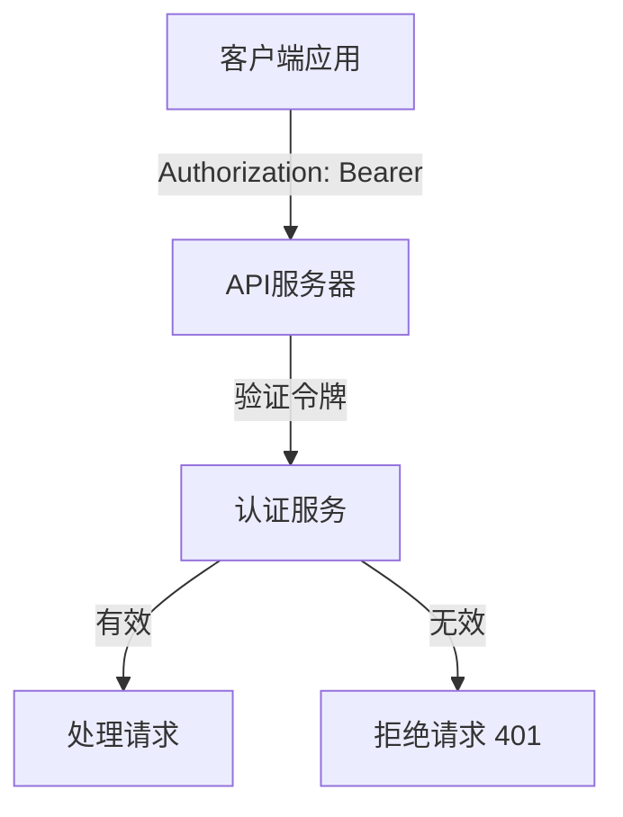

# RESTful API

<cite>
**本文档中引用的文件**  
- [main.go](file://cmd/council/main.go)
- [agent.go](file://internal/api/handler/agent.go)
- [group.go](file://internal/api/handler/group.go)
- [workflow.go](file://internal/api/handler/workflow.go)
- [workflow_mgmt.go](file://internal/api/handler/workflow_mgmt.go)
- [template.go](file://internal/api/handler/template.go)
- [memory.go](file://internal/api/handler/memory.go)
- [llm.go](file://internal/api/handler/llm.go)
- [types.go](file://internal/core/workflow/types.go)
- [config.go](file://internal/pkg/config/config.go)
</cite>

## 目录
1. [简介](#简介)
2. [API版本控制与认证](#api版本控制与认证)
3. 智能体管理
   - [创建智能体](#创建智能体)
   - [获取智能体列表](#获取智能体列表)
   - [获取单个智能体](#获取单个智能体)
   - [更新智能体](#更新智能体)
   - [删除智能体](#删除智能体)
4. 群组管理
   - [创建群组](#创建群组)
   - [获取群组列表](#获取群组列表)
   - [获取单个群组](#获取单个群组)
   - [更新群组](#更新群组)
   - [删除群组](#删除群组)
5. 工作流管理
   - [获取工作流列表](#获取工作流列表)
   - [获取单个工作流](#获取单个工作流)
   - [创建工作流](#创建工作流)
   - [更新工作流](#更新工作流)
   - [生成工作流](#生成工作流)
   - [估算工作流成本](#估算工作流成本)
6. 工作流执行控制
   - [执行工作流](#执行工作流)
   - [控制会话](#控制会话)
   - [发送信号](#发送信号)
   - [人工审核](#人工审核)
7. 模板管理
   - [获取模板列表](#获取模板列表)
   - [创建模板](#创建模板)
   - [删除模板](#删除模板)
8. 记忆系统
   - [摄入记忆](#摄入记忆)
   - [查询记忆](#查询记忆)
9. LLM提供商
   - [获取提供商选项](#获取提供商选项)

## 简介
本API文档详细描述了The Council后端系统提供的所有公开HTTP端点。该系统是一个AI驱动的协作平台，支持多智能体工作流、记忆系统和复杂决策流程。API基于RESTful设计原则，使用JSON作为数据交换格式，并通过WebSocket提供实时事件流。

**Section sources**
- [main.go](file://cmd/council/main.go#L98-L143)

## API版本控制与认证
所有API端点均通过`/api/v1`前缀进行版本控制，确保向后兼容性。请求必须包含有效的JWT令牌进行认证。



**Diagram sources**
- [main.go](file://cmd/council/main.go#L102)

## 智能体管理

### 创建智能体
创建一个新的AI智能体。

**HTTP方法**: `POST`  
**URL路径**: `/api/v1/agents`  
**请求头**: `Authorization: Bearer <JWT>`  
**请求体**:
```json
{
  "name": "研究员",
  "avatar": "https://example.com/avatar.png",
  "description": "负责研究和分析",
  "persona_prompt": "你是一位资深研究员...",
  "model_config": {
    "provider": "openai",
    "model": "gpt-4o",
    "temperature": 0.7,
    "top_p": 0.9,
    "max_tokens": 2000
  },
  "capabilities": {
    "web_search": true,
    "search_provider": "tavily",
    "code_execution": false
  }
}
```

**响应格式**:
```json
{
  "id": "uuid",
  "name": "研究员",
  "avatar": "https://example.com/avatar.png",
  "description": "负责研究和分析",
  "persona_prompt": "你是一位资深研究员...",
  "model_config": {
    "provider": "openai",
    "model": "gpt-4o",
    "temperature": 0.7,
    "top_p": 0.9,
    "max_tokens": 2000
  },
  "capabilities": {
    "web_search": true,
    "search_provider": "tavily",
    "code_execution": false
  },
  "created_at": "2025-12-21T10:00:00Z",
  "updated_at": "2025-12-21T10:00:00Z"
}
```

**可能的错误码**:
- `400`: 请求体验证失败
- `401`: 未授权
- `500`: 服务器内部错误

**curl命令示例**:
```bash
curl -X POST https://api.council.com/api/v1/agents \
  -H "Authorization: Bearer <JWT>" \
  -H "Content-Type: application/json" \
  -d '{
    "name": "研究员",
    "description": "负责研究和分析",
    "persona_prompt": "你是一位资深研究员...",
    "model_config": {
      "provider": "openai",
      "model": "gpt-4o",
      "temperature": 0.7,
      "top_p": 0.9,
      "max_tokens": 2000
    },
    "capabilities": {
      "web_search": true,
      "search_provider": "tavily",
      "code_execution": false
    }
  }'
```

**Section sources**
- [agent.go](file://internal/api/handler/agent.go#L19-L31)

### 获取智能体列表
获取所有智能体的列表。

**HTTP方法**: `GET`  
**URL路径**: `/api/v1/agents`  
**请求头**: `Authorization: Bearer <JWT>`

**响应格式**:
```json
[
  {
    "id": "uuid",
    "name": "研究员",
    "avatar": "https://example.com/avatar.png",
    "description": "负责研究和分析",
    "persona_prompt": "你是一位资深研究员...",
    "model_config": {
      "provider": "openai",
      "model": "gpt-4o",
      "temperature": 0.7,
      "top_p": 0.9,
      "max_tokens": 2000
    },
    "capabilities": {
      "web_search": true,
      "search_provider": "tavily",
      "code_execution": false
    },
    "created_at": "2025-12-21T10:00:00Z",
    "updated_at": "2025-12-21T10:00:00Z"
  }
]
```

**可能的错误码**:
- `401`: 未授权
- `500`: 服务器内部错误

**Section sources**
- [agent.go](file://internal/api/handler/agent.go#L51-L58)

### 获取单个智能体
根据ID获取单个智能体。

**HTTP方法**: `GET`  
**URL路径**: `/api/v1/agents/:id`  
**请求头**: `Authorization: Bearer <JWT>`

**响应格式**:
```json
{
  "id": "uuid",
  "name": "研究员",
  "avatar": "https://example.com/avatar.png",
  "description": "负责研究和分析",
  "persona_prompt": "你是一位资深研究员...",
  "model_config": {
    "provider": "openai",
    "model": "gpt-4o",
    "temperature": 0.7,
    "top_p": 0.9,
    "max_tokens": 2000
  },
  "capabilities": {
    "web_search": true,
    "search_provider": "tavily",
    "code_execution": false
  },
  "created_at": "2025-12-21T10:00:00Z",
  "updated_at": "2025-12-21T10:00:00Z"
}
```

**可能的错误码**:
- `400`: ID格式无效
- `401`: 未授权
- `404`: 智能体未找到
- `500`: 服务器内部错误

**Section sources**
- [agent.go](file://internal/api/handler/agent.go#L34-L48)

### 更新智能体
根据ID更新智能体。

**HTTP方法**: `PUT`  
**URL路径**: `/api/v1/agents/:id`  
**请求头**: `Authorization: Bearer <JWT>`  
**请求体**: 与创建智能体相同

**响应格式**: 与获取单个智能体相同

**可能的错误码**:
- `400`: ID格式无效或请求体验证失败
- `401`: 未授权
- `500`: 服务器内部错误

**Section sources**
- [agent.go](file://internal/api/handler/agent.go#L61-L81)

### 删除智能体
根据ID删除智能体。

**HTTP方法**: `DELETE`  
**URL路径**: `/api/v1/agents/:id`  
**请求头**: `Authorization: Bearer <JWT>`

**响应状态**: `204 No Content`

**可能的错误码**:
- `400`: ID格式无效
- `401`: 未授权
- `500`: 服务器内部错误

**Section sources**
- [agent.go](file://internal/api/handler/agent.go#L84-L97)

## 群组管理

### 创建群组
创建一个新的协作群组。

**HTTP方法**: `POST`  
**URL路径**: `/api/v1/groups`  
**请求头**: `Authorization: Bearer <JWT>`  
**请求体**:
```json
{
  "name": "项目A",
  "icon": "https://example.com/icon.png",
  "system_prompt": "这是一个项目群组...",
  "default_agent_ids": ["uuid1", "uuid2"]
}
```

**响应格式**:
```json
{
  "id": "uuid",
  "name": "项目A",
  "icon": "https://example.com/icon.png",
  "system_prompt": "这是一个项目群组...",
  "default_agent_ids": ["uuid1", "uuid2"],
  "created_at": "2025-12-21T10:00:00Z",
  "updated_at": "2025-12-21T10:00:00Z"
}
```

**可能的错误码**:
- `400`: 请求体验证失败
- `401`: 未授权
- `500`: 服务器内部错误

**Section sources**
- [group.go](file://internal/api/handler/group.go#L19-L31)

### 获取群组列表
获取所有群组的列表。

**HTTP方法**: `GET`  
**URL路径**: `/api/v1/groups`  
**请求头**: `Authorization: Bearer <JWT>`

**响应格式**:
```json
[
  {
    "id": "uuid",
    "name": "项目A",
    "icon": "https://example.com/icon.png",
    "system_prompt": "这是一个项目群组...",
    "default_agent_ids": ["uuid1", "uuid2"],
    "created_at": "2025-12-21T10:00:00Z",
    "updated_at": "2025-12-21T10:00:00Z"
  }
]
```

**可能的错误码**:
- `401`: 未授权
- `500`: 服务器内部错误

**Section sources**
- [group.go](file://internal/api/handler/group.go#L51-L58)

### 获取单个群组
根据ID获取单个群组。

**HTTP方法**: `GET`  
**URL路径**: `/api/v1/groups/:id`  
**请求头**: `Authorization: Bearer <JWT>`

**响应格式**:
```json
{
  "id": "uuid",
  "name": "项目A",
  "icon": "https://example.com/icon.png",
  "system_prompt": "这是一个项目群组...",
  "default_agent_ids": ["uuid1", "uuid2"],
  "created_at": "2025-12-21T10:00:00Z",
  "updated_at": "2025-12-21T10:00:00Z"
}
```

**可能的错误码**:
- `400`: ID格式无效
- `401`: 未授权
- `404`: 群组未找到
- `500`: 服务器内部错误

**Section sources**
- [group.go](file://internal/api/handler/group.go#L34-L48)

### 更新群组
根据ID更新群组。

**HTTP方法**: `PUT`  
**URL路径**: `/api/v1/groups/:id`  
**请求头**: `Authorization: Bearer <JWT>`  
**请求体**: 与创建群组相同

**响应格式**: 与获取单个群组相同

**可能的错误码**:
- `400`: ID格式无效或请求体验证失败
- `401`: 未授权
- `500`: 服务器内部错误

**Section sources**
- [group.go](file://internal/api/handler/group.go#L61-L81)

### 删除群组
根据ID删除群组。

**HTTP方法**: `DELETE`  
**URL路径**: `/api/v1/groups/:id`  
**请求头**: `Authorization: Bearer <JWT>`

**响应状态**: `204 No Content`

**可能的错误码**:
- `400`: ID格式无效
- `401`: 未授权
- `500`: 服务器内部错误

**Section sources**
- [group.go](file://internal/api/handler/group.go#L84-L97)

## 工作流管理

### 获取工作流列表
获取所有工作流的列表。

**HTTP方法**: `GET`  
**URL路径**: `/api/v1/workflows`  
**请求头**: `Authorization: Bearer <JWT>`

**响应格式**:
```json
[
  {
    "id": "uuid",
    "name": "决策流程",
    "updated_at": "2025-12-21T10:00:00Z"
  }
]
```

**可能的错误码**:
- `401`: 未授权
- `500`: 服务器内部错误

**Section sources**
- [workflow_mgmt.go](file://internal/api/handler/workflow_mgmt.go#L37-L53)

### 获取单个工作流
根据ID获取单个工作流定义。

**HTTP方法**: `GET`  
**URL路径**: `/api/v1/workflows/:id`  
**请求头**: `Authorization: Bearer <JWT>`

**响应格式**:
```json
{
  "id": "uuid",
  "name": "决策流程",
  "description": "一个决策工作流",
  "start_node_id": "start",
  "nodes": {
    "start": {
      "id": "start",
      "type": "start",
      "name": "开始",
      "next_ids": ["agent1"]
    }
  }
}
```

**可能的错误码**:
- `401`: 未授权
- `404`: 工作流未找到
- `500`: 服务器内部错误

**Section sources**
- [workflow_mgmt.go](file://internal/api/handler/workflow_mgmt.go#L57-L65)

### 创建工作流
创建一个新的工作流。

**HTTP方法**: `POST`  
**URL路径**: `/api/v1/workflows`  
**请求头**: `Authorization: Bearer <JWT>`  
**请求体**:
```json
{
  "id": "uuid",
  "name": "决策流程",
  "description": "一个决策工作流",
  "start_node_id": "start",
  "nodes": {
    "start": {
      "id": "start",
      "type": "start",
      "name": "开始",
      "next_ids": ["agent1"]
    }
  }
}
```

**响应格式**: 与获取单个工作流相同

**可能的错误码**:
- `400`: 请求体验证失败
- `401`: 未授权
- `500`: 服务器内部错误

**Section sources**
- [workflow_mgmt.go](file://internal/api/handler/workflow_mgmt.go#L69-L85)

### 更新工作流
根据ID更新工作流。

**HTTP方法**: `PUT`  
**URL路径**: `/api/v1/workflows/:id`  
**请求头**: `Authorization: Bearer <JWT>`  
**请求体**: 与创建工作流相同

**响应格式**: 与获取单个工作流相同

**可能的错误码**:
- `400`: 请求体验证失败
- `401`: 未授权
- `404`: 工作流未找到
- `500`: 服务器内部错误

**Section sources**
- [workflow_mgmt.go](file://internal/api/handler/workflow_mgmt.go#L89-L107)

### 生成工作流
根据自然语言提示生成工作流。

**HTTP方法**: `POST`  
**URL路径**: `/api/v1/workflows/generate`  
**请求头**: `Authorization: Bearer <JWT>`  
**请求体**:
```json
{
  "prompt": "创建一个包含研究、讨论和决策的流程"
}
```

**响应格式**:
```json
{
  "graph": {
    "id": "",
    "name": "生成的工作流",
    "description": "根据提示生成",
    "start_node_id": "start",
    "nodes": {
      "start": {
        "id": "start",
        "type": "start",
        "name": "开始",
        "next_ids": ["research"]
      }
    }
  },
  "explanation": "根据您的提示生成了工作流。"
}
```

**可能的错误码**:
- `400`: 请求体验证失败
- `401`: 未授权
- `500`: 服务器内部错误

**Section sources**
- [workflow_mgmt.go](file://internal/api/handler/workflow_mgmt.go#L111-L187)

### 估算工作流成本
估算工作流的执行成本。

**HTTP方法**: `POST`  
**URL路径**: `/api/v1/workflows/estimate`  
**请求头**: `Authorization: Bearer <JWT>`  
**请求体**: 工作流定义

**响应格式**:
```json
{
  "estimated_cost": 0.15,
  "token_usage": {
    "input": 1000,
    "output": 500
  }
}
```

**可能的错误码**:
- `400`: 请求体验证失败
- `401`: 未授权
- `500`: 服务器内部错误

**Section sources**
- [workflow_mgmt.go](file://internal/api/handler/workflow_mgmt.go#L191-L217)

## 工作流执行控制

### 执行工作流
执行一个工作流。

**HTTP方法**: `POST`  
**URL路径**: `/api/v1/workflows/execute`  
**请求头**: `Authorization: Bearer <JWT>`  
**请求体**:
```json
{
  "graph": {
    "id": "uuid",
    "name": "决策流程",
    "description": "一个决策工作流",
    "start_node_id": "start",
    "nodes": {
      "start": {
        "id": "start",
        "type": "start",
        "name": "开始",
        "next_ids": ["agent1"]
      }
    }
  },
  "input": {
    "topic": "新功能设计"
  }
}
```

**响应格式**:
```json
{
  "session_id": "uuid",
  "status": "started"
}
```

**可能的错误码**:
- `400`: 请求体验证失败
- `401`: 未授权
- `500`: 服务器内部错误

**Section sources**
- [workflow.go](file://internal/api/handler/workflow.go#L58-L122)

### 控制会话
控制工作流会话的执行。

**HTTP方法**: `POST`  
**URL路径**: `/api/v1/sessions/:id/control`  
**请求头**: `Authorization: Bearer <JWT>`  
**请求体**:
```json
{
  "action": "pause"
}
```

**响应格式**:
```json
{
  "id": "uuid",
  "status": "paused",
  "action": "pause"
}
```

**可能的错误码**:
- `400`: 请求体验证失败
- `401`: 未授权
- `404`: 会话未找到
- `500`: 服务器内部错误

**Section sources**
- [workflow.go](file://internal/api/handler/workflow.go#L129-L165)

### 发送信号
向工作流节点发送信号。

**HTTP方法**: `POST`  
**URL路径**: `/api/v1/sessions/:id/signal`  
**请求头**: `Authorization: Bearer <JWT>`  
**请求体**:
```json
{
  "node_id": "human_review",
  "payload": {
    "decision": "approve"
  }
}
```

**响应格式**:
```json
{
  "status": "signal_sent"
}
```

**可能的错误码**:
- `400`: 请求体验证失败
- `401`: 未授权
- `404`: 会话未找到
- `500`: 服务器内部错误

**Section sources**
- [workflow.go](file://internal/api/handler/workflow.go#L180-L200)

### 人工审核
处理人工审核节点。

**HTTP方法**: `POST`  
**URL路径**: `/api/v1/sessions/:id/review`  
**请求头**: `Authorization: Bearer <JWT>`  
**请求体**:
```json
{
  "node_id": "human_review",
  "action": "approve",
  "data": {
    "comments": "批准"
  }
}
```

**响应格式**:
```json
{
  "status": "resumed"
}
```

**可能的错误码**:
- `400`: 请求体验证失败
- `401`: 未授权
- `404`: 会话未找到
- `500`: 服务器内部错误

**Section sources**
- [workflow.go](file://internal/api/handler/workflow.go#L209-L244)

## 模板管理

### 获取模板列表
获取所有模板的列表。

**HTTP方法**: `GET`  
**URL路径**: `/api/v1/templates`  
**请求头**: `Authorization: Bearer <JWT>`

**响应格式**:
```json
[
  {
    "id": "uuid",
    "name": "代码审查",
    "description": "代码审查模板",
    "category": "code_review",
    "is_system": true,
    "graph": {
      "id": "uuid",
      "name": "代码审查",
      "description": "代码审查模板",
      "start_node_id": "start",
      "nodes": {}
    },
    "created_at": "2025-12-21T10:00:00Z",
    "updated_at": "2025-12-21T10:00:00Z"
  }
]
```

**可能的错误码**:
- `401`: 未授权
- `500`: 服务器内部错误

**Section sources**
- [template.go](file://internal/api/handler/template.go#L20-L26)

### 创建模板
创建一个新的模板。

**HTTP方法**: `POST`  
**URL路径**: `/api/v1/templates`  
**请求头**: `Authorization: Bearer <JWT>`  
**请求体**:
```json
{
  "name": "代码审查",
  "description": "代码审查模板",
  "category": "code_review",
  "graph": {
    "id": "uuid",
    "name": "代码审查",
    "description": "代码审查模板",
    "start_node_id": "start",
    "nodes": {}
  }
}
```

**响应格式**: 与获取模板列表中的单个模板相同

**可能的错误码**:
- `400`: 请求体验证失败
- `401`: 未授权
- `500`: 服务器内部错误

**Section sources**
- [template.go](file://internal/api/handler/template.go#L29-L57)

### 删除模板
根据ID删除模板。

**HTTP方法**: `DELETE`  
**URL路径**: `/api/v1/templates/:id`  
**请求头**: `Authorization: Bearer <JWT>`

**响应格式**:
```json
{
  "status": "deleted"
}
```

**可能的错误码**:
- `401`: 未授权
- `500`: 服务器内部错误

**Section sources**
- [template.go](file://internal/api/handler/template.go#L60-L66)

## 记忆系统

### 摄入记忆
将内容摄入记忆系统。

**HTTP方法**: `POST`  
**URL路径**: `/api/v1/memory/ingest`  
**请求头**: `Authorization: Bearer <JWT>`  
**请求体**:
```json
{
  "group_id": "uuid",
  "content": "项目A的讨论记录"
}
```

**响应格式**:
```json
{
  "status": "ingested"
}
```

**可能的错误码**:
- `400`: 请求体验证失败
- `401`: 未授权
- `500`: 服务器内部错误

**Section sources**
- [memory.go](file://internal/api/handler/memory.go#L25-L42)

### 查询记忆
查询记忆系统。

**HTTP方法**: `POST`  
**URL路径**: `/api/v1/memory/query`  
**请求头**: `Authorization: Bearer <JWT>`  
**请求体**:
```json
{
  "group_id": "uuid",
  "query": "项目A的讨论记录"
}
```

**响应格式**:
```json
{
  "results": [
    {
      "content": "项目A的讨论记录",
      "score": 0.95
    }
  ]
}
```

**可能的错误码**:
- `400`: 请求体验证失败
- `401`: 未授权
- `500`: 服务器内部错误

**Section sources**
- [memory.go](file://internal/api/handler/memory.go#L50-L66)

## LLM提供商

### 获取提供商选项
获取可用的LLM提供商和模型。

**HTTP方法**: `GET`  
**URL路径**: `/api/v1/llm/providers`  
**请求头**: `Authorization: Bearer <JWT>`

**响应格式**:
```json
{
  "providers": [
    {
      "id": "openai",
      "name": "OpenAI",
      "icon": "openai-icon",
      "models": ["gpt-4o", "gpt-3.5-turbo"]
    }
  ]
}
```

**可能的错误码**:
- `401`: 未授权
- `500`: 服务器内部错误

**Section sources**
- [llm.go](file://internal/api/handler/llm.go#L32-L104)