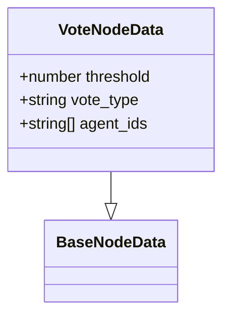
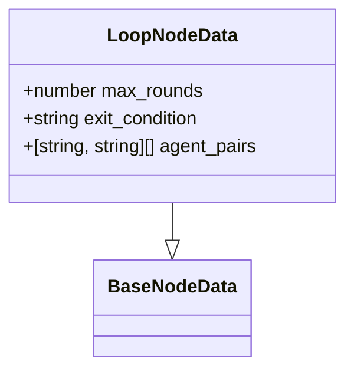
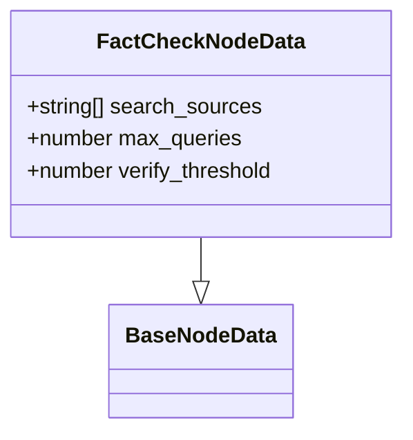
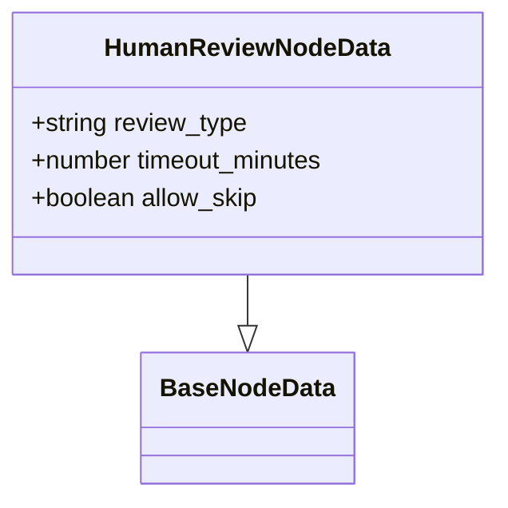
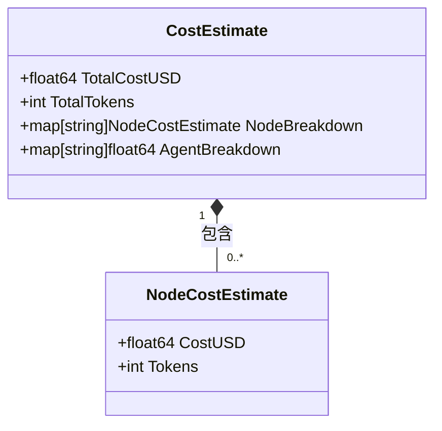

# 工作流管理

<cite>
**本文档中引用的文件**  
- [main.go](file://cmd/council/main.go)
- [workflow_mgmt.go](file://internal/api/handler/workflow_mgmt.go)
- [workflow.go](file://internal/api/handler/workflow.go)
- [types.go](file://internal/core/workflow/types.go)
- [factory.go](file://internal/core/workflow/nodes/factory.go)
- [start.go](file://internal/core/workflow/nodes/start.go)
- [end.go](file://internal/core/workflow/nodes/end.go)
- [vote.go](file://internal/core/workflow/nodes/vote.go)
- [loop.go](file://internal/core/workflow/nodes/loop.go)
- [fact_check.go](file://internal/core/workflow/nodes/fact_check.go)
- [human_review.go](file://internal/core/workflow/nodes/human_review.go)
- [engine.go](file://internal/core/workflow/engine.go)
- [cost.go](file://internal/core/workflow/cost.go)
- [workflow.ts](file://frontend/src/types/workflow.ts)
- [CustomNodes.tsx](file://frontend/src/components/workflow/nodes/CustomNodes.tsx)
- [SPEC-603-default-workflows.md](file://docs/specs/sprint6/SPEC-603-default-workflows.md)
- [SPEC-407-cost-estimation-api.md](file://docs/specs/backend/SPEC-407-cost-estimation-api.md)
</cite>

## 目录
1. [简介](#简介)
2. [核心端点](#核心端点)
3. [GraphDefinition 数据结构](#graphdefinition-数据结构)
4. [节点类型详解](#节点类型详解)
5. [参数验证与错误处理](#参数验证与错误处理)
6. [高级功能](#高级功能)
7. [使用示例](#使用示例)

## 简介
本API文档详细介绍了工作流管理系统的全生命周期操作。该系统支持创建、读取、更新和执行复杂的工作流，这些工作流由多种节点类型组成，包括开始、智能体、投票、循环、事实核查和人工审核等。工作流通过JSON定义，并可通过REST API进行管理。系统还支持通过自然语言生成工作流以及成本预估等高级功能。

**Section sources**
- [main.go](file://cmd/council/main.go#L98-L143)

## 核心端点
工作流管理API提供了以下核心端点来管理工作流的全生命周期：

### GET /api/v1/workflows
列出所有可用的工作流。返回一个包含工作流ID、名称和更新时间的列表。

**Section sources**
- [workflow_mgmt.go](file://internal/api/handler/workflow_mgmt.go#L37-L53)

### GET /api/v1/workflows/:id
获取指定ID的工作流定义。返回完整的GraphDefinition对象。

**Section sources**
- [workflow_mgmt.go](file://internal/api/handler/workflow_mgmt.go#L57-L65)

### POST /api/v1/workflows
创建一个新的工作流。请求体应包含一个GraphDefinition对象。如果请求中未提供ID，系统将自动生成一个UUID。

**Section sources**
- [workflow_mgmt.go](file://internal/api/handler/workflow_mgmt.go#L69-L85)

### PUT /api/v1/workflows/:id
更新一个现有的工作流。请求体应包含一个GraphDefinition对象，其ID将被设置为URL中的ID。

**Section sources**
- [workflow_mgmt.go](file://internal/api/handler/workflow_mgmt.go#L89-L107)

## GraphDefinition 数据结构
`GraphDefinition`是工作流的核心数据结构，它定义了工作流的静态结构。

```mermaid
classDiagram
class GraphDefinition {
+string ID
+string Name
+string Description
+string StartNodeID
+map[string]*Node Nodes
}
class Node {
+string ID
+NodeType Type
+string Name
+[]string NextIDs
+map[string]interface{} Properties
}
GraphDefinition "1" *-- "0..*" Node : 包含
```

**Diagram sources**
- [types.go](file://internal/core/workflow/types.go#L44-L59)

**Section sources**
- [types.go](file://internal/core/workflow/types.go#L44-L59)

## 节点类型详解
工作流由多种类型的节点组成，每种节点都有特定的功能和属性。

### Start 节点
`Start`节点是工作流的入口点。它负责解析输入数据，如提案和附件，并将它们组合成一个上下文。

**Section sources**
- [start.go](file://internal/core/workflow/nodes/start.go#L13-L52)

### Agent 节点
`Agent`节点代表一个智能体，它会根据配置的agent_id执行特定的任务。该节点的属性中必须包含`agent_id`。

**Section sources**
- [factory.go](file://internal/core/workflow/nodes/factory.go#L50-L60)

### Vote 节点
`Vote`节点用于对多个输入进行投票决策。它根据配置的阈值（threshold）和投票类型（vote_type）来决定是否通过。



**Diagram sources**
- [workflow.ts](file://frontend/src/types/workflow.ts#L15-L19)

**Section sources**
- [vote.go](file://internal/core/workflow/nodes/vote.go#L15-L69)

### Loop 节点
`Loop`节点用于实现循环逻辑。它根据配置的最大轮数（max_rounds）或退出分数（exit_on_score）来决定是否继续循环。



**Diagram sources**
- [workflow.ts](file://frontend/src/types/workflow.ts#L21-L25)

**Section sources**
- [loop.go](file://internal/core/workflow/nodes/loop.go#L15-L66)

### FactCheck 节点
`FactCheck`节点用于验证内容的真实性。它会调用搜索引擎获取相关信息，并使用LLM来判断内容的准确性。



**Diagram sources**
- [workflow.ts](file://frontend/src/types/workflow.ts#L27-L31)

**Section sources**
- [fact_check.go](file://internal/core/workflow/nodes/fact_check.go#L20-L113)

### HumanReview 节点
`HumanReview`节点用于在工作流中插入人工审核步骤。当执行到此节点时，工作流会暂停，等待人工输入。



**Diagram sources**
- [workflow.ts](file://frontend/src/types/workflow.ts#L33-L37)

**Section sources**
- [human_review.go](file://internal/core/workflow/nodes/human_review.go#L15-L46)

### End 节点
`End`节点是工作流的结束点。它负责生成最终报告，通常会调用LLM来总结整个工作流的输出。

**Section sources**
- [end.go](file://internal/core/workflow/nodes/end.go#L19-L113)

## 参数验证与错误处理
API实现了严格的参数验证和错误处理机制。

### 参数验证
所有请求都通过Gin框架的`ShouldBindJSON`方法进行验证。例如，在创建或更新工作流时，系统会验证请求体是否符合GraphDefinition的结构。

**Section sources**
- [workflow_mgmt.go](file://internal/api/handler/workflow_mgmt.go#L71-L73)

### 错误处理
API返回标准化的错误响应，包括以下HTTP状态码：
- **400 Bad Request**: 请求参数无效或缺失
- **404 Not Found**: 请求的资源不存在
- **500 Internal Server Error**: 服务器内部错误

**Section sources**
- [workflow_mgmt.go](file://internal/api/handler/workflow_mgmt.go#L41-L42)
- [workflow_mgmt.go](file://internal/api/handler/workflow_mgmt.go#L62-L63)
- [workflow_mgmt.go](file://internal/api/handler/workflow_mgmt.go#L82-L83)

## 高级功能
系统提供了两个高级功能：工作流生成和成本预估。

### 工作流生成 (/generate)
`POST /api/v1/workflows/generate`端点允许用户通过自然语言描述来生成工作流。系统会调用LLM将描述转换为JSON格式的GraphDefinition。

**Section sources**
- [workflow_mgmt.go](file://internal/api/handler/workflow_mgmt.go#L111-L187)

### 成本预估 (/estimate)
`POST /api/v1/workflows/estimate`端点可以预估执行一个工作流的成本。系统会根据工作流中使用的模型和节点类型来计算总成本。



**Diagram sources**
- [cost.go](file://internal/core/workflow/cost.go#L76-L81)

**Section sources**
- [cost.go](file://internal/core/workflow/cost.go#L20-L39)
- [SPEC-407-cost-estimation-api.md](file://docs/specs/backend/SPEC-407-cost-estimation-api.md#L1-L31)

## 使用示例
以下是一个创建包含多智能体辩论逻辑的工作流的curl示例。

### 创建辩论工作流
```bash
curl -X POST http://localhost:8080/api/v1/workflows \
  -H "Content-Type: application/json" \
  -d '{
    "id": "council_debate",
    "name": "Council Debate",
    "start_node_id": "start",
    "nodes": {
      "start": {
        "id": "start",
        "type": "start",
        "name": "Input Document",
        "next_ids": ["parallel_analysis"]
      },
      "parallel_analysis": {
        "id": "parallel_analysis",
        "type": "parallel",
        "name": "Parallel Analysis",
        "next_ids": ["agent_affirmative", "agent_negative"]
      },
      "agent_affirmative": {
        "id": "agent_affirmative",
        "type": "agent",
        "name": "Affirmative",
        "properties": {"agent_id": "system_affirmative"},
        "next_ids": ["agent_adjudicator"]
      },
      "agent_negative": {
        "id": "agent_negative",
        "type": "agent",
        "name": "Negative",
        "properties": {"agent_id": "system_negative"},
        "next_ids": ["agent_adjudicator"]
      },
      "agent_adjudicator": {
        "id": "agent_adjudicator",
        "type": "agent",
        "name": "Adjudicator",
        "properties": {"agent_id": "system_adjudicator"},
        "next_ids": ["end"]
      },
      "end": {
        "id": "end",
        "type": "end",
        "name": "Generate Report"
      }
    }
  }'
```

**Section sources**
- [SPEC-603-default-workflows.md](file://docs/specs/sprint6/SPEC-603-default-workflows.md#L13-L134)