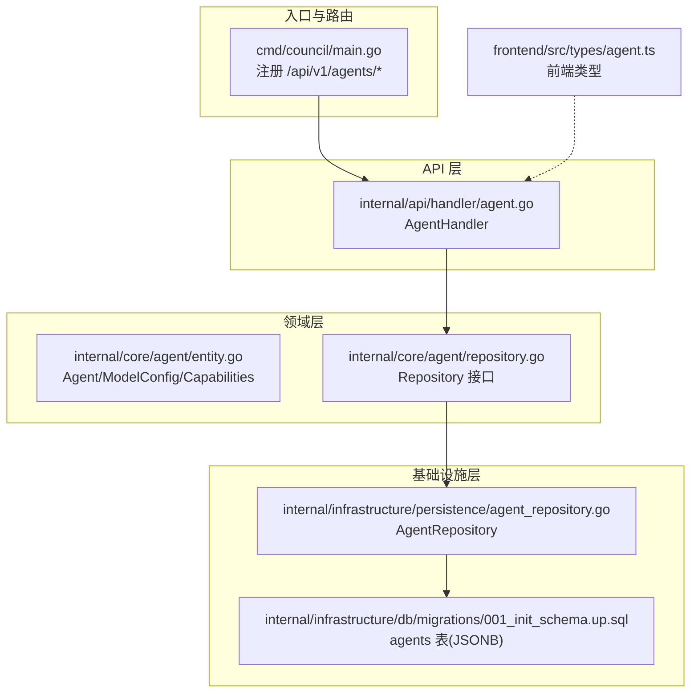
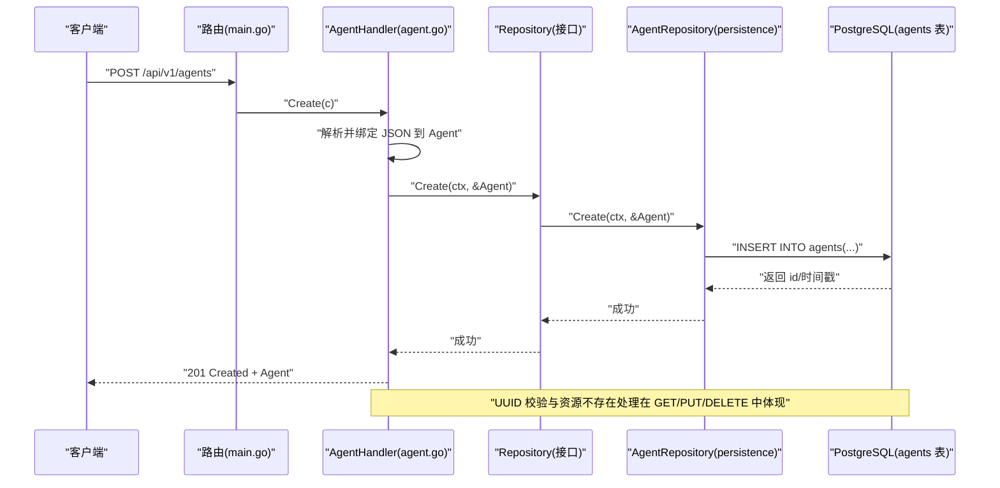
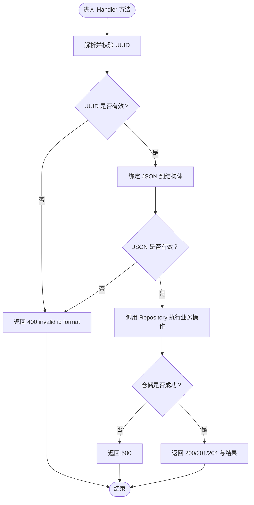
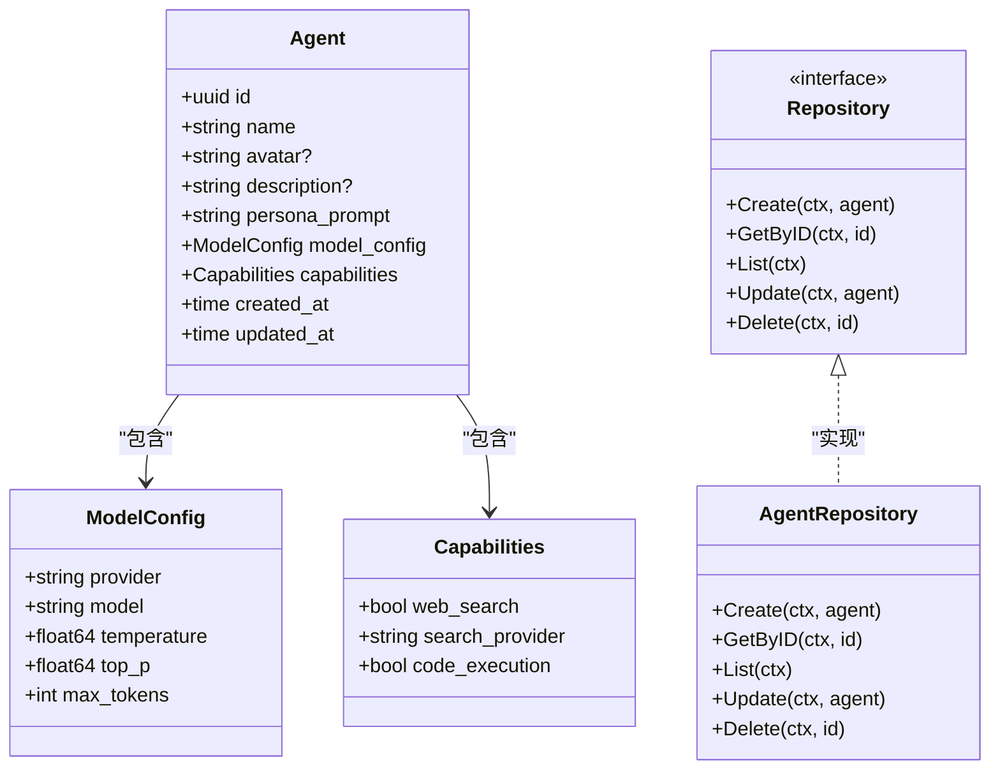
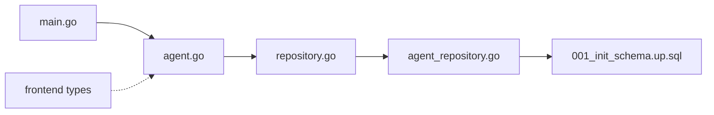

# 智能体管理

<cite>
**本文引用的文件**
- [cmd/council/main.go](file://cmd/council/main.go)
- [internal/api/handler/agent.go](file://internal/api/handler/agent.go)
- [internal/core/agent/entity.go](file://internal/core/agent/entity.go)
- [internal/core/agent/repository.go](file://internal/core/agent/repository.go)
- [internal/infrastructure/persistence/agent_repository.go](file://internal/infrastructure/persistence/agent_repository.go)
- [internal/infrastructure/db/migrations/001_init_schema.up.sql](file://internal/infrastructure/db/migrations/001_init_schema.up.sql)
- [internal/infrastructure/mocks/agent_mock.go](file://internal/infrastructure/mocks/agent_mock.go)
- [frontend/src/types/agent.ts](file://frontend/src/types/agent.ts)
- [internal/resources/seeder.go](file://internal/resources/seeder.go)
</cite>

## 目录
1. [简介](#简介)
2. [项目结构](#项目结构)
3. [核心组件](#核心组件)
4. [架构总览](#架构总览)
5. [详细组件分析](#详细组件分析)
6. [依赖关系分析](#依赖关系分析)
7. [性能考量](#性能考量)
8. [故障排查指南](#故障排查指南)
9. [结论](#结论)
10. [附录](#附录)

## 简介
本文件面向后端开发者与集成者，系统化梳理“智能体管理”API的端到端实现，覆盖创建、查询、列表、更新与删除五类操作；同时给出 Agent 实体的 JSON Schema 定义、UUID 格式校验与资源不存在的错误处理策略，并通过序列图与流程图直观展示后端 Handler 如何调用仓储层进行持久化。

## 项目结构
围绕智能体管理的核心代码分布如下：
- 路由注册：在主程序中将 /api/v1/agents 的各 HTTP 方法绑定到对应处理器
- 处理器：AgentHandler 提供 Create、Get、List、Update、Delete 五个方法
- 领域模型：Agent、ModelConfig、Capabilities 的结构定义
- 仓储接口：Repository 定义 CRUD 操作契约
- 数据访问：AgentRepository 使用 PostgreSQL 实现仓储接口
- 数据库迁移：agents 表包含 JSONB 字段存储 model_config 与 capabilities
- 前端类型：前端侧 Agent 类型与 CreateAgentInput 与后端保持一致
- 种子数据：seeder 将默认智能体写入数据库，体现 model_config 默认值

图表来源
- [cmd/council/main.go](file://cmd/council/main.go#L97-L110)
- [internal/api/handler/agent.go](file://internal/api/handler/agent.go#L1-L99)
- [internal/core/agent/entity.go](file://internal/core/agent/entity.go#L1-L37)
- [internal/core/agent/repository.go](file://internal/core/agent/repository.go#L1-L17)
- [internal/infrastructure/persistence/agent_repository.go](file://internal/infrastructure/persistence/agent_repository.go#L1-L116)
- [internal/infrastructure/db/migrations/001_init_schema.up.sql](file://internal/infrastructure/db/migrations/001_init_schema.up.sql#L15-L26)
- [frontend/src/types/agent.ts](file://frontend/src/types/agent.ts#L1-L34)

章节来源
- [cmd/council/main.go](file://cmd/council/main.go#L97-L110)

## 核心组件
- Agent 实体与 JSON Schema
  - 字段概览：id、name、avatar、description、persona_prompt、model_config、capabilities、created_at、updated_at
  - JSON Schema 关键字段
    - id：字符串，UUID 格式
    - name：字符串，必填
    - avatar：字符串，可空
    - description：字符串，可空
    - persona_prompt：字符串，必填
    - model_config：对象，包含 provider、model、temperature、top_p、max_tokens
    - capabilities：对象，包含 web_search、search_provider、code_execution
    - created_at、updated_at：时间戳字符串
  - 数据库映射：agents 表的 model_config 与 capabilities 为 JSONB，默认值见迁移脚本
- Repository 接口：定义 Create、GetByID、List、Update、Delete 五个方法
- AgentRepository：基于 PostgreSQL 的实现，负责 SQL 插入、查询、更新、删除

章节来源
- [internal/core/agent/entity.go](file://internal/core/agent/entity.go#L1-L37)
- [internal/core/agent/repository.go](file://internal/core/agent/repository.go#L1-L17)
- [internal/infrastructure/persistence/agent_repository.go](file://internal/infrastructure/persistence/agent_repository.go#L23-L116)
- [internal/infrastructure/db/migrations/001_init_schema.up.sql](file://internal/infrastructure/db/migrations/001_init_schema.up.sql#L15-L26)
- [frontend/src/types/agent.ts](file://frontend/src/types/agent.ts#L1-L34)

## 架构总览
从请求到持久化的整体调用链如下：

图表来源
- [cmd/council/main.go](file://cmd/council/main.go#L97-L110)
- [internal/api/handler/agent.go](file://internal/api/handler/agent.go#L19-L32)
- [internal/core/agent/repository.go](file://internal/core/agent/repository.go#L1-L17)
- [internal/infrastructure/persistence/agent_repository.go](file://internal/infrastructure/persistence/agent_repository.go#L23-L40)

## 详细组件分析

### API 端点与行为
- POST /api/v1/agents
  - 请求体：Agent 对象（除 id 外）
  - 成功：201 Created，返回完整 Agent
  - 错误：400 JSON 解析失败；500 仓储错误
- GET /api/v1/agents
  - 成功：200 OK，返回 Agent 数组
  - 错误：500 仓储错误
- GET /api/v1/agents/:id
  - 参数：id（UUID）
  - 成功：200 OK，返回 Agent
  - 错误：400 UUID 格式无效；404 资源不存在；500 仓储错误
- PUT /api/v1/agents/:id
  - 参数：id（UUID），请求体：Agent（除 id 外）
  - 成功：200 OK，返回更新后的 Agent
  - 错误：400 UUID 格式无效；400 JSON 解析失败；500 仓储错误
- DELETE /api/v1/agents/:id
  - 参数：id（UUID）
  - 成功：204 No Content
  - 错误：400 UUID 格式无效；500 仓储错误

章节来源
- [internal/api/handler/agent.go](file://internal/api/handler/agent.go#L19-L99)
- [cmd/council/main.go](file://cmd/council/main.go#L97-L110)

### Handler 的处理逻辑与错误处理
- UUID 格式验证
  - 使用标准库解析 UUID，失败返回 400 invalid id format
- 资源不存在
  - GetByID 返回错误时返回 404 agent not found
- JSON 绑定
  - ShouldBindJSON 失败返回 400
- 仓储错误
  - Create/List/Update/Delete 任一阶段出错返回 500

图表来源
- [internal/api/handler/agent.go](file://internal/api/handler/agent.go#L34-L99)

章节来源
- [internal/api/handler/agent.go](file://internal/api/handler/agent.go#L34-L99)

### 仓储层与数据库交互
- AgentRepository.Create
  - 执行 INSERT，返回 id、created_at、updated_at
  - 更新入参 Agent 的 ID 与时间戳
- AgentRepository.GetByID
  - 查询单条记录，未找到返回错误
- AgentRepository.List
  - 查询全部并按创建时间倒序
- AgentRepository.Update
  - 更新 name、avatar、description、persona_prompt、model_config、capabilities，并更新 updated_at
- AgentRepository.Delete
  - 删除指定 id 的记录

图表来源
- [internal/core/agent/entity.go](file://internal/core/agent/entity.go#L1-L37)
- [internal/core/agent/repository.go](file://internal/core/agent/repository.go#L1-L17)
- [internal/infrastructure/persistence/agent_repository.go](file://internal/infrastructure/persistence/agent_repository.go#L1-L116)

章节来源
- [internal/infrastructure/persistence/agent_repository.go](file://internal/infrastructure/persistence/agent_repository.go#L23-L116)
- [internal/core/agent/entity.go](file://internal/core/agent/entity.go#L1-L37)
- [internal/core/agent/repository.go](file://internal/core/agent/repository.go#L1-L17)

### 数据库模式与默认值
- agents 表
  - id：UUID 主键
  - name：VARCHAR(64)，NOT NULL
  - avatar：VARCHAR(256)
  - description：VARCHAR(512)
  - persona_prompt：TEXT，NOT NULL
  - model_config：JSONB，默认值包含 provider、model、temperature、max_tokens、top_p
  - capabilities：JSONB，默认值包含 web_search、search_provider、code_execution
  - created_at、updated_at：TIMESTAMPTZ
- 迁移脚本确保上述字段存在且具备默认值

章节来源
- [internal/infrastructure/db/migrations/001_init_schema.up.sql](file://internal/infrastructure/db/migrations/001_init_schema.up.sql#L15-L26)

### 前后端类型一致性
- 前端 Agent 类型与 CreateAgentInput 与后端实体字段保持一致，便于 UI 与 API 的无缝对接
- 前端枚举 provider 限定在 openai、anthropic、google、deepseek、dashscope

章节来源
- [frontend/src/types/agent.ts](file://frontend/src/types/agent.ts#L1-L34)

### 通过 API 创建使用 gpt-4-turbo 的“首席技术官”智能体
- 请求方法与路径：POST /api/v1/agents
- 请求体要点（字段来自 Agent JSON Schema）：
  - name：例如 “首席技术官”
  - persona_prompt：该角色的系统提示词
  - model_config.provider：openai
  - model_config.model：gpt-4-turbo
  - model_config.temperature：如 0.7
  - model_config.top_p：如 0.95
  - model_config.max_tokens：如 8192
  - capabilities.web_search：true 或 false
  - capabilities.search_provider：如 tavily
  - capabilities.code_execution：false
- 返回：201 Created，响应体为完整的 Agent 对象（含 id、created_at、updated_at）

说明：以上为字段定义与调用方式的规范说明，具体请求体请依据前端表单或 SDK 生成。

章节来源
- [internal/core/agent/entity.go](file://internal/core/agent/entity.go#L1-L37)
- [internal/infrastructure/db/migrations/001_init_schema.up.sql](file://internal/infrastructure/db/migrations/001_init_schema.up.sql#L15-L26)
- [frontend/src/types/agent.ts](file://frontend/src/types/agent.ts#L1-L34)

### 种子数据与默认模型配置
- seeder 在初始化数据库时，会将默认智能体写入 agents 表
- model_config 默认值来源于迁移脚本中的 JSONB 默认值
- 该机制保证首次运行时具备可用的系统智能体

章节来源
- [internal/resources/seeder.go](file://internal/resources/seeder.go#L30-L84)
- [internal/infrastructure/db/migrations/001_init_schema.up.sql](file://internal/infrastructure/db/migrations/001_init_schema.up.sql#L15-L26)

## 依赖关系分析
- 路由到处理器：main.go 注册 /api/v1/agents/*，交由 AgentHandler 处理
- 处理器到仓储：AgentHandler 依赖 Repository 接口，注入具体实现
- 仓储到数据库：AgentRepository 使用 PostgreSQL 执行 SQL
- 前端到后端：前端类型与后端实体字段对齐，减少转换成本

图表来源
- [cmd/council/main.go](file://cmd/council/main.go#L97-L110)
- [internal/api/handler/agent.go](file://internal/api/handler/agent.go#L1-L99)
- [internal/core/agent/repository.go](file://internal/core/agent/repository.go#L1-L17)
- [internal/infrastructure/persistence/agent_repository.go](file://internal/infrastructure/persistence/agent_repository.go#L1-L116)
- [internal/infrastructure/db/migrations/001_init_schema.up.sql](file://internal/infrastructure/db/migrations/001_init_schema.up.sql#L15-L26)
- [frontend/src/types/agent.ts](file://frontend/src/types/agent.ts#L1-L34)

章节来源
- [cmd/council/main.go](file://cmd/council/main.go#L97-L110)
- [internal/api/handler/agent.go](file://internal/api/handler/agent.go#L1-L99)
- [internal/core/agent/repository.go](file://internal/core/agent/repository.go#L1-L17)
- [internal/infrastructure/persistence/agent_repository.go](file://internal/infrastructure/persistence/agent_repository.go#L1-L116)

## 性能考量
- 数据库索引：agents 表未显式创建索引，但查询按 created_at 倒序，建议在高频场景下评估是否需要索引优化
- JSONB 查询：model_config 与 capabilities 为 JSONB，若后续需要按字段检索，应考虑建立 GIN 索引或重构字段
- 连接池：数据库连接池在启动时初始化并自动迁移，确保连接可用性
- 序列化：结构体标签使用 JSON 名称，避免额外转换开销

[本节为通用性能建议，不直接分析具体文件]

## 故障排查指南
- 400 invalid id format
  - 现象：传入的 :id 不是合法 UUID
  - 处理：检查客户端传参，确保 UUID 格式正确
- 400 JSON 解析失败
  - 现象：请求体不符合 Agent 结构
  - 处理：核对字段类型与必填项，参考 Agent JSON Schema
- 404 agent not found
  - 现象：查询不存在的 id
  - 处理：确认 id 是否正确，或先创建再查询
- 500 仓储错误
  - 现象：数据库异常或事务失败
  - 处理：查看数据库日志，确认连接池状态与迁移是否完成

章节来源
- [internal/api/handler/agent.go](file://internal/api/handler/agent.go#L34-L99)

## 结论
本文件系统化梳理了智能体管理 API 的端到端实现，明确了 Agent 实体的 JSON Schema、UUID 校验与资源不存在的错误处理策略，并通过序列图与类图展示了 Handler 调用仓储层进行持久化的流程。结合数据库迁移脚本与种子数据，可快速落地默认智能体与模型配置。建议在生产环境中进一步完善索引与监控，保障查询与写入性能。

## 附录
- Agent JSON Schema（字段定义）
  - id：字符串，UUID
  - name：字符串，必填
  - avatar：字符串，可空
  - description：字符串，可空
  - persona_prompt：字符串，必填
  - model_config：对象，provider、model、temperature、top_p、max_tokens
  - capabilities：对象，web_search、search_provider、code_execution
  - created_at、updated_at：时间戳字符串

章节来源
- [internal/core/agent/entity.go](file://internal/core/agent/entity.go#L1-L37)
- [internal/infrastructure/db/migrations/001_init_schema.up.sql](file://internal/infrastructure/db/migrations/001_init_schema.up.sql#L15-L26)
- [frontend/src/types/agent.ts](file://frontend/src/types/agent.ts#L1-L34)