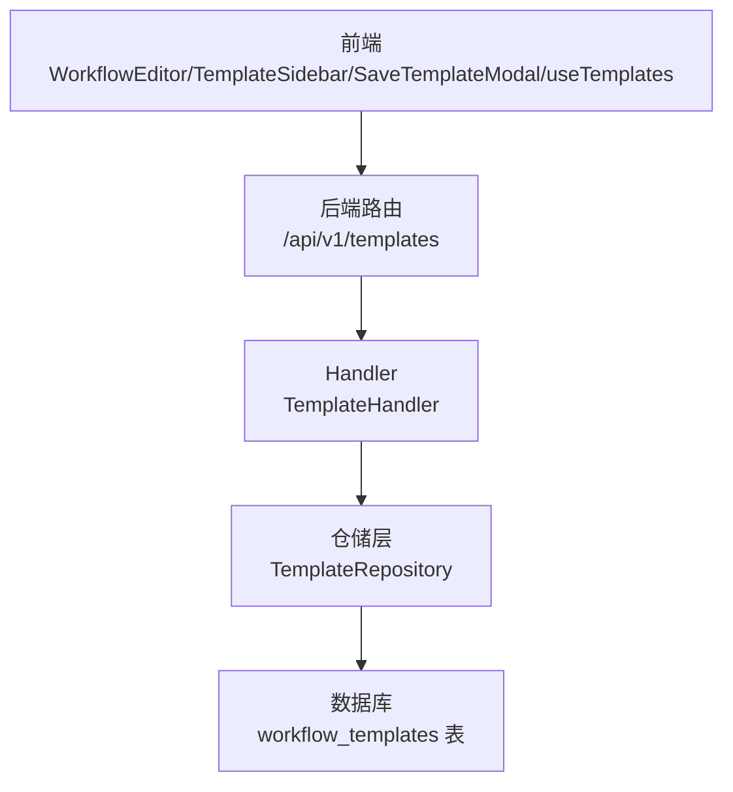
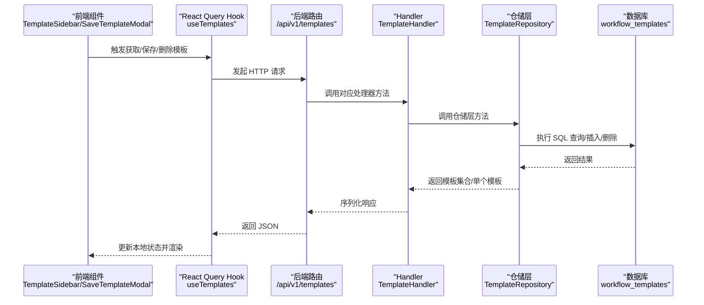
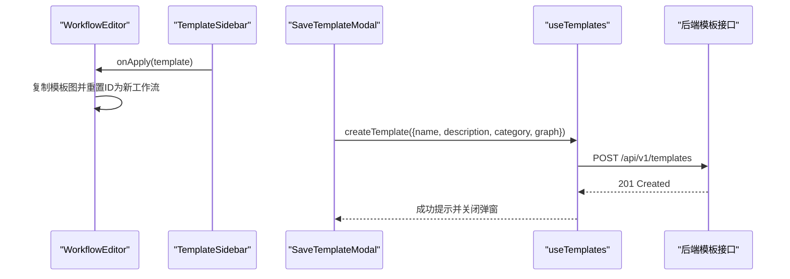
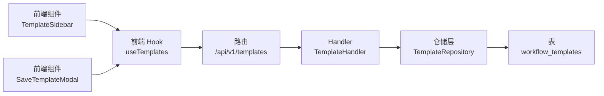

# 模板管理

<cite>
**本文引用的文件**
- [docs/api/templates.md](file://docs/api/templates.md)
- [cmd/council/main.go](file://cmd/council/main.go)
- [internal/api/handler/template.go](file://internal/api/handler/template.go)
- [internal/core/workflow/template.go](file://internal/core/workflow/template.go)
- [internal/infrastructure/persistence/template_repository.go](file://internal/infrastructure/persistence/template_repository.go)
- [internal/infrastructure/db/migrations/001_init_schema.up.sql](file://internal/infrastructure/db/migrations/001_init_schema.up.sql)
- [frontend/src/features/editor/components/TemplateSidebar.tsx](file://frontend/src/features/editor/components/TemplateSidebar.tsx)
- [frontend/src/features/editor/components/SaveTemplateModal.tsx](file://frontend/src/features/editor/components/SaveTemplateModal.tsx)
- [frontend/src/features/editor/WorkflowEditor.tsx](file://frontend/src/features/editor/WorkflowEditor.tsx)
- [frontend/src/hooks/useTemplates.ts](file://frontend/src/hooks/useTemplates.ts)
- [frontend/src/types/template.ts](file://frontend/src/types/template.ts)
</cite>

## 目录
1. [简介](#简介)
2. [项目结构](#项目结构)
3. [核心组件](#核心组件)
4. [架构总览](#架构总览)
5. [详细组件分析](#详细组件分析)
6. [依赖关系分析](#依赖关系分析)
7. [性能考虑](#性能考虑)
8. [故障排查指南](#故障排查指南)
9. [结论](#结论)
10. [附录](#附录)

## 简介
本文件面向“模板管理”API，聚焦于模板的存储与调用能力，覆盖以下接口与流程：
- GET /api/v1/templates：获取系统预置与用户保存的模板列表
- POST /api/v1/templates：将当前工作流保存为可复用的模板
- DELETE /api/v1/templates/:id：删除指定模板

同时，文档定义模板序列化格式（名称、描述、分类、是否系统模板、工作流图定义、时间戳等），并给出典型使用场景（例如保存“技术方案评审”模板并在后续会议中快速加载）；解释后端 Handler 如何与模板仓库交互，以及前端如何通过 TemplateSidebar 组件调用这些接口。

## 项目结构
模板相关能力由后端 Gin 路由、Handler、仓储层与数据库迁移共同构成；前端通过 React Query Hook 与组件进行调用与展示。



图表来源
- [cmd/council/main.go](file://cmd/council/main.go#L132-L136)
- [internal/api/handler/template.go](file://internal/api/handler/template.go#L1-L68)
- [internal/infrastructure/persistence/template_repository.go](file://internal/infrastructure/persistence/template_repository.go#L1-L96)
- [internal/infrastructure/db/migrations/001_init_schema.up.sql](file://internal/infrastructure/db/migrations/001_init_schema.up.sql#L46-L55)

章节来源
- [cmd/council/main.go](file://cmd/council/main.go#L132-L136)

## 核心组件
- 后端路由注册：在主程序中将模板相关路由挂载至 /api/v1 下。
- Handler：负责请求解析、参数校验、调用仓储层、返回响应。
- 仓储层：封装对 workflow_templates 表的查询、插入、删除操作。
- 数据模型：模板实体与分类枚举。
- 前端 Hook 与组件：提供模板列表拉取、保存模板、删除模板、模板侧边栏展示与应用。

章节来源
- [cmd/council/main.go](file://cmd/council/main.go#L132-L136)
- [internal/api/handler/template.go](file://internal/api/handler/template.go#L1-L68)
- [internal/core/workflow/template.go](file://internal/core/workflow/template.go#L1-L35)
- [internal/infrastructure/persistence/template_repository.go](file://internal/infrastructure/persistence/template_repository.go#L1-L96)
- [frontend/src/hooks/useTemplates.ts](file://frontend/src/hooks/useTemplates.ts#L1-L63)
- [frontend/src/features/editor/components/TemplateSidebar.tsx](file://frontend/src/features/editor/components/TemplateSidebar.tsx#L1-L134)
- [frontend/src/features/editor/components/SaveTemplateModal.tsx](file://frontend/src/features/editor/components/SaveTemplateModal.tsx#L1-L116)
- [frontend/src/features/editor/WorkflowEditor.tsx](file://frontend/src/features/editor/WorkflowEditor.tsx#L135-L154)

## 架构总览
后端采用分层设计：路由层接收请求，Handler 层处理业务逻辑，仓储层访问数据库；前端通过 React Query 进行异步数据管理。



图表来源
- [cmd/council/main.go](file://cmd/council/main.go#L132-L136)
- [internal/api/handler/template.go](file://internal/api/handler/template.go#L1-L68)
- [internal/infrastructure/persistence/template_repository.go](file://internal/infrastructure/persistence/template_repository.go#L1-L96)
- [frontend/src/hooks/useTemplates.ts](file://frontend/src/hooks/useTemplates.ts#L1-L63)

## 详细组件分析

### 接口定义与数据模型
- GET /api/v1/templates
  - 功能：列出所有模板（默认包含系统模板）
  - 响应：模板数组
- POST /api/v1/templates
  - 功能：保存当前工作流为模板
  - 请求体：模板名称、描述、分类、工作流图定义
  - 响应：新建模板对象
- DELETE /api/v1/templates/:id
  - 功能：删除指定模板
  - 响应：成功状态

模板序列化格式（字段说明）
- id：模板唯一标识
- name：模板名称
- description：模板描述
- category：模板分类（code_review、business_plan、quick_decision、custom、other）
- is_system：是否为系统预置模板
- graph：工作流图定义（包含起始节点、节点集合、边等）
- created_at/updated_at：ISO 8601 时间戳

章节来源
- [docs/api/templates.md](file://docs/api/templates.md#L1-L260)
- [frontend/src/types/template.ts](file://frontend/src/types/template.ts#L1-L22)
- [internal/core/workflow/template.go](file://internal/core/workflow/template.go#L1-L35)

### 后端 Handler 与仓储交互
- Handler 列表
  - 解析上下文并调用仓储层 List 方法，返回模板数组
- Handler 创建
  - 绑定请求体，构造模板实体（生成 UUID、设置 is_system=false、记录时间戳），调用仓储层 Create 并返回新建模板
- Handler 删除
  - 读取路径参数 id，调用仓储层 Delete
- 仓储层
  - List：查询 workflow_templates 表，按创建时间倒序，解析 graph_definition JSON 字段
  - Create：将模板 graph_definition 序列化为 JSON 后插入
  - Get/Delete：按 id 查询或删除
- 数据库表结构
  - workflow_templates 包含 id、name、description、graph_definition、is_system、created_at 等字段

```mermaid
classDiagram
class TemplateHandler {
+List(c)
+Create(c)
+Delete(c)
}
class TemplateRepository {
+List(ctx) []Template
+Create(ctx, t)
+Get(ctx, id) Template
+Delete(ctx, id)
}
class Template {
+string id
+string name
+string description
+TemplateCategory category
+bool is_system
+GraphDefinition graph
+time created_at
+time updated_at
}
class TemplateCategory {
<<enumeration>>
"code_review"
"business_plan"
"quick_decision"
"custom"
"other"
}
TemplateHandler --> TemplateRepository : "依赖"
TemplateRepository --> Template : "读写"
Template --> TemplateCategory : "使用"
```

图表来源
- [internal/api/handler/template.go](file://internal/api/handler/template.go#L1-L68)
- [internal/core/workflow/template.go](file://internal/core/workflow/template.go#L1-L35)
- [internal/infrastructure/persistence/template_repository.go](file://internal/infrastructure/persistence/template_repository.go#L1-L96)

章节来源
- [internal/api/handler/template.go](file://internal/api/handler/template.go#L1-L68)
- [internal/infrastructure/persistence/template_repository.go](file://internal/infrastructure/persistence/template_repository.go#L1-L96)
- [internal/infrastructure/db/migrations/001_init_schema.up.sql](file://internal/infrastructure/db/migrations/001_init_schema.up.sql#L46-L55)

### 前端调用链路与组件
- TemplateSidebar
  - 从 useTemplates 钩子获取模板列表，支持过滤系统模板与自定义模板
  - 提供应用模板回调，触发 WorkflowEditor 将模板图加载为新工作流
- SaveTemplateModal
  - 从 WorkflowEditor 获取当前画布图结构，提交到后端创建模板
- useTemplates
  - 封装 /api/v1/templates 的 GET/POST/DELETE 请求，使用 React Query 缓存与失效策略



图表来源
- [frontend/src/features/editor/WorkflowEditor.tsx](file://frontend/src/features/editor/WorkflowEditor.tsx#L135-L154)
- [frontend/src/features/editor/components/TemplateSidebar.tsx](file://frontend/src/features/editor/components/TemplateSidebar.tsx#L1-L134)
- [frontend/src/features/editor/components/SaveTemplateModal.tsx](file://frontend/src/features/editor/components/SaveTemplateModal.tsx#L1-L116)
- [frontend/src/hooks/useTemplates.ts](file://frontend/src/hooks/useTemplates.ts#L1-L63)

章节来源
- [frontend/src/features/editor/components/TemplateSidebar.tsx](file://frontend/src/features/editor/components/TemplateSidebar.tsx#L1-L134)
- [frontend/src/features/editor/components/SaveTemplateModal.tsx](file://frontend/src/features/editor/components/SaveTemplateModal.tsx#L1-L116)
- [frontend/src/features/editor/WorkflowEditor.tsx](file://frontend/src/features/editor/WorkflowEditor.tsx#L135-L154)
- [frontend/src/hooks/useTemplates.ts](file://frontend/src/hooks/useTemplates.ts#L1-L63)

### 典型使用场景
- 保存“技术方案评审”模板
  - 在 SaveTemplateModal 中填写模板名称、描述、分类，提交当前画布图结构
  - 后端 Handler 接收请求，构造模板实体并持久化
  - 前端 useTemplates 使模板列表即时更新
- 快速加载模板
  - 在 TemplateSidebar 中选择模板卡片，WorkflowEditor 将模板图复制为新工作流并清空 ID，便于后续保存为独立工作流

章节来源
- [docs/api/templates.md](file://docs/api/templates.md#L112-L146)
- [frontend/src/features/editor/WorkflowEditor.tsx](file://frontend/src/features/editor/WorkflowEditor.tsx#L135-L154)
- [frontend/src/features/editor/components/SaveTemplateModal.tsx](file://frontend/src/features/editor/components/SaveTemplateModal.tsx#L1-L116)

## 依赖关系分析
- 路由到 Handler
  - 主程序在 /api/v1 下注册模板路由，分别指向 List/Create/Delete
- Handler 到仓储
  - TemplateHandler 仅依赖 TemplateRepository 接口，解耦具体实现
- 仓储到数据库
  - TemplateRepository 通过 SQL 访问 workflow_templates 表，graph_definition 以 JSONB 存储
- 前端到后端
  - useTemplates 封装 fetch 请求，统一错误处理与缓存失效



图表来源
- [cmd/council/main.go](file://cmd/council/main.go#L132-L136)
- [internal/api/handler/template.go](file://internal/api/handler/template.go#L1-L68)
- [internal/infrastructure/persistence/template_repository.go](file://internal/infrastructure/persistence/template_repository.go#L1-L96)
- [frontend/src/hooks/useTemplates.ts](file://frontend/src/hooks/useTemplates.ts#L1-L63)

章节来源
- [cmd/council/main.go](file://cmd/council/main.go#L132-L136)
- [internal/infrastructure/persistence/template_repository.go](file://internal/infrastructure/persistence/template_repository.go#L1-L96)

## 性能考虑
- 数据库层面
  - graph_definition 使用 JSONB 存储，查询时需注意索引与字段选择，避免全表扫描
  - List 操作按 created_at 倒序，建议在该列建立索引以优化排序
- 后端层面
  - Handler 仅做薄层逻辑，复杂度主要来自仓储层 SQL 执行
  - 建议对高频查询增加缓存（如 Redis）以减少数据库压力
- 前端层面
  - React Query 默认缓存策略可减少重复请求
  - 大型 graph 结构传输时注意压缩与分页（若模板数量增长）

[本节为通用指导，不直接分析具体文件]

## 故障排查指南
- 常见错误与定位
  - 请求体绑定失败：Handler 在绑定 JSON 时返回 400，检查请求体字段与类型
  - 仓储层查询异常：数据库连接或 SQL 错误，查看日志与 SQL 语句
  - 前端 fetch 失败：useTemplates 对非 2xx 响应抛出错误，检查后端返回的 error 字段
- 建议排查步骤
  - 后端：确认路由已注册、Handler 方法被调用、仓储层 SQL 正常执行
  - 前端：确认 API_BASE 与路径正确、请求头 Content-Type 设置为 application/json
  - 数据库：确认 workflow_templates 表存在且字段匹配

章节来源
- [internal/api/handler/template.go](file://internal/api/handler/template.go#L20-L68)
- [frontend/src/hooks/useTemplates.ts](file://frontend/src/hooks/useTemplates.ts#L1-L63)
- [internal/infrastructure/db/migrations/001_init_schema.up.sql](file://internal/infrastructure/db/migrations/001_init_schema.up.sql#L46-L55)

## 结论
模板管理 API 已在后端完成路由注册与 Handler 实现，并通过仓储层访问数据库；前端通过组件与 Hook 完成模板的保存、删除与加载。整体架构清晰、职责分离明确，具备良好的扩展性与可维护性。后续可在数据库索引、缓存与前端分页等方面进一步优化。

[本节为总结性内容，不直接分析具体文件]

## 附录

### API 端点一览
- GET /api/v1/templates
  - 查询参数：category（可选）、include_system（可选，默认包含系统模板）
  - 响应：模板数组
- POST /api/v1/templates
  - 请求体：name、description、category、graph
  - 响应：新建模板对象
- DELETE /api/v1/templates/:id
  - 响应：成功状态

章节来源
- [docs/api/templates.md](file://docs/api/templates.md#L40-L196)
- [cmd/council/main.go](file://cmd/council/main.go#L132-L136)