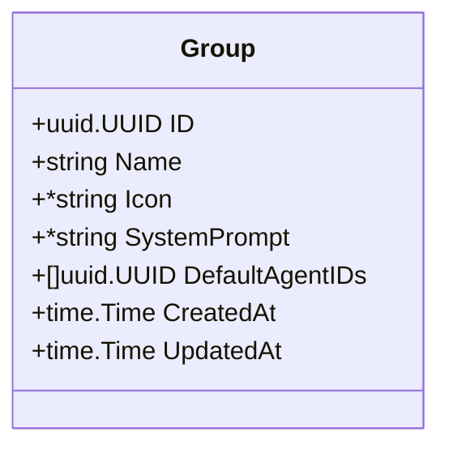
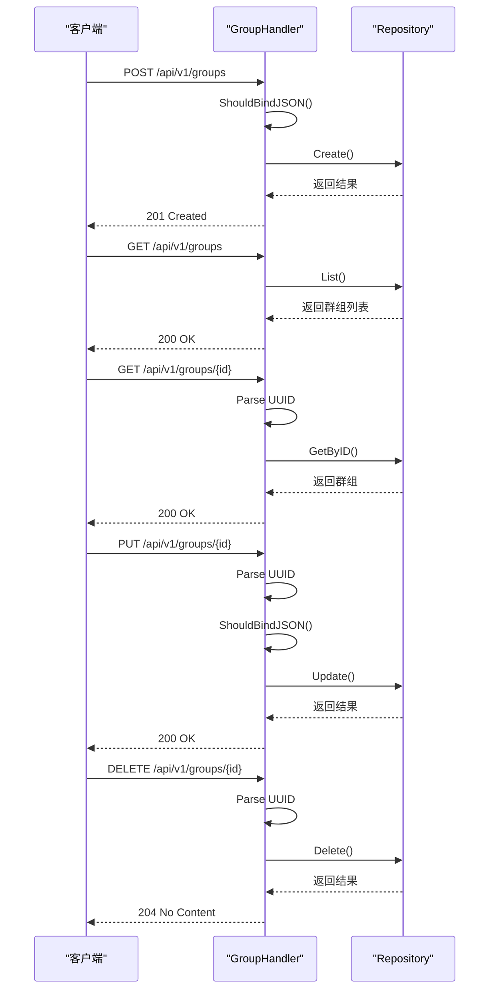
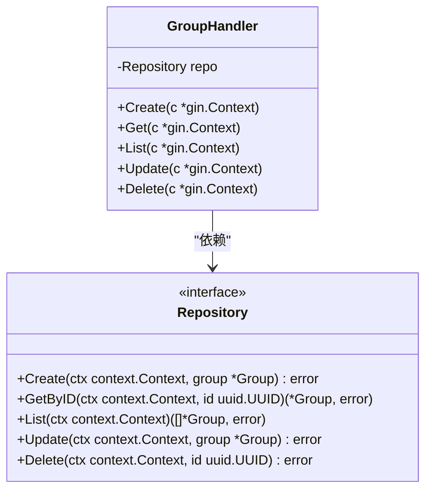
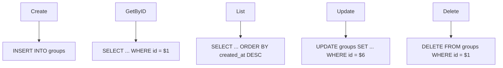
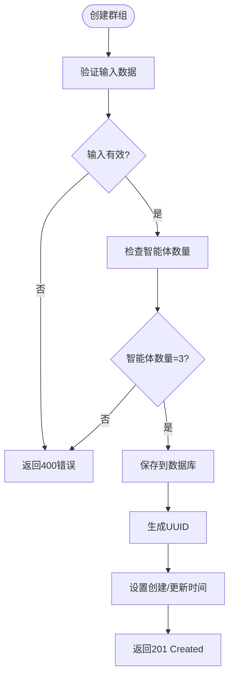
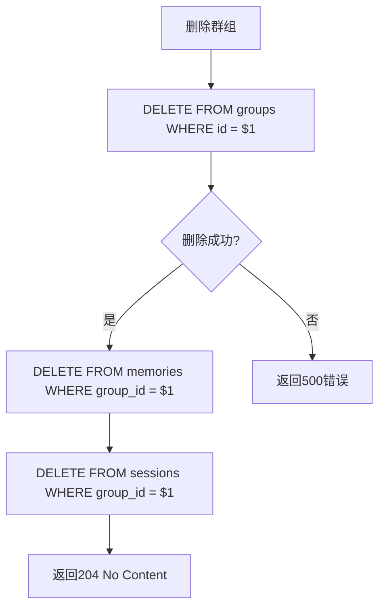
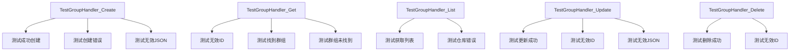

# 群组管理

<cite>
**本文档引用的文件**
- [group.go](file://internal/api/handler/group.go)
- [entity.go](file://internal/core/group/entity.go)
- [repository.go](file://internal/core/group/repository.go)
- [group_repository.go](file://internal/infrastructure/persistence/group_repository.go)
- [main.go](file://cmd/council/main.go)
- [group.ts](file://frontend/src/types/group.ts)
- [group_test.go](file://internal/api/handler/group_test.go)
- [SPEC-101-groups-page.md](file://docs/specs/sprint2/SPEC-101-groups-page.md)
- [04_group_management.md](file://docs/tdd/02_core/04_group_management.md)
- [SPEC-602-default-group.md](file://docs/specs/sprint6/SPEC-602-default-group.md)
</cite>

## 目录
1. [简介](#简介)
2. [群组对象结构](#群组对象结构)
3. [RESTful API 端点](#restful-api-端点)
4. [业务逻辑与实现](#业务逻辑与实现)
5. [请求示例](#请求示例)
6. [错误处理](#错误处理)
7. [前端集成](#前端集成)
8. [测试与验证](#测试与验证)
9. [结论](#结论)

## 简介
群组管理模块是本系统的核心功能之一，用于实现多智能体协作的场景隔离和上下文管理。该模块提供了一套完整的RESTful API，支持对群组资源的增删改查操作。群组（Group）作为协作的基本单元，定义了智能体协作的上下文、默认成员和行为准则。本文档详细描述了群组管理API的设计、实现和使用方法。

## 群组对象结构
群组对象（Group）是系统中的核心数据实体，用于表示一个协作项目或上下文。其结构定义了群组的基本属性和元数据。



**图示来源**
- [entity.go](file://internal/core/group/entity.go#L9-L18)

### 属性说明
- **ID**: 群组的唯一标识符，使用UUID格式
- **Name**: 群组名称，用于标识和显示
- **Icon**: 可选的群组图标，可以是URL或emoji
- **SystemPrompt**: 群组的系统提示，定义了群组的协作原则和行为准则
- **DefaultAgentIDs**: 默认智能体ID列表，指定了群组的初始成员
- **CreatedAt**: 创建时间戳
- **UpdatedAt**: 最后更新时间戳

## RESTful API 端点
群组管理API提供了一套标准的RESTful接口，用于对群组资源进行操作。所有端点均位于`/api/v1/groups`路径下。

| 方法 | 端点 | 描述 |
| ---- | ---- | ---- |
| `POST` | `/api/v1/groups` | 创建新群组 |
| `GET` | `/api/v1/groups` | 获取群组列表 |
| `GET` | `/api/v1/groups/:id` | 获取特定群组 |
| `PUT` | `/api/v1/groups/:id` | 更新群组信息 |
| `DELETE` | `/api/v1/groups/:id` | 删除群组 |



**图示来源**
- [group.go](file://internal/api/handler/group.go)
- [main.go](file://cmd/council/main.go#L111-L116)

**本节来源**
- [group.go](file://internal/api/handler/group.go)
- [main.go](file://cmd/council/main.go#L111-L116)
- [04_group_management.md](file://docs/tdd/02_core/04_group_management.md#L37-L45)

## 业务逻辑与实现
群组管理的业务逻辑通过分层架构实现，包括处理层（Handler）、核心逻辑层（Core）和持久化层（Persistence）。

### 处理层（Handler）
`GroupHandler`结构体负责处理HTTP请求，进行参数验证和响应格式化。它通过依赖注入接收`Repository`接口的实现。



**图示来源**
- [group.go](file://internal/api/handler/group.go#L11-L13)
- [repository.go](file://internal/core/group/repository.go#L9-L15)

### 持久化层（Persistence）
`GroupRepository`实现了`Repository`接口，使用PostgreSQL数据库进行数据持久化。它通过SQL查询与数据库交互。



**图示来源**
- [group_repository.go](file://internal/infrastructure/persistence/group_repository.go)

### 创建群组时的智能体验证
在创建群组时，系统会验证智能体ID的有效性。虽然核心处理层不直接验证智能体ID，但通过数据库外键约束确保引用完整性。此外，TDD文档中提到的业务规则要求默认班底必须为3位智能体。



**图示来源**
- [04_group_management.md](file://docs/tdd/02_core/04_group_management.md#L28-L34)
- [group_repository.go](file://internal/infrastructure/persistence/group_repository.go#L23-L43)

### 删除群组时的级联处理
删除群组时，系统采用级联删除策略，确保相关数据的一致性。根据TDD文档，删除群组会同时删除相关的记忆数据。



**图示来源**
- [04_group_management.md](file://docs/tdd/02_core/04_group_management.md#L45)
- [group_repository.go](file://internal/infrastructure/persistence/group_repository.go#L109-L113)

## 请求示例
以下是一些常见的API使用示例。

### 创建评审群组
创建一个包含"产品经理"和"架构师"智能体的评审群组。

```json
POST /api/v1/groups
Content-Type: application/json

{
  "name": "产品评审委员会",
  "icon": "🏢",
  "system_prompt": "你是一个产品评审委员会，负责评估新产品的可行性和市场潜力。",
  "default_agent_ids": [
    "product_manager_uuid",
    "architect_uuid"
  ]
}
```

**本节来源**
- [group.ts](file://frontend/src/types/group.ts)
- [CreateGroupModal.tsx](file://frontend/src/features/groups/components/CreateGroupModal.tsx)

### 获取群组列表
获取所有群组的列表。

```http
GET /api/v1/groups
Accept: application/json
```

响应示例：
```json
[
  {
    "id": "a1b2c3d4-e5f6-7890-g1h2-i3j4k5l6m7n8",
    "name": "The Council",
    "icon": "🤖",
    "system_prompt": "# The Council - 多智能体协作治理体...",
    "default_agent_ids": [
      "system_affirmative",
      "system_negative",
      "system_adjudicator"
    ],
    "created_at": "2025-12-21T10:00:00Z",
    "updated_at": "2025-12-21T10:00:00Z"
  }
]
```

## 错误处理
API实现了全面的错误处理机制，确保客户端能够获得清晰的错误信息。

```mermaid
flowchart TD
A[请求] --> B{参数验证}
B --> |失败| C[返回400 Bad Request]
B --> |成功| D{业务逻辑处理}
D --> |失败| E[返回500 Internal Server Error]
D --> |成功| F[返回成功状态码]
G[GET /groups/{id}] --> H{ID格式验证}
H --> |无效| I[返回400 Bad Request]
H --> |有效| J{群组是否存在}
J --> |不存在| K[返回404 Not Found]
```

**本节来源**
- [group.go](file://internal/api/handler/group.go)
- [group_test.go](file://internal/api/handler/group_test.go)

## 前端集成
前端通过`useGroups` Hook与群组管理API进行交互，提供了创建、读取、更新和删除群组的功能。

```mermaid
classDiagram
class Group {
id : string
name : string
icon : string
system_prompt : string
default_agent_ids : string[]
created_at : string
updated_at : string
}
class CreateGroupInput {
name : string
icon? : string
system_prompt? : string
default_agent_ids? : string[]
}
class UseGroups {
+useGroups() : { data, loading, error, createGroup, updateGroup, deleteGroup }
}
UseGroups --> Group : "返回"
UseGroups --> CreateGroupInput : "接收"
```

**图示来源**
- [group.ts](file://frontend/src/types/group.ts)
- [useGroups.ts](file://frontend/src/hooks/useGroups.ts)

## 测试与验证
系统提供了全面的单元测试，确保群组管理功能的正确性。



**本节来源**
- [group_test.go](file://internal/api/handler/group_test.go)

## 结论
群组管理API提供了一套完整、可靠的RESTful接口，支持对群组资源的全生命周期管理。通过清晰的分层架构和全面的测试覆盖，确保了系统的稳定性和可维护性。API设计遵循REST原则，具有良好的可扩展性，为多智能体协作提供了坚实的基础。