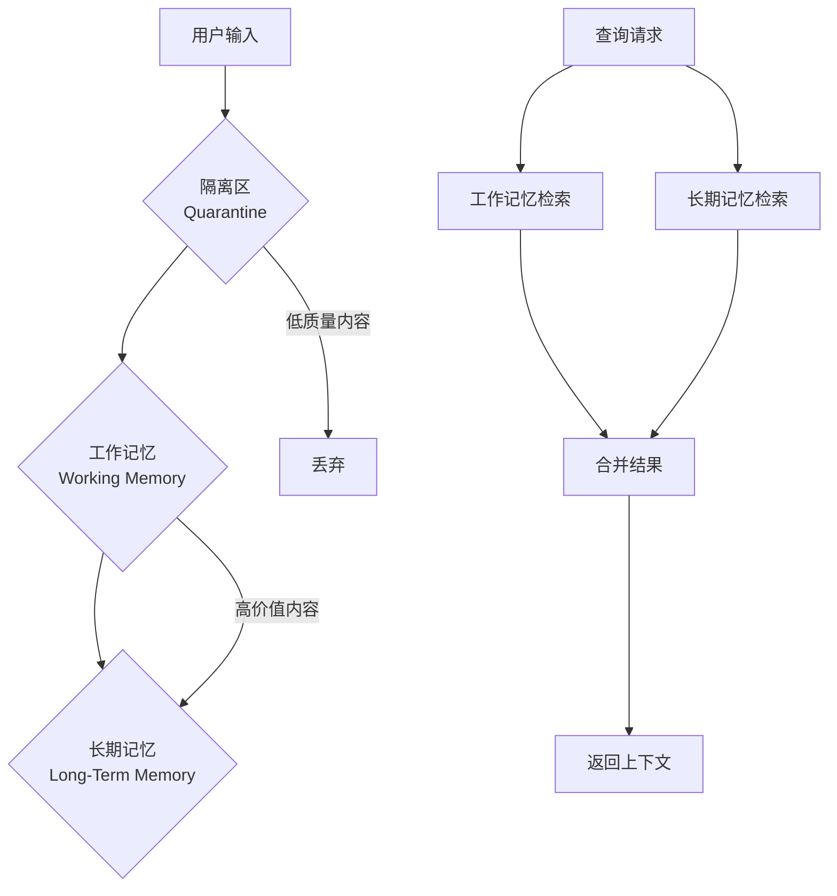
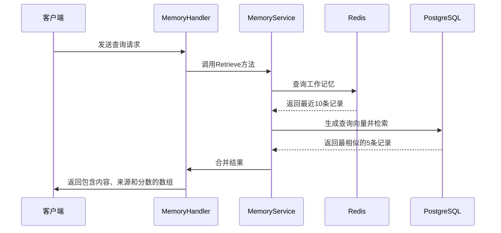

# 记忆系统

<cite>
**本文档引用的文件**  
- [memory.go](file://internal/api/handler/memory.go)
- [service.go](file://internal/core/memory/service.go)
- [types.go](file://internal/core/memory/types.go)
- [splitter.go](file://internal/core/memory/splitter.go)
- [SPEC-408-memory-protocol.md](file://docs/specs/backend/SPEC-408-memory-protocol.md)
- [SPEC-607-memory-retrieval-node.md](file://docs/specs/sprint6/SPEC-607-memory-retrieval-node.md)
</cite>

## 目录
1. [简介](#简介)
2. [核心端点](#核心端点)
3. [请求结构](#请求结构)
4. [三层记忆协议](#三层记忆协议)
5. [示例场景](#示例场景)
6. [检索机制](#检索机制)

## 简介
本系统实现了一个三层记忆架构，用于管理会议内容、决策历史和上下文信息。系统通过隔离区、工作记忆和长期记忆三个层级，确保信息的质量和可用性。该架构支持语义检索和内容注入，为智能决策提供支持。

## 核心端点
系统提供两个核心API端点，用于管理记忆内容。

### POST /api/v1/memory/ingest
此端点用于将内容注入长期记忆库。当客户端发送请求时，系统会触发Promotion流程，将内容处理并存储到长期记忆中。该操作会将原始内容分割成多个块，生成向量嵌入，并存入向量数据库。

**Section sources**
- [memory.go](file://internal/api/handler/memory.go#L25-L43)

### POST /api/v1/memory/query
此端点基于语义查询检索相关上下文。系统会同时查询工作记忆（热数据）和长期记忆（冷数据），返回最相关的结果。查询过程包括生成查询向量，并与存储的向量进行相似度比较。

**Section sources**
- [memory.go](file://internal/api/handler/memory.go#L50-L67)

## 请求结构
### IngestRequest 结构
```json
{
  "group_id": "string",
  "content": "string"
}
```
- **group_id**: 分组标识符，用于隔离不同项目或团队的记忆内容
- **content**: 要存储的完整内容文本

**Section sources**
- [memory.go](file://internal/api/handler/memory.go#L20-L23)

### QueryRequest 结构
```json
{
  "group_id": "string",
  "query": "string"
}
```
- **group_id**: 分组标识符，限定查询范围
- **query**: 查询语句，用于语义匹配

**Section sources**
- [memory.go](file://internal/api/handler/memory.go#L45-L48)

## 三层记忆协议
系统实现了分层的记忆存储与检索机制。



**Diagram sources**
- [SPEC-408-memory-protocol.md](file://docs/specs/backend/SPEC-408-memory-protocol.md#L8-L35)

### 隔离区 (Tier 1)
原始内容首先进入隔离区，这里的内容不会参与检索。系统会对内容进行初步过滤，防止低质量或有害信息污染记忆库。

**Section sources**
- [SPEC-408-memory-protocol.md](file://docs/specs/backend/SPEC-408-memory-protocol.md#L59-L82)

### 工作记忆 (Tier 2)
通过过滤的内容会被写入Redis作为工作记忆。这部分数据具有24小时TTL（生存时间），并受到入口过滤器的保护，只保留高置信度的内容。

**Section sources**
- [service.go](file://internal/core/memory/service.go#L60-L97)

### 长期记忆 (Tier 3)
通过Promotion流程的内容会被分割、向量化并存储到PostgreSQL的pgvector扩展中。这些数据构成了系统的长期记忆，可通过语义搜索快速检索。

**Section sources**
- [service.go](file://internal/core/memory/service.go#L115-L157)

## 示例场景
### 会议纪要存储
将会议纪要存入记忆库的示例：

```json
POST /api/v1/memory/ingest
{
  "group_id": "project-alpha",
  "content": "2024年3月15日会议决定采用微服务架构，主要原因是可扩展性和团队独立性。技术栈选择Node.js和Go语言。"
}
```

此请求会触发Promotion流程，内容被分割成块，生成向量嵌入，并存储到长期记忆中。

**Section sources**
- [service.go](file://internal/core/memory/service.go#L115-L157)

### 历史决策查询
在后续讨论中查询历史决策的示例：

```json
POST /api/v1/memory/query
{
  "group_id": "project-alpha",
  "query": "我们为什么选择微服务架构？"
}
```

系统会返回包含相关上下文的结果，包括来源和相似度分数。

**Section sources**
- [memory.go](file://internal/api/handler/memory.go#L50-L67)

## 检索机制
Retrieve方法实现了混合检索策略，从多个层级获取上下文信息。



**Diagram sources**
- [service.go](file://internal/core/memory/service.go#L159-L208)

### ContextItem 结构
```go
type ContextItem struct {
    Content string   // 内容文本
    Source  string   // 来源："hot"（工作记忆）或 "cold"（长期记忆）
    Score   float64  // 相似度分数，0.0-1.0
}
```

Retrieve方法首先从Redis获取工作记忆中的最新内容（标记为"hot"），然后从PostgreSQL的向量数据库中检索语义最相似的内容（标记为"cold"），最后将两组结果合并返回。

**Section sources**
- [types.go](file://internal/core/memory/types.go#L22-L27)