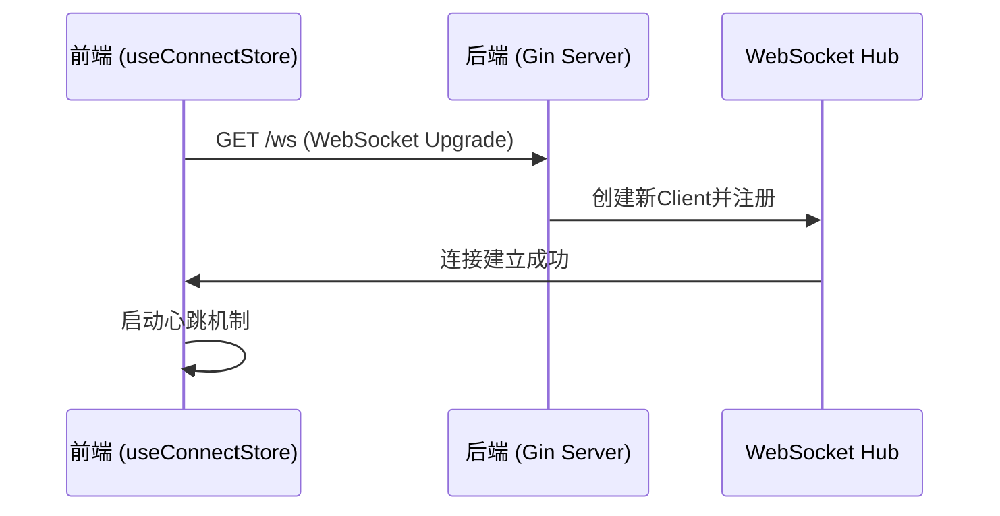
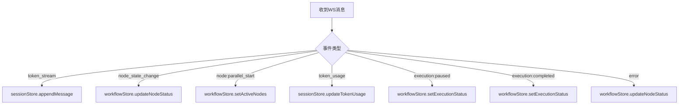
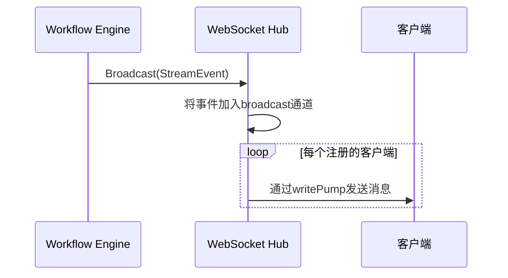
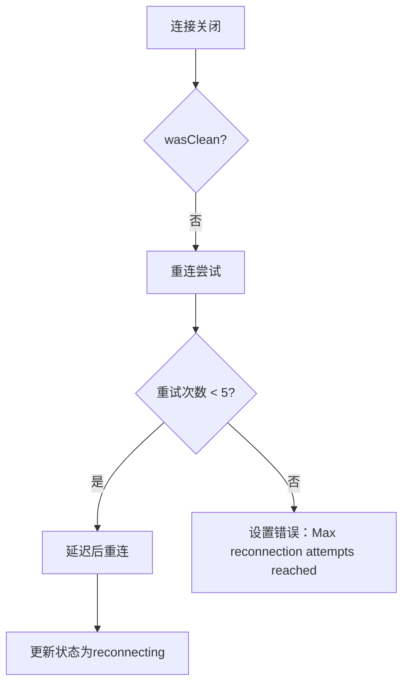

# WebSocket 实时通信API

<cite>
**本文档引用文件**  
- [useConnectStore.ts](file://frontend/src/stores/useConnectStore.ts)
- [useWebSocketRouter.ts](file://frontend/src/hooks/useWebSocketRouter.ts)
- [websocket.ts](file://frontend/src/types/websocket.ts)
- [hub.go](file://internal/api/ws/hub.go)
- [context.go](file://internal/core/workflow/context.go)
- [workflow.go](file://internal/api/handler/workflow.go)
- [SPEC-005-websocket-optimization.md](file://docs/specs/sprint1/SPEC-005-websocket-optimization.md)
- [SPEC-703-session-ws-connect-fix.md](file://docs/specs/sprint7/SPEC-703-session-ws-connect-fix.md)
- [2025-12-21-websocket-debugging-report.md](file://docs/reports/debugging/2025-12-21-websocket-debugging-report.md)
</cite>

## 目录
1. [连接建立流程](#连接建立流程)
2. [消息帧格式与类型定义](#消息帧格式与类型定义)
3. [事件订阅与路由机制](#事件订阅与路由机制)
4. [实时状态推送模式](#实时状态推送模式)
5. [心跳与自动重连机制](#心跳与自动重连机制)
6. [调试与集成注意事项](#调试与集成注意事项)

## 连接建立流程

WebSocket连接通过`ws://host:port/ws`端点建立。前端使用`useConnectStore`管理连接状态，后端通过Gin路由处理WebSocket升级请求。

连接流程如下：
1. 用户在会议页面启动会话
2. 前端通过`useConnectStore.connect()`方法建立连接
3. 使用`window.location`动态构建WebSocket URL，支持HTTPS环境下的WSS协议
4. 连接成功后状态变为`connected`，并启动心跳机制



**Diagram sources**
- [useConnectStore.ts](file://frontend/src/stores/useConnectStore.ts#L40-L77)
- [hub.go](file://internal/api/ws/hub.go#L110-L124)
- [SPEC-703-session-ws-connect-fix.md](file://docs/specs/sprint7/SPEC-703-session-ws-connect-fix.md#L134-L158)

**Section sources**
- [useConnectStore.ts](file://frontend/src/stores/useConnectStore.ts#L1-L127)
- [hub.go](file://internal/api/ws/hub.go#L1-L124)

## 消息帧格式与类型定义

WebSocket消息采用JSON格式，分为下行事件（Server → Client）和上行命令（Client → Server）。

### TypeScript接口定义

```typescript
// 下行事件 (Server -> Client)
export type WSEventType =
  | 'token_stream'        // Token 流
  | 'node_state_change'   // 节点状态变化
  | 'node:parallel_start' // 并行节点开始
  | 'token_usage'         // Token 使用统计
  | 'execution:paused'    // 执行已暂停
  | 'execution:completed' // 执行完成
  | 'error';              // 错误

export interface WSMessage<T = unknown> {
  event: WSEventType;
  data: T;
  timestamp?: string;
  node_id?: string;
}

// 上行命令 (Client -> Server)
export type WSCommandType = 'start_session' | 'pause_session' | 'resume_session' | 'user_input';

export interface WSCommand<T = unknown> {
  cmd: WSCommandType;
  data?: T;
}
```

### 后端消息结构

后端使用`StreamEvent`结构，通过JSON tag `event`确保与前端兼容：

```go
type StreamEvent struct {
    Type      string                 `json:"event"`
    Timestamp time.Time              `json:"timestamp"`
    NodeID    string                 `json:"node_id,omitempty"`
    Data      map[string]interface{} `json:"data,omitempty"`
}
```

**Section sources**
- [websocket.ts](file://frontend/src/types/websocket.ts#L1-L51)
- [context.go](file://internal/core/workflow/context.go#L8-L14)

## 事件订阅与路由机制

系统采用分层架构处理WebSocket消息：`useConnectStore`负责连接管理，`useWebSocketRouter`负责消息路由。

### 架构设计

```
┌─────────────────┐      ┌────────────────────┐      ┌─────────────────────┐
│ useConnectStore │ ───▶ │ useWebSocketRouter │ ───▶ │ useSessionStore     │
│   (连接管理)    │      │   (消息路由/解析)  │      │ useWorkflowRunStore │
└─────────────────┘      └────────────────────┘      └─────────────────────┘
```

### 消息路由逻辑

`useWebSocketRouter`订阅`useConnectStore`中的`_lastMessage`，根据`event`类型分发到相应处理器：



**Diagram sources**
- [useWebSocketRouter.ts](file://frontend/src/hooks/useWebSocketRouter.ts#L17-L111)
- [SPEC-005-websocket-optimization.md](file://docs/specs/sprint1/SPEC-005-websocket-optimization.md#L219-L318)

**Section sources**
- [useWebSocketRouter.ts](file://frontend/src/hooks/useWebSocketRouter.ts#L1-L126)
- [useConnectStore.ts](file://frontend/src/stores/useConnectStore.ts#L10)

## 实时状态推送模式

系统通过WebSocket Hub广播实时状态变化，涵盖多种下行事件。

### 下行事件类型

| 事件类型 | 描述 | 数据结构 |
|--------|------|---------|
| token_stream | Token流式输出 | TokenStreamData |
| node_state_change | 节点状态变化 | NodeStateChangeData |
| node:parallel_start | 并行节点开始 | ParallelStartData |
| token_usage | Token使用统计 | TokenUsageData |
| execution:paused | 执行已暂停 | - |
| execution:completed | 执行完成 | - |
| error | 错误事件 | {error: string} |

### 事件广播流程



**Diagram sources**
- [hub.go](file://internal/api/ws/hub.go#L71-L73)
- [workflow.go](file://internal/api/handler/workflow.go#L106-L110)

**Section sources**
- [hub.go](file://internal/api/ws/hub.go#L21-L68)
- [context.go](file://internal/core/workflow/context.go#L8-L14)

## 心跳与自动重连机制

系统实现了健壮的心跳和自动重连机制，确保连接的稳定性。

### 心跳机制

- 心跳间隔：30秒（HEARTBEAT_INTERVAL = 30000）
- 发送`ping`命令，服务器应答`pong`
- 在连接打开时启动

### 自动重连策略

- 最大重试次数：5次（MAX_RECONNECT_ATTEMPTS = 5）
- 初始重连延迟：3秒（RECONNECT_DELAY = 3000）
- 指数退避：每次重试延迟递增
- 防护机制：检查`readyState === OPEN`避免重复连接



**Section sources**
- [useConnectStore.ts](file://frontend/src/stores/useConnectStore.ts#L23-L25)
- [useConnectStore.ts](file://frontend/src/stores/useConnectStore.ts#L101-L114)
- [useConnectStore.ts](file://frontend/src/stores/useConnectStore.ts#L116-L124)

## 调试与集成注意事项

### 字段名一致性规约

历史问题：后端使用`type`而前端期望`event`，导致消息静默丢失。

**修复方案**：
- 后端`StreamEvent`结构体使用`json:"event"` tag
- 确保前后端字段名一致
- 参考调试报告中的根因分析

### 最佳实践

1. **端到端测试**：验证消息格式的兼容性
2. **类型同步**：考虑使用工具从Go struct生成TypeScript接口
3. **错误处理**：妥善处理JSON解析失败的情况
4. **连接管理**：利用`useConnectStore`的状态机管理连接生命周期

**Section sources**
- [2025-12-21-websocket-debugging-report.md](file://docs/reports/debugging/2025-12-21-websocket-debugging-report.md#L1-L70)
- [context.go](file://internal/core/workflow/context.go#L10)