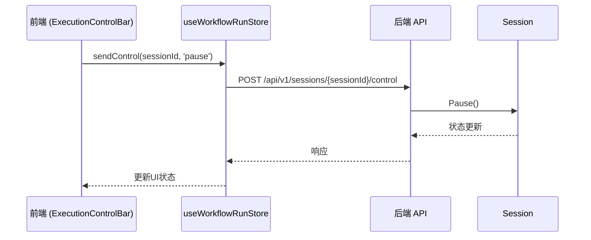
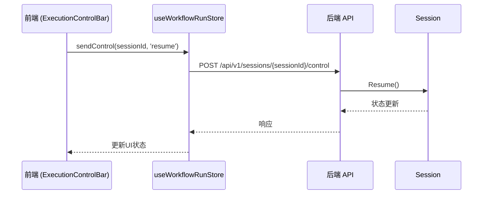
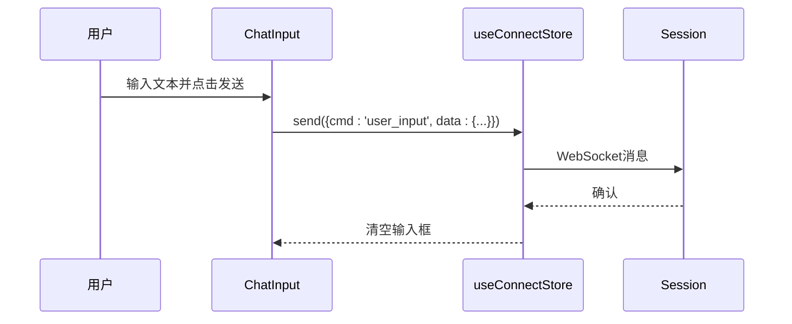
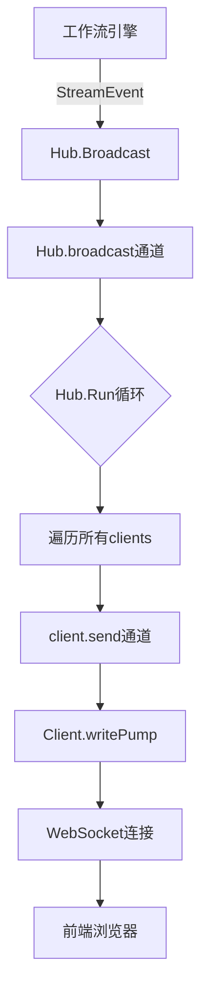

# 上行命令（客户端 → 服务器）

<cite>
**本文档引用文件**  
- [useConnectStore.ts](file://frontend/src/stores/useConnectStore.ts)
- [websocket.ts](file://frontend/src/types/websocket.ts)
- [ExecutionControlBar.tsx](file://frontend/src/components/meeting/ExecutionControlBar.tsx)
- [ChatInput.tsx](file://frontend/src/components/chat/ChatInput.tsx)
- [useWorkflowRunStore.ts](file://frontend/src/stores/useWorkflowRunStore.ts)
- [session.go](file://internal/core/workflow/session.go)
- [hub.go](file://internal/api/ws/hub.go)
- [workflow.go](file://internal/api/handler/workflow.go)
- [SPEC-005-websocket-optimization.md](file://docs/specs/sprint1/SPEC-005-websocket-optimization.md)
- [SPEC-703-session-ws-connect-fix.md](file://docs/specs/sprint7/SPEC-703-session-ws-connect-fix.md)
</cite>

## 目录
1. [引言](#引言)
2. [上行命令概览](#上行命令概览)
3. [命令详细说明](#命令详细说明)
   1. [start_session](#start_session)
   2. [pause_session](#pause_session)
   3. [resume_session](#resume_session)
   4. [user_input](#user_input)
4. [发送机制与连接管理](#发送机制与连接管理)
5. [前端调用示例](#前端调用示例)
6. [后端处理流程](#后端处理流程)
7. [错误处理与幂等性](#错误处理与幂等性)

## 引言

本文档详细描述了“议会”系统中客户端通过WebSocket向服务器发送的上行控制命令。这些命令允许用户在会议执行过程中进行交互，包括启动、暂停、恢复会议以及注入用户输入。文档重点阐述了 `start_session`、`pause_session`、`resume_session` 和 `user_input` 四个核心命令的用途、JSON消息格式、参数要求以及前后端的完整处理流程。

**Section sources**
- [SPEC-703-session-ws-connect-fix.md](file://docs/specs/sprint7/SPEC-703-session-ws-connect-fix.md#L1-L181)

## 上行命令概览

上行命令（Upstream Commands）是客户端主动发起的控制指令，用于与后端工作流引擎进行交互。所有命令均通过已建立的WebSocket连接发送，采用统一的JSON格式。

根据代码定义，上行命令的类型和接口如下：

```typescript
// 上行命令 (Client -> Server)
export type WSCommandType = 'start_session' | 'pause_session' | 'resume_session' | 'user_input';

export interface WSCommand<T = unknown> {
    cmd: WSCommandType;
    data?: T;
}
```

这些命令在前端通过 `useConnectStore.send()` 方法发送，并由后端的WebSocket Hub进行广播和处理。

**Section sources**
- [websocket.ts](file://frontend/src/types/websocket.ts#L45-L51)

## 命令详细说明

### start_session

`start_session` 命令用于启动一个新的会议会话。该命令通常在用户通过UI选择模板并点击“开始会议”后触发。

- **用途**: 初始化并启动一个基于特定工作流模板的会议。
- **JSON消息格式**:
  ```json
  {
    "cmd": "start_session",
    "data": {
      "template_id": "string",
      "session_id": "string",
      "subject": "string"
    }
  }
  ```
- **参数要求**:
  - `template_id`: 必需，指定要执行的工作流模板ID。
  - `session_id`: 必需，客户端生成的唯一会话ID。
  - `subject`: 可选，会议主题，用于初始化上下文。
- **后端处理流程**: 后端接收到此命令后，会创建一个新的 `Session` 对象，初始化工作流引擎，并在Goroutine中启动执行。执行状态通过WebSocket广播给所有连接的客户端。

**Section sources**
- [SPEC-703-session-ws-connect-fix.md](file://docs/specs/sprint7/SPEC-703-session-ws-connect-fix.md#L1-L181)
- [workflow.go](file://internal/api/handler/workflow.go#L83-L127)

### pause_session

`pause_session` 命令用于暂停当前正在运行的会议会话。

- **用途**: 临时中断会议的执行，允许用户进行审查或调整。
- **JSON消息格式**:
  ```json
  {
    "cmd": "pause_session",
    "data": {
      "session_id": "string"
    }
  }
  ```
- **参数要求**:
  - `session_id`: 必需，指定要暂停的会话ID。
- **后端处理流程**: 后端调用 `Session.Pause()` 方法，将会话状态从 `SessionRunning` 改为 `SessionPaused`，并创建一个阻塞通道 `resumeCh`。工作流引擎中的每个节点在执行前都会调用 `WaitIfPaused()` 方法，如果会话处于暂停状态，则会阻塞在此通道上，从而实现全局暂停。



**Diagram sources**
- [ExecutionControlBar.tsx](file://frontend/src/components/meeting/ExecutionControlBar.tsx#L35-L42)
- [useWorkflowRunStore.ts](file://frontend/src/stores/useWorkflowRunStore.ts#L197-L225)
- [session.go](file://internal/core/workflow/session.go#L74-L81)

**Section sources**
- [session.go](file://internal/core/workflow/session.go#L74-L81)
- [useWorkflowRunStore.ts](file://frontend/src/stores/useWorkflowRunStore.ts#L197-L225)

### resume_session

`resume_session` 命令用于恢复一个已暂停的会议会话。

- **用途**: 从暂停状态恢复会议的执行。
- **JSON消息格式**:
  ```json
  {
    "cmd": "resume_session",
    "data": {
      "session_id": "string"
    }
  }
  ```
- **参数要求**:
  - `session_id`: 必需，指定要恢复的会话ID。
- **后端处理流程**: 后端调用 `Session.Resume()` 方法，将会话状态改回 `SessionRunning`，并通过 `close(s.resumeCh)` 关闭阻塞通道。所有因 `WaitIfPaused()` 而阻塞的Goroutine会立即收到信号并继续执行，从而实现无缝恢复。



**Diagram sources**
- [ExecutionControlBar.tsx](file://frontend/src/components/meeting/ExecutionControlBar.tsx#L44-L51)
- [useWorkflowRunStore.ts](file://frontend/src/stores/useWorkflowRunStore.ts#L197-L225)
- [session.go](file://internal/core/workflow/session.go#L83-L89)

**Section sources**
- [session.go](file://internal/core/workflow/session.go#L83-L89)
- [useWorkflowRunStore.ts](file://frontend/src/stores/useWorkflowRunStore.ts#L197-L225)

### user_input

`user_input` 命令用于在会议执行过程中注入用户的文本输入。

- **用途**: 允许用户在会议中途插话、回答问题或提供额外信息。
- **JSON消息格式**:
  ```json
  {
    "cmd": "user_input",
    "data": {
      "content": "string",
      "session_id": "string"
    }
  }
  ```
- **参数要求**:
  - `content`: 必需，用户输入的文本内容。
  - `session_id`: 必需，指定输入所属的会话ID。
- **后端处理流程**: 后端接收到此命令后，会将其作为一条新的消息添加到会话的上下文中。如果当前有节点（如 `HumanReviewNode`）正在等待用户输入，该节点会从其信号通道中接收到此输入并继续执行。



**Diagram sources**
- [ChatInput.tsx](file://frontend/src/components/chat/ChatInput.tsx#L22-L34)
- [useConnectStore.ts](file://frontend/src/stores/useConnectStore.ts#L88-L94)
- [session.go](file://internal/core/workflow/session.go#L110-L142)

**Section sources**
- [ChatInput.tsx](file://frontend/src/components/chat/ChatInput.tsx#L1-L35)
- [session.go](file://internal/core/workflow/session.go#L110-L142)

## 发送机制与连接管理

上行命令的发送依赖于 `useConnectStore` 状态管理器，它封装了WebSocket连接的整个生命周期。

- **`useConnectStore.send()` 方法**: 该方法是发送所有上行命令的统一入口。它会检查当前WebSocket连接状态，仅在 `connected` 状态下才发送消息，否则会记录警告。
- **连接状态检查**: `useConnectStore` 通过 `status` 字段（`disconnected`, `connecting`, `connected`, `reconnecting`）来跟踪连接状态，确保命令只在有效连接上发送。
- **重连机制**: 当连接意外断开时，`useConnectStore` 会启动一个指数退避的重连策略（最多5次尝试）。`_scheduleReconnect` 方法负责调度重连，确保在网络恢复后能自动重新建立连接。
- **连接建立**: 根据 `SPEC-703`，WebSocket连接在用户成功启动会话后，由 `SessionStarter` 组件调用 `useConnectStore.connect()` 显式建立。`MeetingRoom` 组件也包含一个 `useEffect` 钩子，用于在页面刷新后自动恢复连接。

```mermaid
graph TD
A[用户点击开始会议] --> B[SessionStarter调用API]
B --> C[API返回session_id]
C --> D[initSession初始化本地状态]
D --> E[调用useConnectStore.connect()]
E --> F[建立WebSocket连接]
F --> G[MeetingRoom监听消息]
G --> H[显示token_stream等事件]
```

**Diagram sources**
- [SPEC-703-session-ws-connect-fix.md](file://docs/specs/sprint7/SPEC-703-session-ws-connect-fix.md#L15-L35)
- [useConnectStore.ts](file://frontend/src/stores/useConnectStore.ts#L40-L77)

**Section sources**
- [useConnectStore.ts](file://frontend/src/stores/useConnectStore.ts#L1-L128)
- [SPEC-703-session-ws-connect-fix.md](file://docs/specs/sprint7/SPEC-703-session-ws-connect-fix.md#L1-L181)

## 前端调用示例

以下是如何在前端构造和发送WSCommand对象的示例代码。

```typescript
// 示例1: 发送用户输入
import { useConnectStore } from '../stores/useConnectStore';

const { send } = useConnectStore();

const handleUserInput = (content: string, sessionId: string) => {
    const command = {
        cmd: 'user_input' as const,
        data: {
            content,
            session_id: sessionId
        }
    };
    send(command);
};

// 示例2: 暂停会话 (通常通过store的封装方法)
import { useWorkflowRunStore } from '../stores/useWorkflowRunStore';

const { sendControl } = useWorkflowRunStore();

const handlePause = (sessionId: string) => {
    sendControl(sessionId, 'pause'); // 此方法内部会调用API，而非直接发WS命令
};
```

**Section sources**
- [ChatInput.tsx](file://frontend/src/components/chat/ChatInput.tsx#L1-L35)
- [useWorkflowRunStore.ts](file://frontend/src/stores/useWorkflowRunStore.ts#L197-L225)

## 后端处理流程

后端的WebSocket处理流程如下：

1.  **连接建立**: `ServeWs` 函数处理HTTP升级请求，创建一个新的 `Client` 实例，并将其注册到 `Hub` 中。
2.  **消息广播**: `Hub` 的 `Run` 方法是一个无限循环，监听 `register`、`unregister` 和 `broadcast` 三个通道。当工作流引擎产生事件时，会通过 `Hub.Broadcast()` 将 `StreamEvent` 推送到 `broadcast` 通道。
3.  **消息分发**: `Hub` 从 `broadcast` 通道接收到事件后，会将其发送到所有已注册客户端的 `send` 通道。
4.  **消息写入**: 每个 `Client` 的 `writePump` Goroutine 监听其 `send` 通道，一旦有消息，就将其序列化为JSON并通过WebSocket连接发送给客户端。



**Diagram sources**
- [hub.go](file://internal/api/ws/hub.go#L39-L67)
- [workflow.go](file://internal/api/handler/workflow.go#L105-L111)

**Section sources**
- [hub.go](file://internal/api/ws/hub.go#L1-L125)
- [workflow.go](file://internal/api/handler/workflow.go#L83-L127)

## 错误处理与幂等性

- **错误处理**: 前端 `useConnectStore.send()` 方法在连接未建立时会输出警告日志，但不会抛出异常，保证了调用的健壮性。后端通过 `onerror` 和 `onclose` 事件处理连接错误，并触发重连逻辑。
- **幂等性设计**: `pause_session` 和 `resume_session` 命令在实现上具有幂等性。例如，`Session.Pause()` 方法会先检查当前状态，只有在 `SessionRunning` 状态下才会执行暂停操作，重复发送 `pause` 命令不会产生副作用。这确保了用户界面按钮的多次点击不会导致状态混乱。

**Section sources**
- [useConnectStore.ts](file://frontend/src/stores/useConnectStore.ts#L92-L94)
- [session.go](file://internal/core/workflow/session.go#L77-L80)