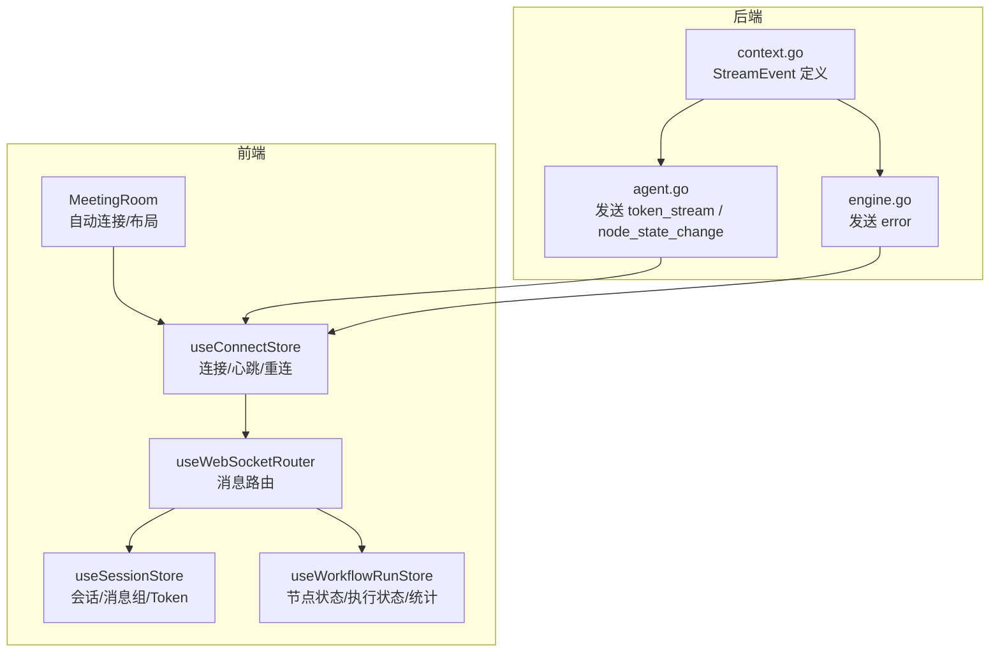
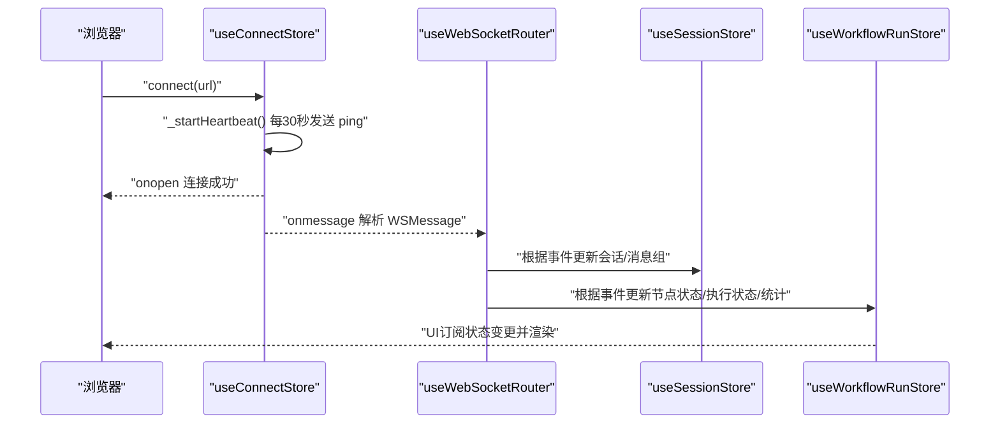
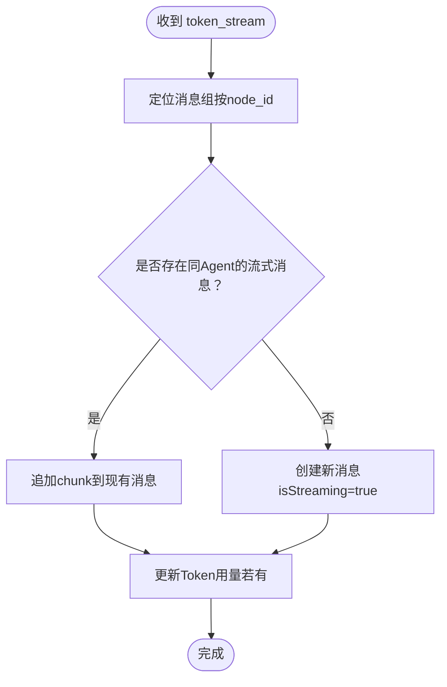
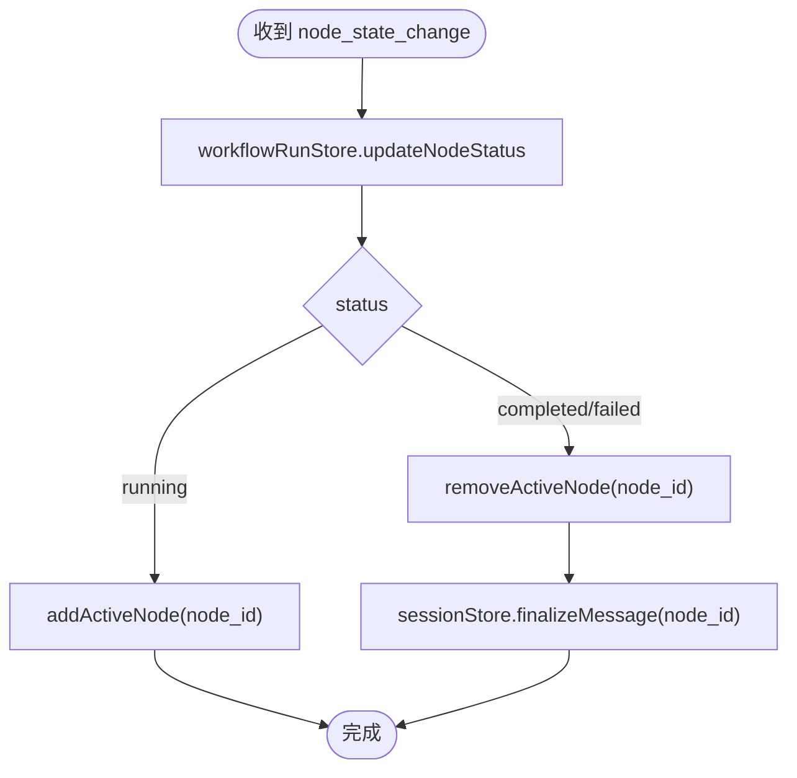
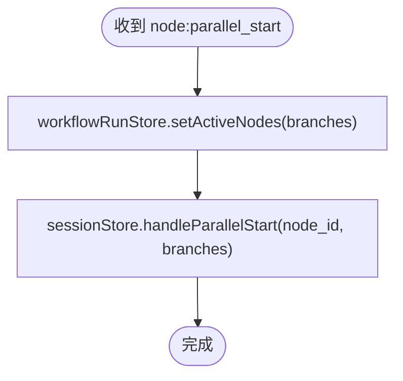
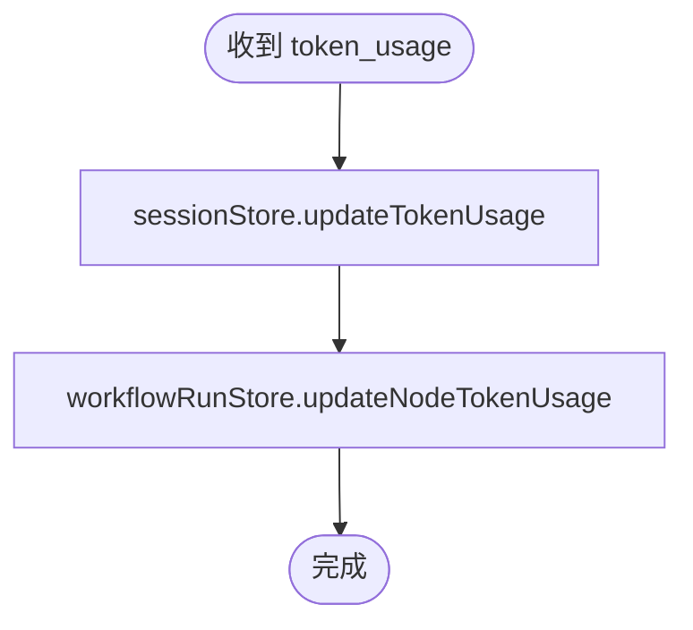
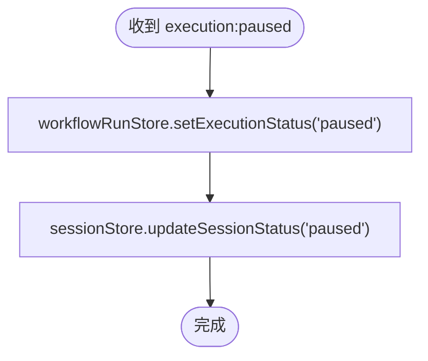
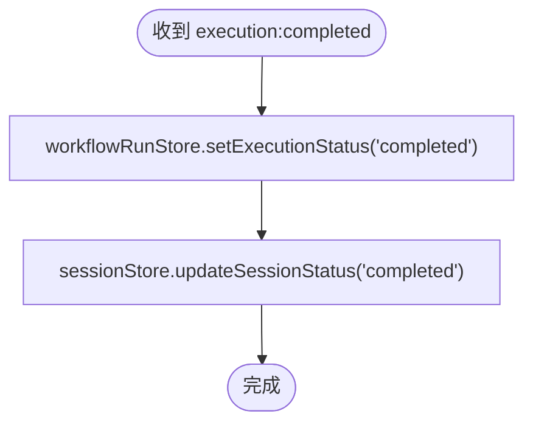
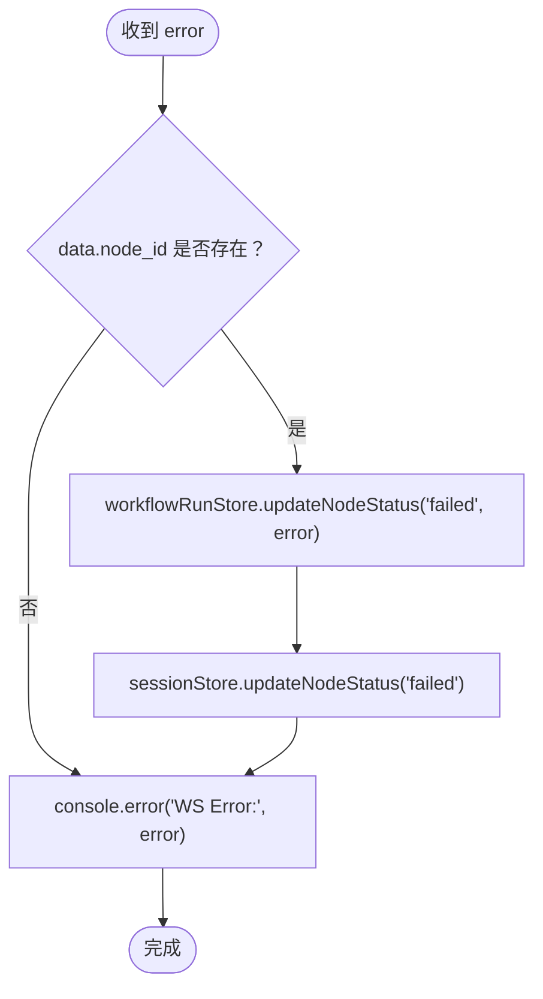
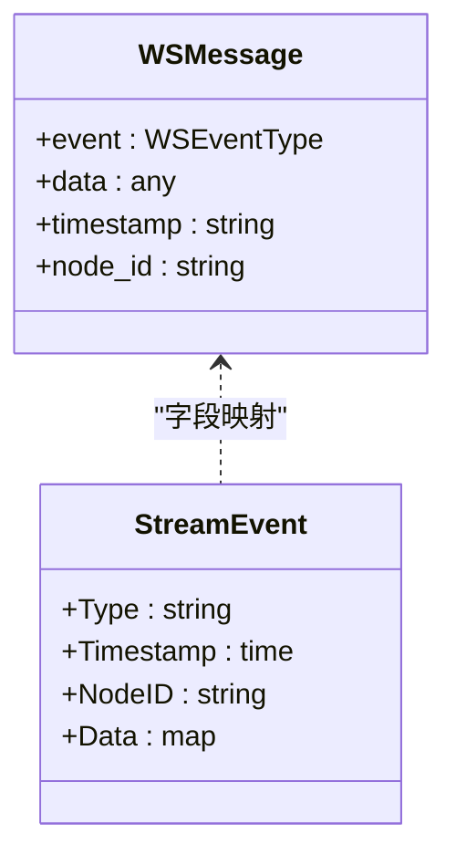

# 下行事件（服务器 → 客户端）

<cite>
**本文引用的文件**
- [websocket.ts](file://frontend/src/types/websocket.ts)
- [useWebSocketRouter.ts](file://frontend/src/hooks/useWebSocketRouter.ts)
- [useConnectStore.ts](file://frontend/src/stores/useConnectStore.ts)
- [useSessionStore.ts](file://frontend/src/stores/useSessionStore.ts)
- [useWorkflowRunStore.ts](file://frontend/src/stores/useWorkflowRunStore.ts)
- [MeetingRoom.tsx](file://frontend/src/features/meeting/MeetingRoom.tsx)
- [context.go](file://internal/core/workflow/context.go)
- [agent.go](file://internal/core/workflow/nodes/agent.go)
- [engine.go](file://internal/core/core/workflow/engine.go)
- [SPEC-005-websocket-optimization.md](file://docs/specs/sprint1/SPEC-005-websocket-optimization.md)
- [SPEC-002-workflow-run-store.md](file://docs/specs/sprint1/SPEC-002-workflow-run-store.md)
- [SPEC-703-session-ws-connect-fix.md](file://docs/specs/sprint7/SPEC-703-session-ws-connect-fix.md)
- [2025-12-21-websocket-debugging-report.md](file://docs/reports/debugging/2025-12-21-websocket-debugging-report.md)
</cite>

## 目录
1. [简介](#简介)
2. [项目结构与角色分工](#项目结构与角色分工)
3. [核心事件类型与数据模型](#核心事件类型与数据模型)
4. [架构概览](#架构概览)
5. [事件处理流程详解](#事件处理流程详解)
6. [依赖关系与耦合分析](#依赖关系与耦合分析)
7. [性能与可靠性特性](#性能与可靠性特性)
8. [故障排查指南](#故障排查指南)
9. [结论](#结论)

## 简介
本文面向前端与后端开发者，系统性梳理服务器向客户端推送的下行事件，重点覆盖以下事件：token_stream、node_state_change、node:parallel_start、token_usage、execution:paused、execution:completed、error，并补充心跳响应（pong）的处理逻辑。文档基于仓库中的TypeScript接口定义与Go后端实现，结合useWebSocketRouter的路由机制，解释前端如何通过Zustand状态订阅机制将事件分发到sessionStore与workflowRunStore，以及在MeetingRoom中的实际应用。

## 项目结构与角色分工
- 前端
  - useConnectStore：负责WebSocket连接生命周期、消息接收、心跳与重连。
  - useWebSocketRouter：统一订阅useConnectStore中的_lastMessage，按event路由到sessionStore与workflowRunStore。
  - sessionStore：维护会话与消息组状态，负责流式消息拼接、节点状态映射、并行开始处理、Token用量汇总。
  - workflowRunStore：维护工作流运行时节点状态、活跃节点集合、执行状态、统计与计时器。
  - MeetingRoom：页面级组件，负责自动连接WebSocket并在UI中展示运行时状态。
- 后端
  - context.go：定义StreamEvent结构，包含event、timestamp、node_id、data等字段。
  - agent.go：在Agent节点执行过程中，向StreamChannel发送token_stream与node_state_change等事件。
  - engine.go：在错误场景下发error事件，并更新节点状态。

图表来源
- [useConnectStore.ts](file://frontend/src/stores/useConnectStore.ts#L1-L127)
- [useWebSocketRouter.ts](file://frontend/src/hooks/useWebSocketRouter.ts#L1-L126)
- [useSessionStore.ts](file://frontend/src/stores/useSessionStore.ts#L1-L332)
- [useWorkflowRunStore.ts](file://frontend/src/stores/useWorkflowRunStore.ts#L1-L301)
- [MeetingRoom.tsx](file://frontend/src/features/meeting/MeetingRoom.tsx#L120-L140)
- [context.go](file://internal/core/workflow/context.go#L1-L35)
- [agent.go](file://internal/core/workflow/nodes/agent.go#L80-L124)
- [engine.go](file://internal/core/core/workflow/engine.go#L173-L182)

章节来源
- [useConnectStore.ts](file://frontend/src/stores/useConnectStore.ts#L1-L127)
- [useWebSocketRouter.ts](file://frontend/src/hooks/useWebSocketRouter.ts#L1-L126)
- [useSessionStore.ts](file://frontend/src/stores/useSessionStore.ts#L1-L332)
- [useWorkflowRunStore.ts](file://frontend/src/stores/useWorkflowRunStore.ts#L1-L301)
- [MeetingRoom.tsx](file://frontend/src/features/meeting/MeetingRoom.tsx#L120-L140)
- [context.go](file://internal/core/workflow/context.go#L1-L35)
- [agent.go](file://internal/core/workflow/nodes/agent.go#L80-L124)
- [engine.go](file://internal/core/core/workflow/engine.go#L173-L182)

## 核心事件类型与数据模型
- 事件类型枚举与消息结构
  - 事件类型：token_stream、node_state_change、node:parallel_start、token_usage、execution:paused、execution:completed、error、human_interaction_required、node_resumed
  - 消息结构：WSMessage包含event、data、timestamp、node_id
- 具体事件数据
  - token_stream：包含node_id、agent_id、chunk、可选is_thinking
  - node_state_change：包含node_id、status
  - node:parallel_start：包含node_id、branches（字符串数组）
  - token_usage：包含node_id、agent_id、input_tokens、output_tokens、estimated_cost_usd
  - execution:paused、execution:completed：无额外data
  - error：包含node_id（可选）与error字符串
  - human_interaction_required、node_resumed：用于人工介入与恢复通知

章节来源
- [websocket.ts](file://frontend/src/types/websocket.ts#L1-L52)
- [SPEC-005-websocket-optimization.md](file://docs/specs/sprint1/SPEC-005-websocket-optimization.md#L47-L105)

## 架构概览
- 前端连接层
  - useConnectStore负责WebSocket连接、心跳（每30秒发送ping）、断线重连（最多5次，指数退避）。
  - onmessage解析WSMessage并写入_store._lastMessage，触发useWebSocketRouter订阅。
- 路由与状态更新
  - useWebSocketRouter按event分发到sessionStore与workflowRunStore，更新节点状态、活跃节点、消息流、Token用量、执行状态等。
- 后端事件源
  - Agent节点在流式输出期间发送token_stream；完成后发送node_state_change。
  - 引擎在错误时发送error事件；并行节点完成后更新状态。

图表来源
- [useConnectStore.ts](file://frontend/src/stores/useConnectStore.ts#L116-L126)
- [useWebSocketRouter.ts](file://frontend/src/hooks/useWebSocketRouter.ts#L1-L126)
- [useSessionStore.ts](file://frontend/src/stores/useSessionStore.ts#L1-L332)
- [useWorkflowRunStore.ts](file://frontend/src/stores/useWorkflowRunStore.ts#L1-L301)

## 事件处理流程详解

### token_stream（流式输出）
- 触发条件
  - Agent节点在LLM流式输出期间持续推送，每收到一段token就发送一次。
- 数据结构
  - WSMessage.event = token_stream；data包含node_id、agent_id、chunk、可选is_thinking。
- 前端处理
  - useWebSocketRouter将chunk追加到对应消息组的最后一条流式消息；若不存在则新建消息。
  - sessionStore.updateTokenUsage同时累加会话与节点的Token用量（若存在usage数据）。
- MeetingRoom中的应用
  - ChatPanel实时渲染Agent输出，支持thinking态提示与增量拼接。

图表来源
- [useWebSocketRouter.ts](file://frontend/src/hooks/useWebSocketRouter.ts#L18-L31)
- [useSessionStore.ts](file://frontend/src/stores/useSessionStore.ts#L172-L223)
- [useSessionStore.ts](file://frontend/src/stores/useSessionStore.ts#L236-L266)

章节来源
- [agent.go](file://internal/core/workflow/nodes/agent.go#L80-L124)
- [useWebSocketRouter.ts](file://frontend/src/hooks/useWebSocketRouter.ts#L18-L31)
- [useSessionStore.ts](file://frontend/src/stores/useSessionStore.ts#L172-L223)
- [useSessionStore.ts](file://frontend/src/stores/useSessionStore.ts#L236-L266)

### node_state_change（节点状态变化）
- 触发条件
  - Agent节点开始执行时发送“running”；完成后发送“completed”；失败时发送“failed”。
- 数据结构
  - WSMessage.event = node_state_change；data包含node_id、status。
- 前端处理
  - workflowRunStore.updateNodeStatus更新节点状态；根据状态增删活跃节点；完成/失败时finalizeMessage。
  - sessionStore.updateNodeStatus同步会话内节点状态与消息组状态。
- MeetingRoom中的应用
  - WorkflowCanvas高亮当前活跃节点；ChatPanel根据节点状态切换消息组状态。

图表来源
- [useWebSocketRouter.ts](file://frontend/src/hooks/useWebSocketRouter.ts#L32-L45)
- [useWorkflowRunStore.ts](file://frontend/src/stores/useWorkflowRunStore.ts#L149-L160)
- [useWorkflowRunStore.ts](file://frontend/src/stores/useWorkflowRunStore.ts#L162-L178)
- [useSessionStore.ts](file://frontend/src/stores/useSessionStore.ts#L145-L162)
- [useSessionStore.ts](file://frontend/src/stores/useSessionStore.ts#L225-L234)

章节来源
- [agent.go](file://internal/core/workflow/nodes/agent.go#L117-L124)
- [useWebSocketRouter.ts](file://frontend/src/hooks/useWebSocketRouter.ts#L32-L45)
- [useWorkflowRunStore.ts](file://frontend/src/stores/useWorkflowRunStore.ts#L149-L160)
- [useSessionStore.ts](file://frontend/src/stores/useSessionStore.ts#L145-L162)

### node:parallel_start（并行分支激活）
- 触发条件
  - 并行节点开始执行时，向所有子分支并行发送该事件。
- 数据结构
  - WSMessage.event = node:parallel_start；data包含node_id、branches（子节点ID数组）。
- 前端处理
  - workflowRunStore.setActiveNodes设置活跃节点集合；sessionStore.handleParallelStart创建并行消息组并标记分支为活跃。
- MeetingRoom中的应用
  - ChatPanel显示并行消息组，便于用户观察多分支输出。

图表来源
- [useWebSocketRouter.ts](file://frontend/src/hooks/useWebSocketRouter.ts#L48-L53)
- [useWorkflowRunStore.ts](file://frontend/src/stores/useWorkflowRunStore.ts#L162-L166)
- [useSessionStore.ts](file://frontend/src/stores/useSessionStore.ts#L280-L300)

章节来源
- [useWebSocketRouter.ts](file://frontend/src/hooks/useWebSocketRouter.ts#L48-L53)
- [useWorkflowRunStore.ts](file://frontend/src/stores/useWorkflowRunStore.ts#L162-L166)
- [useSessionStore.ts](file://frontend/src/stores/useSessionStore.ts#L280-L300)

### token_usage（Token使用统计）
- 触发条件
  - Agent节点输出完成后，或在流式过程中的阶段性统计。
- 数据结构
  - WSMessage.event = token_usage；data包含node_id、agent_id、input_tokens、output_tokens、estimated_cost_usd。
- 前端处理
  - sessionStore.updateTokenUsage累加会话与节点的Token用量；workflowRunStore.updateNodeTokenUsage更新节点统计并累加全局统计。
- MeetingRoom中的应用
  - 成本估算与Token用量在UI中实时更新，辅助用户了解执行成本。

图表来源
- [useWebSocketRouter.ts](file://frontend/src/hooks/useWebSocketRouter.ts#L55-L67)
- [useSessionStore.ts](file://frontend/src/stores/useSessionStore.ts#L236-L266)
- [useWorkflowRunStore.ts](file://frontend/src/stores/useWorkflowRunStore.ts#L180-L189)

章节来源
- [useWebSocketRouter.ts](file://frontend/src/hooks/useWebSocketRouter.ts#L55-L67)
- [useSessionStore.ts](file://frontend/src/stores/useSessionStore.ts#L236-L266)
- [useWorkflowRunStore.ts](file://frontend/src/stores/useWorkflowRunStore.ts#L180-L189)

### execution:paused（执行暂停）
- 触发条件
  - 后端或外部控制命令导致执行暂停。
- 数据结构
  - WSMessage.event = execution:paused；无data。
- 前端处理
  - workflowRunStore.setExecutionStatus与sessionStore.updateSessionStatus均置为paused。
- MeetingRoom中的应用
  - 控制条禁用/启用相应按钮，UI显示暂停状态。

图表来源
- [useWebSocketRouter.ts](file://frontend/src/hooks/useWebSocketRouter.ts#L70-L73)
- [useWorkflowRunStore.ts](file://frontend/src/stores/useWorkflowRunStore.ts#L191-L195)
- [useSessionStore.ts](file://frontend/src/stores/useSessionStore.ts#L131-L143)

章节来源
- [useWebSocketRouter.ts](file://frontend/src/hooks/useWebSocketRouter.ts#L70-L73)
- [useWorkflowRunStore.ts](file://frontend/src/stores/useWorkflowRunStore.ts#L191-L195)
- [useSessionStore.ts](file://frontend/src/stores/useSessionStore.ts#L131-L143)

### execution:completed（执行完成）
- 触发条件
  - 工作流全部节点完成或达到终止条件。
- 数据结构
  - WSMessage.event = execution:completed；无data。
- 前端处理
  - workflowRunStore.setExecutionStatus与sessionStore.updateSessionStatus均置为completed。
- MeetingRoom中的应用
  - UI显示完成状态，停止计时器，允许导出或复盘。

图表来源
- [useWebSocketRouter.ts](file://frontend/src/hooks/useWebSocketRouter.ts#L75-L78)
- [useWorkflowRunStore.ts](file://frontend/src/stores/useWorkflowRunStore.ts#L191-L195)
- [useSessionStore.ts](file://frontend/src/stores/useSessionStore.ts#L131-L143)

章节来源
- [useWebSocketRouter.ts](file://frontend/src/hooks/useWebSocketRouter.ts#L75-L78)
- [useWorkflowRunStore.ts](file://frontend/src/stores/useWorkflowRunStore.ts#L191-L195)
- [useSessionStore.ts](file://frontend/src/stores/useSessionStore.ts#L131-L143)

### error（错误）
- 触发条件
  - Agent节点流式过程中发生错误，或引擎在执行中抛出异常。
- 数据结构
  - WSMessage.event = error；data包含node_id（可选）与error字符串。
- 前端处理
  - 若包含node_id，workflowRunStore.updateNodeStatus('failed', error)；同时sessionStore.updateNodeStatus('failed')；并记录控制台错误。
- MeetingRoom中的应用
  - 节点高亮失败态，提示用户查看错误详情。

图表来源
- [useWebSocketRouter.ts](file://frontend/src/hooks/useWebSocketRouter.ts#L97-L109)
- [useWorkflowRunStore.ts](file://frontend/src/stores/useWorkflowRunStore.ts#L149-L160)
- [useSessionStore.ts](file://frontend/src/stores/useSessionStore.ts#L145-L162)

章节来源
- [engine.go](file://internal/core/core/workflow/engine.go#L173-L182)
- [useWebSocketRouter.ts](file://frontend/src/hooks/useWebSocketRouter.ts#L97-L109)
- [useWorkflowRunStore.ts](file://frontend/src/stores/useWorkflowRunStore.ts#L149-L160)
- [useSessionStore.ts](file://frontend/src/stores/useSessionStore.ts#L145-L162)

### 心跳响应（pong）
- 触发条件
  - 前端每30秒发送ping命令；后端无需显式返回pong，保持连接即可视为健康。
- 前端处理
  - useConnectStore._startHeartbeat定时发送ping；若连接断开则触发重连。
- MeetingRoom中的应用
  - 页面保持连接稳定，避免长时间无响应。

章节来源
- [useConnectStore.ts](file://frontend/src/stores/useConnectStore.ts#L116-L126)
- [SPEC-005-websocket-optimization.md](file://docs/specs/sprint1/SPEC-005-websocket-optimization.md#L129-L130)

## 依赖关系与耦合分析
- 前端
  - useWebSocketRouter依赖useConnectStore的_lastMessage，通过subscribeWithSelector实现低耦合订阅。
  - sessionStore与workflowRunStore分别承担会话与运行时状态职责，避免互相直接依赖。
- 后端
  - StreamEvent结构统一了事件字段命名（event、timestamp、node_id、data），保证前后端一致。
  - Agent与Engine分别在不同阶段推送事件，职责清晰。

图表来源
- [websocket.ts](file://frontend/src/types/websocket.ts#L12-L17)
- [context.go](file://internal/core/workflow/context.go#L9-L14)

章节来源
- [websocket.ts](file://frontend/src/types/websocket.ts#L1-L52)
- [context.go](file://internal/core/workflow/context.go#L1-L35)

## 性能与可靠性特性
- 心跳与重连
  - 前端每30秒发送ping；断线后最多5次指数退避重连，避免频繁抖动。
- 消息去重
  - useWebSocketRouter对相同event+timestamp的消息进行去重，防止重复渲染。
- 并行分支
  - node:parallel_start一次性设置多个活跃节点，减少多次事件带来的状态抖动。
- 计时与统计
  - workflowRunStore提供startTimer/stopTimer与累计统计，便于成本与耗时分析。

章节来源
- [useConnectStore.ts](file://frontend/src/stores/useConnectStore.ts#L1-L127)
- [useWebSocketRouter.ts](file://frontend/src/hooks/useWebSocketRouter.ts#L1-L126)
- [useWorkflowRunStore.ts](file://frontend/src/stores/useWorkflowRunStore.ts#L259-L300)

## 故障排查指南
- 字段命名不一致导致消息无法识别
  - 根因：后端曾使用TypeScript风格的type字段，前端期望event字段，造成消息静默丢失。
  - 修复：后端StreamEvent.Type改为event，前端WSMessage.event保持一致。
- node_id语义混淆
  - 根因：Agent节点在事件中使用AgentID而非NodeID，导致消息显示为UUID而非节点逻辑ID。
  - 修复：事件data中使用a.NodeID替代a.AgentID。
- 会话状态未自动连接
  - MeetingRoom在检测到存在会话但WS断开时自动发起连接，确保用户体验连续性。
- 重连策略
  - 若连接异常关闭，useConnectStore自动调度重连；超过最大次数后记录错误。

章节来源
- [2025-12-21-websocket-debugging-report.md](file://docs/reports/debugging/2025-12-21-websocket-debugging-report.md#L1-L109)
- [SPEC-703-session-ws-connect-fix.md](file://docs/specs/sprint7/SPEC-703-session-ws-connect-fix.md#L134-L158)
- [useConnectStore.ts](file://frontend/src/stores/useConnectStore.ts#L101-L114)
- [MeetingRoom.tsx](file://frontend/src/features/meeting/MeetingRoom.tsx#L128-L136)

## 结论
本文基于仓库中的TypeScript接口与Go后端实现，系统梳理了下行事件的触发条件、数据结构与业务语义，并结合useWebSocketRouter的路由机制解释了前端如何将事件分发到sessionStore与workflowRunStore。通过心跳与重连保障连接稳定性，通过并行分支与Token用量统计提升可观测性与成本控制能力。MeetingRoom页面实现了自动连接与多面板布局，配合事件驱动的UI更新，为用户提供流畅的实时协作体验。