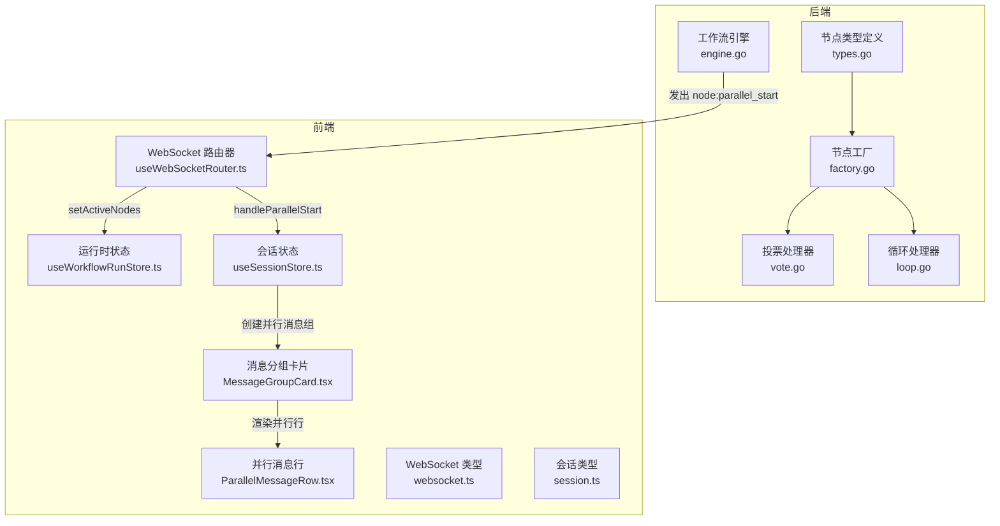
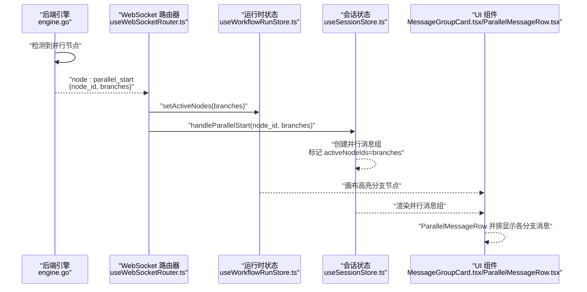
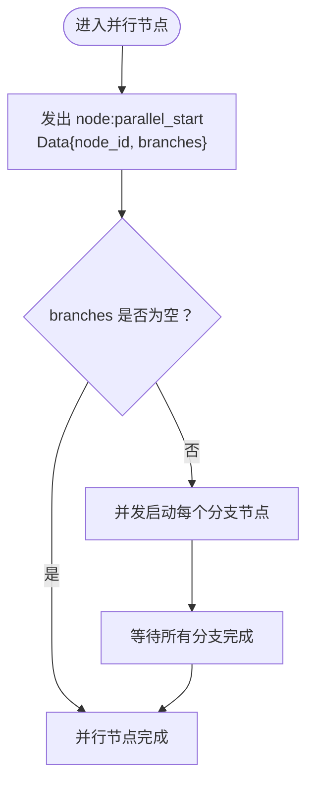
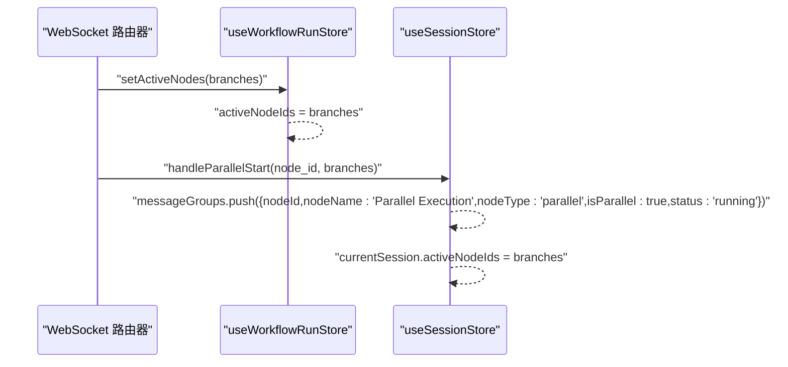
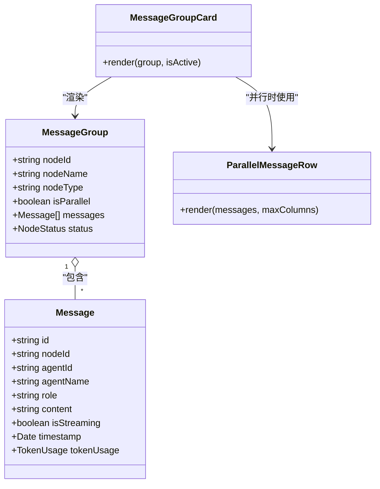
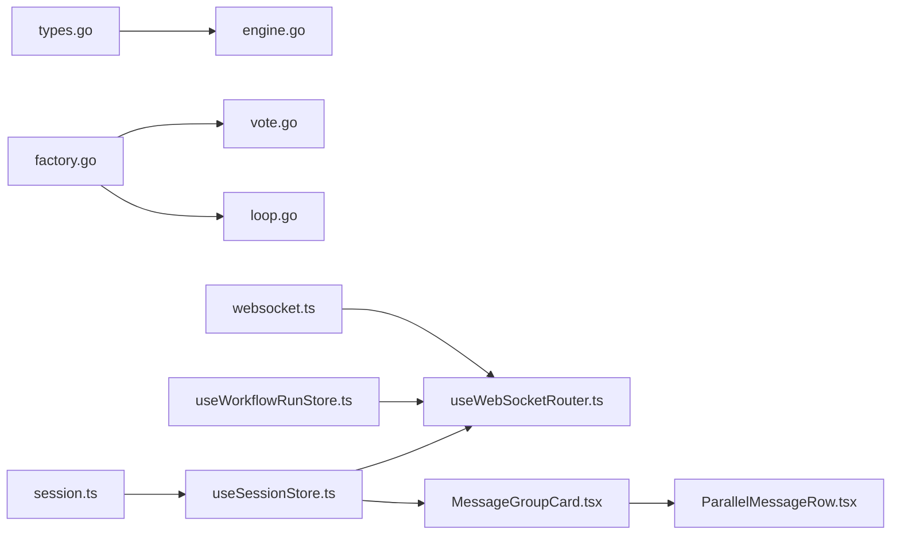

# 并行执行激活

<cite>
**本文引用的文件**
- [engine.go](file://internal/core/workflow/engine.go)
- [types.go](file://internal/core/workflow/types.go)
- [useWebSocketRouter.ts](file://frontend/src/hooks/useWebSocketRouter.ts)
- [useSessionStore.ts](file://frontend/src/stores/useSessionStore.ts)
- [useWorkflowRunStore.ts](file://frontend/src/stores/useWorkflowRunStore.ts)
- [websocket.ts](file://frontend/src/types/websocket.ts)
- [session.ts](file://frontend/src/types/session.ts)
- [ParallelMessageRow.tsx](file://frontend/src/components/chat/ParallelMessageRow.tsx)
- [MessageGroupCard.tsx](file://frontend/src/components/chat/MessageGroupCard.tsx)
- [SPEC-001-session-store.md](file://docs/specs/sprint1/SPEC-001-session-store.md)
- [SPEC-004-parallel-message-ui.md](file://docs/specs/sprint1/SPEC-004-parallel-message-ui.md)
- [SPEC-005-websocket-optimization.md](file://docs/specs/sprint1/SPEC-005-websocket-optimization.md)
- [SPEC-003-chat-panel-grouped.md](file://docs/specs/sprint1/SPEC-003-chat-panel-grouped.md)
- [SPEC-609-architecture-fixes.md](file://docs/specs/sprint6/SPEC-609-architecture-fixes.md)
- [factory.go](file://internal/core/workflow/nodes/factory.go)
- [vote.go](file://internal/core/workflow/nodes/vote.go)
- [loop.go](file://internal/core/workflow/nodes/loop.go)
- [engine_test.go](file://internal/core/workflow/engine_test.go)
</cite>

## 目录
1. [简介](#简介)
2. [项目结构](#项目结构)
3. [核心组件](#核心组件)
4. [架构总览](#架构总览)
5. [详细组件分析](#详细组件分析)
6. [依赖关系分析](#依赖关系分析)
7. [性能考量](#性能考量)
8. [故障排查指南](#故障排查指南)
9. [结论](#结论)
10. [附录](#附录)

## 简介
本文围绕“并行执行激活事件（node:parallel_start）”展开，系统阐述该事件在遇到并行分支（如并行节点、投票节点、循环节点等）时的触发机制，解释 ParallelStartData 数据结构中的 branches 数组如何标识新激活的节点 ID 列表，并说明前端如何通过 workflowStore.setActiveNodes 与 sessionStore.handleParallelStart 同步更新执行上下文，确保 UI 正确渲染并行消息流。同时结合工作流规范文档，说明该事件对实现复杂决策逻辑（如多方案辩论）的关键作用，并介绍在 MeetingRoom 中如何通过 ParallelMessageRow 组件展示并行分支的输出。

## 项目结构
并行执行激活涉及后端工作流引擎与前端 WebSocket 路由、状态存储及 UI 组件的协同：
- 后端：工作流引擎在并行节点处发出 node:parallel_start 事件，携带 branches（分支节点 ID 列表）。
- 前端：WebSocket 路由器接收事件，分别调用 workflowStore.setActiveNodes 与 sessionStore.handleParallelStart，驱动画布高亮与消息分组显示。
- UI：MessageGroupCard 根据 isParallel 决定渲染 ParallelMessageRow，后者以网格方式并排展示各分支消息。

图表来源
- [engine.go](file://internal/core/workflow/engine.go#L141-L147)
- [types.go](file://internal/core/workflow/types.go#L25-L41)
- [factory.go](file://internal/core/workflow/nodes/factory.go#L62-L76)
- [vote.go](file://internal/core/workflow/nodes/vote.go#L1-L51)
- [loop.go](file://internal/core/workflow/nodes/loop.go#L1-L66)
- [useWebSocketRouter.ts](file://frontend/src/hooks/useWebSocketRouter.ts#L37-L68)
- [useWorkflowRunStore.ts](file://frontend/src/stores/useWorkflowRunStore.ts#L162-L178)
- [useSessionStore.ts](file://frontend/src/stores/useSessionStore.ts#L280-L300)
- [MessageGroupCard.tsx](file://frontend/src/components/chat/MessageGroupCard.tsx#L27-L36)
- [ParallelMessageRow.tsx](file://frontend/src/components/chat/ParallelMessageRow.tsx#L1-L37)
- [websocket.ts](file://frontend/src/types/websocket.ts#L1-L20)
- [session.ts](file://frontend/src/types/session.ts#L46-L54)

章节来源
- [engine.go](file://internal/core/workflow/engine.go#L141-L147)
- [useWebSocketRouter.ts](file://frontend/src/hooks/useWebSocketRouter.ts#L37-L68)
- [useWorkflowRunStore.ts](file://frontend/src/stores/useWorkflowRunStore.ts#L162-L178)
- [useSessionStore.ts](file://frontend/src/stores/useSessionStore.ts#L280-L300)
- [MessageGroupCard.tsx](file://frontend/src/components/chat/MessageGroupCard.tsx#L27-L36)
- [ParallelMessageRow.tsx](file://frontend/src/components/chat/ParallelMessageRow.tsx#L1-L37)

## 核心组件
- 并行事件与数据结构
  - 后端在并行节点处发出 node:parallel_start，数据包含 node_id 与 branches（分支节点 ID 列表）。
  - 前端 WebSocket 类型定义了 ParallelStartData，与后端一致。
- 前端路由与状态更新
  - WebSocket 路由器在收到 node:parallel_start 时，调用 workflowStore.setActiveNodes 将 branches 设为当前活跃节点集合，同时调用 sessionStore.handleParallelStart 创建并行消息组并标记分支为活跃。
- UI 渲染
  - MessageGroupCard 根据 isParallel 决定渲染 ParallelMessageRow，后者以网格布局并排展示各分支消息。

章节来源
- [engine.go](file://internal/core/workflow/engine.go#L141-L147)
- [websocket.ts](file://frontend/src/types/websocket.ts#L40-L43)
- [useWebSocketRouter.ts](file://frontend/src/hooks/useWebSocketRouter.ts#L48-L53)
- [useWorkflowRunStore.ts](file://frontend/src/stores/useWorkflowRunStore.ts#L162-L178)
- [useSessionStore.ts](file://frontend/src/stores/useSessionStore.ts#L280-L300)
- [MessageGroupCard.tsx](file://frontend/src/components/chat/MessageGroupCard.tsx#L27-L36)
- [ParallelMessageRow.tsx](file://frontend/src/components/chat/ParallelMessageRow.tsx#L1-L37)

## 架构总览
下图展示了从后端并行节点到前端 UI 的完整链路：后端发出事件，前端路由将其转换为状态更新，最终驱动 UI 渲染。

图表来源
- [engine.go](file://internal/core/workflow/engine.go#L141-L147)
- [useWebSocketRouter.ts](file://frontend/src/hooks/useWebSocketRouter.ts#L48-L53)
- [useWorkflowRunStore.ts](file://frontend/src/stores/useWorkflowRunStore.ts#L162-L178)
- [useSessionStore.ts](file://frontend/src/stores/useSessionStore.ts#L280-L300)
- [MessageGroupCard.tsx](file://frontend/src/components/chat/MessageGroupCard.tsx#L27-L36)
- [ParallelMessageRow.tsx](file://frontend/src/components/chat/ParallelMessageRow.tsx#L1-L37)

## 详细组件分析

### 后端：并行节点触发机制与事件数据
- 触发位置与时机
  - 在并行节点（NodeTypeParallel）处，引擎发出 node:parallel_start 事件，Data 中包含 branches（即 node.NextIDs）。
- 事件数据结构
  - 后端 StreamEvent 包含 event、node_id、data 字段；其中 data 为 map[string]interface{}，在并行场景下包含 branches。
- 节点类型与工厂
  - types.go 定义 NodeTypeParallel；factory.go 将节点类型映射到具体处理器（如 Vote、Loop），这些节点在并行场景下作为分支节点参与执行。

图表来源
- [engine.go](file://internal/core/workflow/engine.go#L141-L147)
- [types.go](file://internal/core/workflow/types.go#L25-L41)
- [factory.go](file://internal/core/workflow/nodes/factory.go#L62-L76)

章节来源
- [engine.go](file://internal/core/workflow/engine.go#L141-L147)
- [types.go](file://internal/core/workflow/types.go#L25-L41)
- [factory.go](file://internal/core/workflow/nodes/factory.go#L62-L76)

### 前端：WebSocket 路由与状态同步
- WebSocket 路由
  - useWebSocketRouter.ts 在收到 node:parallel_start 时，调用 workflowStore.setActiveNodes 将 branches 设为当前活跃节点集合，随后调用 sessionStore.handleParallelStart 创建并行消息组并标记分支为活跃。
- 运行时状态（画布）
  - useWorkflowRunStore.ts 提供 setActiveNodes、addActiveNode、removeActiveNode 等方法，用于画布节点高亮与状态管理。
- 会话状态（消息）
  - useSessionStore.ts 提供 handleParallelStart，负责创建并行消息组并更新当前会话的 activeNodeIds。

图表来源
- [useWebSocketRouter.ts](file://frontend/src/hooks/useWebSocketRouter.ts#L48-L53)
- [useWorkflowRunStore.ts](file://frontend/src/stores/useWorkflowRunStore.ts#L162-L178)
- [useSessionStore.ts](file://frontend/src/stores/useSessionStore.ts#L280-L300)

章节来源
- [useWebSocketRouter.ts](file://frontend/src/hooks/useWebSocketRouter.ts#L37-L68)
- [useWorkflowRunStore.ts](file://frontend/src/stores/useWorkflowRunStore.ts#L162-L178)
- [useSessionStore.ts](file://frontend/src/stores/useSessionStore.ts#L280-L300)

### 前端：并行消息 UI 展示
- 消息分组与并行渲染
  - MessageGroupCard.tsx 根据 group.isParallel 决定渲染 ParallelMessageRow，从而并排展示各分支消息。
- 并行消息行
  - ParallelMessageRow.tsx 使用网格布局，按列数限制并排显示各分支消息，支持为不同分支分配强调色。

图表来源
- [session.ts](file://frontend/src/types/session.ts#L46-L54)
- [MessageGroupCard.tsx](file://frontend/src/components/chat/MessageGroupCard.tsx#L27-L36)
- [ParallelMessageRow.tsx](file://frontend/src/components/chat/ParallelMessageRow.tsx#L1-L37)

章节来源
- [session.ts](file://frontend/src/types/session.ts#L46-L54)
- [MessageGroupCard.tsx](file://frontend/src/components/chat/MessageGroupCard.tsx#L27-L36)
- [ParallelMessageRow.tsx](file://frontend/src/components/chat/ParallelMessageRow.tsx#L1-L37)

### 复杂决策逻辑与并行分支
- 投票节点（Vote）
  - Vote 节点通常作为并行分支的汇聚点，依据各分支输出（如各 Agent 的结果）计算通过率或阈值，决定下一步路径。
- 循环节点（Loop）
  - Loop 节点可在多轮辩论中作为并行分支的控制逻辑，依据分数阈值或最大轮次决定退出条件，从而形成“并行-循环”的复合流程。

章节来源
- [vote.go](file://internal/core/workflow/nodes/vote.go#L1-L51)
- [loop.go](file://internal/core/workflow/nodes/loop.go#L1-L66)
- [factory.go](file://internal/core/workflow/nodes/factory.go#L62-L76)

## 依赖关系分析
- 后端依赖
  - engine.go 依赖 types.go 的 NodeType 定义与 Node.NextIDs。
  - 节点工厂 factory.go 将节点类型映射到具体处理器（如 Vote、Loop），这些处理器在并行场景下作为分支节点参与执行。
- 前端依赖
  - useWebSocketRouter.ts 依赖 websocket.ts 的事件类型与数据结构。
  - useWorkflowRunStore.ts 与 useSessionStore.ts 分别管理画布与消息的运行时状态。
  - UI 组件依赖 session.ts 的类型定义。

图表来源
- [types.go](file://internal/core/workflow/types.go#L25-L41)
- [engine.go](file://internal/core/workflow/engine.go#L141-L147)
- [factory.go](file://internal/core/workflow/nodes/factory.go#L62-L76)
- [vote.go](file://internal/core/workflow/nodes/vote.go#L1-L51)
- [loop.go](file://internal/core/workflow/nodes/loop.go#L1-L66)
- [websocket.ts](file://frontend/src/types/websocket.ts#L1-L20)
- [useWebSocketRouter.ts](file://frontend/src/hooks/useWebSocketRouter.ts#L37-L68)
- [useWorkflowRunStore.ts](file://frontend/src/stores/useWorkflowRunStore.ts#L162-L178)
- [useSessionStore.ts](file://frontend/src/stores/useSessionStore.ts#L280-L300)
- [session.ts](file://frontend/src/types/session.ts#L46-L54)
- [MessageGroupCard.tsx](file://frontend/src/components/chat/MessageGroupCard.tsx#L27-L36)
- [ParallelMessageRow.tsx](file://frontend/src/components/chat/ParallelMessageRow.tsx#L1-L37)

章节来源
- [engine.go](file://internal/core/workflow/engine.go#L141-L147)
- [types.go](file://internal/core/workflow/types.go#L25-L41)
- [factory.go](file://internal/core/workflow/nodes/factory.go#L62-L76)
- [websocket.ts](file://frontend/src/types/websocket.ts#L1-L20)
- [useWebSocketRouter.ts](file://frontend/src/hooks/useWebSocketRouter.ts#L37-L68)
- [useWorkflowRunStore.ts](file://frontend/src/stores/useWorkflowRunStore.ts#L162-L178)
- [useSessionStore.ts](file://frontend/src/stores/useSessionStore.ts#L280-L300)
- [session.ts](file://frontend/src/types/session.ts#L46-L54)
- [MessageGroupCard.tsx](file://frontend/src/components/chat/MessageGroupCard.tsx#L27-L36)
- [ParallelMessageRow.tsx](file://frontend/src/components/chat/ParallelMessageRow.tsx#L1-L37)

## 性能考量
- 并发执行
  - 并行节点下的分支采用并发执行，等待所有分支完成后继续后续流程，避免死锁与资源浪费。
- 状态更新
  - 前端通过 setActiveNodes 一次性设置活跃节点集合，减少多次小粒度更新带来的重渲染成本。
- UI 渲染
  - 并行消息行采用网格布局，合理设置列数，避免过多列导致的布局抖动与渲染压力。

[本节为通用指导，无需列出章节来源]

## 故障排查指南
- 事件未触发
  - 检查后端并行节点定义与 NextIDs 是否正确配置。
  - 确认 engine.go 中 node:parallel_start 的触发逻辑未被中间件拦截。
- 前端未高亮
  - 检查 useWebSocketRouter.ts 的路由逻辑是否正确调用 workflowStore.setActiveNodes。
  - 确认 useWorkflowRunStore.ts 的 activeNodeIds 是否被正确更新。
- 并行消息未显示
  - 检查 useSessionStore.ts 的 handleParallelStart 是否创建了并行消息组。
  - 确认 MessageGroupCard.tsx 的 isParallel 条件与 ParallelMessageRow.tsx 的渲染逻辑。
- 并行 Join 逻辑缺失
  - 若存在并行分支完成后未继续后续节点的情况，参考架构修复文档中关于并行 Join 的说明。

章节来源
- [SPEC-609-architecture-fixes.md](file://docs/specs/sprint6/SPEC-609-architecture-fixes.md#L72-L101)
- [engine.go](file://internal/core/workflow/engine.go#L141-L147)
- [useWebSocketRouter.ts](file://frontend/src/hooks/useWebSocketRouter.ts#L48-L53)
- [useWorkflowRunStore.ts](file://frontend/src/stores/useWorkflowRunStore.ts#L162-L178)
- [useSessionStore.ts](file://frontend/src/stores/useSessionStore.ts#L280-L300)
- [MessageGroupCard.tsx](file://frontend/src/components/chat/MessageGroupCard.tsx#L27-L36)
- [ParallelMessageRow.tsx](file://frontend/src/components/chat/ParallelMessageRow.tsx#L1-L37)

## 结论
node:parallel_start 是实现复杂工作流并行执行的关键事件。后端在并行节点处发出该事件，携带分支节点 ID 列表；前端通过 WebSocket 路由将其转换为 workflowStore.setActiveNodes 与 sessionStore.handleParallelStart 的状态更新，从而在画布上高亮分支节点并在消息面板中创建并行消息组，最终由 ParallelMessageRow 组件并排展示各分支输出。结合 Vote 与 Loop 等节点，该机制能够有效支撑多方案辩论等复杂决策流程。

[本节为总结性内容，无需列出章节来源]

## 附录

### 关键接口与数据结构速览
- 后端事件与数据
  - StreamEvent：包含 event、node_id、data。
  - ParallelStartData：包含 node_id、branches。
- 前端类型与状态
  - WSMessage：包含 event、data、node_id。
  - MessageGroup：包含 nodeId、nodeName、nodeType、isParallel、messages、status。
  - WorkflowSession：包含 nodes Map、activeNodeIds、totalTokens、totalCostUsd。

章节来源
- [engine.go](file://internal/core/workflow/engine.go#L141-L147)
- [websocket.ts](file://frontend/src/types/websocket.ts#L1-L20)
- [session.ts](file://frontend/src/types/session.ts#L46-L54)