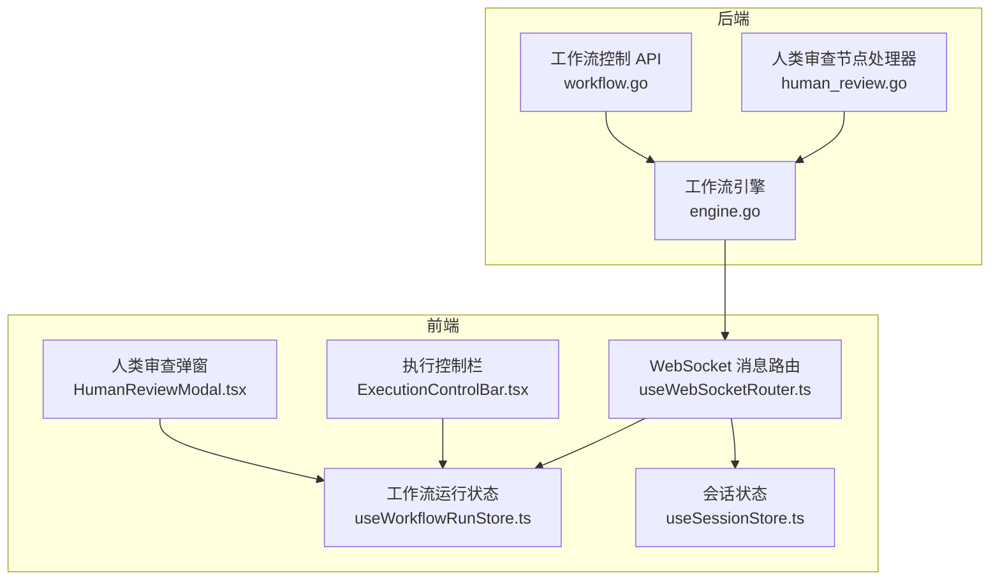
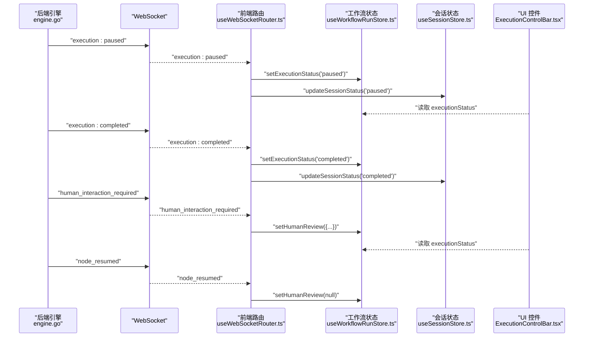
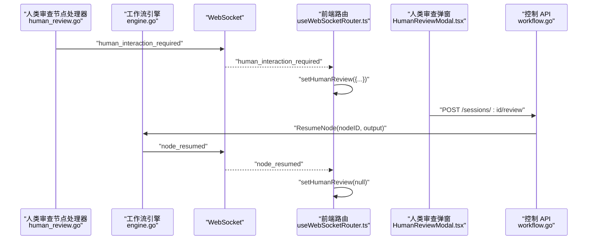
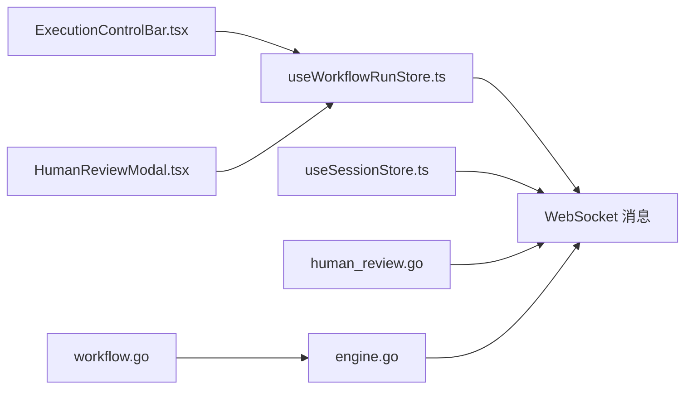

# 执行控制状态

<cite>
**本文引用的文件**
- [useWorkflowEvents.ts](file://frontend/src/hooks/useWorkflowEvents.ts)
- [useWebSocketRouter.ts](file://frontend/src/hooks/useWebSocketRouter.ts)
- [useWorkflowRunStore.ts](file://frontend/src/stores/useWorkflowRunStore.ts)
- [useSessionStore.ts](file://frontend/src/stores/useSessionStore.ts)
- [ExecutionControlBar.tsx](file://frontend/src/components/meeting/ExecutionControlBar.tsx)
- [HumanReviewModal.tsx](file://frontend/src/features/execution/components/HumanReviewModal.tsx)
- [workflow.go](file://internal/api/handler/workflow.go)
- [engine.go](file://internal/core/workflow/engine.go)
- [human_review.go](file://internal/core/workflow/nodes/human_review.go)
- [SPEC-002-workflow-run-store.md](file://docs/specs/sprint1/SPEC-002-workflow-run-store.md)
- [SPEC-001-session-store.md](file://docs/specs/sprint1/SPEC-001-session-store.md)
- [SPEC-609-architecture-fixes.md](file://docs/specs/sprint6/SPEC-609-architecture-fixes.md)
- [human_review.md](file://docs/api/human_review.md)
</cite>

## 目录
1. [简介](#简介)
2. [项目结构](#项目结构)
3. [核心组件](#核心组件)
4. [架构总览](#架构总览)
5. [详细组件分析](#详细组件分析)
6. [依赖关系分析](#依赖关系分析)
7. [性能考量](#性能考量)
8. [故障排查指南](#故障排查指南)
9. [结论](#结论)
10. [附录](#附录)

## 简介
本文聚焦“执行控制状态事件”的工作流生命周期管理，围绕以下事件展开：execution:paused、execution:completed、node_resumed，并结合“人类审查”流程中的 human_interaction_required 事件，说明前端如何通过 useWorkflowRunStore 和 useSessionStore 统一更新执行状态，确保 UI（如 ExecutionControlBar）与后端状态保持一致。同时，结合架构修复文档中关于状态同步可靠性的改进措施，给出实践建议与可视化流程图。

## 项目结构
- 前端通过 WebSocket 接收后端事件，路由到 useWorkflowRunStore 与 useSessionStore，驱动 UI 更新。
- 后端在工作流引擎中产生事件，如 execution:paused、execution:completed、node_resumed、human_interaction_required 等，通过 WebSocket 广播。
- 人类审查节点在后端触发 human_interaction_required，前端弹出 HumanReviewModal，用户提交决定后，后端调用 ResumeNode 并广播 node_resumed。

图表来源
- [useWebSocketRouter.ts](file://frontend/src/hooks/useWebSocketRouter.ts#L1-L126)
- [useWorkflowRunStore.ts](file://frontend/src/stores/useWorkflowRunStore.ts#L1-L301)
- [useSessionStore.ts](file://frontend/src/stores/useSessionStore.ts#L1-L332)
- [ExecutionControlBar.tsx](file://frontend/src/components/meeting/ExecutionControlBar.tsx#L1-L40)
- [HumanReviewModal.tsx](file://frontend/src/features/execution/components/HumanReviewModal.tsx#L1-L25)
- [engine.go](file://internal/core/workflow/engine.go#L206-L245)
- [human_review.go](file://internal/core/workflow/nodes/human_review.go#L1-L46)
- [workflow.go](file://internal/api/handler/workflow.go#L217-L245)

章节来源
- [useWebSocketRouter.ts](file://frontend/src/hooks/useWebSocketRouter.ts#L1-L126)
- [useWorkflowRunStore.ts](file://frontend/src/stores/useWorkflowRunStore.ts#L1-L301)
- [useSessionStore.ts](file://frontend/src/stores/useSessionStore.ts#L1-L332)
- [engine.go](file://internal/core/workflow/engine.go#L206-L245)
- [human_review.go](file://internal/core/workflow/nodes/human_review.go#L1-L46)
- [workflow.go](file://internal/api/handler/workflow.go#L217-L245)

## 核心组件
- 事件路由与状态更新
  - useWebSocketRouter.ts：统一接收并路由 WebSocket 事件，更新工作流与会话状态。
  - useWorkflowEvents.ts：补充处理来自连接层的事件，确保 UI 与后端状态一致。
- 状态存储
  - useWorkflowRunStore.ts：维护执行状态、节点状态、计时器、人类审查请求等。
  - useSessionStore.ts：维护会话级状态、节点状态、消息流、统计等。
- UI 控件
  - ExecutionControlBar.tsx：展示执行状态与控制按钮。
  - HumanReviewModal.tsx：展示人类审查弹窗并提交决定。

章节来源
- [useWebSocketRouter.ts](file://frontend/src/hooks/useWebSocketRouter.ts#L1-L126)
- [useWorkflowEvents.ts](file://frontend/src/hooks/useWorkflowEvents.ts#L1-L83)
- [useWorkflowRunStore.ts](file://frontend/src/stores/useWorkflowRunStore.ts#L1-L301)
- [useSessionStore.ts](file://frontend/src/stores/useSessionStore.ts#L1-L332)
- [ExecutionControlBar.tsx](file://frontend/src/components/meeting/ExecutionControlBar.tsx#L1-L40)
- [HumanReviewModal.tsx](file://frontend/src/features/execution/components/HumanReviewModal.tsx#L1-L25)

## 架构总览
- 事件来源
  - 后端工作流引擎在关键节点发出 execution:paused、execution:completed、node_resumed、human_interaction_required 等事件。
- 事件消费
  - 前端 useWebSocketRouter.ts 将事件映射到工作流运行状态与会话状态，驱动 UI 更新。
- 交互闭环
  - 人类审查节点触发 human_interaction_required，前端弹出 HumanReviewModal，用户提交决定后，后端调用 ResumeNode 并广播 node_resumed，前端清除审查状态。

图表来源
- [engine.go](file://internal/core/workflow/engine.go#L206-L245)
- [useWebSocketRouter.ts](file://frontend/src/hooks/useWebSocketRouter.ts#L70-L101)
- [useWorkflowRunStore.ts](file://frontend/src/stores/useWorkflowRunStore.ts#L197-L261)
- [useSessionStore.ts](file://frontend/src/stores/useSessionStore.ts#L131-L143)
- [ExecutionControlBar.tsx](file://frontend/src/components/meeting/ExecutionControlBar.tsx#L1-L40)

## 详细组件分析

### 执行控制事件：execution:paused 与 execution:completed
- 事件含义
  - execution:paused：工作流暂停，前端停止计时器，UI 展示暂停状态。
  - execution:completed：工作流完成，前端停止计时器，UI 展示完成状态。
- 前端处理
  - useWebSocketRouter.ts：分别设置工作流执行状态与会话状态为 paused/completed。
  - useWorkflowEvents.ts：同样处理 execution:paused 与 execution:completed，确保从不同消息通道都能更新状态。
- UI 同步
  - ExecutionControlBar.tsx 读取 executionStatus，展示当前状态与控制按钮可用性。

章节来源
- [useWebSocketRouter.ts](file://frontend/src/hooks/useWebSocketRouter.ts#L70-L78)
- [useWorkflowEvents.ts](file://frontend/src/hooks/useWorkflowEvents.ts#L60-L68)
- [useWorkflowRunStore.ts](file://frontend/src/stores/useWorkflowRunStore.ts#L191-L195)
- [useSessionStore.ts](file://frontend/src/stores/useSessionStore.ts#L131-L143)
- [ExecutionControlBar.tsx](file://frontend/src/components/meeting/ExecutionControlBar.tsx#L1-L40)

### 人类审查协同：human_interaction_required 与 node_resumed
- 事件含义
  - human_interaction_required：工作流在人类审查节点暂停，等待人工决策。
  - node_resumed：人类审查结束后恢复执行，前端清除审查弹窗。
- 前端处理
  - useWebSocketRouter.ts：收到 human_interaction_required 时，设置 HumanReviewRequest；收到 node_resumed 时清除审查状态。
  - HumanReviewModal.tsx：根据 HumanReviewRequest 展示弹窗，提交 approve/modify/reject 后清除状态。
- 后端处理
  - human_review.go：在节点 Process 中发出 human_interaction_required 并返回挂起错误，使引擎暂停。
  - workflow.go：处理 /sessions/:id/review，调用 ResumeNode 并广播 node_resumed。
  - engine.go：在 ResumeNode 后发出 node_resumed，并异步继续后续节点执行。

图表来源
- [human_review.go](file://internal/core/workflow/nodes/human_review.go#L1-L46)
- [engine.go](file://internal/core/workflow/engine.go#L206-L245)
- [useWebSocketRouter.ts](file://frontend/src/hooks/useWebSocketRouter.ts#L80-L95)
- [HumanReviewModal.tsx](file://frontend/src/features/execution/components/HumanReviewModal.tsx#L1-L25)
- [workflow.go](file://internal/api/handler/workflow.go#L217-L245)

章节来源
- [useWebSocketRouter.ts](file://frontend/src/hooks/useWebSocketRouter.ts#L80-L95)
- [human_review.go](file://internal/core/workflow/nodes/human_review.go#L1-L46)
- [workflow.go](file://internal/api/handler/workflow.go#L217-L245)
- [engine.go](file://internal/core/workflow/engine.go#L206-L245)
- [HumanReviewModal.tsx](file://frontend/src/features/execution/components/HumanReviewModal.tsx#L1-L25)

### 前端状态更新与 UI 同步
- 统一更新策略
  - useWorkflowRunStore.ts：集中管理执行状态、节点状态、计时器、人类审查请求。
  - useSessionStore.ts：集中管理会话状态、节点状态、消息流与统计。
  - useWebSocketRouter.ts：作为事件路由中枢，确保前后端状态一致。
- UI 控件
  - ExecutionControlBar.tsx：基于 executionStatus 动态渲染控制按钮与状态指示。
  - HumanReviewModal.tsx：基于 HumanReviewRequest 渲染弹窗，提交后清除状态。

章节来源
- [useWorkflowRunStore.ts](file://frontend/src/stores/useWorkflowRunStore.ts#L1-L301)
- [useSessionStore.ts](file://frontend/src/stores/useSessionStore.ts#L1-L332)
- [useWebSocketRouter.ts](file://frontend/src/hooks/useWebSocketRouter.ts#L1-L126)
- [ExecutionControlBar.tsx](file://frontend/src/components/meeting/ExecutionControlBar.tsx#L1-L40)
- [HumanReviewModal.tsx](file://frontend/src/features/execution/components/HumanReviewModal.tsx#L1-L25)

### 与架构修复的关系
- 状态同步可靠性
  - SPEC-609-architecture-fixes.md 提到并行节点缺少 Join 逻辑的问题，修复后可避免分支提前汇聚导致的重复执行或状态错乱，间接提升事件驱动的状态一致性。
  - 该修复与 execution:paused、execution:completed、node_resumed 等事件的正确传播相辅相成，确保事件在复杂拓扑下的可预期行为。
- 事件协议一致性
  - 前端 useWebSocketRouter.ts 对 human_interaction_required 与 node_resumed 的处理，与后端 human_review.go 与 engine.go 的事件广播保持一致，形成闭环。

章节来源
- [SPEC-609-architecture-fixes.md](file://docs/specs/sprint6/SPEC-609-architecture-fixes.md#L97-L136)
- [useWebSocketRouter.ts](file://frontend/src/hooks/useWebSocketRouter.ts#L80-L95)
- [human_review.go](file://internal/core/workflow/nodes/human_review.go#L1-L46)
- [engine.go](file://internal/core/workflow/engine.go#L206-L245)

## 依赖关系分析
- 前端依赖
  - useWorkflowRunStore.ts 与 useSessionStore.ts 依赖于 WebSocket 消息通道（通过 useConnectStore），由 useWebSocketRouter.ts 路由。
  - ExecutionControlBar.tsx 依赖 useWorkflowRunStore.ts 的 executionStatus 与控制状态派生函数。
  - HumanReviewModal.tsx 依赖 useWorkflowRunStore.ts 的 HumanReviewRequest 与提交方法。
- 后端依赖
  - human_review.go 通过 StreamEvent 广播 human_interaction_required。
  - engine.go 在 ResumeNode 后广播 node_resumed，并继续后续节点执行。
  - workflow.go 在 /sessions/:id/review 中调用 ResumeNode 并返回响应。

图表来源
- [useWorkflowRunStore.ts](file://frontend/src/stores/useWorkflowRunStore.ts#L1-L301)
- [useSessionStore.ts](file://frontend/src/stores/useSessionStore.ts#L1-L332)
- [useWebSocketRouter.ts](file://frontend/src/hooks/useWebSocketRouter.ts#L1-L126)
- [ExecutionControlBar.tsx](file://frontend/src/components/meeting/ExecutionControlBar.tsx#L1-L40)
- [HumanReviewModal.tsx](file://frontend/src/features/execution/components/HumanReviewModal.tsx#L1-L25)
- [human_review.go](file://internal/core/workflow/nodes/human_review.go#L1-L46)
- [engine.go](file://internal/core/workflow/engine.go#L206-L245)
- [workflow.go](file://internal/api/handler/workflow.go#L217-L245)

章节来源
- [useWorkflowRunStore.ts](file://frontend/src/stores/useWorkflowRunStore.ts#L1-L301)
- [useSessionStore.ts](file://frontend/src/stores/useSessionStore.ts#L1-L332)
- [useWebSocketRouter.ts](file://frontend/src/hooks/useWebSocketRouter.ts#L1-L126)
- [ExecutionControlBar.tsx](file://frontend/src/components/meeting/ExecutionControlBar.tsx#L1-L40)
- [HumanReviewModal.tsx](file://frontend/src/features/execution/components/HumanReviewModal.tsx#L1-L25)
- [human_review.go](file://internal/core/workflow/nodes/human_review.go#L1-L46)
- [engine.go](file://internal/core/workflow/engine.go#L206-L245)
- [workflow.go](file://internal/api/handler/workflow.go#L217-L245)

## 性能考量
- 事件路由与状态更新
  - useWebSocketRouter.ts 采用订阅模式，按事件类型进行最小化更新，避免全量重渲染。
  - useWorkflowRunStore.ts 与 useSessionStore.ts 使用不可变更新（Immer），减少不必要的状态拷贝。
- 计时器与统计
  - useWorkflowRunStore.ts 的计时器在暂停/完成时停止，避免无效轮询。
  - 统计值（总节点数、完成数、失败数、总耗时、总成本）按需增量更新，降低计算压力。
- 人类审查
  - human_interaction_required 事件仅在人类审查节点触发，避免对其他节点造成额外负担。
  - node_resumed 事件触发后，前端及时清理审查状态，释放 UI 资源。

章节来源
- [useWebSocketRouter.ts](file://frontend/src/hooks/useWebSocketRouter.ts#L1-L126)
- [useWorkflowRunStore.ts](file://frontend/src/stores/useWorkflowRunStore.ts#L197-L261)
- [useSessionStore.ts](file://frontend/src/stores/useSessionStore.ts#L236-L266)

## 故障排查指南
- 执行状态未更新
  - 检查 useWebSocketRouter.ts 是否正确路由 execution:paused 与 execution:completed。
  - 确认 useWorkflowRunStore.ts 的 setExecutionStatus 是否被调用。
- 人类审查弹窗不消失
  - 检查后端是否正确广播 node_resumed。
  - 确认 useWebSocketRouter.ts 的 node_resumed 分支是否清除了 HumanReviewRequest。
- 人类审查提交失败
  - 检查 workflow.go 的 /sessions/:id/review 是否调用 ResumeNode 并返回成功。
  - 确认 HumanReviewModal.tsx 的 submitHumanReview 是否正确发起请求并清除状态。
- 并行执行异常
  - 参考 SPEC-609-architecture-fixes.md 的并行 Join 修复，确保分支汇聚逻辑正确，避免重复执行或状态错乱。

章节来源
- [useWebSocketRouter.ts](file://frontend/src/hooks/useWebSocketRouter.ts#L70-L101)
- [useWorkflowRunStore.ts](file://frontend/src/stores/useWorkflowRunStore.ts#L233-L257)
- [workflow.go](file://internal/api/handler/workflow.go#L217-L245)
- [SPEC-609-architecture-fixes.md](file://docs/specs/sprint6/SPEC-609-architecture-fixes.md#L97-L136)

## 结论
- execution:paused、execution:completed、node_resumed 与 human_interaction_required 共同构成工作流生命周期的核心事件链。
- 前端通过 useWorkflowRunStore 与 useSessionStore 统一更新执行状态，确保 UI 与后端状态一致。
- 人类审查流程通过 human_interaction_required 与 node_resumed 形成闭环，用户决定后恢复执行。
- 架构修复文档强调了并行 Join 等关键缺陷的修复，有助于提升事件驱动状态的一致性与可靠性。

## 附录
- 事件处理与状态派生参考
  - 执行控制状态派生：参见 SPEC-002-workflow-run-store.md 中的派生逻辑与控制命令发送。
  - 会话状态类型与接口：参见 SPEC-001-session-store.md 中的类型定义与 Store 接口。

章节来源
- [SPEC-002-workflow-run-store.md](file://docs/specs/sprint1/SPEC-002-workflow-run-store.md#L218-L296)
- [SPEC-001-session-store.md](file://docs/specs/sprint1/SPEC-001-session-store.md#L1-L145)