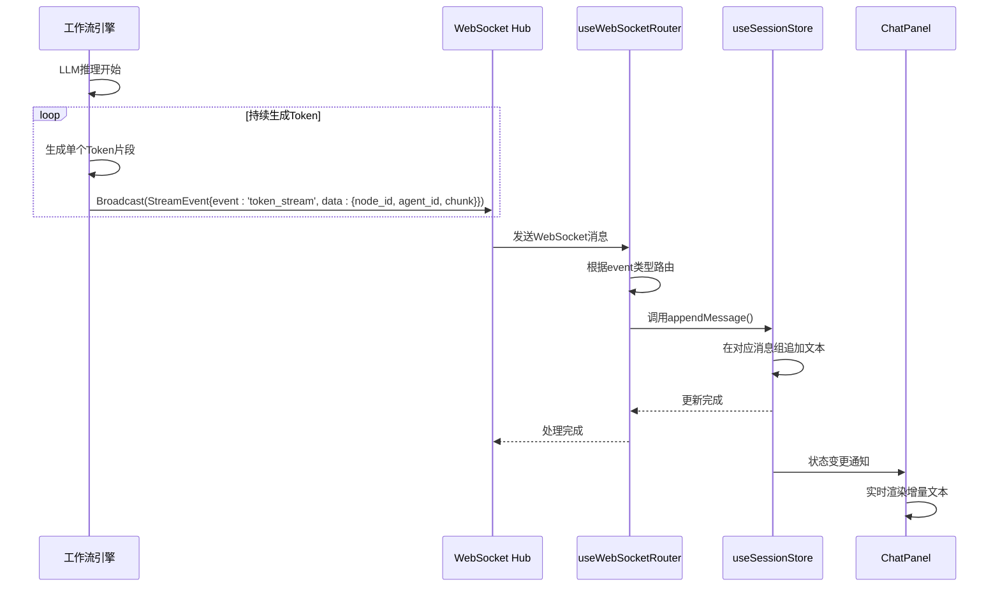
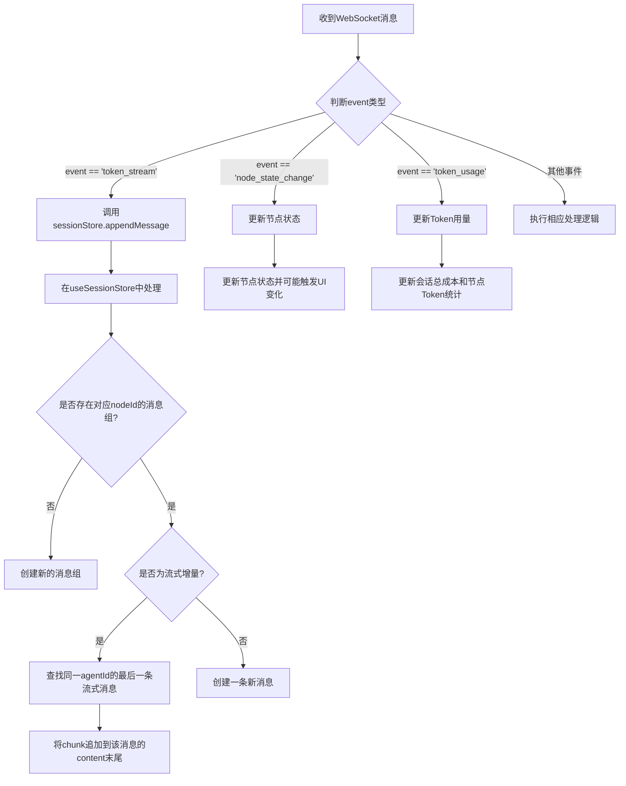

# 流式Token输出

<cite>
**本文档引用的文件**   
- [hub.go](file://internal/api/ws/hub.go)
- [useWebSocketRouter.ts](file://frontend/src/hooks/useWebSocketRouter.ts)
- [useSessionStore.ts](file://frontend/src/stores/useSessionStore.ts)
- [websocket.ts](file://frontend/src/types/websocket.ts)
- [engine.go](file://internal/core/workflow/engine.go)
- [agent.go](file://internal/core/workflow/nodes/agent.go)
- [context.go](file://internal/core/workflow/context.go)
- [ChatPanel.tsx](file://frontend/src/components/chat/ChatPanel.tsx)
- [SPEC-005-websocket-optimization.md](file://docs/specs/sprint1/SPEC-005-websocket-optimization.md)
- [2025-12-21-websocket-debugging-report.md](file://docs/reports/debugging/2025-12-21-websocket-debugging-report.md)
</cite>

## 目录
1. [引言](#引言)
2. [核心架构与事件流](#核心架构与事件流)
3. [TokenStreamData数据结构详解](#tokenstreamdata数据结构详解)
4. [前端消息路由与处理](#前端消息路由与处理)
5. [消息渲染与UI更新机制](#消息渲染与ui更新机制)
6. [高并发性能优化策略](#高并发性能优化策略)
7. [字段命名一致性保障](#字段命名一致性保障)
8. [结论](#结论)

## 引言
本文档详细阐述了“流式Token输出”功能的实现机制，聚焦于`token_stream`事件如何在LLM推理过程中被持续生成，并通过WebSocket Hub广播至前端，最终实现实时、流畅的类ChatGPT式交互体验。文档将深入分析后端工作流引擎、WebSocket通信协议、前端状态管理与UI渲染的完整链路，并提供高并发场景下的性能优化建议。

## 核心架构与事件流

**Diagram sources**
- [agent.go](file://internal/core/workflow/nodes/agent.go#L80-L97)
- [hub.go](file://internal/api/ws/hub.go#L71-L73)
- [useWebSocketRouter.ts](file://frontend/src/hooks/useWebSocketRouter.ts#L19-L28)
- [useSessionStore.ts](file://frontend/src/stores/useSessionStore.ts#L212-L221)
- [ChatPanel.tsx](file://frontend/src/components/chat/ChatPanel.tsx#L24-L26)

**Section sources**
- [engine.go](file://internal/core/workflow/engine.go#L101-L102)
- [hub.go](file://internal/api/ws/hub.go#L55-L65)

## TokenStreamData数据结构详解

`TokenStreamData`是`token_stream`事件的核心数据载体，其字段定义了流式输出的上下文和内容。

| 字段 | 类型 | 必需 | 语义与用途 |
| :--- | :--- | :--- | :--- |
| `node_id` | `string` | 是 | 标识当前正在生成文本的**工作流节点ID**。前端使用此ID将Token片段归类到正确的消息组（MessageGroup），确保不同节点的输出互不干扰。 |
| `agent_id` | `string` | 是 | 标识执行推理的**智能体（Agent）ID**。在并行或辩论场景中，多个Agent可能同时输出，此字段用于区分不同Agent的发言，确保文本被正确地关联到对应的发言者。 |
| `chunk` | `string` | 是 | 包含从LLM模型流式返回的**单个文本片段**。该字段是增量更新的基础，前端会将这些连续的`chunk`拼接成完整的响应。 |
| `is_thinking` | `boolean` | 否 | 可选标志，用于指示LLM当前处于**推理/思考阶段**（如o1模型的思维链）。前端可根据此标志显示“思考中”等状态，提升用户体验。 |

**Section sources**
- [websocket.ts](file://frontend/src/types/websocket.ts#L20-L25)
- [SPEC-005-websocket-optimization.md](file://docs/specs/sprint1/SPEC-005-websocket-optimization.md#L71-L76)

## 前端消息路由与处理

前端通过`useWebSocketRouter` Hook订阅WebSocket消息，并根据`event`类型进行路由分发。

**Diagram sources**
- [useWebSocketRouter.ts](file://frontend/src/hooks/useWebSocketRouter.ts#L17-L30)
- [useSessionStore.ts](file://frontend/src/stores/useSessionStore.ts#L212-L221)

**Section sources**
- [useWebSocketRouter.ts](file://frontend/src/hooks/useWebSocketRouter.ts#L13-L111)
- [useSessionStore.ts](file://frontend/src/stores/useSessionStore.ts#L64-L223)

## 消息渲染与UI更新机制

当`useSessionStore`中的消息数据更新后，`ChatPanel`组件会自动重新渲染，将增量文本实时展示给用户。

1.  **状态订阅**：`ChatPanel`组件通过`useSessionStore`的`messageGroups`选择器订阅消息状态。
2.  **列表渲染**：组件遍历`messageGroups`数组，为每个消息组渲染一个`MessageGroupCard`。
3.  **增量更新**：由于`appendMessage`直接修改了现有消息对象的`content`，React会检测到该对象的引用未变但内容已更新，从而高效地仅重新渲染发生变化的文本部分。
4.  **自动滚动**：`useEffect` Hook监听`messageGroups`的变化，一旦有新内容，便调用`scrollIntoView`将滚动条自动定位到最底部。

**Section sources**
- [ChatPanel.tsx](file://frontend/src/components/chat/ChatPanel.tsx#L17-L26)
- [useSessionStore.ts](file://frontend/src/stores/useSessionStore.ts#L212-L221)

## 高并发性能优化策略

为应对高并发场景下的性能挑战，系统采用了以下优化策略：

1.  **消息节流 (Message Throttling)**：
    *   **问题**：LLM可能以极高频率（每秒数十次）发送`token_stream`事件，导致前端频繁重渲染，造成卡顿。
    *   **方案**：在`useWebSocketRouter`或`useSessionStore`中引入节流机制。例如，使用`lodash.throttle`或`setTimeout`，将短时间内（如50ms内）收到的所有`chunk`合并后，再一次性调用`appendMessage`。这能显著减少状态更新和UI渲染的次数。

2.  **UI更新批处理 (UI Update Batching)**：
    *   **问题**：即使后端消息已节流，React的默认行为仍可能对每次状态更新进行单独渲染。
    *   **方案**：利用React 18的自动批处理（Automatic Batching）特性。当多个状态更新发生在同一个事件循环中时（如一个节流周期内的多次`appendMessage`），React会将它们合并为一次渲染。确保`appendMessage`的调用在同一个同步或微任务上下文中完成，以最大化批处理效果。

3.  **WebSocket Hub优化**：
    *   **问题**：`hub.go`中的`broadcast`通道和`clients`映射在高并发下可能成为瓶颈。
    *   **方案**：`hub.broadcast`通道已设置为带缓冲的通道（`make(chan workflow.StreamEvent, 100)`），能平滑突发流量。`sync.Mutex`保护了`clients`映射的并发访问，确保了广播时的线程安全。

**Section sources**
- [hub.go](file://internal/api/ws/hub.go#L32)
- [useWebSocketRouter.ts](file://frontend/src/hooks/useWebSocketRouter.ts#L17-L30)
- [useSessionStore.ts](file://frontend/src/stores/useSessionStore.ts#L212-L221)

## 字段命名一致性保障

为确保前后端字段命名的一致性，系统严格遵循`SPEC-005`中定义的TypeScript接口。

*   **关键字段**：`event: 'token_stream'`是核心事件标识。历史上曾因后端使用`type`而前端使用`event`导致消息丢失（见`2025-12-21-websocket-debugging-report.md`）。
*   **解决方案**：
    1.  **统一命名**：后端`StreamEvent`结构体的JSON标签已明确指定为`json:"event"`，与前端`WSMessage`接口完全匹配。
    2.  **文档驱动**：`SPEC-005`作为权威文档，明确定义了所有事件类型和数据结构。
    3.  **根因复盘**：通过`2025-12-21-websocket-debugging-report.md`的复盘，团队认识到缺乏自动化类型同步工具（如`tygo`）和端到端测试的严重性，未来将加强此类实践。

**Section sources**
- [context.go](file://internal/core/workflow/context.go#L10)
- [websocket.ts](file://frontend/src/types/websocket.ts#L13)
- [SPEC-005-websocket-optimization.md](file://docs/specs/sprint1/SPEC-005-websocket-optimization.md#L65)
- [2025-12-21-websocket-debugging-report.md](file://docs/reports/debugging/2025-12-21-websocket-debugging-report.md#L27-L40)

## 结论
“流式Token输出”功能通过`token_stream`事件，构建了一条从LLM推理到前端UI的高效、实时的数据通道。其核心在于工作流引擎的持续事件广播、WebSocket Hub的可靠消息分发、前端`useWebSocketRouter`的精准路由以及`useSessionStore`的增量状态管理。通过遵循`SPEC-005`的接口规范并实施消息节流等性能优化策略，系统能够稳定地提供流畅的交互体验。未来应考虑引入自动化类型同步工具，以进一步降低因命名不一致导致的集成风险。