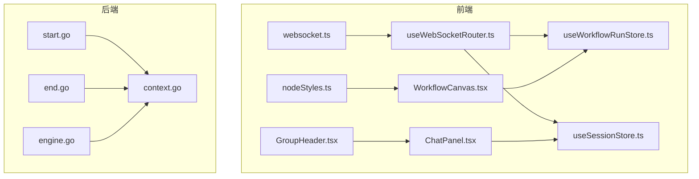
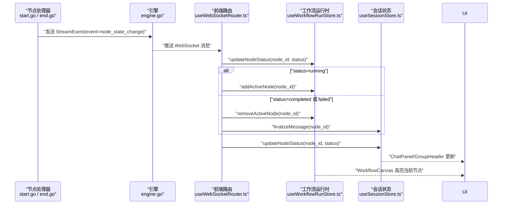
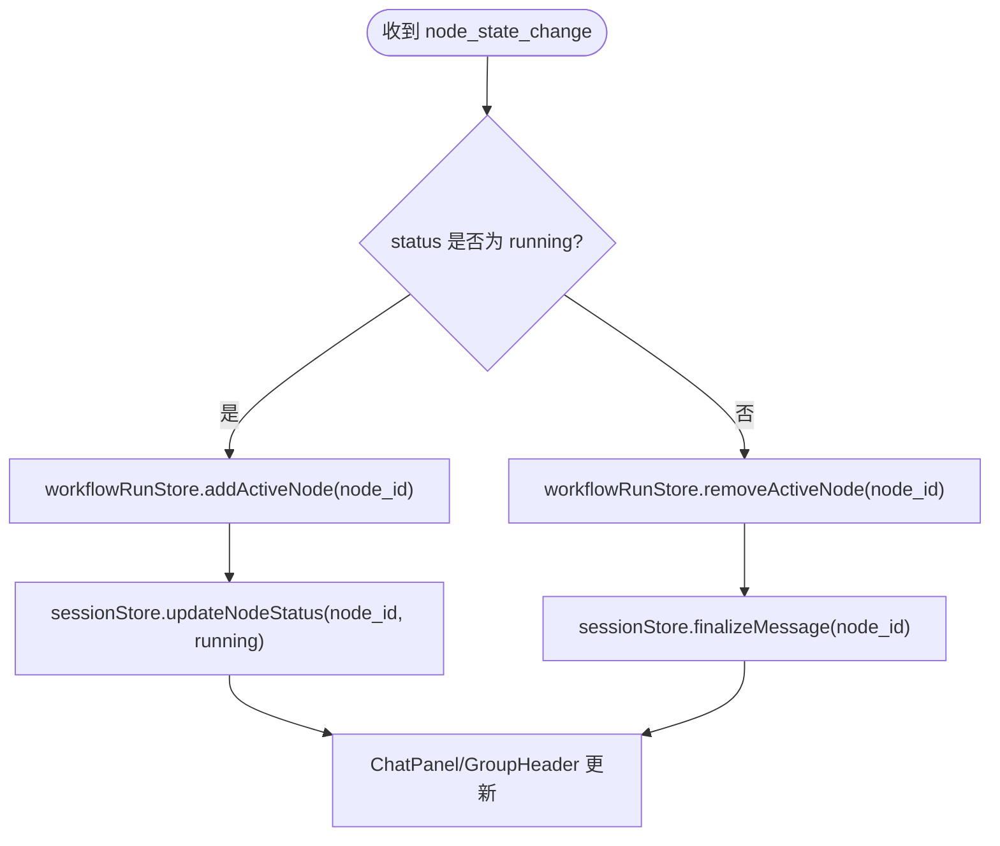
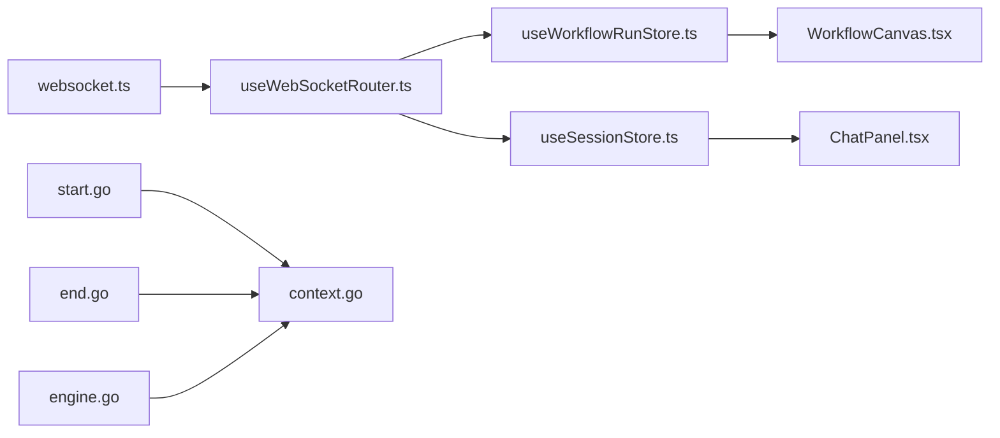

# 节点状态变更

<cite>
**本文引用的文件**
- [websocket.ts](file://frontend/src/types/websocket.ts)
- [useWebSocketRouter.ts](file://frontend/src/hooks/useWebSocketRouter.ts)
- [useWorkflowRunStore.ts](file://frontend/src/stores/useWorkflowRunStore.ts)
- [useSessionStore.ts](file://frontend/src/stores/useSessionStore.ts)
- [context.go](file://internal/core/workflow/context.go)
- [engine.go](file://internal/core/workflow/engine.go)
- [start.go](file://internal/core/workflow/nodes/start.go)
- [end.go](file://internal/core/workflow/nodes/end.go)
- [SPEC-005-websocket-optimization.md](file://docs/specs/sprint1/SPEC-005-websocket-optimization.md)
- [SPEC-002-workflow-run-store.md](file://docs/specs/sprint1/SPEC-002-workflow-run-store.md)
- [SPEC-802-workflow-live-monitor.md](file://docs/specs/sprint8/SPEC-802-workflow-live-monitor.md)
- [nodeStyles.ts](file://frontend/src/utils/nodeStyles.ts)
- [ChatPanel.tsx](file://frontend/src/components/chat/ChatPanel.tsx)
- [GroupHeader.tsx](file://frontend/src/components/chat/GroupHeader.tsx)
- [WorkflowCanvas.tsx](file://frontend/src/components/workflow/WorkflowCanvas.tsx)
</cite>

## 目录
1. [简介](#简介)
2. [项目结构](#项目结构)
3. [核心组件](#核心组件)
4. [架构总览](#架构总览)
5. [详细组件分析](#详细组件分析)
6. [依赖关系分析](#依赖关系分析)
7. [性能考量](#性能考量)
8. [故障排查指南](#故障排查指南)
9. [结论](#结论)

## 简介
本专项文档聚焦“节点状态变更”事件（node_state_change）在工作流执行过程中的触发时机、数据结构约束、前后端协同更新流程，以及UI层的可视化呈现。重点涵盖：
- 事件触发时机：节点进入“running”、“completed”、“failed”等状态的业务场景
- NodeStateChangeData 数据结构中 node_id 与 status 字段的约束条件
- 前端 useWebSocketRouter 如何同步更新 workflowRunStore 与 sessionStore，并在节点完成时联动 sessionStore 进行消息状态的最终化处理（finalizeMessage）
- 首个节点启动时自动更新会话状态为“running”的设计逻辑
- UI 层 WorkflowCanvas 与 ChatPanel 中节点状态变化的可视化方案

## 项目结构
围绕“节点状态变更”事件，涉及前后端的关键文件如下：
- 前端类型与路由
  - websocket.ts：定义 WebSocket 事件类型与 NodeStateChangeData 接口
  - useWebSocketRouter.ts：统一消息路由与事件分发
  - useWorkflowRunStore.ts：工作流运行时状态与节点状态管理
  - useSessionStore.ts：会话级状态与消息分组管理
  - nodeStyles.ts：节点状态样式映射
  - ChatPanel.tsx / GroupHeader.tsx：聊天面板与分组头部的节点状态展示
  - WorkflowCanvas.tsx：工作流画布（运行态高亮当前节点）
- 后端事件源
  - context.go：StreamEvent 定义（包含 event、timestamp、node_id、data）
  - engine.go：引擎执行流程与错误事件发出
  - start.go / end.go：具体节点处理器在生命周期关键点发出 node_state_change

图表来源
- [websocket.ts](file://frontend/src/types/websocket.ts#L1-L52)
- [useWebSocketRouter.ts](file://frontend/src/hooks/useWebSocketRouter.ts#L1-L35)
- [useWorkflowRunStore.ts](file://frontend/src/stores/useWorkflowRunStore.ts#L1-L301)
- [useSessionStore.ts](file://frontend/src/stores/useSessionStore.ts#L1-L332)
- [context.go](file://internal/core/workflow/context.go#L1-L35)
- [engine.go](file://internal/core/workflow/engine.go#L1-L246)
- [start.go](file://internal/core/workflow/nodes/start.go#L1-L52)
- [end.go](file://internal/core/workflow/nodes/end.go#L1-L114)
- [nodeStyles.ts](file://frontend/src/utils/nodeStyles.ts#L1-L38)
- [ChatPanel.tsx](file://frontend/src/components/chat/ChatPanel.tsx#L1-L77)
- [GroupHeader.tsx](file://frontend/src/components/chat/GroupHeader.tsx#L1-L42)
- [WorkflowCanvas.tsx](file://frontend/src/components/workflow/WorkflowCanvas.tsx#L53-L94)

章节来源
- [websocket.ts](file://frontend/src/types/websocket.ts#L1-L52)
- [useWebSocketRouter.ts](file://frontend/src/hooks/useWebSocketRouter.ts#L1-L35)
- [useWorkflowRunStore.ts](file://frontend/src/stores/useWorkflowRunStore.ts#L1-L301)
- [useSessionStore.ts](file://frontend/src/stores/useSessionStore.ts#L1-L332)
- [context.go](file://internal/core/workflow/context.go#L1-L35)
- [engine.go](file://internal/core/workflow/engine.go#L1-L246)
- [start.go](file://internal/core/workflow/nodes/start.go#L1-L52)
- [end.go](file://internal/core/workflow/nodes/end.go#L1-L114)
- [nodeStyles.ts](file://frontend/src/utils/nodeStyles.ts#L1-L38)
- [ChatPanel.tsx](file://frontend/src/components/chat/ChatPanel.tsx#L1-L77)
- [GroupHeader.tsx](file://frontend/src/components/chat/GroupHeader.tsx#L1-L42)
- [WorkflowCanvas.tsx](file://frontend/src/components/workflow/WorkflowCanvas.tsx#L53-L94)

## 核心组件
- NodeStateChangeData
  - 字段：node_id（字符串）、status（枚举：pending | running | completed | failed）
  - 约束条件：
    - node_id 必须与工作流图中节点 ID 对应，确保前端可定位到对应节点
    - status 仅允许上述四值之一，保证状态机一致性
- StreamEvent（后端）
  - 字段：event（字符串）、timestamp（时间戳）、node_id（可选）、data（任意对象）
  - 用于承载 node_state_change 等实时事件
- useWebSocketRouter（前端）
  - 路由 node_state_change：更新 workflowRunStore 与 sessionStore
  - 在 running 时加入活跃节点集合，在 completed/failed 时移除并调用 sessionStore.finalizeMessage
- workflowRunStore（前端）
  - 维护 nodes、edges、activeNodeIds、executionStatus、stats 等
  - 提供 updateNodeStatus、addActiveNode、removeActiveNode、setExecutionStatus 等动作
- sessionStore（前端）
  - 维护 currentSession、messageGroups、connectionStatus
  - 提供 updateSessionStatus、updateNodeStatus、appendMessage、finalizeMessage 等动作

章节来源
- [websocket.ts](file://frontend/src/types/websocket.ts#L1-L52)
- [context.go](file://internal/core/workflow/context.go#L1-L35)
- [useWebSocketRouter.ts](file://frontend/src/hooks/useWebSocketRouter.ts#L1-L35)
- [useWorkflowRunStore.ts](file://frontend/src/stores/useWorkflowRunStore.ts#L1-L301)
- [useSessionStore.ts](file://frontend/src/stores/useSessionStore.ts#L1-L332)

## 架构总览
节点状态变更事件在后端节点处理器中产生，经由 StreamEvent 推送到前端，前端通过 useWebSocketRouter 路由到 workflowRunStore 与 sessionStore，驱动 UI 展示与会话状态收敛。

图表来源
- [start.go](file://internal/core/workflow/nodes/start.go#L1-L52)
- [end.go](file://internal/core/workflow/nodes/end.go#L1-L114)
- [engine.go](file://internal/core/workflow/engine.go#L1-L246)
- [useWebSocketRouter.ts](file://frontend/src/hooks/useWebSocketRouter.ts#L1-L35)
- [useWorkflowRunStore.ts](file://frontend/src/stores/useWorkflowRunStore.ts#L1-L301)
- [useSessionStore.ts](file://frontend/src/stores/useSessionStore.ts#L1-L332)

## 详细组件分析

### 事件触发时机与业务场景
- 起始节点（start）进入“running”
  - 触发时机：StartProcessor.Process 开始执行时
  - 业务意义：工作流正式开始，准备解析输入并构造输出
- 起始节点（start）进入“completed”
  - 触发时机：StartProcessor.Process 完成输出构造后
  - 业务意义：输入解析完毕，下游节点可开始执行
- 结束节点（end）进入“running”
  - 触发时机：EndProcessor.Process 开始执行 LLM 汇总时
  - 业务意义：开始生成最终报告，期间可能持续推送 token_stream
- 结束节点（end）进入“completed”
  - 触发时机：EndProcessor.Process 完成汇总并返回最终输出后
  - 业务意义：工作流结束，会话状态可标记为 completed
- 错误场景
  - 引擎在执行节点失败时发出 error 事件，前端将其映射为节点“failed”，并更新会话状态

章节来源
- [start.go](file://internal/core/workflow/nodes/start.go#L1-L52)
- [end.go](file://internal/core/workflow/nodes/end.go#L1-L114)
- [engine.go](file://internal/core/workflow/engine.go#L1-L246)

### NodeStateChangeData 数据结构约束
- node_id
  - 必须与工作流图中节点 ID 一致，确保前端可正确匹配到对应节点
  - 历史问题：曾将 AgentID 误用为 node_id 导致显示异常，需确保使用节点图 ID
- status
  - 仅允许以下枚举值：pending、running、completed、failed
  - 用于驱动 UI 状态样式与统计计数

章节来源
- [websocket.ts](file://frontend/src/types/websocket.ts#L1-L52)
- [SPEC-005-websocket-optimization.md](file://docs/specs/sprint1/SPEC-005-websocket-optimization.md#L1-L355)

### 前端路由与状态同步（useWebSocketRouter）
- 路由规则
  - node_state_change：更新 workflowRunStore.updateNodeStatus；若 status=running 则 addActiveNode，否则 removeActiveNode；同时调用 sessionStore.finalizeMessage
  - error：映射为节点“failed”，并更新会话状态
- 去重与幂等
  - 使用消息标识去重，避免重复处理
- 与会话状态联动
  - sessionStore.updateNodeStatus 同步更新消息分组状态，便于 ChatPanel 展示

章节来源
- [useWebSocketRouter.ts](file://frontend/src/hooks/useWebSocketRouter.ts#L1-L35)
- [SPEC-005-websocket-optimization.md](file://docs/specs/sprint1/SPEC-005-websocket-optimization.md#L1-L355)

### workflowRunStore 与 sessionStore 的协作
- workflowRunStore
  - updateNodeStatus：更新节点状态并维护统计（已完成/失败节点计数）
  - addActiveNode/removeActiveNode：维护当前活跃节点集合
  - setExecutionStatus：维护整体执行状态（idle/running/paused/completed/failed）
- sessionStore
  - updateNodeStatus：同步更新会话内节点状态与消息分组状态
  - finalizeMessage：将对应节点的流式消息标记为完成
  - updateSessionStatus：在首次进入“running”时记录 startedAt，结束时记录 completedAt

章节来源
- [useWorkflowRunStore.ts](file://frontend/src/stores/useWorkflowRunStore.ts#L1-L301)
- [useSessionStore.ts](file://frontend/src/stores/useSessionStore.ts#L1-L332)

### 首个节点启动时自动更新会话状态为“running”的设计逻辑
- 设计依据
  - 当收到首个节点（如 start）的“running”状态时，前端会话状态应从 idle 切换为 running，并记录 startedAt
- 实现要点
  - useWebSocketRouter 在收到 node_state_change 且 status=running 时，调用 workflowRunStore.setExecutionStatus('running') 与 sessionStore.updateSessionStatus('running')
  - sessionStore.updateSessionStatus 在首次进入“running”时设置 startedAt，结束时设置 completedAt

章节来源
- [SPEC-005-websocket-optimization.md](file://docs/specs/sprint1/SPEC-005-websocket-optimization.md#L1-L355)
- [useSessionStore.ts](file://frontend/src/stores/useSessionStore.ts#L115-L143)

### UI 可视化方案：WorkflowCanvas 与 ChatPanel
- WorkflowCanvas
  - 运行模式下根据节点状态应用样式（边框颜色、阴影、脉冲动画）
  - SPEC-802 定义了节点状态样式映射：pending（灰色）、running（蓝色边框+脉冲）、completed（绿色边框+勾号）、failed（红色边框+叉号）
- ChatPanel 与 GroupHeader
  - ChatPanel 基于 messageGroups 渲染消息分组，GroupHeader 显示节点名称、类型与状态
  - 状态颜色与图标映射：pending（灰色）、running（蓝色）、completed（绿色）、failed（红色）

图表来源
- [useWebSocketRouter.ts](file://frontend/src/hooks/useWebSocketRouter.ts#L1-L35)
- [useWorkflowRunStore.ts](file://frontend/src/stores/useWorkflowRunStore.ts#L1-L301)
- [useSessionStore.ts](file://frontend/src/stores/useSessionStore.ts#L1-L332)
- [SPEC-802-workflow-live-monitor.md](file://docs/specs/sprint8/SPEC-802-workflow-live-monitor.md#L1-L82)
- [nodeStyles.ts](file://frontend/src/utils/nodeStyles.ts#L1-L38)
- [GroupHeader.tsx](file://frontend/src/components/chat/GroupHeader.tsx#L1-L42)

章节来源
- [SPEC-802-workflow-live-monitor.md](file://docs/specs/sprint8/SPEC-802-workflow-live-monitor.md#L1-L82)
- [nodeStyles.ts](file://frontend/src/utils/nodeStyles.ts#L1-L38)
- [ChatPanel.tsx](file://frontend/src/components/chat/ChatPanel.tsx#L1-L77)
- [GroupHeader.tsx](file://frontend/src/components/chat/GroupHeader.tsx#L1-L42)
- [WorkflowCanvas.tsx](file://frontend/src/components/workflow/WorkflowCanvas.tsx#L53-L94)

## 依赖关系分析
- 前端依赖
  - websocket.ts 定义事件类型与 NodeStateChangeData 接口，为 useWebSocketRouter 提供类型约束
  - useWebSocketRouter 依赖 useWorkflowRunStore 与 useSessionStore 的动作
  - UI 组件依赖 store 的状态与选择器
- 后端依赖
  - engine.go 负责执行流程与事件发出
  - start.go/end.go 在关键生命周期发出 node_state_change
  - context.go 定义 StreamEvent，承载 event、timestamp、node_id、data

图表来源
- [websocket.ts](file://frontend/src/types/websocket.ts#L1-L52)
- [useWebSocketRouter.ts](file://frontend/src/hooks/useWebSocketRouter.ts#L1-L35)
- [useWorkflowRunStore.ts](file://frontend/src/stores/useWorkflowRunStore.ts#L1-L301)
- [useSessionStore.ts](file://frontend/src/stores/useSessionStore.ts#L1-L332)
- [start.go](file://internal/core/workflow/nodes/start.go#L1-L52)
- [end.go](file://internal/core/workflow/nodes/end.go#L1-L114)
- [engine.go](file://internal/core/workflow/engine.go#L1-L246)
- [context.go](file://internal/core/workflow/context.go#L1-L35)
- [WorkflowCanvas.tsx](file://frontend/src/components/workflow/WorkflowCanvas.tsx#L53-L94)
- [ChatPanel.tsx](file://frontend/src/components/chat/ChatPanel.tsx#L1-L77)

章节来源
- [websocket.ts](file://frontend/src/types/websocket.ts#L1-L52)
- [useWebSocketRouter.ts](file://frontend/src/hooks/useWebSocketRouter.ts#L1-L35)
- [useWorkflowRunStore.ts](file://frontend/src/stores/useWorkflowRunStore.ts#L1-L301)
- [useSessionStore.ts](file://frontend/src/stores/useSessionStore.ts#L1-L332)
- [context.go](file://internal/core/workflow/context.go#L1-L35)
- [engine.go](file://internal/core/workflow/engine.go#L1-L246)
- [start.go](file://internal/core/workflow/nodes/start.go#L1-L52)
- [end.go](file://internal/core/workflow/nodes/end.go#L1-L114)
- [WorkflowCanvas.tsx](file://frontend/src/components/workflow/WorkflowCanvas.tsx#L53-L94)
- [ChatPanel.tsx](file://frontend/src/components/chat/ChatPanel.tsx#L1-L77)

## 性能考量
- 事件去重：useWebSocketRouter 使用消息标识去重，避免重复处理带来的 UI 闪烁与状态抖动
- 并行执行：引擎 handleParallel 会并发执行分支，前端通过 node:parallel_start 事件批量设置活跃节点，减少 UI 重绘次数
- 流式消息：token_stream 事件按块增量更新，避免一次性大对象渲染导致卡顿
- 统计与计时：workflowRunStore 内置计时器与统计，避免在渲染层频繁计算

[本节为通用指导，无需特定文件引用]

## 故障排查指南
- node_id 与节点 ID 不匹配
  - 现象：UI 显示 Unknown Node 或节点高亮不生效
  - 根因：历史曾误用 AgentID 作为 node_id
  - 处理：确保后端事件 data 中使用节点图 ID（node.ID），而非 AgentID
- 会话状态未从 idle 切换为 running
  - 现象：会话 startedAt 未设置
  - 根因：未收到首个节点的“running”事件或路由未触发
  - 处理：确认 useWebSocketRouter 已订阅并处理 node_state_change；检查 sessionStore.updateSessionStatus 的调用路径
- 节点完成后消息未最终化
  - 现象：流式消息仍标记为 isStreaming
  - 根因：未收到 completed/failed 事件或未调用 finalizeMessage
  - 处理：确认 useWebSocketRouter 在 completed/failed 时调用 sessionStore.finalizeMessage
- UI 未响应状态变化
  - 现象：WorkflowCanvas 未高亮、ChatPanel 未更新
  - 根因：store 状态未更新或 UI 未订阅
  - 处理：检查 workflowRunStore.updateNodeStatus 与 sessionStore.updateNodeStatus 的调用；确认 UI 组件订阅 store

章节来源
- [SPEC-005-websocket-optimization.md](file://docs/specs/sprint1/SPEC-005-websocket-optimization.md#L1-L355)
- [useWebSocketRouter.ts](file://frontend/src/hooks/useWebSocketRouter.ts#L1-L35)
- [useSessionStore.ts](file://frontend/src/stores/useSessionStore.ts#L1-L332)
- [useWorkflowRunStore.ts](file://frontend/src/stores/useWorkflowRunStore.ts#L1-L301)

## 结论
- node_state_change 事件是工作流运行时状态同步的核心桥梁，贯穿后端节点处理器与前端状态管理
- NodeStateChangeData 的 node_id 与 status 字段必须严格遵循约定，确保 UI 正确映射
- useWebSocketRouter 将事件路由到 workflowRunStore 与 sessionStore，形成“节点状态—会话状态—UI 展示”的闭环
- 首个节点“running”事件触发会话状态切换与计时器启动，节点完成事件触发消息最终化，保障 UI 体验的一致性与准确性
- WorkflowCanvas 与 ChatPanel 通过节点状态样式与消息分组头，直观呈现执行进度与结果