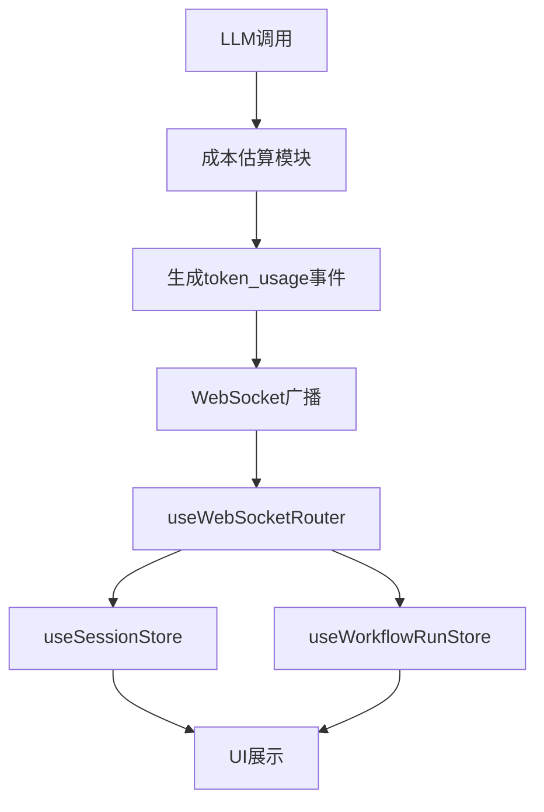

# 资源消耗统计

<cite>
**本文档引用文件**   
- [CostEstimator.tsx](file://frontend/src/components/modules/CostEstimator.tsx)
- [useWebSocketRouter.ts](file://frontend/src/hooks/useWebSocketRouter.ts)
- [useSessionStore.ts](file://frontend/src/stores/useSessionStore.ts)
- [useWorkflowRunStore.ts](file://frontend/src/stores/useWorkflowRunStore.ts)
- [websocket.ts](file://frontend/src/types/websocket.ts)
- [cost.go](file://internal/core/workflow/cost.go)
- [workflow_mgmt.go](file://internal/api/handler/workflow_mgmt.go)
- [cost_estimation.md](file://docs/api/cost_estimation.md)
- [SPEC-407-cost-estimation-api.md](file://docs/specs/backend/SPEC-407-cost-estimation-api.md)
- [SPEC-005-websocket-optimization.md](file://docs/specs/sprint1/SPEC-005-websocket-optimization.md)
</cite>

## 目录
1. [概述](#概述)
2. [事件触发机制](#事件触发机制)
3. [成本估算API](#成本估算api)
4. [前端组件分析](#前端组件分析)
5. [数据流与状态管理](#数据流与状态管理)
6. [WebSocket消息路由](#websocket消息路由)
7. [架构图](#架构图)
8. [总结](#总结)

## 概述

资源消耗统计事件（`token_usage`）是系统中用于实时追踪和展示LLM调用成本的核心机制。该事件在每次LLM调用完成后由后端成本估算模块触发，推送各节点的输入输出Token数量及预估费用。前端通过`CostEstimator`组件订阅并聚合这些数据，实时展示工作流的总成本。整个流程涉及后端成本计算、WebSocket实时通信、前端状态管理与UI更新等多个环节。

**Section sources**
- [cost_estimation.md](file://docs/api/cost_estimation.md#概述)
- [SPEC-407-cost-estimation-api.md](file://docs/specs/backend/SPEC-407-cost-estimation-api.md#1-端点)

## 事件触发机制

`token_usage`事件在每次LLM调用完成后由后端工作流引擎触发。当一个Agent节点完成其处理逻辑后，系统会根据实际使用的输入和输出Token数量，结合LLM提供商的定价模型，计算出本次调用的预估成本，并通过WebSocket向客户端广播`token_usage`事件。

事件数据结构定义在`frontend/src/types/websocket.ts`中：
```typescript
export interface TokenUsageData {
    node_id: string;
    agent_id: string;
    input_tokens: number;
    output_tokens: number;
    estimated_cost_usd: number;
}
```

该事件是系统资源监控和成本控制的基础，不仅用于前端展示，还被电路断路器（Circuit Breaker）等安全机制用于检测异常的Token消耗。

**Section sources**
- [websocket.ts](file://frontend/src/types/websocket.ts#L32-L38)
- [SPEC-005-websocket-optimization.md](file://docs/specs/sprint1/SPEC-005-websocket-optimization.md#31-websocket-消息类型)

## 成本估算API

后端通过`/api/v1/workflows/:id/estimate`端点提供成本预估功能。该API在用户启动会议前，根据工作流的节点配置和所选LLM模型，预估整个工作流的Token消耗和费用。

### API端点
```http
POST /api/v1/workflows/:id/estimate
```

### 数据模型
```typescript
interface CostEstimate {
  workflow_id: string;
  estimated_tokens: {
    input: number;
    output: number;
    total: number;
  };
  estimated_cost: {
    amount: number;
    currency: 'USD';
  };
  breakdown: CostBreakdownItem[];
  warnings: CostWarning[];
}
```

### 定价模型
后端维护一个定价表，包含主流LLM提供商的定价信息：
- OpenAI: gpt-4-turbo, gpt-4o-mini
- Anthropic: claude-3.5-sonnet
- Google: gemini-1.5-pro
- DeepSeek: deepseek-chat

这些定价信息通过`GET /api/v1/models/pricing`端点提供给前端，确保成本计算的准确性。

**Section sources**
- [cost_estimation.md](file://docs/api/cost_estimation.md#api-端点)
- [SPEC-407-cost-estimation-api.md](file://docs/specs/backend/SPEC-407-cost-estimation-api.md#4-定价表)

## 前端组件分析

`CostEstimator`组件负责在前端展示成本预估信息。该组件位于`frontend/src/components/modules/CostEstimator.tsx`，是一个简单的函数式组件，用于显示预估成本和耗时。

```tsx
export const CostEstimator: FC = () => {
    const estimatedCost = 0.05; // $
    const timeToComplete = 45; // seconds

    return (
        <div className="flex items-center gap-4 text-xs text-gray-500 mb-2 px-2">
            <div className="flex items-center gap-1">
                <span className="font-semibold">Est. Cost:</span>
                <span>${estimatedCost.toFixed(4)}</span>
            </div>
            <div className="flex items-center gap-1">
                <span className="font-semibold">Time:</span>
                <span>~{timeToComplete}s</span>
            </div>
        </div>
    );
};
```

在实际应用中，该组件会通过API获取动态的成本预估数据，并实时更新UI。

**Section sources**
- [CostEstimator.tsx](file://frontend/src/components/modules/CostEstimator.tsx#L1-L20)

## 数据流与状态管理

系统的数据流和状态管理是通过Zustand库实现的。主要涉及两个状态存储：`useSessionStore`和`useWorkflowRunStore`。

### SessionStore
`useSessionStore`负责管理会话级别的状态，包括消息组、节点状态和Token使用情况。当收到`token_usage`事件时，它会更新相应节点和消息的Token使用量。

```typescript
updateTokenUsage: (nodeId, agentId, usage) => {
    set(state => {
        // 更新会话总成本
        if (state.currentSession) {
            state.currentSession.totalTokens += usage.inputTokens + usage.outputTokens;
            state.currentSession.totalCostUsd += usage.estimatedCostUsd;

            // 更新节点成本
            const node = state.currentSession.nodes.get(nodeId);
            if (node) {
                if (!node.tokenUsage) {
                    node.tokenUsage = { inputTokens: 0, outputTokens: 0 };
                }
                node.tokenUsage.inputTokens += usage.inputTokens;
                node.tokenUsage.outputTokens += usage.outputTokens;
            }
        }
    });
}
```

### WorkflowRunStore
`useWorkflowRunStore`负责管理工作流运行时的状态，包括节点状态、执行状态和统计信息。它也会更新节点的Token使用情况。

```typescript
updateNodeTokenUsage: (nodeId, usage) => {
    set((state) => {
        const node = state.nodes.find(n => n.id === nodeId);
        if (node) {
            node.data.tokenUsage = usage;
        }
        state.stats.totalTokens += usage.input + usage.output;
        state.stats.totalCostUsd += usage.cost;
    });
}
```

**Section sources**
- [useSessionStore.ts](file://frontend/src/stores/useSessionStore.ts#L236-L266)
- [useWorkflowRunStore.ts](file://frontend/src/stores/useWorkflowRunStore.ts#L180-L189)

## WebSocket消息路由

`useWebSocketRouter`是系统消息路由的核心组件，负责将WebSocket消息分发到相应的状态管理器。它订阅`useConnectStore`中的`_lastMessage`，并根据消息类型进行路由。

```typescript
export const useWebSocketRouter = () => {
    const sessionStore = useSessionStore();
    const workflowStore = useWorkflowRunStore();

    const routeMessage = useCallback((msg: WSMessage) => {
        switch (msg.event) {
            case 'token_usage': {
                const data = msg.data as TokenUsageData;
                sessionStore.updateTokenUsage(data.node_id, data.agent_id, {
                    inputTokens: data.input_tokens,
                    outputTokens: data.output_tokens,
                    estimatedCostUsd: data.estimated_cost_usd,
                });
                workflowStore.updateNodeTokenUsage(data.node_id, {
                    input: data.input_tokens,
                    output: data.output_tokens,
                    cost: data.estimated_cost_usd,
                });
                break;
            }
            // 其他事件处理...
        }
    }, [sessionStore, workflowStore]);

    useEffect(() => {
        const unsubscribe = useConnectStore.subscribe(
            (state) => state._lastMessage,
            (message) => {
                if (!message) return;
                routeMessage(message);
            }
        );

        return unsubscribe;
    }, [routeMessage]);
};
```

这种设计实现了连接管理与业务逻辑的分离，提高了代码的可维护性和可测试性。

**Section sources**
- [useWebSocketRouter.ts](file://frontend/src/hooks/useWebSocketRouter.ts#L13-L126)
- [SPEC-005-websocket-optimization.md](file://docs/specs/sprint1/SPEC-005-websocket-optimization.md#2-架构设计)

## 架构图



**Diagram sources **
- [useWebSocketRouter.ts](file://frontend/src/hooks/useWebSocketRouter.ts#L13-L126)
- [useSessionStore.ts](file://frontend/src/stores/useSessionStore.ts#L236-L266)
- [useWorkflowRunStore.ts](file://frontend/src/stores/useWorkflowRunStore.ts#L180-L189)

## 总结

`token_usage`事件是系统资源消耗统计的核心，它连接了后端成本计算、WebSocket实时通信和前端状态管理。通过这一机制，系统能够实时、准确地追踪和展示LLM调用的成本，为用户提供透明的资源使用信息。整个流程体现了前后端分离、状态驱动和事件驱动的设计理念，确保了系统的可扩展性和可维护性。

**Section sources**
- [cost_estimation.md](file://docs/api/cost_estimation.md)
- [SPEC-407-cost-estimation-api.md](file://docs/specs/backend/SPEC-407-cost-estimation-api.md)
- [SPEC-005-websocket-optimization.md](file://docs/specs/sprint1/SPEC-005-websocket-optimization.md)