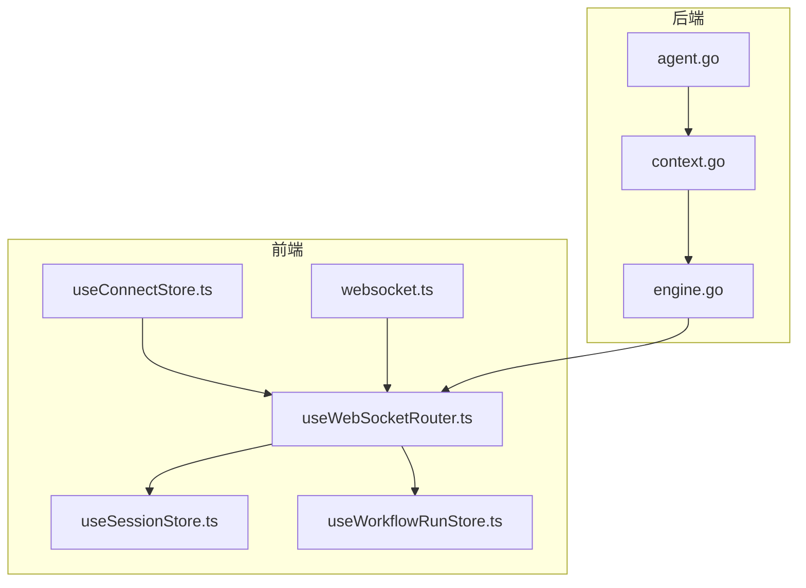
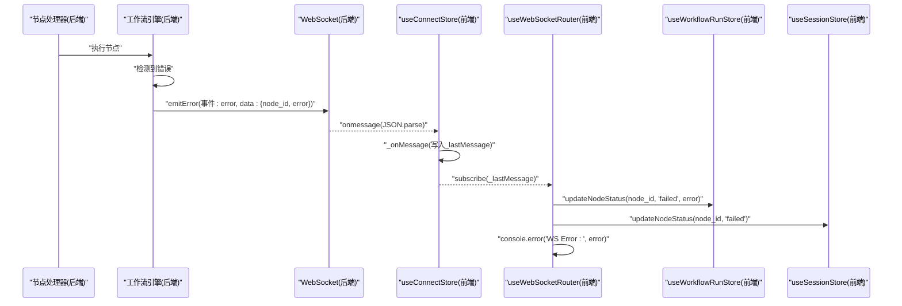
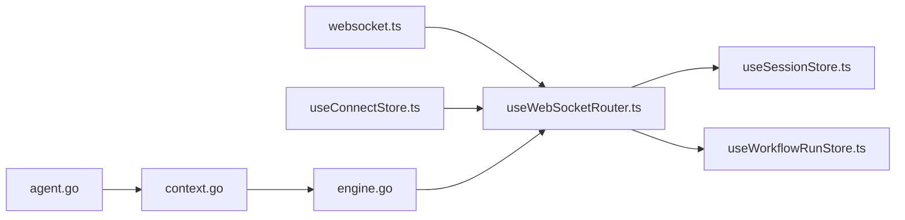

# 错误处理

<cite>
**本文引用的文件**
- [useWebSocketRouter.ts](file://frontend/src/hooks/useWebSocketRouter.ts)
- [useConnectStore.ts](file://frontend/src/stores/useConnectStore.ts)
- [useWorkflowRunStore.ts](file://frontend/src/stores/useWorkflowRunStore.ts)
- [useSessionStore.ts](file://frontend/src/stores/useSessionStore.ts)
- [websocket.ts](file://frontend/src/types/websocket.ts)
- [context.go](file://internal/core/workflow/context.go)
- [engine.go](file://internal/core/workflow/engine.go)
- [agent.go](file://internal/core/workflow/nodes/agent.go)
- [2025-12-21-websocket-debugging-report.md](file://docs/reports/debugging/2025-12-21-websocket-debugging-report.md)
</cite>

## 目录
1. [简介](#简介)
2. [项目结构](#项目结构)
3. [核心组件](#核心组件)
4. [架构总览](#架构总览)
5. [详细组件分析](#详细组件分析)
6. [依赖关系分析](#依赖关系分析)
7. [性能考量](#性能考量)
8. [故障排查指南](#故障排查指南)
9. [结论](#结论)

## 简介
本文件聚焦于WebSocket错误处理机制，系统性梳理“error”事件的触发场景、事件数据结构、前端路由与状态更新流程，并结合调试报告中的案例，给出常见错误码的诊断与恢复策略，强调错误日志记录对问题可追溯性的重要意义。

## 项目结构
围绕错误处理的关键文件分布如下：
- 前端
  - WebSocket消息路由与错误处理：useWebSocketRouter.ts
  - 连接与重连：useConnectStore.ts
  - 会话与节点状态：useSessionStore.ts、useWorkflowRunStore.ts
  - 类型契约：websocket.ts
- 后端
  - 事件结构与错误广播：context.go、engine.go
  - 节点执行与错误传播：agent.go

图表来源
- [useWebSocketRouter.ts](file://frontend/src/hooks/useWebSocketRouter.ts#L1-L126)
- [useConnectStore.ts](file://frontend/src/stores/useConnectStore.ts#L1-L127)
- [useSessionStore.ts](file://frontend/src/stores/useSessionStore.ts#L1-L332)
- [useWorkflowRunStore.ts](file://frontend/src/stores/useWorkflowRunStore.ts#L1-L301)
- [websocket.ts](file://frontend/src/types/websocket.ts#L1-L52)
- [context.go](file://internal/core/workflow/context.go#L1-L36)
- [engine.go](file://internal/core/workflow/engine.go#L170-L246)
- [agent.go](file://internal/core/workflow/nodes/agent.go#L1-L130)

章节来源
- [useWebSocketRouter.ts](file://frontend/src/hooks/useWebSocketRouter.ts#L1-L126)
- [useConnectStore.ts](file://frontend/src/stores/useConnectStore.ts#L1-L127)
- [useSessionStore.ts](file://frontend/src/stores/useSessionStore.ts#L1-L332)
- [useWorkflowRunStore.ts](file://frontend/src/stores/useWorkflowRunStore.ts#L1-L301)
- [websocket.ts](file://frontend/src/types/websocket.ts#L1-L52)
- [context.go](file://internal/core/workflow/context.go#L1-L36)
- [engine.go](file://internal/core/workflow/engine.go#L170-L246)
- [agent.go](file://internal/core/workflow/nodes/agent.go#L1-L130)

## 核心组件
- WebSocket消息路由与错误处理
  - 负责订阅useConnectStore中的_lastMessage，按事件类型分发至会话与工作流状态管理。
  - 对“error”事件进行节点级失败标记与错误日志输出。
- 连接与重连
  - 管理WebSocket生命周期、心跳、错误与指数回退重连。
- 会话与节点状态
  - 维护会话级节点映射、消息分组与节点状态，支持失败态渲染与UI提示。
- 工作流运行状态
  - 维护节点状态、活跃节点集合、统计指标，支持失败态统计。
- 事件类型契约
  - 定义WSMessage与各事件数据结构，保证前后端字段一致。
- 后端事件结构与错误广播
  - 定义StreamEvent结构，统一事件字段；在引擎中emitError广播错误事件并更新节点状态。

章节来源
- [useWebSocketRouter.ts](file://frontend/src/hooks/useWebSocketRouter.ts#L1-L126)
- [useConnectStore.ts](file://frontend/src/stores/useConnectStore.ts#L1-L127)
- [useSessionStore.ts](file://frontend/src/stores/useSessionStore.ts#L1-L332)
- [useWorkflowRunStore.ts](file://frontend/src/stores/useWorkflowRunStore.ts#L1-L301)
- [websocket.ts](file://frontend/src/types/websocket.ts#L1-L52)
- [context.go](file://internal/core/workflow/context.go#L1-L36)
- [engine.go](file://internal/core/workflow/engine.go#L170-L246)

## 架构总览
WebSocket错误处理的端到端流程如下：
- 后端节点执行过程中发生异常，引擎通过emitError广播“error”事件，携带node_id与error信息。
- 前端useConnectStore接收消息并写入_lastMessage。
- useWebSocketRouter订阅_lastMessage，命中“error”事件分支，调用workflowStore.updateNodeStatus与sessionStore.updateNodeStatus，将对应节点标记为failed，并在控制台输出错误日志。
- UI基于store状态渲染节点失败态与错误提示。

图表来源
- [engine.go](file://internal/core/workflow/engine.go#L170-L182)
- [context.go](file://internal/core/workflow/context.go#L1-L36)
- [useConnectStore.ts](file://frontend/src/stores/useConnectStore.ts#L67-L74)
- [useWebSocketRouter.ts](file://frontend/src/hooks/useWebSocketRouter.ts#L97-L109)
- [useWorkflowRunStore.ts](file://frontend/src/stores/useWorkflowRunStore.ts#L149-L160)
- [useSessionStore.ts](file://frontend/src/stores/useSessionStore.ts#L145-L162)

## 详细组件分析

### 前端：useWebSocketRouter 错误处理
- 事件路由
  - 对“error”事件进行专门处理：读取data.node_id与data.error，若存在node_id则调用workflowStore.updateNodeStatus(nodeId, 'failed', error)，同时调用sessionStore.updateNodeStatus(nodeId, 'failed')，并在控制台打印错误。
- 与会话/工作流状态联动
  - 节点失败时，UI可据此展示失败态与错误提示；工作流统计中的failedNodes计数也会随之增加。
- 与连接状态的关系
  - 若连接异常关闭，useConnectStore会触发重连流程；前端错误处理仅针对业务事件，不替代连接层的重连策略。

章节来源
- [useWebSocketRouter.ts](file://frontend/src/hooks/useWebSocketRouter.ts#L97-L109)
- [useWorkflowRunStore.ts](file://frontend/src/stores/useWorkflowRunStore.ts#L149-L160)
- [useSessionStore.ts](file://frontend/src/stores/useSessionStore.ts#L145-L162)

### 前端：useConnectStore 连接与重连
- 生命周期
  - onopen/onclose/onerror/onmessage分别设置连接状态、错误信息与消息分发。
- 心跳与重连
  - 启动心跳定时器；非干净关闭时进入_scheduleReconnect，按指数延迟重连，最多尝试MAX_RECONNECT_ATTEMPTS次。
- 与路由的集成
  - 将解析后的WSMessage写入_lastMessage，供useWebSocketRouter订阅处理。

章节来源
- [useConnectStore.ts](file://frontend/src/stores/useConnectStore.ts#L41-L127)

### 前端：useWorkflowRunStore 节点状态更新
- updateNodeStatus
  - 更新节点状态与可选错误信息；失败态时统计failedNodes+1。
- 与UI的耦合
  - 通过store状态驱动UI渲染，失败态节点可显示错误提示与失败图标。

章节来源
- [useWorkflowRunStore.ts](file://frontend/src/stores/useWorkflowRunStore.ts#L149-L160)

### 前端：useSessionStore 会话与节点状态
- updateNodeStatus
  - 更新currentSession.nodes中的节点状态，并同步消息分组状态，便于UI展示。
- 初始化与连接状态
  - initSession时初始化节点快照（含name/type），appendMessage时从快照读取节点元信息用于显示。

章节来源
- [useSessionStore.ts](file://frontend/src/stores/useSessionStore.ts#L104-L162)

### 前端：类型契约 websocket.ts
- WSMessage
  - event字段用于路由；data承载具体事件负载；node_id可选，用于标识节点。
- 事件枚举与数据结构
  - 包含token_stream、node_state_change、error等事件类型及对应的数据结构，确保前后端字段一致。

章节来源
- [websocket.ts](file://frontend/src/types/websocket.ts#L1-L52)

### 后端：context.go 与 engine.go
- StreamEvent
  - Type字段为事件名；Timestamp为服务端时间；NodeID可选；Data为事件负载。
- emitError
  - 记录错误日志，向客户端广播“error”事件，包含node_id与error字符串；同时更新节点状态为failed。

章节来源
- [context.go](file://internal/core/workflow/context.go#L1-L36)
- [engine.go](file://internal/core/workflow/engine.go#L170-L182)

### 后端：agent.go 节点执行与错误传播
- 节点开始/结束状态
  - Process在开始时发送“node_state_change”事件，状态为running；完成后发送“node_state_change”，状态为completed。
- 错误传播
  - 在LLM调用或内部处理出现错误时，返回错误给引擎，由引擎调用emitError广播“error”事件。

章节来源
- [agent.go](file://internal/core/workflow/nodes/agent.go#L23-L30)
- [agent.go](file://internal/core/workflow/nodes/agent.go#L98-L108)
- [agent.go](file://internal/core/workflow/nodes/agent.go#L117-L122)

## 依赖关系分析
- 前端
  - useConnectStore负责WebSocket生命周期与消息分发，是useWebSocketRouter的上游数据源。
  - useWebSocketRouter依赖websocket.ts的事件类型定义，按事件名路由到useSessionStore与useWorkflowRunStore。
- 后端
  - agent.go在执行节点时产生状态与流式事件；engine.go在异常时通过emitError广播“error”事件。
  - context.go定义StreamEvent结构，统一前后端事件字段。

图表来源
- [websocket.ts](file://frontend/src/types/websocket.ts#L1-L52)
- [useWebSocketRouter.ts](file://frontend/src/hooks/useWebSocketRouter.ts#L1-L126)
- [useConnectStore.ts](file://frontend/src/stores/useConnectStore.ts#L1-L127)
- [useSessionStore.ts](file://frontend/src/stores/useSessionStore.ts#L1-L332)
- [useWorkflowRunStore.ts](file://frontend/src/stores/useWorkflowRunStore.ts#L1-L301)
- [agent.go](file://internal/core/workflow/nodes/agent.go#L1-L130)
- [context.go](file://internal/core/workflow/context.go#L1-L36)
- [engine.go](file://internal/core/workflow/engine.go#L170-L246)

## 性能考量
- 前端
  - useWebSocketRouter对消息进行去重处理，避免重复渲染与状态更新。
  - 心跳与重连采用指数退避，降低服务器压力与抖动。
- 后端
  - 错误事件通过通道广播，避免阻塞节点执行；日志记录采用标准库，开销可控。

章节来源
- [useWebSocketRouter.ts](file://frontend/src/hooks/useWebSocketRouter.ts#L1-L126)
- [useConnectStore.ts](file://frontend/src/stores/useConnectStore.ts#L1-L127)
- [engine.go](file://internal/core/workflow/engine.go#L170-L182)

## 故障排查指南

### “error”事件数据结构与填充逻辑
- 事件字段
  - event: "error"
  - data: { node_id: string; error: string }
  - node_id: 节点逻辑ID（例如agent节点的NodeID）
  - error: 错误文本（由引擎emitError时传入）
- 前端填充与使用
  - useWebSocketRouter在收到“error”事件后，若data.node_id存在，则调用workflowStore.updateNodeStatus(nodeId, 'failed', error)与sessionStore.updateNodeStatus(nodeId, 'failed')，并将error写入节点的错误字段，随后在控制台打印错误。

章节来源
- [websocket.ts](file://frontend/src/types/websocket.ts#L1-L52)
- [useWebSocketRouter.ts](file://frontend/src/hooks/useWebSocketRouter.ts#L97-L109)
- [useWorkflowRunStore.ts](file://frontend/src/stores/useWorkflowRunStore.ts#L149-L160)
- [useSessionStore.ts](file://frontend/src/stores/useSessionStore.ts#L145-L162)
- [engine.go](file://internal/core/workflow/engine.go#L170-L182)

### 触发场景与定位
- LLM调用失败
  - agent.go在调用LLM时，若errChan返回错误，将错误向上抛出；引擎捕获后通过emitError广播“error”事件。
- 节点执行异常
  - 任意节点处理器在Process中发生错误（如外部依赖不可用、参数缺失等），均会触发emitError。
- 调试报告中的关键案例
  - 消息字段不一致导致“error”事件未被识别：后端JSON tag从"type"改为"event"，前端期望"event"，修复后事件可被正确路由。
  - 节点ID语义混淆：后端事件中曾使用Agent UUID而非Graph Node ID，导致UI显示异常；修复后使用正确的NodeID。
  - 会话状态未自动切换：前端在收到首个节点running时才更新会话状态，避免UI停留在IDLE。

章节来源
- [agent.go](file://internal/core/workflow/nodes/agent.go#L98-L108)
- [engine.go](file://internal/core/workflow/engine.go#L170-L182)
- [2025-12-21-websocket-debugging-report.md](file://docs/reports/debugging/2025-12-21-websocket-debugging-report.md#L1-L272)

### 常见错误码与诊断
- 网络中断与重连
  - 现象：连接异常关闭，UI显示重连中。
  - 处理：useConnectStore在非干净关闭时触发_scheduleReconnect，按指数延迟重连，最多尝试MAX_RECONNECT_ATTEMPTS次；前端错误处理仅负责业务事件，不替代连接层重连。
- LLM模型不可用
  - 现象：调用报错或返回空结果。
  - 处理：检查agent节点的模型配置是否为空，必要时回退到注册表默认模型；确保Provider可用。
- 节点ID不一致
  - 现象：UI显示节点名异常或找不到对应节点。
  - 处理：确认后端事件中的node_id为Graph Node ID，而非Agent UUID；前端store中节点快照包含name/type，确保初始化时完整保存。

章节来源
- [useConnectStore.ts](file://frontend/src/stores/useConnectStore.ts#L101-L114)
- [agent.go](file://internal/core/workflow/nodes/agent.go#L76-L78)
- [2025-12-21-websocket-debugging-report.md](file://docs/reports/debugging/2025-12-21-websocket-debugging-report.md#L1-L272)

### 自动重连与状态同步
- 自动重连
  - useConnectStore在onclose非干净关闭时启动重连流程，指数退避，最多尝试MAX_RECONNECT_ATTEMPTS次；达到上限后记录lastError。
- 状态同步
  - 前端在收到首个节点running时自动更新会话状态为running，避免UI停留在IDLE；节点完成或失败时移除活跃节点并结束消息流。
- 日志与可观测性
  - 后端emitError会记录错误日志；前端在useWebSocketRouter中打印WS Error，便于快速定位。

章节来源
- [useConnectStore.ts](file://frontend/src/stores/useConnectStore.ts#L41-L114)
- [useWebSocketRouter.ts](file://frontend/src/hooks/useWebSocketRouter.ts#L37-L46)
- [engine.go](file://internal/core/workflow/engine.go#L170-L182)

## 结论
- “error”事件是前端错误处理的核心入口，承载节点级失败信息与节点ID，前端据此将节点标记为failed并渲染错误提示。
- 后端通过StreamEvent统一事件格式，引擎在异常时emitError并更新节点状态，确保前后端契约一致。
- 调试报告揭示了字段命名不一致、ID语义混淆、状态机边界不清等问题，修复后显著提升了错误可见性与UI一致性。
- 建议持续完善类型同步与端到端消息格式校验，强化错误日志与监控，保障问题可追溯与快速恢复。