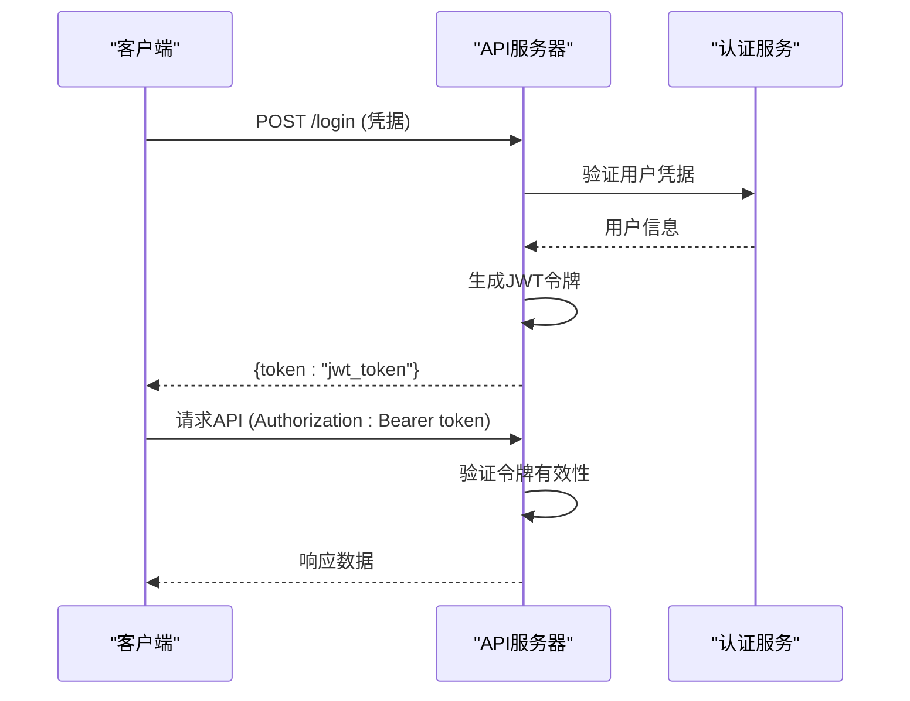
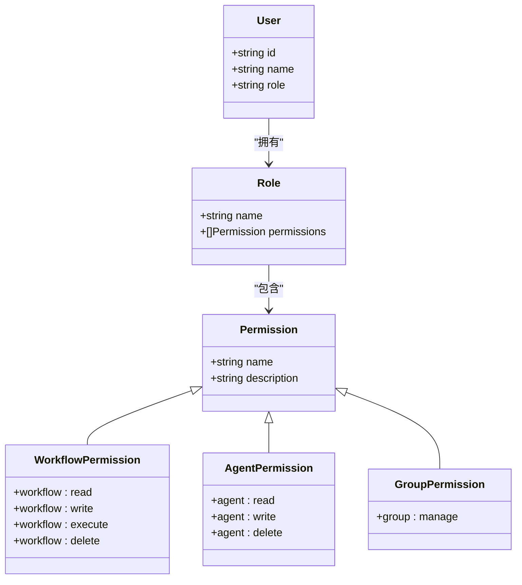
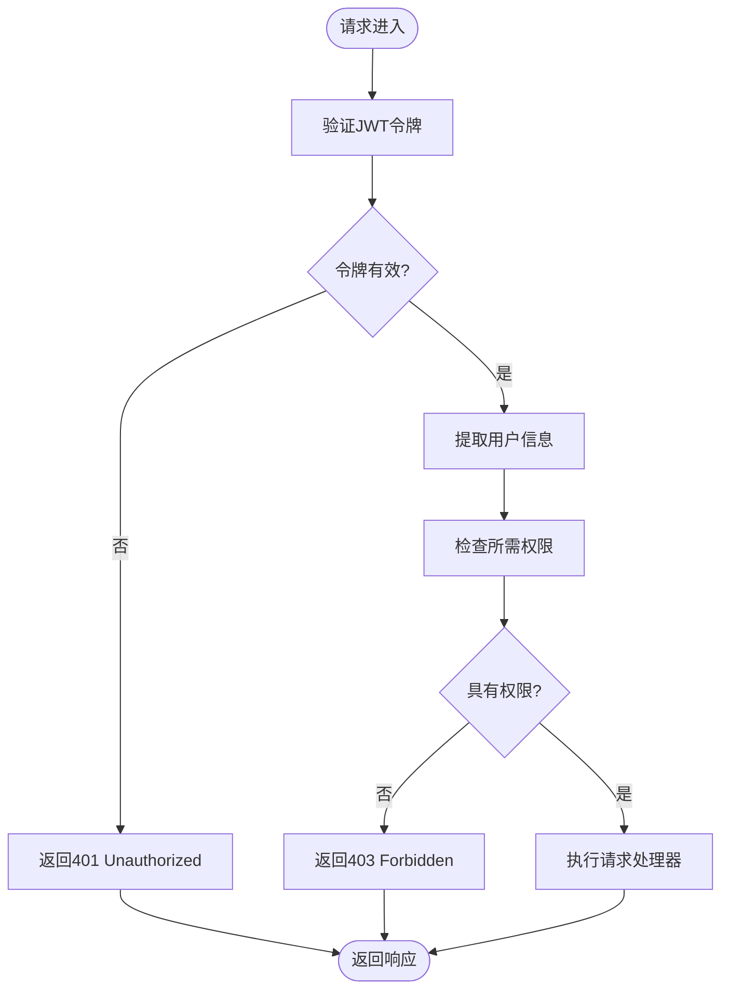

# 认证与安全

<cite>
**本文档引用的文件**
- [main.go](file://cmd/council/main.go)
- [auth.go](file://internal/api/middleware/auth.go)
- [permissions.go](file://internal/core/auth/permissions.go)
- [SPEC-504-security-hardening.md](file://docs/specs/sprint5/SPEC-504-security-hardening.md)
- [useAuthStore.ts](file://frontend/src/stores/useAuthStore.ts)
</cite>

## 目录
1. [简介](#简介)
2. [认证机制](#认证机制)
3. [权限控制模型](#权限控制模型)
4. [Gin中间件实现](#gin中间件实现)
5. [安全最佳实践](#安全最佳实践)

## 简介
本系统通过基于角色的访问控制（RBAC）和API速率限制来保护API端点，确保生产环境的安全性。系统实现了细粒度的权限管理，对不同用户角色设置了不同的访问级别，并通过中间件进行统一的认证和授权检查。

**Section sources**
- [SPEC-504-security-hardening.md](file://docs/specs/sprint5/SPEC-504-security-hardening.md#L1-L10)

## 认证机制
系统采用JWT（JSON Web Token）进行用户认证。用户登录后获取令牌，并在后续请求中通过Authorization头传递：`Authorization: Bearer <token>`。当前系统支持通过外部身份提供者进行身份验证，前端通过useAuthStore管理用户状态。



**Diagram sources**
- [SPEC-504-security-hardening.md](file://docs/specs/sprint5/SPEC-504-security-hardening.md#L63-L85)
- [useAuthStore.ts](file://frontend/src/stores/useAuthStore.ts#L1-L16)

## 权限控制模型
系统实现了基于角色的访问控制（RBAC）模型，定义了四种主要角色及其权限：

| 角色 | 权限 |
| :--- | :--- |
| `viewer` | 只读访问工作流、查看执行结果 |
| `editor` | 创建/编辑工作流、执行工作流 |
| `admin` | 管理用户、管理Agent、系统配置 |
| `owner` | 完全控制，包括删除和转让 |

权限资源包括工作流操作（读取、写入、执行、删除）、Agent管理（读取、写入、删除）和组管理等。



**Diagram sources**
- [SPEC-504-security-hardening.md](file://docs/specs/sprint5/SPEC-504-security-hardening.md#L33-L57)
- [permissions.go](file://internal/core/auth/permissions.go)

**Section sources**
- [SPEC-504-security-hardening.md](file://docs/specs/sprint5/SPEC-504-security-hardening.md#L20-L58)

## Gin中间件实现
认证和授权通过Gin中间件实现。系统提供了`RequirePermission`中间件，用于检查用户是否具有执行特定操作的权限。当用户未认证时返回401 Unauthorized，当用户无权访问时返回403 Forbidden。



中间件的使用示例如下：
```go
router.DELETE("/workflows/:id", 
    RequirePermission(WorkflowDelete), 
    handler.DeleteWorkflow,
)
```

**Diagram sources**
- [auth.go](file://internal/api/middleware/auth.go#L63-L85)
- [main.go](file://cmd/council/main.go#L102-L143)

**Section sources**
- [auth.go](file://internal/api/middleware/auth.go#L63-L85)
- [SPEC-504-security-hardening.md](file://docs/specs/sprint5/SPEC-504-security-hardening.md#L63-L85)

## 安全最佳实践
系统实施了多项安全最佳实践来保护API端点：

### API速率限制
系统实现了基于Redis的速率限制，使用滑动窗口算法防止API滥用。不同类型的API请求有不同的速率限制配置：

```go
var DefaultLimits = map[string]RateLimitConfig{
    "api:general":    {RequestsPerMinute: 60, BurstSize: 10},
    "api:execute":    {RequestsPerMinute: 10, BurstSize: 2},
    "api:generate":   {RequestsPerMinute: 5, BurstSize: 1},
    "ws:connect":     {RequestsPerMinute: 30, BurstSize: 5},
}
```

### 敏感数据处理
系统对敏感数据进行脱敏处理：
- API密钥存储时使用AES-256-GCM加密
- 日志记录时自动过滤敏感字段（密码、API密钥、令牌等）
- 返回给前端的API密钥进行掩码处理（显示前4位和后4位，中间用*代替）

### 安全审计日志
系统记录详细的安全审计日志，包括：
- 时间戳
- 用户ID
- 操作类型
- 资源标识
- 操作结果（成功、失败、拒绝）
- IP地址和用户代理

### 其他安全措施
- 强制使用HTTPS传输
- 防止重放攻击的令牌时效性管理
- 安全的会话管理
- 输入验证和输出编码

**Section sources**
- [SPEC-504-security-hardening.md](file://docs/specs/sprint5/SPEC-504-security-hardening.md#L90-L222)