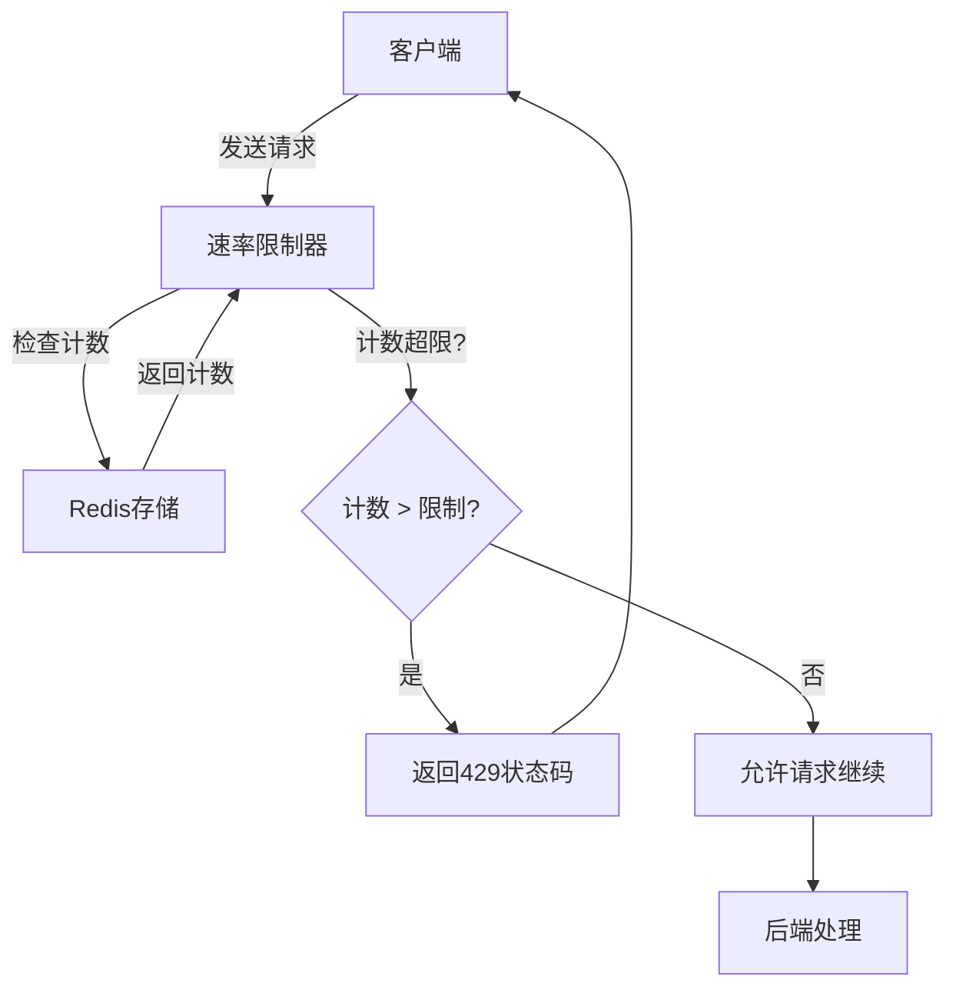
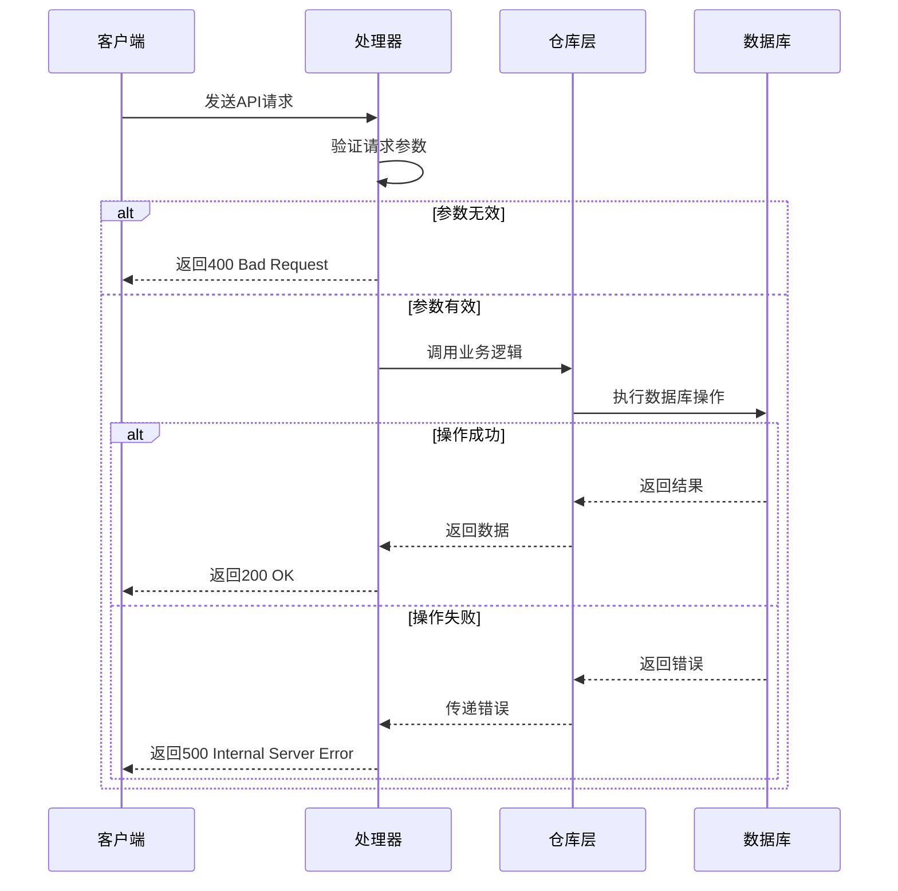
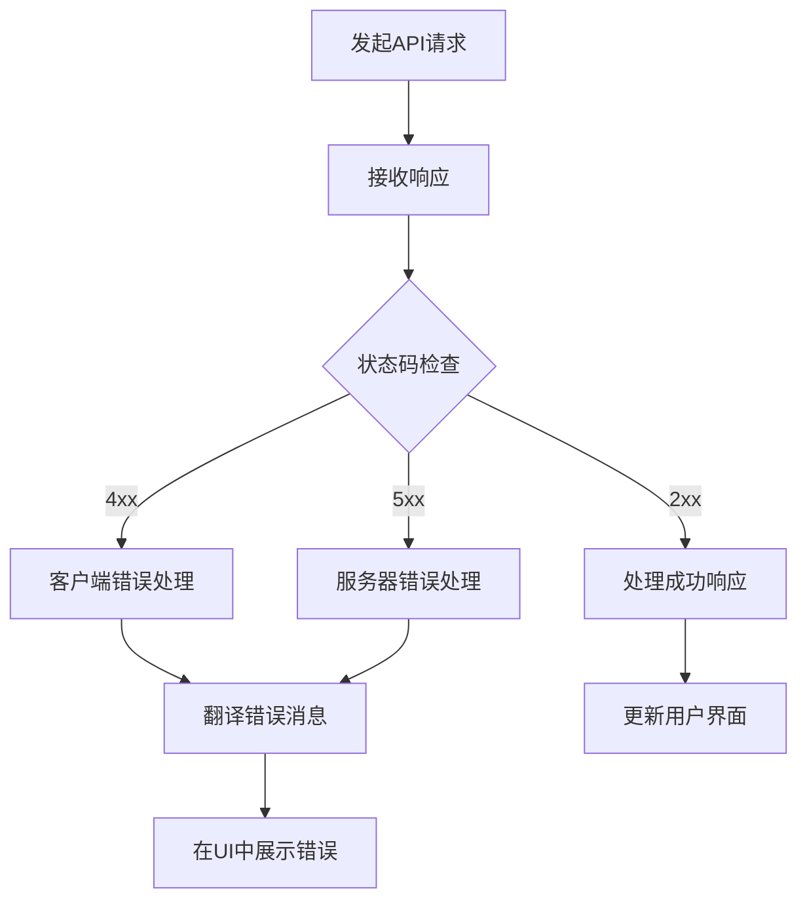
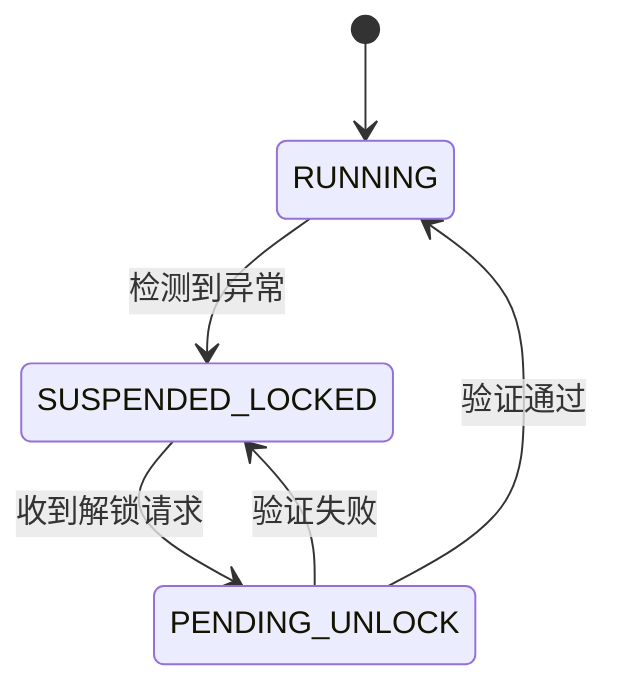

# 错误处理与状态码

<cite>
**本文档引用的文件**   
- [agent.go](file://internal/api/handler/agent.go)
- [group.go](file://internal/api/handler/group.go)
- [template.go](file://internal/api/handler/template.go)
- [memory.go](file://internal/api/handler/memory.go)
- [workflow.go](file://internal/api/handler/workflow.go)
- [workflow_mgmt.go](file://internal/api/handler/workflow_mgmt.go)
- [SPEC-504-security-hardening.md](file://docs/specs/sprint5/SPEC-504-security-hardening.md)
- [SPEC-409-circuit-breaker.md](file://docs/specs/backend/SPEC-409-circuit-breaker.md)
- [translation.json](file://frontend/src/i18n/locales/en/translation.json)
</cite>

## 目录
1. [简介](#简介)
2. [HTTP状态码与业务场景](#http状态码与业务场景)
3. [错误响应结构](#错误响应结构)
4. [后端错误处理模式](#后端错误处理模式)
5. [前端错误处理与展示](#前端错误处理与展示)
6. [特殊错误场景](#特殊错误场景)
7. [最佳实践](#最佳实践)

## 简介
本文档旨在为The Council系统建立统一的API错误处理规范。通过系统化地定义HTTP状态码在不同业务场景下的具体含义，确保前后端在错误处理上保持一致。文档详细说明了各种错误码的使用场景、JSON响应体格式，以及后端如何构造错误响应和前端如何解析展示这些错误。

## HTTP状态码与业务场景
根据代码库分析，系统使用了多种HTTP状态码来表示不同的错误情况。以下是主要状态码及其业务场景：

### 400 Bad Request
用于请求参数验证失败的场景，包括：
- JSON解析错误
- 必填字段缺失
- UUID格式无效
- 枚举值不匹配

**示例场景**：
- 创建Agent时JSON格式错误
- 更新资源时ID格式无效
- 控制请求中操作类型不匹配

**Section sources**
- [agent.go](file://internal/api/handler/agent.go#L21-L22)
- [group.go](file://internal/api/handler/group.go#L21-L22)
- [workflow.go](file://internal/api/handler/workflow.go#L60-L61)

### 404 Not Found
用于资源不存在的场景：
- 根据ID查询的资源不存在
- 访问不存在的API端点

**示例场景**：
- 查询不存在的Agent
- 获取不存在的工作流定义
- 操作不存在的会话

**Section sources**
- [agent.go](file://internal/api/handler/agent.go#L42-L43)
- [group.go](file://internal/api/handler/group.go#L42-L43)
- [workflow_mgmt.go](file://internal/api/handler/workflow_mgmt.go#L60-L61)

### 409 Conflict
用于资源状态冲突的场景：
- 尝试向已关闭的通道发送信号
- 操作处于不兼容状态的资源

**示例场景**：
- 向不存在的节点发送信号
- 在错误状态下恢复节点执行

**Section sources**
- [workflow.go](file://internal/api/handler/workflow.go#L195-L196)
- [workflow_control_test.go](file://internal/api/handler/workflow_control_test.go#L156-L157)

### 429 Too Many Requests
用于速率限制场景，当客户端请求频率超过限制时返回。

**示例场景**：
- API调用频率超过每分钟限制
- WebSocket连接频率过高



**Diagram sources**
- [SPEC-504-security-hardening.md](file://docs/specs/sprint5/SPEC-504-security-hardening.md#L126-L132)

### 500 Internal Server Error
用于服务器内部错误：
- 数据库操作失败
- 依赖服务调用失败
- 未预期的程序异常

**示例场景**：
- Agent创建时数据库错误
- 工作流生成时LLM调用失败
- 内存管理操作失败

**Section sources**
- [agent.go](file://internal/api/handler/agent.go#L26-L27)
- [workflow_mgmt.go](file://internal/api/handler/workflow_mgmt.go#L160-L161)
- [memory.go](file://internal/api/handler/memory.go#L37-L38)

### 502 Bad Gateway
用于网关错误，当前端服务作为网关时，后端依赖服务返回错误。

**示例场景**：
- LLM服务调用失败
- 外部API集成错误

**Section sources**
- [workflow_mgmt.go](file://internal/api/handler/workflow_mgmt.go#L160-L161)

## 错误响应结构
系统采用统一的JSON格式返回错误信息，包含code、message和可选的details字段。

### 基本错误响应格式
```json
{
  "error": "错误描述信息"
}
```

### 详细错误响应示例
```json
{
  "error": "Rate limit exceeded",
  "retry_after": 60
}
```

### 错误响应字段说明
| 字段 | 类型 | 描述 | 是否必需 |
|------|------|------|---------|
| error | string | 错误的简要描述 | 是 |
| retry_after | number | 重试等待时间（秒） | 否 |
| details | object | 错误的详细信息 | 否 |

**Section sources**
- [SPEC-504-security-hardening.md](file://docs/specs/sprint5/SPEC-504-security-hardening.md#L128-L131)

## 后端错误处理模式
后端使用Gin框架处理错误响应，通过c.JSON()方法返回标准化的错误响应。

### 参数验证错误处理
```go
if err := c.ShouldBindJSON(&a); err != nil {
    c.JSON(http.StatusBadRequest, gin.H{"error": err.Error()})
    return
}
```

### 资源不存在错误处理
```go
a, err := h.repo.GetByID(c.Request.Context(), id)
if err != nil {
    c.JSON(http.StatusNotFound, gin.H{"error": "agent not found"})
    return
}
```

### 服务器内部错误处理
```go
if err := h.repo.Create(c.Request.Context(), &a); err != nil {
    c.JSON(http.StatusInternalServerError, gin.H{"error": err.Error()})
    return
}
```



**Diagram sources**
- [agent.go](file://internal/api/handler/agent.go#L19-L30)
- [group.go](file://internal/api/handler/group.go#L19-L30)

**Section sources**
- [agent.go](file://internal/api/handler/agent.go#L19-L98)
- [group.go](file://internal/api/handler/group.go#L19-L98)

## 前端错误处理与展示
前端通过i18n系统处理错误消息的本地化展示，并根据不同的错误类型提供相应的用户界面反馈。

### 错误消息本地化
```json
{
  "errors": {
    "networkError": "网络错误，请检查您的连接",
    "serverError": "服务器错误，请稍后重试",
    "notFound": "资源未找到",
    "unauthorized": "请先登录",
    "forbidden": "您没有权限执行此操作"
  }
}
```

### 前端错误处理流程


**Diagram sources**
- [translation.json](file://frontend/src/i18n/locales/en/translation.json#L160-L165)

**Section sources**
- [translation.json](file://frontend/src/i18n/locales/en/translation.json#L160-L165)

## 特殊错误场景
### 电路断路器触发
当系统检测到异常情况时，会触发电路断路器并返回特定错误。

```go
cb.Trip("TOKEN_SURGE", "Token 消耗超过预估 3 倍")
```

**可能的触发原因**：
- Token消耗激增
- 检测到死循环
- 执行超时



**Diagram sources**
- [SPEC-409-circuit-breaker.md](file://docs/specs/backend/SPEC-409-circuit-breaker.md#L46-L50)

**Section sources**
- [SPEC-409-circuit-breaker.md](file://docs/specs/backend/SPEC-409-circuit-breaker.md#L64-L87)

### 人工审核要求
当工作流需要人工干预时，系统会暂停执行并等待用户输入。

```tsx
<div className="fixed inset-0 z-50 flex items-center justify-center bg-black/50 backdrop-blur-sm p-4">
    <div className="bg-white rounded-lg shadow-xl w-full max-w-lg overflow-hidden border border-gray-200">
        <div className="bg-purple-50 p-4 border-b border-purple-100 flex items-center justify-between">
            <div className="flex items-center gap-2 text-purple-800">
                <AlertCircle className="w-5 h-5" />
                <h3 className="font-semibold text-lg">Human Review Required</h3>
            </div>
        </div>
    </div>
</div>
```

**Section sources**
- [HumanReviewModal.tsx](file://frontend/src/features/execution/components/HumanReviewModal.tsx#L27-L48)

## 最佳实践
1. **使用标准HTTP状态码**：遵循RESTful原则，使用标准的状态码表示不同类型的错误。
2. **提供有意义的错误消息**：错误消息应该足够详细，帮助开发者理解问题所在。
3. **保持响应格式一致**：所有错误响应应该使用相同的JSON结构。
4. **避免暴露敏感信息**：错误消息中不应包含堆栈跟踪或数据库细节等敏感信息。
5. **实现适当的日志记录**：在返回错误响应的同时，应该在服务器端记录详细的错误日志。
6. **考虑用户体验**：前端应该适当地处理错误，向用户提供清晰的反馈。