# UI组件库

<cite>
**本文档引用的文件**
- [ChatPanel.tsx](file://frontend/src/components/chat/ChatPanel.tsx)
- [ChatPanel.types.ts](file://frontend/src/components/chat/ChatPanel.types.ts)
- [WorkflowCanvas.tsx](file://frontend/src/components/modules/WorkflowCanvas.tsx)
- [PropertyPanel.tsx](file://frontend/src/features/editor/components/PropertyPanel/PropertyPanel.tsx)
- [ExecutionControlBar.tsx](file://frontend/src/components/meeting/ExecutionControlBar.tsx)
- [MeetingRoom.tsx](file://frontend/src/features/meeting/MeetingRoom.tsx)
- [CostEstimator.tsx](file://frontend/src/features/execution/components/CostEstimator.tsx)
- [HumanReviewModal.tsx](file://frontend/src/features/execution/components/HumanReviewModal.tsx)
- [useWebSocketRouter.ts](file://frontend/src/hooks/useWebSocketRouter.ts)
- [useWorkflowRunStore.ts](file://frontend/src/stores/useWorkflowRunStore.ts)
- [useSessionStore.ts](file://frontend/src/stores/useSessionStore.ts)
- [useLayoutStore.ts](file://frontend/src/stores/useLayoutStore.ts)
- [App.tsx](file://frontend/src/App.tsx)
- [workflow.ts](file://frontend/src/types/workflow.ts)
</cite>

## 目录
1. [简介](#简介)
2. [项目结构](#项目结构)
3. [核心组件](#核心组件)
4. [架构概述](#架构概述)
5. [详细组件分析](#详细组件分析)
6. [依赖分析](#依赖分析)
7. [性能考虑](#性能考虑)
8. [故障排除指南](#故障排除指南)
9. [结论](#结论)

## 简介
本文档系统化地介绍了前端代码库中的可复用UI组件，重点描述了核心组件如ChatPanel、WorkflowCanvas、PropertyPanel和ExecutionControlBar的设计与用途。文档详细说明了这些组件的props、事件、插槽和状态管理（通过Zustand stores），并阐述了UI架构模式，包括基于React Router的页面路由、通过WebSocket Router处理实时消息以及使用React Query进行数据获取。此外，还提供了组件组合示例，如如何在会议房间（MeetingRoom）中集成聊天流、成本估算器和人类审查模态框。

## 项目结构
前端项目采用模块化架构，主要组件分布在`frontend/src/components`和`frontend/src/features`目录中。核心UI组件如ChatPanel、WorkflowCanvas、PropertyPanel和ExecutionControlBar分别位于各自的模块目录中。状态管理通过Zustand stores实现，存储在`frontend/src/stores`目录中。路由由React Router管理，WebSocket消息通过自定义hook `useWebSocketRouter`进行路由处理。

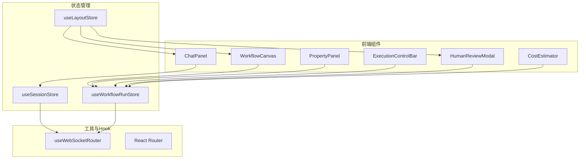

**图示来源**
- [ChatPanel.tsx](file://frontend/src/components/chat/ChatPanel.tsx)
- [WorkflowCanvas.tsx](file://frontend/src/components/modules/WorkflowCanvas.tsx)
- [PropertyPanel.tsx](file://frontend/src/features/editor/components/PropertyPanel/PropertyPanel.tsx)
- [ExecutionControlBar.tsx](file://frontend/src/components/meeting/ExecutionControlBar.tsx)
- [HumanReviewModal.tsx](file://frontend/src/features/execution/components/HumanReviewModal.tsx)
- [CostEstimator.tsx](file://frontend/src/features/execution/components/CostEstimator.tsx)
- [useSessionStore.ts](file://frontend/src/stores/useSessionStore.ts)
- [useWorkflowRunStore.ts](file://frontend/src/stores/useWorkflowRunStore.ts)
- [useLayoutStore.ts](file://frontend/src/stores/useLayoutStore.ts)
- [useWebSocketRouter.ts](file://frontend/src/hooks/useWebSocketRouter.ts)

**章节来源**
- [frontend/src/components](file://frontend/src/components)
- [frontend/src/features](file://frontend/src/features)
- [frontend/src/stores](file://frontend/src/stores)

## 核心组件
本文档的核心是四个主要UI组件：ChatPanel用于显示和管理聊天消息流，WorkflowCanvas提供工作流的可视化编辑界面，PropertyPanel允许用户配置工作流节点的属性，ExecutionControlBar则提供对工作流执行的控制功能。这些组件通过Zustand stores共享状态，并通过WebSocket实时更新。

**章节来源**
- [ChatPanel.tsx](file://frontend/src/components/chat/ChatPanel.tsx#L1-L77)
- [WorkflowCanvas.tsx](file://frontend/src/components/modules/WorkflowCanvas.tsx#L1-L16)
- [PropertyPanel.tsx](file://frontend/src/features/editor/components/PropertyPanel/PropertyPanel.tsx#L1-L86)
- [ExecutionControlBar.tsx](file://frontend/src/components/meeting/ExecutionControlBar.tsx#L1-L72)

## 架构概述
系统的UI架构基于React组件化设计，使用Zustand进行全局状态管理。页面路由由React Router处理，将不同的功能页面（如会议房间、工作流编辑器、组管理等）映射到URL路径。实时通信通过WebSocket实现，`useWebSocketRouter` hook负责将不同类型的消息路由到相应的状态更新函数。数据获取方面，虽然文档中未直接展示React Query的使用，但类似的模式可能用于从后端API获取数据。

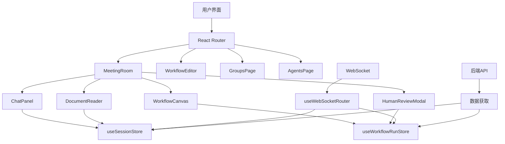

**图示来源**
- [App.tsx](file://frontend/src/App.tsx#L1-L85)
- [MeetingRoom.tsx](file://frontend/src/features/meeting/MeetingRoom.tsx#L1-L233)
- [useWebSocketRouter.ts](file://frontend/src/hooks/useWebSocketRouter.ts#L1-L126)
- [useSessionStore.ts](file://frontend/src/stores/useSessionStore.ts#L1-L332)
- [useWorkflowRunStore.ts](file://frontend/src/stores/useWorkflowRunStore.ts#L1-L301)

## 详细组件分析
本节将深入分析每个核心组件的实现细节、props、事件和状态管理机制。

### ChatPanel分析
ChatPanel组件负责显示会议中的聊天消息流。它从`useSessionStore`中获取消息组，并自动滚动到底部。组件支持全屏模式和只读模式，通过`sessionId`属性与后端通信。

#### 组件属性
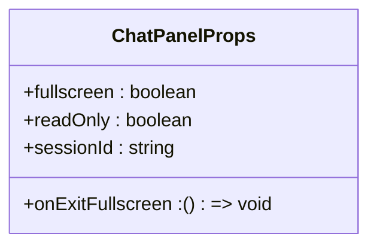

**图示来源**
- [ChatPanel.types.ts](file://frontend/src/components/chat/ChatPanel.types.ts#L1-L22)

#### 数据流
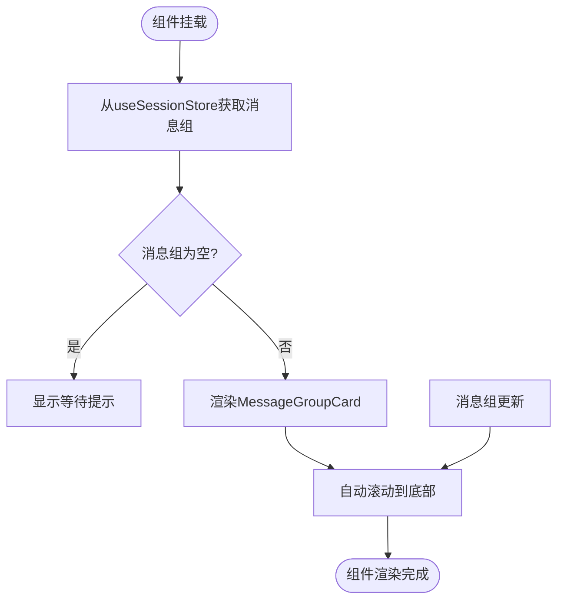

**图示来源**
- [ChatPanel.tsx](file://frontend/src/components/chat/ChatPanel.tsx#L1-L77)
- [useSessionStore.ts](file://frontend/src/stores/useSessionStore.ts#L1-L332)

**章节来源**
- [ChatPanel.tsx](file://frontend/src/components/chat/ChatPanel.tsx#L1-L77)
- [ChatPanel.types.ts](file://frontend/src/components/chat/ChatPanel.types.ts#L1-L22)
- [useSessionStore.ts](file://frontend/src/stores/useSessionStore.ts#L1-L332)

### WorkflowCanvas分析
WorkflowCanvas组件提供工作流的可视化画布，支持只读和编辑模式。在全屏模式下，可以显示退出全屏按钮。

#### 组件属性
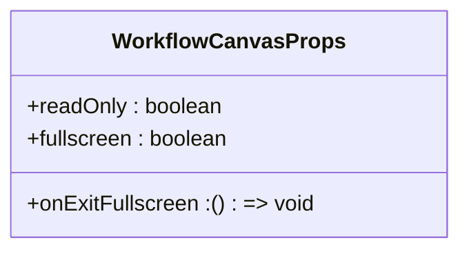

**图示来源**
- [WorkflowCanvas.tsx](file://frontend/src/components/modules/WorkflowCanvas.tsx#L3-L16)

**章节来源**
- [WorkflowCanvas.tsx](file://frontend/src/components/modules/WorkflowCanvas.tsx#L1-L16)

### PropertyPanel分析
PropertyPanel组件是一个浮动面板，用于配置工作流节点的属性。它根据节点类型动态渲染不同的表单组件，如VoteNodeForm、LoopNodeForm等。

#### 组件属性
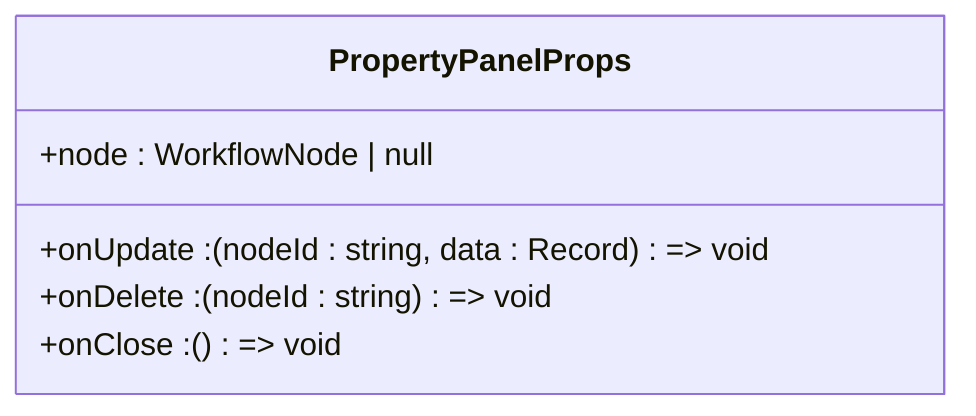

#### 节点类型与表单映射
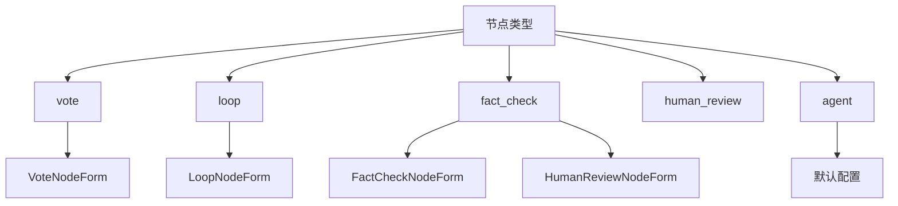

**图示来源**
- [PropertyPanel.tsx](file://frontend/src/features/editor/components/PropertyPanel/PropertyPanel.tsx#L1-L86)
- [workflow.ts](file://frontend/src/types/workflow.ts#L1-L45)

**章节来源**
- [PropertyPanel.tsx](file://frontend/src/features/editor/components/PropertyPanel/PropertyPanel.tsx#L1-L86)
- [workflow.ts](file://frontend/src/types/workflow.ts#L1-L45)

### ExecutionControlBar分析
ExecutionControlBar组件显示工作流执行状态并提供控制按钮。它从`useWorkflowRunStore`中获取执行状态和统计信息，并根据状态显示相应的控制按钮。

#### 组件属性
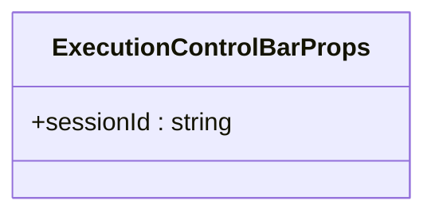

#### 状态转换逻辑
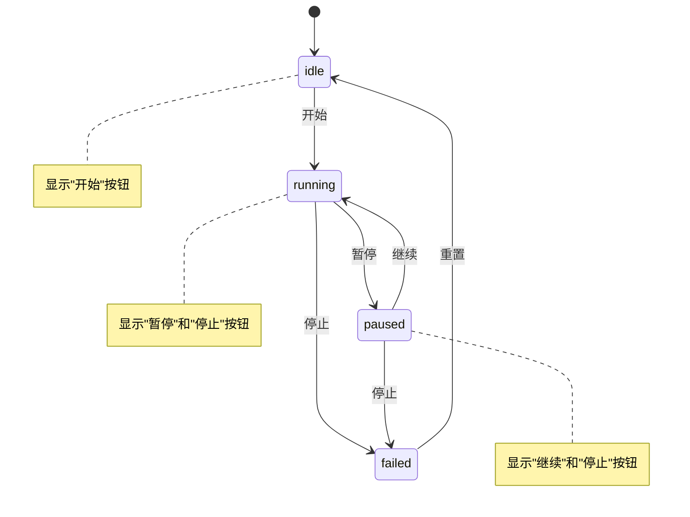

**图示来源**
- [ExecutionControlBar.tsx](file://frontend/src/components/meeting/ExecutionControlBar.tsx#L1-L72)
- [useWorkflowRunStore.ts](file://frontend/src/stores/useWorkflowRunStore.ts#L1-L301)

**章节来源**
- [ExecutionControlBar.tsx](file://frontend/src/components/meeting/ExecutionControlBar.tsx#L1-L72)
- [useWorkflowRunStore.ts](file://frontend/src/stores/useWorkflowRunStore.ts#L1-L301)

### MeetingRoom分析
MeetingRoom组件是应用程序的主要界面，集成了多个核心组件。它使用`react-resizable-panels`库管理三个可调整大小的面板，并通过`useLayoutStore`持久化布局状态。

#### 组件集成
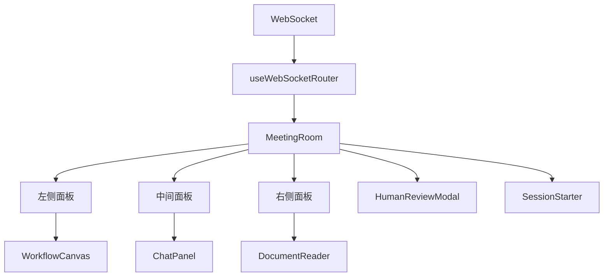

#### 全屏模式流程
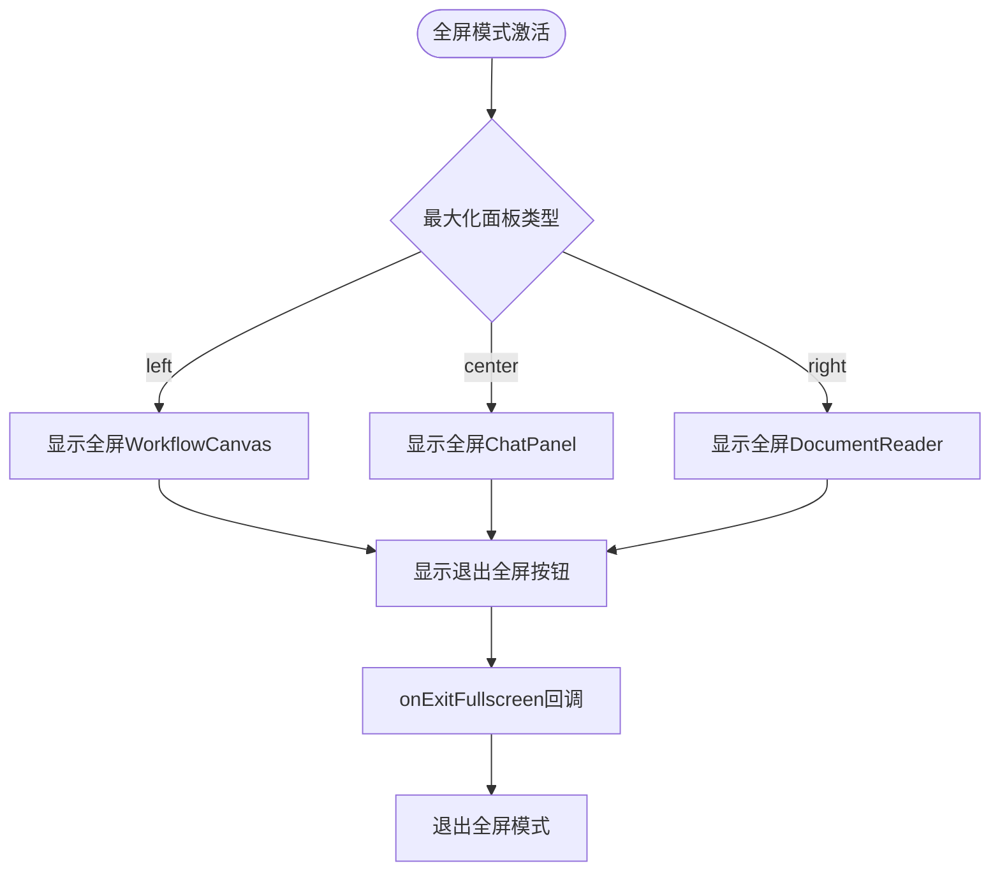

**图示来源**
- [MeetingRoom.tsx](file://frontend/src/features/meeting/MeetingRoom.tsx#L1-L233)
- [useLayoutStore.ts](file://frontend/src/stores/useLayoutStore.ts#L1-L44)

**章节来源**
- [MeetingRoom.tsx](file://frontend/src/features/meeting/MeetingRoom.tsx#L1-L233)
- [useLayoutStore.ts](file://frontend/src/stores/useLayoutStore.ts#L1-L44)

## 依赖分析
UI组件之间的依赖关系清晰，通过Zustand stores进行状态共享。`useSessionStore`管理会话和消息状态，`useWorkflowRunStore`管理工作流执行状态，`useLayoutStore`管理UI布局状态。WebSocket消息通过`useWebSocketRouter`统一处理，并更新相应的store。

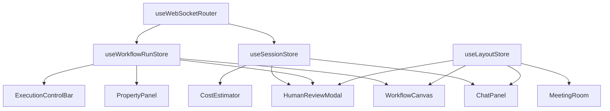

**图示来源**
- [useWebSocketRouter.ts](file://frontend/src/hooks/useWebSocketRouter.ts#L1-L126)
- [useSessionStore.ts](file://frontend/src/stores/useSessionStore.ts#L1-L332)
- [useWorkflowRunStore.ts](file://frontend/src/stores/useWorkflowRunStore.ts#L1-L301)
- [useLayoutStore.ts](file://frontend/src/stores/useLayoutStore.ts#L1-L44)

**章节来源**
- [useWebSocketRouter.ts](file://frontend/src/hooks/useWebSocketRouter.ts#L1-L126)
- [useSessionStore.ts](file://frontend/src/stores/useSessionStore.ts#L1-L332)
- [useWorkflowRunStore.ts](file://frontend/src/stores/useWorkflowRunStore.ts#L1-L301)
- [useLayoutStore.ts](file://frontend/src/stores/useLayoutStore.ts#L1-L44)

## 性能考虑
组件设计考虑了性能优化。ChatPanel使用`useEffect`在消息更新时自动滚动到底部，避免了不必要的重渲染。CostEstimator组件使用防抖技术，避免在用户拖拽节点时频繁请求成本估算。MeetingRoom组件使用`useRef`和`useEffect`来管理面板的展开/折叠状态，确保UI响应迅速。

## 故障排除指南
当遇到UI更新不及时的问题时，首先检查WebSocket连接状态和`useWebSocketRouter`是否正确路由消息。如果组件状态未更新，检查相关Zustand store的更新函数是否被正确调用。对于布局问题，检查`useLayoutStore`的持久化配置是否正常工作。

**章节来源**
- [useWebSocketRouter.ts](file://frontend/src/hooks/useWebSocketRouter.ts#L1-L126)
- [useSessionStore.ts](file://frontend/src/stores/useSessionStore.ts#L1-L332)
- [useWorkflowRunStore.ts](file://frontend/src/stores/useWorkflowRunStore.ts#L1-L301)
- [useLayoutStore.ts](file://frontend/src/stores/useLayoutStore.ts#L1-L44)

## 结论
本文档系统地介绍了前端代码库中的核心UI组件及其架构。通过Zustand进行状态管理、React Router进行页面路由、WebSocket进行实时通信的架构设计，实现了高效、响应式的用户界面。各组件职责清晰，通过store共享状态，形成了一个可维护、可扩展的前端应用。