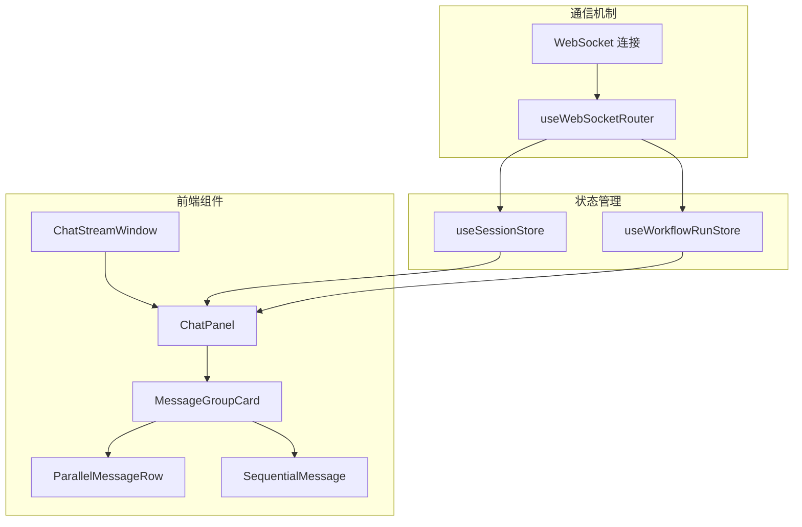
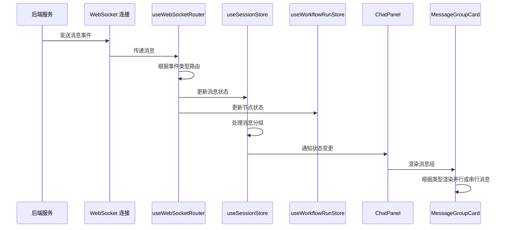
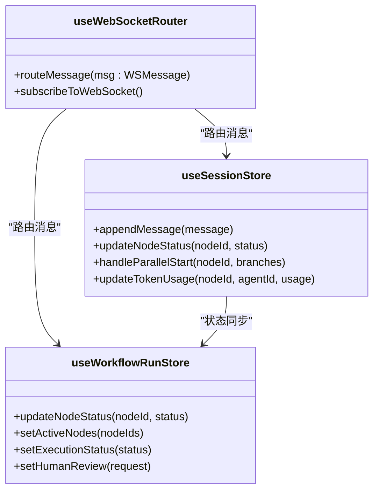
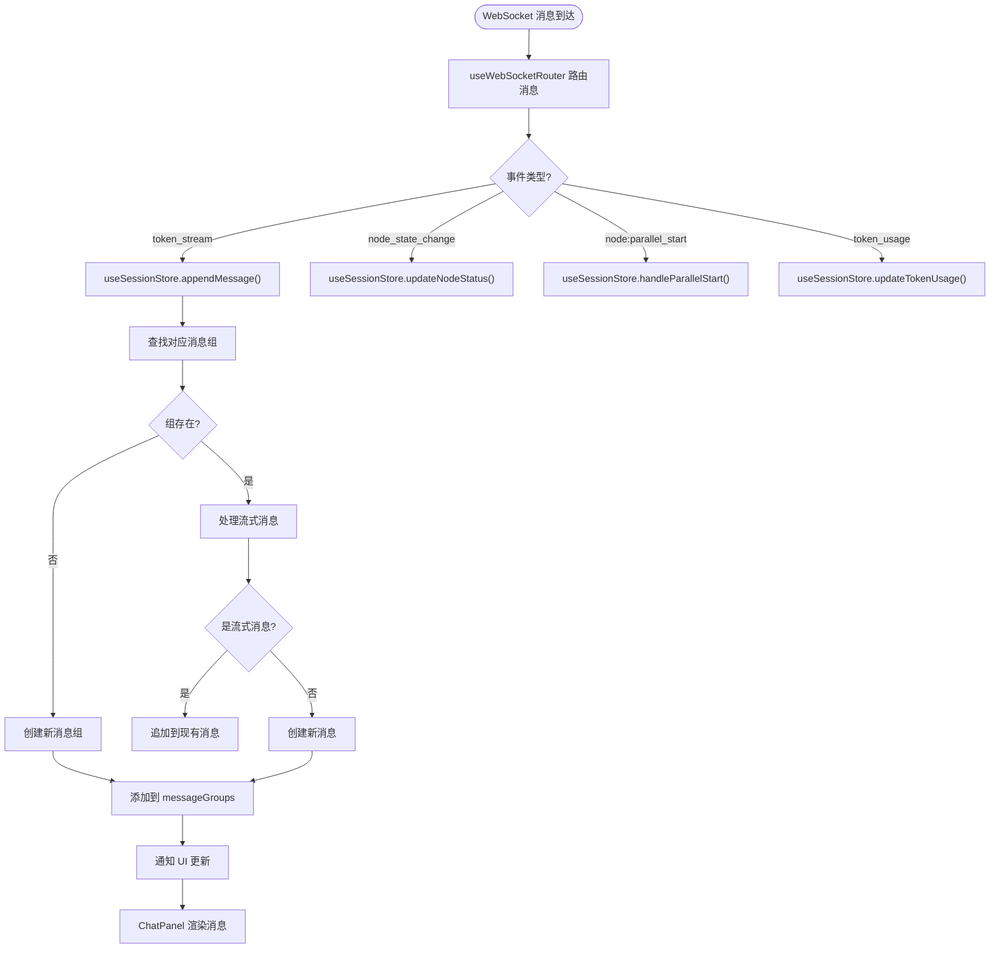
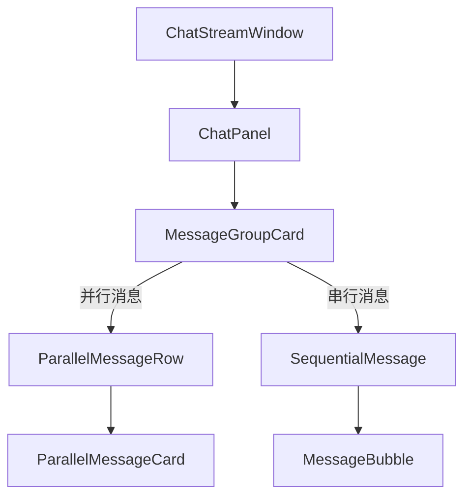

# ChatStreamWindow 组件

<cite>
**本文档引用文件**  
- [ChatStreamWindow.tsx](file://frontend/src/components/modules/ChatStreamWindow.tsx)
- [useWebSocketRouter.ts](file://frontend/src/hooks/useWebSocketRouter.ts)
- [MessageGroupCard.tsx](file://frontend/src/components/chat/MessageGroupCard.tsx)
- [ParallelMessageRow.tsx](file://frontend/src/components/chat/ParallelMessageRow.tsx)
- [SequentialMessage.tsx](file://frontend/src/components/chat/SequentialMessage.tsx)
- [MeetingRoom.tsx](file://frontend/src/features/meeting/MeetingRoom.tsx)
- [websocket.ts](file://frontend/src/types/websocket.ts)
- [useSessionStore.ts](file://frontend/src/stores/useSessionStore.ts)
- [useWorkflowRunStore.ts](file://frontend/src/stores/useWorkflowRunStore.ts)
- [ChatPanel.tsx](file://frontend/src/components/chat/ChatPanel.tsx)
</cite>

## 目录
1. [简介](#简介)
2. [项目结构](#项目结构)
3. [核心组件](#核心组件)
4. [架构概述](#架构概述)
5. [详细组件分析](#详细组件分析)
6. [依赖分析](#依赖分析)
7. [性能考虑](#性能考虑)
8. [故障排除指南](#故障排除指南)
9. [结论](#结论)

## 简介
ChatStreamWindow 组件是 Council 会议系统中用于实时展示 AI 代理流式消息的核心模块。该组件通过 WebSocket 连接接收来自后端的增量消息流，结合 useWebSocketRouter 和状态管理机制，实现消息的分组、并行与串行渲染优化。它作为会议执行界面的重要组成部分，负责展示 AI 代理的思考过程、决策结果和交互内容，为用户提供直观的实时反馈。

## 项目结构
ChatStreamWindow 组件位于前端代码库的模块目录中，与其他会议相关组件共同构成会议执行界面。该组件通过状态管理与 WebSocket 路由机制与系统其他部分紧密集成，形成完整的实时消息处理链路。



**图示来源**
- [ChatStreamWindow.tsx](file://frontend/src/components/modules/ChatStreamWindow.tsx)
- [ChatPanel.tsx](file://frontend/src/components/chat/ChatPanel.tsx)
- [useWebSocketRouter.ts](file://frontend/src/hooks/useWebSocketRouter.ts)
- [useSessionStore.ts](file://frontend/src/stores/useSessionStore.ts)
- [useWorkflowRunStore.ts](file://frontend/src/stores/useWorkflowRunStore.ts)

**本节来源**
- [ChatStreamWindow.tsx](file://frontend/src/components/modules/ChatStreamWindow.tsx)
- [MeetingRoom.tsx](file://frontend/src/features/meeting/MeetingRoom.tsx)

## 核心组件
ChatStreamWindow 组件是实时消息流展示的核心，它通过 WebSocket 接收并处理来自后端的增量消息流。该组件结合 useWebSocketRouter 和状态管理机制，实现消息的分组、并行与串行渲染优化。它与 MessageGroupCard、ParallelMessageRow、SequentialMessage 等子组件协同工作，构建完整的消息展示体系。

**本节来源**
- [ChatStreamWindow.tsx](file://frontend/src/components/modules/ChatStreamWindow.tsx)
- [useWebSocketRouter.ts](file://frontend/src/hooks/useWebSocketRouter.ts)
- [useSessionStore.ts](file://frontend/src/stores/useSessionStore.ts)

## 架构概述
ChatStreamWindow 组件的架构设计体现了现代前端应用的典型特征：组件化、状态驱动和实时通信。该组件通过订阅 WebSocket 消息，利用 useWebSocketRouter 进行消息路由，将不同类型的消息分发到相应的状态管理模块。useSessionStore 负责管理会话状态和消息组，而 useWorkflowRunStore 则跟踪工作流执行状态。这种分层架构确保了消息处理的高效性和可维护性。



**图示来源**
- [useWebSocketRouter.ts](file://frontend/src/hooks/useWebSocketRouter.ts)
- [useSessionStore.ts](file://frontend/src/stores/useSessionStore.ts)
- [useWorkflowRunStore.ts](file://frontend/src/stores/useWorkflowRunStore.ts)
- [ChatPanel.tsx](file://frontend/src/components/chat/ChatPanel.tsx)
- [MessageGroupCard.tsx](file://frontend/src/components/chat/MessageGroupCard.tsx)

## 详细组件分析
ChatStreamWindow 组件的实现机制体现了对实时消息流处理的深入理解和精心设计。通过对各个组件的详细分析，我们可以全面了解其工作原理和优化策略。

### ChatStreamWindow 分析
ChatStreamWindow 组件作为消息流展示的容器，负责组织和协调各个子组件的工作。它通过引入 CostEstimator 和 ParallelMessageRow 等组件，构建了完整的消息展示界面。该组件的设计简洁明了，主要职责是布局和容器管理，将复杂的业务逻辑委托给专门的子组件处理。

**本节来源**
- [ChatStreamWindow.tsx](file://frontend/src/components/modules/ChatStreamWindow.tsx)

### 消息处理机制分析
ChatStreamWindow 组件的核心功能是处理来自后端的实时消息流。这一功能的实现依赖于 useWebSocketRouter 和状态管理机制的紧密配合。

#### WebSocket 路由机制


**图示来源**
- [useWebSocketRouter.ts](file://frontend/src/hooks/useWebSocketRouter.ts)
- [useSessionStore.ts](file://frontend/src/stores/useSessionStore.ts)
- [useWorkflowRunStore.ts](file://frontend/src/stores/useWorkflowRunStore.ts)

#### 消息分组与渲染


**图示来源**
- [useWebSocketRouter.ts](file://frontend/src/hooks/useWebSocketRouter.ts)
- [useSessionStore.ts](file://frontend/src/stores/useSessionStore.ts)
- [ChatPanel.tsx](file://frontend/src/components/chat/ChatPanel.tsx)

### 子组件组合关系分析
ChatStreamWindow 组件通过与 MessageGroupCard、ParallelMessageRow 和 SequentialMessage 等子组件的组合，实现了灵活的消息展示能力。

#### 组件组合关系


**图示来源**
- [ChatStreamWindow.tsx](file://frontend/src/components/modules/ChatStreamWindow.tsx)
- [ChatPanel.tsx](file://frontend/src/components/chat/ChatPanel.tsx)
- [MessageGroupCard.tsx](file://frontend/src/components/chat/MessageGroupCard.tsx)
- [ParallelMessageRow.tsx](file://frontend/src/components/chat/ParallelMessageRow.tsx)
- [SequentialMessage.tsx](file://frontend/src/components/chat/SequentialMessage.tsx)

**本节来源**
- [MessageGroupCard.tsx](file://frontend/src/components/chat/MessageGroupCard.tsx)
- [ParallelMessageRow.tsx](file://frontend/src/components/chat/ParallelMessageRow.tsx)
- [SequentialMessage.tsx](file://frontend/src/components/chat/SequentialMessage.tsx)

## 依赖分析
ChatStreamWindow 组件的正常运行依赖于多个关键模块的协同工作。这些依赖关系构成了组件的功能基础，确保了消息流的完整处理链路。

```mermaid
dependency-graph
ChatStreamWindow --> ChatPanel
ChatStreamWindow --> CostEstimator
ChatPanel --> MessageGroupCard
MessageGroupCard --> ParallelMessageRow
MessageGroupCard --> SequentialMessage
MessageGroupCard --> GroupHeader
ParallelMessageRow --> ParallelMessageCard
SequentialMessage --> MessageBubble
useWebSocketRouter --> useSessionStore
useWebSocketRouter --> useWorkflowRunStore
useSessionStore --> useConnectStore
ChatPanel --> SessionHeader
ChatPanel --> ChatInput
```

**图示来源**
- [ChatStreamWindow.tsx](file://frontend/src/components/modules/ChatStreamWindow.tsx)
- [ChatPanel.tsx](file://frontend/src/components/chat/ChatPanel.tsx)
- [useWebSocketRouter.ts](file://frontend/src/hooks/useWebSocketRouter.ts)
- [useSessionStore.ts](file://frontend/src/stores/useSessionStore.ts)
- [useWorkflowRunStore.ts](file://frontend/src/stores/useWorkflowRunStore.ts)
- [useConnectStore.ts](file://frontend/src/stores/useConnectStore.ts)

**本节来源**
- [go.mod](file://go.mod)
- [package.json](file://frontend/package.json)

## 性能考虑
ChatStreamWindow 组件在设计时充分考虑了性能优化，通过多种策略确保在高频率消息流下的流畅用户体验。

### 虚拟滚动
虽然当前实现中未直接使用虚拟滚动，但 ChatPanel 组件通过监听消息组变化并自动滚动到底部，实现了类似的效果。这种设计避免了大量 DOM 元素的渲染，提高了滚动性能。

### 防抖渲染
useWebSocketRouter 通过 Zustand 状态管理的批处理机制，自然实现了消息渲染的防抖。多个连续的消息更新会被合并为一次状态变更，从而减少不必要的 UI 重渲染。

### 错误重连机制
WebSocket 连接的稳定性通过 useConnectStore 实现。当连接断开时，系统会自动尝试重新连接，确保消息流的连续性。这种机制在 MeetingRoom 组件中实现，为 ChatStreamWindow 提供了可靠的通信基础。

**本节来源**
- [useWebSocketRouter.ts](file://frontend/src/hooks/useWebSocketRouter.ts)
- [useConnectStore.ts](file://frontend/src/stores/useConnectStore.ts)
- [MeetingRoom.tsx](file://frontend/src/features/meeting/MeetingRoom.tsx)

## 故障排除指南
在使用 ChatStreamWindow 组件时，可能会遇到一些常见问题。以下是一些故障排除建议：

1. **消息不显示**：检查 WebSocket 连接状态，确保后端服务正常运行。
2. **消息顺序错乱**：确认后端发送的消息事件顺序正确，特别是并行消息的处理逻辑。
3. **性能下降**：监控消息频率，考虑增加消息合并或采样策略。
4. **连接中断**：检查网络状况，确认 WebSocket 服务器配置正确。

**本节来源**
- [useWebSocketRouter.ts](file://frontend/src/hooks/useWebSocketRouter.ts)
- [useSessionStore.ts](file://frontend/src/stores/useSessionStore.ts)
- [MeetingRoom.tsx](file://frontend/src/features/meeting/MeetingRoom.tsx)

## 结论
ChatStreamWindow 组件通过精心设计的架构和优化策略，成功实现了实时消息流的高效展示。该组件不仅提供了直观的用户界面，还通过与状态管理和 WebSocket 路由机制的深度集成，确保了消息处理的可靠性和性能。其模块化设计和清晰的依赖关系，为未来的功能扩展和维护提供了良好的基础。