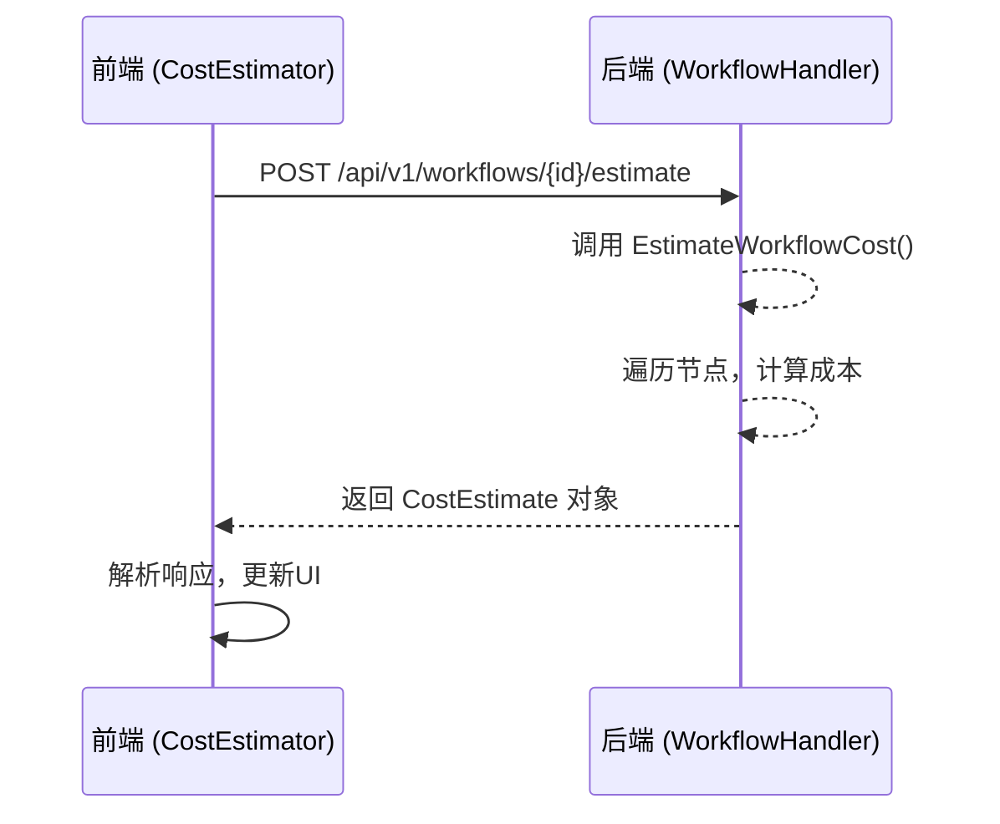
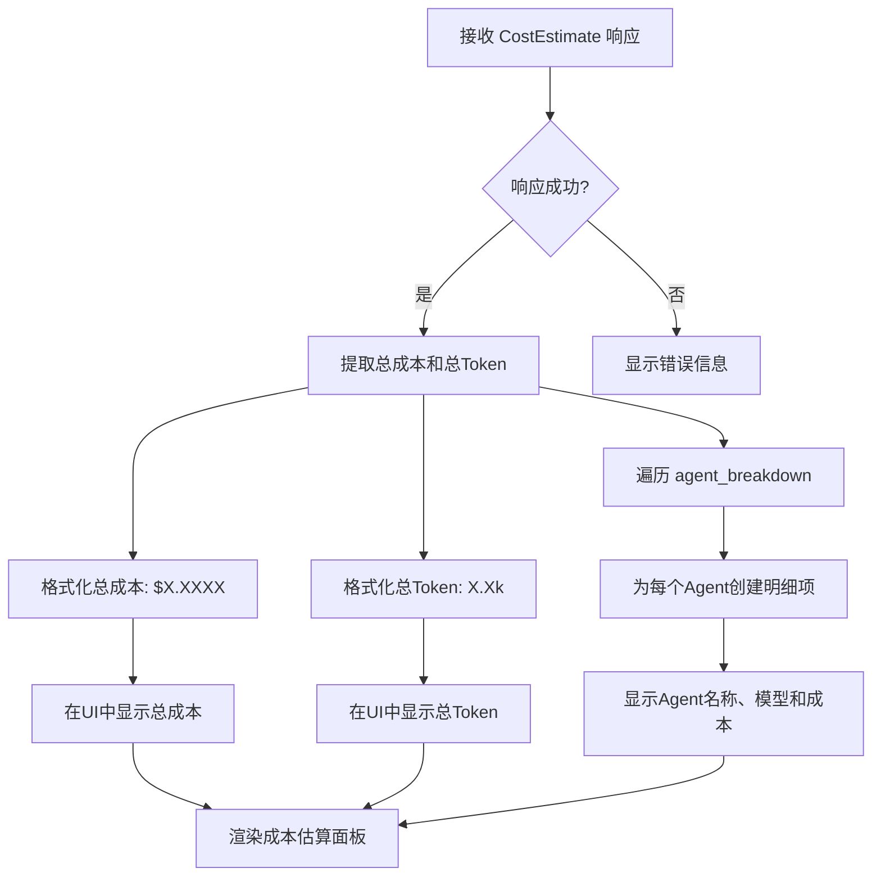
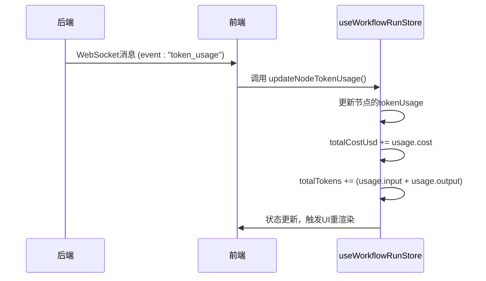

# CostEstimator 成本估算模块

<cite>
**本文档引用文件**   
- [CostEstimator.tsx](file://frontend/src/components/modules/CostEstimator.tsx)
- [CostEstimator.tsx](file://frontend/src/features/execution/components/CostEstimator.tsx)
- [SPEC-302-cost-estimator.md](file://docs/specs/sprint4/SPEC-302-cost-estimator.md)
- [ui_support_v1.5.md](file://docs/api/ui_support_v1.5.md)
- [cost_estimation.md](file://docs/api/cost_estimation.md)
- [MeetingRoom.tsx](file://frontend/src/features/meeting/MeetingRoom.tsx)
- [SessionStarter.tsx](file://frontend/src/features/meeting/SessionStarter.tsx)
- [useWorkflowEvents.ts](file://frontend/src/hooks/useWorkflowEvents.ts)
- [useWorkflowRunStore.ts](file://frontend/src/stores/useWorkflowRunStore.ts)
- [websocket.ts](file://frontend/src/types/websocket.ts)
- [workflow.go](file://internal/api/handler/workflow.go)
- [cost.go](file://internal/core/workflow/cost.go)
</cite>

## 目录
1. [简介](#简介)
2. [模块实现与双位置一致性](#模块实现与双位置一致性)
3. [成本估算API交互流程](#成本估算api交互流程)
4. [成本计算模型与前端呈现](#成本计算模型与前端呈现)
5. [实时成本累加与WebSocket事件](#实时成本累加与websocket事件)
6. [错误处理与加载状态](#错误处理与加载状态)
7. [UI交互规范与设计](#ui交互规范与设计)
8. [结论](#结论)

## 简介

CostEstimator 成本估算模块是系统中用于预估和实时监控AI会议成本的核心功能。该模块在前端实现了双位置部署，分别位于工作流构建界面和会议执行界面，为用户提供一致的成本预估体验。模块通过调用 `/api/v1/workflows/:id/estimate` REST API 获取预估成本，并通过WebSocket事件监听机制实现实时成本累加。成本计算模型基于token数、模型单价和调用次数，前端根据 SPEC-302-cost-estimator 和 ui_support_v1.5 规范实现UI交互。

## 模块实现与双位置一致性

CostEstimator 模块在前端代码库中存在两个实现位置，分别服务于不同的用户场景，但保持了功能和设计的一致性。

第一个实现位于 `frontend/src/components/modules/CostEstimator.tsx`，这是一个简化的成本估算组件，主要用于在工作流构建界面的侧边栏中显示预估成本和耗时。该组件仅展示静态的预估信息，不包含复杂的交互逻辑。

第二个实现位于 `frontend/src/features/execution/components/CostEstimator.tsx`，这是一个功能完整的成本估算面板，用于在用户启动会议前显示详细的成本预估。该组件接收工作流的节点和边作为输入，动态计算并展示成本预估。

两个组件虽然位置和复杂度不同，但都遵循了统一的设计语言和数据模型，确保了用户在不同界面中获得一致的成本信息体验。

**Section sources**
- [CostEstimator.tsx](file://frontend/src/components/modules/CostEstimator.tsx#L1-L20)
- [CostEstimator.tsx](file://frontend/src/features/execution/components/CostEstimator.tsx#L1-L137)

## 成本估算API交互流程

CostEstimator 模块通过调用后端提供的 REST API 来获取成本预估。交互流程如下：

1.  **API端点**: 模块调用 `POST /api/v1/workflows/:id/estimate` 端点，其中 `:id` 是工作流的唯一标识符。
2.  **请求构建**: 前端组件将当前工作流的节点和边信息转换为后端期望的 `GraphDefinition` 结构。这包括收集每个节点的ID、类型、名称、属性以及通过边确定的连接关系。
3.  **请求发送**: 构建好的工作流图定义作为JSON payload通过POST请求发送到后端。
4.  **响应处理**: 后端处理请求并返回成本估算结果。前端接收到响应后，解析数据并更新UI。如果请求失败，模块会捕获错误并显示相应的错误信息。

**Diagram sources **
- [CostEstimator.tsx](file://frontend/src/features/execution/components/CostEstimator.tsx#L21-L76)
- [workflow.go](file://internal/api/handler/workflow.go#L18-L27)
- [cost.go](file://internal/core/workflow/cost.go#L20-L40)

## 成本计算模型与前端呈现

成本计算模型是CostEstimator模块的核心，它基于token数、模型单价和调用次数来预估总成本。

### 后端计算逻辑

后端的成本计算由 `internal/core/workflow/cost.go` 文件中的 `EstimateWorkflowCost` 函数实现。该函数遍历工作流图中的所有节点，对每个节点调用 `estimateNodeCost` 函数进行成本估算。

-   **Token预估**: 对于每个LLM节点，系统假设一个平均的输入token数（1000）和输出token数（500）。
-   **模型定价**: 系统维护一个全局的 `ModelPricing` 映射，存储不同模型的每千token输入和输出价格。例如，`gpt-4-turbo` 的输入价格为0.01美元/千token，输出价格为0.03美元/千token。
-   **成本计算**: 单个节点的成本计算公式为：`(输入token数 / 1000) * 输入单价 + (输出token数 / 1000) * 输出单价`。
-   **逻辑节点**: 对于Start、End、Vote、Loop等逻辑节点，成本为0。

### 前端呈现逻辑

前端接收到后端返回的 `CostEstimate` 对象后，将其解析并以用户友好的方式呈现。

**Diagram sources **
- [cost.go](file://internal/core/workflow/cost.go#L42-L74)
- [CostEstimator.tsx](file://frontend/src/features/execution/components/CostEstimator.tsx#L101-L132)

## 实时成本累加与WebSocket事件

除了启动前的预估，系统还通过WebSocket连接实时累加和更新成本。

### WebSocket事件监听

前端通过 `useWebSocketRouter` hook 监听来自后端的WebSocket消息。当一个Agent节点完成其任务时，后端会广播一个 `token_usage` 事件。

### 实时累加逻辑

`useWorkflowRunStore` 状态管理器负责处理 `token_usage` 事件。当接收到该事件时，它会执行以下操作：
1.  更新该节点的token使用情况（输入、输出、成本）。
2.  将本次消耗的成本累加到全局的 `totalCostUsd` 统计中。
3.  将本次消耗的token累加到全局的 `totalTokens` 统计中。

这种设计确保了UI上显示的累计成本和token数是实时且准确的。

**Diagram sources **
- [useWebSocketRouter.ts](file://frontend/src/hooks/useWebSocketRouter.ts#L55-L67)
- [useWorkflowRunStore.ts](file://frontend/src/stores/useWorkflowRunStore.ts#L180-L188)
- [websocket.ts](file://frontend/src/types/websocket.ts#L32-L38)

## 错误处理与加载状态

CostEstimator 模块实现了完善的错误处理和加载状态管理，以提供流畅的用户体验。

### 加载状态

当组件首次加载或用户修改工作流后，模块会发起新的成本估算请求。在此期间，会显示一个加载指示器（如旋转图标），告知用户系统正在计算成本。这是通过组件内部的 `loading` 状态变量控制的。

### 错误处理

模块可能遇到多种错误情况：
-   **网络错误**: 无法连接到后端API。
-   **API错误**: 后端返回非200状态码。
-   **数据错误**: 响应数据格式不符合预期。

当发生错误时，模块会将 `error` 状态变量设置为相应的错误信息，并在UI中以醒目的方式（如红色文字）显示给用户，例如 "Estimation failed"。

### 配额超限处理

根据 `SPEC-302-cost-estimator.md` 规范，当预估成本超过设定阈值（如$0.30）时，系统会返回一个 `warnings` 数组。前端会解析这些警告，并在成本估算面板中显示警告信息和优化建议，例如 "本次会议预估成本超过 $0.30" 和 "建议: 切换为更经济的模型"。

**Section sources**
- [CostEstimator.tsx](file://frontend/src/features/execution/components/CostEstimator.tsx#L18-L20)
- [CostEstimator.tsx](file://frontend/src/features/execution/components/CostEstimator.tsx#L98-L100)
- [SPEC-302-cost-estimator.md](file://docs/specs/sprint4/SPEC-302-cost-estimator.md#L98-L104)

## UI交互规范与设计

CostEstimator 模块的UI设计严格遵循 `SPEC-302-cost-estimator` 和 `ui_support_v1.5` 规范。

### 成本预估面板布局

根据 `SPEC-302-cost-estimator.md`，成本预估面板包含以下元素：
-   **标题**: "💰 成本预估"
-   **核心指标**: 以网格布局显示总预估成本和预估耗时。
-   **分项明细**: 以列表形式展示每个Agent的成本和token消耗。
-   **警告信息**: 当成本过高时，显示警告和优化建议。
-   **操作按钮**: 包括"取消"、"调整配置"和"确认启动"按钮。

### 设计原则

-   **清晰性**: 关键数据（成本、耗时）使用大号字体突出显示。
-   **一致性**: 使用与系统其他部分一致的图标（如DollarSign、PieChart）和颜色方案。
-   **响应性**: 组件会根据工作流的变化自动重新计算并更新预估结果，但通过防抖（debounce）机制避免过于频繁的API调用。

**Section sources**
- [SPEC-302-cost-estimator.md](file://docs/specs/sprint4/SPEC-302-cost-estimator.md#L25-L40)
- [ui_support_v1.5.md](file://docs/api/ui_support_v1.5.md)

## 结论

CostEstimator 成本估算模块通过前后端的紧密协作，为用户提供了一个强大且直观的成本管理工具。模块在前端实现了双位置部署，确保了用户体验的一致性。通过调用REST API进行启动前预估，并利用WebSocket事件进行实时累加，模块能够准确反映会议的成本消耗。其错误处理、加载状态管理和符合规范的UI设计，共同构成了一个健壮且用户友好的功能模块。