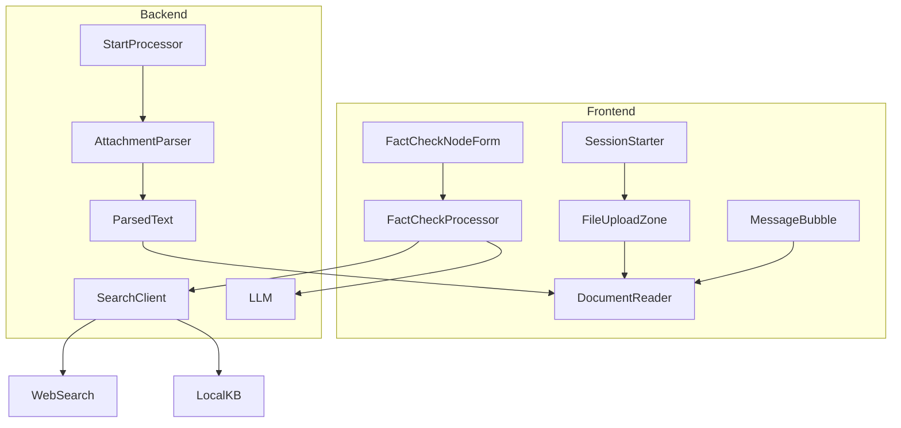
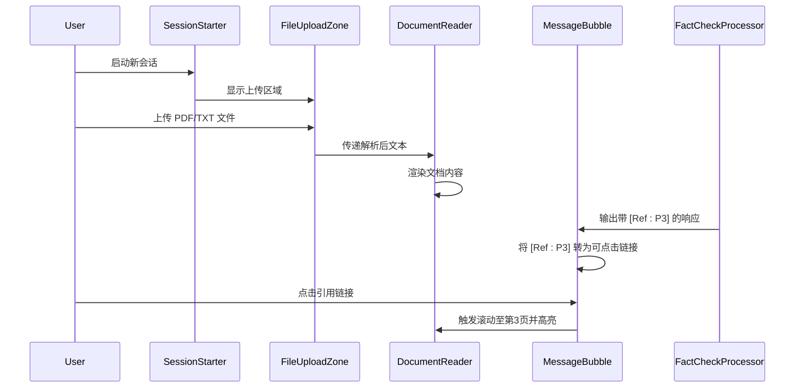
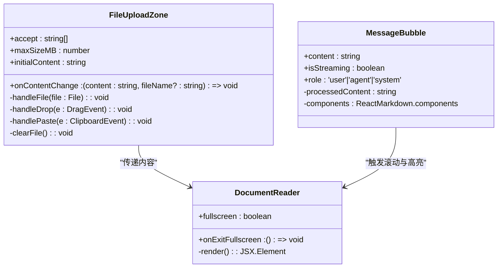
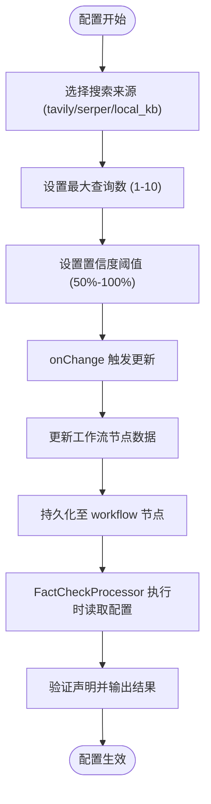
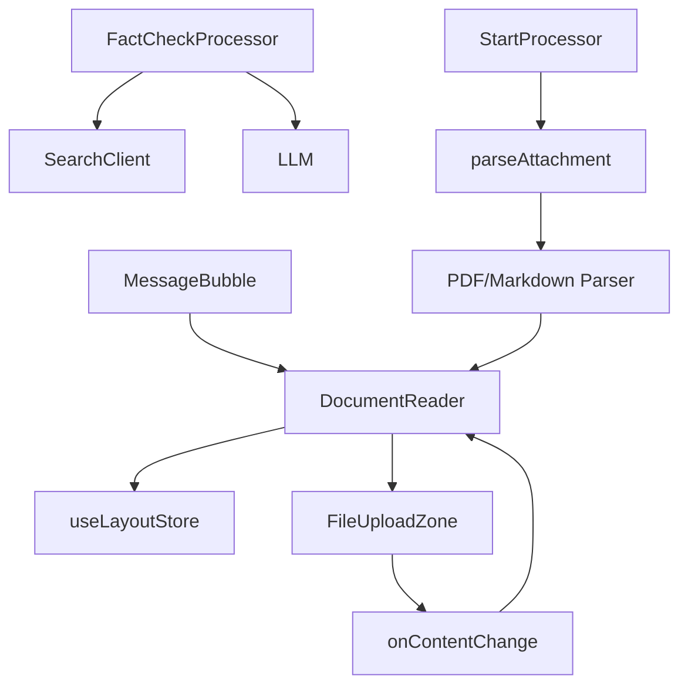

# DocumentReader 文档阅读器

<cite>
**本文档引用的文件**  
- [DocumentReader.tsx](file://frontend/src/components/modules/DocumentReader.tsx)
- [FileUploadZone.tsx](file://frontend/src/components/common/FileUploadZone.tsx)
- [MessageBubble.tsx](file://frontend/src/components/chat/MessageBubble.tsx)
- [FactCheckNodeForm.tsx](file://frontend/src/features/editor/components/PropertyPanel/NodeForms/FactCheckNodeForm.tsx)
- [fact_check.go](file://internal/core/workflow/nodes/fact_check.go)
- [SPEC-404-factcheck-processor.md](file://docs/specs/backend/SPEC-404-factcheck-processor.md)
- [SPEC-303-document-reference.md](file://docs/specs/sprint4/SPEC-303-document-reference.md)
- [tdd/02_core/12_fact_check.md](file://docs/tdd/02_core/12_fact_check.md)
- [workflow.ts](file://frontend/src/types/workflow.ts)
- [SessionStarter.tsx](file://frontend/src/features/meeting/SessionStarter.tsx)
</cite>

## 目录
1. [简介](#简介)
2. [项目结构](#项目结构)
3. [核心组件](#核心组件)
4. [架构概述](#架构概述)
5. [详细组件分析](#详细组件分析)
6. [依赖分析](#依赖分析)
7. [性能考虑](#性能考虑)
8. [故障排除指南](#故障排除指南)
9. [结论](#结论)

## 简介
DocumentReader 是 Council 系统中的核心组件，专为支持事实核查（FactCheck）流程而设计。该组件允许用户上传外部文档（如 PDF、TXT 等），并提供结构化展示与交互功能，使用户能够在审查 AI 输出时对照原始资料。通过与 FactCheckNodeForm 的深度集成，系统实现了高亮引用、来源标注和滚动同步等关键交互机制，确保信息验证过程的透明性和可追溯性。本文档详细阐述其技术实现，并参考 SPEC-404 中关于文档可信度验证的业务规则。

## 项目结构
DocumentReader 组件位于前端模块中，作为会议界面右侧面板的核心展示区域。它与文件上传、消息渲染和事实核查节点配置紧密集成，形成完整的文档参考工作流。

**图示来源**  
- [DocumentReader.tsx](file://frontend/src/components/modules/DocumentReader.tsx)
- [FileUploadZone.tsx](file://frontend/src/components/common/FileUploadZone.tsx)
- [fact_check.go](file://internal/core/workflow/nodes/fact_check.go)

## 核心组件
DocumentReader 组件负责接收并展示用户上传的文档内容，支持在事实核查过程中进行交叉验证。其主要职责包括：文档内容解析后的结构化展示、与 AI 输出中的引用标记联动、支持点击跳转与高亮显示，并通过布局状态持久化保持用户体验一致性。

**组件来源**  
- [DocumentReader.tsx](file://frontend/src/components/modules/DocumentReader.tsx)
- [FileUploadZone.tsx](file://frontend/src/components/common/FileUploadZone.tsx)

## 架构概述
DocumentReader 在整体架构中处于“知识呈现层”，上游连接文档解析与事实核查逻辑，下游服务于人工审查与决策流程。系统通过统一的引用格式 `[Ref: X]` 实现双向索引，确保 AI 输出与原始文档之间的可追溯性。

**图示来源**  
- [SessionStarter.tsx](file://frontend/src/features/meeting/SessionStarter.tsx)
- [MessageBubble.tsx](file://frontend/src/components/chat/MessageBubble.tsx)
- [fact_check.go](file://internal/core/workflow/nodes/fact_check.go)

## 详细组件分析

### DocumentReader 组件分析
DocumentReader 是一个功能型 UI 组件，用于在会议界面右侧展示用户上传的原始文档内容。当前实现处于基础阶段，仅提供静态占位符，未来将集成富文本渲染、行号标注和区域高亮功能。

#### 组件结构

**图示来源**  
- [DocumentReader.tsx](file://frontend/src/components/modules/DocumentReader.tsx)
- [FileUploadZone.tsx](file://frontend/src/components/common/FileUploadZone.tsx)
- [MessageBubble.tsx](file://frontend/src/components/chat/MessageBubble.tsx)

### FactCheckNodeForm 集成分析
FactCheckNodeForm 提供了事实核查节点的配置界面，允许用户选择验证来源（Tavily、Serper、本地知识库）、设置查询数量和置信度阈值。这些配置直接影响 FactCheckProcessor 的行为，进而决定文档可信度的评估标准。

#### 配置联动机制

**图示来源**  
- [FactCheckNodeForm.tsx](file://frontend/src/features/editor/components/PropertyPanel/NodeForms/FactCheckNodeForm.tsx)
- [workflow.ts](file://frontend/src/types/workflow.ts)
- [fact_check.go](file://internal/core/workflow/nodes/fact_check.go)

## 依赖分析
DocumentReader 的功能实现依赖多个前后端组件协同工作。前端依赖 Zustand 状态管理库维护布局状态，后端依赖 StartProcessor 对附件进行解析，并由 FactCheckProcessor 执行验证逻辑。

**图示来源**  
- [DocumentReader.tsx](file://frontend/src/components/modules/DocumentReader.tsx)
- [fact_check.go](file://internal/core/workflow/nodes/fact_check.go)
- [tdd/02_core/12_fact_check.md](file://docs/tdd/02_core/12_fact_check.md)

## 性能考虑
目前 DocumentReader 仅支持纯文本内容展示，对于大型 PDF 文件可能存在内存压力。建议后续实现分页加载与懒渲染机制，避免一次性加载全部内容。同时，引用解析应在 worker 线程中执行，防止阻塞主线程。

## 故障排除指南
当 DocumentReader 无法正确显示内容时，请检查以下环节：
1. 文件是否成功上传并触发 `onContentChange` 回调
2. `documentContent` 状态是否被正确传递至 DocumentReader
3. 引用链接格式是否符合 `[Ref: P3]` 或 `[Ref: L45-50]` 规范
4. 布局 store 是否正确初始化 panel 状态

**组件来源**  
- [FileUploadZone.tsx](file://frontend/src/components/common/FileUploadZone.tsx)
- [SessionStarter.tsx](file://frontend/src/features/meeting/SessionStarter.tsx)
- [SPEC-303-document-reference.md](file://docs/specs/sprint4/SPEC-303-document-reference.md)

## 结论
DocumentReader 作为事实核查流程的关键可视化组件，承担着连接 AI 输出与原始证据的桥梁作用。尽管当前实现较为基础，但已具备完整的引用跳转与交互框架。未来应加强与本地知识库的集成，提升文档解析精度，并支持多文档并列对比功能，进一步增强系统的可信度验证能力。