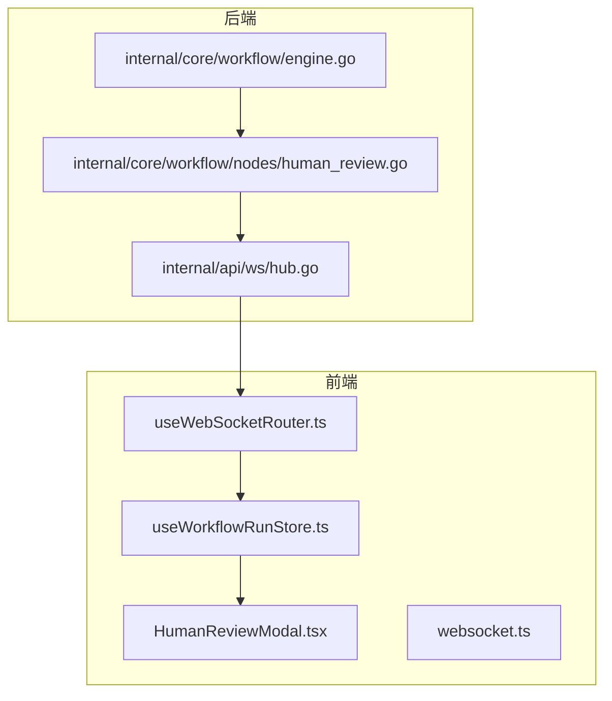
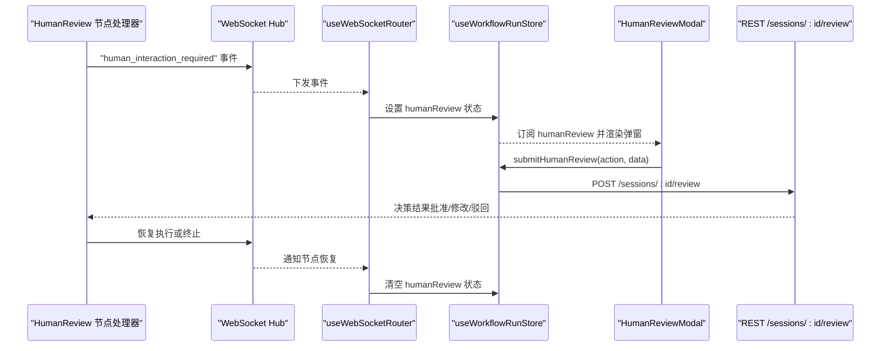
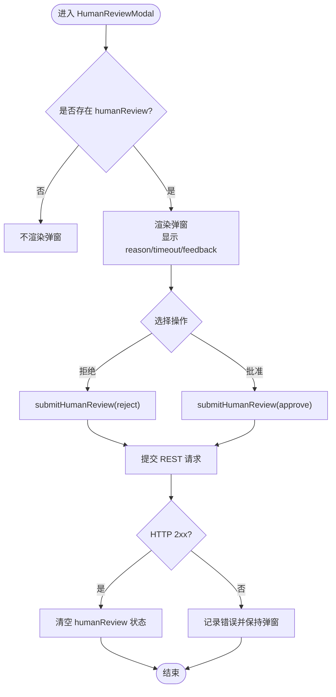
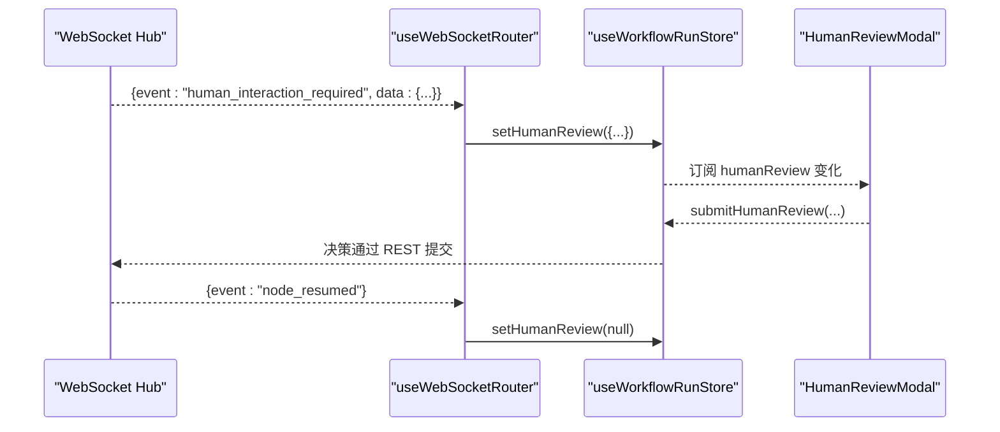
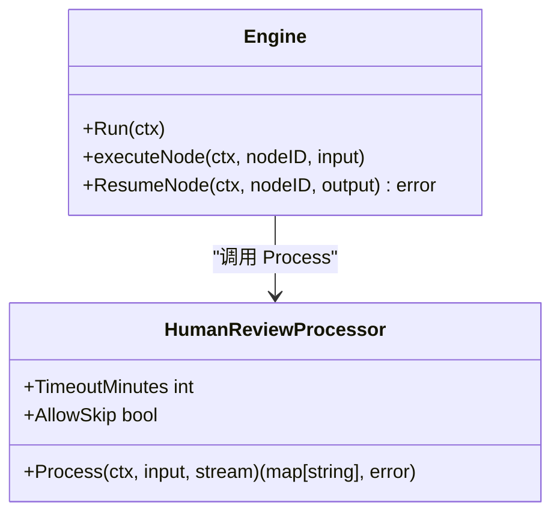
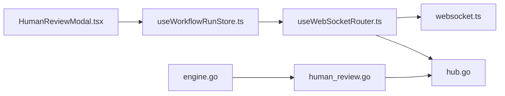

# HumanReviewModal 人工审核模态框

<cite>
**本文引用的文件**
- [frontend/src/features/execution/components/HumanReviewModal.tsx](file://frontend/src/features/execution/components/HumanReviewModal.tsx)
- [frontend/src/stores/useWorkflowRunStore.ts](file://frontend/src/stores/useWorkflowRunStore.ts)
- [frontend/src/hooks/useWebSocketRouter.ts](file://frontend/src/hooks/useWebSocketRouter.ts)
- [frontend/src/types/websocket.ts](file://frontend/src/types/websocket.ts)
- [docs/api/human_review.md](file://docs/api/human_review.md)
- [docs/specs/sprint4/SPEC-301-human-review-modal.md](file://docs/specs/sprint4/SPEC-301-human-review-modal.md)
- [internal/core/workflow/nodes/human_review.go](file://internal/core/workflow/nodes/human_review.go)
- [internal/core/workflow/engine.go](file://internal/core/workflow/engine.go)
- [internal/api/ws/hub.go](file://internal/api/ws/hub.go)
- [docs/reports/debugging/2025-12-21-websocket-debugging-report.md](file://docs/reports/debugging/2025-12-21-websocket-debugging-report.md)
</cite>

## 目录
1. [简介](#简介)
2. [项目结构](#项目结构)
3. [核心组件](#核心组件)
4. [架构总览](#架构总览)
5. [详细组件分析](#详细组件分析)
6. [依赖关系分析](#依赖关系分析)
7. [性能考量](#性能考量)
8. [故障排查指南](#故障排查指南)
9. [结论](#结论)
10. [附录](#附录)

## 简介
本文件围绕 HumanReviewModal 在“强制人机回环”机制中的关键作用进行系统化说明。文档覆盖以下主题：
- HumanReview 节点触发后的工作流暂停与前端弹窗展示
- 待决草案、AI论点汇总与决策选项的呈现方式
- 表单交互逻辑、用户输入验证、提交后通过 REST API 发送审批结果
- 结合 human_review API 规范与节点实现，解释状态暂存、超时处理与多用户协作场景下的冲突解决策略

## 项目结构
HumanReviewModal 位于前端执行模块，配合 WebSocket 路由与工作流运行状态存储，形成“后端节点触发 → WebSocket 通知 → 前端弹窗 → 用户决策 → 后端恢复执行”的闭环。

图表来源
- [frontend/src/features/execution/components/HumanReviewModal.tsx](file://frontend/src/features/execution/components/HumanReviewModal.tsx#L1-L91)
- [frontend/src/hooks/useWebSocketRouter.ts](file://frontend/src/hooks/useWebSocketRouter.ts#L1-L126)
- [frontend/src/types/websocket.ts](file://frontend/src/types/websocket.ts#L1-L52)
- [frontend/src/stores/useWorkflowRunStore.ts](file://frontend/src/stores/useWorkflowRunStore.ts#L1-L301)
- [internal/api/ws/hub.go](file://internal/api/ws/hub.go#L1-L124)
- [internal/core/workflow/nodes/human_review.go](file://internal/core/workflow/nodes/human_review.go#L1-L47)
- [internal/core/workflow/engine.go](file://internal/core/workflow/engine.go#L1-L246)

章节来源
- [frontend/src/features/execution/components/HumanReviewModal.tsx](file://frontend/src/features/execution/components/HumanReviewModal.tsx#L1-L91)
- [frontend/src/stores/useWorkflowRunStore.ts](file://frontend/src/stores/useWorkflowRunStore.ts#L1-L301)
- [frontend/src/hooks/useWebSocketRouter.ts](file://frontend/src/hooks/useWebSocketRouter.ts#L1-L126)
- [frontend/src/types/websocket.ts](file://frontend/src/types/websocket.ts#L1-L52)
- [internal/core/workflow/nodes/human_review.go](file://internal/core/workflow/nodes/human_review.go#L1-L47)
- [internal/core/workflow/engine.go](file://internal/core/workflow/engine.go#L1-L246)
- [internal/api/ws/hub.go](file://internal/api/ws/hub.go#L1-L124)

## 核心组件
- HumanReviewModal：展示“需要人工审核”的弹窗，提供反馈输入与批准/拒绝操作，提交后清空弹窗状态。
- useWorkflowRunStore：集中管理执行状态、人类审核请求与提交动作。
- useWebSocketRouter：统一路由 WebSocket 事件，将“人工介入请求”转换为弹窗状态。
- websocket.ts：定义 WebSocket 事件类型与消息结构。
- human_review API 文档：定义后端节点行为、WebSocket 事件与 REST 提交接口。
- HumanReview 节点处理器与引擎：在节点执行时发出“人工介入请求”事件，并在等待决策期间暂停执行。

章节来源
- [frontend/src/features/execution/components/HumanReviewModal.tsx](file://frontend/src/features/execution/components/HumanReviewModal.tsx#L1-L91)
- [frontend/src/stores/useWorkflowRunStore.ts](file://frontend/src/stores/useWorkflowRunStore.ts#L1-L301)
- [frontend/src/hooks/useWebSocketRouter.ts](file://frontend/src/hooks/useWebSocketRouter.ts#L1-L126)
- [frontend/src/types/websocket.ts](file://frontend/src/types/websocket.ts#L1-L52)
- [docs/api/human_review.md](file://docs/api/human_review.md#L1-L406)
- [internal/core/workflow/nodes/human_review.go](file://internal/core/workflow/nodes/human_review.go#L1-L47)
- [internal/core/workflow/engine.go](file://internal/core/workflow/engine.go#L1-L246)

## 架构总览
HumanReview 在工作流中的作用是“强制人机回环”：当执行到达 HumanReview 节点时，后端生成决策草案并暂停执行，通过 WebSocket 通知前端弹出 HumanReviewModal，用户提交决策后，后端恢复执行或终止流程。

图表来源
- [internal/core/workflow/nodes/human_review.go](file://internal/core/workflow/nodes/human_review.go#L1-L47)
- [internal/api/ws/hub.go](file://internal/api/ws/hub.go#L1-L124)
- [frontend/src/hooks/useWebSocketRouter.ts](file://frontend/src/hooks/useWebSocketRouter.ts#L1-L126)
- [frontend/src/stores/useWorkflowRunStore.ts](file://frontend/src/stores/useWorkflowRunStore.ts#L1-L301)
- [frontend/src/features/execution/components/HumanReviewModal.tsx](file://frontend/src/features/execution/components/HumanReviewModal.tsx#L1-L91)
- [docs/api/human_review.md](file://docs/api/human_review.md#L1-L406)

## 详细组件分析

### HumanReviewModal 组件
- 触发条件：当 store 中存在 humanReview 时渲染弹窗。
- 展示内容：reason、timeout、可选 feedback。
- 交互逻辑：
  - 拒绝：调用 submitHumanReview(action='reject')
  - 批准：调用 submitHumanReview(action='approve')
  - 提交后清空弹窗状态（store.humanReview=null）
- 表单验证：当前实现未包含字段校验逻辑，建议在实际实现中增加必填校验与长度限制。

图表来源
- [frontend/src/features/execution/components/HumanReviewModal.tsx](file://frontend/src/features/execution/components/HumanReviewModal.tsx#L1-L91)
- [frontend/src/stores/useWorkflowRunStore.ts](file://frontend/src/stores/useWorkflowRunStore.ts#L1-L301)

章节来源
- [frontend/src/features/execution/components/HumanReviewModal.tsx](file://frontend/src/features/execution/components/HumanReviewModal.tsx#L1-L91)
- [frontend/src/stores/useWorkflowRunStore.ts](file://frontend/src/stores/useWorkflowRunStore.ts#L1-L301)

### WebSocket 路由与状态同步
- useWebSocketRouter 将 WebSocket 事件映射到 store：
  - human_interaction_required → 设置 humanReview
  - node_resumed → 清空 humanReview
- websocket.ts 定义事件类型与消息结构，确保前后端协议一致。

图表来源
- [frontend/src/hooks/useWebSocketRouter.ts](file://frontend/src/hooks/useWebSocketRouter.ts#L1-L126)
- [frontend/src/types/websocket.ts](file://frontend/src/types/websocket.ts#L1-L52)
- [frontend/src/stores/useWorkflowRunStore.ts](file://frontend/src/stores/useWorkflowRunStore.ts#L1-L301)

章节来源
- [frontend/src/hooks/useWebSocketRouter.ts](file://frontend/src/hooks/useWebSocketRouter.ts#L1-L126)
- [frontend/src/types/websocket.ts](file://frontend/src/types/websocket.ts#L1-L52)

### 后端节点与引擎
- HumanReview 节点处理器：
  - 发出“human_interaction_required”事件，携带 reason 与 timeout
  - 返回挂起信号，使引擎暂停执行
- 引擎：
  - 在执行节点时检测挂起信号并停止推进
  - 通过 ResumeNode 或后续 REST 提交恢复执行

图表来源
- [internal/core/workflow/nodes/human_review.go](file://internal/core/workflow/nodes/human_review.go#L1-L47)
- [internal/core/workflow/engine.go](file://internal/core/workflow/engine.go#L1-L246)

章节来源
- [internal/core/workflow/nodes/human_review.go](file://internal/core/workflow/nodes/human_review.go#L1-L47)
- [internal/core/workflow/engine.go](file://internal/core/workflow/engine.go#L1-L246)

### human_review API 规范与节点实现
- WebSocket 事件：
  - human_interaction_required：触发弹窗，携带 reason 与 timeout
  - node_resumed：节点恢复执行
- REST 提交：
  - POST /api/v1/sessions/:sessionId/review
  - 请求体包含 review_id/node_id/action/data
  - 成功响应：清除弹窗状态
- 节点实现要点：
  - 生成决策草案
  - 保存请求并广播 human_interaction_required
  - 等待决策或超时

章节来源
- [docs/api/human_review.md](file://docs/api/human_review.md#L1-L406)
- [internal/core/workflow/nodes/human_review.go](file://internal/core/workflow/nodes/human_review.go#L1-L47)

### 状态暂存、超时处理与多用户协作
- 状态暂存：
  - store.humanReview 保存当前待审请求，驱动弹窗渲染
  - 提交成功后清空，避免重复提交
- 超时处理：
  - 节点侧设置 timeout，超时后可自动批准或报错
  - 前端可展示剩余时间（建议在弹窗中增加倒计时）
- 多用户协作与冲突解决：
  - 多用户场景下，建议后端在提交时校验“是否已过期/已被他人处理”
  - REST 提交返回 404/409 时，前端应提示用户刷新或重新获取待处理列表

章节来源
- [frontend/src/stores/useWorkflowRunStore.ts](file://frontend/src/stores/useWorkflowRunStore.ts#L1-L301)
- [docs/api/human_review.md](file://docs/api/human_review.md#L1-L406)

## 依赖关系分析
- 前端依赖链：
  - HumanReviewModal 依赖 useWorkflowRunStore 的 humanReview 与 submitHumanReview
  - useWebSocketRouter 依赖 websocket.ts 的事件类型定义
  - WebSocket Hub 与后端节点处理器通信
- 后端依赖链：
  - HumanReview 节点处理器依赖引擎与 Hub
  - 引擎在执行节点时检测挂起信号并暂停

图表来源
- [frontend/src/features/execution/components/HumanReviewModal.tsx](file://frontend/src/features/execution/components/HumanReviewModal.tsx#L1-L91)
- [frontend/src/stores/useWorkflowRunStore.ts](file://frontend/src/stores/useWorkflowRunStore.ts#L1-L301)
- [frontend/src/hooks/useWebSocketRouter.ts](file://frontend/src/hooks/useWebSocketRouter.ts#L1-L126)
- [frontend/src/types/websocket.ts](file://frontend/src/types/websocket.ts#L1-L52)
- [internal/api/ws/hub.go](file://internal/api/ws/hub.go#L1-L124)
- [internal/core/workflow/nodes/human_review.go](file://internal/core/workflow/nodes/human_review.go#L1-L47)
- [internal/core/workflow/engine.go](file://internal/core/workflow/engine.go#L1-L246)

章节来源
- [frontend/src/features/execution/components/HumanReviewModal.tsx](file://frontend/src/features/execution/components/HumanReviewModal.tsx#L1-L91)
- [frontend/src/stores/useWorkflowRunStore.ts](file://frontend/src/stores/useWorkflowRunStore.ts#L1-L301)
- [frontend/src/hooks/useWebSocketRouter.ts](file://frontend/src/hooks/useWebSocketRouter.ts#L1-L126)
- [frontend/src/types/websocket.ts](file://frontend/src/types/websocket.ts#L1-L52)
- [internal/api/ws/hub.go](file://internal/api/ws/hub.go#L1-L124)
- [internal/core/workflow/nodes/human_review.go](file://internal/core/workflow/nodes/human_review.go#L1-L47)
- [internal/core/workflow/engine.go](file://internal/core/workflow/engine.go#L1-L246)

## 性能考量
- WebSocket 消息路由：
  - 使用防重复处理与连接状态管理，减少无效渲染与重连开销
- 弹窗渲染：
  - 仅在存在 humanReview 时渲染，避免常驻 DOM
- 节点挂起：
  - 引擎在挂起节点时不再推进其他分支，降低并发压力

[本节为通用指导，无需列出章节来源]

## 故障排查指南
- WebSocket 消息未触发弹窗
  - 检查 useWebSocketRouter 是否正确路由 human_interaction_required
  - 确认 websocket.ts 事件类型与后端一致
  - 参考调试报告中 JSON 字段命名差异问题
- 提交失败或重复提交
  - REST 提交返回 404/409 时，前端应提示刷新或重新获取待处理列表
  - 确保提交成功后清空 humanReview 状态
- 超时处理
  - 前端可在弹窗中增加倒计时，超时后自动关闭或提示刷新
  - 后端应在超时后自动批准或报错

章节来源
- [frontend/src/hooks/useWebSocketRouter.ts](file://frontend/src/hooks/useWebSocketRouter.ts#L1-L126)
- [frontend/src/types/websocket.ts](file://frontend/src/types/websocket.ts#L1-L52)
- [docs/reports/debugging/2025-12-21-websocket-debugging-report.md](file://docs/reports/debugging/2025-12-21-websocket-debugging-report.md#L1-L40)
- [frontend/src/stores/useWorkflowRunStore.ts](file://frontend/src/stores/useWorkflowRunStore.ts#L1-L301)

## 结论
HumanReviewModal 是“强制人机回环”的关键前端组件。它通过 WebSocket 事件触发、状态暂存与 REST 提交，将后端节点的暂停与前端决策紧密耦合。结合 API 规范与节点实现，系统实现了可扩展的人类审核流程，支持超时处理与多用户协作场景下的冲突控制。

[本节为总结，无需列出章节来源]

## 附录
- 触发条件与弹窗布局参考 SPEC-301 与 human_review API 文档
- 节点实现与引擎挂起逻辑参考 human_review.go 与 engine.go

章节来源
- [docs/specs/sprint4/SPEC-301-human-review-modal.md](file://docs/specs/sprint4/SPEC-301-human-review-modal.md#L1-L125)
- [docs/api/human_review.md](file://docs/api/human_review.md#L1-L406)
- [internal/core/workflow/nodes/human_review.go](file://internal/core/workflow/nodes/human_review.go#L1-L47)
- [internal/core/workflow/engine.go](file://internal/core/workflow/engine.go#L1-L246)