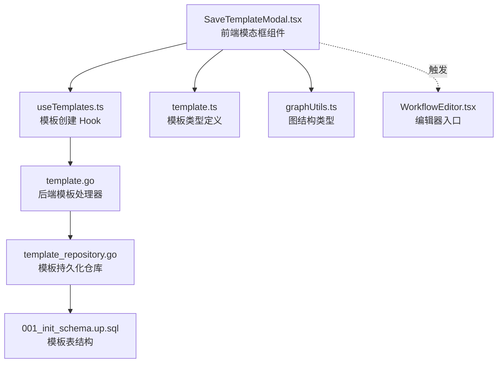
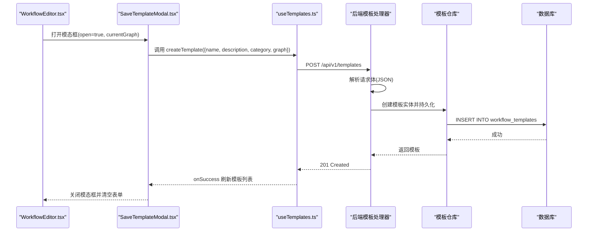
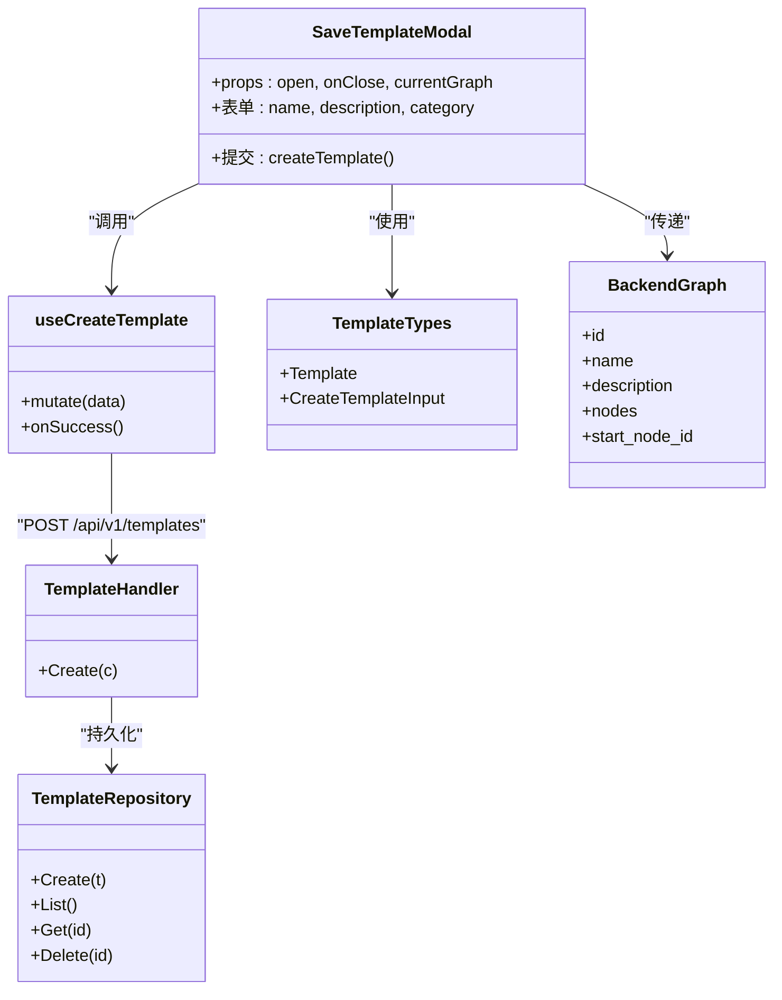

# SaveTemplateModal 保存模板模态框

<cite>
**本文引用的文件**
- [SaveTemplateModal.tsx](file://frontend/src/features/editor/components/SaveTemplateModal.tsx)
- [useTemplates.ts](file://frontend/src/hooks/useTemplates.ts)
- [template.ts](file://frontend/src/types/template.ts)
- [WorkflowEditor.tsx](file://frontend/src/features/editor/WorkflowEditor.tsx)
- [graphUtils.ts](file://frontend/src/utils/graphUtils.ts)
- [template.go](file://internal/core/workflow/template.go)
- [template.go](file://internal/api/handler/template.go)
- [template_repository.go](file://internal/infrastructure/persistence/template_repository.go)
- [SPEC-205-save-template.md](file://docs/specs/sprint3/SPEC-205-save-template.md)
- [001_init_schema.up.sql](file://internal/infrastructure/db/migrations/001_init_schema.up.sql)
</cite>

## 目录
1. [简介](#简介)
2. [项目结构](#项目结构)
3. [核心组件](#核心组件)
4. [架构总览](#架构总览)
5. [详细组件分析](#详细组件分析)
6. [依赖分析](#依赖分析)
7. [性能考虑](#性能考虑)
8. [故障排查指南](#故障排查指南)
9. [结论](#结论)

## 简介
SaveTemplateModal 是工作流编辑器中用于“保存为模板”的用户界面组件。它负责收集模板名称、描述与分类，并将当前工作流图结构（节点、连接关系与元数据）打包为模板，提交至后端接口 /api/v1/templates。该组件在工作流复用场景中具有核心价值：将定制化的流程固化为可复用模板，便于团队共享与二次应用。

## 项目结构
SaveTemplateModal 位于前端编辑器特性层，与模板类型定义、API Hook、图结构工具以及后端处理器共同构成完整的保存模板链路。

图表来源
- [SaveTemplateModal.tsx](file://frontend/src/features/editor/components/SaveTemplateModal.tsx#L1-L116)
- [useTemplates.ts](file://frontend/src/hooks/useTemplates.ts#L1-L63)
- [template.ts](file://frontend/src/types/template.ts#L1-L22)
- [graphUtils.ts](file://frontend/src/utils/graphUtils.ts#L1-L131)
- [template.go](file://internal/api/handler/template.go#L1-L68)
- [template_repository.go](file://internal/infrastructure/persistence/template_repository.go#L1-L96)
- [001_init_schema.up.sql](file://internal/infrastructure/db/migrations/001_init_schema.up.sql#L46-L54)
- [WorkflowEditor.tsx](file://frontend/src/features/editor/WorkflowEditor.tsx#L198-L209)

章节来源
- [SaveTemplateModal.tsx](file://frontend/src/features/editor/components/SaveTemplateModal.tsx#L1-L116)
- [useTemplates.ts](file://frontend/src/hooks/useTemplates.ts#L1-L63)
- [template.ts](file://frontend/src/types/template.ts#L1-L22)
- [graphUtils.ts](file://frontend/src/utils/graphUtils.ts#L1-L131)
- [template.go](file://internal/api/handler/template.go#L1-L68)
- [template_repository.go](file://internal/infrastructure/persistence/template_repository.go#L1-L96)
- [001_init_schema.up.sql](file://internal/infrastructure/db/migrations/001_init_schema.up.sql#L46-L54)
- [WorkflowEditor.tsx](file://frontend/src/features/editor/WorkflowEditor.tsx#L198-L209)

## 核心组件
- SaveTemplateModal：弹出式表单，收集模板名称、描述、分类；禁用条件为表单为空或正在提交；提交成功后关闭模态框并清空表单。
- useCreateTemplate：基于 TanStack Query 的模板创建 Hook，封装 POST /api/v1/templates 请求，成功后刷新模板列表缓存。
- Template 类型与 CreateTemplateInput：定义模板的字段与创建输入结构，包括 graph 字段承载完整图结构。
- BackendGraph 与 BackendNode：前端图结构类型，用于序列化节点、连接关系与元数据。
- 后端处理器与仓库：接收请求体，构造模板实体，持久化到数据库。

章节来源
- [SaveTemplateModal.tsx](file://frontend/src/features/editor/components/SaveTemplateModal.tsx#L1-L116)
- [useTemplates.ts](file://frontend/src/hooks/useTemplates.ts#L1-L63)
- [template.ts](file://frontend/src/types/template.ts#L1-L22)
- [graphUtils.ts](file://frontend/src/utils/graphUtils.ts#L1-L131)
- [template.go](file://internal/api/handler/template.go#L1-L68)
- [template_repository.go](file://internal/infrastructure/persistence/template_repository.go#L1-L96)

## 架构总览
SaveTemplateModal 的调用链路如下：编辑器触发打开模态框，用户填写表单并点击保存，前端通过 useCreateTemplate 发起 POST 请求，后端处理器解析请求体并写入模板仓库，最终返回创建成功的模板对象。

图表来源
- [WorkflowEditor.tsx](file://frontend/src/features/editor/WorkflowEditor.tsx#L198-L209)
- [SaveTemplateModal.tsx](file://frontend/src/features/editor/components/SaveTemplateModal.tsx#L1-L116)
- [useTemplates.ts](file://frontend/src/hooks/useTemplates.ts#L1-L63)
- [template.go](file://internal/api/handler/template.go#L1-L68)
- [template_repository.go](file://internal/infrastructure/persistence/template_repository.go#L1-L96)
- [001_init_schema.up.sql](file://internal/infrastructure/db/migrations/001_init_schema.up.sql#L46-L54)

## 详细组件分析

### SaveTemplateModal 表单与触发条件
- 触发条件：编辑器工具栏点击“保存为模板”按钮后，设置 showSaveTemplate 为 true，从而打开模态框。
- 表单字段：
  - 名称：必填，作为模板标识。
  - 描述：可选，用于说明模板用途。
  - 分类：下拉选择，支持 code_review、business_plan、quick_decision、custom、other。
- 输入验证逻辑：
  - 提交按钮禁用条件：当 isPending 为真或 name 为空时禁用。
  - 表单必填校验：HTML 属性 required 保证名称必填。
  - 额外校验：前端未实现额外规则（如长度限制），若需扩展可在表单层增加校验与错误提示。
- 提交行为：
  - 调用 useCreateTemplate.mutate 提交 {name, description, category, graph}。
  - 成功回调：alert 成功提示，关闭模态框，清空表单字段。
- 模板预览：显示当前图中节点数量，帮助用户确认序列化范围。

章节来源
- [WorkflowEditor.tsx](file://frontend/src/features/editor/WorkflowEditor.tsx#L198-L209)
- [SaveTemplateModal.tsx](file://frontend/src/features/editor/components/SaveTemplateModal.tsx#L1-L116)
- [SPEC-205-save-template.md](file://docs/specs/sprint3/SPEC-205-save-template.md#L1-L129)

### 模板序列化与数据完整性
- 图结构序列化：
  - BackendGraph 与 BackendNode 定义了模板 graph 的结构，包含 id、name、description、nodes、start_node_id 等字段。
  - graphUtils.ts 提供 BackendGraph 与 React Flow 节点/边的转换能力，确保模板 graph 与编辑器内部结构一致。
- 节点配置与连接关系：
  - nodes 字典记录每个节点的 id、type、name、next_ids（连接关系）与 properties（元数据）。
  - edges 由节点的 next_ids 自动推导，形成拓扑连接。
- 元数据保留：
  - properties 字段用于携带节点的动态配置（如 LLM 参数、工具配置等），在保存模板时一并序列化。

章节来源
- [template.ts](file://frontend/src/types/template.ts#L1-L22)
- [graphUtils.ts](file://frontend/src/utils/graphUtils.ts#L1-L131)
- [SPEC-205-save-template.md](file://docs/specs/sprint3/SPEC-205-save-template.md#L1-L129)

### API 调用流程与错误处理
- 前端调用：
  - useCreateTemplate 封装 fetch('/api/v1/templates', { method: 'POST', headers: { 'Content-Type': 'application/json' }, body: JSON.stringify(data) })。
  - 成功后通过 queryClient.invalidateQueries(['templates']) 刷新模板列表。
- 后端处理：
  - /api/v1/templates 接收 JSON 请求体，包含 name、description、category、graph。
  - 处理器构造模板实体（含 ID、时间戳、is_system=false），调用仓库持久化。
  - 仓库将 graph 以 JSONB 存储到 workflow_templates 表。
- 错误处理：
  - 前端：当响应非 2xx 时，抛出错误并提示；后端：返回 400/500 时携带 error 字段。
- 用户体验：
  - 成功：弹窗提示“模板保存成功”，关闭模态框。
  - 失败：根据响应内容提示错误信息（如网络失败、参数错误）。

章节来源
- [useTemplates.ts](file://frontend/src/hooks/useTemplates.ts#L1-L63)
- [template.go](file://internal/api/handler/template.go#L1-L68)
- [template_repository.go](file://internal/infrastructure/persistence/template_repository.go#L1-L96)
- [001_init_schema.up.sql](file://internal/infrastructure/db/migrations/001_init_schema.up.sql#L46-L54)
- [SPEC-205-save-template.md](file://docs/specs/sprint3/SPEC-205-save-template.md#L104-L129)

### 默认命名策略、重复检测与错误提示（结合 SPEC-205）
- 默认命名策略：
  - 当前前端未实现自动命名策略（如“未命名模板”或基于节点数的默认名）。若需增强，可在提交前对 name 进行默认填充或去重处理。
- 重复检测机制：
  - 数据库层面未见唯一约束或重复检测逻辑。若需要避免同名冲突，可在后端增加唯一索引或在前端进行名称校验。
- 错误提示：
  - 前端在非 2xx 时抛错并提示；后端返回 error 字段，前端可读取并展示给用户。
  - 网络失败：前端捕获异常并提示“网络失败”。

章节来源
- [SPEC-205-save-template.md](file://docs/specs/sprint3/SPEC-205-save-template.md#L1-L129)
- [template_repository.go](file://internal/infrastructure/persistence/template_repository.go#L1-L96)
- [001_init_schema.up.sql](file://internal/infrastructure/db/migrations/001_init_schema.up.sql#L46-L54)

## 依赖分析
- 组件耦合：
  - SaveTemplateModal 依赖 useTemplates（网络请求）、template 类型（数据结构）、graphUtils（图结构类型）。
  - 后端模板处理器依赖模板仓库；仓库依赖数据库驱动与 JSON 序列化。
- 外部依赖：
  - TanStack Query（useQuery/useMutation）用于状态管理与缓存。
  - Gin（后端框架）用于路由与请求绑定。
- 潜在循环依赖：
  - 前后端通过模板类型与请求体解耦，无直接循环依赖迹象。

图表来源
- [SaveTemplateModal.tsx](file://frontend/src/features/editor/components/SaveTemplateModal.tsx#L1-L116)
- [useTemplates.ts](file://frontend/src/hooks/useTemplates.ts#L1-L63)
- [template.ts](file://frontend/src/types/template.ts#L1-L22)
- [graphUtils.ts](file://frontend/src/utils/graphUtils.ts#L1-L131)
- [template.go](file://internal/api/handler/template.go#L1-L68)
- [template_repository.go](file://internal/infrastructure/persistence/template_repository.go#L1-L96)

章节来源
- [SaveTemplateModal.tsx](file://frontend/src/features/editor/components/SaveTemplateModal.tsx#L1-L116)
- [useTemplates.ts](file://frontend/src/hooks/useTemplates.ts#L1-L63)
- [template.ts](file://frontend/src/types/template.ts#L1-L22)
- [graphUtils.ts](file://frontend/src/utils/graphUtils.ts#L1-L131)
- [template.go](file://internal/api/handler/template.go#L1-L68)
- [template_repository.go](file://internal/infrastructure/persistence/template_repository.go#L1-L96)

## 性能考虑
- 前端渲染：
  - 模态框在 open=false 或缺少 currentGraph 时直接返回空，避免不必要的渲染。
  - 提交期间禁用按钮并显示加载图标，减少重复提交。
- 网络请求：
  - 使用 useMutation 管理并发与重试策略；成功后统一刷新模板列表缓存。
- 数据存储：
  - graph 以 JSONB 存储，查询与更新成本与节点规模相关；建议在编辑器侧尽量精简元数据，避免超大模板导致序列化/反序列化开销。

[本节为通用性能讨论，无需特定文件来源]

## 故障排查指南
- 提交按钮不可用
  - 检查是否处于 isPending 状态或 name 为空。
  - 章节来源
    - [SaveTemplateModal.tsx](file://frontend/src/features/editor/components/SaveTemplateModal.tsx#L1-L116)
- 网络失败或参数错误
  - 查看后端返回的 error 字段；前端会抛错并提示。
  - 章节来源
    - [useTemplates.ts](file://frontend/src/hooks/useTemplates.ts#L1-L63)
    - [template.go](file://internal/api/handler/template.go#L1-L68)
- 模板未出现在列表
  - 确认 onSuccess 是否触发 queryClient.invalidateQueries(['templates'])。
  - 章节来源
    - [useTemplates.ts](file://frontend/src/hooks/useTemplates.ts#L1-L63)
- 数据库异常
  - 检查 workflow_templates 表是否存在、字段是否匹配。
  - 章节来源
    - [template_repository.go](file://internal/infrastructure/persistence/template_repository.go#L1-L96)
    - [001_init_schema.up.sql](file://internal/infrastructure/db/migrations/001_init_schema.up.sql#L46-L54)

## 结论
SaveTemplateModal 通过简洁的表单与明确的提交流程，将编辑器中的工作流图结构完整序列化为模板，支撑团队在多场景下的流程复用。当前实现具备清晰的前后端边界与良好的错误提示；为进一步提升可用性，建议在前端补充默认命名与重复检测机制，并在后端增加唯一约束与更细粒度的校验提示。