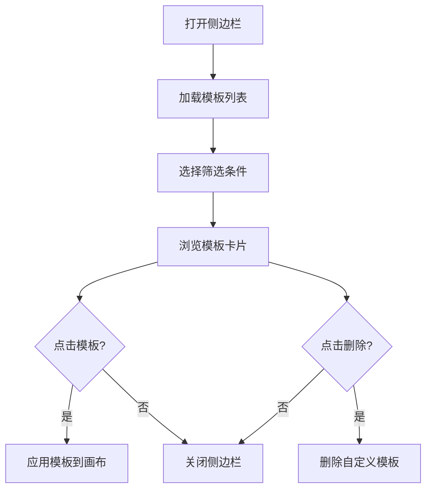
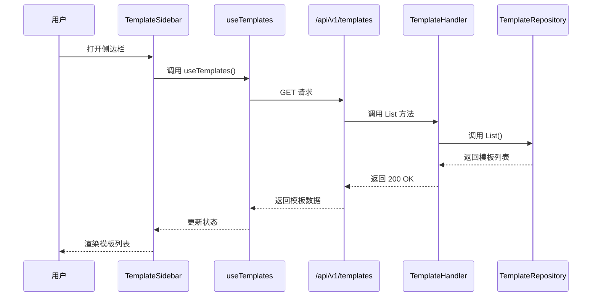
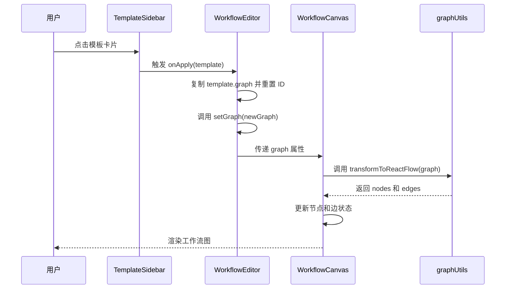
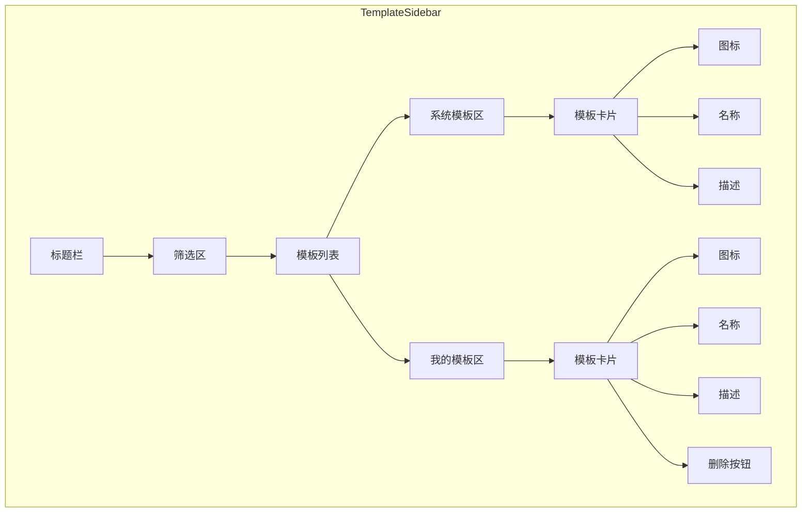
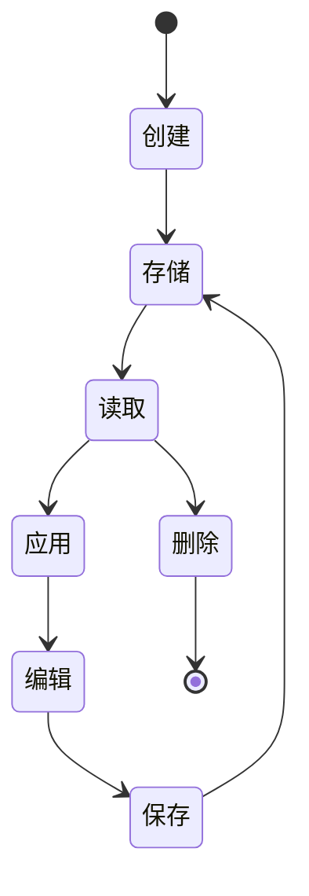

# TemplateSidebar 模板侧边栏

<cite>
**本文档引用文件**  
- [TemplateSidebar.tsx](file://frontend/src/features/editor/components/TemplateSidebar.tsx)
- [SaveTemplateModal.tsx](file://frontend/src/features/editor/components/SaveTemplateModal.tsx)
- [useTemplates.ts](file://frontend/src/hooks/useTemplates.ts)
- [template.ts](file://frontend/src/types/template.ts)
- [template.go](file://internal/api/handler/template.go)
- [workflow/template.go](file://internal/core/workflow/template.go)
- [graphUtils.ts](file://frontend/src/utils/graphUtils.ts)
- [WorkflowCanvas.tsx](file://frontend/src/components/workflow/WorkflowCanvas.tsx)
- [WorkflowEditor.tsx](file://frontend/src/features/editor/WorkflowEditor.tsx)
- [SPEC-204-template-sidebar.md](file://docs/specs/sprint3/SPEC-204-template-sidebar.md)
- [SPEC-205-save-template.md](file://docs/specs/sprint3/SPEC-205-save-template.md)
</cite>

## 目录
1. [简介](#简介)
2. [功能与交互](#功能与交互)
3. [模板数据获取与管理](#模板数据获取与管理)
4. [模板加载与应用流程](#模板加载与应用流程)
5. [UI布局与用户体验设计（SPEC-204）](#ui布局与用户体验设计spec-204)
6. [与 SaveTemplateModal 的协同机制](#与-savetemplatemodal-的协同机制)
7. [模板生命周期管理](#模板生命周期管理)
8. [结论](#结论)

## 简介
TemplateSidebar 是工作流编辑器中的核心功能组件，旨在为用户提供快速启动工作流的能力。通过集成系统预置与用户自定义模板，用户可以高效复用已有工作流配置，显著提升创建效率。该组件支持分类筛选、关键词搜索与实时预览，并与 SaveTemplateModal 协同形成完整的模板生命周期管理闭环。

**Section sources**
- [TemplateSidebar.tsx](file://frontend/src/features/editor/components/TemplateSidebar.tsx#L1-L134)
- [SPEC-204-template-sidebar.md](file://docs/specs/sprint3/SPEC-204-template-sidebar.md#L1-L131)

## 功能与交互
TemplateSidebar 提供了直观的模板浏览与应用界面。用户可通过点击工具栏的“Templates”按钮打开侧边栏，浏览系统预置和自定义模板。侧边栏支持按“全部”、“系统模板”和“我的模板”进行分类筛选，便于用户快速定位所需模板。

每个模板以卡片形式展示，包含图标、名称、描述及节点数量等信息。点击模板卡片即可将其应用到当前工作流画布中。对于用户自定义模板，卡片右上角提供删除按钮，允许用户移除不再需要的模板。

**Diagram sources**
- [TemplateSidebar.tsx](file://frontend/src/features/editor/components/TemplateSidebar.tsx#L20-L134)
- [SPEC-204-template-sidebar.md](file://docs/specs/sprint3/SPEC-204-template-sidebar.md#L51-L94)

## 模板数据获取与管理
TemplateSidebar 通过 `/api/v1/templates` 接口获取模板列表数据。前端使用 `useTemplates` Hook 发起 GET 请求，后端 `TemplateHandler.List` 方法处理请求并返回所有模板数据。

模板数据结构包含 ID、名称、描述、分类、是否为系统模板及工作流图定义等字段。系统模板由平台预置，`is_system` 字段为 `true`；用户自定义模板由用户创建，`is_system` 字段为 `false`。

**Diagram sources**
- [useTemplates.ts](file://frontend/src/hooks/useTemplates.ts#L6-L12)
- [template.go](file://internal/api/handler/template.go#L20-L27)
- [workflow/template.go](file://internal/core/workflow/template.go#L29-L31)

## 模板加载与应用流程
当用户点击模板卡片时，`onApply` 回调被触发，将模板的 `graph` 数据注入到 `WorkflowCanvas` 中。`WorkflowCanvas` 组件通过 `transformToReactFlow` 函数将后端图定义转换为 React Flow 兼容的节点和边结构，并更新画布状态。

转换过程中，系统会根据节点类型映射到相应的自定义节点组件（如 AgentNode、VoteNode 等），并计算节点布局位置。最终，模板工作流被完整还原并显示在画布上，用户可在此基础上进行修改和扩展。

**Diagram sources**
- [WorkflowEditor.tsx](file://frontend/src/features/editor/WorkflowEditor.tsx#L142-L154)
- [WorkflowCanvas.tsx](file://frontend/src/components/workflow/WorkflowCanvas.tsx#L81-L87)
- [graphUtils.ts](file://frontend/src/utils/graphUtils.ts#L20-L107)

## UI布局与用户体验设计（SPEC-204）
根据 SPEC-204 规范，TemplateSidebar 采用左侧固定侧边栏布局，宽度为 300px，具有良好的视觉层次和交互流畅性。顶部为标题栏，包含“模板库”标题和关闭按钮；中部为筛选下拉框，支持按类型过滤模板；底部为模板列表区域，分为“系统模板”和“我的模板”两个区块。

每个模板卡片采用简洁的卡片式设计，左侧显示分类图标，右侧显示名称和描述。鼠标悬停时卡片背景变色并显示删除按钮（仅自定义模板），提供直观的交互反馈。整体设计遵循一致性原则，与系统其他组件风格统一。

**Diagram sources**
- [SPEC-204-template-sidebar.md](file://docs/specs/sprint3/SPEC-204-template-sidebar.md#L8-L31)
- [TemplateSidebar.tsx](file://frontend/src/features/editor/components/TemplateSidebar.tsx#L34-L100)

## 与 SaveTemplateModal 的协同机制
TemplateSidebar 与 SaveTemplateModal 构成模板生命周期的两端。用户可通过 SaveTemplateModal 将当前工作流保存为新模板，保存成功后该模板会立即出现在 TemplateSidebar 的“我的模板”列表中。

SaveTemplateModal 提供表单让用户输入模板名称、描述和分类，并预览将要保存的节点数量。提交后，前端调用 `/api/v1/templates` 的 POST 接口创建新模板，后端生成唯一 ID 并持久化存储。保存成功后，`useTemplates` 的查询缓存被自动刷新，确保侧边栏列表实时更新。

**Diagram sources**
- [SaveTemplateModal.tsx](file://frontend/src/features/editor/components/SaveTemplateModal.tsx#L14-L62)
- [useTemplates.ts](file://frontend/src/hooks/useTemplates.ts#L44-L51)
- [template.go](file://internal/api/handler/template.go#L29-L58)

## 模板生命周期管理
TemplateSidebar 与 SaveTemplateModal 共同实现了完整的模板生命周期管理，包括创建、读取、应用和删除四个核心操作。

- **创建**：用户通过 SaveTemplateModal 将当前工作流保存为模板，系统生成唯一 ID 并存储。
- **读取**：TemplateSidebar 启动时自动加载所有模板，区分系统模板和用户模板。
- **应用**：用户点击模板卡片，系统将其图定义注入工作流画布，重置 ID 以创建新实例。
- **删除**：用户可删除自定义模板，系统调用 DELETE 接口移除数据并刷新列表。

这一闭环设计确保了模板的高效复用和灵活管理，极大提升了用户的工作流构建效率。

**Diagram sources**
- [SaveTemplateModal.tsx](file://frontend/src/features/editor/components/SaveTemplateModal.tsx)
- [TemplateSidebar.tsx](file://frontend/src/features/editor/components/TemplateSidebar.tsx)
- [useTemplates.ts](file://frontend/src/hooks/useTemplates.ts)

## 结论
TemplateSidebar 作为工作流快速启动的核心组件，通过高效的模板管理机制显著提升了用户体验。其与 SaveTemplateModal 的紧密协同，形成了完整的模板生命周期闭环，实现了从创建到应用的无缝衔接。结合 SPEC-204 的 UI 设计规范，该组件在功能性和美观性上均达到了较高水准，为用户提供了便捷、直观的工作流构建体验。