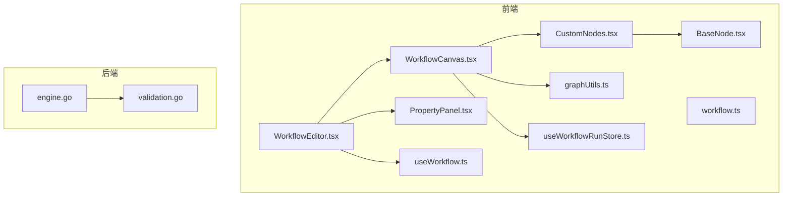
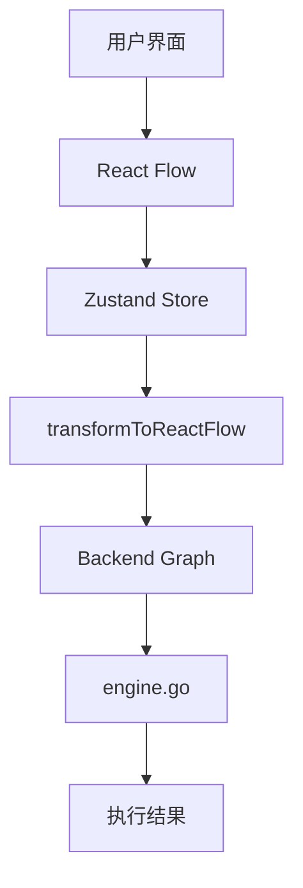
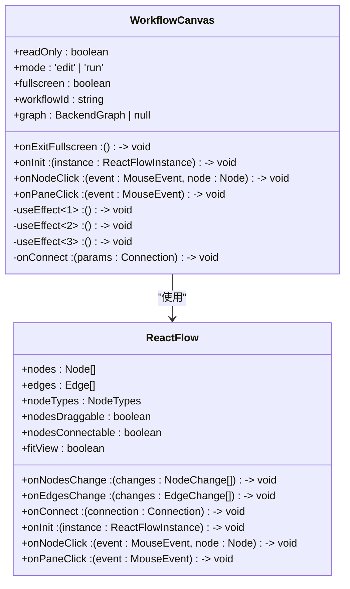
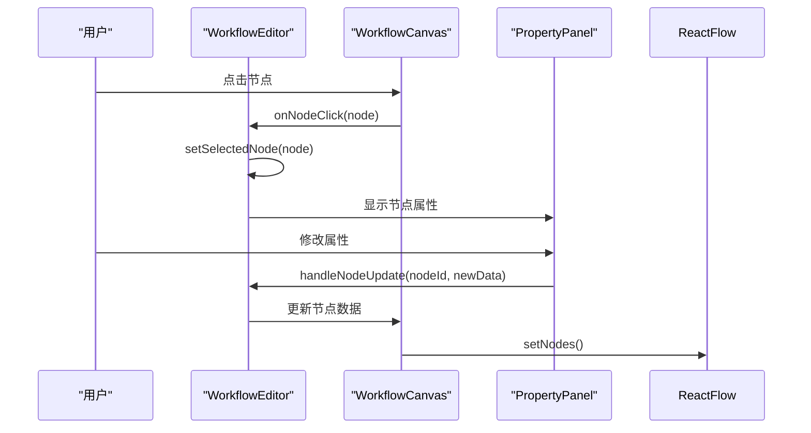
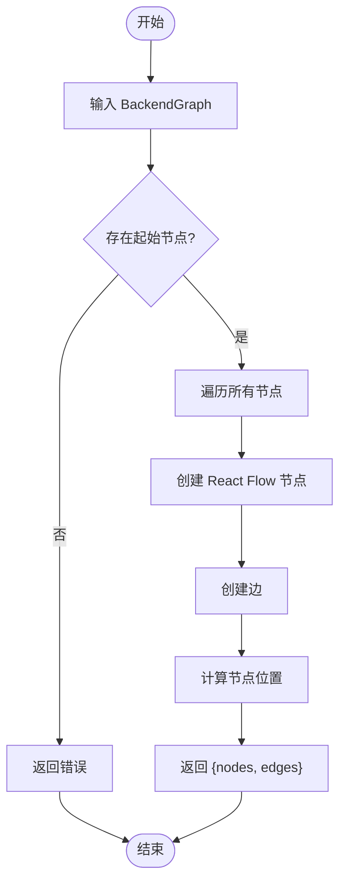
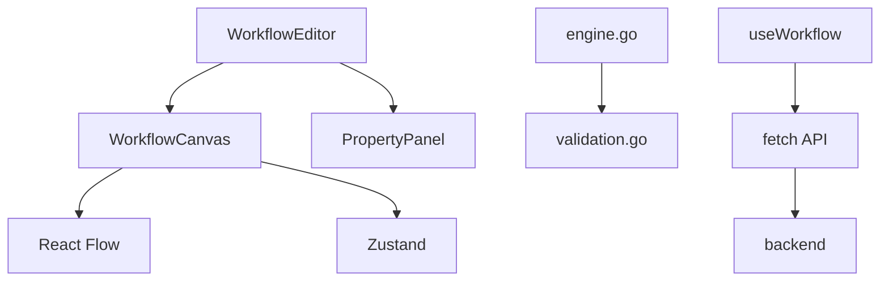

# WorkflowCanvas 工作流画布

<cite>
**本文档引用的文件**  
- [WorkflowCanvas.tsx](file://frontend/src/components/workflow/WorkflowCanvas.tsx)
- [WorkflowEditor.tsx](file://frontend/src/features/editor/WorkflowEditor.tsx)
- [PropertyPanel.tsx](file://frontend/src/features/editor/components/PropertyPanel/PropertyPanel.tsx)
- [CustomNodes.tsx](file://frontend/src/components/workflow/nodes/CustomNodes.tsx)
- [BaseNode.tsx](file://frontend/src/components/workflow/nodes/BaseNode.tsx)
- [graphUtils.ts](file://frontend/src/utils/graphUtils.ts)
- [workflow.ts](file://frontend/src/types/workflow.ts)
- [useWorkflowRunStore.ts](file://frontend/src/stores/useWorkflowRunStore.ts)
- [useWorkflow.ts](file://frontend/src/hooks/useWorkflow.ts)
- [engine.go](file://internal/core/workflow/engine.go)
- [validation.go](file://internal/core/workflow/validation.go)
</cite>

## 更新摘要
**已做更改**  
- 更新了“简介”、“项目结构”和“WorkflowCanvas 分析”部分，以反映节点渲染修复和 `fitView` 策略的改进。
- 增加了关于重新挂载机制和防抖 `fitView` 策略的技术细节。
- 更新了相关代码文件的引用，确保与当前实现一致。

## 目录
1. [简介](#简介)
2. [项目结构](#项目结构)
3. [核心组件](#核心组件)
4. [架构概述](#架构概述)
5. [详细组件分析](#详细组件分析)
6. [依赖分析](#依赖分析)
7. [性能考虑](#性能考虑)
8. [故障排除指南](#故障排除指南)
9. [结论](#结论)

## 简介
WorkflowCanvas 是一个可视化工作流编辑器的核心组件，它基于 React Flow 库构建，为用户提供了一个直观的界面来设计和管理复杂的工作流。该画布支持多种节点类型（如 Start、Agent、Vote、Loop 等）的注册与渲染，并实现了边（Edge）的连接逻辑。通过拖拽交互、缩放控制以及 DAG 布局算法，用户可以轻松地创建和调整工作流。此外，系统还集成了错误校验机制，例如循环检测，以确保工作流的正确性。结合 WorkflowEditor 和 PropertyPanel，实现了状态同步，并能够序列化/反序列化工作流 JSON 结构，以匹配后端 engine.go 的执行模型。最近，WorkflowCanvas 组件已修复，现在默认能正确显示。通过复杂的重新挂载和防抖 fitView 策略解决了节点无法渲染的问题，提升了画布的稳定性和用户体验。

**Section sources**
- [WorkflowCanvas.tsx](file://frontend/src/components/workflow/WorkflowCanvas.tsx)

## 项目结构
项目结构清晰地划分了前端和后端代码，其中前端部分位于 `frontend/` 目录下，而后端逻辑则在 `internal/` 目录中实现。前端主要由 React 组件构成，包括工作流画布、属性面板等；后端则负责处理业务逻辑、数据存储及 API 接口。

**Diagram sources**
- [WorkflowCanvas.tsx](file://frontend/src/components/workflow/WorkflowCanvas.tsx)
- [WorkflowEditor.tsx](file://frontend/src/features/editor/WorkflowEditor.tsx)
- [PropertyPanel.tsx](file://frontend/src/features/editor/components/PropertyPanel/PropertyPanel.tsx)
- [CustomNodes.tsx](file://frontend/src/components/workflow/nodes/CustomNodes.tsx)
- [BaseNode.tsx](file://frontend/src/components/workflow/nodes/BaseNode.tsx)
- [graphUtils.ts](file://frontend/src/utils/graphUtils.ts)
- [useWorkflowRunStore.ts](file://frontend/src/stores/useWorkflowRunStore.ts)
- [useWorkflow.ts](file://frontend/src/hooks/useWorkflow.ts)
- [engine.go](file://internal/core/workflow/engine.go)
- [validation.go](file://internal/core/workflow/validation.go)

**Section sources**
- [WorkflowCanvas.tsx](file://frontend/src/components/workflow/WorkflowCanvas.tsx)
- [WorkflowEditor.tsx](file://frontend/src/features/editor/WorkflowEditor.tsx)

## 核心组件
WorkflowCanvas 的核心在于其对 React Flow 的集成，以及对各种节点类型的注册与渲染。每个节点都有特定的数据结构和行为，这些都通过自定义的 Node 组件来实现。例如，StartNode 和 EndNode 分别表示工作流的起点和终点，而 AgentNode、VoteNode、LoopNode 等则代表不同的任务或决策点。这些节点通过边连接起来，形成一个有向无环图（DAG），从而定义了整个工作流的执行顺序。

**Section sources**
- [CustomNodes.tsx](file://frontend/src/components/workflow/nodes/CustomNodes.tsx)
- [BaseNode.tsx](file://frontend/src/components/workflow/nodes/BaseNode.tsx)
- [workflow.ts](file://frontend/src/types/workflow.ts)

## 架构概述
整个系统的架构围绕着前端的可视化编辑器和后端的工作流引擎展开。前端使用 React Flow 提供的 API 来管理节点和边的状态，同时利用 Zustand 进行状态管理。当用户在画布上进行操作时，如添加节点、连接边等，这些变化会被实时反映到 React Flow 的状态中，并通过 `transformToReactFlow` 函数转换为后端可理解的格式。后端的 engine.go 负责解析并执行这些工作流定义，确保按照预设的逻辑正确运行。

**Diagram sources**
- [WorkflowCanvas.tsx](file://frontend/src/components/workflow/WorkflowCanvas.tsx)
- [graphUtils.ts](file://frontend/src/utils/graphUtils.ts)
- [engine.go](file://internal/core/workflow/engine.go)

**Section sources**
- [WorkflowCanvas.tsx](file://frontend/src/components/workflow/WorkflowCanvas.tsx)
- [graphUtils.ts](file://frontend/src/utils/graphUtils.ts)
- [engine.go](file://internal/core/workflow/engine.go)

## 详细组件分析

### WorkflowCanvas 分析
WorkflowCanvas 组件是整个工作流编辑器的基础，它封装了 React Flow 的所有功能，并提供了额外的配置选项，如只读模式、全屏模式等。通过 `nodeTypes` 配置，可以将不同类型的节点映射到相应的自定义组件上，从而实现多样化的视觉呈现。近期，该组件进行了重要修复，解决了节点无法正确渲染的问题。具体来说，通过引入复杂的重新挂载机制和防抖 `fitView` 策略，确保了画布在加载时能够正确显示所有节点。`key` 属性根据节点数量动态变化，强制 React Flow 重新挂载，避免了初始化时节点未完全加载的问题。同时，使用 `useNodesInitialized` 钩子和 `ResizeObserver` 结合防抖技术，确保在节点初始化完成且容器尺寸稳定后才执行 `fitView`，从而提升了画布的稳定性和用户体验。

#### 对于对象导向的组件：

**Diagram sources**
- [WorkflowCanvas.tsx](file://frontend/src/components/workflow/WorkflowCanvas.tsx)

**Section sources**
- [WorkflowCanvas.tsx](file://frontend/src/components/workflow/WorkflowCanvas.tsx)

### WorkflowEditor 与 PropertyPanel 状态同步
WorkflowEditor 负责协调 WorkflowCanvas 和 PropertyPanel 之间的交互。当用户点击某个节点时，`handleNodeClick` 函数会更新选中节点的状态，并将其传递给 PropertyPanel 显示详细信息。同样地，当用户在 PropertyPanel 中修改节点属性时，`handleNodeUpdate` 会触发，更新 React Flow 中对应节点的数据。

#### 对于 API/服务组件：

**Diagram sources**
- [WorkflowEditor.tsx](file://frontend/src/features/editor/WorkflowEditor.tsx)
- [PropertyPanel.tsx](file://frontend/src/features/editor/components/PropertyPanel/PropertyPanel.tsx)

**Section sources**
- [WorkflowEditor.tsx](file://frontend/src/features/editor/WorkflowEditor.tsx)
- [PropertyPanel.tsx](file://frontend/src/features/editor/components/PropertyPanel/PropertyPanel.tsx)

### 工作流序列化与反序列化
为了保存和加载工作流，系统需要将 React Flow 的节点和边转换为后端可理解的 JSON 格式。这一过程由 `transformToReactFlow` 函数完成，它遍历所有节点和边，提取必要的信息并构建出符合后端要求的 `BackendGraph` 对象。反之，在加载工作流时，同样的函数也可以将 `BackendGraph` 转换回 React Flow 的格式。

#### 对于复杂逻辑组件：

**Diagram sources**
- [graphUtils.ts](file://frontend/src/utils/graphUtils.ts)

**Section sources**
- [graphUtils.ts](file://frontend/src/utils/graphUtils.ts)

## 依赖分析
系统中的各个组件之间存在着紧密的依赖关系。前端组件依赖于 React Flow 库来提供基本的图形编辑能力，同时也依赖于 Zustand 进行状态管理。后端的 engine.go 依赖于 validation.go 来验证工作流的正确性，确保没有孤立节点或无效链接。此外，前端与后端通过 REST API 进行通信，实现了数据的持久化和动态加载。

**Diagram sources**
- [go.mod](file://go.mod)
- [WorkflowCanvas.tsx](file://frontend/src/components/workflow/WorkflowCanvas.tsx)
- [engine.go](file://internal/core/workflow/engine.go)

**Section sources**
- [go.mod](file://go.mod)
- [WorkflowCanvas.tsx](file://frontend/src/components/workflow/WorkflowCanvas.tsx)
- [engine.go](file://internal/core/workflow/engine.go)

## 性能考虑
尽管当前实现已经较为高效，但仍有一些潜在的性能优化空间。例如，在处理大型工作流时，频繁的状态更新可能会导致界面卡顿。可以通过批量更新或使用更高效的数据结构来减少不必要的渲染。此外，对于复杂的布局算法，可以考虑引入 Web Worker 来避免阻塞主线程。

## 故障排除指南
如果遇到工作流无法正确加载或执行的问题，首先应检查 `BackendGraph` 是否符合预期格式，特别是 `start_node_id` 是否正确指向了起始节点。其次，确认所有节点的 `next_ids` 都指向了存在的节点，避免出现断开的连接。最后，查看控制台日志，寻找可能的错误信息，这有助于快速定位问题所在。

**Section sources**
- [validation.go](file://internal/core/workflow/validation.go)
- [engine.go](file://internal/core/workflow/engine.go)

## 结论
综上所述，WorkflowCanvas 作为一个可视化工作流编辑器，不仅提供了强大的图形化界面，还具备完善的后端支持。通过对 React Flow 的深度集成，实现了灵活的节点管理和高效的交互体验。近期通过复杂的重新挂载和防抖 `fitView` 策略解决了节点无法渲染的问题，显著提升了画布的稳定性和用户体验。未来的工作可以集中在进一步优化性能、增强错误校验机制以及扩展更多类型的节点上，以满足更广泛的应用场景需求。