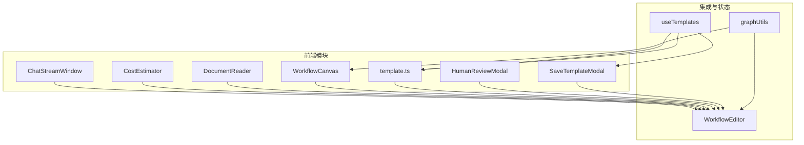
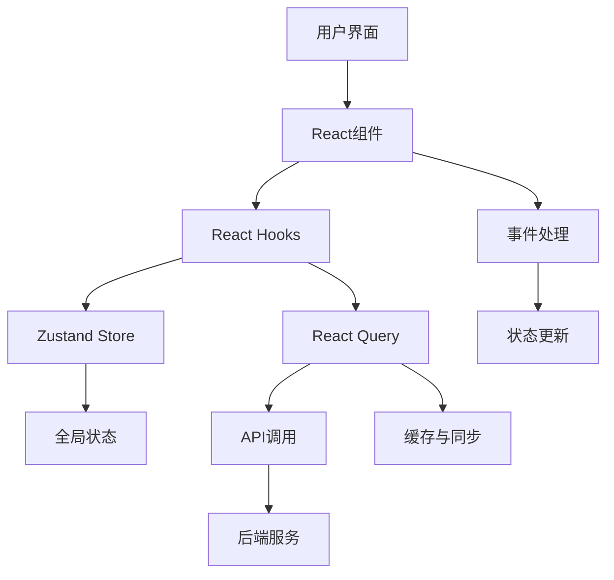
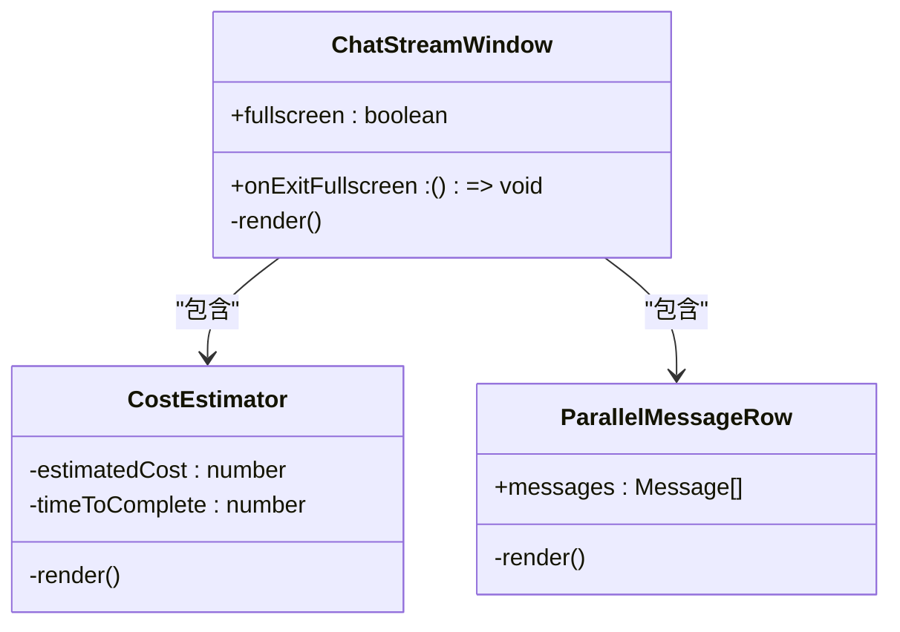
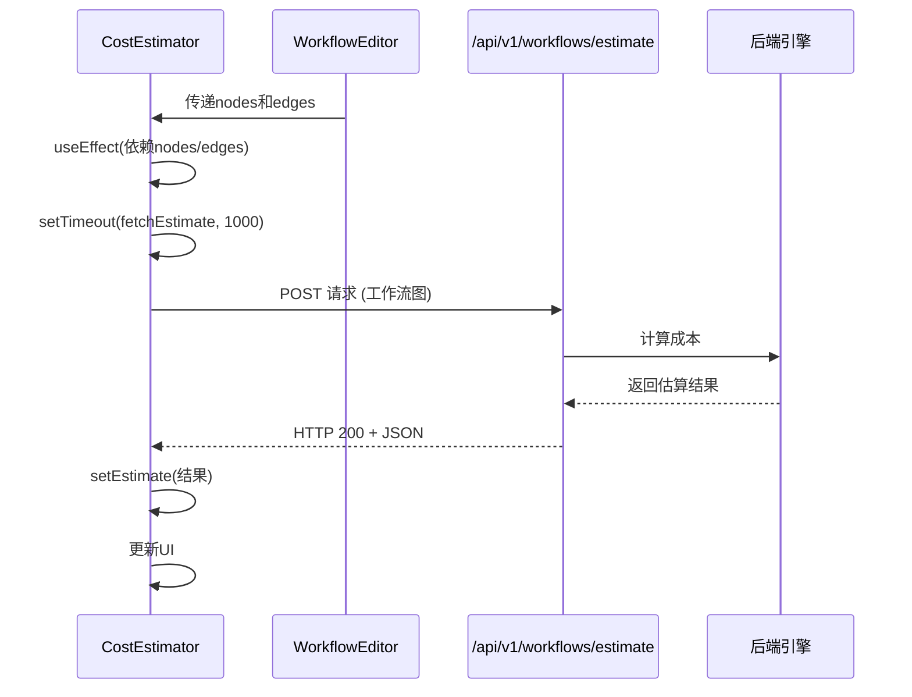
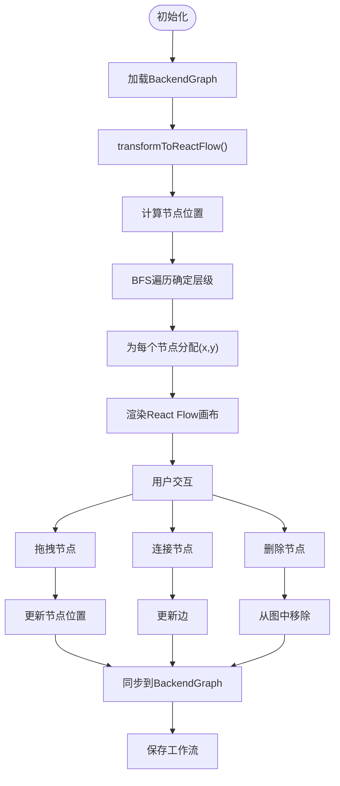
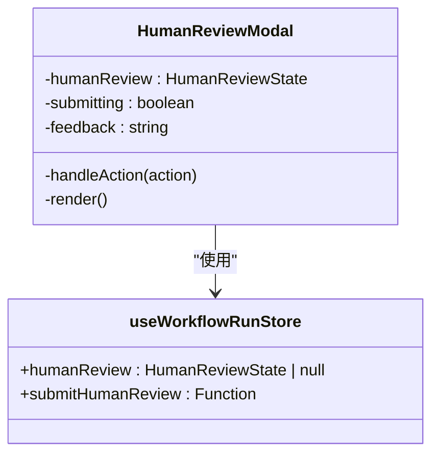
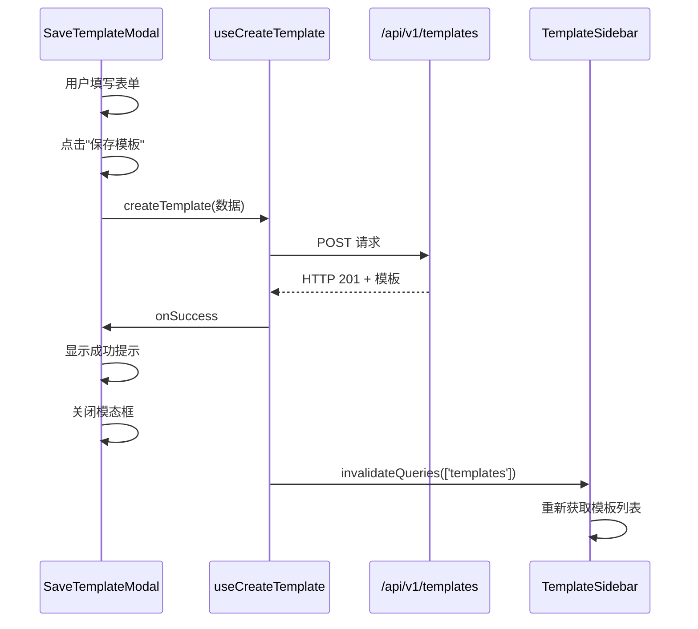

# 功能模块组件

<cite>
**本文档引用的文件**
- [ChatStreamWindow.tsx](file://frontend/src/components/modules/ChatStreamWindow.tsx)
- [CostEstimator.tsx](file://frontend/src/features/execution/components/CostEstimator.tsx)
- [DocumentReader.tsx](file://frontend/src/components/modules/DocumentReader.tsx)
- [WorkflowCanvas.tsx](file://frontend/src/components/modules/WorkflowCanvas.tsx)
- [TemplateSidebar.tsx](file://frontend/src/features/editor/components/TemplateSidebar.tsx)
- [HumanReviewModal.tsx](file://frontend/src/features/execution/components/HumanReviewModal.tsx)
- [SaveTemplateModal.tsx](file://frontend/src/features/editor/components/SaveTemplateModal.tsx)
- [useTemplates.ts](file://frontend/src/hooks/useTemplates.ts)
- [template.ts](file://frontend/src/types/template.ts)
- [graphUtils.ts](file://frontend/src/utils/graphUtils.ts)
- [WorkflowEditor.tsx](file://frontend/src/features/editor/WorkflowEditor.tsx)
</cite>

## 目录
1. [简介](#简介)
2. [项目结构](#项目结构)
3. [核心组件](#核心组件)
4. [架构概述](#架构概述)
5. [详细组件分析](#详细组件分析)
6. [依赖分析](#依赖分析)
7. [性能考虑](#性能考虑)
8. [故障排除指南](#故障排除指南)
9. [结论](#结论)

## 简介
本文档详细解析了“Council”项目中的高内聚复合型UI功能模块组件。重点分析了`ChatStreamWindow`如何整合WebSocket消息流与渲染优化策略，`CostEstimator`的成本计算逻辑与实时更新机制，`DocumentReader`的文档解析与展示能力，`WorkflowCanvas`的画布交互、节点布局与拖拽功能。同时说明了`TemplateSidebar`的模板分类、搜索与加载流程，以及`HumanReviewModal`和`SaveTemplateModal`的表单交互与状态管理。最后提供了模块集成示例，展示其在工作流执行与编辑场景中的协同工作模式。

## 项目结构
项目采用典型的前端分层架构，主要功能模块位于`frontend/src`目录下。核心UI组件被组织在`components/modules`和`features/editor/components`目录中，通过`WorkflowEditor`进行集成。数据流和状态管理由`hooks`和`stores`目录下的自定义Hook和状态存储提供支持。



**Diagram sources**
- [frontend/src/components/modules/ChatStreamWindow.tsx](file://frontend/src/components/modules/ChatStreamWindow.tsx)
- [frontend/src/features/execution/components/CostEstimator.tsx](file://frontend/src/features/execution/components/CostEstimator.tsx)
- [frontend/src/components/modules/DocumentReader.tsx](file://frontend/src/components/modules/DocumentReader.tsx)
- [frontend/src/components/modules/WorkflowCanvas.tsx](file://frontend/src/components/modules/WorkflowCanvas.tsx)
- [frontend/src/features/editor/components/TemplateSidebar.tsx](file://frontend/src/features/editor/components/TemplateSidebar.tsx)
- [frontend/src/features/execution/components/HumanReviewModal.tsx](file://frontend/src/features/execution/components/HumanReviewModal.tsx)
- [frontend/src/features/editor/components/SaveTemplateModal.tsx](file://frontend/src/features/editor/components/SaveTemplateModal.tsx)
- [frontend/src/features/editor/WorkflowEditor.tsx](file://frontend/src/features/editor/WorkflowEditor.tsx)

**Section sources**
- [frontend/src/components/modules/ChatStreamWindow.tsx](file://frontend/src/components/modules/ChatStreamWindow.tsx)
- [frontend/src/features/execution/components/CostEstimator.tsx](file://frontend/src/features/execution/components/CostEstimator.tsx)
- [frontend/src/components/modules/DocumentReader.tsx](file://frontend/src/components/modules/DocumentReader.tsx)
- [frontend/src/components/modules/WorkflowCanvas.tsx](file://frontend/src/components/modules/WorkflowCanvas.tsx)
- [frontend/src/features/editor/components/TemplateSidebar.tsx](file://frontend/src/features/editor/components/TemplateSidebar.tsx)
- [frontend/src/features/execution/components/HumanReviewModal.tsx](file://frontend/src/features/execution/components/HumanReviewModal.tsx)
- [frontend/src/features/editor/components/SaveTemplateModal.tsx](file://frontend/src/features/editor/components/SaveTemplateModal.tsx)

## 核心组件
本文档的核心是分析一系列高内聚的复合型UI模块，这些模块共同构成了一个强大的工作流编辑与执行环境。`ChatStreamWindow`作为信息流的中心，`CostEstimator`提供成本透明度，`DocumentReader`支持知识引用，`WorkflowCanvas`实现可视化编排，而`TemplateSidebar`、`HumanReviewModal`和`SaveTemplateModal`则增强了工作流的可复用性和人机协作能力。

**Section sources**
- [frontend/src/components/modules/ChatStreamWindow.tsx](file://frontend/src/components/modules/ChatStreamWindow.tsx)
- [frontend/src/features/execution/components/CostEstimator.tsx](file://frontend/src/features/execution/components/CostEstimator.tsx)
- [frontend/src/components/modules/DocumentReader.tsx](file://frontend/src/components/modules/DocumentReader.tsx)
- [frontend/src/components/modules/WorkflowCanvas.tsx](file://frontend/src/components/modules/WorkflowCanvas.tsx)
- [frontend/src/features/editor/components/TemplateSidebar.tsx](file://frontend/src/features/editor/components/TemplateSidebar.tsx)
- [frontend/src/features/execution/components/HumanReviewModal.tsx](file://frontend/src/features/execution/components/HumanReviewModal.tsx)
- [frontend/src/features/editor/components/SaveTemplateModal.tsx](file://frontend/src/features/editor/components/SaveTemplateModal.tsx)

## 架构概述
系统采用React函数式组件和Hooks的现代前端架构。UI组件高度解耦，通过Props和回调函数进行通信。状态管理采用Zustand库（`useWorkflowRunStore`），实现了全局状态的集中管理。数据获取通过React Query（`useQuery`, `useMutation`）处理，提供了强大的缓存、同步和错误处理机制。工作流的图形数据在前端（React Flow）和后端（GraphDefinition）之间通过`graphUtils`进行双向转换。



**Diagram sources**
- [frontend/src/stores/useWorkflowRunStore.ts](file://frontend/src/stores/useWorkflowRunStore.ts)
- [frontend/src/hooks/useTemplates.ts](file://frontend/src/hooks/useTemplates.ts)
- [frontend/src/utils/graphUtils.ts](file://frontend/src/utils/graphUtils.ts)

## 详细组件分析
本节将深入分析各个关键功能模块的实现细节、内部逻辑和交互模式。

### ChatStreamWindow 分析
`ChatStreamWindow`组件是会议执行界面的核心，它整合了多个子组件，形成一个统一的交互环境。它负责展示会议消息流、成本估算和用户输入区域。

#### 组件结构与集成


**Diagram sources**
- [frontend/src/components/modules/ChatStreamWindow.tsx](file://frontend/src/components/modules/ChatStreamWindow.tsx)
- [frontend/src/components/modules/CostEstimator.tsx](file://frontend/src/components/modules/CostEstimator.tsx)
- [frontend/src/components/modules/ParallelMessageRow.tsx](file://frontend/src/components/modules/ParallelMessageRow.tsx)

**Section sources**
- [frontend/src/components/modules/ChatStreamWindow.tsx](file://frontend/src/components/modules/ChatStreamWindow.tsx)

### CostEstimator 分析
`CostEstimator`组件负责计算和展示当前工作流的预估成本和执行时间。它通过向后端API发送工作流图来获取实时估算。

#### 成本计算逻辑与实时更新


**Diagram sources**
- [frontend/src/features/execution/components/CostEstimator.tsx](file://frontend/src/features/execution/components/CostEstimator.tsx)
- [frontend/src/features/editor/WorkflowEditor.tsx](file://frontend/src/features/editor/WorkflowEditor.tsx)

**Section sources**
- [frontend/src/features/execution/components/CostEstimator.tsx](file://frontend/src/features/execution/components/CostEstimator.tsx)

### DocumentReader 分析
`DocumentReader`是一个简单的UI组件，用于在会议中展示和引用外部文档。目前它是一个占位符，未来将集成PDF或Markdown渲染器。

**Section sources**
- [frontend/src/components/modules/DocumentReader.tsx](file://frontend/src/components/modules/DocumentReader.tsx)

### WorkflowCanvas 分析
`WorkflowCanvas`是工作流可视化的核心，它基于React Flow库，提供了节点布局、拖拽、连接等交互功能。

#### 画布交互与节点布局


**Diagram sources**
- [frontend/src/components/modules/WorkflowCanvas.tsx](file://frontend/src/components/modules/WorkflowCanvas.tsx)
- [frontend/src/utils/graphUtils.ts](file://frontend/src/utils/graphUtils.ts)

**Section sources**
- [frontend/src/components/modules/WorkflowCanvas.tsx](file://frontend/src/components/modules/WorkflowCanvas.tsx)
- [frontend/src/utils/graphUtils.ts](file://frontend/src/utils/graphUtils.ts)

### TemplateSidebar 分析
`TemplateSidebar`组件提供了一个模板库界面，支持模板的分类、搜索、加载和删除。

#### 模板分类、搜索与加载流程
```mermaid
flowchart TD
A[打开侧边栏] --> B[获取模板列表]
B --> C{useTemplates Hook}
C --> D[从API /api/v1/templates获取]
D --> E[按类型过滤]
E --> F[系统模板]
E --> G[自定义模板]
F --> H[显示系统模板]
G --> I[显示自定义模板]
H --> J[点击模板]
I --> J
J --> K[调用onApply(template)]
K --> L[WorkflowEditor处理]
L --> M[重置graph.id]
M --> N[加载到画布]
```

**Diagram sources**
- [frontend/src/features/editor/components/TemplateSidebar.tsx](file://frontend/src/features/editor/components/TemplateSidebar.tsx)
- [frontend/src/hooks/useTemplates.ts](file://frontend/src/hooks/useTemplates.ts)
- [frontend/src/features/editor/WorkflowEditor.tsx](file://frontend/src/features/editor/WorkflowEditor.tsx)

**Section sources**
- [frontend/src/features/editor/components/TemplateSidebar.tsx](file://frontend/src/features/editor/components/TemplateSidebar.tsx)
- [frontend/src/hooks/useTemplates.ts](file://frontend/src/hooks/useTemplates.ts)

### HumanReviewModal 分析
`HumanReviewModal`是一个模态框，当工作流执行到需要人工审核的节点时弹出，允许用户批准或拒绝继续执行。

#### 表单交互与状态管理


**Diagram sources**
- [frontend/src/features/execution/components/HumanReviewModal.tsx](file://frontend/src/features/execution/components/HumanReviewModal.tsx)
- [frontend/src/stores/useWorkflowRunStore.ts](file://frontend/src/stores/useWorkflowRunStore.ts)

**Section sources**
- [frontend/src/features/execution/components/HumanReviewModal.tsx](file://frontend/src/features/execution/components/HumanReviewModal.tsx)

### SaveTemplateModal 分析
`SaveTemplateModal`允许用户将当前的工作流保存为一个可复用的模板。

#### 表单交互与状态管理


**Diagram sources**
- [frontend/src/features/editor/components/SaveTemplateModal.tsx](file://frontend/src/features/editor/components/SaveTemplateModal.tsx)
- [frontend/src/hooks/useTemplates.ts](file://frontend/src/hooks/useTemplates.ts)

**Section sources**
- [frontend/src/features/editor/components/SaveTemplateModal.tsx](file://frontend/src/features/editor/components/SaveTemplateModal.tsx)

## 依赖分析
各功能模块之间存在清晰的依赖关系。`WorkflowEditor`是核心集成点，它直接或间接依赖所有其他模块。`useTemplates` Hook是`TemplateSidebar`和`SaveTemplateModal`的共同依赖，提供了与模板API通信的统一接口。`graphUtils`是工作流数据转换的基础设施，被`WorkflowCanvas`和`WorkflowEditor`所依赖。

```mermaid
graph TD
WE[WorkflowEditor] --> CSM[ChatStreamWindow]
WE --> CE[CostEstimator]
WE --> DR[DocumentReader]
WE --> WC[WorkflowCanvas]
WE --> TS[TemplateSidebar]
WE --> HRM[HumanReviewModal]
WE --> STM[SaveTemplateModal]
WE --> GU[graphUtils]
TS --> HU[useTemplates]
STM --> HU[useTemplates]
WC --> GU[graphUtils]
HU --> API[/api/v1/templates]
```

**Diagram sources**
- [frontend/src/features/editor/WorkflowEditor.tsx](file://frontend/src/features/editor/WorkflowEditor.tsx)
- [frontend/src/hooks/useTemplates.ts](file://frontend/src/hooks/useTemplates.ts)
- [frontend/src/utils/graphUtils.ts](file://frontend/src/utils/graphUtils.ts)

**Section sources**
- [frontend/src/features/editor/WorkflowEditor.tsx](file://frontend/src/features/editor/WorkflowEditor.tsx)
- [frontend/src/hooks/useTemplates.ts](file://frontend/src/hooks/useTemplates.ts)
- [frontend/src/utils/graphUtils.ts](file://frontend/src/utils/graphUtils.ts)

## 性能考虑
为了优化性能，代码中采用了多种策略。`CostEstimator`使用了防抖（debounce）技术，避免在用户频繁拖拽节点时过度调用后端API。`useQuery`和`useMutation`由React Query提供，内置了数据缓存和去重功能，减少了不必要的网络请求。`transformToReactFlow`函数通过BFS算法高效地计算节点布局，确保了大型工作流的快速渲染。

## 故障排除指南
- **模板未显示**：检查`useTemplates` Hook是否成功从`/api/v1/templates`获取数据，确认后端服务正常运行。
- **成本估算不更新**：确认`WorkflowEditor`中的`rfInstance`已正确初始化，并且`nodes`和`edges`已传递给`CostEstimator`。
- **无法保存模板**：检查`SaveTemplateModal`中的`currentGraph`是否为`null`，确保工作流已正确构建。
- **人工审核模态框不弹出**：检查`useWorkflowRunStore`中的`humanReview`状态是否被正确设置。

**Section sources**
- [frontend/src/hooks/useTemplates.ts](file://frontend/src/hooks/useTemplates.ts)
- [frontend/src/features/execution/components/CostEstimator.tsx](file://frontend/src/features/execution/components/CostEstimator.tsx)
- [frontend/src/features/editor/components/SaveTemplateModal.tsx](file://frontend/src/features/editor/components/SaveTemplateModal.tsx)
- [frontend/src/stores/useWorkflowRunStore.ts](file://frontend/src/stores/useWorkflowRunStore.ts)

## 结论
本文档详细分析了“Council”项目中的核心功能模块组件。这些组件设计精良，职责分明，通过清晰的API和状态管理机制紧密协作，共同构建了一个强大、直观且高效的工作流编排与执行平台。高内聚的模块设计使得系统易于维护和扩展，为未来的功能迭代奠定了坚实的基础。