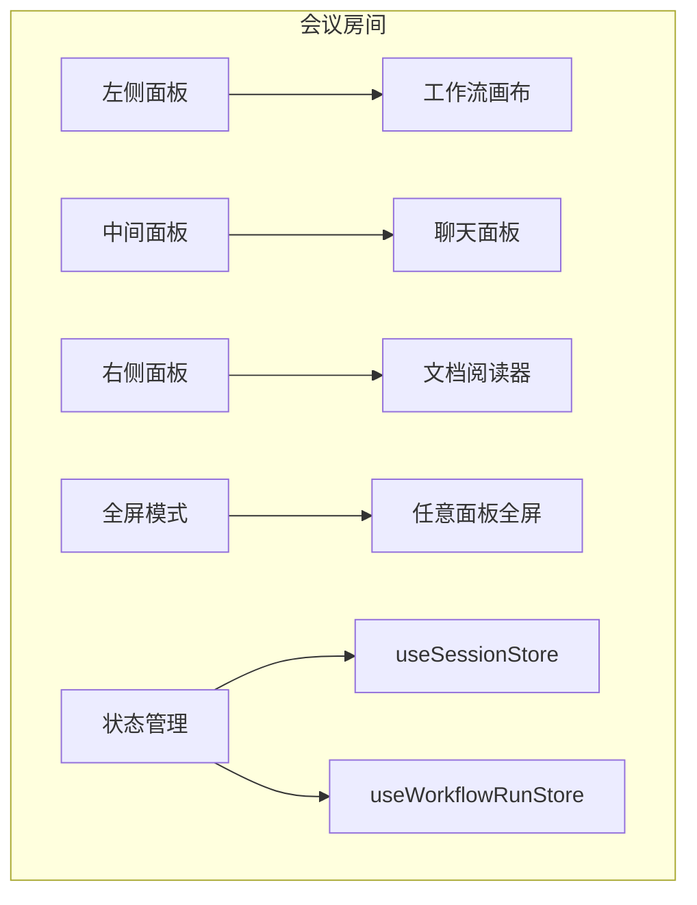
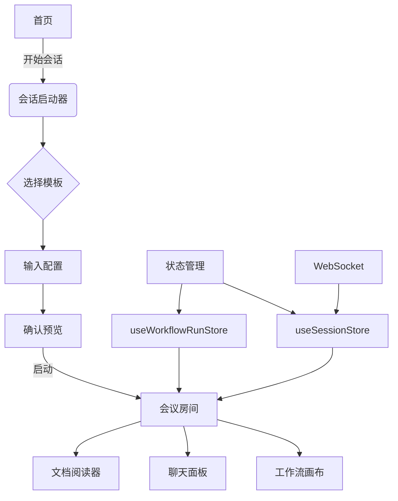

# 功能页面

<cite>
**本文档引用的文件**  
- [HomePage.tsx](file://frontend/src/features/home/HomePage.tsx)
- [GroupsPage.tsx](file://frontend/src/features/groups/pages/GroupsPage.tsx)
- [AgentsPage.tsx](file://frontend/src/features/agents/pages/AgentsPage.tsx)
- [MeetingRoom.tsx](file://frontend/src/features/meeting/MeetingRoom.tsx)
- [SessionStarter.tsx](file://frontend/src/features/meeting/SessionStarter.tsx)
- [ConfirmPreview.tsx](file://frontend/src/features/meeting/ConfirmPreview.tsx)
- [ChatPanel.tsx](file://frontend/src/components/chat/ChatPanel.tsx)
- [WorkflowCanvas.tsx](file://frontend/src/components/workflow/WorkflowCanvas.tsx)
- [useSessionStore.ts](file://frontend/src/stores/useSessionStore.ts)
- [useWorkflowRunStore.ts](file://frontend/src/stores/useWorkflowRunStore.ts)
- [session.ts](file://frontend/src/types/session.ts)
- [workflow-run.ts](file://frontend/src/types/workflow-run.ts)
</cite>

## 目录
1. [首页](#首页)
2. [群组页面](#群组页面)
3. [智能体页面](#智能体页面)
4. [会议房间](#会议房间)
5. [会话启动器](#会话启动器)
6. [确认预览](#确认预览)
7. [页面导航与状态传递](#页面导航与状态传递)

## 首页

首页（HomePage）是应用的入口页面，提供导航布局和快捷入口，引导用户快速进入核心功能。页面采用现代化的视觉设计，包含动态渐变背景和动画效果，提升用户体验。

页面主要由三个部分构成：英雄区域（Hero Section）、功能网格（Feature Grid）和信息统计区域（Stats/Info Section）。英雄区域突出显示产品名称和标语，并提供“开始会话”和“构建器”两个主要操作按钮，分别导航至会议房间和工作流编辑器。

功能网格通过卡片形式展示三个核心功能：智能体群组、工作流引擎和模型中心，每个卡片都配有图标和简短描述，并通过点击可导航至相应页面。信息统计区域展示了系统的实时性能指标，包括延迟、共识协议和可扩展性等。

**页面来源**
- [HomePage.tsx](file://frontend/src/features/home/HomePage.tsx#L1-L141)

## 群组页面

群组页面（GroupsPage）用于管理和组织智能体的协作空间。用户可以通过该页面创建和管理不同的群组，为每个群组分配默认的智能体集合，实现团队化的AI协作。

页面结构简洁，包含一个标题区域和一个群组列表组件（GroupList）。标题区域显示页面名称和简短描述，说明该页面用于管理协作空间和默认智能体分配。群组列表组件负责展示所有已创建的群组，并提供相应的管理操作。

该页面通过`/groups`路由访问，是用户组织和管理智能体团队的核心界面。

**页面来源**
- [GroupsPage.tsx](file://frontend/src/features/groups/pages/GroupsPage.tsx#L1-L21)

## 智能体页面

智能体页面（AgentsPage）是智能体工厂，用于设计和创建专门的AI智能体。用户可以通过该页面配置智能体的属性、提示词和模型设置，打造个性化的AI专家团队。

页面布局包含一个标题区域和智能体列表组件（AgentList）。标题区域使用网络图标和“智能体工厂”标题，强调其作为智能体创建中心的功能。描述文字说明用户可以在此设计和委派专门的AI智能体。

该页面通过`/agents`路由访问，是用户配置和管理AI智能体的核心界面。

**页面来源**
- [AgentsPage.tsx](file://frontend/src/features/agents/pages/AgentsPage.tsx#L1-L21)

## 会议房间

会议房间（MeetingRoom）是应用的核心交互界面，集成了多个关键组件，实现多智能体会议的实时可视化和交互。页面采用三栏布局，通过可调整大小的面板提供灵活的用户体验。

页面主要由以下组件构成：
- **左侧面板**：工作流画布（WorkflowCanvas），以只读模式显示当前执行的工作流图，高亮显示正在运行的节点。
- **中间面板**：聊天面板（ChatPanel），实时显示多智能体讨论的对话流，按节点分组展示消息。
- **右侧面板**：文档阅读器（DocumentReader），用于查看和分析输入文档。

页面支持全屏模式，用户可以将任意一个面板全屏显示，专注于特定任务。同时，页面集成了WebSocket路由和全屏快捷键，确保实时通信和高效操作。

会议房间的状态由`useSessionStore`和`useWorkflowRunStore`两个状态管理store控制，确保UI与后端执行状态保持同步。

**图表来源**
- [MeetingRoom.tsx](file://frontend/src/features/meeting/MeetingRoom.tsx#L1-L233)
- [useSessionStore.ts](file://frontend/src/stores/useSessionStore.ts#L1-L332)
- [useWorkflowRunStore.ts](file://frontend/src/stores/useWorkflowRunStore.ts#L1-L301)

**页面来源**
- [MeetingRoom.tsx](file://frontend/src/features/meeting/MeetingRoom.tsx#L1-L233)

## 会话启动器

会话启动器（SessionStarter）负责会话的初始化流程和参数配置。它是一个覆盖在会议房间上的模态组件，引导用户完成会话启动的三个步骤：选择模板、输入参数和确认配置。

启动流程分为三个步骤：
1. **模板选择**：用户从系统模板列表中选择一个工作流模板。
2. **输入配置**：用户上传需要分析的文档，并定义优化目标。
3. **确认预览**：用户查看配置摘要，确认无误后启动会话。

当用户点击“开始会话”按钮时，会话启动器会执行以下操作：
1. 准备包含工作流图和输入参数的请求负载。
2. 调用后端API `/api/v1/workflows/execute` 启动会话。
3. 初始化状态管理store，设置会话信息和工作流图。
4. 建立WebSocket连接，用于实时通信。
5. 导航至会议房间页面，进入实时交互界面。

该组件通过`useTemplates`、`useSessionStore`等自定义hook与应用的其他部分集成，确保数据的一致性和流程的顺畅。

**页面来源**
- [SessionStarter.tsx](file://frontend/src/features/meeting/SessionStarter.tsx#L1-L271)

## 确认预览

确认预览（ConfirmPreview）组件在会话启动前提供最终的配置确认逻辑。它作为会话启动器的最后一步，向用户展示即将启动的会话的详细信息，防止误操作。

组件显示以下关键信息：
- **会话摘要**：包括所选模板名称和参与的智能体数量。
- **文档预览**：显示上传文档的前150个字符，以及总字符数。
- **优化目标**：显示用户定义的优化目标，或提示“未定义特定目标”。

通过清晰的视觉层次和图标辅助，确认预览组件帮助用户快速验证配置的正确性。底部的进度指示器显示“配置 → 输入 → 启动”的流程，强化用户的操作认知。

该组件接收模板、文档内容和优化目标作为props，完全由会话启动器控制其显示和数据传递。

**页面来源**
- [ConfirmPreview.tsx](file://frontend/src/features/meeting/ConfirmPreview.tsx#L1-L73)

## 页面导航与状态传递

应用的页面导航通过React Router实现，各页面间通过状态管理store和props传递数据，形成完整的功能闭环。

### 导航关系
- **首页 → 会议房间**：通过“开始会话”按钮直接导航。
- **首页 → 工作流编辑器**：通过“构建器”按钮导航。
- **首页 → 群组页面**：通过“智能体群组”卡片导航。
- **首页 → 智能体页面**：通过“模型中心”卡片导航。

### 状态传递机制
应用采用Zustand作为状态管理库，通过多个store实现全局状态的集中管理：
- **useSessionStore**：管理会话核心状态，包括当前会话、消息组和连接状态。
- **useWorkflowRunStore**：管理工作流执行状态，包括节点状态、执行控制和统计信息。

当会话启动时，会话启动器通过`initSession` action初始化`useSessionStore`，并通过`setGraphFromTemplate` action设置工作流图。会议房间组件订阅这些store的状态变化，实时更新UI。

消息流通过WebSocket从后端推送，由状态管理store处理并更新消息组，确保聊天面板的实时性和一致性。

**图表来源**
- [SessionStarter.tsx](file://frontend/src/features/meeting/SessionStarter.tsx#L1-L271)
- [MeetingRoom.tsx](file://frontend/src/features/meeting/MeetingRoom.tsx#L1-L233)
- [useSessionStore.ts](file://frontend/src/stores/useSessionStore.ts#L1-L332)
- [useWorkflowRunStore.ts](file://frontend/src/stores/useWorkflowRunStore.ts#L1-L301)

**页面来源**
- [SessionStarter.tsx](file://frontend/src/features/meeting/SessionStarter.tsx#L1-L271)
- [MeetingRoom.tsx](file://frontend/src/features/meeting/MeetingRoom.tsx#L1-L233)
- [useSessionStore.ts](file://frontend/src/stores/useSessionStore.ts#L1-L332)
- [useWorkflowRunStore.ts](file://frontend/src/stores/useWorkflowRunStore.ts#L1-L301)