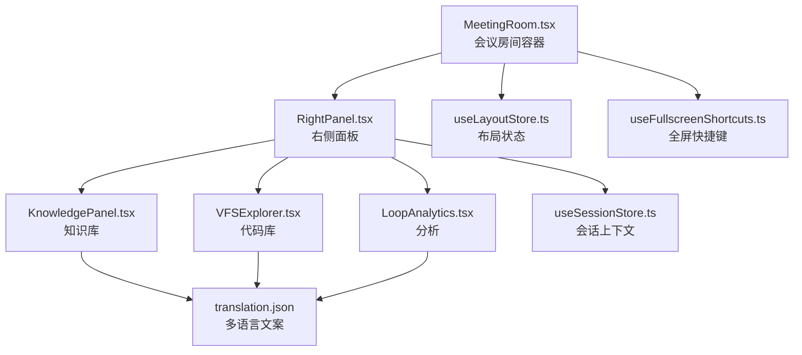
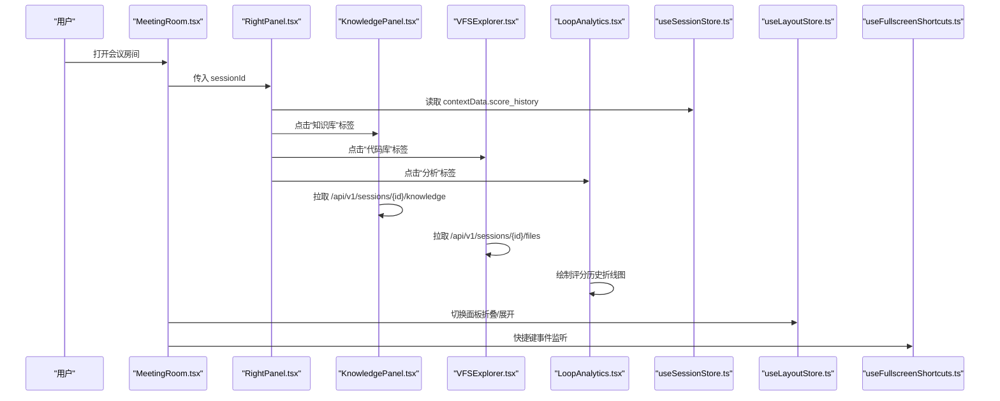
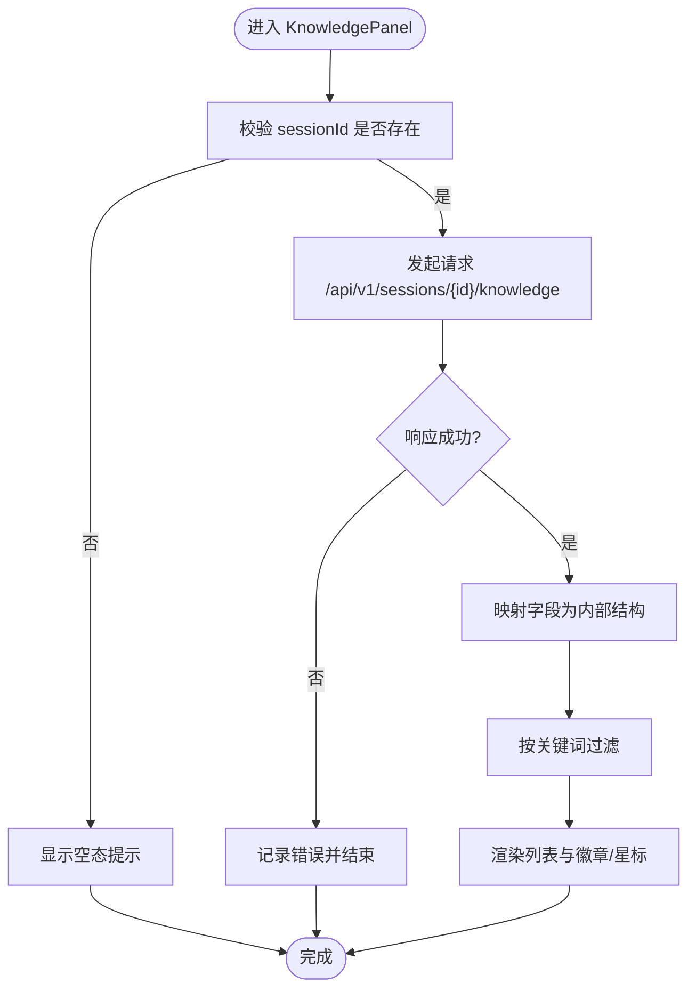
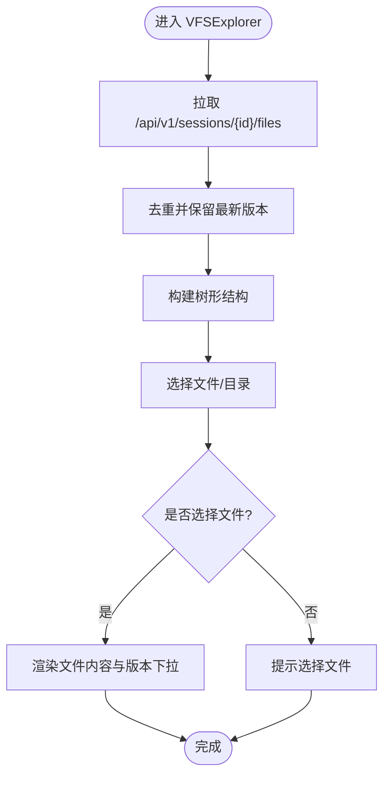
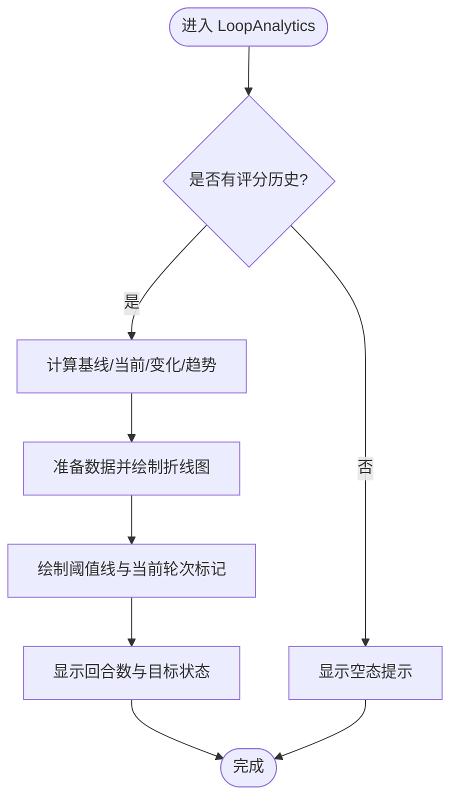
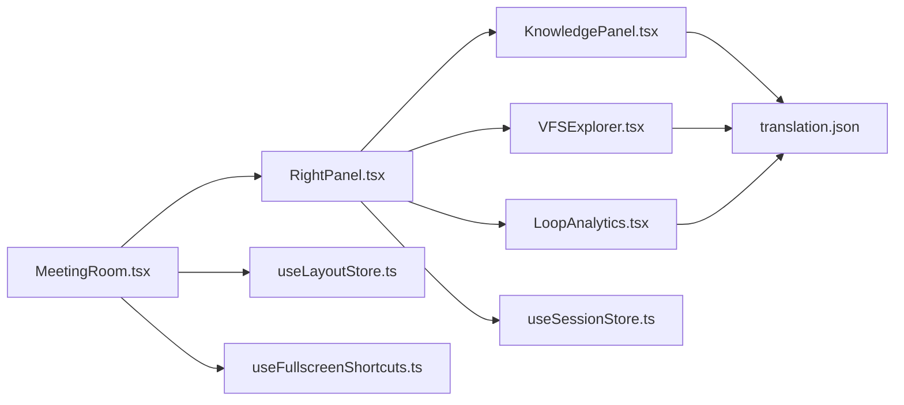

# 右侧面板组件

<cite>
**本文引用的文件**
- [frontend/src/components/panels/RightPanel.tsx](file://frontend/src/components/panels/RightPanel.tsx)
- [frontend/src/features/meeting-room/components/KnowledgePanel.tsx](file://frontend/src/features/meeting-room/components/KnowledgePanel.tsx)
- [frontend/src/components/vfs/VFSExplorer.tsx](file://frontend/src/components/vfs/VFSExplorer.tsx)
- [frontend/src/components/analytics/LoopAnalytics.tsx](file://frontend/src/components/analytics/LoopAnalytics.tsx)
- [frontend/src/features/meeting/MeetingRoom.tsx](file://frontend/src/features/meeting/MeetingRoom.tsx)
- [frontend/src/stores/useSessionStore.ts](file://frontend/src/stores/useSessionStore.ts)
- [frontend/src/stores/useLayoutStore.ts](file://frontend/src/stores/useLayoutStore.ts)
- [frontend/src/hooks/useFullscreenShortcuts.ts](file://frontend/src/hooks/useFullscreenShortcuts.ts)
- [frontend/src/i18n/locales/zh-CN/translation.json](file://frontend/src/i18n/locales/zh-CN/translation.json)
- [frontend/src/i18n/locales/en/translation.json](file://frontend/src/i18n/locales/en/translation.json)
</cite>

## 目录
1. [简介](#简介)
2. [项目结构](#项目结构)
3. [核心组件](#核心组件)
4. [架构总览](#架构总览)
5. [详细组件分析](#详细组件分析)
6. [依赖关系分析](#依赖关系分析)
7. [性能考量](#性能考量)
8. [故障排查指南](#故障排查指南)
9. [结论](#结论)

## 简介
本文件系统性梳理“右侧面板组件”的设计与实现，覆盖其在会议场景中的职责、子面板构成、数据来源、交互流程以及与布局/会话状态管理的集成方式。右侧面板提供三大标签页：
- 知识库：展示与当前会话相关的检索到的知识条目，支持按记忆层过滤与关键词搜索。
- 代码库：以树形结构展示会话相关的文件版本历史，并可查看文件内容与版本切换。
- 分析：基于会话的评分历史绘制折线图，展示优化进度与目标阈值。

该组件通过会话上下文获取评分历史用于分析页，并通过布局存储控制面板折叠/展开与全屏模式。

## 项目结构
右侧面板位于前端组件树的右侧区域，由会议房间页面承载，内部包含三个子面板组件，分别负责不同领域的信息呈现与交互。

图表来源
- [frontend/src/features/meeting/MeetingRoom.tsx](file://frontend/src/features/meeting/MeetingRoom.tsx#L290-L318)
- [frontend/src/components/panels/RightPanel.tsx](file://frontend/src/components/panels/RightPanel.tsx#L1-L86)
- [frontend/src/features/meeting-room/components/KnowledgePanel.tsx](file://frontend/src/features/meeting-room/components/KnowledgePanel.tsx#L1-L183)
- [frontend/src/components/vfs/VFSExplorer.tsx](file://frontend/src/components/vfs/VFSExplorer.tsx#L1-L295)
- [frontend/src/components/analytics/LoopAnalytics.tsx](file://frontend/src/components/analytics/LoopAnalytics.tsx#L1-L162)
- [frontend/src/stores/useLayoutStore.ts](file://frontend/src/stores/useLayoutStore.ts#L1-L43)
- [frontend/src/hooks/useFullscreenShortcuts.ts](file://frontend/src/hooks/useFullscreenShortcuts.ts#L1-L33)
- [frontend/src/stores/useSessionStore.ts](file://frontend/src/stores/useSessionStore.ts#L1-L120)

章节来源
- [frontend/src/features/meeting/MeetingRoom.tsx](file://frontend/src/features/meeting/MeetingRoom.tsx#L290-L318)
- [frontend/src/components/panels/RightPanel.tsx](file://frontend/src/components/panels/RightPanel.tsx#L1-L86)

## 核心组件
- 右侧面板（RightPanel）：作为容器，提供三标签页切换、全屏退出按钮、根据会话上下文渲染分析页。
- 知识库（KnowledgePanel）：拉取并展示与会话相关的知识条目，支持按记忆层过滤与关键词搜索。
- 代码库（VFSExplorer）：将会话文件列表构造成树形结构，支持目录展开/收起、文件选择与版本切换。
- 分析（LoopAnalytics）：消费评分历史，绘制折线图并标注阈值与当前轮次标记。
- 布局状态（useLayoutStore）：维护左右面板折叠状态、面板尺寸与全屏面板标识。
- 全屏快捷键（useFullscreenShortcuts）：提供键盘快捷键退出全屏等交互。
- 会话状态（useSessionStore）：提供当前会话上下文，其中包含评分历史用于分析页。

章节来源
- [frontend/src/components/panels/RightPanel.tsx](file://frontend/src/components/panels/RightPanel.tsx#L1-L86)
- [frontend/src/features/meeting-room/components/KnowledgePanel.tsx](file://frontend/src/features/meeting-room/components/KnowledgePanel.tsx#L1-L183)
- [frontend/src/components/vfs/VFSExplorer.tsx](file://frontend/src/components/vfs/VFSExplorer.tsx#L1-L295)
- [frontend/src/components/analytics/LoopAnalytics.tsx](file://frontend/src/components/analytics/LoopAnalytics.tsx#L1-L162)
- [frontend/src/stores/useLayoutStore.ts](file://frontend/src/stores/useLayoutStore.ts#L1-L43)
- [frontend/src/hooks/useFullscreenShortcuts.ts](file://frontend/src/hooks/useFullscreenShortcuts.ts#L1-L33)
- [frontend/src/stores/useSessionStore.ts](file://frontend/src/stores/useSessionStore.ts#L1-L120)

## 架构总览
右侧面板的调用链路如下：会议房间页面负责渲染右侧面板，右侧面板根据当前激活标签页渲染对应子面板；知识库与代码库通过会话ID向后端接口拉取数据；分析页从会话上下文中读取评分历史；布局状态与快捷键共同决定面板的折叠/展开与全屏行为。

图表来源
- [frontend/src/features/meeting/MeetingRoom.tsx](file://frontend/src/features/meeting/MeetingRoom.tsx#L290-L318)
- [frontend/src/components/panels/RightPanel.tsx](file://frontend/src/components/panels/RightPanel.tsx#L1-L86)
- [frontend/src/features/meeting-room/components/KnowledgePanel.tsx](file://frontend/src/features/meeting-room/components/KnowledgePanel.tsx#L1-L183)
- [frontend/src/components/vfs/VFSExplorer.tsx](file://frontend/src/components/vfs/VFSExplorer.tsx#L1-L295)
- [frontend/src/components/analytics/LoopAnalytics.tsx](file://frontend/src/components/analytics/LoopAnalytics.tsx#L1-L162)
- [frontend/src/stores/useSessionStore.ts](file://frontend/src/stores/useSessionStore.ts#L1-L120)
- [frontend/src/stores/useLayoutStore.ts](file://frontend/src/stores/useLayoutStore.ts#L1-L43)
- [frontend/src/hooks/useFullscreenShortcuts.ts](file://frontend/src/hooks/useFullscreenShortcuts.ts#L1-L33)

## 详细组件分析

### 右侧面板（RightPanel）
- 职责
  - 提供三标签页：知识库、代码库、分析。
  - 在全屏模式下显示“退出全屏”按钮。
  - 从会话上下文中读取评分历史，传递给分析页。
- 关键点
  - 标签页切换通过本地状态管理，UI 基于多语言文案。
  - 分析页接收评分历史与阈值参数，用于图表绘制。
  - 通过 props 接收 sessionId，为子面板的数据请求提供上下文。

章节来源
- [frontend/src/components/panels/RightPanel.tsx](file://frontend/src/components/panels/RightPanel.tsx#L1-L86)
- [frontend/src/i18n/locales/zh-CN/translation.json](file://frontend/src/i18n/locales/zh-CN/translation.json#L168-L189)
- [frontend/src/i18n/locales/en/translation.json](file://frontend/src/i18n/locales/en/translation.json#L168-L189)

### 知识库（KnowledgePanel）
- 数据来源
  - 通过 sessionId 拉取知识列表，支持按记忆层过滤。
- 功能特性
  - 支持关键词搜索（标题/摘要）。
  - 展示记忆层徽章（隔离区/工作记忆/长期记忆）与相关度星标。
  - 加载态与空态提示，统计显示条目数量。
- 错误处理
  - 请求异常时记录日志，避免 UI 崩溃。

图表来源
- [frontend/src/features/meeting-room/components/KnowledgePanel.tsx](file://frontend/src/features/meeting-room/components/KnowledgePanel.tsx#L1-L183)

章节来源
- [frontend/src/features/meeting-room/components/KnowledgePanel.tsx](file://frontend/src/features/meeting-room/components/KnowledgePanel.tsx#L1-L183)

### 代码库（VFSExplorer）
- 数据来源
  - 通过 sessionId 拉取文件列表，去重保留最新版本。
- 结构组织
  - 将扁平文件列表构造成树形结构，支持目录展开/收起。
  - 文件选择后展示内容与版本历史，支持版本切换。
- 性能与体验
  - 使用 useMemo 缓存树构建与选中文件计算。
  - 加载态、错误态与空态提示完善。

图表来源
- [frontend/src/components/vfs/VFSExplorer.tsx](file://frontend/src/components/vfs/VFSExplorer.tsx#L1-L295)

章节来源
- [frontend/src/components/vfs/VFSExplorer.tsx](file://frontend/src/components/vfs/VFSExplorer.tsx#L1-L295)

### 分析（LoopAnalytics）
- 数据来源
  - 从会话上下文读取评分历史数组，用于折线图绘制。
- 功能特性
  - 计算基线、当前值、变化量与趋势。
  - 绘制带阈值线与当前轮次标记的折线图。
  - 显示回合数与目标达成状态。
- 参数
  - threshold：目标阈值，默认 90。
  - currentRound：当前轮次，用于在图上做参考线。

图表来源
- [frontend/src/components/analytics/LoopAnalytics.tsx](file://frontend/src/components/analytics/LoopAnalytics.tsx#L1-L162)
- [frontend/src/stores/useSessionStore.ts](file://frontend/src/stores/useSessionStore.ts#L1-L120)

章节来源
- [frontend/src/components/analytics/LoopAnalytics.tsx](file://frontend/src/components/analytics/LoopAnalytics.tsx#L1-L162)
- [frontend/src/stores/useSessionStore.ts](file://frontend/src/stores/useSessionStore.ts#L1-L120)

### 布局与全屏交互
- 面板折叠/展开
  - 会议房间页面通过 PanelGroup/Panel 控件管理面板尺寸与折叠状态。
  - 右侧面板在折叠时显示“展开触发器”，展开时显示“折叠触发器”。
- 全屏模式
  - 右侧面板在全屏模式下显示“退出全屏”按钮。
  - 布局状态维护 maximizedPanel 字段，快捷键监听 Escape 退出全屏。

章节来源
- [frontend/src/features/meeting/MeetingRoom.tsx](file://frontend/src/features/meeting/MeetingRoom.tsx#L24-L76)
- [frontend/src/features/meeting/MeetingRoom.tsx](file://frontend/src/features/meeting/MeetingRoom.tsx#L290-L318)
- [frontend/src/components/panels/RightPanel.tsx](file://frontend/src/components/panels/RightPanel.tsx#L59-L83)
- [frontend/src/stores/useLayoutStore.ts](file://frontend/src/stores/useLayoutStore.ts#L1-L43)
- [frontend/src/hooks/useFullscreenShortcuts.ts](file://frontend/src/hooks/useFullscreenShortcuts.ts#L1-L33)

## 依赖关系分析
- 组件耦合
  - RightPanel 依赖 KnowledgePanel、VFSExplorer、LoopAnalytics 三个子面板。
  - 子面板之间低耦合，通过 sessionId 与会话上下文进行数据交互。
- 状态依赖
  - RightPanel 依赖 useSessionStore 获取评分历史。
  - MeetingRoom 依赖 useLayoutStore 管理面板折叠/展开与全屏。
  - useFullscreenShortcuts 依赖 useLayoutStore 的最大化状态。
- 国际化
  - 三标签页标题与各子面板文案来自翻译文件，保证多语言一致性。

图表来源
- [frontend/src/components/panels/RightPanel.tsx](file://frontend/src/components/panels/RightPanel.tsx#L1-L86)
- [frontend/src/features/meeting-room/components/KnowledgePanel.tsx](file://frontend/src/features/meeting-room/components/KnowledgePanel.tsx#L1-L183)
- [frontend/src/components/vfs/VFSExplorer.tsx](file://frontend/src/components/vfs/VFSExplorer.tsx#L1-L295)
- [frontend/src/components/analytics/LoopAnalytics.tsx](file://frontend/src/components/analytics/LoopAnalytics.tsx#L1-L162)
- [frontend/src/stores/useSessionStore.ts](file://frontend/src/stores/useSessionStore.ts#L1-L120)
- [frontend/src/features/meeting/MeetingRoom.tsx](file://frontend/src/features/meeting/MeetingRoom.tsx#L290-L318)
- [frontend/src/stores/useLayoutStore.ts](file://frontend/src/stores/useLayoutStore.ts#L1-L43)
- [frontend/src/hooks/useFullscreenShortcuts.ts](file://frontend/src/hooks/useFullscreenShortcuts.ts#L1-L33)
- [frontend/src/i18n/locales/zh-CN/translation.json](file://frontend/src/i18n/locales/zh-CN/translation.json#L168-L189)
- [frontend/src/i18n/locales/en/translation.json](file://frontend/src/i18n/locales/en/translation.json#L168-L189)

## 性能考量
- 渲染优化
  - VFSExplorer 使用 useMemo 缓存树构建与选中文件计算，减少重复渲染。
  - KnowledgePanel 与 LoopAnalytics 在数据为空或历史为空时快速返回空态，避免不必要的图表绘制。
- 网络请求
  - KnowledgePanel 与 VFSExplorer 在 sessionId 变更时触发请求，避免无效请求。
  - 建议对频繁搜索与过滤操作增加防抖策略，降低请求频率。
- 图表渲染
  - LoopAnalytics 使用响应式容器，建议在数据量较大时考虑采样或分页策略，避免图表卡顿。

[本节为通用性能建议，不直接分析具体文件，故无章节来源]

## 故障排查指南
- 知识库无数据
  - 检查 sessionId 是否有效，确认后端接口返回正常。
  - 查看控制台错误日志，定位请求失败原因。
- 代码库无数据
  - 确认会话是否已产生文件变更，或 Surgeon 是否已修改文件。
  - 检查文件列表接口返回格式与字段映射。
- 分析页无图表
  - 确认会话上下文中是否存在评分历史，若为空则显示空态提示属预期。
- 面板无法折叠/展开
  - 检查 MeetingRoom 中 PanelGroup/Panel 的回调是否正确触发 toggleRightPanel。
  - 确认 useLayoutStore 的 rightCollapsed 状态是否被正确更新。
- 全屏无法退出
  - 检查 useFullscreenShortcuts 的键盘事件绑定是否生效，确保未在输入框内触发。

章节来源
- [frontend/src/features/meeting-room/components/KnowledgePanel.tsx](file://frontend/src/features/meeting-room/components/KnowledgePanel.tsx#L1-L183)
- [frontend/src/components/vfs/VFSExplorer.tsx](file://frontend/src/components/vfs/VFSExplorer.tsx#L1-L295)
- [frontend/src/components/analytics/LoopAnalytics.tsx](file://frontend/src/components/analytics/LoopAnalytics.tsx#L1-L162)
- [frontend/src/features/meeting/MeetingRoom.tsx](file://frontend/src/features/meeting/MeetingRoom.tsx#L290-L318)
- [frontend/src/stores/useLayoutStore.ts](file://frontend/src/stores/useLayoutStore.ts#L1-L43)
- [frontend/src/hooks/useFullscreenShortcuts.ts](file://frontend/src/hooks/useFullscreenShortcuts.ts#L1-L33)

## 结论
右侧面板组件通过清晰的标签页划分与稳定的子面板职责，为会议场景提供了知识检索、代码浏览与执行分析的统一入口。其与会话状态、布局状态及快捷键的集成，使得用户能够在不同视图间高效切换，并在全屏模式下专注关键信息。后续可在搜索过滤、图表采样与请求防抖等方面进一步优化用户体验。