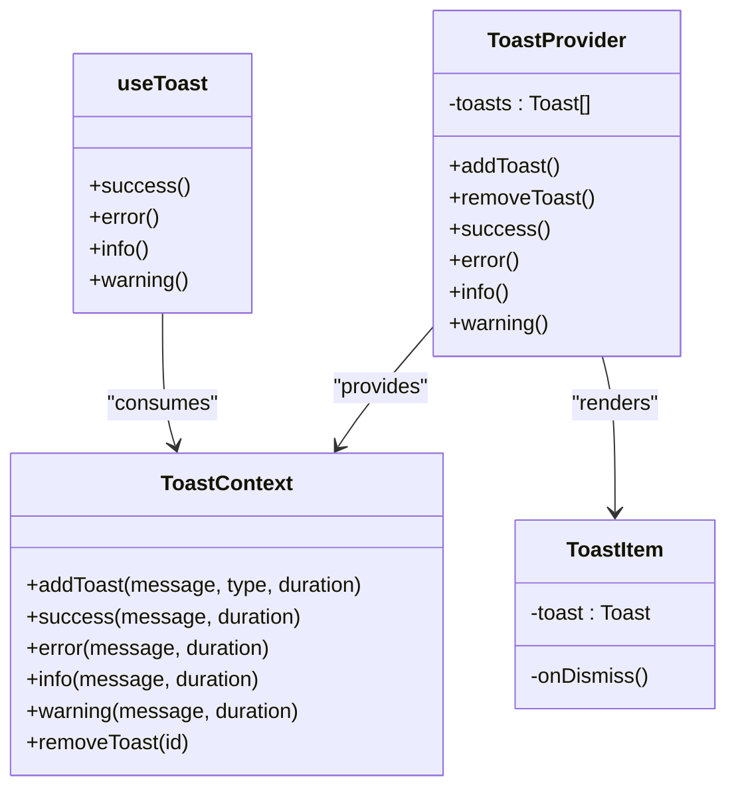
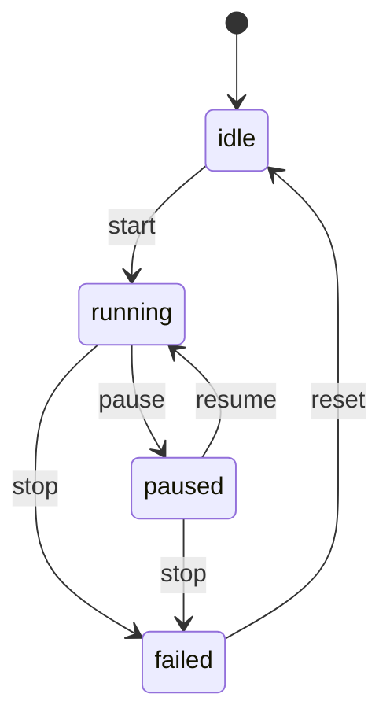

# 基础UI组件

<cite>
**本文档引用的文件**  
- [AgentAvatar.tsx](file://frontend/src/components/common/AgentAvatar.tsx)
- [FileUploadZone.tsx](file://frontend/src/components/common/FileUploadZone.tsx)
- [ProgressBar.tsx](file://frontend/src/components/common/ProgressBar.tsx)
- [StatusDot.tsx](file://frontend/src/components/ui/StatusDot.tsx)
- [Toast.tsx](file://frontend/src/components/ui/Toast.tsx)
- [ToastContext.ts](file://frontend/src/components/ui/ToastContext.ts)
- [useToast.ts](file://frontend/src/components/ui/useToast.ts)
- [ExecutionControlBar.tsx](file://frontend/src/components/meeting/ExecutionControlBar.tsx)
- [ExitFullscreenButton.tsx](file://frontend/src/components/ui/ExitFullscreenButton.tsx)
- [useWorkflowRunStore.ts](file://frontend/src/stores/useWorkflowRunStore.ts)
- [useFullscreenShortcuts.ts](file://frontend/src/hooks/useFullscreenShortcuts.ts)
- [MeetingRoom.tsx](file://frontend/src/features/meeting/MeetingRoom.tsx)
- [ChatPanel.tsx](file://frontend/src/components/chat/ChatPanel.tsx)
- [App.tsx](file://frontend/src/App.tsx)
</cite>

## 目录
1. [简介](#简介)
2. [核心原子组件](#核心原子组件)
3. [Toast全局通知机制](#toast全局通知机制)
4. [ExecutionControlBar会议控制条](#executioncontrolbar会议控制条)
5. [全屏退出按钮](#全屏退出按钮)
6. [集成示例与使用场景](#集成示例与使用场景)
7. [结论](#结论)

## 简介
本项目包含一系列可复用的原子级UI组件，用于构建一致且交互统一的用户界面。这些组件涵盖从基础视觉元素（如AgentAvatar、StatusDot）到功能复合组件（如FileUploadZone、ExecutionControlBar）的完整体系。所有组件均采用TypeScript编写，支持响应式设计，并通过Tailwind CSS实现样式定制。特别地，Toast组件通过上下文（Context）机制实现了全局通知功能，为用户提供及时的操作反馈。

## 核心原子组件

### AgentAvatar 组件
AgentAvatar组件用于显示智能体的头像，根据名称生成确定性的背景颜色，并展示首字母作为内容。该组件支持三种尺寸：小（sm）、中（md）和大（lg），默认为中等尺寸。

**属性接口**
- `name` (string, 必需): 智能体名称，用于生成颜色和显示首字母
- `size` ("sm" | "md" | "lg", 可选): 头像尺寸，默认为"md"

**样式定制**
通过预定义的颜色数组（15种）和尺寸映射对象实现视觉一致性。颜色基于名称字符串的哈希值确定，确保相同名称始终显示相同颜色。

**响应式行为**
组件使用Tailwind的`shrink-0`防止在Flex容器中被压缩，并通过`title`属性提供悬停提示。

**Section sources**
- [AgentAvatar.tsx](file://frontend/src/components/common/AgentAvatar.tsx#L1-L48)

### FileUploadZone 文件上传区
FileUploadZone是一个多功能文件输入区域，支持拖拽上传、点击选择和内容粘贴三种方式。用户可以上传指定类型的文本文件或直接粘贴内容进行编辑。

**属性接口**
- `onContentChange` (function, 必需): 内容变更时的回调函数
- `accept` (string[], 可选): 允许的文件扩展名数组，默认为['.md', '.txt']
- `maxSizeMB` (number, 可选): 文件最大大小（MB），默认为5
- `initialContent` (string, 可选): 初始内容，默认为空字符串

**事件回调**
- `handleFile`: 处理文件读取，验证类型和大小后触发`onContentChange`
- `handleDrop`: 处理拖拽释放事件
- `handlePaste`: 处理粘贴事件
- `clearFile`: 清除当前文件和内容

**响应式行为**
支持拖拽高亮（`isDragging`状态）和错误提示。上传区域在拖拽时显示蓝色高亮，支持点击触发文件选择器。

**Section sources**
- [FileUploadZone.tsx](file://frontend/src/components/common/FileUploadZone.tsx#L1-L151)

### ProgressBar 进度条
ProgressBar组件用于可视化展示任务完成进度，支持自定义标签、颜色和百分比显示。

**属性接口**
- `current` (number, 必需): 当前进度值
- `total` (number, 必需): 总进度值
- `label` (string, 可选): 进度条标签
- `color` (string, 可选): 进度条颜色类名，默认为'bg-blue-600'

**样式定制**
使用Tailwind的渐变动画（`transition-all duration-500 ease-out`）实现平滑的进度变化效果。支持任意Tailwind颜色类名。

**响应式行为**
自动计算完成百分比并限制在0-100%范围内，防止溢出。

**Section sources**
- [ProgressBar.tsx](file://frontend/src/components/common/ProgressBar.tsx#L1-L35)

### StatusDot 状态指示点
StatusDot组件用于可视化展示执行或节点状态，通过不同颜色表示各种状态。

**属性接口**
- `status` (string, 必需): 状态值，支持'running'、'completed'、'failed'、'paused'、'suspended'、'pending'

**状态映射**
- `running`: 蓝色，带脉冲动画
- `completed`: 绿色
- `failed`: 红色
- `paused`: 黄色
- `suspended`: 紫色，带脉冲动画
- `pending`: 浅灰色

**响应式行为**
组件尺寸固定为10x10像素（w-2.5 h-2.5），适用于紧凑布局。

**Section sources**
- [StatusDot.tsx](file://frontend/src/components/ui/StatusDot.tsx#L1-L22)

## Toast全局通知机制

### 架构设计
Toast组件通过React Context实现全局通知机制，允许应用任何位置触发通知，而无需通过props层层传递。



**Diagram sources**
- [Toast.tsx](file://frontend/src/components/ui/Toast.tsx#L1-L84)
- [ToastContext.ts](file://frontend/src/components/ui/ToastContext.ts#L1-L22)
- [useToast.ts](file://frontend/src/components/ui/useToast.ts#L1-L11)

### 核心组件

#### ToastContext
定义了全局通知的类型系统和接口契约。

**类型定义**
- `ToastType`: 'success' | 'error' | 'info' | 'warning'
- `Toast`: 包含id、message、type和duration的接口
- `ToastContextValue`: 上下文值接口，包含各类通知方法

#### ToastProvider
提供者组件，管理通知状态并暴露API。

**状态管理**
- `toasts`: 通知数组，每个通知有唯一ID
- 自动移除机制：根据duration参数设置定时器自动移除

**API方法**
- `addToast`: 通用添加方法
- `success/error/info/warning`: 类型化快捷方法

#### useToast Hook
自定义Hook，为组件提供便捷的Toast调用方式。

**使用约束**
必须在ToastProvider内部使用，否则抛出错误。

**Section sources**
- [Toast.tsx](file://frontend/src/components/ui/Toast.tsx#L1-L84)
- [ToastContext.ts](file://frontend/src/components/ui/ToastContext.ts#L1-L22)
- [useToast.ts](file://frontend/src/components/ui/useToast.ts#L1-L11)

## ExecutionControlBar会议控制条

### 控制逻辑
ExecutionControlBar组件用于控制会议流程的执行状态，包括暂停、继续和停止操作。



**Diagram sources**
- [ExecutionControlBar.tsx](file://frontend/src/components/meeting/ExecutionControlBar.tsx#L1-L72)
- [useWorkflowRunStore.ts](file://frontend/src/stores/useWorkflowRunStore.ts#L1-L301)

### 状态联动
组件通过Zustand状态管理库与全局执行状态同步。

**状态映射**
- 从`useWorkflowRunStore`订阅`executionStatus`和`stats`
- 使用`getControlState`工具函数计算控制按钮的可用性

**控制状态逻辑**
- `canPause`: 仅在"running"状态时可用
- `canResume`: 仅在"paused"状态时可用
- `canStop`: 在"running"或"paused"状态时可用

**事件处理**
- `sendControl`: 发送控制命令到后端API，更新执行状态

**统计信息**
显示经过时间、完成节点数/总节点数和总成本（美元）。

**Section sources**
- [ExecutionControlBar.tsx](file://frontend/src/components/meeting/ExecutionControlBar.tsx#L1-L72)
- [useWorkflowRunStore.ts](file://frontend/src/stores/useWorkflowRunStore.ts#L1-L301)

## 全屏退出按钮

### ExitFullscreenButton 组件
ExitFullscreenButton组件用于退出全屏模式，提供一致的用户体验。

**属性接口**
- `onClick` (function, 可选): 点击回调，如果未提供则不渲染
- `className` (string, 可选): 额外的CSS类名

**样式定制**
使用clsx库合并多个Tailwind类名，支持主题适配（亮色/暗色模式）。

**响应式行为**
组件在`onClick`未提供时返回null，避免渲染无效按钮。

**Section sources**
- [ExitFullscreenButton.tsx](file://frontend/src/components/ui/ExitFullscreenButton.tsx#L1-L31)

## 集成示例与使用场景

### 全屏模式集成
全屏功能通过`useFullscreenShortcuts` Hook和`ExitFullscreenButton`组件实现。

```mermaid
flowchart TD
A[MeetingRoom] --> B[useFullscreenShortcuts]
A --> C[PanelMaximizeButton]
C --> D{maximizedPanel}
D --> |left| E[WorkflowCanvas 全屏]
D --> |center| F[ChatPanel 全屏]
D --> |right| G[DocumentReader 全屏]
E --> H[ExitFullscreenButton]
F --> H
G --> H
H --> I[maximizePanel(null)]
```

**Diagram sources**
- [MeetingRoom.tsx](file://frontend/src/features/meeting/MeetingRoom.tsx#L1-L233)
- [useFullscreenShortcuts.ts](file://frontend/src/hooks/useFullscreenShortcuts.ts#L1-L57)
- [ExitFullscreenButton.tsx](file://frontend/src/components/ui/ExitFullscreenButton.tsx#L1-L31)

### 典型使用场景

#### 会议房间集成
在`MeetingRoom`组件中，通过`maximizedPanel`状态管理全屏模式：

```tsx
// MeetingRoom.tsx
if (maximizedPanel) {
    const onExit = () => maximizePanel(null);
    const panelMap = {
        left: <WorkflowCanvas fullscreen onExitFullscreen={onExit} />,
        center: <ChatPanel fullscreen onExitFullscreen={onExit} />,
        right: <DocumentReader fullscreen onExitFullscreen={onExit} />,
    };
    return <div className="h-screen w-screen fixed top-0 left-0">{panelMap[maximizedPanel]}</div>;
}
```

#### 聊天面板集成
在`ChatPanel`中，根据`fullscreen`属性条件渲染退出按钮：

```tsx
// ChatPanel.tsx
<SessionHeader
    onExitFullscreen={fullscreen ? onExitFullscreen : undefined}
/>
```

#### 全局通知使用
在应用根组件中包裹`ToastProvider`，使所有子组件可访问Toast功能：

```tsx
// App.tsx
function App() {
    return (
        <ToastProvider>
            <div className="h-screen w-screen">
                {/* 应用内容 */}
            </div>
        </ToastProvider>
    );
}
```

**Section sources**
- [MeetingRoom.tsx](file://frontend/src/features/meeting/MeetingRoom.tsx#L1-L233)
- [ChatPanel.tsx](file://frontend/src/components/chat/ChatPanel.tsx#L1-L77)
- [App.tsx](file://frontend/src/App.tsx#L1-L85)

## 结论
本项目的基础UI组件体系设计合理，实现了高度的可复用性和一致性。通过原子化设计原则，每个组件职责单一且可独立使用。Toast组件的全局通知机制通过Context和自定义Hook实现了优雅的状态管理。ExecutionControlBar展示了如何将UI组件与状态管理库（Zustand）有效结合，实现复杂的控制逻辑。所有组件均考虑了响应式行为和用户体验细节，为构建高质量的前端界面提供了坚实基础。