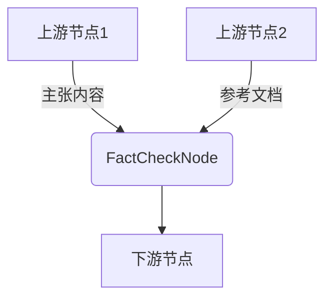
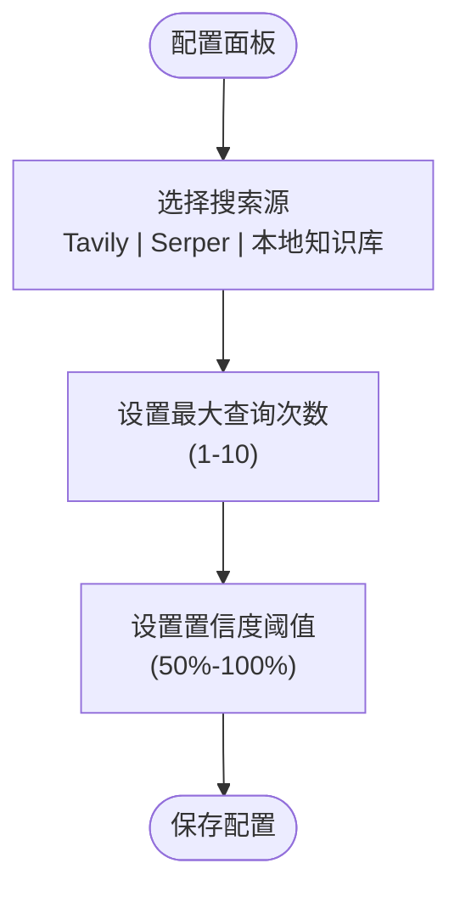
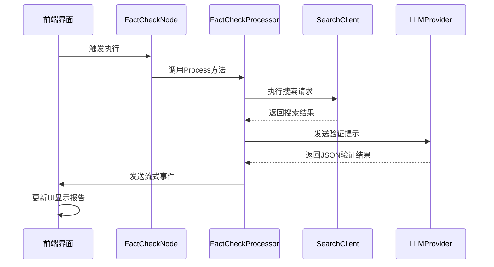

# 事实核查节点

<cite>
**本文档引用的文件**   
- [fact_check.go](file://internal/core/workflow/nodes/fact_check.go#L1-L113)
- [FactCheckNodeForm.tsx](file://frontend/src/features/editor/components/PropertyPanel/NodeForms/FactCheckNodeForm.tsx#L1-L87)
- [workflow.ts](file://frontend/src/types/workflow.ts#L1-L45)
- [CustomNodes.tsx](file://frontend/src/components/workflow/nodes/CustomNodes.tsx#L77-L94)
- [BaseNode.tsx](file://frontend/src/components/workflow/nodes/BaseNode.tsx#L1-L47)
- [WorkflowCanvas.tsx](file://frontend/src/components/workflow/WorkflowCanvas.tsx#L1-L149)
- [SPEC-404-factcheck-processor.md](file://docs/specs/backend/SPEC-404-factcheck-processor.md#L1-L99)
- [SPEC-203-factcheck-humanreview-nodes.md](file://docs/specs/sprint3/SPEC-203-factcheck-humanreview-nodes.md#L1-L65)
- [SPEC-410-anti-hallucination.md](file://docs/specs/backend/SPEC-410-anti-hallucination.md#L1-L157)
- [12_fact_check.md](file://docs/tdd/02_core/12_fact_check.md#L1-L84)
</cite>

## 目录
1. [引言](#引言)
2. [双源输入设计与画布布局](#双源输入设计与画布布局)
3. [配置项与表单实现](#配置项与表单实现)
4. [执行流程与核查报告展示](#执行流程与核查报告展示)
5. [结论](#结论)

## 引言
事实核查节点（FactCheckNode）是本系统中用于验证主张内容准确性的核心组件。该节点通过集成多源信息检索与大语言模型分析，实现对输入内容的自动化事实核查。本文档详细描述其双源输入设计、画布中的连接点布局、配置项实现以及核查报告的结构化输出展示机制。

## 双源输入设计与画布布局

事实核查节点采用双源输入设计，能够接收来自上游节点的主张内容与参考文档作为并行输入。在工作流画布中，该节点通过顶部的目标句柄（target handle）接收来自多个上游节点的输入连接，体现了其聚合多源信息的能力。

节点的布局基于React Flow库实现，通过`WorkflowCanvas`组件渲染。每个节点实例由`BaseNode`基类构建，并通过`CustomNodes`中的`FactCheckNode`组件进行定制化渲染。`FactCheckNode`继承了`BaseNode`的结构，包含顶部和底部的连接句柄，分别用于接收输入和传递输出。

**图示来源**
- [CustomNodes.tsx](file://frontend/src/components/workflow/nodes/CustomNodes.tsx#L77-L94)
- [BaseNode.tsx](file://frontend/src/components/workflow/nodes/BaseNode.tsx#L1-L47)
- [WorkflowCanvas.tsx](file://frontend/src/components/workflow/WorkflowCanvas.tsx#L1-L149)

**本节来源**
- [CustomNodes.tsx](file://frontend/src/components/workflow/nodes/CustomNodes.tsx#L77-L94)
- [BaseNode.tsx](file://frontend/src/components/workflow/nodes/BaseNode.tsx#L1-L47)
- [WorkflowCanvas.tsx](file://frontend/src/components/workflow/WorkflowCanvas.tsx#L1-L149)

## 配置项与表单实现

事实核查节点的配置项通过`FactCheckNodeForm`组件实现，允许用户在属性面板中调整其行为。主要配置项包括核查维度、证据检索策略等。

### 核查维度
- **准确性**：通过置信度阈值（`verify_threshold`）控制，用户可通过滑块设置（50%-100%），默认值为0.7。
- **一致性**：系统通过LLM分析主张内容与搜索结果之间的一致性。
- **来源可信度**：评估引用来源的权威性和可靠性。

### 证据检索策略
用户可通过复选框选择多种证据检索源：
- **Tavily (Web)**：使用Tavily API进行网络搜索。
- **Serper (Web)**：使用Serper API进行网络搜索。
- **本地知识库 (Local Knowledge Base)**：从本地存储的知识库中检索信息。

此外，用户还可配置最大查询次数（`max_queries`），范围为1-10次，用于限制搜索的广度。

**图示来源**
- [FactCheckNodeForm.tsx](file://frontend/src/features/editor/components/PropertyPanel/NodeForms/FactCheckNodeForm.tsx#L1-L87)
- [workflow.ts](file://frontend/src/types/workflow.ts#L1-L45)

**本节来源**
- [FactCheckNodeForm.tsx](file://frontend/src/features/editor/components/PropertyPanel/NodeForms/FactCheckNodeForm.tsx#L1-L87)
- [workflow.ts](file://frontend/src/types/workflow.ts#L1-L45)
- [SPEC-203-factcheck-humanreview-nodes.md](file://docs/specs/sprint3/SPEC-203-factcheck-humanreview-nodes.md#L1-L65)

## 执行流程与核查报告展示

当事实核查节点执行时，其后端处理器`FactCheckProcessor`会按照以下流程处理输入：

1. **输入聚合**：从所有输入中收集待核查的文本内容。
2. **证据检索**：根据配置的搜索源，调用相应的搜索客户端（如Tavily）进行网络或本地搜索。
3. **LLM验证**：将主张内容与搜索结果一并提交给大语言模型，要求其判断内容的准确性，并输出JSON格式的验证结果。
4. **结果生成**：根据LLM的响应，生成包含可信度评分、争议点标记和引用溯源的结构化报告。

前端通过WebSocket接收流式事件（`StreamEvent`），实时更新节点状态。核查报告的结构化输出通过以下方式展示：

- **可信度评分**：以数值形式显示在节点内部或报告摘要中。
- **争议点标记**：在输出内容中高亮显示被质疑的声明。
- **引用溯源高亮**：对引用的来源进行标注，并提供链接或摘要信息。

**图示来源**
- [fact_check.go](file://internal/core/workflow/nodes/fact_check.go#L1-L113)
- [SPEC-404-factcheck-processor.md](file://docs/specs/backend/SPEC-404-factcheck-processor.md#L1-L99)
- [SPEC-410-anti-hallucination.md](file://docs/specs/backend/SPEC-410-anti-hallucination.md#L1-L157)

**本节来源**
- [fact_check.go](file://internal/core/workflow/nodes/fact_check.go#L1-L113)
- [SPEC-404-factcheck-processor.md](file://docs/specs/backend/SPEC-404-factcheck-processor.md#L1-L99)
- [SPEC-410-anti-hallucination.md](file://docs/specs/backend/SPEC-410-anti-hallucination.md#L1-L157)
- [12_fact_check.md](file://docs/tdd/02_core/12_fact_check.md#L1-L84)

## 结论
事实核查节点通过其双源输入设计和灵活的配置选项，实现了对主张内容的全面验证。其在画布中的并列输入连接点布局支持多源信息融合，而前端组件则有效地展示了结构化的核查报告，包括可信度评分、争议点标记和引用溯源高亮，为用户提供了一个强大且直观的事实核查工具。