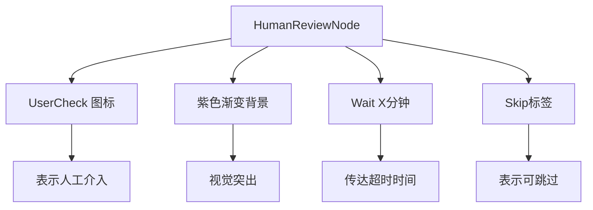
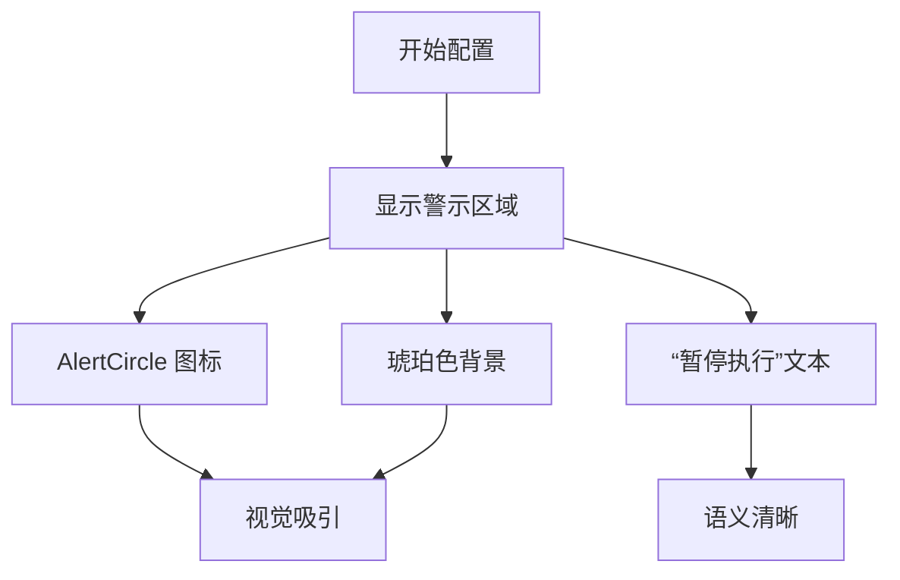
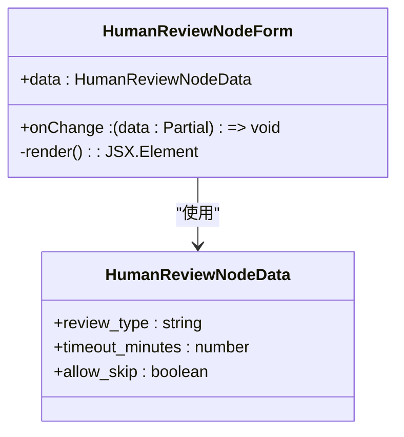
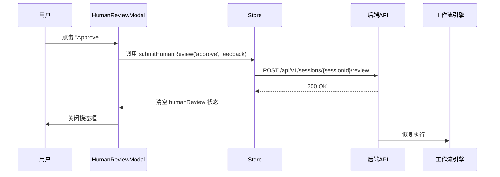
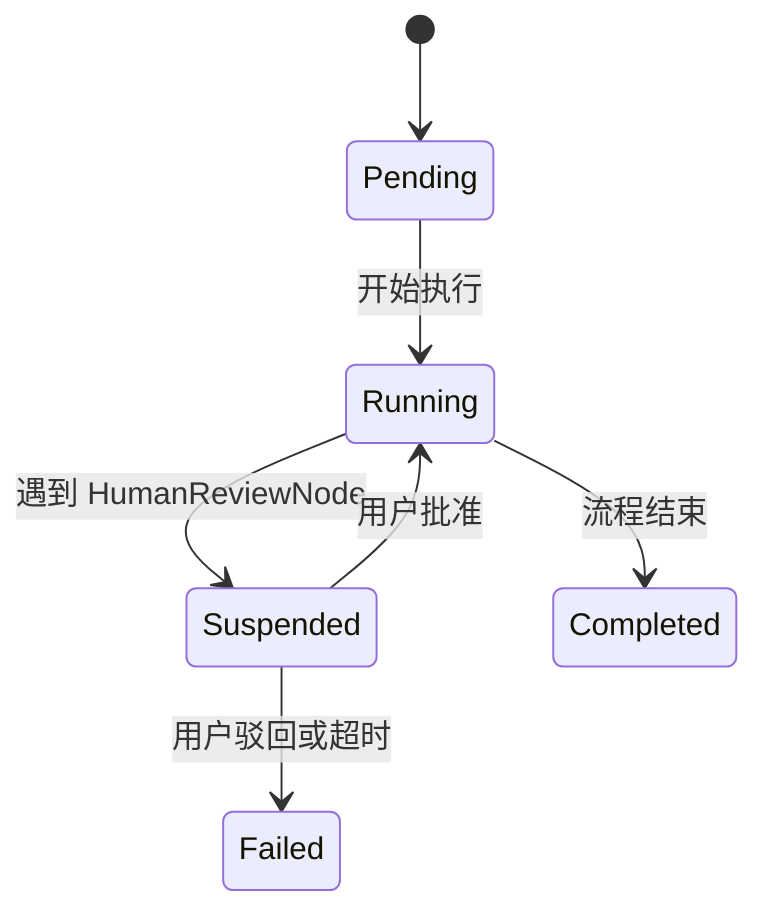

# 人工审核节点

<cite>
**本文档引用文件**  
- [human_review.go](file://internal/core/workflow/nodes/human_review.go)
- [HumanReviewNodeForm.tsx](file://frontend/src/features/editor/components/PropertyPanel/NodeForms/HumanReviewNodeForm.tsx)
- [HumanReviewModal.tsx](file://frontend/src/features/execution/components/HumanReviewModal.tsx)
- [workflow.ts](file://frontend/src/types/workflow.ts)
- [engine.go](file://internal/core/workflow/engine.go)
- [useWorkflowRunStore.ts](file://frontend/src/stores/useWorkflowRunStore.ts)
- [CustomNodes.tsx](file://frontend/src/components/workflow/nodes/CustomNodes.tsx)
- [SPEC-405-human-review-processor.md](file://docs/specs/backend/SPEC-405-human-review-processor.md)
- [human_review.md](file://docs/api/human_review.md)
- [SPEC-203-factcheck-humanreview-nodes.md](file://docs/specs/sprint3/SPEC-203-factcheck-humanreview-nodes.md)
- [nodeStyles.ts](file://frontend/src/utils/nodeStyles.ts)
</cite>

## 目录
1. [人工审核节点概述](#人工审核节点概述)
2. [阻塞式交互设计与视觉语义](#阻塞式交互设计与视觉语义)
3. [审核配置与表单实现](#审核配置与表单实现)
4. [模态框交互流程](#模态框交互流程)
5. [执行流控制机制](#执行流控制机制)
6. [状态管理与事件流](#状态管理与事件流)

## 人工审核节点概述

人工审核节点（HumanReviewNode）是工作流中的关键控制点，用于在自动化流程中引入人工干预。该节点通过阻塞执行流，强制暂停工作流，等待用户确认、修改或拒绝操作，确保关键决策的可控性与安全性。其设计结合了醒目的视觉提示、灵活的配置选项和清晰的交互流程，实现了人机协同的闭环机制。

**本节来源**
- [SPEC-405-human-review-processor.md](file://docs/specs/backend/SPEC-405-human-review-processor.md#L1-L77)
- [human_review.md](file://docs/api/human_review.md#L1-L406)

## 阻塞式交互设计与视觉语义

人工审核节点采用强制中断执行流的设计，其核心在于通过视觉语义明确传达“阻塞”状态，确保用户无法忽略该节点的存在。

### 警示图标与节点样式

节点在画布上通过醒目的视觉元素进行标识：
- **图标**：使用 `UserCheck` 图标，明确表示需要人工介入。
- **颜色**：采用紫色渐变背景（`bg-purple-50`）和紫色边框，与系统中其他节点形成显著区分。
- **状态提示**：节点内部显示等待时长（如“Wait 30m”）和“Skip”标签（若允许跳过），直观传达超时策略。



**图示来源**
- [CustomNodes.tsx](file://frontend/src/components/workflow/nodes/CustomNodes.tsx#L96-L110)
- [SPEC-203-factcheck-humanreview-nodes.md](file://docs/specs/sprint3/SPEC-203-factcheck-humanreview-nodes.md#L69-L76)

### 视觉警示机制

在属性配置面板中，节点通过独立的警示区域强化其阻塞性质：
- 使用 `AlertCircle` 图标和琥珀色背景（`bg-amber-50`）创建视觉警告。
- 显示明确文本：“This node will pause execution and wait for human intervention.”（此节点将暂停执行并等待人工干预）。



**图示来源**
- [HumanReviewNodeForm.tsx](file://frontend/src/features/editor/components/PropertyPanel/NodeForms/HumanReviewNodeForm.tsx#L13-L15)
- [nodeStyles.ts](file://frontend/src/utils/nodeStyles.ts#L4-L25)

## 审核配置与表单实现

`HumanReviewNodeForm` 组件提供了对审核节点行为的细粒度控制，允许用户配置审核类型、超时策略和默认决策规则。

### 核心配置项

| 配置项 | 类型 | 描述 | 默认值 |
| :--- | :--- | :--- | :--- |
| **审核类型** | `approve_reject` \| `edit_content` | 定义用户可执行的操作类型 | `approve_reject` |
| **超时时间 (分钟)** | 数字（5-60） | 设置等待用户响应的最大时长 | 30 |
| **允许跳过** | 布尔值 | 若超时，是否自动通过 | `false` |

**本节来源**
- [HumanReviewNodeForm.tsx](file://frontend/src/features/editor/components/PropertyPanel/NodeForms/HumanReviewNodeForm.tsx#L18-L58)
- [workflow.ts](file://frontend/src/types/workflow.ts#L33-L36)

### 表单交互设计

- **审核类型**：通过下拉选择框提供两种模式，满足不同场景需求。
- **超时时间**：使用滑动条控件，范围5-60分钟，步长为5，提供直观的调节体验。
- **允许跳过**：通过开关控件配置，开启后在超时情况下自动批准，避免流程无限期挂起。



**图示来源**
- [HumanReviewNodeForm.tsx](file://frontend/src/features/editor/components/PropertyPanel/NodeForms/HumanReviewNodeForm.tsx#L1-L64)
- [workflow.ts](file://frontend/src/types/workflow.ts#L33-L37)

## 模态框交互流程

当执行流到达人工审核节点时，`HumanReviewModal` 组件会弹出一个模态框，展示决策信息并处理用户操作。

### 模态框内容

- **标题与图标**：顶部显示“Human Review Required”（需要人工审核）和 `AlertCircle` 图标，保持与节点一致的警示语义。
- **决策草案**：展示由上游节点生成的决策草案（在 `humanReview.draft` 中），供用户审阅。
- **成本预估**：显示本次审核操作的预估成本（在 `humanReview.costEstimate` 中），辅助决策。
- **历史辩论摘要**：呈现相关的历史辩论摘要（在 `humanReview.historySummary` 中），提供上下文支持。
- **反馈输入框**：允许用户输入额外的反馈或修改意见。

**本节来源**
- [HumanReviewModal.tsx](file://frontend/src/features/execution/components/HumanReviewModal.tsx#L1-L90)
- [SPEC-405-human-review-processor.md](file://docs/specs/backend/SPEC-405-human-review-processor.md#L25-L37)

### 用户操作事件流

用户可通过以下按钮进行操作：
- **批准 (Approve)**：点击后触发 `handleAction('approve')`，向后端提交批准信号，工作流恢复执行。
- **驳回 (Reject)**：点击后触发 `handleAction('reject')`，向后端提交驳回信号，工作流终止。



**图示来源**
- [HumanReviewModal.tsx](file://frontend/src/features/execution/components/HumanReviewModal.tsx#L14-L85)
- [useWorkflowRunStore.ts](file://frontend/src/stores/useWorkflowRunStore.ts#L233-L252)

## 执行流控制机制

人工审核节点的阻塞机制由前后端协同实现，确保执行流的精确控制。

### 后端处理逻辑

`HumanReviewProcessor` 的 `Process` 方法是阻塞的核心：
1. 发送 `node_state_change` 事件，将节点状态更新为“running”。
2. 发送 `human_interaction_required` 事件，通知前端需要人工干预。
3. 返回 `workflow.ErrSuspended` 错误，指示工作流引擎暂停执行。

```go
func (h *HumanReviewProcessor) Process(...) (...) {
    stream <- workflow.StreamEvent{Type: "node_state_change", ...}
    stream <- workflow.StreamEvent{
        Type: "human_interaction_required",
        Data: map[string]interface{}{
            "reason":  "Human review required",
            "timeout": h.TimeoutMinutes,
        },
    }
    return nil, workflow.ErrSuspended // 关键：暂停执行
}
```

**本节来源**
- [human_review.go](file://internal/core/workflow/nodes/human_review.go#L15-L45)
- [engine.go](file://internal/core/workflow/engine.go#L103-L105)

### 工作流引擎响应

工作流引擎在 `executeNode` 方法中处理暂停：
- 检测到 `ErrSuspended` 错误时，将节点状态更新为 `StatusSuspended`。
- 不再继续执行后续节点，从而实现阻塞。

```go
output, err := processor.Process(...)
if err != nil {
    if err == ErrSuspended {
        e.updateStatus(nodeID, StatusSuspended)
        return // 暂停执行
    }
    // ...处理其他错误
}
```

**本节来源**
- [engine.go](file://internal/core/workflow/engine.go#L103-L105)

## 状态管理与事件流

整个阻塞-交互-恢复流程依赖于一个清晰的状态管理和事件流系统。

### 状态流转



### 全局状态管理

前端使用 `zustand` 状态管理库维护全局状态：
- `useWorkflowRunStore` 存储 `humanReview` 对象，当其为 `null` 时，`HumanReviewModal` 不显示。
- `submitHumanReview` 动作负责将用户决策通过 API 提交给后端。

**本节来源**
- [useWorkflowRunStore.ts](file://frontend/src/stores/useWorkflowRunStore.ts#L36-L75)
- [HumanReviewModal.tsx](file://frontend/src/features/execution/components/HumanReviewModal.tsx#L7-L12)