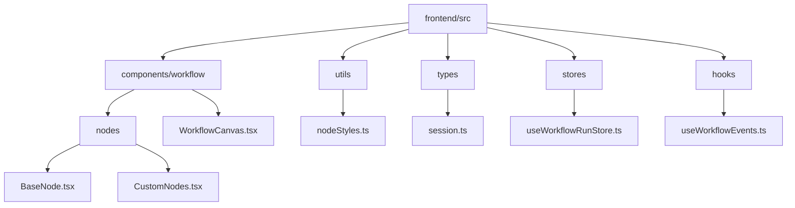

# 基础节点组件

<cite>
**本文档引用文件**  
- [BaseNode.tsx](file://frontend/src/components/workflow/nodes/BaseNode.tsx)
- [CustomNodes.tsx](file://frontend/src/components/workflow/nodes/CustomNodes.tsx)
- [nodeStyles.ts](file://frontend/src/utils/nodeStyles.ts)
- [WorkflowCanvas.tsx](file://frontend/src/components/workflow/WorkflowCanvas.tsx)
- [session.ts](file://frontend/src/types/session.ts)
- [useWorkflowRunStore.ts](file://frontend/src/stores/useWorkflowRunStore.ts)
- [useWorkflowEvents.ts](file://frontend/src/hooks/useWorkflowEvents.ts)
</cite>

## 更新摘要
**变更内容**  
- 更新了 `BaseNode` 组件的 Props 定义，新增 `status` 属性以支持节点状态可视化
- 重构了 `BaseNode` 的样式逻辑，将状态样式内联定义，取代原有的 `nodeStyles` 工具函数
- 更新了状态可视化实现逻辑，使用 Lucide 图标替代文本图标，并通过 Tailwind CSS 类直接控制边框、环形效果和动画
- 移除了对 `getNodeStatusStyles` 和 `getNodeStatusIcon` 工具函数的依赖

## 目录
1. [简介](#简介)
2. [项目结构](#项目结构)
3. [核心组件](#核心组件)
4. [架构概述](#架构概述)
5. [详细组件分析](#详细组件分析)
6. [依赖分析](#依赖分析)
7. [性能考虑](#性能考虑)
8. [故障排除指南](#故障排除指南)
9. [结论](#结论)

## 简介
`BaseNode` 是工作流可视化系统中的核心基类组件，作为所有自定义节点的统一基础。它封装了节点的通用外观、交互行为和状态可视化逻辑，通过 React 组件继承机制实现代码复用和样式统一。该组件深度集成 React Flow 库，支持拖拽、连接点（Handle）等图形化交互，并通过 Tailwind CSS 和内联样式实现灵活的主题适配与状态反馈。最新更新增强了节点状态可视化能力，通过 `status` 属性支持 `pending`、`running`、`completed`、`failed` 四种状态，分别应用不同的边框样式、环形效果和动态图标。

## 项目结构
`BaseNode` 及其相关实现位于前端代码库的 `workflow` 模块中，遵循清晰的分层结构。

**图示来源**
- [BaseNode.tsx](file://frontend/src/components/workflow/nodes/BaseNode.tsx)
- [CustomNodes.tsx](file://frontend/src/components/workflow/nodes/CustomNodes.tsx)
- [WorkflowCanvas.tsx](file://frontend/src/components/workflow/WorkflowCanvas.tsx)
- [nodeStyles.ts](file://frontend/src/utils/nodeStyles.ts)
- [session.ts](file://frontend/src/types/session.ts)
- [useWorkflowRunStore.ts](file://frontend/src/stores/useWorkflowRunStore.ts)
- [useWorkflowEvents.ts](file://frontend/src/hooks/useWorkflowEvents.ts)

**章节来源**
- [BaseNode.tsx](file://frontend/src/components/workflow/nodes/BaseNode.tsx)
- [CustomNodes.tsx](file://frontend/src/components/workflow/nodes/CustomNodes.tsx)
- [WorkflowCanvas.tsx](file://frontend/src/components/workflow/WorkflowCanvas.tsx)

## 核心组件
`BaseNode` 组件定义了所有工作流节点的通用结构和行为，包括外观、连接点、选中状态和内容插槽。`CustomNodes.tsx` 文件中的具体节点（如 `AgentNode`, `VoteNode`）通过继承 `BaseNode` 来实现特定功能，确保了UI的一致性。`BaseNode` 的最新版本通过 `status` 属性实现了更丰富的状态可视化，取代了原先依赖 `nodeStyles.ts` 工具类的方案。

**章节来源**
- [BaseNode.tsx](file://frontend/src/components/workflow/nodes/BaseNode.tsx)
- [CustomNodes.tsx](file://frontend/src/components/workflow/nodes/CustomNodes.tsx)

## 架构概述
`BaseNode` 的设计遵循了组件化和关注点分离的原则。它作为基类提供通用功能，具体节点通过组合和继承进行扩展。状态管理由 `useWorkflowRunStore` 统一处理，通过 WebSocket 事件 (`useWorkflowEvents`) 实时更新节点状态，并反映在 `BaseNode` 的视觉表现上。

```mermaid
sequenceDiagram
participant WebSocket as WebSocket
participant Store as useWorkflowRunStore
participant Hook as useWorkflowEvents
participant Canvas as WorkflowCanvas
participant Node as BaseNode
WebSocket->>Hook : node_state_change (node_id, status)
Hook->>Store : updateNodeStatus(node_id, status)
Store->>Store : 更新节点状态
Store-->>Canvas : 返回更新后的节点列表
Canvas->>Node : 传递更新后的节点数据
Node->>Node : 根据状态应用样式
```

**图示来源**
- [useWorkflowEvents.ts](file://frontend/src/hooks/useWorkflowEvents.ts)
- [useWorkflowRunStore.ts](file://frontend/src/stores/useWorkflowRunStore.ts)
- [WorkflowCanvas.tsx](file://frontend/src/components/workflow/WorkflowCanvas.tsx)
- [BaseNode.tsx](file://frontend/src/components/workflow/nodes/BaseNode.tsx)

## 详细组件分析

### BaseNode 组件分析
`BaseNode` 是一个功能完备的 React 函数组件，其设计旨在提供一个可复用、可扩展的节点模板。

#### React 组件结构与 Props 定义
`BaseNode` 通过 `BaseNodeProps` 接口定义了其可配置的属性，这些属性构成了节点的核心配置。关键更新是引入了 `status` 属性，用于驱动节点的状态可视化。

```mermaid
classDiagram
class BaseNodeProps {
+label : string
+icon? : LucideIcon
+selected? : boolean
+status? : NodeStatus
+headerColor? : string
+children? : ReactNode
+handles? : ('top' | 'associative' | 'bottom')[]
}
BaseNodeProps --> LucideIcon : "可选"
BaseNodeProps --> ReactNode : "可选"
BaseNodeProps --> NodeStatus : "可选"
```

**章节来源**
- [BaseNode.tsx](file://frontend/src/components/workflow/nodes/BaseNode.tsx#L7-L15)

#### 样式继承机制
`BaseNode` 的样式通过两种方式实现：内联的 Tailwind CSS 类和组件内部的状态样式映射。

1.  **Tailwind CSS**: 使用 `clsx` 库条件性地组合多个 Tailwind 类，实现响应式和主题化的基础样式。
2.  **内联状态样式映射**: 在组件内部定义 `statusStyles` 对象，根据 `status` prop 的值（`pending`、`running`、`completed`、`failed`）直接返回对应的 Tailwind CSS 类名，用于控制边框、图标和颜色。

```mermaid
flowchart TD
A[节点状态] --> B{状态判断}
B --> |pending| C[灰色边框 + ⚪图标]
B --> |running| D[蓝色边框 + 环形光晕 + 🔄旋转动画]
B --> |completed| E[绿色边框 + ✅图标]
B --> |failed| F[红色边框 + ❌图标]
C --> G[应用到 BaseNode]
D --> G
E --> G
F --> G
```

**章节来源**
- [BaseNode.tsx](file://frontend/src/components/workflow/nodes/BaseNode.tsx#L26-L48)

#### 与 React Flow 库的集成
`BaseNode` 通过 `Handle` 组件与 React Flow 库集成，实现节点间的连接。

```mermaid
classDiagram
class BaseNode {
+render()
}
class Handle {
+type : 'source' | 'target'
+position : Position
}
BaseNode --> Handle : "渲染"
```

`handles` 属性控制顶部（`target`）和底部（`source`）连接点的显示，使得 `BaseNode` 能够作为流程图中的任意节点参与连接。

**章节来源**
- [BaseNode.tsx](file://frontend/src/components/workflow/nodes/BaseNode.tsx#L77-L79)
- [BaseNode.tsx](file://frontend/src/components/workflow/nodes/BaseNode.tsx#L94-L96)

### 自定义节点继承使用示例
`CustomNodes.tsx` 中的节点通过组合 `BaseNode` 来构建，体现了其作为基类的设计目的。所有自定义节点都通过 `data.status` 将其状态传递给 `BaseNode` 的 `status` prop。

**图示来源**
- [CustomNodes.tsx](file://frontend/src/components/workflow/nodes/CustomNodes.tsx)

**章节来源**
- [CustomNodes.tsx](file://frontend/src/components/workflow/nodes/CustomNodes.tsx#L47-L150)

#### 主题适配与状态可视化实现逻辑
节点的状态可视化是一个跨组件协作的过程：
1.  **状态定义**: `NodeStatus` 类型在 `session.ts` 中定义。
2.  **状态管理**: `useWorkflowRunStore` 存储节点的运行时状态。
3.  **事件驱动**: `useWorkflowEvents` 监听后端推送的状态变更事件，并调用 `useWorkflowRunStore` 更新状态。
4.  **样式应用**: `WorkflowCanvas` 在渲染节点时，将 `useWorkflowRunStore` 中的节点状态信息传递给 `BaseNode`，`BaseNode` 结合内部的 `statusStyles` 映射，通过 Tailwind CSS 类直接应用最终的视觉样式。

```mermaid
erDiagram
NodeStatus {
string status PK
}
useWorkflowRunStore {
string nodeId PK
string status FK
}
BaseNode {
string status FK
object style
}
NodeStatus ||--o{ useWorkflowRunStore : "定义"
useWorkflowRunStore ||--o{ BaseNode : "传递"
```

**章节来源**
- [session.ts](file://frontend/src/types/session.ts#L4)
- [useWorkflowRunStore.ts](file://frontend/src/stores/useWorkflowRunStore.ts)
- [useWorkflowEvents.ts](file://frontend/src/hooks/useWorkflowEvents.ts)
- [BaseNode.tsx](file://frontend/src/components/workflow/nodes/BaseNode.tsx)

## 依赖分析
`BaseNode` 的实现依赖于多个关键库和内部模块。

**图示来源**
- [BaseNode.tsx](file://frontend/src/components/workflow/nodes/BaseNode.tsx#L1-L5)
- [useWorkflowRunStore.ts](file://frontend/src/stores/useWorkflowRunStore.ts)
- [useWorkflowEvents.ts](file://frontend/src/hooks/useWorkflowEvents.ts)
- [WorkflowCanvas.tsx](file://frontend/src/components/workflow/WorkflowCanvas.tsx)

**章节来源**
- [BaseNode.tsx](file://frontend/src/components/workflow/nodes/BaseNode.tsx)
- [useWorkflowRunStore.ts](file://frontend/src/stores/useWorkflowRunStore.ts)
- [useWorkflowEvents.ts](file://frontend/src/hooks/useWorkflowEvents.ts)

## 性能考虑
`BaseNode` 的设计考虑了性能：
- **状态更新**: 使用 Zustand 状态管理库，确保只有状态变更的节点才会触发重渲染。
- **样式计算**: `statusStyles` 是一个静态对象，查找开销极小。
- **连接点**: `Handle` 组件由 React Flow 优化，仅在必要时渲染。

## 故障排除指南
- **节点不显示**: 检查 `nodeTypes` 映射是否正确配置在 `WorkflowCanvas` 中。
- **状态不更新**: 确认 WebSocket 连接正常，`useWorkflowEvents` 是否收到 `node_state_change` 事件。
- **样式错乱**: 检查 `tailwind.config.js` 的 `darkMode` 配置和 `index.css` 中的全局样式。

**章节来源**
- [WorkflowCanvas.tsx](file://frontend/src/components/workflow/WorkflowCanvas.tsx#L31-L38)
- [useWorkflowEvents.ts](file://frontend/src/hooks/useWorkflowEvents.ts)
- [tailwind.config.js](file://frontend/tailwind.config.js#L3)
- [index.css](file://frontend/src/index.css)

## 结论
`BaseNode` 作为工作流节点的基类，成功地提供了一个灵活、可复用且易于维护的UI基础。它通过组合而非继承的方式与 React Flow 集成，利用 Tailwind CSS 和内联状态样式映射实现了强大的样式定制和状态可视化能力。其设计与 `useWorkflowRunStore` 和 `useWorkflowEvents` 等状态管理机制紧密结合，构建了一个响应式和动态的可视化工作流系统。本次更新通过将状态样式逻辑内联到组件中，简化了依赖，提高了样式的可维护性和性能。