# 工作流节点组件

<cite>
**本文档引用的文件**  
- [BaseNode.tsx](file://frontend/src/components/workflow/nodes/BaseNode.tsx)
- [CustomNodes.tsx](file://frontend/src/components/workflow/nodes/CustomNodes.tsx)
- [VoteNodeForm.tsx](file://frontend/src/features/editor/components/PropertyPanel/NodeForms/VoteNodeForm.tsx)
- [LoopNodeForm.tsx](file://frontend/src/features/editor/components/PropertyPanel/NodeForms/LoopNodeForm.tsx)
- [FactCheckNodeForm.tsx](file://frontend/src/features/editor/components/PropertyPanel/NodeForms/FactCheckNodeForm.tsx)
- [HumanReviewNodeForm.tsx](file://frontend/src/features/editor/components/PropertyPanel/NodeForms/HumanReviewNodeForm.tsx)
- [PropertyPanel.tsx](file://frontend/src/features/editor/components/PropertyPanel/PropertyPanel.tsx)
- [workflow.ts](file://frontend/src/types/workflow.ts)
- [nodeStyles.ts](file://frontend/src/utils/nodeStyles.ts)
- [factory.go](file://internal/core/workflow/nodes/factory.go)
- [vote.go](file://internal/core/workflow/nodes/vote.go)
- [loop.go](file://internal/core/workflow/nodes/loop.go)
- [fact_check.go](file://internal/core/workflow/nodes/fact_check.go)
- [human_review.go](file://internal/core/workflow/nodes/human_review.go)
</cite>

## 目录
1. [简介](#简介)
2. [项目结构](#项目结构)
3. [核心组件](#核心组件)
4. [架构概述](#架构概述)
5. [详细组件分析](#详细组件分析)
6. [依赖分析](#依赖分析)
7. [性能考虑](#性能考虑)
8. [故障排除指南](#故障排除指南)
9. [结论](#结论)

## 简介
本文档系统阐述了可视化工作流中各类节点的UI实现机制。重点分析了BaseNode作为所有节点基类的结构设计与样式继承机制，以及VoteNode、LoopNode、FactCheckNode、HumanReviewNode等特殊节点的视觉标识与交互特性。同时结合PropertyPanel下的NodeForms，说明节点配置表单如何根据节点类型动态渲染，包括字段验证、默认值处理与状态同步。最后提供节点扩展指南，指导开发者如何添加新的节点类型及其对应的UI组件。

## 项目结构
工作流节点组件主要分布在前端代码库的特定目录中，采用模块化设计，分离了基础节点、自定义节点和属性配置面板。

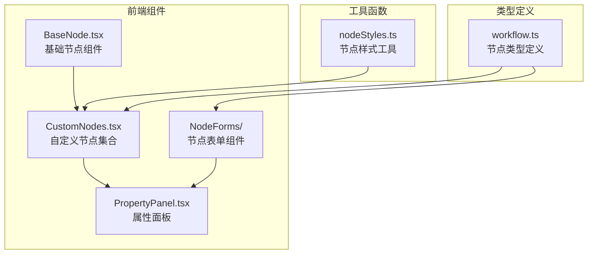

**图示来源**
- [BaseNode.tsx](file://frontend/src/components/workflow/nodes/BaseNode.tsx)
- [CustomNodes.tsx](file://frontend/src/components/workflow/nodes/CustomNodes.tsx)
- [PropertyPanel.tsx](file://frontend/src/features/editor/components/PropertyPanel/PropertyPanel.tsx)
- [workflow.ts](file://frontend/src/types/workflow.ts)

**本节来源**
- [frontend/src/components/workflow/nodes](file://frontend/src/components/workflow/nodes)
- [frontend/src/features/editor/components/PropertyPanel](file://frontend/src/features/editor/components/PropertyPanel)

## 核心组件
工作流节点系统由基础节点、自定义节点和属性配置面板三大核心组件构成。BaseNode作为所有节点的基类，提供了统一的视觉框架和交互模式。CustomNodes实现了各种特定功能的节点，如投票、循环、事实核查和人工审核。PropertyPanel则负责提供节点配置的UI界面，支持动态表单渲染。

**本节来源**
- [BaseNode.tsx](file://frontend/src/components/workflow/nodes/BaseNode.tsx#L1-L47)
- [CustomNodes.tsx](file://frontend/src/components/workflow/nodes/CustomNodes.tsx#L1-L140)
- [PropertyPanel.tsx](file://frontend/src/features/editor/components/PropertyPanel/PropertyPanel.tsx#L1-L86)

## 架构概述
整个工作流节点系统采用分层架构设计，前端组件与后端处理器通过标准化接口进行通信。

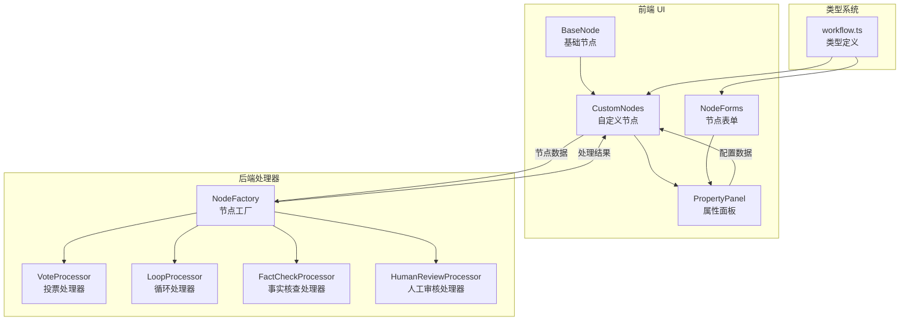

**图示来源**
- [BaseNode.tsx](file://frontend/src/components/workflow/nodes/BaseNode.tsx)
- [CustomNodes.tsx](file://frontend/src/components/workflow/nodes/CustomNodes.tsx)
- [PropertyPanel.tsx](file://frontend/src/features/editor/components/PropertyPanel/PropertyPanel.tsx)
- [factory.go](file://internal/core/workflow/nodes/factory.go)
- [vote.go](file://internal/core/workflow/nodes/vote.go)
- [loop.go](file://internal/core/workflow/nodes/loop.go)
- [fact_check.go](file://internal/core/workflow/nodes/fact_check.go)
- [human_review.go](file://internal/core/workflow/nodes/human_review.go)

## 详细组件分析
### BaseNode 基类分析
BaseNode是所有工作流节点的基类，采用React函数组件实现，提供了统一的视觉框架和交互模式。它通过props接收标签、图标、选中状态、头部颜色和子元素等配置，使用Tailwind CSS进行样式控制。

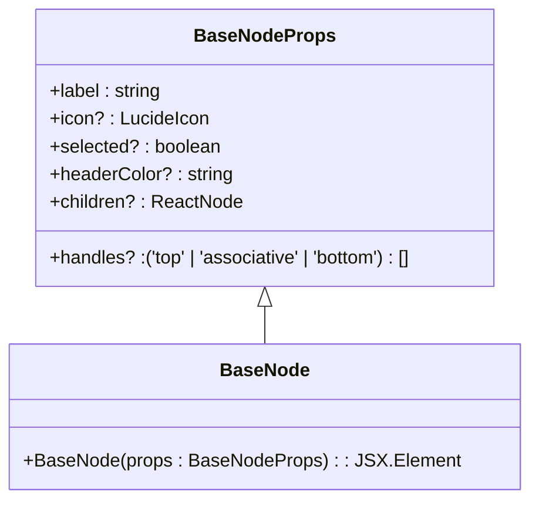

**图示来源**
- [BaseNode.tsx](file://frontend/src/components/workflow/nodes/BaseNode.tsx#L6-L13)

**本节来源**
- [BaseNode.tsx](file://frontend/src/components/workflow/nodes/BaseNode.tsx#L1-L47)

### 自定义节点分析
#### VoteNode 投票节点
VoteNode用于实现投票决策逻辑，继承BaseNode并设置特定的视觉样式。它显示投票阈值信息，使用橙色主题色标识。

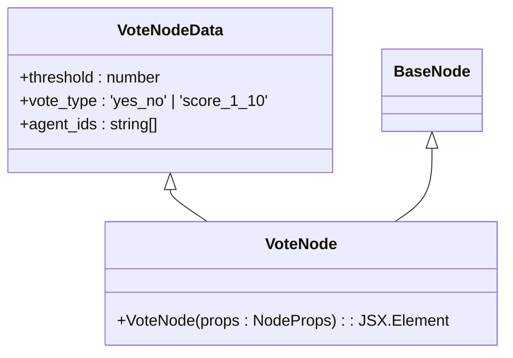

**图示来源**
- [CustomNodes.tsx](file://frontend/src/components/workflow/nodes/CustomNodes.tsx#L44-L57)
- [workflow.ts](file://frontend/src/types/workflow.ts#L15-L19)

#### LoopNode 循环节点
LoopNode用于实现循环执行逻辑，继承BaseNode并设置特定的视觉样式。它显示最大轮次和退出条件信息，使用黄色主题色标识。

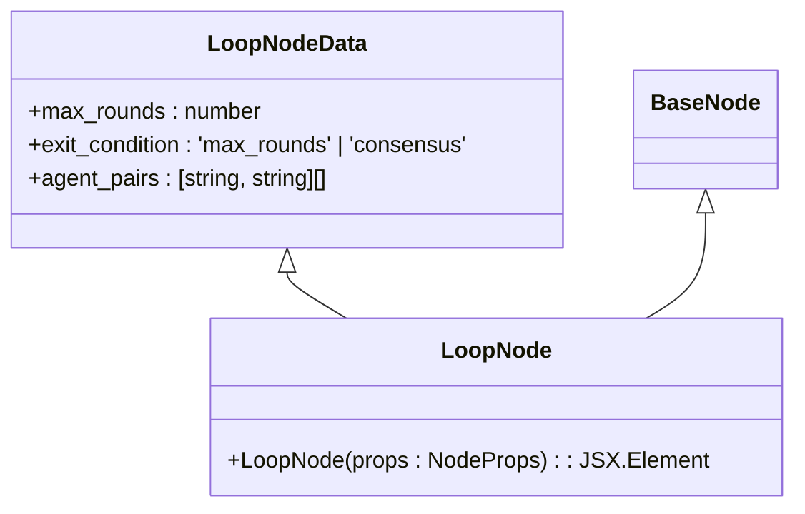

**图示来源**
- [CustomNodes.tsx](file://frontend/src/components/workflow/nodes/CustomNodes.tsx#L60-L74)
- [workflow.ts](file://frontend/src/types/workflow.ts#L21-L25)

#### FactCheckNode 事实核查节点
FactCheckNode用于实现事实核查逻辑，继承BaseNode并设置特定的视觉样式。它显示搜索来源和验证阈值信息，使用青色主题色标识。

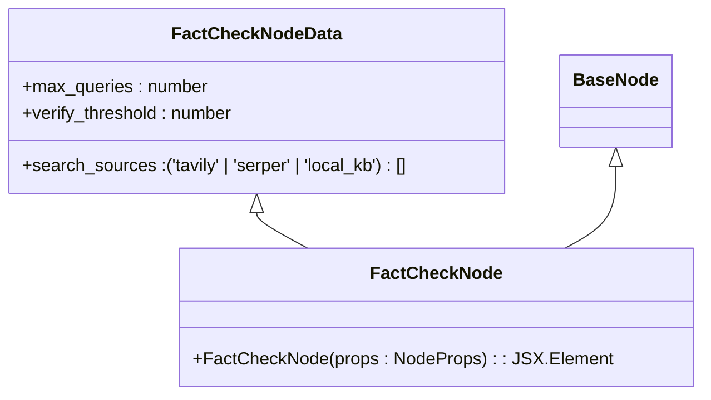

**图示来源**
- [CustomNodes.tsx](file://frontend/src/components/workflow/nodes/CustomNodes.tsx#L77-L93)
- [workflow.ts](file://frontend/src/types/workflow.ts#L27-L31)

#### HumanReviewNode 人工审核节点
HumanReviewNode用于实现人工审核逻辑，继承BaseNode并设置特定的视觉样式。它显示超时时间和跳过选项信息，使用紫色主题色标识。

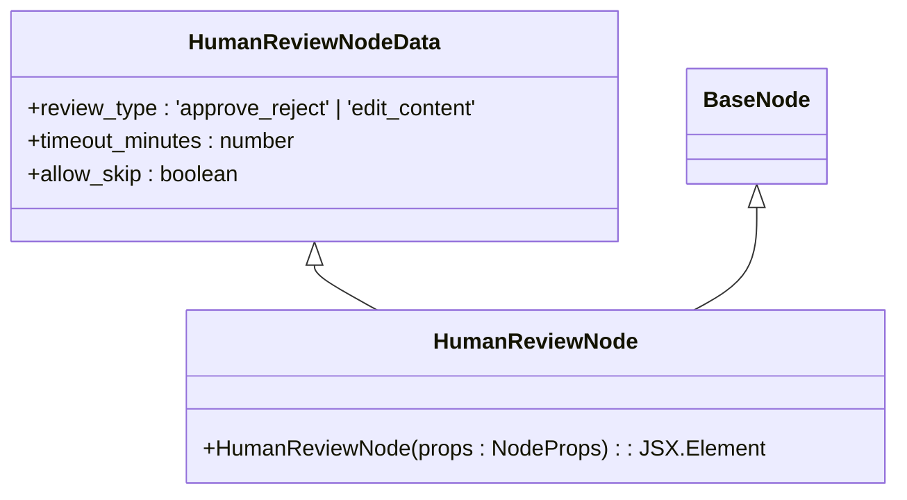

**图示来源**
- [CustomNodes.tsx](file://frontend/src/components/workflow/nodes/CustomNodes.tsx#L96-L110)
- [workflow.ts](file://frontend/src/types/workflow.ts#L33-L37)

### 属性面板与节点表单分析
#### PropertyPanel 属性面板
PropertyPanel是节点配置的主容器，根据选中的节点类型动态渲染相应的配置表单。

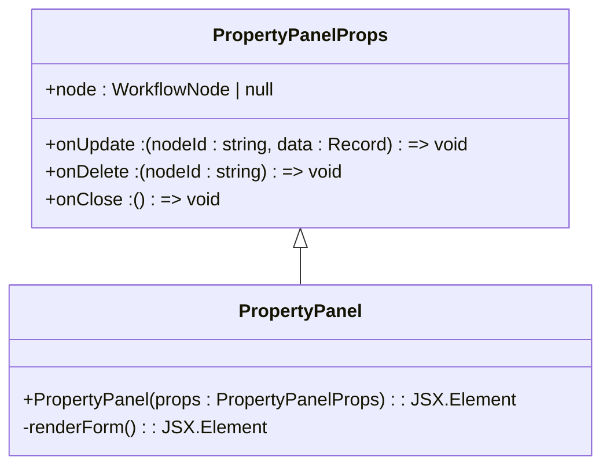

**图示来源**
- [PropertyPanel.tsx](file://frontend/src/features/editor/components/PropertyPanel/PropertyPanel.tsx#L11-L16)

#### VoteNodeForm 投票节点表单
VoteNodeForm提供投票节点的配置界面，包括阈值滑块和投票类型选择。

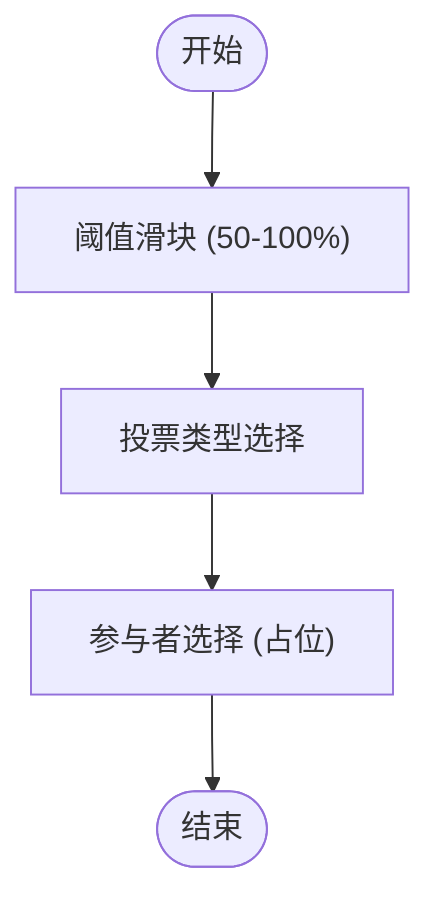

**图示来源**
- [VoteNodeForm.tsx](file://frontend/src/features/editor/components/PropertyPanel/NodeForms/VoteNodeForm.tsx#L1-L62)

#### LoopNodeForm 循环节点表单
LoopNodeForm提供循环节点的配置界面，包括最大轮次滑块和退出条件选择。

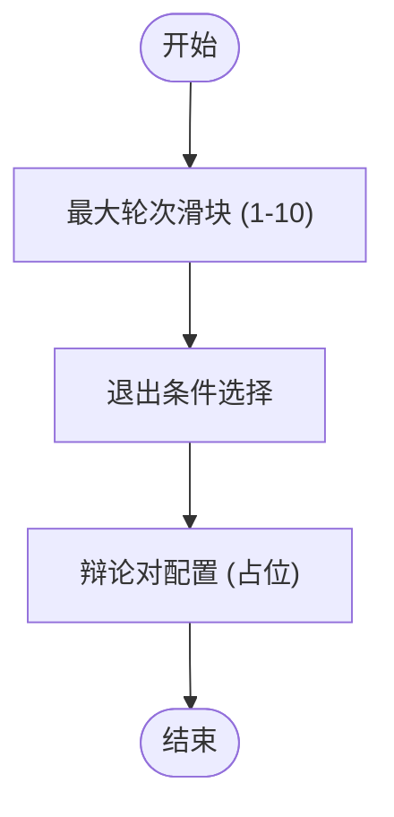

**图示来源**
- [LoopNodeForm.tsx](file://frontend/src/features/editor/components/PropertyPanel/NodeForms/LoopNodeForm.tsx#L1-L50)

#### FactCheckNodeForm 事实核查节点表单
FactCheckNodeForm提供事实核查节点的配置界面，包括搜索源选择、查询数量和验证阈值。

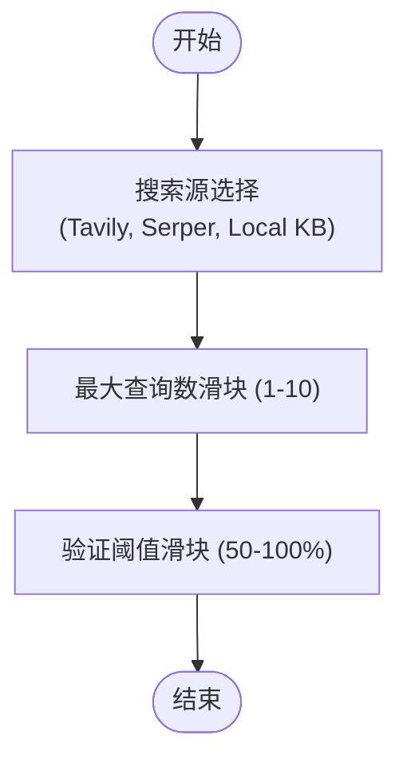

**图示来源**
- [FactCheckNodeForm.tsx](file://frontend/src/features/editor/components/PropertyPanel/NodeForms/FactCheckNodeForm.tsx#L1-L88)

#### HumanReviewNodeForm 人工审核节点表单
HumanReviewNodeForm提供人工审核节点的配置界面，包括审核类型、超时时间和跳过选项。

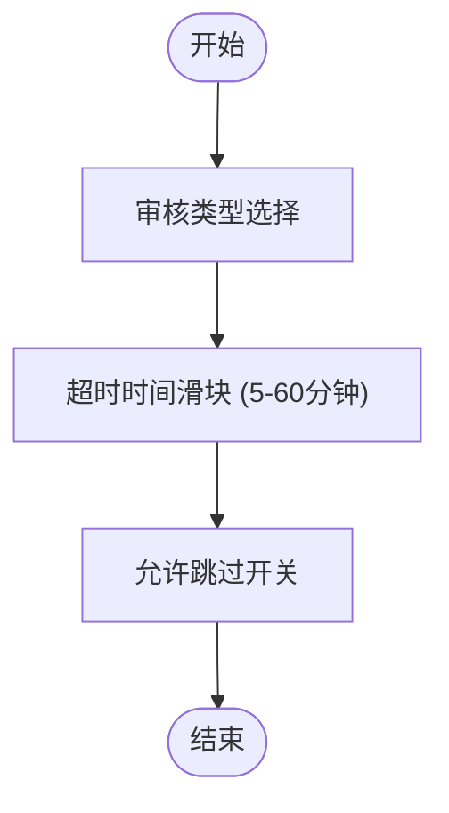

**图示来源**
- [HumanReviewNodeForm.tsx](file://frontend/src/features/editor/components/PropertyPanel/NodeForms/HumanReviewNodeForm.tsx#L1-L65)

**本节来源**
- [PropertyPanel.tsx](file://frontend/src/features/editor/components/PropertyPanel/PropertyPanel.tsx#L1-L86)
- [VoteNodeForm.tsx](file://frontend/src/features/editor/components/PropertyPanel/NodeForms/VoteNodeForm.tsx#L1-L62)
- [LoopNodeForm.tsx](file://frontend/src/features/editor/components/PropertyPanel/NodeForms/LoopNodeForm.tsx#L1-L50)
- [FactCheckNodeForm.tsx](file://frontend/src/features/editor/components/PropertyPanel/NodeForms/FactCheckNodeForm.tsx#L1-L88)
- [HumanReviewNodeForm.tsx](file://frontend/src/features/editor/components/PropertyPanel/NodeForms/HumanReviewNodeForm.tsx#L1-L65)

## 依赖分析
工作流节点系统涉及多个组件之间的复杂依赖关系，从前端UI到后端处理器形成完整的调用链。

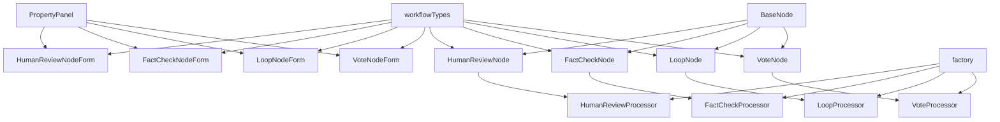

**图示来源**
- [PropertyPanel.tsx](file://frontend/src/features/editor/components/PropertyPanel/PropertyPanel.tsx)
- [CustomNodes.tsx](file://frontend/src/components/workflow/nodes/CustomNodes.tsx)
- [workflow.ts](file://frontend/src/types/workflow.ts)
- [factory.go](file://internal/core/workflow/nodes/factory.go)

**本节来源**
- [frontend/src/components/workflow/nodes](file://frontend/src/components/workflow/nodes)
- [frontend/src/features/editor/components/PropertyPanel](file://frontend/src/features/editor/components/PropertyPanel)
- [internal/core/workflow/nodes](file://internal/core/workflow/nodes)

## 性能考虑
工作流节点系统的性能主要体现在以下几个方面：
1. **组件复用**：BaseNode作为基类，实现了高度的组件复用，减少了重复代码。
2. **动态渲染**：PropertyPanel根据节点类型动态渲染表单，避免了不必要的DOM操作。
3. **状态管理**：通过props传递数据，保持组件的纯净性，便于React的优化。
4. **样式优化**：使用Tailwind CSS的原子类，减少了CSS文件大小和样式冲突。

## 故障排除指南
### 常见问题
1. **节点不显示**：检查节点数据是否符合WorkflowNode接口定义。
2. **表单不更新**：确保onUpdate回调函数正确传递并处理数据更新。
3. **样式错乱**：检查Tailwind CSS类名是否正确，确保dark模式类名正确应用。
4. **交互失效**：确认事件处理器是否正确绑定，检查React Flow的handle配置。

**本节来源**
- [BaseNode.tsx](file://frontend/src/components/workflow/nodes/BaseNode.tsx#L24-L26)
- [PropertyPanel.tsx](file://frontend/src/features/editor/components/PropertyPanel/PropertyPanel.tsx#L64-L65)

## 结论
本文档全面分析了工作流节点组件的架构和实现。BaseNode作为基类提供了统一的视觉框架和交互模式，通过props配置实现高度的灵活性。各种自定义节点继承BaseNode并添加特定的视觉标识和交互特性，形成了丰富的工作流节点库。PropertyPanel通过动态渲染机制，为不同类型的节点提供相应的配置界面，实现了良好的用户体验。整个系统设计合理，组件职责清晰，便于维护和扩展。