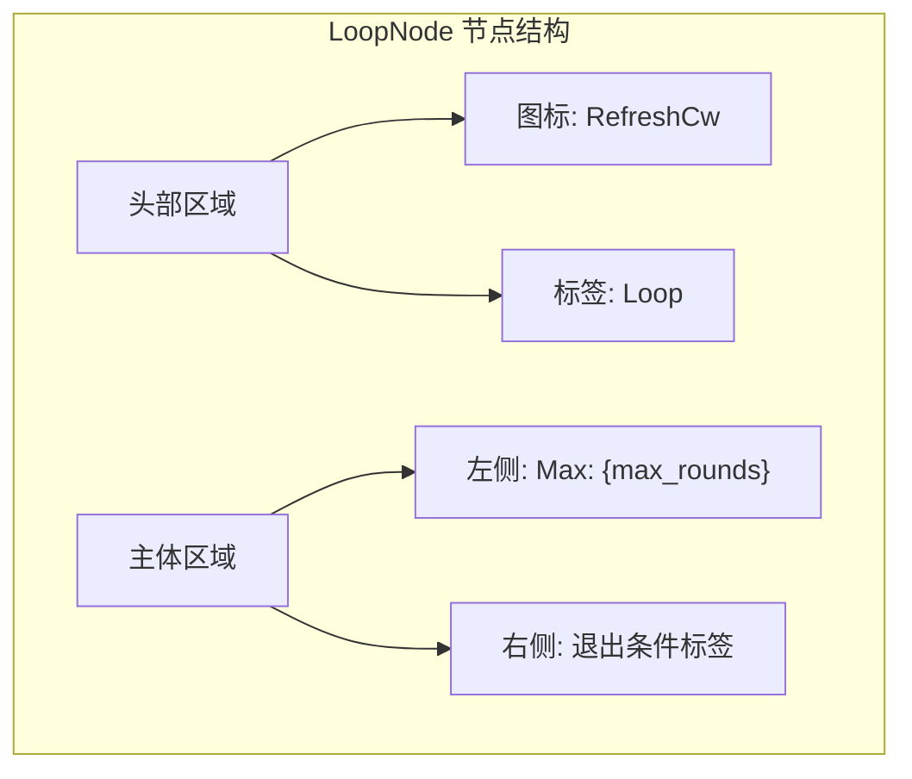
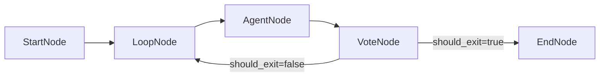
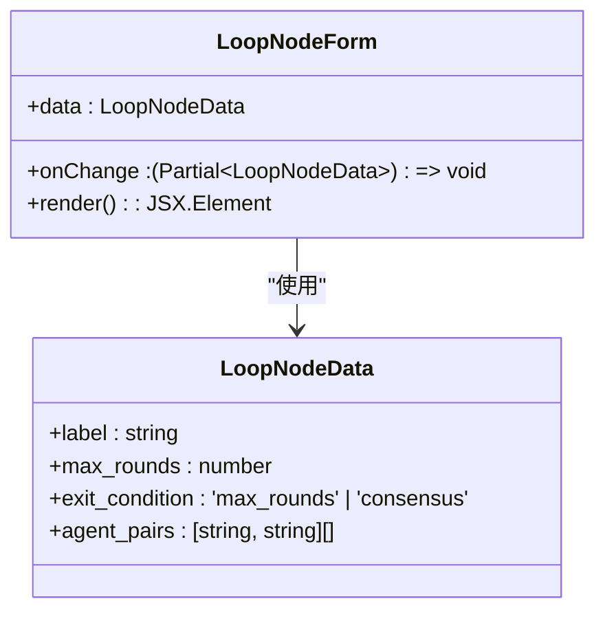
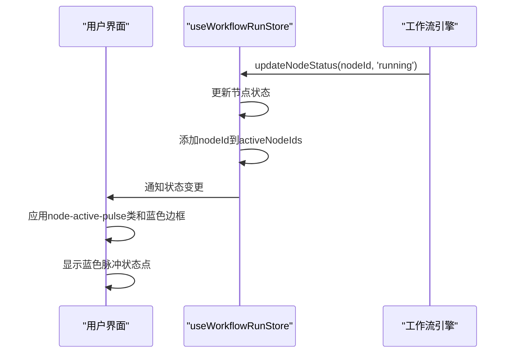
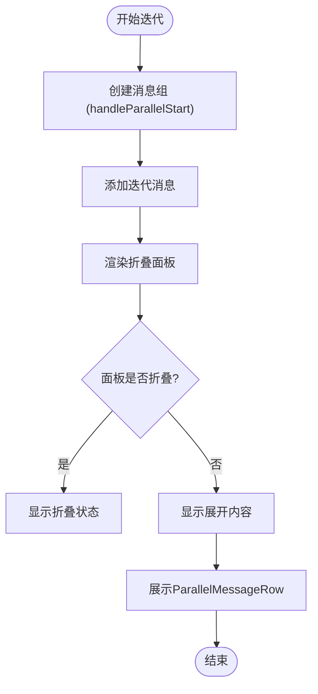

# 循环节点

<cite>
**本文档引用的文件**  
- [LoopNodeForm.tsx](file://frontend/src/features/editor/components/PropertyPanel/NodeForms/LoopNodeForm.tsx)
- [loop.go](file://internal/core/workflow/nodes/loop.go)
- [CustomNodes.tsx](file://frontend/src/components/workflow/nodes/CustomNodes.tsx)
- [workflow.ts](file://frontend/src/types/workflow.ts)
- [BaseNode.tsx](file://frontend/src/components/workflow/nodes/BaseNode.tsx)
- [WorkflowCanvas.tsx](file://frontend/src/components/workflow/WorkflowCanvas.tsx)
- [useWorkflowRunStore.ts](file://frontend/src/stores/useWorkflowRunStore.ts)
- [SPEC-202-vote-loop-nodes.md](file://docs/specs/sprint3/SPEC-202-vote-loop-nodes.md)
</cite>

## 目录
1. [环形图标与UI布局](#环形图标与ui布局)
2. [入口与出口连接点拓扑结构](#入口与出口连接点拓扑结构)
3. [循环终止条件表单实现](#循环终止条件表单实现)
4. [运行时迭代路径高亮机制](#运行时迭代路径高亮机制)
5. [历史迭代结果折叠面板](#历史迭代结果折叠面板)

## 环形图标与UI布局

LoopNode采用环形图标设计，其视觉元素包含一个代表循环操作的刷新图标（RefreshCw），该图标以紫色（#8B5CF6）呈现，象征着循环逻辑的持续性和动态性。节点整体采用圆角矩形设计，背景为浅紫色渐变（#EDE9FE → #DDD6FE），边框为紫色实线，与系统其他节点形成视觉区分。

在UI布局上，节点分为头部和主体两部分。头部包含节点标签和图标，背景色为淡黄色（bg-yellow-50），与主体形成色彩层次。主体区域采用Flex布局，横向排列两个核心信息组件：左侧显示最大迭代次数（"Max: 3"），右侧以小型标签形式展示退出条件（如"max_rounds"或"consensus"），标签背景为黄色（bg-yellow-100），文字为深黄色（text-yellow-700），确保信息清晰可读。

**图示来源**  
- [CustomNodes.tsx](file://frontend/src/components/workflow/nodes/CustomNodes.tsx#L60-L74)
- [SPEC-202-vote-loop-nodes.md](file://docs/specs/sprint3/SPEC-202-vote-loop-nodes.md#L70-L78)

**本节来源**  
- [CustomNodes.tsx](file://frontend/src/components/workflow/nodes/CustomNodes.tsx#L60-L74)
- [SPEC-202-vote-loop-nodes.md](file://docs/specs/sprint3/SPEC-202-vote-loop-nodes.md#L68-L78)

## 入口与出口连接点拓扑结构

LoopNode的连接点拓扑结构遵循有向图设计原则，通过React Flow库实现。节点定义了两个标准连接点：顶部的目标连接点（target handle）和底部的源连接点（source handle）。这种设计支持线性工作流中的循环嵌套，允许前序节点连接到LoopNode的入口，而LoopNode的出口可连接到后续节点或返回到循环体内部。

在运行时，当循环条件未满足时，工作流引擎会将执行路径重定向回循环体的起始点，形成逻辑闭环。这种拓扑结构通过`edges`数组中的连接关系实现，其中`source`指向循环体的起始节点，`target`指向LoopNode本身，从而构建循环引用。系统通过`activeNodeIds`状态集合管理当前活跃的节点，确保在循环执行期间正确高亮当前迭代路径。

**图示来源**  
- [BaseNode.tsx](file://frontend/src/components/workflow/nodes/BaseNode.tsx#L29-L31)
- [BaseNode.tsx](file://frontend/src/components/workflow/nodes/BaseNode.tsx#L42-L44)
- [WorkflowCanvas.tsx](file://frontend/src/components/workflow/WorkflowCanvas.tsx#L108-L115)

**本节来源**  
- [BaseNode.tsx](file://frontend/src/components/workflow/nodes/BaseNode.tsx#L12-L13)
- [WorkflowCanvas.tsx](file://frontend/src/components/workflow/WorkflowCanvas.tsx#L108-L115)

## 循环终止条件表单实现

LoopNodeForm组件实现了循环终止条件的配置界面，采用React函数式组件设计。表单包含两个核心控件：最大迭代次数滑块和退出条件选择器。

最大迭代次数通过`<input type="range">`滑块控件实现，取值范围为1-10，步长为1。滑块下方实时显示当前值，采用`font-mono`等宽字体增强可读性。当用户拖动滑块时，触发`onChange`事件处理器，将字符串值转换为整数后通过回调函数更新节点数据。

退出条件采用`<select>`下拉选择器，提供两个选项："Reaching Max Rounds"（达到最大轮次）和"Reaching Consensus"（达到共识）。选择器的值绑定到`data.exit_condition`字段，变更时通过类型断言确保数据类型安全。表单采用垂直布局（`space-y-4`），每个控件组包含标签和控件，标签使用大写粗体样式（`font-semibold uppercase`）提升可访问性。

**图示来源**  
- [LoopNodeForm.tsx](file://frontend/src/features/editor/components/PropertyPanel/NodeForms/LoopNodeForm.tsx#L1-L49)
- [workflow.ts](file://frontend/src/types/workflow.ts#L21-L25)

**本节来源**  
- [LoopNodeForm.tsx](file://frontend/src/features/editor/components/PropertyPanel/NodeForms/LoopNodeForm.tsx#L1-L49)
- [workflow.ts](file://frontend/src/types/workflow.ts#L21-L25)

## 运行时迭代路径高亮机制

在运行时，系统通过前端状态管理机制高亮当前迭代路径。核心实现依赖于`useWorkflowRunStore`状态管理器，该管理器维护一个`activeNodeIds`集合，记录当前正在执行的节点ID。

当工作流执行到LoopNode时，`setActiveNodes`方法被调用，将当前循环体内的所有相关节点ID添加到`activeNodeIds`集合中。在`WorkflowCanvas`组件中，通过`storeNodes.map()`遍历所有节点，为`activeIds.has(node.id)`为真的节点添加`node-active-pulse`类名，并应用蓝色边框（`border: 2px solid #3B82F6`）的内联样式。

此外，`StatusDot`组件根据节点状态显示不同颜色的指示点：运行中为蓝色脉冲动画，已完成为绿色，失败为红色。这种双重高亮机制（边框+状态点）确保用户能清晰识别当前执行的迭代路径。状态更新通过`updateNodeStatus`方法触发，该方法使用Immer库进行不可变状态更新，保证React组件的高效重渲染。

**图示来源**  
- [useWorkflowRunStore.ts](file://frontend/src/stores/useWorkflowRunStore.ts#L149-L159)
- [WorkflowCanvas.tsx](file://frontend/src/components/workflow/WorkflowCanvas.tsx#L100-L104)
- [StatusDot.tsx](file://frontend/src/components/ui/StatusDot.tsx#L12-L14)

**本节来源**  
- [useWorkflowRunStore.ts](file://frontend/src/stores/useWorkflowRunStore.ts#L88-L90)
- [WorkflowCanvas.tsx](file://frontend/src/components/workflow/WorkflowCanvas.tsx#L100-L104)
- [StatusDot.tsx](file://frontend/src/components/ui/StatusDot.tsx#L12-L14)

## 历史迭代结果折叠面板

系统通过消息分组机制展示历史迭代结果，每个迭代轮次作为一个独立的消息组。`messageGroups`数组存储所有消息组，每个组包含`nodeId`、`nodeName`、`nodeType`和`messages`等属性。当并行执行开始时，`handleParallelStart`方法创建新的消息组，并将其推入`messageGroups`数组。

折叠面板功能通过UI组件的`collapsible`属性实现。在`MeetingRoom`组件中，右侧面板（Document Reader）被设置为可折叠，通过`onCollapse`和`onExpand`回调处理折叠状态变更。用户可通过点击折叠按钮切换面板的展开/折叠状态，系统通过`rightCollapsed`状态变量跟踪当前状态。

历史迭代结果的展示采用`ParallelMessageRow`组件，该组件接收消息数组作为`messages`属性，为每条消息创建独立的卡片布局。卡片包含代理头像、名称和内容区域，内容使用`ReactMarkdown`组件渲染，支持富文本格式。所有消息组在聊天流窗口中按时间顺序排列，形成清晰的迭代历史记录。

**图示来源**  
- [useSessionStore.ts](file://frontend/src/stores/useSessionStore.ts#L280-L299)
- [MeetingRoom.tsx](file://frontend/src/features/meeting/MeetingRoom.tsx#L216-L219)
- [ParallelMessageRow.tsx](file://frontend/src/components/modules/ParallelMessageRow.tsx#L1-L27)

**本节来源**  
- [useSessionStore.ts](file://frontend/src/stores/useSessionStore.ts#L280-L299)
- [MeetingRoom.tsx](file://frontend/src/features/meeting/MeetingRoom.tsx#L216-L219)
- [ParallelMessageRow.tsx](file://frontend/src/components/modules/ParallelMessageRow.tsx#L1-L27)