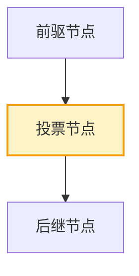
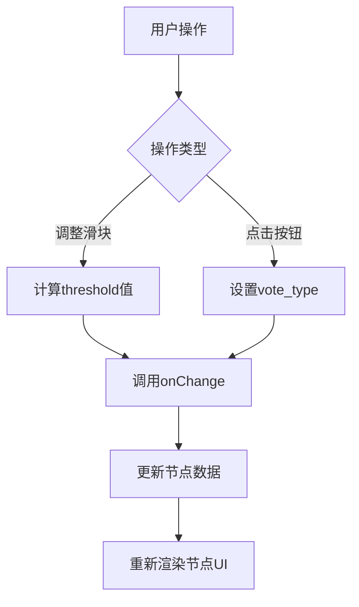
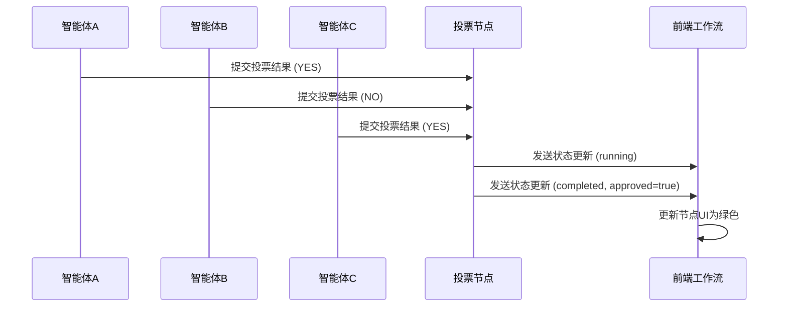

# 投票节点

<cite>
**本文档中引用的文件**  
- [VoteNodeForm.tsx](file://frontend/src/features/editor/components/PropertyPanel/NodeForms/VoteNodeForm.tsx)
- [CustomNodes.tsx](file://frontend/src/components/workflow/nodes/CustomNodes.tsx)
- [BaseNode.tsx](file://frontend/src/components/workflow/nodes/BaseNode.tsx)
- [workflow.ts](file://frontend/src/types/workflow.ts)
- [nodeStyles.ts](file://frontend/src/utils/nodeStyles.ts)
- [SPEC-202-vote-loop-nodes.md](file://docs/specs/sprint3/SPEC-202-vote-loop-nodes.md)
- [vote.go](file://internal/core/workflow/nodes/vote.go)
- [WorkflowEditor.tsx](file://frontend/src/features/editor/WorkflowEditor.tsx)
</cite>

## 目录
1. [简介](#简介)
2. [UI实现与视觉标识](#ui实现与视觉标识)
3. [配置表单与状态绑定](#配置表单与状态绑定)
4. [前端状态更新流程](#前端状态更新流程)
5. [总结](#总结)

## 简介
投票节点（VoteNode）是工作流中的关键决策节点，用于在多个智能体（Agent）之间进行投票决策。该节点支持多种投票策略，如多数决或加权评分，并通过可视化界面展示其执行状态。本文将深入解析其UI实现、配置逻辑及运行时前端状态更新机制。

## UI实现与视觉标识

投票节点在画布中以菱形结构呈现，采用橙色系颜色编码策略，突出其作为决策节点的重要性。其视觉设计遵循统一的节点基类 `BaseNode`，并通过 `CustomNodes.tsx` 中的 `VoteNode` 组件进行定制化渲染。

节点顶部标题栏使用浅橙色背景（`bg-orange-50 dark:bg-orange-900/30`），图标为 `Vote` 图标，文字标签默认为“Vote”。节点主体区域居中显示当前配置的投票通过阈值（Threshold），使用醒目的橙色字体突出显示。

该节点具备标准的输入/输出连接点：顶部为输入句柄（target handle），底部为输出句柄（source handle），支持与其他节点建立前后置依赖关系。当节点被选中时，外边框会高亮显示紫色边框，便于用户在复杂工作流中定位。

**图示来源**  
- [CustomNodes.tsx](file://frontend/src/components/workflow/nodes/CustomNodes.tsx#L44-L57)
- [BaseNode.tsx](file://frontend/src/components/workflow/nodes/BaseNode.tsx#L6-L47)

**本节来源**  
- [CustomNodes.tsx](file://frontend/src/components/workflow/nodes/CustomNodes.tsx#L44-L57)
- [BaseNode.tsx](file://frontend/src/components/workflow/nodes/BaseNode.tsx#L6-L47)
- [SPEC-202-vote-loop-nodes.md](file://docs/specs/sprint3/SPEC-202-vote-loop-nodes.md#L1-L21)

## 配置表单与状态绑定

投票节点的配置通过 `VoteNodeForm` 组件实现，集成于属性面板中。该表单提供以下核心配置字段：

- **通过阈值（Approval Threshold）**：以滑块形式呈现，取值范围为50%至100%，步长为5%。默认值为67%（即2/3多数）。用户拖动滑块时，实时显示百分比数值，并通过 `onChange` 回调函数将 `threshold` 值以小数形式（如0.67）更新至节点数据模型。
- **投票类型（Vote Type）**：提供两个按钮选项：“是/否投票”（Yes/No）和“1-10评分”（1-10 Score）。用户点击按钮后，通过 `onChange` 更新 `vote_type` 字段。
- **参与智能体（Participants）**：目前为占位区域，提示“Agent selection coming soon”，待后续实现多选组件。

表单通过 `VoteNodeData` 类型定义数据结构，包含 `label`、`threshold`、`vote_type` 和 `agent_ids` 四个字段。父组件通过 `data` 属性传入当前节点数据，并通过 `onChange` 回调接收部分更新，实现双向状态绑定。

**图示来源**  
- [VoteNodeForm.tsx](file://frontend/src/features/editor/components/PropertyPanel/NodeForms/VoteNodeForm.tsx#L1-L62)
- [workflow.ts](file://frontend/src/types/workflow.ts#L15-L19)

**本节来源**  
- [VoteNodeForm.tsx](file://frontend/src/features/editor/components/PropertyPanel/NodeForms/VoteNodeForm.tsx#L1-L62)
- [workflow.ts](file://frontend/src/types/workflow.ts#L15-L19)
- [SPEC-202-vote-loop-nodes.md](file://docs/specs/sprint3/SPEC-202-vote-loop-nodes.md#L25-L31)

## 前端状态更新流程

当工作流执行至投票节点时，前端通过WebSocket接收来自后端的流式事件（StreamEvent），并实时更新节点状态。根据 `nodeStyles.ts` 中定义的样式规则，节点外观随状态变化动态调整：

- **待处理（pending）**：节点透明度降低，表示尚未执行。
- **运行中（running）**：节点外层显示蓝色脉冲动画边框，表示正在收集和处理各智能体的投票结果。
- **已完成（completed）**：节点边框变为绿色，并显示绿色阴影，表示投票已完成且已通过。
- **失败（failed）**：节点边框变为红色，并显示红色阴影，表示投票未通过或出错。

在并行消息流场景中，多个智能体的结果通过 `ParallelMessageRow` 组件并行展示。投票节点在接收到每个智能体的输出后，会实时更新内部状态，并在UI上逐步呈现各投票结果。最终，当所有投票结果收集完毕，节点根据预设阈值判断是否通过，并将最终决策传递给后续节点。

**图示来源**  
- [nodeStyles.ts](file://frontend/src/utils/nodeStyles.ts#L4-L25)
- [vote.go](file://internal/core/workflow/nodes/vote.go#L15-L68)
- [WorkflowEditor.tsx](file://frontend/src/features/editor/WorkflowEditor.tsx)

**本节来源**  
- [nodeStyles.ts](file://frontend/src/utils/nodeStyles.ts#L4-L25)
- [vote.go](file://internal/core/workflow/nodes/vote.go#L15-L68)
- [WorkflowEditor.tsx](file://frontend/src/features/editor/WorkflowEditor.tsx)

## 总结
投票节点通过清晰的视觉设计、直观的配置表单和实时的状态反馈，为用户提供了一个强大且易用的决策机制。其菱形标识和橙色编码在画布中具有高辨识度，配置表单实现了与数据模型的双向绑定，而基于WebSocket的流式更新机制则确保了执行过程的透明性和实时性。未来将完善智能体选择功能，进一步提升其灵活性和实用性。