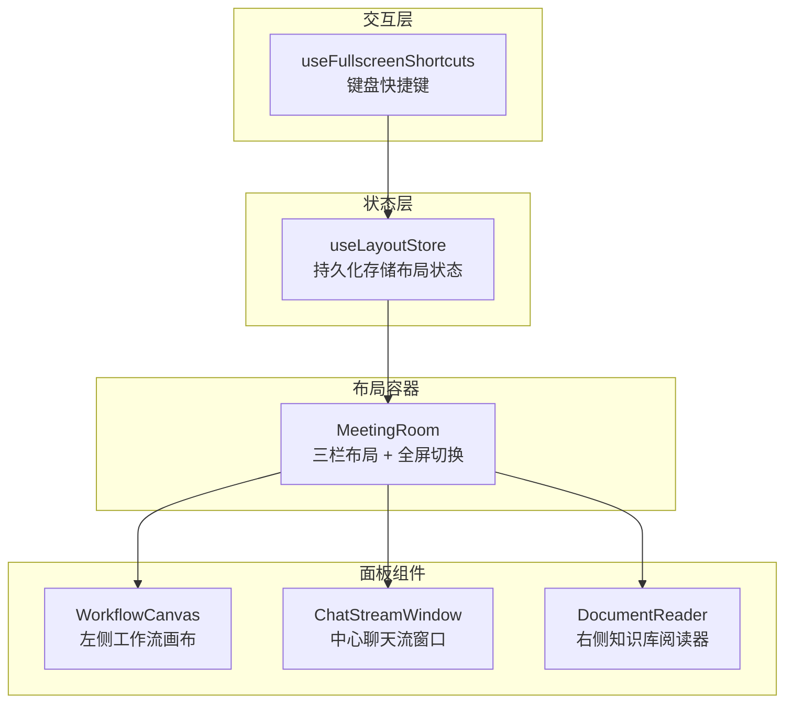
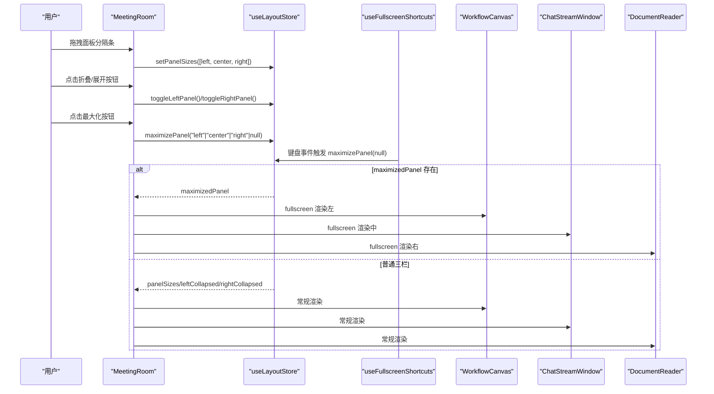
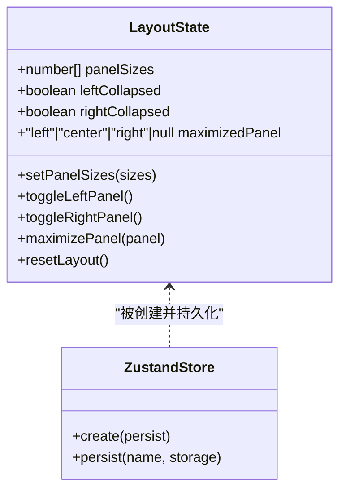
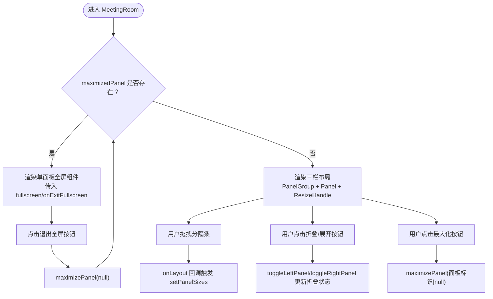
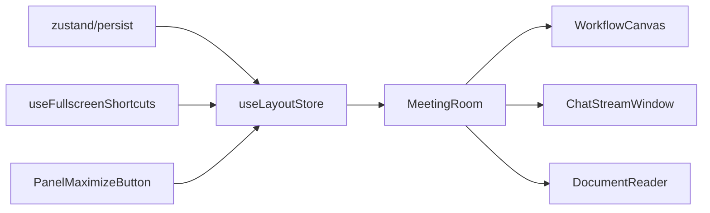

# UI布局状态管理 (useLayoutStore)

<cite>
**本文引用的文件**
- [useLayoutStore.ts](file://frontend/src/stores/useLayoutStore.ts)
- [MeetingRoom.tsx](file://frontend/src/features/meeting/MeetingRoom.tsx)
- [ChatStreamWindow.tsx](file://frontend/src/components/modules/ChatStreamWindow.tsx)
- [useFullscreenShortcuts.ts](file://frontend/src/hooks/useFullscreenShortcuts.ts)
- [WorkflowCanvas.tsx](file://frontend/src/components/workflow/WorkflowCanvas.tsx)
- [DocumentReader.tsx](file://frontend/src/components/modules/DocumentReader.tsx)
- [ChatPanel.tsx](file://frontend/src/components/chat/ChatPanel.tsx)
- [test-setup.ts](file://frontend/src/test-setup.ts)
</cite>

## 目录
1. [简介](#简介)
2. [项目结构](#项目结构)
3. [核心组件](#核心组件)
4. [架构总览](#架构总览)
5. [详细组件分析](#详细组件分析)
6. [依赖关系分析](#依赖关系分析)
7. [性能考量](#性能考量)
8. [故障排查指南](#故障排查指南)
9. [结论](#结论)

## 简介
本文件系统性阐述 useLayoutStore 的功能与实现，重点说明其如何持久化存储并驱动 UI 布局状态，包括：
- 面板尺寸（panelSizes）
- 折叠状态（leftCollapsed、rightCollapsed）
- 最大化面板（maximizedPanel）

同时覆盖以下操作如何响应用户交互：
- setPanelSizes：由拖拽调整三栏布局后写入新尺寸
- toggleLeftPanel / toggleRightPanel：折叠/展开左右侧面板
- maximizePanel：进入/退出单面板全屏模式
- resetLayout：恢复默认布局

最后解释这些状态如何驱动前端组件（如 ChatStreamWindow）进行动态渲染，并提供常见问题排查建议。

## 项目结构
useLayoutStore 位于前端 stores 层，MeetingRoom 作为主布局容器消费该状态；ChatStreamWindow、WorkflowCanvas、DocumentReader 等组件在不同模式下（普通/全屏）根据状态动态渲染。

图表来源
- [useLayoutStore.ts](file://frontend/src/stores/useLayoutStore.ts#L1-L43)
- [MeetingRoom.tsx](file://frontend/src/features/meeting/MeetingRoom.tsx#L1-L233)
- [useFullscreenShortcuts.ts](file://frontend/src/hooks/useFullscreenShortcuts.ts#L1-L57)
- [WorkflowCanvas.tsx](file://frontend/src/components/workflow/WorkflowCanvas.tsx#L1-L149)
- [ChatStreamWindow.tsx](file://frontend/src/components/modules/ChatStreamWindow.tsx#L1-L39)
- [DocumentReader.tsx](file://frontend/src/components/modules/DocumentReader.tsx#L1-L17)

章节来源
- [useLayoutStore.ts](file://frontend/src/stores/useLayoutStore.ts#L1-L43)
- [MeetingRoom.tsx](file://frontend/src/features/meeting/MeetingRoom.tsx#L1-L233)

## 核心组件
- useLayoutStore：定义并导出布局状态与操作，包含默认面板尺寸、折叠状态、最大化面板以及 setPanelSizes、toggleLeftPanel、toggleRightPanel、maximizePanel、resetLayout。
- MeetingRoom：主布局容器，使用 react-resizable-panels 组件实现三栏布局，绑定 onLayout 回调以更新 panelSizes；根据 maximizedPanel 决定全屏渲染或常规三栏布局。
- ChatStreamWindow：中心聊天流窗口，在全屏模式下通过 fullscreen/onExitFullscreen 接口与布局状态联动。
- useFullscreenShortcuts：全局键盘快捷键钩子，支持 Esc 退出全屏、Ctrl/Cmd+1/2/3 切换各面板最大化。
- WorkflowCanvas / DocumentReader：左右侧面板内容组件，支持全屏模式下的退出按钮。

章节来源
- [useLayoutStore.ts](file://frontend/src/stores/useLayoutStore.ts#L1-L43)
- [MeetingRoom.tsx](file://frontend/src/features/meeting/MeetingRoom.tsx#L138-L231)
- [ChatStreamWindow.tsx](file://frontend/src/components/modules/ChatStreamWindow.tsx#L1-L39)
- [useFullscreenShortcuts.ts](file://frontend/src/hooks/useFullscreenShortcuts.ts#L1-L57)
- [WorkflowCanvas.tsx](file://frontend/src/components/workflow/WorkflowCanvas.tsx#L120-L149)
- [DocumentReader.tsx](file://frontend/src/components/modules/DocumentReader.tsx#L1-L17)

## 架构总览
useLayoutStore 通过持久化中间件将布局状态保存到浏览器本地存储，确保用户刷新页面后仍保持上次的布局偏好。MeetingRoom 作为布局协调者，将状态映射为 UI 行为：拖拽改变尺寸、折叠/展开面板、最大化单面板全屏。

图表来源
- [useLayoutStore.ts](file://frontend/src/stores/useLayoutStore.ts#L1-L43)
- [MeetingRoom.tsx](file://frontend/src/features/meeting/MeetingRoom.tsx#L138-L231)
- [useFullscreenShortcuts.ts](file://frontend/src/hooks/useFullscreenShortcuts.ts#L1-L57)
- [WorkflowCanvas.tsx](file://frontend/src/components/workflow/WorkflowCanvas.tsx#L120-L149)
- [ChatStreamWindow.tsx](file://frontend/src/components/modules/ChatStreamWindow.tsx#L1-L39)
- [DocumentReader.tsx](file://frontend/src/components/modules/DocumentReader.tsx#L1-L17)

## 详细组件分析

### useLayoutStore 状态模型与持久化
- 默认值
  - panelSizes：初始三栏比例 [left, center, right]
  - leftCollapsed / rightCollapsed：初始均未折叠
  - maximizedPanel：初始为空，表示未进入全屏模式
- 操作接口
  - setPanelSizes：接收新的三栏尺寸数组并写入状态
  - toggleLeftPanel / toggleRightPanel：切换对应侧面板折叠状态
  - maximizePanel：设置当前最大化的面板或退出全屏
  - resetLayout：恢复默认布局（尺寸、折叠、最大化）
- 持久化机制
  - 使用 persist 中间件与 JSONStorage 将状态保存到 localStorage，键名为 council-layout

图表来源
- [useLayoutStore.ts](file://frontend/src/stores/useLayoutStore.ts#L1-L43)

章节来源
- [useLayoutStore.ts](file://frontend/src/stores/useLayoutStore.ts#L1-L43)

### MeetingRoom 布局协调与交互
- 三栏布局
  - 使用 react-resizable-panels 的 PanelGroup/Panel/PanelResizeHandle 实现
  - onLayout 回调绑定到 setPanelSizes，实现拖拽后自动保存尺寸
  - 各 Panel 的 defaultSize 来自 panelSizes，minSize 设置保证最小可视宽度
  - 左右 Panel 设置 collapsible 并监听 onCollapse/onExpand，同步 leftCollapsed/rightCollapsed
- 全屏模式
  - 当 maximizedPanel 非空时，仅渲染对应面板组件并传入 fullscreen 与 onExitFullscreen
  - 退出全屏通过回调调用 maximizePanel(null) 清空最大化状态
- 辅助交互
  - PanelMaximizeButton：每个面板右上角的放大/缩小按钮，点击切换最大化状态
  - CenterExpandTrigger：当左右面板折叠时，在中心面板显示“展开”触发器，便于快速恢复
  - SidebarCollapseTrigger：当面板展开时显示“折叠”触发器，便于快速收起

图表来源
- [MeetingRoom.tsx](file://frontend/src/features/meeting/MeetingRoom.tsx#L138-L231)
- [useLayoutStore.ts](file://frontend/src/stores/useLayoutStore.ts#L1-L43)

章节来源
- [MeetingRoom.tsx](file://frontend/src/features/meeting/MeetingRoom.tsx#L1-L233)

### ChatStreamWindow 动态渲染与全屏联动
- props
  - fullscreen：是否处于全屏模式
  - onExitFullscreen：退出全屏回调
- 行为
  - 在全屏模式下增加内边距与固定定位，适配全屏展示
  - 提供退出全屏按钮，点击后调用 onExitFullscreen
- 与布局状态的关系
  - 当 maximizedPanel 为 center 时，MeetingRoom 会传入 fullscreen 与 onExitFullscreen，从而驱动 ChatStreamWindow 的全屏渲染

章节来源
- [ChatStreamWindow.tsx](file://frontend/src/components/modules/ChatStreamWindow.tsx#L1-L39)
- [MeetingRoom.tsx](file://frontend/src/features/meeting/MeetingRoom.tsx#L138-L151)

### 键盘快捷键与全屏控制
- Esc：退出当前全屏（若已最大化）
- Ctrl/Cmd + 1/2/3：在当前面板与全屏之间切换（1=左，2=中，3=右）
- 通过 useFullscreenShortcuts 注入全局键盘事件监听，统一调用 maximizePanel

章节来源
- [useFullscreenShortcuts.ts](file://frontend/src/hooks/useFullscreenShortcuts.ts#L1-L57)
- [MeetingRoom.tsx](file://frontend/src/features/meeting/MeetingRoom.tsx#L138-L151)

### 重置布局 resetLayout
- resetLayout 将布局恢复到默认状态：panelSizes 恢复为默认比例，leftCollapsed/rightCollapsed 复位，maximizedPanel 清空
- 应用场景
  - 用户手动重置布局
  - 测试环境初始化（配合 test-setup.ts 对 localStorage 进行模拟）

章节来源
- [useLayoutStore.ts](file://frontend/src/stores/useLayoutStore.ts#L1-L43)
- [test-setup.ts](file://frontend/src/test-setup.ts#L1-L18)

## 依赖关系分析
- useLayoutStore 依赖 zustand 与 zustand/persist，持久化键名 council-layout
- MeetingRoom 依赖 react-resizable-panels，使用 PanelGroup/Panel/PanelResizeHandle
- PanelMaximizeButton 依赖 useLayoutStore，用于切换最大化状态
- useFullscreenShortcuts 依赖 useLayoutStore，用于键盘快捷键控制
- 各面板组件（WorkflowCanvas/ChatStreamWindow/DocumentReader）在全屏模式下共享同一退出逻辑

图表来源
- [useLayoutStore.ts](file://frontend/src/stores/useLayoutStore.ts#L1-L43)
- [MeetingRoom.tsx](file://frontend/src/features/meeting/MeetingRoom.tsx#L1-L233)
- [useFullscreenShortcuts.ts](file://frontend/src/hooks/useFullscreenShortcuts.ts#L1-L57)
- [WorkflowCanvas.tsx](file://frontend/src/components/workflow/WorkflowCanvas.tsx#L1-L149)
- [ChatStreamWindow.tsx](file://frontend/src/components/modules/ChatStreamWindow.tsx#L1-L39)
- [DocumentReader.tsx](file://frontend/src/components/modules/DocumentReader.tsx#L1-L17)

章节来源
- [useLayoutStore.ts](file://frontend/src/stores/useLayoutStore.ts#L1-L43)
- [MeetingRoom.tsx](file://frontend/src/features/meeting/MeetingRoom.tsx#L1-L233)

## 性能考量
- 状态粒度小且集中：useLayoutStore 仅维护布局相关状态，避免冗余订阅
- 拖拽与重绘：PanelGroup 的 onLayout 回调在拖拽结束时触发，减少频繁 setState
- 全屏切换：仅在 maximizedPanel 非空时渲染单面板，降低 DOM 结构复杂度
- 持久化开销：localStorage 存储轻量，但应避免在高频事件中反复写入（例如拖拽过程）

## 故障排查指南
- 拖拽后布局不保存
  - 检查 MeetingRoom 是否正确绑定 onLayout 到 setPanelSizes
  - 确认 localStorage 可用且未被浏览器隐私模式限制
- 折叠/展开无效
  - 确认 Panel 的 onCollapse/onExpand 是否触发了 toggleLeftPanel/toggleRightPanel
  - 检查 Panel 的 collapsible 与 collapsedSize 配置
- 全屏无法退出
  - 检查 PanelMaximizeButton 或键盘快捷键是否调用了 maximizePanel(null)
  - 确认退出按钮回调链路正确传递到 onExitFullscreen
- 重置布局无效
  - 确认 resetLayout 是否被调用
  - 若在测试中，确认 test-setup.ts 已注入 localStorage 模拟

章节来源
- [MeetingRoom.tsx](file://frontend/src/features/meeting/MeetingRoom.tsx#L138-L231)
- [useFullscreenShortcuts.ts](file://frontend/src/hooks/useFullscreenShortcuts.ts#L1-L57)
- [useLayoutStore.ts](file://frontend/src/stores/useLayoutStore.ts#L1-L43)
- [test-setup.ts](file://frontend/src/test-setup.ts#L1-L18)

## 结论
useLayoutStore 以简洁的状态模型与持久化机制，为会议室主界面提供了稳定可靠的布局控制能力。通过 MeetingRoom 的协调与各面板组件的动态渲染，用户可以灵活地调整三栏布局、折叠侧边、最大化单面板，并在需要时一键恢复默认布局。结合键盘快捷键与全屏模式，整体交互体验高效一致。