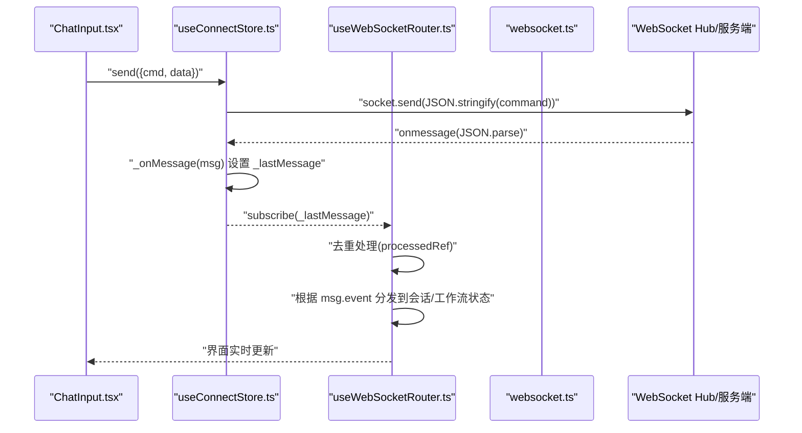
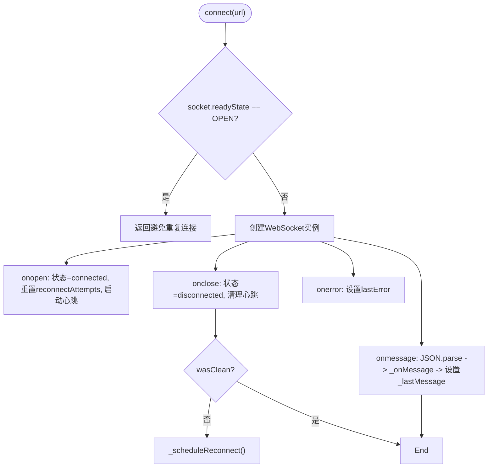
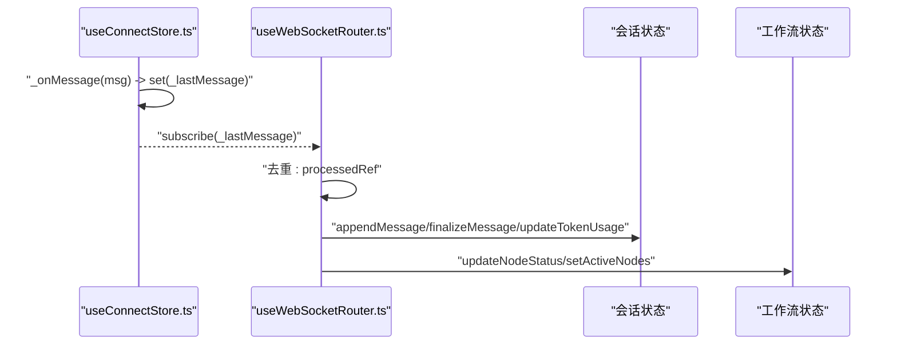
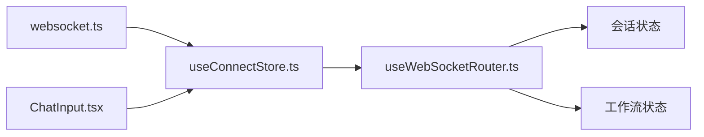

# WebSocket连接管理 (useConnectStore)

<cite>
**本文引用的文件**
- [useConnectStore.ts](file://frontend/src/stores/useConnectStore.ts)
- [useWebSocketRouter.ts](file://frontend/src/hooks/useWebSocketRouter.ts)
- [websocket.ts](file://frontend/src/types/websocket.ts)
- [SPEC-005-websocket-optimization.md](file://docs/specs/sprint1/SPEC-005-websocket-optimization.md)
- [SPEC-703-session-ws-connect-fix.md](file://docs/specs/sprint7/SPEC-703-session-ws-connect-fix.md)
- [ChatInput.tsx](file://frontend/src/components/chat/ChatInput.tsx)
</cite>

## 目录
1. [引言](#引言)
2. [项目结构](#项目结构)
3. [核心组件](#核心组件)
4. [架构总览](#架构总览)
5. [详细组件分析](#详细组件分析)
6. [依赖关系分析](#依赖关系分析)
7. [性能考量](#性能考量)
8. [故障排查指南](#故障排查指南)
9. [结论](#结论)
10. [附录](#附录)

## 引言
本文件围绕前端WebSocket连接管理的核心实现 useConnectStore 展开，系统性剖析其健壮性设计：连接与断开生命周期管理、自动重连机制（含指数退避与最大重试次数）、心跳检测（ping）维持长连接、发送消息前的状态检查，以及_lastMessage与useWebSocketRouter的集成，确保实时数据可靠传递。文档同时结合规范与实际使用场景，提供可操作的排障建议与最佳实践。

## 项目结构
- 连接管理：useConnectStore（Zustand状态管理，封装WebSocket生命周期）
- 消息路由：useWebSocketRouter（基于_zustand订阅_lastMessage，将事件分发至业务store）
- 类型定义：websocket.ts（下行事件、上行命令、消息结构）
- 规范与修复：SPEC-005-websocket-optimization.md、SPEC-703-session-ws-connect-fix.md
- 使用示例：ChatInput.tsx（通过send发送用户输入）

```mermaid
graph TB
subgraph "前端"
A["useConnectStore.ts<br/>连接管理/重连/心跳/发送"]
B["useWebSocketRouter.ts<br/>消息路由/去重/分发"]
C["websocket.ts<br/>事件/命令类型定义"]
D["ChatInput.tsx<br/>发送用户输入"]
end
subgraph "后端"
E["WebSocket Hub/服务端"]
end
D --> |"send(cmd)"| A
A -- "onmessage(JSON.parse)" --> B
B -- "appendMessage/updateNodeStatus/..." --> |"业务store"| F["会话/工作流状态"]
A -- "connect/disconnect" --> E
A -- "心跳 ping" --> E
```

图表来源
- [useConnectStore.ts](file://frontend/src/stores/useConnectStore.ts#L1-L127)
- [useWebSocketRouter.ts](file://frontend/src/hooks/useWebSocketRouter.ts#L1-L126)
- [websocket.ts](file://frontend/src/types/websocket.ts#L1-L52)
- [ChatInput.tsx](file://frontend/src/components/chat/ChatInput.tsx#L1-L35)

章节来源
- [useConnectStore.ts](file://frontend/src/stores/useConnectStore.ts#L1-L127)
- [useWebSocketRouter.ts](file://frontend/src/hooks/useWebSocketRouter.ts#L1-L126)
- [websocket.ts](file://frontend/src/types/websocket.ts#L1-L52)
- [SPEC-005-websocket-optimization.md](file://docs/specs/sprint1/SPEC-005-websocket-optimization.md#L1-L204)
- [SPEC-703-session-ws-connect-fix.md](file://docs/specs/sprint7/SPEC-703-session-ws-connect-fix.md#L37-L181)

## 核心组件
- useConnectStore：统一管理WebSocket实例、连接状态、错误、重连尝试次数、_lastMessage，并提供connect/disconnect/send等动作，内部实现心跳与自动重连。
- useWebSocketRouter：订阅_lastMessage，对消息进行去重与路由分发，驱动会话与工作流状态更新。
- websocket.ts：定义下行事件类型、上行命令类型及消息结构，保证前后端协议一致。

章节来源
- [useConnectStore.ts](file://frontend/src/stores/useConnectStore.ts#L1-L127)
- [useWebSocketRouter.ts](file://frontend/src/hooks/useWebSocketRouter.ts#L1-L126)
- [websocket.ts](file://frontend/src/types/websocket.ts#L1-L52)

## 架构总览
下图展示从UI到连接管理再到消息路由的整体交互流程，体现“连接管理”“消息路由”“业务状态”的职责分离与协作。



图表来源
- [useConnectStore.ts](file://frontend/src/stores/useConnectStore.ts#L1-L127)
- [useWebSocketRouter.ts](file://frontend/src/hooks/useWebSocketRouter.ts#L1-L126)
- [websocket.ts](file://frontend/src/types/websocket.ts#L1-L52)
- [ChatInput.tsx](file://frontend/src/components/chat/ChatInput.tsx#L1-L35)

## 详细组件分析

### useConnectStore：连接生命周期与健壮性设计
- 生命周期管理
  - connect(url)：若当前socket未处于OPEN状态则新建WebSocket；onopen切换状态为connected并启动心跳；onclose根据是否干净关闭决定是否触发重连；onerror记录lastError；onmessage解析为WSMessage后调用_onMessage设置_lastMessage。
  - disconnect()：清理心跳与重连定时器，主动关闭socket并重置状态。
  - send(command)：仅在connected状态下发送，否则给出警告。
- 自动重连机制（_scheduleReconnect）
  - 采用指数退避策略：每次重连延迟RECONNECT_DELAY*(attempt+1)，attempt从0递增。
  - 最大重试次数限制：超过MAX_RECONNECT_ATTEMPTS后停止重连并设置lastError。
  - 重连触发条件：非干净关闭（wasClean=false）时触发。
- 心跳检测（_startHeartbeat）
  - 定期向服务端发送ping命令，保持长连接活性；在connect成功后启动，在断开时清理定时器。
- _lastMessage与useWebSocketRouter集成
  - _onMessage仅负责设置_lastMessage，不直接处理业务逻辑，避免耦合。
  - useWebSocketRouter通过subscribeWithSelector监听_lastMessage，实现轻量、高效的路由与去重。



图表来源
- [useConnectStore.ts](file://frontend/src/stores/useConnectStore.ts#L1-L127)

章节来源
- [useConnectStore.ts](file://frontend/src/stores/useConnectStore.ts#L1-L127)
- [SPEC-005-websocket-optimization.md](file://docs/specs/sprint1/SPEC-005-websocket-optimization.md#L107-L204)

### 自动重连机制：指数退避与最大重试次数
- 指数退避策略
  - delay = RECONNECT_DELAY * (attempt + 1)，attempt从0开始，首次延迟RECONNECT_DELAY，随后线性增长。
- 最大重试次数
  - 当attempt达到MAX_RECONNECT_ATTEMPTS时，停止继续重连并设置lastError，防止无限占用资源。
- 触发时机
  - 仅在非干净关闭时触发，避免网络正常断开时的无效重连。

章节来源
- [useConnectStore.ts](file://frontend/src/stores/useConnectStore.ts#L1-L127)
- [SPEC-005-websocket-optimization.md](file://docs/specs/sprint1/SPEC-005-websocket-optimization.md#L107-L204)

### 心跳检测：维持长连接
- 心跳周期
  - 每HEARTBEAT_INTERVAL毫秒发送一次ping命令，保持连接活性。
- 清理策略
  - onclose中清理心跳定时器，避免内存泄漏。
- 作用
  - 提升弱网环境下的稳定性，及时发现连接异常并触发重连。

章节来源
- [useConnectStore.ts](file://frontend/src/stores/useConnectStore.ts#L1-L127)
- [SPEC-005-websocket-optimization.md](file://docs/specs/sprint1/SPEC-005-websocket-optimization.md#L107-L204)

### 发送消息前的状态检查
- send(command)在connected状态下才发送，否则输出警告，避免在断开或重连中发送造成异常。
- 该检查与connect中的readyState保护共同构成健壮的发送前置条件。

章节来源
- [useConnectStore.ts](file://frontend/src/stores/useConnectStore.ts#L1-L127)

### _lastMessage与useWebSocketRouter的集成
- _lastMessage的作用
  - 作为Zustand状态中的“最近一条消息”，供useWebSocketRouter订阅，避免各组件各自监听与重复处理。
- 去重与路由
  - useWebSocketRouter内部使用processedRef对消息进行去重（基于event+timestamp），再根据event分发到会话与工作流状态，最终驱动UI更新。
- 业务解耦
  - 连接层只负责收发与状态，业务逻辑集中在路由层，降低耦合度。



图表来源
- [useConnectStore.ts](file://frontend/src/stores/useConnectStore.ts#L1-L127)
- [useWebSocketRouter.ts](file://frontend/src/hooks/useWebSocketRouter.ts#L1-L126)

章节来源
- [useConnectStore.ts](file://frontend/src/stores/useConnectStore.ts#L1-L127)
- [useWebSocketRouter.ts](file://frontend/src/hooks/useWebSocketRouter.ts#L1-L126)

### 使用示例：ChatInput.tsx
- ChatInput通过useConnectStore的send发送用户输入命令（如user_input），由后端广播回消息，再经路由分发到会话状态，实现流式渲染与节点状态联动。

章节来源
- [ChatInput.tsx](file://frontend/src/components/chat/ChatInput.tsx#L1-L35)

## 依赖关系分析
- 组件内聚与耦合
  - useConnectStore高内聚于连接管理，低耦合于业务逻辑，通过_lastMessage与useWebSocketRouter解耦。
  - useWebSocketRouter专注于消息路由与去重，依赖websocket.ts的类型定义。
- 外部依赖
  - WebSocket原生API、Zustand（状态管理与subscribeWithSelector）、浏览器环境（window.location用于动态构建URL）。
- 潜在循环依赖
  - 无直接循环依赖；连接管理与路由通过状态共享间接协作。



图表来源
- [useConnectStore.ts](file://frontend/src/stores/useConnectStore.ts#L1-L127)
- [useWebSocketRouter.ts](file://frontend/src/hooks/useWebSocketRouter.ts#L1-L126)
- [websocket.ts](file://frontend/src/types/websocket.ts#L1-L52)
- [ChatInput.tsx](file://frontend/src/components/chat/ChatInput.tsx#L1-L35)

章节来源
- [useConnectStore.ts](file://frontend/src/stores/useConnectStore.ts#L1-L127)
- [useWebSocketRouter.ts](file://frontend/src/hooks/useWebSocketRouter.ts#L1-L126)
- [websocket.ts](file://frontend/src/types/websocket.ts#L1-L52)
- [ChatInput.tsx](file://frontend/src/components/chat/ChatInput.tsx#L1-L35)

## 性能考量
- 心跳频率与带宽
  - 心跳间隔HEARTBEAT_INTERVAL较长，减少不必要的网络开销；可根据网络质量调整。
- 重连退避
  - 指数退避降低服务器压力，避免雪崩效应；合理设置RECONNECT_DELAY与MAX_RECONNECT_ATTEMPTS。
- 消息去重
  - processedRef去重避免重复渲染与状态更新，提升UI性能与一致性。
- 发送前检查
  - send在非connected时直接拒绝，避免无效IO与潜在异常。

## 故障排查指南
- 连接无法建立
  - 检查connect(url)是否被正确调用；确认URL是否随环境变化（见SPEC-703修复说明）。
  - 查看lastError与status，定位onerror或onclose原因。
- 连接频繁断开
  - 关注非干净关闭（wasClean=false）触发的重连；检查网络波动与心跳是否正常。
  - 若超过最大重试次数，确认服务端是否稳定或防火墙策略。
- 消息未到达
  - 确认_onMessage是否设置_lastMessage；检查useWebSocketRouter是否订阅_lastMessage。
  - 检查消息event是否在路由表中，以及processedRef是否因重复而被忽略。
- 发送失败
  - send仅在connected时有效；若提示“不可发送”，检查当前状态与readyState。
- URL动态构建风险
  - 不同环境（http/https）与主机名差异可能导致连接失败；参考SPEC-703修复方案，使用window.location动态拼接。

章节来源
- [SPEC-703-session-ws-connect-fix.md](file://docs/specs/sprint7/SPEC-703-session-ws-connect-fix.md#L37-L181)
- [useConnectStore.ts](file://frontend/src/stores/useConnectStore.ts#L1-L127)
- [useWebSocketRouter.ts](file://frontend/src/hooks/useWebSocketRouter.ts#L1-L126)

## 结论
useConnectStore以清晰的生命周期管理、稳健的指数退避重连、持续的心跳保活与严格的发送前检查，构建了可靠的WebSocket连接层。通过_lastMessage与useWebSocketRouter的解耦集成，实现了类型安全、可维护的消息路由与业务状态更新，满足实时数据的高效、稳定传递需求。

## 附录
- 关键配置参数
  - MAX_RECONNECT_ATTEMPTS：最大重试次数
  - RECONNECT_DELAY：基础重连延迟
  - HEARTBEAT_INTERVAL：心跳间隔
- 相关规范与修复
  - SPEC-005-websocket-optimization.md：连接管理与路由设计
  - SPEC-703-session-ws-connect-fix.md：会话与连接修复方案

章节来源
- [SPEC-005-websocket-optimization.md](file://docs/specs/sprint1/SPEC-005-websocket-optimization.md#L1-L204)
- [SPEC-703-session-ws-connect-fix.md](file://docs/specs/sprint7/SPEC-703-session-ws-connect-fix.md#L37-L181)