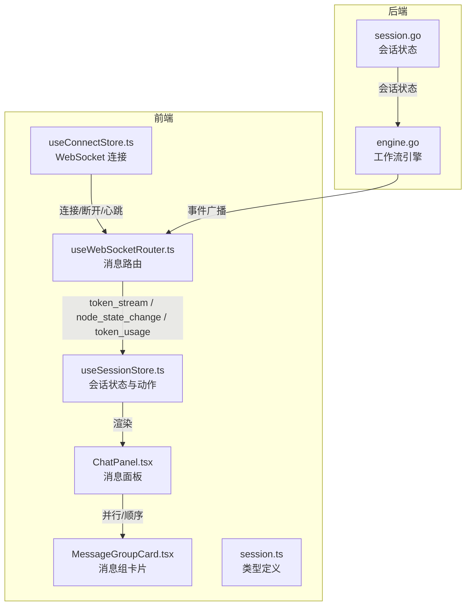
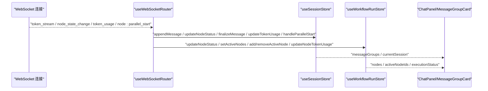
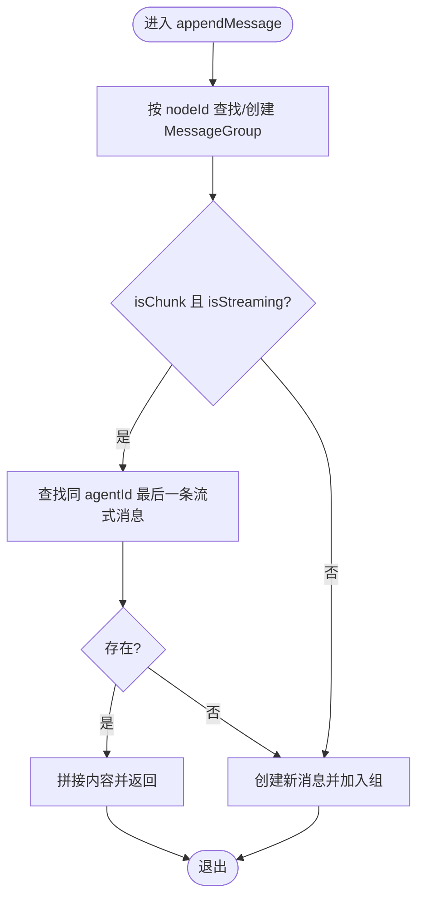
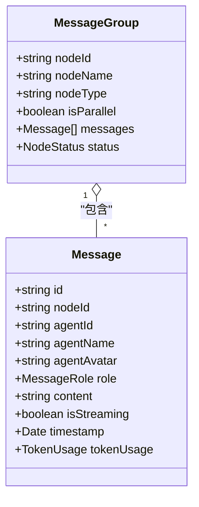
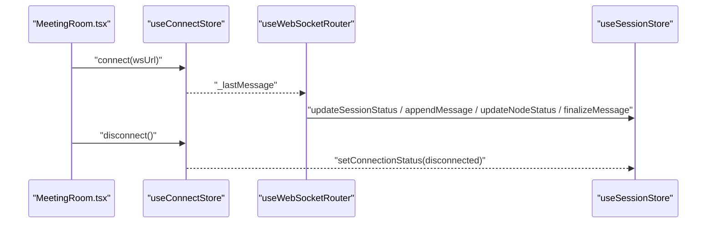
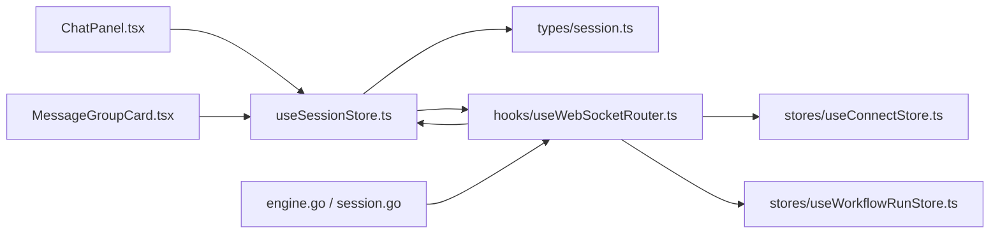

# 会话状态管理 (useSessionStore)

<cite>
**本文引用的文件**
- [useSessionStore.ts](file://frontend/src/stores/useSessionStore.ts)
- [session.ts](file://frontend/src/types/session.ts)
- [useWebSocketRouter.ts](file://frontend/src/hooks/useWebSocketRouter.ts)
- [useConnectStore.ts](file://frontend/src/stores/useConnectStore.ts)
- [SPEC-001-session-store.md](file://docs/specs/sprint1/SPEC-001-session-store.md)
- [SPEC-004-parallel-message-ui.md](file://docs/specs/sprint1/SPEC-004-parallel-message-ui.md)
- [SPEC-005-websocket-optimization.md](file://docs/specs/sprint1/SPEC-005-websocket-optimization.md)
- [SPEC-703-session-ws-connect-fix.md](file://docs/specs/sprint7/SPEC-703-session-ws-connect-fix.md)
- [ChatPanel.tsx](file://frontend/src/components/chat/ChatPanel.tsx)
- [MessageGroupCard.tsx](file://frontend/src/components/chat/MessageGroupCard.tsx)
- [engine.go](file://internal/core/workflow/engine.go)
- [session.go](file://internal/core/workflow/session.go)
</cite>

## 目录
1. [简介](#简介)
2. [项目结构](#项目结构)
3. [核心组件](#核心组件)
4. [架构总览](#架构总览)
5. [详细组件分析](#详细组件分析)
6. [依赖关系分析](#依赖关系分析)
7. [性能考量](#性能考量)
8. [故障排查指南](#故障排查指南)
9. [结论](#结论)
10. [附录](#附录)

## 简介
本文件围绕前端会话状态管理的核心 Store —— useSessionStore，系统性解析其实现与协作方式，重点覆盖以下方面：
- 会话生命周期管理：initSession、clearSession
- 节点状态跟踪：updateNodeStatus、setActiveNodes
- 实时消息流处理：appendMessage、finalizeMessage
- 消息分组（MessageGroup）机制：支持并行执行与流式输出
- Token 使用量与成本的实时聚合计算
- 与 WebSocket 连接状态（connectionStatus）协同工作
- 与后端工作流引擎的数据同步模式
- 状态选择器（selectors）的使用方法与性能优化建议

## 项目结构
useSessionStore 位于前端 stores 目录，配合 WebSocket 路由器、类型定义与 UI 组件共同构成会话状态管理闭环。关键文件与职责如下：
- stores/useSessionStore.ts：会话状态与动作实现
- types/session.ts：会话、节点、消息、消息组等类型定义
- hooks/useWebSocketRouter.ts：WebSocket 消息路由与分发
- stores/useConnectStore.ts：WebSocket 连接生命周期管理
- components/chat/ChatPanel.tsx、MessageGroupCard.tsx：消息分组与并行消息展示
- docs/specs/sprint1/SPEC-001-session-store.md：会话 Store 的设计规范与接口规格
- internal/core/workflow/engine.go、session.go：后端工作流引擎与会话状态同步

图表来源
- [useSessionStore.ts](file://frontend/src/stores/useSessionStore.ts#L1-L303)
- [useWebSocketRouter.ts](file://frontend/src/hooks/useWebSocketRouter.ts#L1-L126)
- [useConnectStore.ts](file://frontend/src/stores/useConnectStore.ts#L1-L114)
- [ChatPanel.tsx](file://frontend/src/components/chat/ChatPanel.tsx#L1-L77)
- [MessageGroupCard.tsx](file://frontend/src/components/chat/MessageGroupCard.tsx#L1-L39)
- [session.ts](file://frontend/src/types/session.ts#L1-L93)
- [engine.go](file://internal/core/workflow/engine.go#L100-L147)
- [session.go](file://internal/core/workflow/session.go#L1-L165)

章节来源
- [useSessionStore.ts](file://frontend/src/stores/useSessionStore.ts#L1-L303)
- [session.ts](file://frontend/src/types/session.ts#L1-L93)

## 核心组件
- 会话状态（WorkflowSession）
  - 包含会话元数据（id、workflowId、groupId、status、startedAt/completedAt）、节点映射 Map、活跃节点集合、累计统计（totalTokens、totalCostUsd）
- 消息组（MessageGroup）
  - 按节点分组的消息集合，支持 isParallel、status、nodeType 等字段
- 节点状态（NodeStateSnapshot）
  - 节点状态快照，包含 startedAt/completedAt、tokenUsage 等
- 类型别名
  - NodeStatus、SessionStatus、MessageRole 等

章节来源
- [session.ts](file://frontend/src/types/session.ts#L1-L93)

## 架构总览
useSessionStore 通过 WebSocket 路由器与后端工作流引擎进行数据同步。后端在节点状态变更、并行开始、Token 使用等事件发生时，向前端推送消息；前端通过 useWebSocketRouter 将事件转换为对 useSessionStore 与 useWorkflowRunStore 的状态更新。

图表来源
- [useWebSocketRouter.ts](file://frontend/src/hooks/useWebSocketRouter.ts#L1-L126)
- [useSessionStore.ts](file://frontend/src/stores/useSessionStore.ts#L1-L303)
- [useWorkflowRunStore.ts](file://frontend/src/stores/useWorkflowRunStore.ts#L1-L301)
- [ChatPanel.tsx](file://frontend/src/components/chat/ChatPanel.tsx#L1-L77)

## 详细组件分析

### 会话生命周期管理
- initSession
  - 初始化 currentSession，填充节点 Map（初始状态 pending），清空 messageGroups，设置 connectionStatus 为 connecting
  - 作用：为一次新的工作流执行准备会话上下文
- clearSession
  - 清空 currentSession、messageGroups、connectionStatus
  - 作用：结束会话或重置状态

章节来源
- [useSessionStore.ts](file://frontend/src/stores/useSessionStore.ts#L104-L129)
- [useSessionStore.ts](file://frontend/src/stores/useSessionStore.ts#L268-L274)

### 节点状态跟踪
- updateNodeStatus
  - 更新 currentSession.nodes 中对应节点状态；首次变为 running 时记录 startedAt，完成/失败时记录 completedAt
  - 同步更新对应 MessageGroup 的状态
- setActiveNodes
  - 设置当前活跃节点集合，用于 UI 高亮与消息组筛选

章节来源
- [useSessionStore.ts](file://frontend/src/stores/useSessionStore.ts#L145-L162)
- [useSessionStore.ts](file://frontend/src/stores/useSessionStore.ts#L164-L170)

### 实时消息流处理
- appendMessage
  - 根据 nodeId 查找或创建 MessageGroup
  - 若 isChunk 且 isStreaming，查找同一 agentId 的最后一条流式消息并拼接内容；否则创建新消息
  - 新消息包含 id、nodeId、agentId、agentName、agentAvatar、role、content、isStreaming、timestamp
- finalizeMessage
  - 将对应节点下该 agentId 的所有流式消息标记为非流式（isStreaming=false）

图表来源
- [useSessionStore.ts](file://frontend/src/stores/useSessionStore.ts#L172-L223)

章节来源
- [useSessionStore.ts](file://frontend/src/stores/useSessionStore.ts#L172-L223)
- [useSessionStore.ts](file://frontend/src/stores/useSessionStore.ts#L225-L234)

### 消息分组（MessageGroup）与并行执行
- MessageGroup
  - 字段：nodeId、nodeName、nodeType、isParallel、messages、status
  - UI 展示：MessageGroupCard 根据 isParallel 决定顺序消息或并行消息行
- 并行开始处理
  - handleParallelStart：创建并行消息组（isParallel=true），并将分支节点设为活跃
  - WebSocket 路由器在收到 node:parallel_start 事件时调用该动作

图表来源
- [session.ts](file://frontend/src/types/session.ts#L44-L54)
- [session.ts](file://frontend/src/types/session.ts#L24-L43)
- [MessageGroupCard.tsx](file://frontend/src/components/chat/MessageGroupCard.tsx#L1-L39)
- [SPEC-004-parallel-message-ui.md](file://docs/specs/sprint1/SPEC-004-parallel-message-ui.md#L43-L95)

章节来源
- [useSessionStore.ts](file://frontend/src/stores/useSessionStore.ts#L280-L300)
- [useWebSocketRouter.ts](file://frontend/src/hooks/useWebSocketRouter.ts#L48-L53)
- [SPEC-004-parallel-message-ui.md](file://docs/specs/sprint1/SPEC-004-parallel-message-ui.md#L43-L95)

### Token 使用量与成本聚合
- updateTokenUsage
  - 累加 currentSession.totalTokens、totalCostUsd
  - 累加对应节点的 tokenUsage（inputTokens、outputTokens）
  - 可选：对最近一条消息也累加 tokenUsage（store 中有相应逻辑）

章节来源
- [useSessionStore.ts](file://frontend/src/stores/useSessionStore.ts#L236-L266)
- [useWorkflowRunStore.ts](file://frontend/src/stores/useWorkflowRunStore.ts#L180-L189)

### 与 WebSocket 连接状态协同工作
- connectionStatus
  - 由 useSessionStore 管理，initSession 时置为 connecting，clearSession 时置为 disconnected
- useConnectStore
  - 管理 WebSocket 连接生命周期（connect/disconnect/send）、心跳与重连策略
- useWebSocketRouter
  - 订阅 useConnectStore 的 _lastMessage，按事件类型路由到 useSessionStore 与 useWorkflowRunStore
- 页面自动重连
  - MeetingRoom.tsx 在检测到 currentSession 存在且 WS 断开时自动发起连接

图表来源
- [useConnectStore.ts](file://frontend/src/stores/useConnectStore.ts#L1-L114)
- [useWebSocketRouter.ts](file://frontend/src/hooks/useWebSocketRouter.ts#L1-L126)
- [useSessionStore.ts](file://frontend/src/stores/useSessionStore.ts#L276-L278)
- [SPEC-703-session-ws-connect-fix.md](file://docs/specs/sprint7/SPEC-703-session-ws-connect-fix.md#L134-L158)

章节来源
- [useSessionStore.ts](file://frontend/src/stores/useSessionStore.ts#L276-L278)
- [useConnectStore.ts](file://frontend/src/stores/useConnectStore.ts#L1-L114)
- [SPEC-703-session-ws-connect-fix.md](file://docs/specs/sprint7/SPEC-703-session-ws-connect-fix.md#L134-L158)

### 与后端工作流引擎的数据同步模式
- 后端事件
  - node_state_change：节点状态变更
  - node:parallel_start：并行节点开始
  - token_stream：流式输出片段
  - token_usage：Token 使用统计
  - execution:paused/completed：执行状态
- 前端路由
  - useWebSocketRouter 将上述事件转换为对 useSessionStore 与 useWorkflowRunStore 的状态更新
- 并行执行
  - 后端工作流引擎在并行节点执行时，通过 StreamChannel 发送 node:parallel_start 事件，前端创建并行消息组并标记活跃节点

章节来源
- [useWebSocketRouter.ts](file://frontend/src/hooks/useWebSocketRouter.ts#L1-L126)
- [engine.go](file://internal/core/workflow/engine.go#L100-L147)
- [SPEC-005-websocket-optimization.md](file://docs/specs/sprint1/SPEC-005-websocket-optimization.md#L47-L103)

## 依赖关系分析
- useSessionStore 依赖
  - 类型定义：session.ts
  - UI 组件：ChatPanel.tsx、MessageGroupCard.tsx
  - WebSocket 路由：useWebSocketRouter.ts
  - 连接状态：useConnectStore.ts
- 与后端
  - 通过 WebSocket 事件与工作流引擎保持状态一致
  - 会话状态（SessionStatus）与节点状态（NodeStatus）与后端枚举对齐

图表来源
- [useSessionStore.ts](file://frontend/src/stores/useSessionStore.ts#L1-L303)
- [session.ts](file://frontend/src/types/session.ts#L1-L93)
- [useWebSocketRouter.ts](file://frontend/src/hooks/useWebSocketRouter.ts#L1-L126)
- [useConnectStore.ts](file://frontend/src/stores/useConnectStore.ts#L1-L114)
- [useWorkflowRunStore.ts](file://frontend/src/stores/useWorkflowRunStore.ts#L1-L301)
- [ChatPanel.tsx](file://frontend/src/components/chat/ChatPanel.tsx#L1-L77)
- [MessageGroupCard.tsx](file://frontend/src/components/chat/MessageGroupCard.tsx#L1-L39)
- [engine.go](file://internal/core/workflow/engine.go#L100-L147)
- [session.go](file://internal/core/workflow/session.go#L1-L165)

## 性能考量
- 选择器（Selectors）使用
  - 使用 useSessionStore(state => state.messageGroups)、useSessionStore(state => state.currentSession) 等细粒度选择器，避免无关状态变更触发重渲染
  - 提供派生选择器：selectActiveMessageGroups、selectNodeStatus、selectTotalCost，减少组件内部计算
- 渲染优化
  - ChatPanel.tsx 仅基于 messageGroups 与 currentSession 的长度变化滚动到底部，避免全量重渲染
  - 并行消息行（ParallelMessageRow）按列数网格布局，减少 DOM 层级复杂度
- 状态更新
  - 使用 Immer 中间件进行不可变更新，降低深拷贝成本
  - 将流式消息拼接与最终化操作集中在 store 内部，减少 UI 层重复逻辑
- 重连与心跳
  - useConnectStore 提供指数退避重连与心跳，降低网络抖动对 UI 的影响

章节来源
- [useSessionStore.ts](file://frontend/src/stores/useSessionStore.ts#L305-L332)
- [ChatPanel.tsx](file://frontend/src/components/chat/ChatPanel.tsx#L1-L77)
- [SPEC-004-parallel-message-ui.md](file://docs/specs/sprint1/SPEC-004-parallel-message-ui.md#L43-L95)
- [useConnectStore.ts](file://frontend/src/stores/useConnectStore.ts#L1-L114)

## 故障排查指南
- WebSocket 消息未到达
  - 检查 useWebSocketRouter 是否订阅到 useConnectStore 的 _lastMessage
  - 确认后端事件字段命名与前端类型定义一致（如 event 字段）
- 会话初始化后 UI 无响应
  - 确认 initSession 已调用并设置 connectionStatus 为 connecting
  - 确认 MeetingRoom.tsx 在 currentSession 存在且 WS 断开时自动重连
- 并行消息未显示
  - 确认收到 node:parallel_start 事件并调用 handleParallelStart
  - 确认 UI 使用 MessageGroupCard 并根据 isParallel 渲染并行消息行
- Token 统计不更新
  - 确认收到 token_usage 事件并调用 updateTokenUsage
  - 确认 UI 组件读取累计成本的派生选择器

章节来源
- [useWebSocketRouter.ts](file://frontend/src/hooks/useWebSocketRouter.ts#L1-L126)
- [SPEC-703-session-ws-connect-fix.md](file://docs/specs/sprint7/SPEC-703-session-ws-connect-fix.md#L134-L158)
- [MessageGroupCard.tsx](file://frontend/src/components/chat/MessageGroupCard.tsx#L1-L39)
- [useSessionStore.ts](file://frontend/src/stores/useSessionStore.ts#L236-L266)

## 结论
useSessionStore 通过清晰的类型定义、完善的动作与选择器，实现了会话生命周期、节点状态、消息流与 Token 统计的统一管理。结合 useWebSocketRouter 与 useConnectStore，前端能够与后端工作流引擎保持高效、稳定的实时同步。并行执行与流式输出的分组机制，使 UI 能够直观呈现多 Agent 并行与逐步生成的内容。建议在实际使用中：
- 严格使用选择器，避免不必要的重渲染
- 在 UI 层只订阅所需状态，减少组件耦合
- 保持 WebSocket 事件字段与类型定义一致，确保消息路由稳定

## 附录

### 状态选择器（Selectors）使用方法
- 获取当前活跃节点的消息组
  - 使用 selectActiveMessageGroups，基于 currentSession.activeNodeIds 与并行组状态过滤
- 获取指定节点的状态
  - 使用 selectNodeStatus(nodeId)，返回 NodeStatus 或 null
- 获取累计成本
  - 使用 selectTotalCost，返回 currentSession.totalCostUsd

章节来源
- [useSessionStore.ts](file://frontend/src/stores/useSessionStore.ts#L305-L332)

### 与后端工作流引擎的数据同步要点
- 事件映射
  - token_stream → appendMessage（流式片段）
  - node_state_change → updateNodeStatus（节点状态）
  - node:parallel_start → handleParallelStart（并行开始）
  - token_usage → updateTokenUsage（Token 统计）
  - execution:paused/completed → updateSessionStatus（会话状态）
- 并行执行
  - 后端在并行节点开始时发送 node:parallel_start，前端创建并行消息组并标记活跃节点

章节来源
- [useWebSocketRouter.ts](file://frontend/src/hooks/useWebSocketRouter.ts#L1-L126)
- [engine.go](file://internal/core/workflow/engine.go#L100-L147)