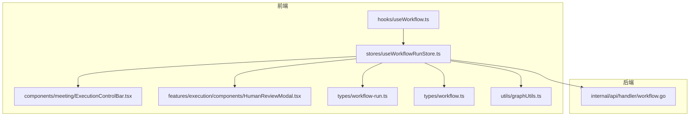
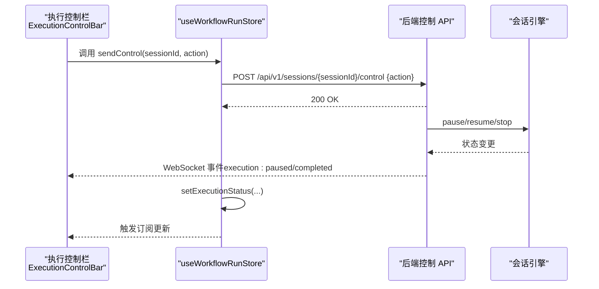
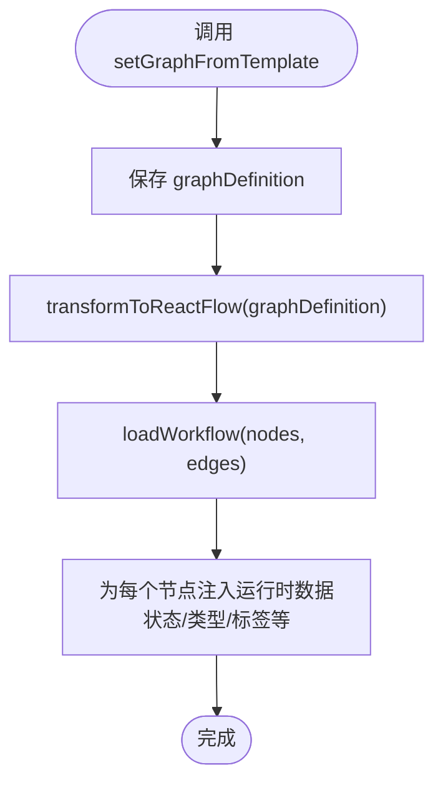
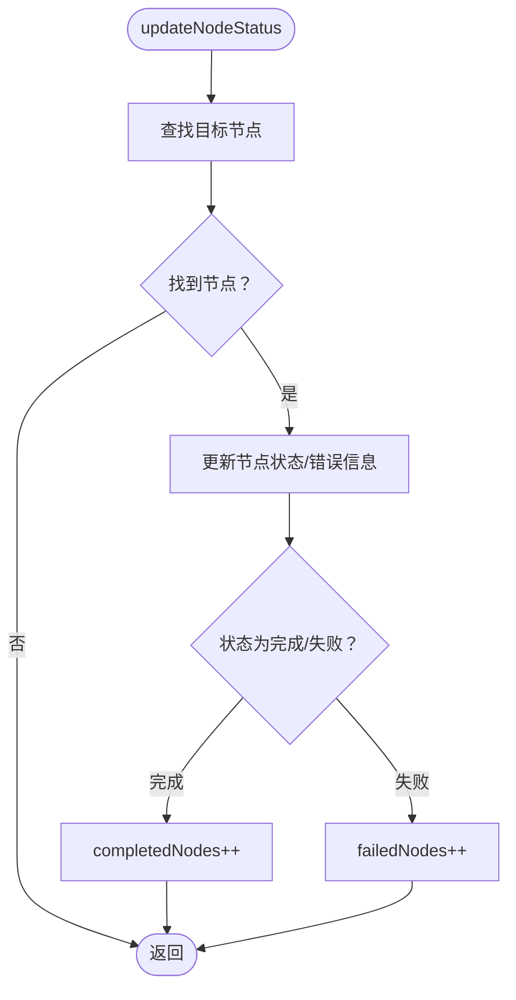
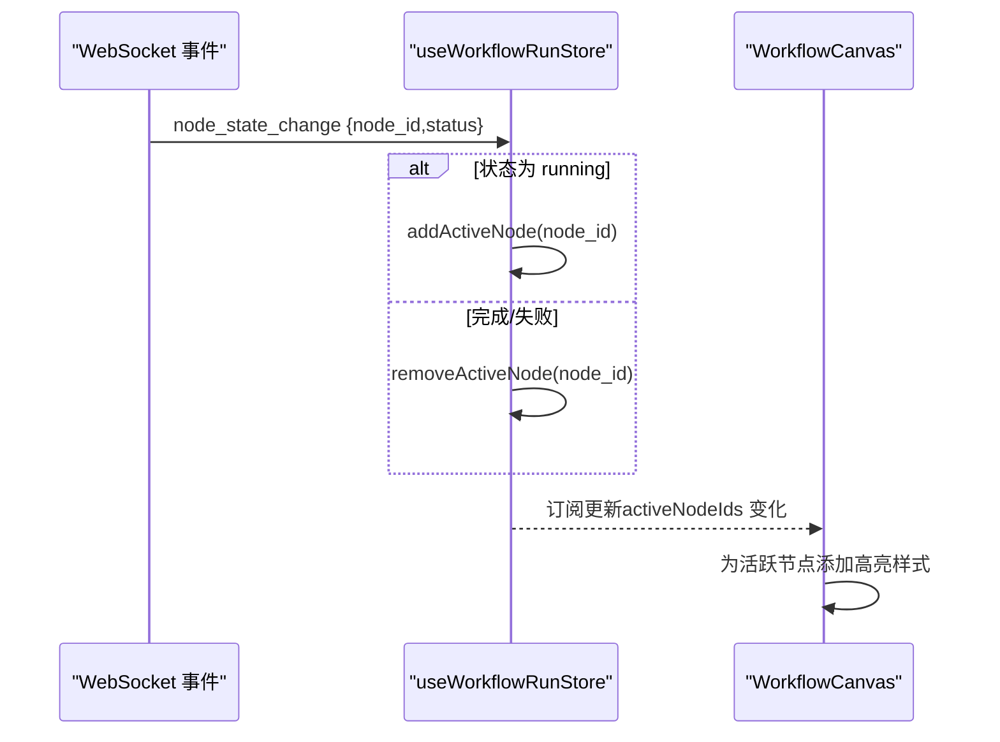
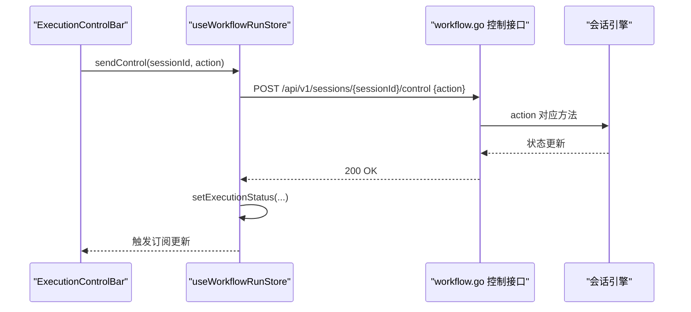
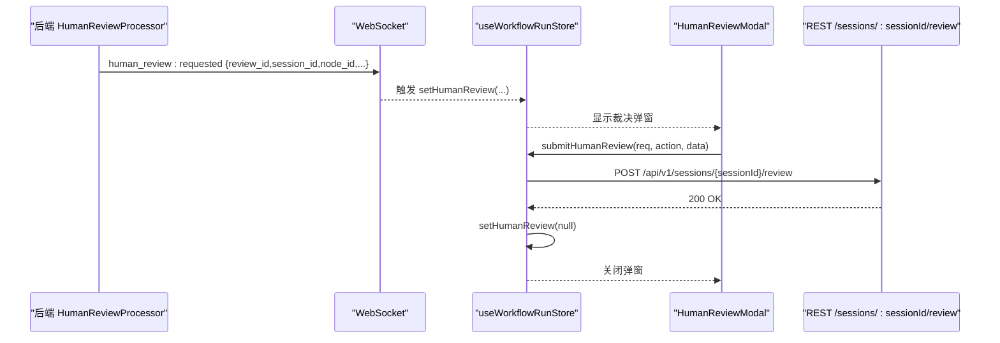
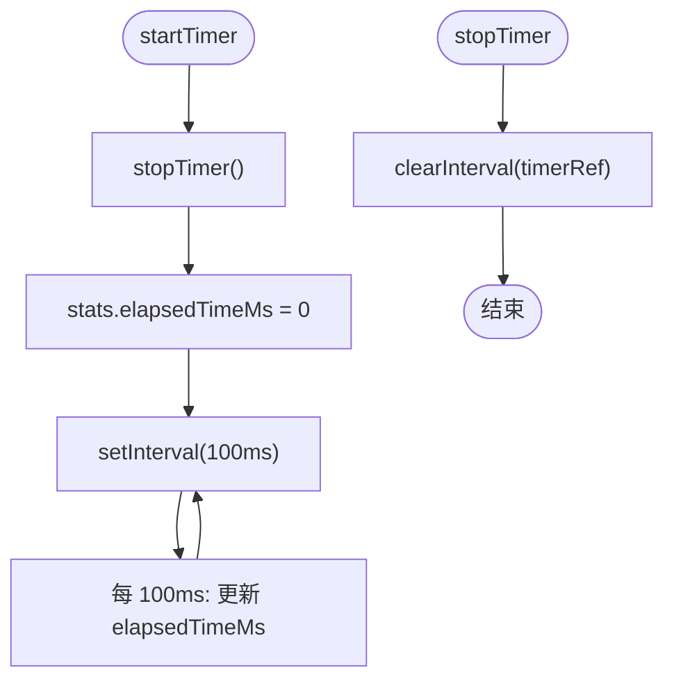
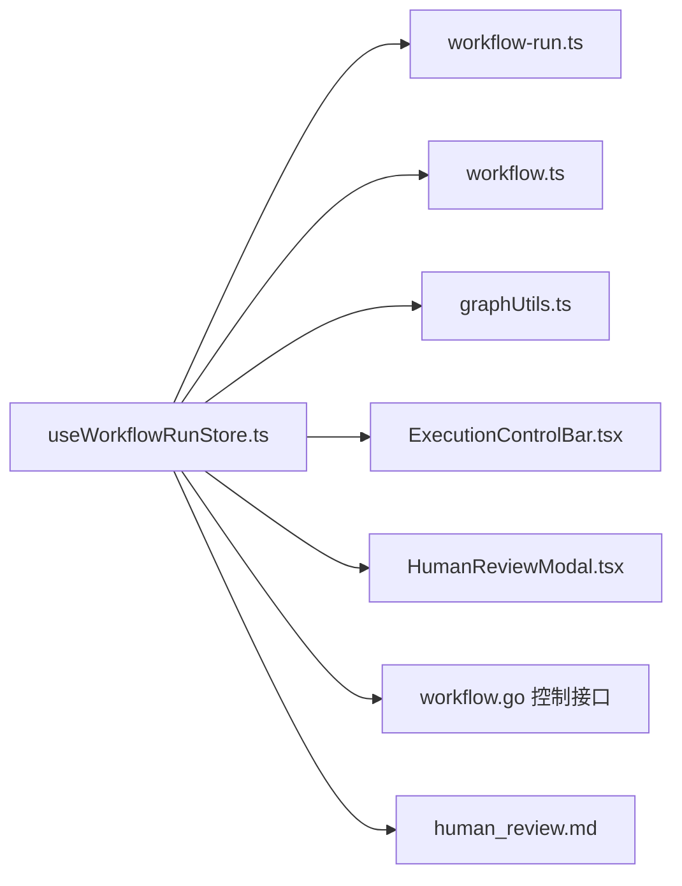

# 工作流执行管理 (useWorkflowRunStore)

<cite>
**本文引用的文件**
- [useWorkflowRunStore.ts](file://frontend/src/stores/useWorkflowRunStore.ts)
- [SPEC-002-workflow-run-store.md](file://docs/specs/sprint1/SPEC-002-workflow-run-store.md)
- [ExecutionControlBar.tsx](file://frontend/src/components/meeting/ExecutionControlBar.tsx)
- [HumanReviewModal.tsx](file://frontend/src/features/execution/components/HumanReviewModal.tsx)
- [workflow-run.ts](file://frontend/src/types/workflow-run.ts)
- [graphUtils.ts](file://frontend/src/utils/graphUtils.ts)
- [workflow.ts](file://frontend/src/types/workflow.ts)
- [useWorkflow.ts](file://frontend/src/hooks/useWorkflow.ts)
- [workflow.go](file://internal/api/handler/workflow.go)
- [SPEC-405-human-review-processor.md](file://docs/specs/backend/SPEC-405-human-review-processor.md)
- [human_review.md](file://docs/api/human_review.md)
- [SPEC-401-sequence-processor.md](file://docs/specs/backend/SPEC-401-sequence-processor.md)
- [SPEC-402-vote-processor.md](file://docs/specs/backend/SPEC-402-vote-processor.md)
- [SPEC-403-loop-processor.md](file://docs/specs/backend/SPEC-403-loop-processor.md)
- [SPEC-404-factcheck-processor.md](file://docs/specs/backend/SPEC-404-factcheck-processor.md)
- [SPEC-406-templates-api.md](file://docs/specs/backend/SPEC-406-templates-api.md)
</cite>

## 目录
1. [简介](#简介)
2. [项目结构](#项目结构)
3. [核心组件](#核心组件)
4. [架构总览](#架构总览)
5. [详细组件分析](#详细组件分析)
6. [依赖关系分析](#依赖关系分析)
7. [性能考量](#性能考量)
8. [故障排查指南](#故障排查指南)
9. [结论](#结论)
10. [附录](#附录)

## 简介
本文件系统化阐述 useWorkflowRunStore 的设计与实现，重点覆盖以下方面：
- 如何加载与管理 React Flow 图（loadWorkflow、setGraphFromTemplate）
- 执行状态与统计（executionStatus、stats）及活跃节点高亮（activeNodeIds）
- 与后端控制 API 的交互（sendControl）：暂停、恢复、停止
- 人类裁决流程（setHumanReview、submitHumanReview）的集成
- 执行计时器（startTimer、stopTimer）的实现细节
- 使用 subscribeWithSelector 中间件实现细粒度订阅的优势

该 Store 与 WebSocket 事件路由配合，驱动画布渲染、节点状态变更、并行分支高亮、成本与耗时统计等实时展示；同时通过 REST API 与后端会话引擎交互，实现对运行中的工作流进行控制。

## 项目结构
useWorkflowRunStore 位于前端 stores 层，围绕工作流运行时状态进行集中管理，并与组件层（ExecutionControlBar、HumanReviewModal）、类型层（workflow-run、workflow）、工具层（graphUtils）协同工作。

图表来源
- [useWorkflowRunStore.ts](file://frontend/src/stores/useWorkflowRunStore.ts#L1-L301)
- [ExecutionControlBar.tsx](file://frontend/src/components/meeting/ExecutionControlBar.tsx#L1-L72)
- [HumanReviewModal.tsx](file://frontend/src/features/execution/components/HumanReviewModal.tsx#L1-L91)
- [workflow-run.ts](file://frontend/src/types/workflow-run.ts#L1-L41)
- [workflow.ts](file://frontend/src/types/workflow.ts#L1-L45)
- [graphUtils.ts](file://frontend/src/utils/graphUtils.ts#L1-L131)
- [useWorkflow.ts](file://frontend/src/hooks/useWorkflow.ts#L1-L88)
- [workflow.go](file://internal/api/handler/workflow.go#L125-L169)

章节来源
- [useWorkflowRunStore.ts](file://frontend/src/stores/useWorkflowRunStore.ts#L1-L301)
- [SPEC-002-workflow-run-store.md](file://docs/specs/sprint1/SPEC-002-workflow-run-store.md#L1-L583)

## 核心组件
- 状态模型
  - nodes/edges：React Flow 节点与边集合，节点数据包含运行时状态、进度、错误、Token 使用与成本等
  - activeNodeIds：当前活跃节点集合，用于高亮并行分支
  - executionStatus：工作流执行状态（idle/running/paused/completed/failed）
  - stats：累计统计（节点总数、完成数、失败数、Token 总量、总成本、耗时）
  - graphDefinition：原始后端图定义（用于 Live Monitor）
  - humanReview：当前人类裁决请求（若存在）

- 行为接口
  - loadWorkflow：从节点/边数组初始化运行时节点（含默认状态与标签）
  - setGraphFromTemplate：从模板转换为 React Flow 图并加载
  - clearWorkflow：清空状态并停止计时器
  - updateNodeStatus：更新节点状态并维护统计
  - setActiveNodes/addActiveNode/removeActiveNode：并行分支高亮管理
  - updateNodeTokenUsage：累计 Token 用量与成本
  - setExecutionStatus：设置执行状态
  - sendControl：向后端发送控制命令（pause/resume/stop）
  - setHumanReview/submitHumanReview：人类裁决请求与提交
  - startTimer/stopTimer：执行计时器

章节来源
- [useWorkflowRunStore.ts](file://frontend/src/stores/useWorkflowRunStore.ts#L14-L117)
- [useWorkflowRunStore.ts](file://frontend/src/stores/useWorkflowRunStore.ts#L119-L147)
- [useWorkflowRunStore.ts](file://frontend/src/stores/useWorkflowRunStore.ts#L149-L189)
- [useWorkflowRunStore.ts](file://frontend/src/stores/useWorkflowRunStore.ts#L191-L225)
- [useWorkflowRunStore.ts](file://frontend/src/stores/useWorkflowRunStore.ts#L227-L257)
- [useWorkflowRunStore.ts](file://frontend/src/stores/useWorkflowRunStore.ts#L259-L293)

## 架构总览
useWorkflowRunStore 通过 subscribeWithSelector 中间件实现细粒度订阅，仅在被订阅字段变化时触发组件重渲染，从而避免不必要的画布重绘与状态同步开销。与 WebSocket 事件路由配合，Store 将后端推送的节点状态、并行开始、Token 使用、执行暂停/完成等事件映射到对应动作，驱动 UI 实时更新。

图表来源
- [ExecutionControlBar.tsx](file://frontend/src/components/meeting/ExecutionControlBar.tsx#L1-L72)
- [useWorkflowRunStore.ts](file://frontend/src/stores/useWorkflowRunStore.ts#L197-L225)
- [workflow.go](file://internal/api/handler/workflow.go#L125-L169)
- [SPEC-002-workflow-run-store.md](file://docs/specs/sprint1/SPEC-002-workflow-run-store.md#L411-L476)

## 详细组件分析

### 图加载与模板转换（loadWorkflow、setGraphFromTemplate）
- setGraphFromTemplate：先保存原始 graphDefinition，再调用 transformToReactFlow 将 BackendGraph 转换为 React Flow 的 nodes/edges，随后委托 loadWorkflow 完成运行时节点初始化（填充默认状态、标签等）
- loadWorkflow：将传入的节点数组映射为运行时节点，统一注入状态、类型、标签等字段，并记录边集合与节点总数

图表来源
- [useWorkflowRunStore.ts](file://frontend/src/stores/useWorkflowRunStore.ts#L119-L125)
- [graphUtils.ts](file://frontend/src/utils/graphUtils.ts#L20-L108)

章节来源
- [useWorkflowRunStore.ts](file://frontend/src/stores/useWorkflowRunStore.ts#L101-L117)
- [useWorkflowRunStore.ts](file://frontend/src/stores/useWorkflowRunStore.ts#L119-L125)
- [graphUtils.ts](file://frontend/src/utils/graphUtils.ts#L1-L131)

### 执行状态与统计（executionStatus、stats）
- executionStatus：驱动控制栏按钮可用性与 UI 状态展示
- stats：包含 totalNodes、completedNodes、failedNodes、totalTokens、totalCostUsd、elapsedTimeMs
- updateNodeStatus：根据节点状态更新统计（完成/失败计数）
- updateNodeTokenUsage：累计输入输出 Token 数与估算成本

图表来源
- [useWorkflowRunStore.ts](file://frontend/src/stores/useWorkflowRunStore.ts#L149-L160)

章节来源
- [useWorkflowRunStore.ts](file://frontend/src/stores/useWorkflowRunStore.ts#L149-L189)

### 活跃节点高亮（activeNodeIds）
- 并行分支开始：setActiveNodes 批量设置
- 单节点运行：addActiveNode
- 结束/失败：removeActiveNode
- WorkflowCanvas 通过增强节点 className 与 data.isActive 实现高亮动画

图表来源
- [SPEC-002-workflow-run-store.md](file://docs/specs/sprint1/SPEC-002-workflow-run-store.md#L411-L476)
- [useWorkflowRunStore.ts](file://frontend/src/stores/useWorkflowRunStore.ts#L162-L178)

章节来源
- [SPEC-002-workflow-run-store.md](file://docs/specs/sprint1/SPEC-002-workflow-run-store.md#L411-L476)
- [useWorkflowRunStore.ts](file://frontend/src/stores/useWorkflowRunStore.ts#L162-L178)

### 控制 API 交互（sendControl）
- sendControl：向 /api/v1/sessions/{sessionId}/control 发送控制命令（pause/resume/stop）
- 乐观更新：根据 action 直接切换 executionStatus，提升交互响应速度
- 后端 workflow.go：接收 action，调用会话引擎的 Pause/Resume/Stop，并返回状态

图表来源
- [useWorkflowRunStore.ts](file://frontend/src/stores/useWorkflowRunStore.ts#L197-L225)
- [workflow.go](file://internal/api/handler/workflow.go#L125-L169)
- [SPEC-002-workflow-run-store.md](file://docs/specs/sprint1/SPEC-002-workflow-run-store.md#L232-L266)

章节来源
- [useWorkflowRunStore.ts](file://frontend/src/stores/useWorkflowRunStore.ts#L197-L225)
- [workflow.go](file://internal/api/handler/workflow.go#L125-L169)

### 人类裁决流程（setHumanReview、submitHumanReview）
- setHumanReview：接收后端推送的人类裁决请求（包含 sessionId、nodeId、reason、timeout），在前端弹出 HumanReviewModal
- submitHumanReview：向 /api/v1/sessions/{sessionId}/review 提交裁决（approve/reject/modify），成功后清除裁决状态
- 后端 HumanReviewProcessor：在 HumanReview 节点生成草案、创建请求、通过 WebSocket 通知前端、等待决策或超时

图表来源
- [SPEC-405-human-review-processor.md](file://docs/specs/backend/SPEC-405-human-review-processor.md#L21-L77)
- [human_review.md](file://docs/api/human_review.md#L1-L220)
- [useWorkflowRunStore.ts](file://frontend/src/stores/useWorkflowRunStore.ts#L227-L257)
- [HumanReviewModal.tsx](file://frontend/src/features/execution/components/HumanReviewModal.tsx#L1-L91)

章节来源
- [useWorkflowRunStore.ts](file://frontend/src/stores/useWorkflowRunStore.ts#L227-L257)
- [SPEC-405-human-review-processor.md](file://docs/specs/backend/SPEC-405-human-review-processor.md#L21-L77)
- [human_review.md](file://docs/api/human_review.md#L1-L220)
- [HumanReviewModal.tsx](file://frontend/src/features/execution/components/HumanReviewModal.tsx#L1-L91)

### 执行计时器（startTimer、stopTimer）
- startTimer：停止旧计时器、重置 stats.elapsedTimeMs 为 0、每 100ms 更新一次耗时
- stopTimer：清理计时器引用
- 与 WebSocket 事件配合：execution:paused 与 execution:completed 时自动 stopTimer

图表来源
- [useWorkflowRunStore.ts](file://frontend/src/stores/useWorkflowRunStore.ts#L259-L293)
- [SPEC-002-workflow-run-store.md](file://docs/specs/sprint1/SPEC-002-workflow-run-store.md#L268-L293)

章节来源
- [useWorkflowRunStore.ts](file://frontend/src/stores/useWorkflowRunStore.ts#L259-L293)
- [SPEC-002-workflow-run-store.md](file://docs/specs/sprint1/SPEC-002-workflow-run-store.md#L268-L293)

### 与后端节点处理器的关系
- 序列/投票/循环/事实核查等节点处理器在后端按规范实现，与前端 Store 的节点状态更新、Token 使用统计、并行分支高亮等行为形成闭环
- 例如：序列处理器、投票处理器、循环处理器、事实核查处理器均在各自规范文档中定义了节点类型与行为

章节来源
- [SPEC-401-sequence-processor.md](file://docs/specs/backend/SPEC-401-sequence-processor.md#L1-L200)
- [SPEC-402-vote-processor.md](file://docs/specs/backend/SPEC-402-vote-processor.md#L1-L200)
- [SPEC-403-loop-processor.md](file://docs/specs/backend/SPEC-403-loop-processor.md#L1-L200)
- [SPEC-404-factcheck-processor.md](file://docs/specs/backend/SPEC-404-factcheck-processor.md#L1-L200)

## 依赖关系分析
- 类型依赖
  - workflow-run.ts：定义 RuntimeNode、ControlAction、RunControlState、HumanReviewRequest
  - workflow.ts：定义节点类型与数据结构
- 工具依赖
  - graphUtils.ts：BackendGraph/BackendNode 与 React Flow 节点映射、布局计算
- 组件依赖
  - ExecutionControlBar：消费 executionStatus、controlState、sendControl、stats
  - HumanReviewModal：消费 humanReview、submitHumanReview
- 后端依赖
  - workflow.go：提供 /sessions/{id}/control 控制接口
  - human_review.md：定义 /sessions/{sessionId}/review 提交流程

图表来源
- [useWorkflowRunStore.ts](file://frontend/src/stores/useWorkflowRunStore.ts#L1-L301)
- [workflow-run.ts](file://frontend/src/types/workflow-run.ts#L1-L41)
- [workflow.ts](file://frontend/src/types/workflow.ts#L1-L45)
- [graphUtils.ts](file://frontend/src/utils/graphUtils.ts#L1-L131)
- [ExecutionControlBar.tsx](file://frontend/src/components/meeting/ExecutionControlBar.tsx#L1-L72)
- [HumanReviewModal.tsx](file://frontend/src/features/execution/components/HumanReviewModal.tsx#L1-L91)
- [workflow.go](file://internal/api/handler/workflow.go#L125-L169)
- [human_review.md](file://docs/api/human_review.md#L140-L193)

章节来源
- [useWorkflowRunStore.ts](file://frontend/src/stores/useWorkflowRunStore.ts#L1-L301)
- [workflow-run.ts](file://frontend/src/types/workflow-run.ts#L1-L41)
- [workflow.ts](file://frontend/src/types/workflow.ts#L1-L45)
- [graphUtils.ts](file://frontend/src/utils/graphUtils.ts#L1-L131)
- [ExecutionControlBar.tsx](file://frontend/src/components/meeting/ExecutionControlBar.tsx#L1-L72)
- [HumanReviewModal.tsx](file://frontend/src/features/execution/components/HumanReviewModal.tsx#L1-L91)
- [workflow.go](file://internal/api/handler/workflow.go#L125-L169)
- [human_review.md](file://docs/api/human_review.md#L140-L193)

## 性能考量
- subscribeWithSelector 中间件
  - 优势：仅在被订阅字段变化时触发组件重渲染，避免无关状态变更导致的画布重绘
  - 典型场景：节点状态、活跃节点、统计信息等高频更新，通过选择器精确订阅，降低渲染成本
- 计时器策略
  - 100ms 更新频率平衡了精度与性能
  - startTimer 会先 stopTimer，防止重复定时器造成资源浪费
- WebSocket 事件路由
  - 事件到动作映射集中在 useWorkflowEvents，避免分散更新导致的多次重渲染

章节来源
- [SPEC-002-workflow-run-store.md](file://docs/specs/sprint1/SPEC-002-workflow-run-store.md#L411-L476)
- [useWorkflowRunStore.ts](file://frontend/src/stores/useWorkflowRunStore.ts#L259-L293)

## 故障排查指南
- 控制命令失败
  - 现象：sendControl 抛错或控制按钮无响应
  - 排查：检查 /sessions/{id}/control 接口返回状态码与错误信息；确认 sessionId 正确
  - 参考：后端 workflow.go 控制接口与前端 sendControl 实现
- 人类裁决提交失败
  - 现象：弹窗关闭后仍提示错误或未生效
  - 排查：检查 /sessions/{sessionId}/review 返回值；确认 review_id、action 参数正确
  - 参考：human_review.md REST 端点与前端 submitHumanReview 实现
- 节点状态不同步
  - 现象：节点状态未随 WebSocket 事件更新
  - 排查：确认 WebSocket 连接状态、lastMessage 是否到达；核对事件名与数据结构
  - 参考：SPEC-002 中 WebSocket 事件映射与 useWorkflowEvents 实现
- 计时器异常
  - 现象：耗时不更新或重复计时
  - 排查：确认 startTimer/stopTimer 调用顺序；检查是否有多处 startTimer 未 stop

章节来源
- [useWorkflowRunStore.ts](file://frontend/src/stores/useWorkflowRunStore.ts#L197-L225)
- [human_review.md](file://docs/api/human_review.md#L140-L193)
- [SPEC-002-workflow-run-store.md](file://docs/specs/sprint1/SPEC-002-workflow-run-store.md#L411-L476)

## 结论
useWorkflowRunStore 以清晰的状态模型与动作接口为核心，结合 subscribeWithSelector 的细粒度订阅机制，实现了高效、可维护的工作流运行时管理。通过与后端控制 API 和 WebSocket 事件的紧密协作，Store 能够准确反映执行状态、实时高亮活跃节点、统计 Token 与成本，并支持人类裁决流程与计时器功能。该设计既满足了画布渲染的性能需求，也保证了控制与监控体验的一致性。

## 附录
- 相关类型与工具
  - RuntimeNode、ControlAction、RunControlState、HumanReviewRequest：定义于 workflow-run.ts
  - 节点类型与数据结构：定义于 workflow.ts
  - BackendGraph/BackendNode 与 React Flow 节点映射：定义于 graphUtils.ts
- 相关组件与 Hook
  - ExecutionControlBar：控制栏组件，消费 store 的控制状态与统计
  - HumanReviewModal：人类裁决弹窗，消费 store 的 humanReview 与提交方法
  - useWorkflow：工作流获取与执行 Hook，提供模板与执行入口

章节来源
- [workflow-run.ts](file://frontend/src/types/workflow-run.ts#L1-L41)
- [workflow.ts](file://frontend/src/types/workflow.ts#L1-L45)
- [graphUtils.ts](file://frontend/src/utils/graphUtils.ts#L1-L131)
- [ExecutionControlBar.tsx](file://frontend/src/components/meeting/ExecutionControlBar.tsx#L1-L72)
- [HumanReviewModal.tsx](file://frontend/src/features/execution/components/HumanReviewModal.tsx#L1-L91)
- [useWorkflow.ts](file://frontend/src/hooks/useWorkflow.ts#L1-L88)