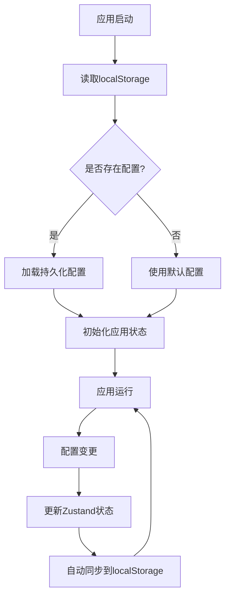
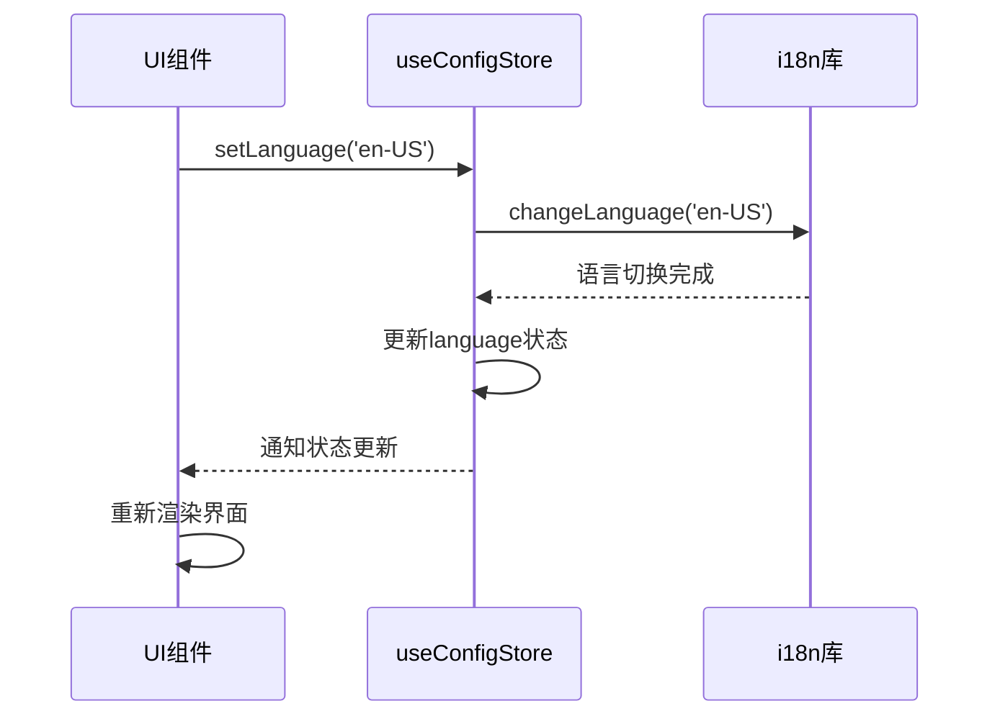
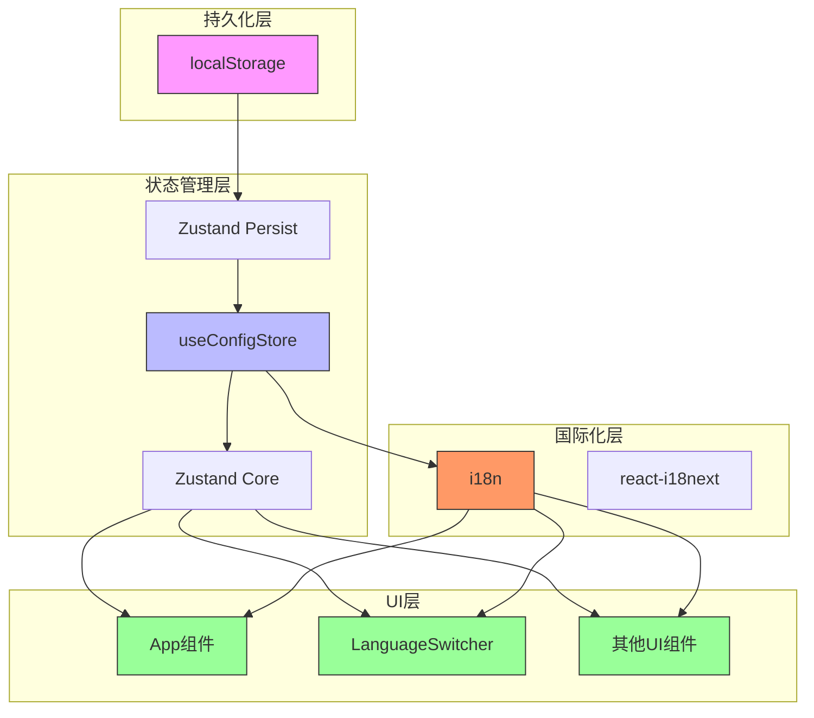

# 应用配置管理 (useConfigStore)

<cite>
**本文档引用文件**   
- [useConfigStore.ts](file://frontend/src/stores/useConfigStore.ts)
- [index.ts](file://frontend/src/i18n/index.ts)
- [LanguageSwitcher.tsx](file://frontend/src/components/LanguageSwitcher.tsx)
- [App.tsx](file://frontend/src/App.tsx)
- [translation.json](file://frontend/src/i18n/locales/en/translation.json)
- [translation.json](file://frontend/src/i18n/locales/zh-CN/translation.json)
</cite>

## 目录
1. [简介](#简介)
2. [核心配置状态](#核心配置状态)
3. [持久化机制](#持久化机制)
4. [方法行为详解](#方法行为详解)
5. [UI组件集成实践](#ui组件集成实践)
6. [配置管理架构图](#配置管理架构图)

## 简介
本文档详细说明了`useConfigStore`的实现机制，该状态管理模块负责管理用户偏好设置，包括主题、语言和God模式等核心配置。通过Zustand的状态管理能力和其persist中间件，实现了配置的持久化存储和响应式更新。

**Section sources**
- [useConfigStore.ts](file://frontend/src/stores/useConfigStore.ts#L1-L34)

## 核心配置状态
`useConfigStore`定义了应用的核心用户偏好配置，包含以下状态属性：

- **theme**: 主题模式，支持'light'(浅色)、'dark'(深色)和'system'(跟随系统)三种选项
- **language**: 语言设置，支持'zh-CN'(简体中文)和'en-US'(英语)两种语言
- **godMode**: God模式开关，布尔值，用于启用高级功能

这些配置通过Zustand的状态管理机制进行集中管理，确保应用各组件能够一致地访问和更新用户偏好。

**Section sources**
- [useConfigStore.ts](file://frontend/src/stores/useConfigStore.ts#L5-L8)

## 持久化机制
`useConfigStore`利用Zustand的persist中间件将用户配置持久化到localStorage中，确保用户偏好在页面刷新后仍然保持。

**Diagram sources**
- [useConfigStore.ts](file://frontend/src/stores/useConfigStore.ts#L15-L34)

**Section sources**
- [useConfigStore.ts](file://frontend/src/stores/useConfigStore.ts#L15-L34)

## 方法行为详解
`useConfigStore`提供了三个核心方法来管理用户配置：

### setTheme方法
`setTheme`方法用于更新应用的主题模式。当调用此方法时，会更新store中的theme状态，并通过Zustand的响应式机制通知所有订阅该状态的组件进行更新。

### setLanguage方法
`setLanguage`方法具有双重作用：
1. 调用i18n库的`changeLanguage`方法，触发界面语言的实时切换
2. 更新store中的language状态，确保状态一致性

该方法实现了与i18n库的无缝集成，确保语言切换即时生效且无需页面刷新。

### toggleGodMode方法
`toggleGodMode`方法用于切换God模式的开关状态。该方法使用Zustand的函数式更新语法，基于当前状态值进行取反操作，确保状态更新的原子性和正确性。

**Diagram sources**
- [useConfigStore.ts](file://frontend/src/stores/useConfigStore.ts#L23-L26)
- [index.ts](file://frontend/src/i18n/index.ts#L1-L34)

**Section sources**
- [useConfigStore.ts](file://frontend/src/stores/useConfigStore.ts#L22-L27)

## UI组件集成实践
在UI组件中订阅和应用这些配置的最佳实践包括：

1. **使用选择器获取状态**: 通过`useConfigStore`的selector函数订阅特定配置
2. **响应式更新**: Zustand会自动处理状态变化，组件会重新渲染
3. **方法调用**: 直接调用store暴露的方法来更新配置

例如，在`App.tsx`中，通过`useConfigStore((state) => state.theme)`订阅主题状态，并在`useEffect`中根据主题值更新HTML文档的类名，实现主题切换。

**Section sources**
- [App.tsx](file://frontend/src/App.tsx#L30-L37)
- [LanguageSwitcher.tsx](file://frontend/src/components/LanguageSwitcher.tsx#L1-L34)

## 配置管理架构图

**Diagram sources**
- [useConfigStore.ts](file://frontend/src/stores/useConfigStore.ts#L1-L34)
- [index.ts](file://frontend/src/i18n/index.ts#L1-L34)
- [App.tsx](file://frontend/src/App.tsx#L1-L85)

**Section sources**
- [useConfigStore.ts](file://frontend/src/stores/useConfigStore.ts#L1-L34)
- [index.ts](file://frontend/src/i18n/index.ts#L1-L34)
- [App.tsx](file://frontend/src/App.tsx#L1-L85)