# 状态管理

<cite>
**本文档引用的文件**  
- [useSessionStore.ts](file://frontend/src/stores/useSessionStore.ts)
- [useWorkflowRunStore.ts](file://frontend/src/stores/useWorkflowRunStore.ts)
- [useAuthStore.ts](file://frontend/src/stores/useAuthStore.ts)
- [useConfigStore.ts](file://frontend/src/stores/useConfigStore.ts)
- [useConnectStore.ts](file://frontend/src/stores/useConnectStore.ts)
- [useLayoutStore.ts](file://frontend/src/stores/useLayoutStore.ts)
- [session.ts](file://frontend/src/types/session.ts)
- [workflow-run.ts](file://frontend/src/types/workflow-run.ts)
- [websocket.ts](file://frontend/src/types/websocket.ts)
- [SPEC-001-session-store.md](file://docs/specs/sprint1/SPEC-001-session-store.md)
- [SPEC-002-workflow-run-store.md](file://docs/specs/sprint1/SPEC-002-workflow-run-store.md)
- [useWebSocketRouter.ts](file://frontend/src/hooks/useWebSocketRouter.ts)
</cite>

## 目录
1. [引言](#引言)
2. [核心状态管理架构](#核心状态管理架构)
3. [会话状态管理](#会话状态管理)
4. [工作流执行状态管理](#工作流执行状态管理)
5. [身份认证状态管理](#身份认证状态管理)
6. [配置与布局状态管理](#配置与布局状态管理)
7. [WebSocket连接状态管理](#websocket连接状态管理)
8. [状态订阅与更新最佳实践](#状态订阅与更新最佳实践)
9. [跨组件状态共享用例](#跨组件状态共享用例)
10. [状态持久化机制](#状态持久化机制)

## 引言
本文档深入解析基于Zustand的状态管理架构，详细描述`useSessionStore`对会话生命周期的管理，包括会话创建、连接状态与元数据维护；`useWorkflowRunStore`对工作流执行过程的状态跟踪，如节点执行进度、消息流与结果聚合；`useAuthStore`的身份认证状态处理；`useConfigStore`的配置持久化；`useConnectStore`的WebSocket连接管理；以及`useLayoutStore`的UI布局状态同步。同时提供状态订阅、更新与持久化的最佳实践，并展示跨组件状态共享的典型用例。

## 核心状态管理架构
本系统采用Zustand作为状态管理库，通过多个专用Store实现关注点分离。架构设计遵循单一职责原则，将不同领域的状态管理分离到独立的Store中，确保状态更新的可预测性和可维护性。

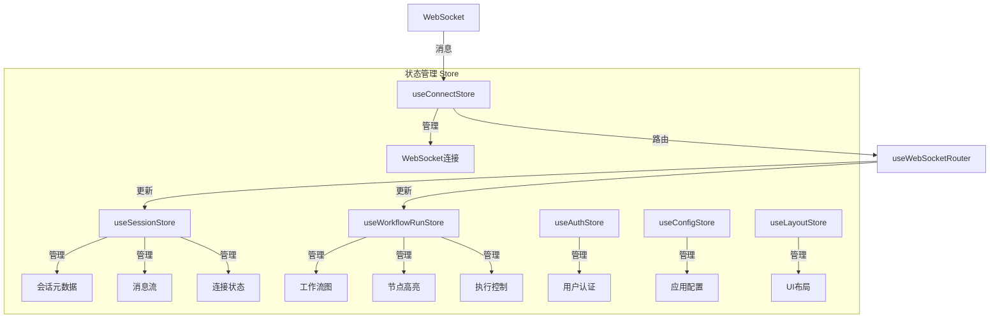

**Diagram sources**
- [useSessionStore.ts](file://frontend/src/stores/useSessionStore.ts)
- [useWorkflowRunStore.ts](file://frontend/src/stores/useWorkflowRunStore.ts)
- [useAuthStore.ts](file://frontend/src/stores/useAuthStore.ts)
- [useConfigStore.ts](file://frontend/src/stores/useConfigStore.ts)
- [useLayoutStore.ts](file://frontend/src/stores/useLayoutStore.ts)
- [useConnectStore.ts](file://frontend/src/stores/useConnectStore.ts)
- [useWebSocketRouter.ts](file://frontend/src/hooks/useWebSocketRouter.ts)

**Section sources**
- [useSessionStore.ts](file://frontend/src/stores/useSessionStore.ts)
- [useWorkflowRunStore.ts](file://frontend/src/stores/useWorkflowRunStore.ts)
- [useAuthStore.ts](file://frontend/src/stores/useAuthStore.ts)
- [useConfigStore.ts](file://frontend/src/stores/useConfigStore.ts)
- [useLayoutStore.ts](file://frontend/src/stores/useLayoutStore.ts)
- [useConnectStore.ts](file://frontend/src/stores/useConnectStore.ts)

## 会话状态管理
`useSessionStore`负责管理当前活跃的工作流运行会话，包括会话元数据、消息流和连接状态。该Store通过Immer中间件实现不可变状态的简化更新。

### 会话生命周期管理
`useSessionStore`通过`initSession`、`updateSessionStatus`和`clearSession`等操作管理会话的完整生命周期。会话状态包含ID、工作流ID、组ID、状态、开始和完成时间等元数据。

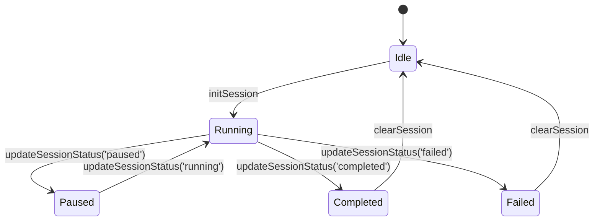

**Diagram sources**
- [useSessionStore.ts](file://frontend/src/stores/useSessionStore.ts#L104-L273)
- [session.ts](file://frontend/src/types/session.ts#L11-L17)

**Section sources**
- [useSessionStore.ts](file://frontend/src/stores/useSessionStore.ts)
- [session.ts](file://frontend/src/types/session.ts)

### 消息流管理
`useSessionStore`通过`appendMessage`和`finalizeMessage`操作管理消息流。消息按节点分组存储，支持流式输出的增量更新。当收到流式消息时，系统会追加到现有消息的末尾，直到流式完成。

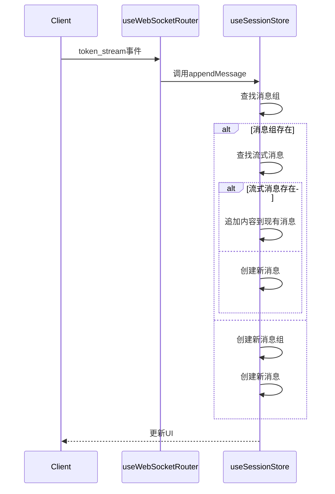

**Diagram sources**
- [useSessionStore.ts](file://frontend/src/stores/useSessionStore.ts#L172-L223)
- [useWebSocketRouter.ts](file://frontend/src/hooks/useWebSocketRouter.ts#L19-L29)
- [SPEC-001-session-store.md](file://docs/specs/sprint1/SPEC-001-session-store.md#L264-L310)

**Section sources**
- [useSessionStore.ts](file://frontend/src/stores/useSessionStore.ts)
- [useWebSocketRouter.ts](file://frontend/src/hooks/useWebSocketRouter.ts)

### 并行执行管理
`useSessionStore`通过`handleParallelStart`操作处理并行执行。当收到`node:parallel_start`事件时，系统会创建并行消息组并标记分支节点为活跃状态，确保并行执行的消息能够正确分组和显示。

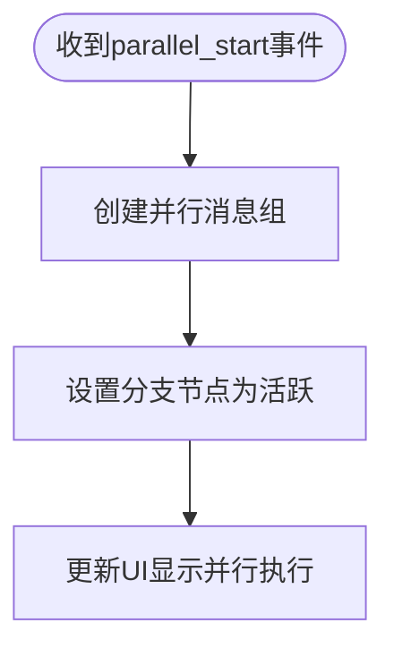

**Diagram sources**
- [useSessionStore.ts](file://frontend/src/stores/useSessionStore.ts#L280-L300)
- [SPEC-001-session-store.md](file://docs/specs/sprint1/SPEC-001-session-store.md#L315-L333)

**Section sources**
- [useSessionStore.ts](file://frontend/src/stores/useSessionStore.ts)
- [SPEC-001-session-store.md](file://docs/specs/sprint1/SPEC-001-session-store.md)

## 工作流执行状态管理
`useWorkflowRunStore`负责管理工作流图的状态、节点高亮和执行控制。该Store与`useSessionStore`分离，实现画布视图和聊天视图的独立更新，优化渲染性能。

### 节点状态跟踪
`useWorkflowRunStore`通过`updateNodeStatus`操作跟踪每个节点的执行状态。节点状态包括pending、running、completed和failed，系统会根据状态变化更新UI样式，提供直观的视觉反馈。

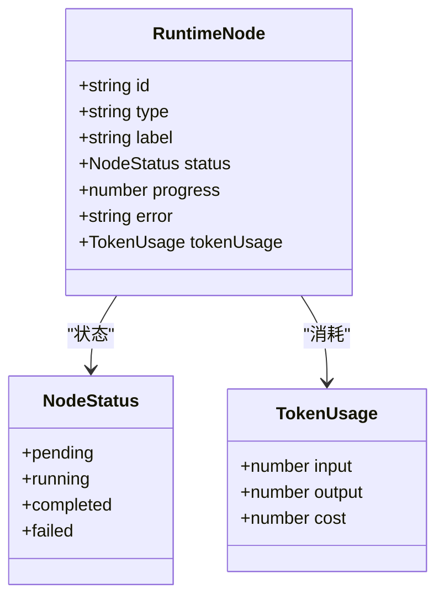

**Diagram sources**
- [useWorkflowRunStore.ts](file://frontend/src/stores/useWorkflowRunStore.ts#L6-L19)
- [workflow-run.ts](file://frontend/src/types/workflow-run.ts#L6-L18)

**Section sources**
- [useWorkflowRunStore.ts](file://frontend/src/stores/useWorkflowRunStore.ts)
- [workflow-run.ts](file://frontend/src/types/workflow-run.ts)

### 执行控制管理
`useWorkflowRunStore`提供`sendControl`操作，允许用户通过API发送控制命令（暂停、继续、停止）来控制工作流的执行。系统会根据执行状态派生出相应的控制状态，决定哪些操作可用。

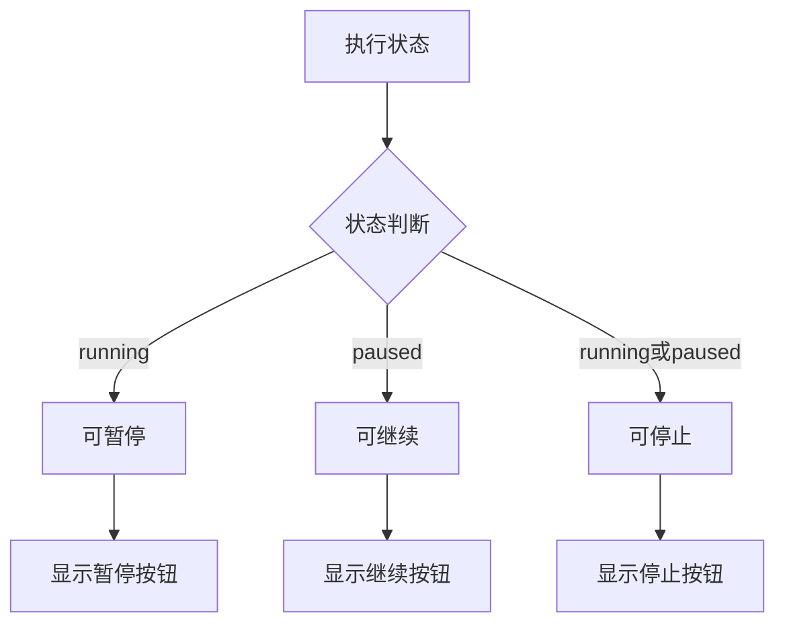

**Diagram sources**
- [useWorkflowRunStore.ts](file://frontend/src/stores/useWorkflowRunStore.ts#L73-L225)
- [SPEC-002-workflow-run-store.md](file://docs/specs/sprint1/SPEC-002-workflow-run-store.md#L235-L265)

**Section sources**
- [useWorkflowRunStore.ts](file://frontend/src/stores/useWorkflowRunStore.ts)
- [SPEC-002-workflow-run-store.md](file://docs/specs/sprint1/SPEC-002-workflow-run-store.md)

### 统计信息聚合
`useWorkflowRunStore`维护执行过程中的统计信息，包括总节点数、已完成节点数、失败节点数、总Token数、总成本和已用时间。这些信息通过`startTimer`和`stopTimer`操作进行实时更新，为用户提供执行进度的全面视图。

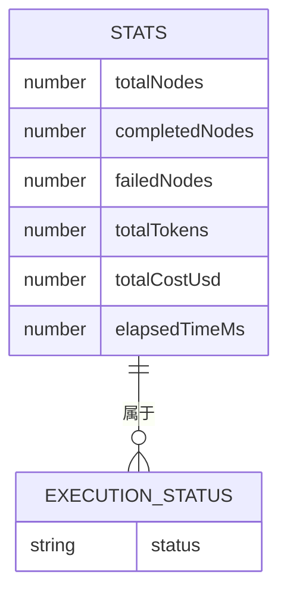

**Diagram sources**
- [useWorkflowRunStore.ts](file://frontend/src/stores/useWorkflowRunStore.ts#L46-L53)
- [useWorkflowRunStore.ts](file://frontend/src/stores/useWorkflowRunStore.ts#L259-L289)

**Section sources**
- [useWorkflowRunStore.ts](file://frontend/src/stores/useWorkflowRunStore.ts)

## 身份认证状态管理
`useAuthStore`负责管理用户的身份认证状态，包括用户信息的存储和登出操作。该Store与会话状态分离，确保认证信息的独立性和安全性。

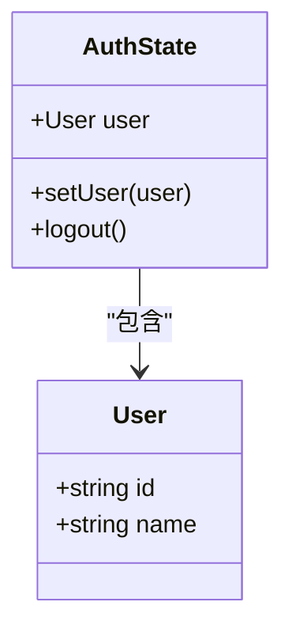

**Diagram sources**
- [useAuthStore.ts](file://frontend/src/stores/useAuthStore.ts#L3-L10)

**Section sources**
- [useAuthStore.ts](file://frontend/src/stores/useAuthStore.ts)

## 配置与布局状态管理
系统通过`useConfigStore`和`useLayoutStore`分别管理应用配置和UI布局状态，两者均使用Zustand的persist中间件实现状态的持久化。

### 配置持久化
`useConfigStore`管理应用的主题、语言和God模式等配置，这些配置通过localStorage持久化，确保用户偏好在页面刷新后得以保留。

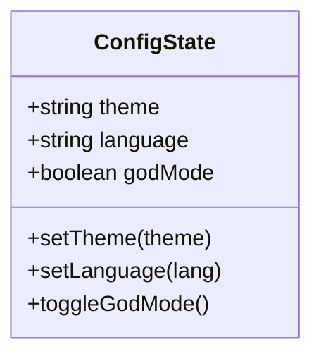

**Diagram sources**
- [useConfigStore.ts](file://frontend/src/stores/useConfigStore.ts#L5-L13)

**Section sources**
- [useConfigStore.ts](file://frontend/src/stores/useConfigStore.ts)

### 布局状态同步
`useLayoutStore`管理UI的布局状态，包括面板大小、折叠状态和最大化面板等。这些状态同样通过localStorage持久化，为用户提供一致的界面体验。

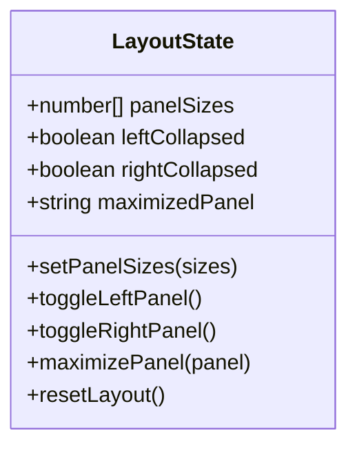

**Diagram sources**
- [useLayoutStore.ts](file://frontend/src/stores/useLayoutStore.ts#L6-L16)

**Section sources**
- [useLayoutStore.ts](file://frontend/src/stores/useLayoutStore.ts)

## WebSocket连接状态管理
`useConnectStore`负责管理WebSocket连接的完整生命周期，包括连接、断开、重连和心跳检测。该Store通过subscribeWithSelector中间件实现对连接状态的细粒度订阅。

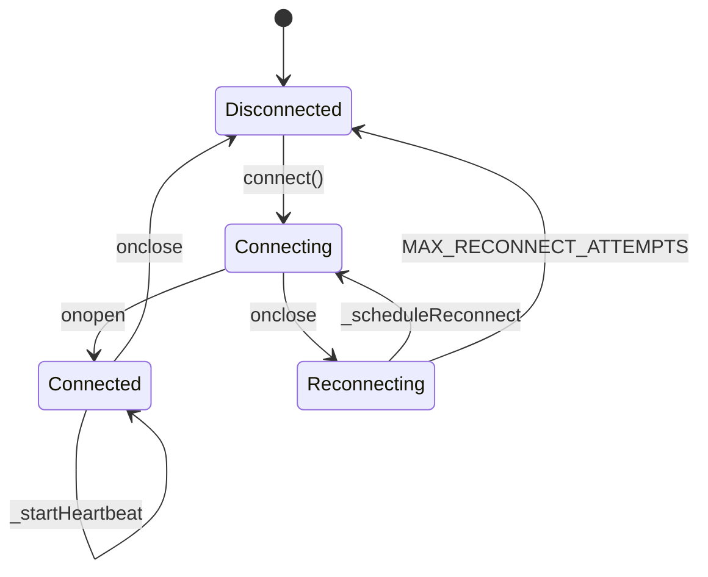

**Diagram sources**
- [useConnectStore.ts](file://frontend/src/stores/useConnectStore.ts#L7-L21)
- [useConnectStore.ts](file://frontend/src/stores/useConnectStore.ts#L40-L67)

**Section sources**
- [useConnectStore.ts](file://frontend/src/stores/useConnectStore.ts)

## 状态订阅与更新最佳实践
系统通过精心设计的状态订阅机制，确保组件只在相关状态变化时重新渲染，优化性能。

### 选择器模式
使用Zustand的选择器模式，组件可以订阅Store中的特定部分，而不是整个Store。这减少了不必要的重新渲染。

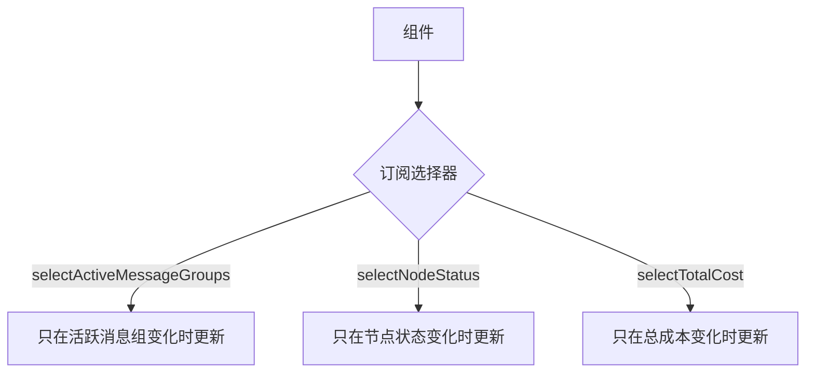

**Section sources**
- [useSessionStore.ts](file://frontend/src/stores/useSessionStore.ts#L307-L331)

### 消息路由机制
`useWebSocketRouter`作为消息路由中心，接收来自`useConnectStore`的WebSocket消息，并根据事件类型将消息分发到相应的Store进行处理，实现关注点分离。

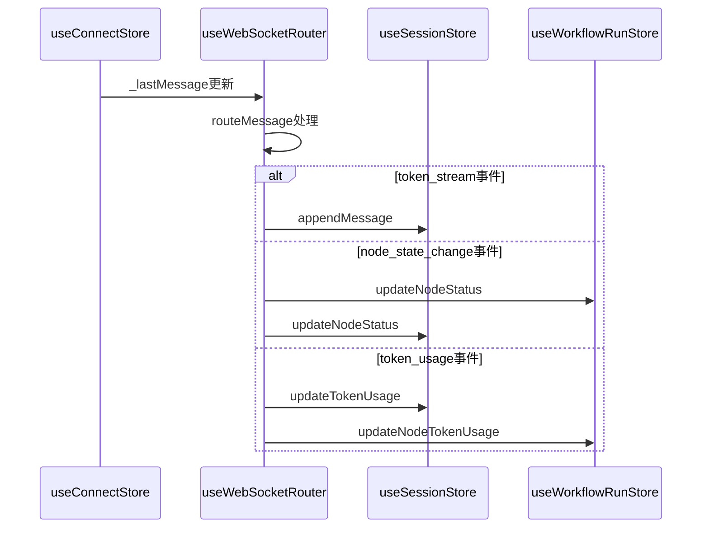

**Diagram sources**
- [useWebSocketRouter.ts](file://frontend/src/hooks/useWebSocketRouter.ts#L17-L111)
- [useConnectStore.ts](file://frontend/src/stores/useConnectStore.ts#L97-L99)

**Section sources**
- [useWebSocketRouter.ts](file://frontend/src/hooks/useWebSocketRouter.ts)

## 跨组件状态共享用例
系统通过多个Store的协同工作，实现复杂的跨组件状态共享。

### 会话启动流程
当用户启动一个工作流会话时，多个Store协同工作，确保状态的一致性。

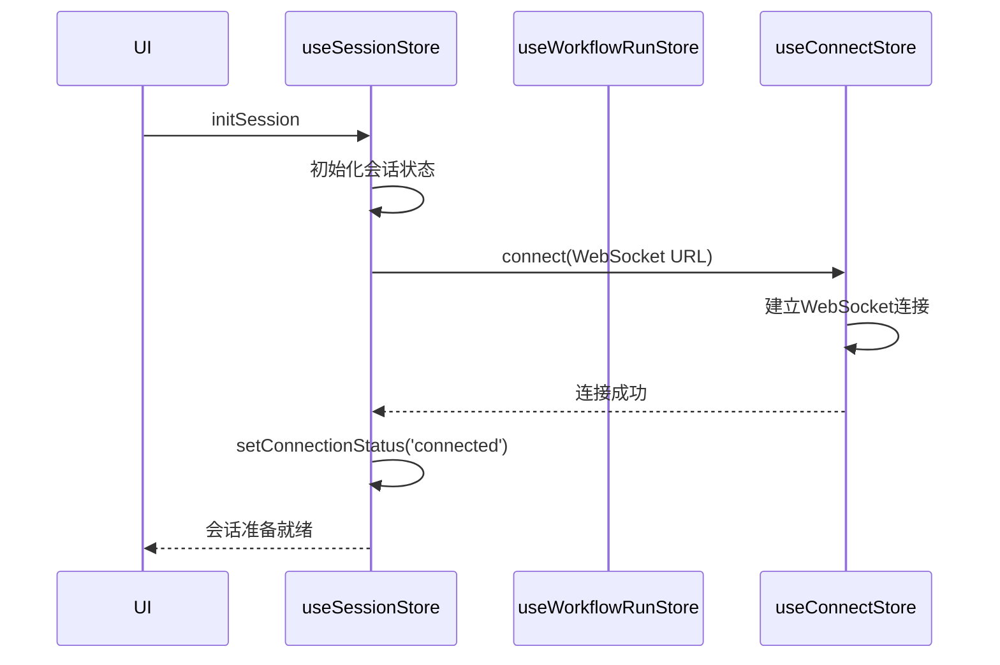

**Section sources**
- [useSessionStore.ts](file://frontend/src/stores/useSessionStore.ts#L104-L129)
- [useConnectStore.ts](file://frontend/src/stores/useConnectStore.ts#L40-L57)

### 执行控制流程
当用户通过UI控制工作流执行时，状态更新通过多个Store同步。

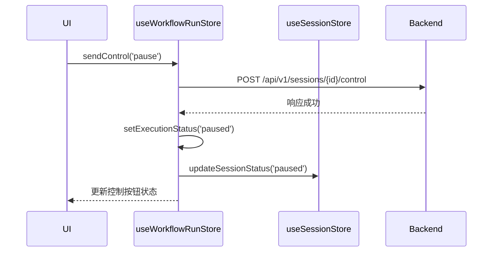

**Section sources**
- [useWorkflowRunStore.ts](file://frontend/src/stores/useWorkflowRunStore.ts#L197-L225)
- [useSessionStore.ts](file://frontend/src/stores/useSessionStore.ts#L48-L49)

## 状态持久化机制
系统采用不同的持久化策略，根据状态的性质选择合适的存储方式。

### 持久化策略对比
| 状态类型 | 存储方式 | 持久化 | 刷新后保留 |
|---------|--------|-------|----------|
| 用户认证 | 内存 | 否 | 否 |
| 会话状态 | 内存 | 否 | 否 |
| 应用配置 | localStorage | 是 | 是 |
| UI布局 | localStorage | 是 | 是 |
| WebSocket连接 | 内存 | 否 | 否 |

**Section sources**
- [useConfigStore.ts](file://frontend/src/stores/useConfigStore.ts#L15-L34)
- [useLayoutStore.ts](file://frontend/src/stores/useLayoutStore.ts#L19-L42)