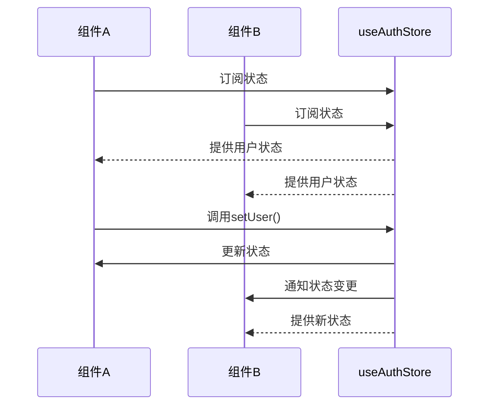
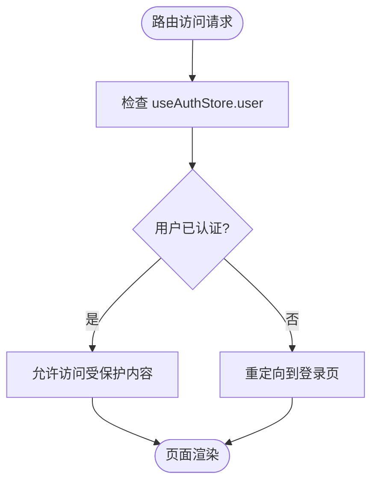
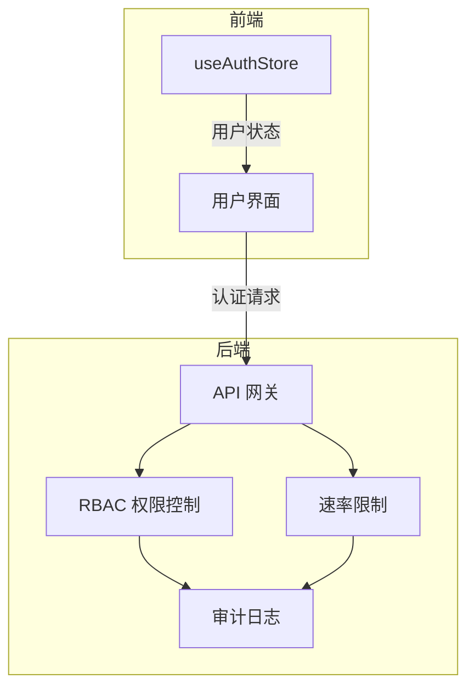

# 身份认证管理 (useAuthStore)

<cite>
**本文档引用文件**   
- [useAuthStore.ts](file://frontend/src/stores/useAuthStore.ts)
- [App.tsx](file://frontend/src/App.tsx)
- [SPEC-001-session-store.md](file://docs/specs/sprint1/SPEC-001-session-store.md)
- [SPEC-504-security-hardening.md](file://docs/specs/sprint5/SPEC-504-security-hardening.md)
</cite>

## 目录
1. [简介](#简介)
2. [核心设计与功能](#核心设计与功能)
3. [状态结构与操作](#状态结构与操作)
4. [应用初始化流程](#应用初始化流程)
5. [跨组件状态共享](#跨组件状态共享)
6. [受保护路由的访问控制](#受保护路由的访问控制)
7. [安全强化措施](#安全强化措施)
8. [总结](#总结)

## 简介
`useAuthStore` 是本应用中负责管理用户身份认证状态的核心状态管理模块。该模块采用简洁而高效的设计，专注于用户会话的管理，与工作流会话状态分离，实现了单一职责原则。通过 Zustand 库创建的全局状态存储，`useAuthStore` 在整个应用中提供统一的用户认证管理机制，确保身份信息在不同组件间的同步与一致性。

## 核心设计与功能
`useAuthStore` 的设计目标是提供一个轻量级、可预测且易于使用的身份认证状态管理方案。其主要功能包括：
- 存储当前登录用户的基本信息
- 提供设置用户信息的接口
- 提供注销用户的接口
- 在应用生命周期内保持认证状态的一致性

该 store 的设计遵循了前端状态管理的最佳实践，将认证逻辑与业务逻辑分离，使得代码更加模块化和可维护。

**Section sources**
- [useAuthStore.ts](file://frontend/src/stores/useAuthStore.ts#L1-L16)
- [SPEC-001-session-store.md](file://docs/specs/sprint1/SPEC-001-session-store.md#L441-L452)

## 状态结构与操作
`useAuthStore` 的状态结构定义清晰，包含用户信息和两个核心操作方法。

### 状态结构
认证状态由 `AuthState` 接口定义，包含以下属性：
- `user`: 用户对象，包含 `id` 和 `name` 两个属性，初始值为 `null`，表示未登录状态

### 核心操作
`useAuthStore` 提供了两个核心操作方法：
- `setUser`: 接收用户对象参数，更新 store 中的用户信息
- `logout`: 清除 store 中的用户信息，将状态重置为未登录

```mermaid
classDiagram
class AuthState {
+user : {id : string, name : string} | null
+setUser(user : {id : string, name : string}) void
+logout() void
}
note right of AuthState
身份认证状态管理接口
- user : 存储当前用户信息
- setUser : 设置用户信息
- logout : 注销用户
end note
```

**Diagram sources**
- [useAuthStore.ts](file://frontend/src/stores/useAuthStore.ts#L3-L10)

**Section sources**
- [useAuthStore.ts](file://frontend/src/stores/useAuthStore.ts#L3-L16)

## 应用初始化流程
在应用启动时，`useAuthStore` 会随着应用的初始化而被创建。通过 React 的上下文机制，该 store 在整个应用组件树中可用。应用启动流程如下：
1. 应用入口文件 `main.tsx` 初始化 React 应用
2. `App.tsx` 组件加载并初始化所有必要的状态管理 store
3. `useAuthStore` 被创建并初始化为未登录状态（user = null）
4. 应用渲染根组件，认证状态可供所有子组件访问

这种初始化方式确保了认证状态在应用启动时就已准备就绪，为后续的用户交互提供了基础。

**Section sources**
- [main.tsx](file://frontend/src/main.tsx#L1-L21)
- [App.tsx](file://frontend/src/App.tsx#L1-L85)

## 跨组件状态共享
`useAuthStore` 通过 Zustand 的全局状态机制，实现了在不同组件间共享认证状态的模式。任何需要访问用户认证信息的组件都可以通过导入 `useAuthStore` 来订阅状态变化。

当用户信息发生变化时（如登录或注销），所有订阅了该状态的组件都会自动重新渲染，确保 UI 与认证状态保持同步。这种基于订阅-发布模式的状态共享机制，避免了通过 props 逐层传递状态的繁琐，提高了代码的可维护性。



**Diagram sources**
- [useAuthStore.ts](file://frontend/src/stores/useAuthStore.ts#L12-L16)
- [App.tsx](file://frontend/src/App.tsx#L28-L84)

**Section sources**
- [useAuthStore.ts](file://frontend/src/stores/useAuthStore.ts#L12-L16)

## 受保护路由的访问控制
虽然当前代码库中未直接展示受保护路由的实现，但基于 `useAuthStore` 的设计，可以实现有效的访问控制机制。以下是一个在受保护路由中使用该 store 进行访问控制的代码示例：



在实际实现中，可以通过自定义 Hook 或高阶组件来封装访问控制逻辑，利用 `useAuthStore` 的状态来决定是否允许用户访问特定路由。

**Diagram sources**
- [App.tsx](file://frontend/src/App.tsx#L66-L76)
- [useAuthStore.ts](file://frontend/src/stores/useAuthStore.ts#L12-L16)

**Section sources**
- [App.tsx](file://frontend/src/App.tsx#L66-L76)

## 安全强化措施
根据安全强化规格文档，系统实现了基于角色的访问控制（RBAC）等安全措施。虽然 `useAuthStore` 本身只管理基本的用户信息，但它与后端的安全机制协同工作，共同构建了完整的安全体系。

后端实现了细粒度的权限控制，包括：
- 基于角色的访问控制（RBAC）
- API 速率限制
- 敏感数据脱敏
- 安全审计日志

`useAuthStore` 提供的用户身份信息是前端进行初步访问控制的基础，而后端则负责最终的权限验证和安全防护。



**Diagram sources**
- [SPEC-504-security-hardening.md](file://docs/specs/sprint5/SPEC-504-security-hardening.md#L20-L249)
- [useAuthStore.ts](file://frontend/src/stores/useAuthStore.ts#L1-L16)

**Section sources**
- [SPEC-504-security-hardening.md](file://docs/specs/sprint5/SPEC-504-security-hardening.md#L1-L277)

## 总结
`useAuthStore` 通过其简洁而有效的设计，为应用提供了可靠的身份认证管理机制。该 store 专注于单一职责，仅管理用户认证状态，与工作流会话状态分离，体现了良好的架构设计原则。通过 Zustand 的全局状态管理，实现了跨组件的状态共享和同步。结合后端的安全强化措施，共同构建了完整的安全体系，为应用的稳定运行提供了保障。