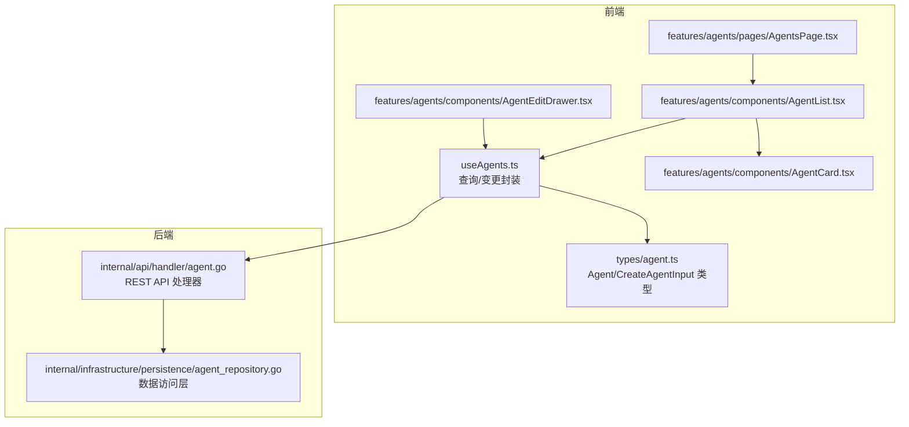
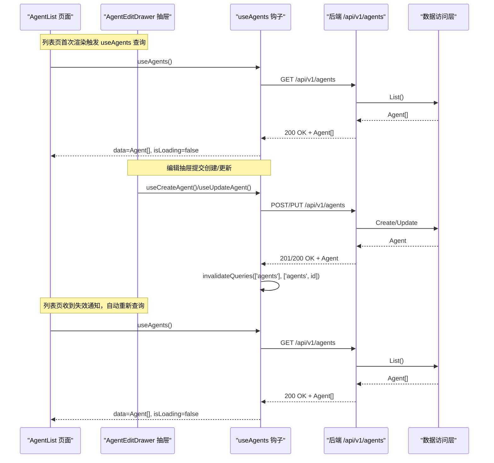
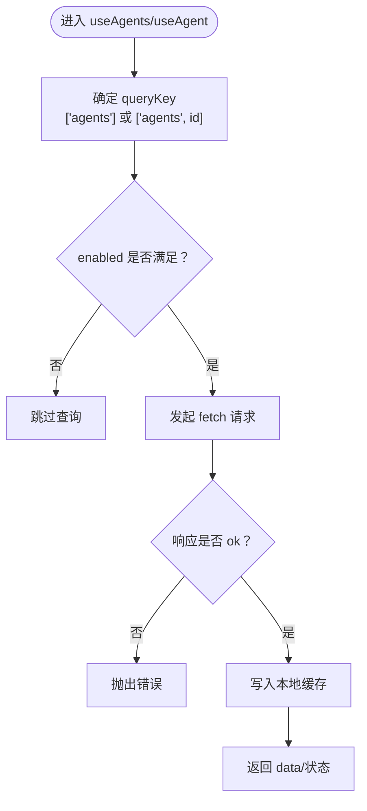
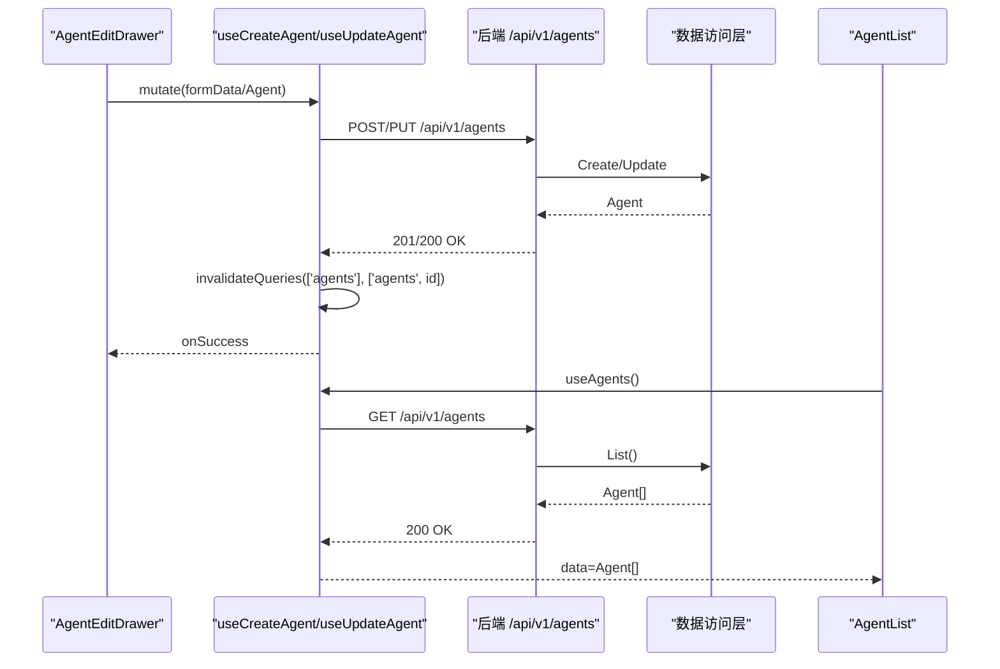
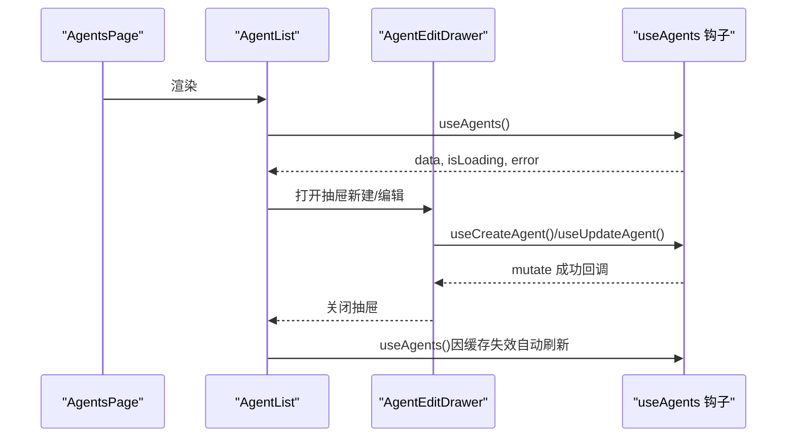
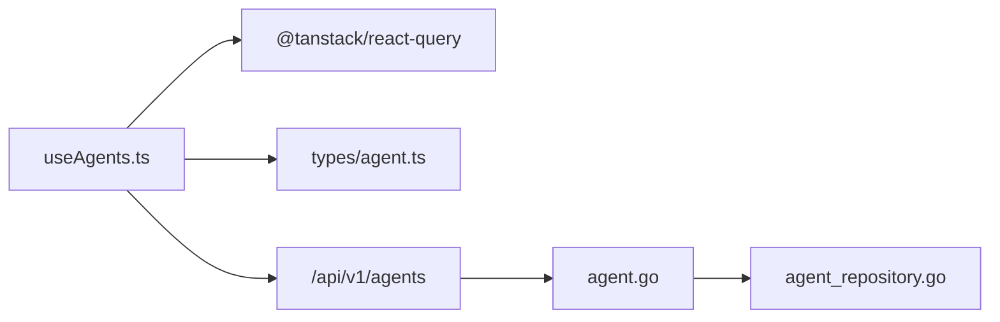

# useAgents - 智能体资源管理

<cite>
**本文引用的文件**
- [useAgents.ts](file://frontend/src/hooks/useAgents.ts)
- [agent.ts](file://frontend/src/types/agent.ts)
- [AgentsPage.tsx](file://frontend/src/features/agents/pages/AgentsPage.tsx)
- [AgentList.tsx](file://frontend/src/features/agents/components/AgentList.tsx)
- [AgentEditDrawer.tsx](file://frontend/src/features/agents/components/AgentEditDrawer.tsx)
- [AgentCard.tsx](file://frontend/src/features/agents/components/AgentCard.tsx)
- [agent.go](file://internal/api/handler/agent.go)
- [agent_repository.go](file://internal/infrastructure/persistence/agent_repository.go)
</cite>

## 目录
1. [简介](#简介)
2. [项目结构](#项目结构)
3. [核心组件](#核心组件)
4. [架构总览](#架构总览)
5. [详细组件分析](#详细组件分析)
6. [依赖关系分析](#依赖关系分析)
7. [性能考量](#性能考量)
8. [故障排查指南](#故障排查指南)
9. [结论](#结论)
10. [附录：使用示例](#附录使用示例)

## 简介
本技术文档围绕 useAgents Hook 展开，系统阐述其在前端侧对“智能体（Agent）”资源的获取、缓存与状态管理机制，以及与全局状态 store 的集成方式。文档重点说明：
- 如何通过 API 拉取智能体数据，支持按 ID 查询、创建新智能体及更新现有智能体配置；
- 如何利用 react-query 的查询与变更钩子进行本地缓存与失效策略，保证多组件间的数据一致性；
- 在智能体列表页与编辑抽屉中的具体使用方式，以及加载、错误与刷新逻辑的处理。

## 项目结构
useAgents Hook 位于前端 hooks 目录，配合类型定义、页面与组件共同构成完整的智能体管理链路。后端提供标准 REST 风格 API，前端通过 useAgents 将请求封装为查询与变更操作，并借助 react-query 的缓存与失效机制实现跨组件的一致性。

图表来源
- [useAgents.ts](file://frontend/src/hooks/useAgents.ts#L1-L103)
- [agent.ts](file://frontend/src/types/agent.ts#L1-L35)
- [AgentsPage.tsx](file://frontend/src/features/agents/pages/AgentsPage.tsx#L1-L21)
- [AgentList.tsx](file://frontend/src/features/agents/components/AgentList.tsx#L1-L114)
- [AgentEditDrawer.tsx](file://frontend/src/features/agents/components/AgentEditDrawer.tsx#L1-L221)
- [AgentCard.tsx](file://frontend/src/features/agents/components/AgentCard.tsx#L1-L88)
- [agent.go](file://internal/api/handler/agent.go#L1-L99)
- [agent_repository.go](file://internal/infrastructure/persistence/agent_repository.go#L62-L115)

章节来源
- [useAgents.ts](file://frontend/src/hooks/useAgents.ts#L1-L103)
- [agent.go](file://internal/api/handler/agent.go#L1-L99)

## 核心组件
- useAgents：返回智能体列表的查询钩子，内部以 queryKey 为固定键值，自动缓存响应数据。
- useAgent(id)：按 ID 查询单个智能体，queryKey 包含 id，且仅在 id 存在时启用查询。
- useCreateAgent：创建智能体的变更钩子，成功后使列表缓存失效，触发重新拉取。
- useUpdateAgent：更新智能体的变更钩子，成功后同时失效列表与该智能体详情缓存。
- useDeleteAgent：删除智能体的变更钩子，成功后失效列表缓存。
- 类型定义：Agent 与 CreateAgentInput，确保前后端数据结构一致。

章节来源
- [useAgents.ts](file://frontend/src/hooks/useAgents.ts#L58-L103)
- [agent.ts](file://frontend/src/types/agent.ts#L1-L35)

## 架构总览
useAgents 通过 react-query 的 useQuery/useMutation 组合，将网络请求与本地缓存解耦，形成“查询-变更-失效”的闭环。列表页与编辑抽屉分别消费这些钩子，实现统一的状态管理与数据一致性。

图表来源
- [useAgents.ts](file://frontend/src/hooks/useAgents.ts#L58-L103)
- [agent.go](file://internal/api/handler/agent.go#L1-L99)
- [agent_repository.go](file://internal/infrastructure/persistence/agent_repository.go#L62-L115)

## 详细组件分析

### useAgents 查询与缓存机制
- 列表查询：useAgents 返回一个查询对象，queryKey 固定为 ['agents']，默认启用缓存与自动重试。
- 按 ID 查询：useAgent(id) 返回一个查询对象，queryKey 为 ['agents', id]，enabled 仅在 id 存在时生效，避免无效请求。
- 错误处理：fetchAgents/fetchAgent 在响应非 ok 时抛出错误，由 react-query 捕获并暴露给调用方。
- 数据结构：Agent 与 CreateAgentInput 定义了智能体的基本字段与模型配置、能力开关等。

图表来源
- [useAgents.ts](file://frontend/src/hooks/useAgents.ts#L58-L71)
- [agent.ts](file://frontend/src/types/agent.ts#L1-L35)

章节来源
- [useAgents.ts](file://frontend/src/hooks/useAgents.ts#L58-L71)
- [agent.ts](file://frontend/src/types/agent.ts#L1-L35)

### 创建与更新智能体：useCreateAgent/useUpdateAgent
- 创建流程：useCreateAgent 返回变更钩子，成功回调中使 ['agents'] 缓存失效，触发列表页自动刷新。
- 更新流程：useUpdateAgent 返回变更钩子，成功回调中同时失效 ['agents'] 与 ['agents', id]，确保列表与详情同步最新。
- 错误处理：createAgent/updateAgent 在响应非 ok 时解析后端错误并抛出，供调用方显示。

图表来源
- [useAgents.ts](file://frontend/src/hooks/useAgents.ts#L73-L102)
- [agent.go](file://internal/api/handler/agent.go#L19-L82)
- [agent_repository.go](file://internal/infrastructure/persistence/agent_repository.go#L91-L115)

章节来源
- [useAgents.ts](file://frontend/src/hooks/useAgents.ts#L73-L102)
- [agent.go](file://internal/api/handler/agent.go#L19-L82)

### 删除智能体：useDeleteAgent
- 删除流程：useDeleteAgent 返回变更钩子，成功回调中失效 ['agents'] 缓存，列表页自动刷新。
- 交互：AgentList 中通过确认框触发删除，删除成功后列表立即更新。

章节来源
- [useAgents.ts](file://frontend/src/hooks/useAgents.ts#L94-L102)
- [AgentList.tsx](file://frontend/src/features/agents/components/AgentList.tsx#L26-L30)

### 智能体列表页与编辑抽屉的集成
- 列表页（AgentsPage -> AgentList）：引入 AgentList，内部使用 useAgents 获取数据，处理加载与错误状态，提供搜索过滤与新增入口。
- 编辑抽屉（AgentEditDrawer）：根据是否存在 agent 决定创建或更新流程，提交成功后关闭抽屉并触发刷新。

图表来源
- [AgentsPage.tsx](file://frontend/src/features/agents/pages/AgentsPage.tsx#L1-L21)
- [AgentList.tsx](file://frontend/src/features/agents/components/AgentList.tsx#L1-L114)
- [AgentEditDrawer.tsx](file://frontend/src/features/agents/components/AgentEditDrawer.tsx#L1-L221)
- [useAgents.ts](file://frontend/src/hooks/useAgents.ts#L58-L103)

章节来源
- [AgentsPage.tsx](file://frontend/src/features/agents/pages/AgentsPage.tsx#L1-L21)
- [AgentList.tsx](file://frontend/src/features/agents/components/AgentList.tsx#L1-L114)
- [AgentEditDrawer.tsx](file://frontend/src/features/agents/components/AgentEditDrawer.tsx#L1-L221)

## 依赖关系分析
- 前端依赖
  - react-query：提供 useQuery/useMutation/useQueryClient，负责缓存、失效与并发控制。
  - fetch：用于与后端 API 通信。
  - 类型定义：Agent/ CreateAgentInput 与后端实体保持一致。
- 后端依赖
  - Gin 路由处理器：提供 /api/v1/agents 的 CRUD 接口。
  - 数据访问层：PostgreSQL 查询与更新逻辑，包含列表、按 ID 查询、更新与删除。

图表来源
- [useAgents.ts](file://frontend/src/hooks/useAgents.ts#L1-L103)
- [agent.go](file://internal/api/handler/agent.go#L1-L99)
- [agent_repository.go](file://internal/infrastructure/persistence/agent_repository.go#L62-L115)

章节来源
- [useAgents.ts](file://frontend/src/hooks/useAgents.ts#L1-L103)
- [agent.go](file://internal/api/handler/agent.go#L1-L99)
- [agent_repository.go](file://internal/infrastructure/persistence/agent_repository.go#L62-L115)

## 性能考量
- 查询缓存：useAgents 默认启用缓存，减少重复请求；useAgent 对于未提供的 id 自动禁用，避免无效请求。
- 失效策略：创建/更新/删除成功后仅失效必要键，避免全量刷新，提升交互流畅度。
- 并发控制：react-query 的并发去重与重试策略有助于在网络波动时稳定用户体验。
- 列表渲染优化：AgentList 对数据进行本地过滤，避免在后端做复杂筛选；如数据量增大可考虑服务端分页与搜索。

## 故障排查指南
- 列表加载失败
  - 现象：列表页显示错误信息。
  - 排查：检查后端 /api/v1/agents/list 是否可达，确认网络与鉴权配置；查看浏览器开发者工具的响应码与错误信息。
  - 参考路径：[AgentList.tsx](file://frontend/src/features/agents/components/AgentList.tsx#L45-L51)
- 智能体详情查询失败
  - 现象：按 ID 查询未返回数据或报错。
  - 排查：确认 id 格式正确（UUID），后端路由参数绑定是否通过；查看后端日志。
  - 参考路径：[useAgents.ts](file://frontend/src/hooks/useAgents.ts#L65-L71)
- 创建/更新失败
  - 现象：提交后无响应或错误提示。
  - 排查：检查请求体结构与必填字段，确认后端 JSON 绑定是否通过；查看后端返回的错误信息。
  - 参考路径：[useAgents.ts](file://frontend/src/hooks/useAgents.ts#L73-L102)，[agent.go](file://internal/api/handler/agent.go#L19-L82)
- 刷新不同步
  - 现象：编辑完成后列表未及时更新。
  - 排查：确认变更钩子的成功回调是否触发 invalidateQueries；检查 queryKey 是否匹配。
  - 参考路径：[useAgents.ts](file://frontend/src/hooks/useAgents.ts#L73-L102)

章节来源
- [AgentList.tsx](file://frontend/src/features/agents/components/AgentList.tsx#L37-L51)
- [useAgents.ts](file://frontend/src/hooks/useAgents.ts#L65-L102)
- [agent.go](file://internal/api/handler/agent.go#L19-L82)

## 结论
useAgents Hook 通过 react-query 将智能体资源的获取、缓存与状态管理标准化，实现了：
- 明确的查询与变更边界；
- 精准的缓存失效策略；
- 跨组件的数据一致性保障；
- 与后端 API 的清晰契约。

在智能体列表页与编辑抽屉中，该 Hook 提供了简洁而强大的数据流，使得加载、错误与刷新逻辑得以统一处理，提升了开发效率与用户体验。

## 附录：使用示例
以下示例展示在智能体列表页与编辑抽屉中如何调用 useAgents Hook，并处理加载、错误与刷新逻辑。

- 智能体列表页
  - 在 AgentList 中调用 useAgents 获取智能体数组，处理 isLoading 与 error，提供搜索过滤与新增入口。
  - 参考路径：[AgentList.tsx](file://frontend/src/features/agents/components/AgentList.tsx#L1-L114)

- 编辑抽屉
  - 新建：当 agent 为空时，调用 useCreateAgent，提交 CreateAgentInput，成功后关闭抽屉并触发列表刷新。
  - 更新：当 agent 存在时，调用 useUpdateAgent，提交完整 Agent 对象，成功后关闭抽屉并触发列表与详情刷新。
  - 参考路径：[AgentEditDrawer.tsx](file://frontend/src/features/agents/components/AgentEditDrawer.tsx#L1-L221)

- 按 ID 查询
  - 在需要单独加载某个智能体详情时，使用 useAgent(id)，仅在 id 存在时启用查询。
  - 参考路径：[useAgents.ts](file://frontend/src/hooks/useAgents.ts#L65-L71)

- 删除智能体
  - 在 AgentList 中通过确认框触发 useDeleteAgent，成功后列表自动刷新。
  - 参考路径：[AgentList.tsx](file://frontend/src/features/agents/components/AgentList.tsx#L26-L30)，[useAgents.ts](file://frontend/src/hooks/useAgents.ts#L94-L102)