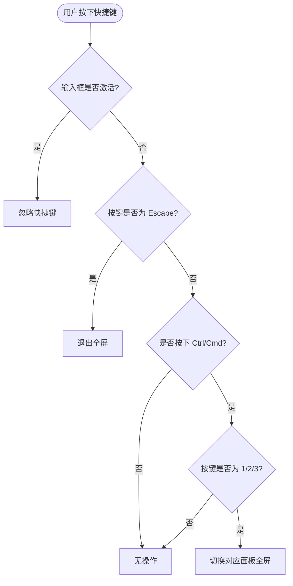
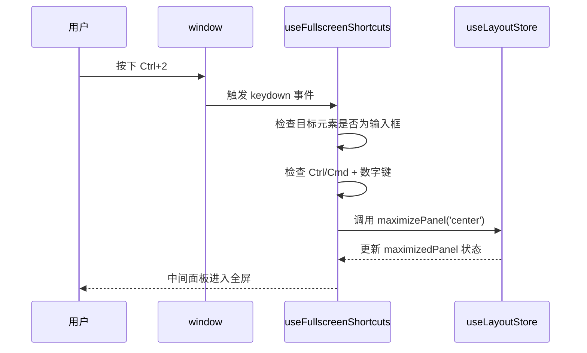
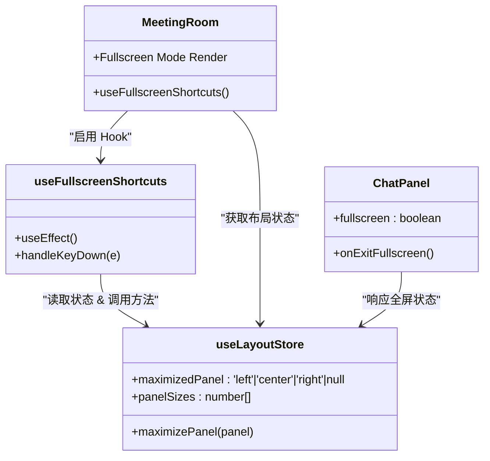

# useFullscreenShortcuts - 全屏快捷键绑定

<cite>
**本文档引用文件**  
- [useFullscreenShortcuts.ts](file://frontend/src/hooks/useFullscreenShortcuts.ts)
- [useLayoutStore.ts](file://frontend/src/stores/useLayoutStore.ts)
- [MeetingRoom.tsx](file://frontend/src/features/meeting/MeetingRoom.tsx)
- [ChatInput.tsx](file://frontend/src/components/chat/ChatInput.tsx)
- [SPEC-304-fullscreen-shortcuts.md](file://docs/specs/sprint4/SPEC-304-fullscreen-shortcuts.md)
</cite>

## 目录
1. [简介](#简介)
2. [核心功能与快捷键定义](#核心功能与快捷键定义)
3. [事件监听机制](#事件监听机制)
4. [快捷键冲突处理](#快捷键冲突处理)
5. [可配置性与扩展性](#可配置性与扩展性)
6. [用户体验提升分析](#用户体验提升分析)
7. [在会议房间组件中启用快捷键](#在会议房间组件中启用快捷键)
8. [实现方式与自定义示例](#实现方式与自定义示例)
9. [相关组件依赖关系](#相关组件依赖关系)
10. [测试与验证要点](#测试与验证要点)

## 简介
`useFullscreenShortcuts` 是一个 React Hook，用于在会议全屏模式下绑定键盘快捷键，提升用户在会议执行过程中的操作效率。该 Hook 提供了全局的键盘事件监听机制，支持通过快捷键快速切换面板全屏状态，并可通过 Escape 键退出当前全屏视图。

该功能的设计目标是让用户无需依赖鼠标即可高效地在工作流、对话和文档面板之间切换，特别适用于长时间参与会议或需要专注某一模块的场景。

**Section sources**
- [SPEC-304-fullscreen-shortcuts.md](file://docs/specs/sprint4/SPEC-304-fullscreen-shortcuts.md#L1-L99)

## 核心功能与快捷键定义
`useFullscreenShortcuts` 支持以下核心快捷键：

| 快捷键 | 功能 |
|--------|------|
| `Cmd/Ctrl + 1` | 切换左侧面板（工作流）全屏 |
| `Cmd/Ctrl + 2` | 切换中间面板（聊天）全屏 |
| `Cmd/Ctrl + 3` | 切换右侧面板（文档）全屏 |
| `Escape` | 退出当前全屏模式 |

这些快捷键允许用户快速聚焦于特定面板内容，例如在查看复杂工作流时进入全屏模式，或在阅读文档时临时放大右侧区域。



**Diagram sources**
- [SPEC-304-fullscreen-shortcuts.md](file://docs/specs/sprint4/SPEC-304-fullscreen-shortcuts.md#L10-L15)
- [useFullscreenShortcuts.ts](file://frontend/src/hooks/useFullscreenShortcuts.ts#L29-L49)

## 事件监听机制
`useFullscreenShortcuts` 使用 `useEffect` 在组件挂载时注册全局 `keydown` 事件监听器，并在卸载时自动移除，防止内存泄漏。

事件处理逻辑如下：
1. 监听 `window` 上的 `keydown` 事件。
2. 检查当前焦点是否在输入框（如 `<input>` 或 `<textarea>`）中，若是则忽略快捷键以避免干扰用户输入。
3. 处理 Escape 键：若当前有面板处于全屏状态，则调用 `maximizePanel(null)` 退出全屏。
4. 处理 Ctrl/Cmd + 数字键组合：根据数字映射到左、中、右面板，并切换其全屏状态。

该 Hook 依赖 `useLayoutStore` 中的 `maximizedPanel` 和 `maximizePanel` 状态进行面板控制。



**Diagram sources**
- [useFullscreenShortcuts.ts](file://frontend/src/hooks/useFullscreenShortcuts.ts#L22-L56)
- [useLayoutStore.ts](file://frontend/src/stores/useLayoutStore.ts#L15-L30)

## 快捷键冲突处理
为避免与浏览器默认快捷键或用户输入冲突，`useFullscreenShortcuts` 实现了以下冲突处理策略：

1. **输入框保护机制**：当用户正在 `<input>` 或 `<textarea>` 中输入时，所有快捷键均被忽略，确保不会意外触发全屏切换。
2. **修饰键过滤**：仅响应带有 `Ctrl` 或 `Meta`（Cmd）的组合键，排除 `Shift`、`Alt` 等其他修饰键，减少误触。
3. **事件阻止**：在处理快捷键时调用 `e.preventDefault()`，防止浏览器执行默认行为（如 Ctrl+1 切换标签页）。
4. **条件性响应**：Escape 键仅在有面板全屏时才生效，避免影响其他页面逻辑。

这些机制共同保障了快捷键系统的稳定性和可用性。

**Section sources**
- [useFullscreenShortcuts.ts](file://frontend/src/hooks/useFullscreenShortcuts.ts#L24-L27)
- [SPEC-304-fullscreen-shortcuts.md](file://docs/specs/sprint4/SPEC-304-fullscreen-shortcuts.md#L38-L43)

## 可配置性与扩展性
尽管当前实现为固定快捷键，但 `useFullscreenShortcuts` 具备良好的可扩展性，开发者可通过以下方式自定义：

- **参数化配置**：可将快捷键映射抽象为参数，允许外部传入自定义键位。
- **动态注册**：支持运行时动态添加/移除快捷键绑定。
- **平台适配**：自动识别 Mac 平台并显示 `⌘` 符号提示，提升跨平台体验。
- **状态驱动**：基于 `useLayoutStore` 的状态变化自动更新行为，无需手动管理生命周期。

未来可通过引入配置对象实现更灵活的快捷键管理。

**Section sources**
- [useFullscreenShortcuts.ts](file://frontend/src/hooks/useFullscreenShortcuts.ts#L36-L49)
- [SPEC-304-fullscreen-shortcuts.md](file://docs/specs/sprint4/SPEC-304-fullscreen-shortcuts.md#L76-L86)

## 用户体验提升分析
`useFullscreenShortcuts` 显著提升了会议过程中的操作效率和专注度：

- **减少鼠标依赖**：用户无需频繁点击“全屏”按钮，通过键盘即可完成面板切换。
- **提升操作速度**：熟练用户可在毫秒级完成面板切换，加快信息获取节奏。
- **增强沉浸感**：全屏模式结合快捷键使用户更专注于当前任务，减少界面干扰。
- **降低认知负荷**：统一的数字键映射（1/2/3）符合直觉记忆，易于掌握。

特别是在多轮讨论、文档审阅等高频交互场景中，该功能极大优化了工作流连续性。

**Section sources**
- [MeetingRoom.tsx](file://frontend/src/features/meeting/MeetingRoom.tsx#L82)
- [SPEC-304-fullscreen-shortcuts.md](file://docs/specs/sprint4/SPEC-304-fullscreen-shortcuts.md#L1-L5)

## 在会议房间组件中启用快捷键
在 `MeetingRoom` 组件中启用 `useFullscreenShortcuts` 极其简单，只需在组件顶层调用该 Hook 即可：

```tsx
export const MeetingRoom: FC = () => {
  useWebSocketRouter();
  useFullscreenShortcuts(); // 启用全屏快捷键
  // ...
};
```

一旦启用，整个会议房间即具备快捷键能力。当用户按下 `Ctrl+2` 时，中间聊天面板将进入全屏；按下 `Escape` 可随时退出。

全屏状态下，系统会渲染独立的全屏组件（如 `ChatPanel fullscreen`），并通过 `onExitFullscreen` 回调提供退出入口。

**Section sources**
- [MeetingRoom.tsx](file://frontend/src/features/meeting/MeetingRoom.tsx#L82)
- [MeetingRoom.tsx](file://frontend/src/features/meeting/MeetingRoom.tsx#L138-L151)

## 实现方式与自定义示例
以下是如何在项目中使用和扩展 `useFullscreenShortcuts` 的实现方式：

### 基础使用
```ts
useFullscreenShortcuts();
```

### 自定义快捷键（建议扩展方向）
```ts
type ShortcutConfig = {
  toggleLeft?: string;
  toggleCenter?: string;
  toggleRight?: string;
  exitFullscreen?: string;
};

export const useCustomFullscreenShortcuts = (config: ShortcutConfig = {}) => {
  const { maximizedPanel, maximizePanel } = useLayoutStore();
  const defaultConfig = {
    toggleLeft: '1',
    toggleCenter: '2',
    toggleRight: '3',
    exitFullscreen: 'Escape',
    ...config
  };

  useEffect(() => {
    const handler = (e: KeyboardEvent) => {
      if (['INPUT', 'TEXTAREA'].includes((e.target as HTMLElement).tagName)) return;

      if (e.key === defaultConfig.exitFullscreen && maximizedPanel) {
        maximizePanel(null);
        return;
      }

      if ((e.metaKey || e.ctrlKey)) {
        if (e.key === defaultConfig.toggleLeft) {
          e.preventDefault();
          maximizePanel(maximizedPanel === 'left' ? null : 'left');
        }
        if (e.key === defaultConfig.toggleCenter) {
          e.preventDefault();
          maximizePanel(maximizedPanel === 'center' ? null : 'center');
        }
        if (e.key === defaultConfig.toggleRight) {
          e.preventDefault();
          maximizePanel(maximizedPanel === 'right' ? null : 'right');
        }
      }
    };

    window.addEventListener('keydown', handler);
    return () => window.removeEventListener('keydown', handler);
  }, [maximizedPanel, maximizePanel, config]);
};
```

此扩展方案允许开发者传入自定义键位，提升灵活性。

**Section sources**
- [useFullscreenShortcuts.ts](file://frontend/src/hooks/useFullscreenShortcuts.ts#L19-L57)
- [MeetingRoom.tsx](file://frontend/src/features/meeting/MeetingRoom.tsx#L82)

## 相关组件依赖关系
`useFullscreenShortcuts` 依赖以下核心组件协同工作：



**Diagram sources**
- [useFullscreenShortcuts.ts](file://frontend/src/hooks/useFullscreenShortcuts.ts#L20)
- [useLayoutStore.ts](file://frontend/src/stores/useLayoutStore.ts#L10-L15)
- [MeetingRoom.tsx](file://frontend/src/features/meeting/MeetingRoom.tsx#L82)

## 测试与验证要点
根据 SPEC 文档，`useFullscreenShortcuts` 需通过以下测试验证：

- [x] 各快捷键生效（Ctrl+1/2/3）
- [x] 面板切换正确
- [x] Escape 键可退出全屏
- [x] 不与浏览器默认快捷键冲突
- [x] 输入框激活时不触发快捷键

E2E 测试文件 `meeting-room.spec.ts` 虽未直接测试快捷键逻辑，但验证了会议房间的基本渲染和交互完整性，间接保障了快捷键运行环境的稳定性。

**Section sources**
- [SPEC-304-fullscreen-shortcuts.md](file://docs/specs/sprint4/SPEC-304-fullscreen-shortcuts.md#L95-L98)
- [meeting-room.spec.ts](file://e2e/tests/meeting-room.spec.ts#L1-L67)