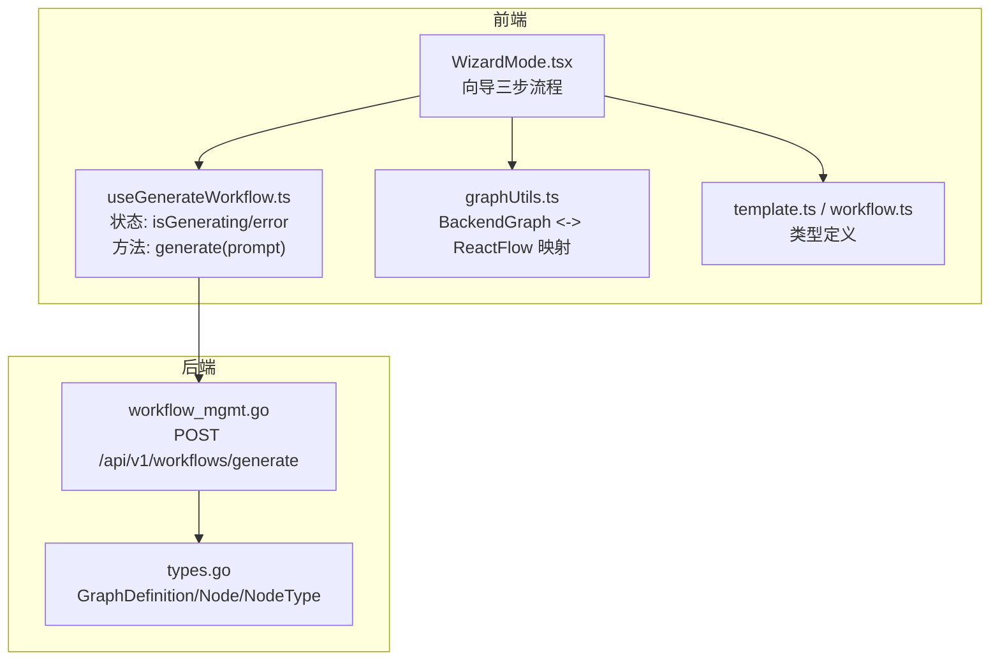
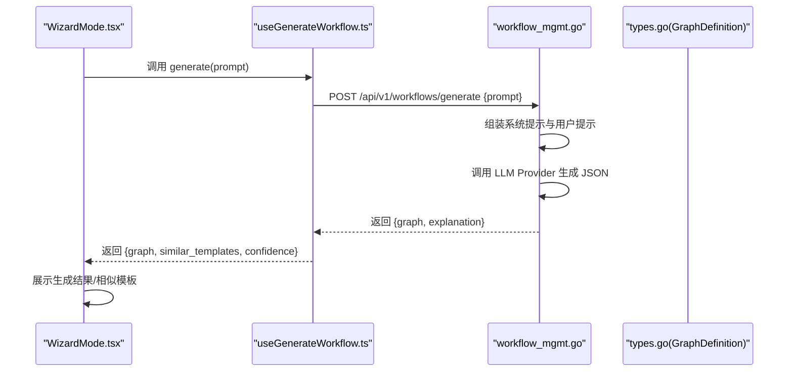
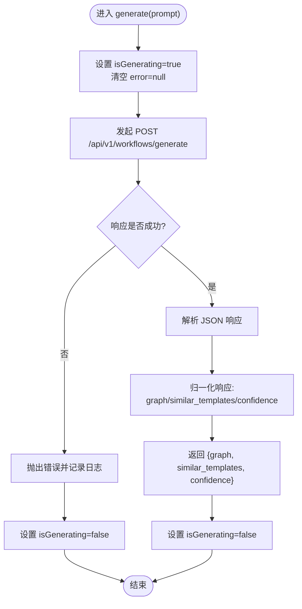
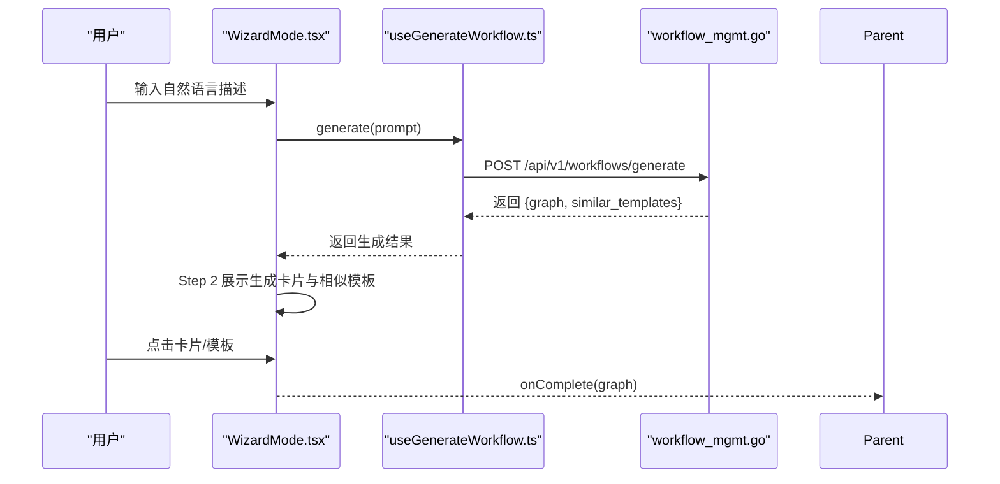
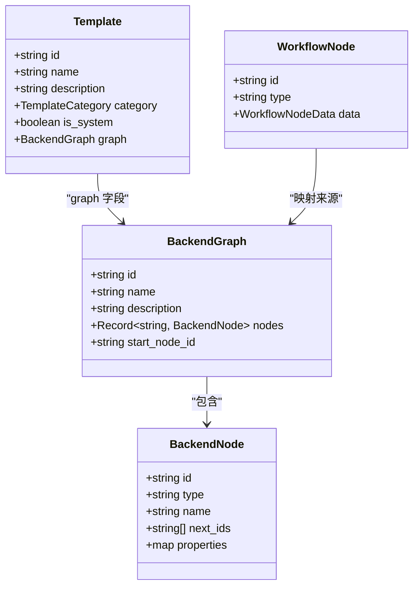
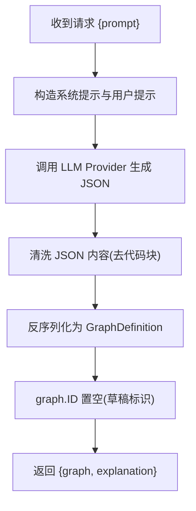
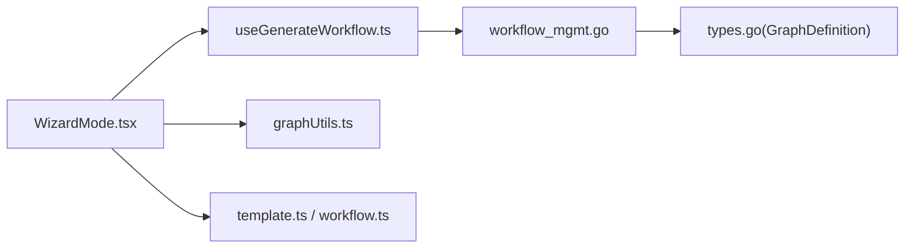

# useGenerateWorkflow - 自然语言生成工作流

<cite>
**本文引用的文件**
- [useGenerateWorkflow.ts](file://frontend/src/hooks/useGenerateWorkflow.ts)
- [WizardMode.tsx](file://frontend/src/features/editor/components/Wizard/WizardMode.tsx)
- [graphUtils.ts](file://frontend/src/utils/graphUtils.ts)
- [template.ts](file://frontend/src/types/template.ts)
- [workflow.ts](file://frontend/src/types/workflow.ts)
- [workflow_mgmt.go](file://internal/api/handler/workflow_mgmt.go)
- [types.go](file://internal/core/workflow/types.go)
- [SPEC-206-wizard-mode.md](file://docs/specs/sprint3/SPEC-206-wizard-mode.md)
- [13_nl2workflow.md](file://docs/tdd/02_core/13_nl2workflow.md)
</cite>

## 目录
1. [简介](#简介)
2. [项目结构](#项目结构)
3. [核心组件](#核心组件)
4. [架构总览](#架构总览)
5. [详细组件分析](#详细组件分析)
6. [依赖关系分析](#依赖关系分析)
7. [性能考量](#性能考量)
8. [故障排查指南](#故障排查指南)
9. [结论](#结论)
10. [附录](#附录)

## 简介
本技术文档围绕前端 Hook useGenerateWorkflow 展开，系统性说明其如何通过自然语言输入（NL2Workflow）调用后端 AI 网关服务，解析用户描述并返回可执行的工作流图结构；同时阐述状态管理、进度反馈与错误处理机制，并提供在“向导模式”中集成该 Hook 的完整示例，覆盖从文本输入到工作流预览的全流程实现。

## 项目结构
- 前端 Hook 位于 frontend/src/hooks/useGenerateWorkflow.ts，封装了与后端 /api/v1/workflows/generate 的交互逻辑。
- 向导组件 WizardMode.tsx 使用该 Hook 实现“意图输入 -> 生成结果 -> 选择模板或直接使用”的三步流程。
- 类型定义与工具：
  - graphUtils.ts 提供 BackendGraph 与 React Flow 节点映射转换。
  - template.ts 定义模板类型，支持“相似模板推荐”能力。
  - workflow.ts 定义前端工作流节点数据结构。
- 后端接口：
  - internal/api/handler/workflow_mgmt.go 中实现了 /api/v1/workflows/generate 的生成逻辑，调用 LLM 生成 GraphDefinition 并返回给前端。
  - internal/core/workflow/types.go 定义了 GraphDefinition、Node、NodeType 等核心数据结构。

图表来源
- [useGenerateWorkflow.ts](file://frontend/src/hooks/useGenerateWorkflow.ts#L1-L47)
- [WizardMode.tsx](file://frontend/src/features/editor/components/Wizard/WizardMode.tsx#L1-L180)
- [graphUtils.ts](file://frontend/src/utils/graphUtils.ts#L1-L131)
- [template.ts](file://frontend/src/types/template.ts#L1-L22)
- [workflow.ts](file://frontend/src/types/workflow.ts#L1-L45)
- [workflow_mgmt.go](file://internal/api/handler/workflow_mgmt.go#L110-L188)
- [types.go](file://internal/core/workflow/types.go#L1-L67)

章节来源
- [useGenerateWorkflow.ts](file://frontend/src/hooks/useGenerateWorkflow.ts#L1-L47)
- [WizardMode.tsx](file://frontend/src/features/editor/components/Wizard/WizardMode.tsx#L1-L180)
- [graphUtils.ts](file://frontend/src/utils/graphUtils.ts#L1-L131)
- [template.ts](file://frontend/src/types/template.ts#L1-L22)
- [workflow.ts](file://frontend/src/types/workflow.ts#L1-L45)
- [workflow_mgmt.go](file://internal/api/handler/workflow_mgmt.go#L110-L188)
- [types.go](file://internal/core/workflow/types.go#L1-L67)

## 核心组件
- useGenerateWorkflow Hook
  - 负责发起对 /api/v1/workflows/generate 的请求，接收后端返回的 BackendGraph 结构，并提供 isGenerating 与 error 状态，便于 UI 展示加载态与错误提示。
  - 返回值包含 graph、similar_templates（相似模板列表）、confidence（置信度），用于后续向导流程的决策与展示。
- WizardMode 向导组件
  - 三步流程：意图输入（Describe Intent）-> 生成结果（Review & Select）-> 进入编辑器（Refine）。
  - 在第二步展示生成的工作流卡片与“相似模板推荐”，支持点击直接应用模板或继续编辑。
- 类型与工具
  - BackendGraph 与 React Flow 节点映射：transformToReactFlow 将后端图结构转换为前端渲染所需的节点与边集合。
  - 模板类型 Template：包含 graph 字段，便于直接应用模板生成工作流。

章节来源
- [useGenerateWorkflow.ts](file://frontend/src/hooks/useGenerateWorkflow.ts#L1-L47)
- [WizardMode.tsx](file://frontend/src/features/editor/components/Wizard/WizardMode.tsx#L1-L180)
- [graphUtils.ts](file://frontend/src/utils/graphUtils.ts#L1-L131)
- [template.ts](file://frontend/src/types/template.ts#L1-L22)

## 架构总览
useGenerateWorkflow 的调用链路如下：
- 前端 Hook 发起 POST 请求至 /api/v1/workflows/generate，携带用户自然语言描述。
- 后端 Handler 解析请求，构造系统提示与用户提示，调用 LLM Provider 生成 JSON 格式的 GraphDefinition。
- 后端将生成的 GraphDefinition 返回给前端，前端 Hook 归一化响应并返回给调用方（如 WizardMode）。

图表来源
- [WizardMode.tsx](file://frontend/src/features/editor/components/Wizard/WizardMode.tsx#L1-L180)
- [useGenerateWorkflow.ts](file://frontend/src/hooks/useGenerateWorkflow.ts#L1-L47)
- [workflow_mgmt.go](file://internal/api/handler/workflow_mgmt.go#L110-L188)
- [types.go](file://internal/core/workflow/types.go#L1-L67)

## 详细组件分析

### useGenerateWorkflow Hook 分析
- 状态管理
  - isGenerating：在请求开始时置为 true，在 finally 中重置，用于 UI 展示加载态。
  - error：捕获异常并设置错误信息，便于上层组件显示错误提示。
- 请求与响应
  - 请求体包含 prompt 字段，后端期望 JSON 结构为 { prompt }。
  - 响应归一化：若后端返回 { graph, explanation }，则取 graph；若仅返回 JSON 对象本身，则直接作为 graph 使用；similar_templates 默认空数组，confidence 默认 0.85。
- 错误处理
  - 非 2xx 响应抛出错误；catch 中记录日志并设置 error；finally 清理 isGenerating。
- 适用场景
  - 与 WizardMode 集成，实现“意图输入 -> 生成工作流 -> 选择模板或继续编辑”的闭环。

图表来源
- [useGenerateWorkflow.ts](file://frontend/src/hooks/useGenerateWorkflow.ts#L1-L47)

章节来源
- [useGenerateWorkflow.ts](file://frontend/src/hooks/useGenerateWorkflow.ts#L1-L47)

### WizardMode 向导组件分析
- 步骤与交互
  - Step 1：用户输入自然语言描述，点击“生成工作流”。调用 useGenerateWorkflow.generate，成功后进入 Step 2。
  - Step 2：展示生成的工作流卡片与“相似模板推荐”。用户可点击卡片直接应用生成图，或选择相似模板应用。
  - Step 3：预览阶段逻辑迁移到编辑器，向导完成回调 onComplete(graph)。
- 状态与 UI
  - isGenerating 控制按钮禁用与加载图标。
  - error 用于显示错误提示。
- 回调与集成
  - onComplete(graph)：将生成的 BackendGraph 传递给父组件，父组件负责将其作为新工作流载入编辑器。

图表来源
- [WizardMode.tsx](file://frontend/src/features/editor/components/Wizard/WizardMode.tsx#L1-L180)
- [useGenerateWorkflow.ts](file://frontend/src/hooks/useGenerateWorkflow.ts#L1-L47)
- [workflow_mgmt.go](file://internal/api/handler/workflow_mgmt.go#L110-L188)

章节来源
- [WizardMode.tsx](file://frontend/src/features/editor/components/Wizard/WizardMode.tsx#L1-L180)

### 类型与工具映射
- BackendGraph 与 React Flow 节点映射
  - transformToReactFlow 将 BackendGraph.nodes 与 next_ids 转换为 React Flow 的 Node/Edge 结构，并计算布局层级。
  - 支持 start/end/agent/vote/loop/fact_check/human_review 等节点类型的映射。
- 模板类型 Template
  - 包含 graph 字段，便于直接应用模板生成工作流。
- 前端节点数据结构
  - workflow.ts 定义了前端节点数据结构，便于属性面板与编辑器渲染。

图表来源
- [graphUtils.ts](file://frontend/src/utils/graphUtils.ts#L1-L131)
- [template.ts](file://frontend/src/types/template.ts#L1-L22)
- [workflow.ts](file://frontend/src/types/workflow.ts#L1-L45)
- [types.go](file://internal/core/workflow/types.go#L1-L67)

章节来源
- [graphUtils.ts](file://frontend/src/utils/graphUtils.ts#L1-L131)
- [template.ts](file://frontend/src/types/template.ts#L1-L22)
- [workflow.ts](file://frontend/src/types/workflow.ts#L1-L45)
- [types.go](file://internal/core/workflow/types.go#L1-L67)

### 后端 NL2Workflow 生成流程
- 接口定义
  - POST /api/v1/workflows/generate：接收 { prompt }，返回 { graph, explanation }。
- 生成策略
  - 后端构造系统提示与用户提示，调用 LLM Provider 生成 JSON 格式的 GraphDefinition。
  - 对响应进行清理（去除 Markdown 代码块标记），并确保 graph.ID 为空以便前端以“新建草稿”方式提交。
- 数据结构
  - GraphDefinition、Node、NodeType 等由后端核心类型定义，保证前后端一致。

图表来源
- [workflow_mgmt.go](file://internal/api/handler/workflow_mgmt.go#L110-L188)
- [types.go](file://internal/core/workflow/types.go#L1-L67)

章节来源
- [workflow_mgmt.go](file://internal/api/handler/workflow_mgmt.go#L110-L188)
- [types.go](file://internal/core/workflow/types.go#L1-L67)
- [13_nl2workflow.md](file://docs/tdd/02_core/13_nl2workflow.md#L1-L72)

## 依赖关系分析
- 前端依赖
  - useGenerateWorkflow.ts 依赖 fetch 与后端 /api/v1/workflows/generate。
  - WizardMode.tsx 依赖 useGenerateWorkflow.ts、graphUtils.ts、template.ts。
- 后端依赖
  - workflow_mgmt.go 依赖 LLM Registry 与 Provider，生成 GraphDefinition。
  - types.go 定义 GraphDefinition/Node/NodeType，作为前后端契约。

图表来源
- [useGenerateWorkflow.ts](file://frontend/src/hooks/useGenerateWorkflow.ts#L1-L47)
- [WizardMode.tsx](file://frontend/src/features/editor/components/Wizard/WizardMode.tsx#L1-L180)
- [graphUtils.ts](file://frontend/src/utils/graphUtils.ts#L1-L131)
- [template.ts](file://frontend/src/types/template.ts#L1-L22)
- [workflow.ts](file://frontend/src/types/workflow.ts#L1-L45)
- [workflow_mgmt.go](file://internal/api/handler/workflow_mgmt.go#L110-L188)
- [types.go](file://internal/core/workflow/types.go#L1-L67)

章节来源
- [useGenerateWorkflow.ts](file://frontend/src/hooks/useGenerateWorkflow.ts#L1-L47)
- [WizardMode.tsx](file://frontend/src/features/editor/components/Wizard/WizardMode.tsx#L1-L180)
- [workflow_mgmt.go](file://internal/api/handler/workflow_mgmt.go#L110-L188)
- [types.go](file://internal/core/workflow/types.go#L1-L67)

## 性能考量
- 前端
  - useGenerateWorkflow.ts 在请求期间设置 isGenerating，避免重复触发；finally 中统一重置，减少 UI 抖动。
  - 建议在 UI 层增加防抖与空输入校验，避免频繁无效请求。
- 后端
  - LLM 调用成本较高，建议在网关层做缓存与限流；对响应进行严格清洗，避免解析失败导致的 5xx。
  - GraphDefinition 的生成应尽量保持 JSON 结构稳定，减少前端解析分支。

## 故障排查指南
- 常见问题
  - 请求未返回 2xx：检查网络与后端服务状态；查看 isGenerating 是否被正确重置。
  - 解析失败：后端返回的 JSON 可能包含代码块标记，需清洗后再解析；确认后端已将 graph.ID 置空。
  - 错误提示：useGenerateWorkflow.ts 捕获异常并设置 error，可在 UI 中展示具体错误信息。
- 建议排查步骤
  - 打开浏览器开发者工具，查看 /api/v1/workflows/generate 的请求与响应。
  - 确认后端 LLM Provider 可用且模型配置正确。
  - 若出现解析错误，检查后端清洗逻辑与 JSON 结构一致性。

章节来源
- [useGenerateWorkflow.ts](file://frontend/src/hooks/useGenerateWorkflow.ts#L1-L47)
- [workflow_mgmt.go](file://internal/api/handler/workflow_mgmt.go#L110-L188)

## 结论
useGenerateWorkflow Hook 通过简洁的状态管理与错误处理，将自然语言描述转化为可执行的工作流图结构，并与 WizardMode 向导模式无缝集成。后端以 /api/v1/workflows/generate 为核心，结合 LLM 生成 GraphDefinition，形成从前端意图输入到后端智能生成的完整闭环。配合模板推荐与节点映射工具，用户可快速从文本生成工作流并进入编辑器进行二次调整。

## 附录
- API 规范（后端）
  - POST /api/v1/workflows/generate
    - 请求体：{ prompt }
    - 响应体：{ graph, explanation }
- 前端 Hook 行为
  - generate(prompt) 返回 { graph, similar_templates?, confidence? }，并维护 isGenerating 与 error。
- 向导模式集成要点
  - Step 1：收集用户意图，调用 generate。
  - Step 2：展示生成卡片与相似模板，支持直接应用。
  - Step 3：将生成图交由父组件进入编辑器。

章节来源
- [SPEC-206-wizard-mode.md](file://docs/specs/sprint3/SPEC-206-wizard-mode.md#L1-L153)
- [13_nl2workflow.md](file://docs/tdd/02_core/13_nl2workflow.md#L1-L72)
- [useGenerateWorkflow.ts](file://frontend/src/hooks/useGenerateWorkflow.ts#L1-L47)
- [WizardMode.tsx](file://frontend/src/features/editor/components/Wizard/WizardMode.tsx#L1-L180)
- [workflow_mgmt.go](file://internal/api/handler/workflow_mgmt.go#L110-L188)