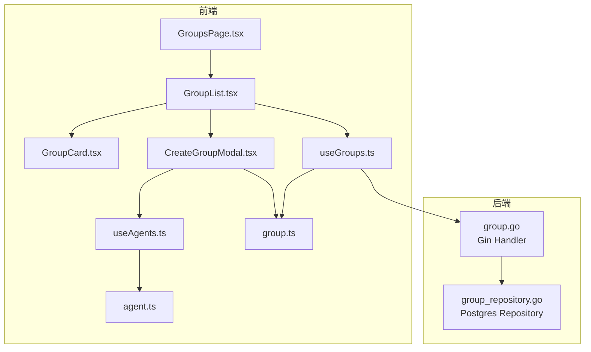
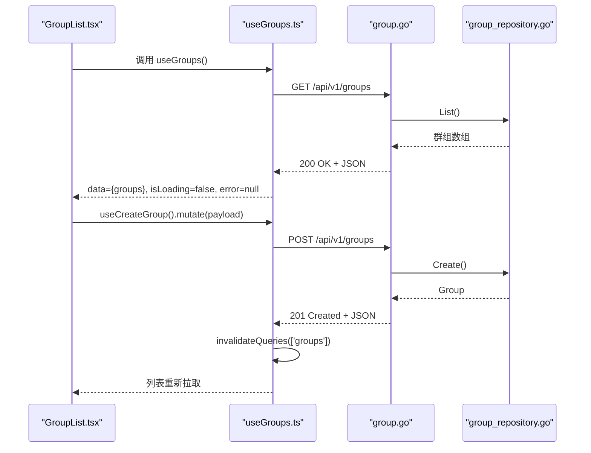
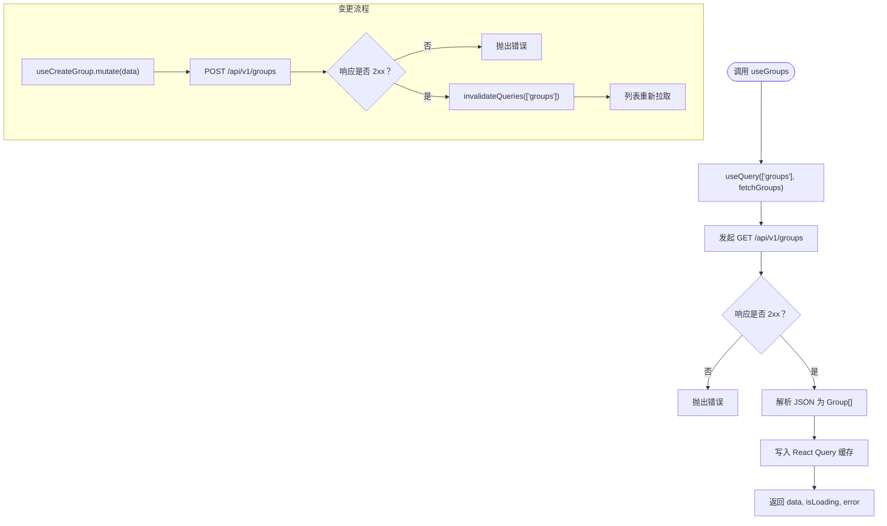
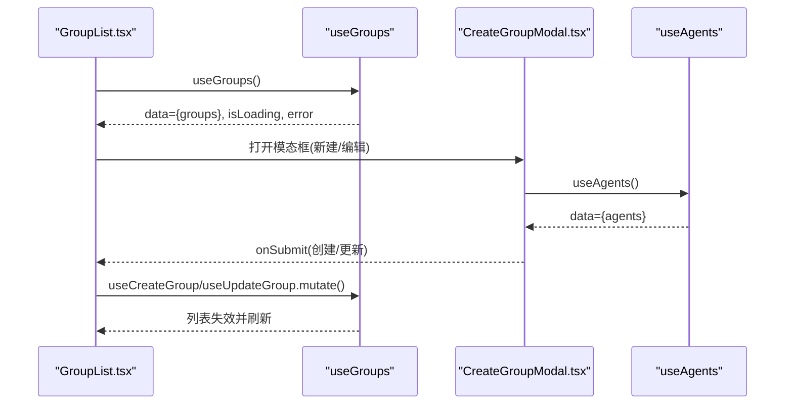
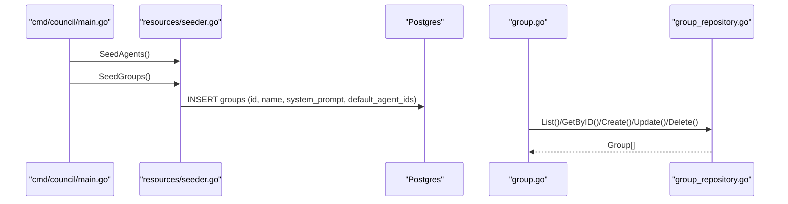
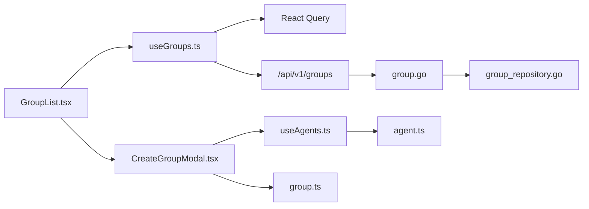

# useGroups - 群组资源管理

<cite>
**本文引用的文件**
- [useGroups.ts](file://frontend/src/hooks/useGroups.ts)
- [group.ts](file://frontend/src/types/group.ts)
- [GroupsPage.tsx](file://frontend/src/features/groups/pages/GroupsPage.tsx)
- [GroupList.tsx](file://frontend/src/features/groups/components/GroupList.tsx)
- [GroupCard.tsx](file://frontend/src/features/groups/components/GroupCard.tsx)
- [CreateGroupModal.tsx](file://frontend/src/features/groups/components/CreateGroupModal.tsx)
- [useAgents.ts](file://frontend/src/hooks/useAgents.ts)
- [agent.ts](file://frontend/src/types/agent.ts)
- [group.go](file://internal/api/handler/group.go)
- [group_test.go](file://internal/api/handler/group_test.go)
- [group_repository.go](file://internal/infrastructure/persistence/group_repository.go)
- [SPEC-602-default-group.md](file://docs/specs/sprint6/SPEC-602-default-group.md)
- [SPEC-101-groups-page.md](file://docs/specs/sprint2/SPEC-101-groups-page.md)
- [groups.spec.ts](file://e2e/tests/groups.spec.ts)
</cite>

## 目录
1. [简介](#简介)
2. [项目结构](#项目结构)
3. [核心组件](#核心组件)
4. [架构总览](#架构总览)
5. [详细组件分析](#详细组件分析)
6. [依赖分析](#依赖分析)
7. [性能考虑](#性能考虑)
8. [故障排查指南](#故障排查指南)
9. [结论](#结论)
10. [附录](#附录)

## 简介
本文件系统化阐述 useGroups Hook 的设计与实现，覆盖群组资源的获取、创建、更新、删除与状态同步能力；说明其在群组列表展示、默认群组初始化、群组成员管理（默认代理）方面的职责与边界；解释与 useAgents 的协同关系，以及在群组页面中的实际应用；并提供错误处理机制与数据刷新策略，帮助开发者正确集成到前端界面中。

## 项目结构
useGroups 位于前端 hooks 层，围绕群组资源提供查询与变更能力；群组页面由 GroupsPage 调用 GroupList 渲染，GroupList 再使用 useGroups 与 useCreateGroup/useUpdateGroup/useDeleteGroup 等 Hook 实现 CRUD；CreateGroupModal 通过 useAgents 获取可用代理用于默认成员选择；后端由 Gin Handler 提供 REST 接口，持久层由 PostgreSQL Repository 实现。

图表来源
- [GroupsPage.tsx](file://frontend/src/features/groups/pages/GroupsPage.tsx#L1-L21)
- [GroupList.tsx](file://frontend/src/features/groups/components/GroupList.tsx#L1-L132)
- [CreateGroupModal.tsx](file://frontend/src/features/groups/components/CreateGroupModal.tsx#L1-L174)
- [useGroups.ts](file://frontend/src/hooks/useGroups.ts#L1-L107)
- [useAgents.ts](file://frontend/src/hooks/useAgents.ts#L1-L103)
- [group.go](file://internal/api/handler/group.go#L1-L98)
- [group_repository.go](file://internal/infrastructure/persistence/group_repository.go#L1-L113)

章节来源
- [useGroups.ts](file://frontend/src/hooks/useGroups.ts#L1-L107)
- [group.ts](file://frontend/src/types/group.ts#L1-L17)
- [GroupsPage.tsx](file://frontend/src/features/groups/pages/GroupsPage.tsx#L1-L21)
- [GroupList.tsx](file://frontend/src/features/groups/components/GroupList.tsx#L1-L132)
- [CreateGroupModal.tsx](file://frontend/src/features/groups/components/CreateGroupModal.tsx#L1-L174)
- [useAgents.ts](file://frontend/src/hooks/useAgents.ts#L1-L103)
- [agent.ts](file://frontend/src/types/agent.ts#L1-L35)
- [group.go](file://internal/api/handler/group.go#L1-L98)
- [group_repository.go](file://internal/infrastructure/persistence/group_repository.go#L1-L113)

## 核心组件
- useGroups：提供群组列表查询与单个群组查询；封装 fetchGroups/fetchGroup。
- useCreateGroup/useUpdateGroup/useDeleteGroup：提供创建、更新、删除群组的 Mutation，并在成功后通过 React Query 的 invalidateQueries 触发缓存失效与数据刷新。
- GroupList：渲染群组列表、搜索过滤、打开新建/编辑模态框、处理删除确认；内部组合 useGroups 与 useCreateGroup/useUpdateGroup/useDeleteGroup。
- CreateGroupModal：提供群组表单（名称、图标、系统提示），并从 useAgents 获取代理列表作为默认成员选择器。
- GroupCard：展示群组基本信息与成员数量。
- 类型定义：Group、CreateGroupInput（前端）、Agent（前端）。

章节来源
- [useGroups.ts](file://frontend/src/hooks/useGroups.ts#L1-L107)
- [group.ts](file://frontend/src/types/group.ts#L1-L17)
- [GroupList.tsx](file://frontend/src/features/groups/components/GroupList.tsx#L1-L132)
- [CreateGroupModal.tsx](file://frontend/src/features/groups/components/CreateGroupModal.tsx#L1-L174)
- [GroupCard.tsx](file://frontend/src/features/groups/components/GroupCard.tsx#L1-L53)
- [useAgents.ts](file://frontend/src/hooks/useAgents.ts#L1-L103)
- [agent.ts](file://frontend/src/types/agent.ts#L1-L35)

## 架构总览
useGroups 通过 React Query 的 useQuery/useMutation 与后端 REST API 协作，遵循“查询键”和“失效策略”的约定，保证 UI 与后端数据的一致性。前端类型与后端实体字段保持一致，便于跨层协作。

图表来源
- [GroupList.tsx](file://frontend/src/features/groups/components/GroupList.tsx#L1-L132)
- [useGroups.ts](file://frontend/src/hooks/useGroups.ts#L1-L107)
- [group.go](file://internal/api/handler/group.go#L1-L98)
- [group_repository.go](file://internal/infrastructure/persistence/group_repository.go#L1-L113)

## 详细组件分析

### useGroups Hook 设计与数据流
- 查询键：['groups'] 用于列表缓存；['groups', id] 用于单个群组缓存。
- 查询函数：
  - fetchGroups：GET /api/v1/groups，返回 Group[]。
  - fetchGroup：GET /api/v1/groups/:id，返回 Group。
- 变更函数：
  - createGroup：POST /api/v1/groups，请求体为 CreateGroupInput，响应为 Group。
  - updateGroup：PUT /api/v1/groups/:id，请求体为 Group，响应为 Group。
  - deleteGroup：DELETE /api/v1/groups/:id。
- 成功回调：
  - useCreateGroup/useUpdateGroup/useDeleteGroup 在 onSuccess 中调用 queryClient.invalidateQueries，触发相关查询键的缓存失效，从而触发 UI 重新拉取最新数据。
- 错误处理：
  - 前端 fetch 返回非 2xx 时抛出错误；后端 Gin Handler 将错误信息以 JSON 返回，前端解析并抛出错误，交由 React Query 错误边界或上层 UI 处理。

图表来源
- [useGroups.ts](file://frontend/src/hooks/useGroups.ts#L1-L107)

章节来源
- [useGroups.ts](file://frontend/src/hooks/useGroups.ts#L1-L107)

### 群组列表展示与搜索过滤
- GroupList 调用 useGroups 获取 groups，并在加载中显示占位，在错误时显示错误信息。
- 支持按名称与系统提示进行模糊搜索过滤。
- 提供新建/编辑模态框，提交时根据是否存在 editingGroup 决定走创建或更新路径。
- 删除前弹窗确认，确认后调用 useDeleteGroup.mutate。

图表来源
- [GroupList.tsx](file://frontend/src/features/groups/components/GroupList.tsx#L1-L132)
- [CreateGroupModal.tsx](file://frontend/src/features/groups/components/CreateGroupModal.tsx#L1-L174)
- [useAgents.ts](file://frontend/src/hooks/useAgents.ts#L1-L103)

章节来源
- [GroupList.tsx](file://frontend/src/features/groups/components/GroupList.tsx#L1-L132)
- [CreateGroupModal.tsx](file://frontend/src/features/groups/components/CreateGroupModal.tsx#L1-L174)
- [useAgents.ts](file://frontend/src/hooks/useAgents.ts#L1-L103)

### 默认群组初始化与群组成员管理
- 默认群组初始化：通过 Go Seeder 在服务启动时注入“默认群组”，包含默认代理 ID 列表，确保首次进入系统即存在可用群组。
- 群组成员管理：前端 CreateGroupModal 通过 useAgents 获取代理列表，允许用户勾选默认成员；后端持久层存储 default_agent_ids 字段，前端 GroupCard 展示成员数量。

图表来源
- [SPEC-602-default-group.md](file://docs/specs/sprint6/SPEC-602-default-group.md#L1-L99)
- [group.go](file://internal/api/handler/group.go#L1-L98)
- [group_repository.go](file://internal/infrastructure/persistence/group_repository.go#L1-L113)

章节来源
- [SPEC-602-default-group.md](file://docs/specs/sprint6/SPEC-602-default-group.md#L1-L99)
- [CreateGroupModal.tsx](file://frontend/src/features/groups/components/CreateGroupModal.tsx#L1-L174)
- [GroupCard.tsx](file://frontend/src/features/groups/components/GroupCard.tsx#L1-L53)
- [group_repository.go](file://internal/infrastructure/persistence/group_repository.go#L1-L113)

### 与 useAgents 的协同关系
- CreateGroupModal 依赖 useAgents 获取代理列表，用于选择默认成员。
- GroupCard 展示 default_agent_ids 的长度作为成员数量。
- 两者共享“默认成员”语义，前端通过 default_agent_ids 字段维护群组的默认代理集合。

章节来源
- [CreateGroupModal.tsx](file://frontend/src/features/groups/components/CreateGroupModal.tsx#L1-L174)
- [GroupCard.tsx](file://frontend/src/features/groups/components/GroupCard.tsx#L1-L53)
- [useAgents.ts](file://frontend/src/hooks/useAgents.ts#L1-L103)
- [agent.ts](file://frontend/src/types/agent.ts#L1-L35)

### 在群组页面中的实际应用
- GroupsPage 作为容器页面，仅负责布局与标题说明，实际列表渲染由 GroupList 完成。
- GroupList 负责与 useGroups、useCreateGroup/useUpdateGroup/useDeleteGroup 协作，完成 CRUD 与搜索过滤。
- 页面通过 React Router 导航至 /groups，Playwright 测试验证页面渲染与交互元素存在。

章节来源
- [GroupsPage.tsx](file://frontend/src/features/groups/pages/GroupsPage.tsx#L1-L21)
- [GroupList.tsx](file://frontend/src/features/groups/components/GroupList.tsx#L1-L132)
- [groups.spec.ts](file://e2e/tests/groups.spec.ts#L1-L27)

## 依赖分析
- 前端依赖：
  - useGroups 依赖 React Query（useQuery/useMutation/useQueryClient）与 fetch。
  - GroupList 依赖 useGroups 与 useCreateGroup/useUpdateGroup/useDeleteGroup。
  - CreateGroupModal 依赖 useAgents。
  - 类型定义来自 group.ts 与 agent.ts。
- 后端依赖：
  - Gin Handler 提供 REST 接口，调用 GroupRepository 访问数据库。
  - GroupRepository 使用 Postgres 进行 CRUD。

图表来源
- [useGroups.ts](file://frontend/src/hooks/useGroups.ts#L1-L107)
- [GroupList.tsx](file://frontend/src/features/groups/components/GroupList.tsx#L1-L132)
- [CreateGroupModal.tsx](file://frontend/src/features/groups/components/CreateGroupModal.tsx#L1-L174)
- [useAgents.ts](file://frontend/src/hooks/useAgents.ts#L1-L103)
- [group.go](file://internal/api/handler/group.go#L1-L98)
- [group_repository.go](file://internal/infrastructure/persistence/group_repository.go#L1-L113)

章节来源
- [useGroups.ts](file://frontend/src/hooks/useGroups.ts#L1-L107)
- [GroupList.tsx](file://frontend/src/features/groups/components/GroupList.tsx#L1-L132)
- [CreateGroupModal.tsx](file://frontend/src/features/groups/components/CreateGroupModal.tsx#L1-L174)
- [useAgents.ts](file://frontend/src/hooks/useAgents.ts#L1-L103)
- [group.go](file://internal/api/handler/group.go#L1-L98)
- [group_repository.go](file://internal/infrastructure/persistence/group_repository.go#L1-L113)

## 性能考虑
- 使用 React Query 的查询键与失效策略，避免不必要的网络请求；在创建/更新/删除成功后统一失效相关查询键，减少手动刷新成本。
- 列表渲染采用基础网格布局，搜索过滤在内存中进行，建议在数据量较大时引入分页或服务端过滤。
- Modal 中的代理列表滚动区域限制高度，避免长列表导致的重排压力。

## 故障排查指南
- 前端错误处理：
  - useGroups 中 fetch 返回非 2xx 会抛出错误；Create/Update/Delete 在响应非 2xx 时解析后端 JSON 错误并抛出。
  - GroupList 对 error 进行显式展示，便于定位问题。
- 后端错误处理：
  - Gin Handler 对 JSON 解析失败返回 400；参数格式错误返回 400；未找到返回 404；其他错误返回 500。
  - 测试覆盖了创建、获取、列表等场景的状态码与响应。
- 数据一致性：
  - 成功变更后通过 invalidateQueries 触发缓存失效，确保 UI 与后端一致。
- E2E 验证：
  - Playwright 测试验证群组页面渲染与交互元素存在，有助于快速发现页面级回归问题。

章节来源
- [useGroups.ts](file://frontend/src/hooks/useGroups.ts#L1-L107)
- [GroupList.tsx](file://frontend/src/features/groups/components/GroupList.tsx#L1-L132)
- [group.go](file://internal/api/handler/group.go#L1-L98)
- [group_test.go](file://internal/api/handler/group_test.go#L1-L145)
- [groups.spec.ts](file://e2e/tests/groups.spec.ts#L1-L27)

## 结论
useGroups Hook 以 React Query 为核心，提供了完整的群组资源管理能力：列表获取、单条查询、创建、更新、删除与状态同步。它与 useAgents 协同实现“默认成员”管理，并在群组页面中承担关键的数据与交互职责。后端 Handler 与 Repository 提供稳定的 REST 接口与持久化能力，配合测试与 E2E 验证，确保功能的可靠性与可维护性。开发者可基于此 Hook 快速集成群组管理功能，并通过统一的错误处理与刷新策略提升用户体验。

## 附录
- API 定义参考（后端）：
  - GET /api/v1/groups -> 200 + Group[]
  - GET /api/v1/groups/:id -> 200 + Group
  - POST /api/v1/groups -> 201 + Group
  - PUT /api/v1/groups/:id -> 200 + Group
  - DELETE /api/v1/groups/:id -> 204
- 前端类型定义：
  - Group、CreateGroupInput（前端）
  - Agent、CreateAgentInput（前端）

章节来源
- [group.go](file://internal/api/handler/group.go#L1-L98)
- [group_test.go](file://internal/api/handler/group_test.go#L1-L145)
- [group.ts](file://frontend/src/types/group.ts#L1-L17)
- [agent.ts](file://frontend/src/types/agent.ts#L1-L35)
- [SPEC-101-groups-page.md](file://docs/specs/sprint2/SPEC-101-groups-page.md#L35-L118)