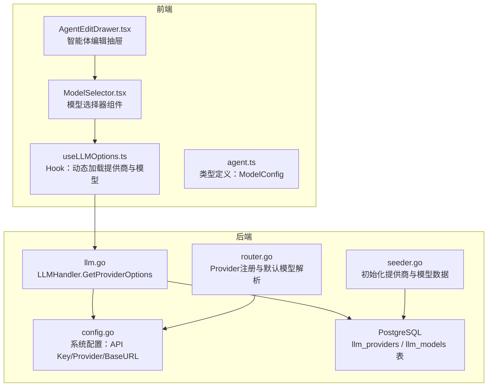
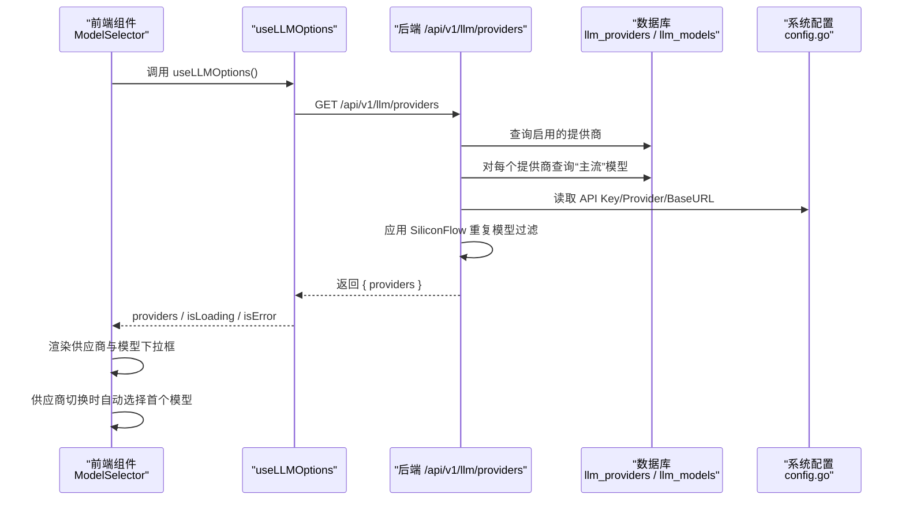
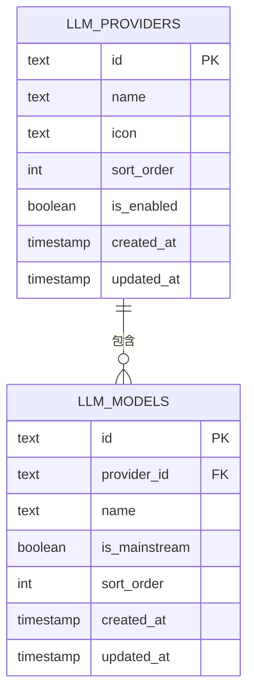
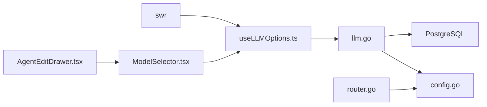

# useLLMOptions - LLM模型选项管理

<cite>
**本文引用的文件**
- [useLLMOptions.ts](file://frontend/src/hooks/useLLMOptions.ts)
- [ModelSelector.tsx](file://frontend/src/features/agents/components/ModelSelector.tsx)
- [AgentEditDrawer.tsx](file://frontend/src/features/agents/components/AgentEditDrawer.tsx)
- [agent.ts](file://frontend/src/types/agent.ts)
- [useAgents.ts](file://frontend/src/hooks/useAgents.ts)
- [llm.go](file://internal/api/handler/llm.go)
- [router.go](file://internal/infrastructure/llm/router.go)
- [config.go](file://internal/pkg/config/config.go)
- [seeder.go](file://internal/resources/seeder.go)
- [SPEC-105-model-selector.md](file://docs/specs/sprint2/SPEC-105-model-selector.md)
- [llm-providers.md](file://docs/guide/llm-providers.md)
</cite>

## 目录
1. [简介](#简介)
2. [项目结构](#项目结构)
3. [核心组件](#核心组件)
4. [架构总览](#架构总览)
5. [详细组件分析](#详细组件分析)
6. [依赖关系分析](#依赖关系分析)
7. [性能考量](#性能考量)
8. [故障排查指南](#故障排查指南)
9. [结论](#结论)
10. [附录](#附录)

## 简介
useLLMOptions 是一个用于动态加载 LLM 提供商及其模型列表的前端 Hook。它通过调用后端 /api/v1/llm/providers 接口，返回包含提供商 ID、名称、图标以及该提供商“主流”模型列表的数据结构，为前端组件（如智能体编辑器中的模型选择器）提供实时、可配置的下拉数据源。该 Hook 的设计使得系统能够在不重启前端的情况下，基于数据库配置和运行时环境（如 API Key）的变化，动态更新可用模型列表，从而支持多提供商、多模型的灵活选择。

## 项目结构
useLLMOptions 位于前端 hooks 层，配合后端 LLM Handler 提供数据；在智能体编辑页面中，通过 ModelSelector 组件消费该 Hook 的 providers 数据，实现模型选择器的联动更新。

图表来源
- [useLLMOptions.ts](file://frontend/src/hooks/useLLMOptions.ts#L1-L28)
- [ModelSelector.tsx](file://frontend/src/features/agents/components/ModelSelector.tsx#L1-L116)
- [AgentEditDrawer.tsx](file://frontend/src/features/agents/components/AgentEditDrawer.tsx#L1-L200)
- [agent.ts](file://frontend/src/types/agent.ts#L1-L35)
- [llm.go](file://internal/api/handler/llm.go#L1-L106)
- [config.go](file://internal/pkg/config/config.go#L1-L133)
- [router.go](file://internal/infrastructure/llm/router.go#L1-L150)
- [seeder.go](file://internal/resources/seeder.go#L321-L420)

章节来源
- [useLLMOptions.ts](file://frontend/src/hooks/useLLMOptions.ts#L1-L28)
- [llm.go](file://internal/api/handler/llm.go#L1-L106)
- [config.go](file://internal/pkg/config/config.go#L1-L133)
- [router.go](file://internal/infrastructure/llm/router.go#L1-L150)
- [seeder.go](file://internal/resources/seeder.go#L321-L420)

## 核心组件
- useLLMOptions Hook
  - 功能：通过 SWR 请求 /api/v1/llm/providers，返回 providers 数组、加载状态与错误标记。
  - 返回值：providers（数组）、isLoading（布尔）、isError（错误对象）。
  - 关键点：禁用焦点与重连时的重新验证，避免频繁刷新导致抖动。

- LLMHandler.GetProviderOptions（后端）
  - 功能：从数据库查询启用的提供商，按排序返回；对每个提供商查询“主流”模型；根据系统配置进行过滤（如 SiliconFlow 与 DeepSeek/DashScope 的重复模型去重）。
  - 过滤规则：当 DeepSeek 或 DashScope Key 存在时，过滤 SiliconFlow 上对应前缀的重复模型。
  - 输出：JSON 结构包含 providers 数组，每项含 id、name、icon、models。

- ModelSelector 组件
  - 功能：消费 useLLMOptions 的 providers，渲染“供应商”和“模型”两个下拉框；当供应商切换时自动选择该供应商的第一个模型；若当前供应商不在可用列表中，可回退到第一个可用供应商。
  - 交互：支持高级参数（温度、Top P、最大 Token），由 God Mode 控制是否显示。

- AgentEditDrawer（智能体编辑）
  - 功能：在创建/编辑智能体时，将 ModelSelector 作为模型配置入口，绑定表单数据与提交流程。

章节来源
- [useLLMOptions.ts](file://frontend/src/hooks/useLLMOptions.ts#L1-L28)
- [llm.go](file://internal/api/handler/llm.go#L1-L106)
- [ModelSelector.tsx](file://frontend/src/features/agents/components/ModelSelector.tsx#L1-L116)
- [AgentEditDrawer.tsx](file://frontend/src/features/agents/components/AgentEditDrawer.tsx#L1-L200)
- [agent.ts](file://frontend/src/types/agent.ts#L1-L35)

## 架构总览
useLLMOptions 的工作流从前端 Hook 发起，经由后端 LLMHandler 查询数据库并应用过滤规则，最终返回给前端组件，形成“配置驱动”的动态模型选择能力。

图表来源
- [useLLMOptions.ts](file://frontend/src/hooks/useLLMOptions.ts#L1-L28)
- [llm.go](file://internal/api/handler/llm.go#L1-L106)
- [config.go](file://internal/pkg/config/config.go#L1-L133)

## 详细组件分析

### useLLMOptions Hook 分析
- 设计模式
  - 使用 SWR 进行请求与缓存，避免重复请求；禁用 revalidateOnFocus/revalidateOnReconnect，降低不必要的刷新。
  - 返回标准化数据结构，便于上层组件直接消费。

- 数据结构
  - ProviderOption：id、name、icon、models。
  - LLMOptionsResponse：providers 数组。
  - Hook 返回 providers、isLoading、isError。

- 错误处理
  - 当请求失败时，isError 为真；前端可根据此状态展示错误提示或降级 UI。

- 性能与可维护性
  - 将 fetcher 单独封装，便于替换或扩展。
  - 与后端接口解耦，前端只关心返回字段。

章节来源
- [useLLMOptions.ts](file://frontend/src/hooks/useLLMOptions.ts#L1-L28)

### LLMHandler.GetProviderOptions 后端实现
- 数据来源
  - llm_providers：存储提供商信息（id、name、icon、sort_order、is_enabled）。
  - llm_models：存储模型信息（id、provider_id、name、is_mainstream、sort_order）。

- 过滤策略
  - SiliconFlow 与 DeepSeek/DashScope 的重复模型去重：当 DeepSeek Key 存在时过滤以 “deepseek” 开头的 SiliconFlow 模型；当 DashScope Key 存在时过滤以 “qwen” 开头的 SiliconFlow 模型。
  - 这种策略避免用户在 SiliconFlow 上看到重复或冗余的模型，提升选择体验。

- 默认模型与系统配置
  - 系统默认模型由配置决定；后端未直接使用该默认值，但前端可通过其他方式（如 Registry）获取默认模型，用于初始化或回退。

- 数据库初始化
  - Seeder 负责创建表并插入初始提供商与模型数据，保证首次运行时有可用的模型列表。

章节来源
- [llm.go](file://internal/api/handler/llm.go#L1-L106)
- [seeder.go](file://internal/resources/seeder.go#L321-L420)
- [config.go](file://internal/pkg/config/config.go#L1-L133)

### ModelSelector 组件分析
- 与 useLLMOptions 的集成
  - 通过 useLLMOptions 获取 providers，渲染供应商下拉框；供应商变更时自动选择该供应商的第一个模型。
  - 若当前供应商不在 providers 中，组件会尝试回退到第一个可用供应商，避免出现不可用的配置。

- 高级参数控制
  - 通过 useConfigStore 的 godMode 决定是否显示高级参数（温度、Top P、最大 Token）。

- 类型约束
  - ModelConfig 定义了 provider 的可选值集合，ModelSelector 与 AgentEditDrawer 均基于该类型进行数据绑定。

章节来源
- [ModelSelector.tsx](file://frontend/src/features/agents/components/ModelSelector.tsx#L1-L116)
- [agent.ts](file://frontend/src/types/agent.ts#L1-L35)

### 智能体编辑（AgentEditDrawer）中的使用
- 用途
  - 在创建/编辑智能体时，通过 ModelSelector 提供模型配置入口，绑定表单数据与提交流程。
  - 默认模型配置（DEFAULT_MODEL_CONFIG）用于新建智能体时的初始值。

- 与 useAgents 的协作
  - useAgents 提供智能体的增删改查，AgentEditDrawer 通过 mutate 触发后端 API，完成持久化。

章节来源
- [AgentEditDrawer.tsx](file://frontend/src/features/agents/components/AgentEditDrawer.tsx#L1-L200)
- [useAgents.ts](file://frontend/src/hooks/useAgents.ts#L1-L102)
- [agent.ts](file://frontend/src/types/agent.ts#L1-L35)

### Provider 注册与默认模型解析（后端）
- Registry
  - 根据配置加载 API Key 或 BaseURL，实例化对应提供商客户端；支持缓存与默认提供商解析。
  - GetDefaultModel 返回系统默认模型名，依据配置中的 provider 进行回退。

- 与 useLLMOptions 的关系
  - useLLMOptions 返回的是数据库中“主流”模型列表；Registry 提供默认模型与客户端实例化能力，两者互补，分别服务于 UI 选择与运行时调用。

章节来源
- [router.go](file://internal/infrastructure/llm/router.go#L1-L150)
- [config.go](file://internal/pkg/config/config.go#L1-L133)

### 数据模型与接口契约
- 前端 ProviderOption 与后端 ProviderOption 字段一致，确保前后端契约稳定。
- 后端返回结构包含 providers 数组，每项包含 id、name、icon、models。

图表来源
- [llm.go](file://internal/api/handler/llm.go#L1-L106)
- [seeder.go](file://internal/resources/seeder.go#L321-L420)

## 依赖关系分析
- 前端依赖
  - useLLMOptions 依赖 SWR 进行网络请求与缓存。
  - ModelSelector 依赖 useLLMOptions 与 useConfigStore。
  - AgentEditDrawer 依赖 ModelSelector 与 useAgents。

- 后端依赖
  - LLMHandler 依赖数据库连接与系统配置；通过配置判断 API Key 是否存在，进而影响模型过滤。
  - Registry 依赖配置解析提供商与默认模型。

图表来源
- [useLLMOptions.ts](file://frontend/src/hooks/useLLMOptions.ts#L1-L28)
- [llm.go](file://internal/api/handler/llm.go#L1-L106)
- [config.go](file://internal/pkg/config/config.go#L1-L133)
- [router.go](file://internal/infrastructure/llm/router.go#L1-L150)
- [ModelSelector.tsx](file://frontend/src/features/agents/components/ModelSelector.tsx#L1-L116)
- [AgentEditDrawer.tsx](file://frontend/src/features/agents/components/AgentEditDrawer.tsx#L1-L200)

## 性能考量
- 前端
  - SWR 默认配置禁用 revalidateOnFocus/revalidateOnReconnect，减少不必要的刷新。
  - useLLMOptions 返回的 providers 为扁平数组，查找与渲染成本低。
  - ModelSelector 在供应商切换时仅做一次首元素选择，复杂度低。

- 后端
  - 查询启用提供商与“主流”模型，使用排序字段保证 UI 顺序稳定。
  - SiliconFlow 重复模型过滤在内存中进行，复杂度与模型数量线性相关。

[本节为通用建议，不直接分析具体文件]

## 故障排查指南
- 前端
  - 如果 providers 为空且 isLoading 为 false，检查 isError 并查看网络面板；确认后端接口是否返回 200。
  - 若供应商切换后模型未更新，确认 useLLMOptions 返回的 providers 是否包含该供应商；检查 ModelSelector 的 handleProviderChange 逻辑。

- 后端
  - 如果 SiliconFlow 模型缺失或重复，请检查配置中的 DeepSeekKey/DashScopeKey 是否正确设置；确认 Seeder 已执行并写入 llm_providers/llm_models。
  - 如果默认模型与期望不符，检查 config.go 中 LLM.Provider 与 LLM.Model 的配置。

章节来源
- [useLLMOptions.ts](file://frontend/src/hooks/useLLMOptions.ts#L1-L28)
- [llm.go](file://internal/api/handler/llm.go#L1-L106)
- [config.go](file://internal/pkg/config/config.go#L1-L133)
- [seeder.go](file://internal/resources/seeder.go#L321-L420)

## 结论
useLLMOptions 通过“配置驱动”的方式，将数据库中的提供商与模型信息暴露给前端，结合后端的过滤与默认模型解析，实现了灵活、可扩展的多模型选择能力。在智能体编辑与模型选择器组件中，该 Hook 为用户提供直观、可靠的模型配置入口，并支持运行时更新与多提供商协同工作。

[本节为总结性内容，不直接分析具体文件]

## 附录

### 使用方法与最佳实践
- 在智能体编辑器中
  - 将 ModelSelector 作为模型配置入口，绑定表单数据；在创建/编辑时通过 useAgents 的 mutate 提交。
  - 如需默认模型，可在初始化时使用 DEFAULT_MODEL_CONFIG。

- 在模型选择器组件中
  - 供应商切换时自动选择该供应商的第一个模型；若当前供应商不可用，回退到第一个可用供应商。
  - 高级参数（温度、Top P、最大 Token）由 God Mode 控制显示。

- 与系统配置联动
  - 确保 .env 中的 API Key/Provider/BaseURL 正确配置；后端将据此决定可用模型与过滤规则。
  - 如需调整默认模型，修改 config.go 中的 LLM.Provider/Model。

章节来源
- [AgentEditDrawer.tsx](file://frontend/src/features/agents/components/AgentEditDrawer.tsx#L1-L200)
- [ModelSelector.tsx](file://frontend/src/features/agents/components/ModelSelector.tsx#L1-L116)
- [useAgents.ts](file://frontend/src/hooks/useAgents.ts#L1-L102)
- [agent.ts](file://frontend/src/types/agent.ts#L1-L35)
- [llm-providers.md](file://docs/guide/llm-providers.md#L1-L123)