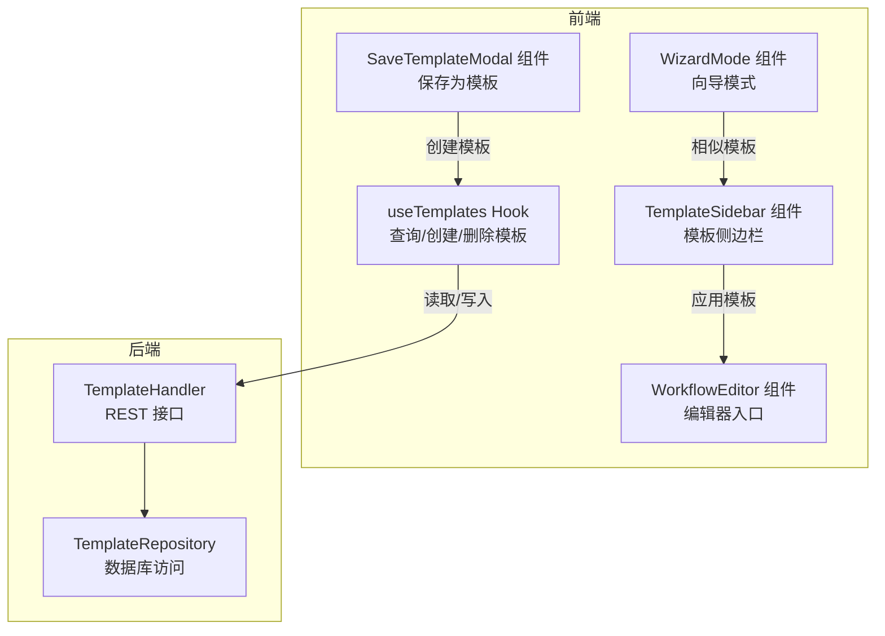
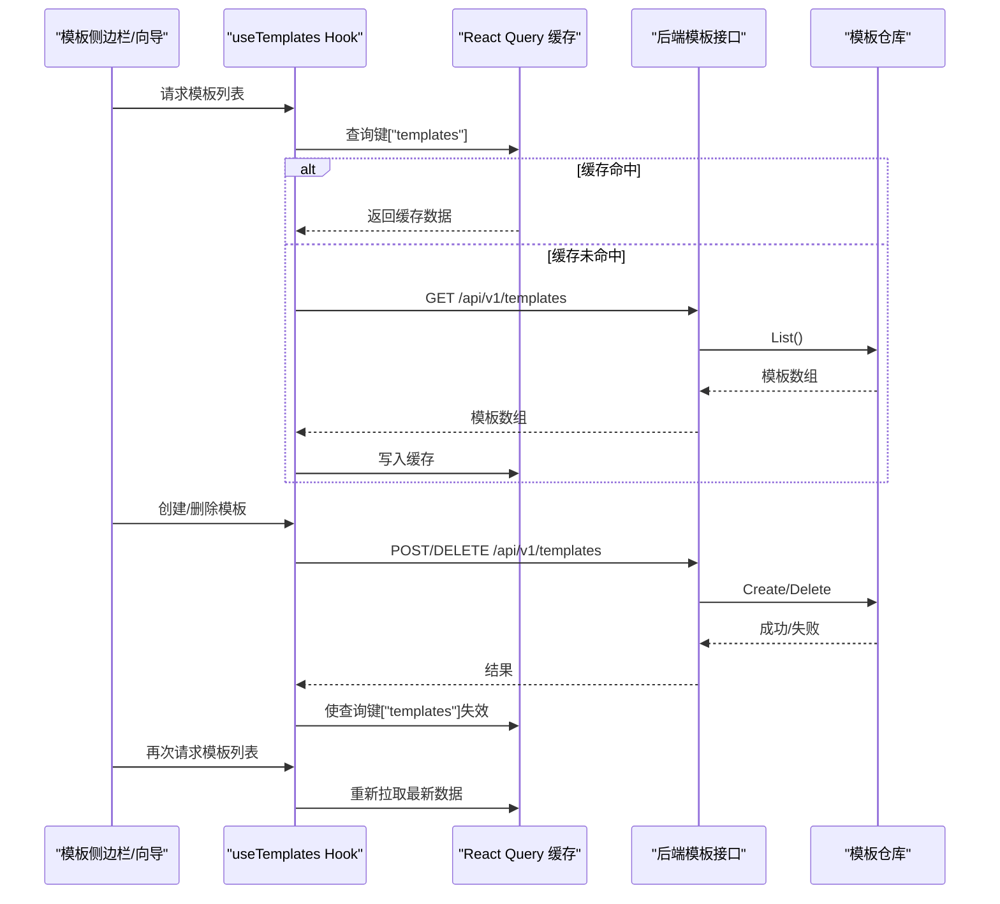
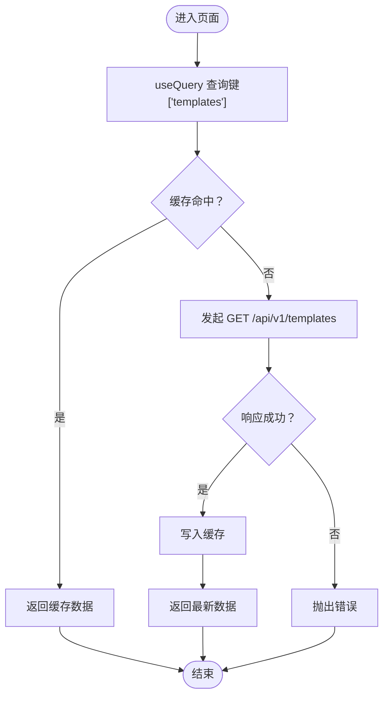
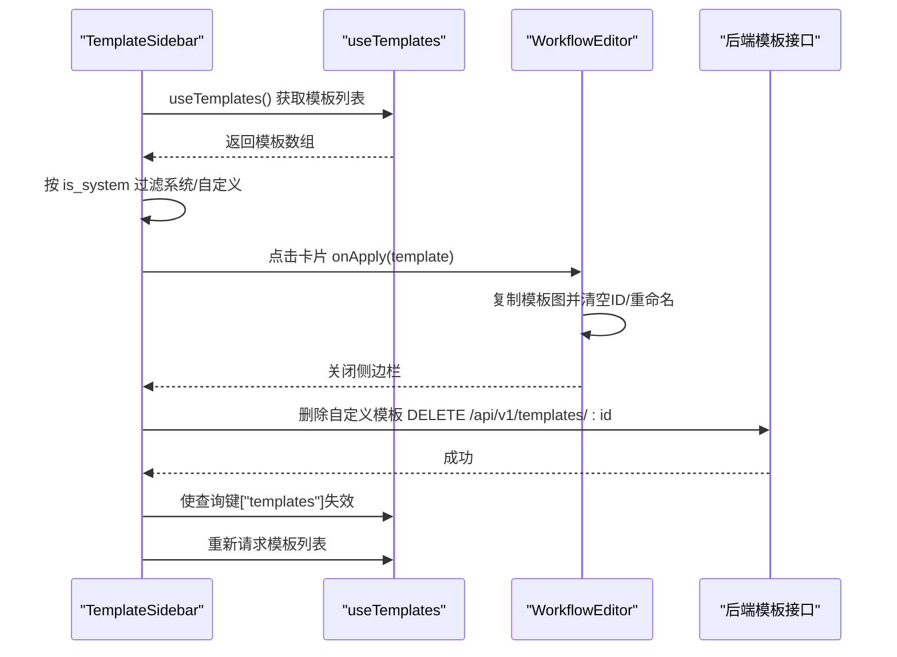
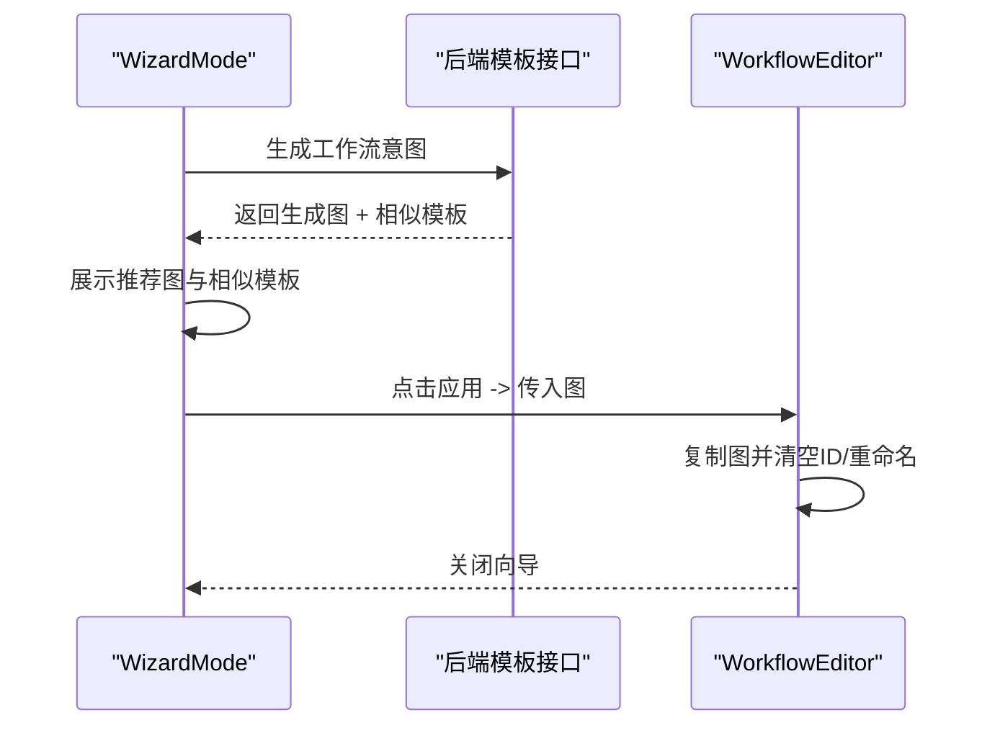
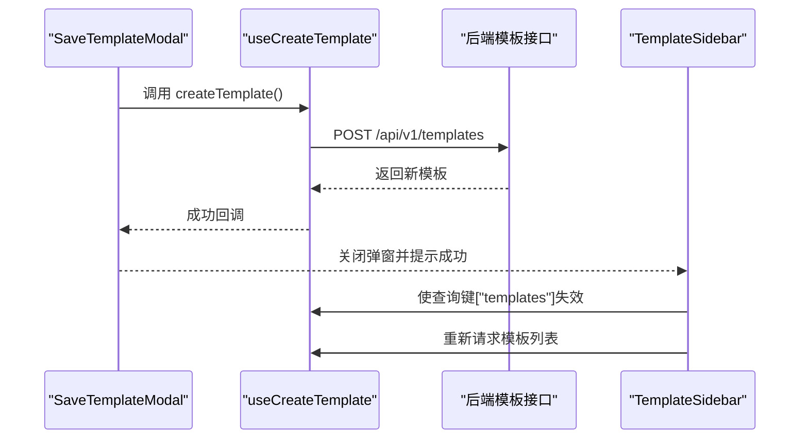
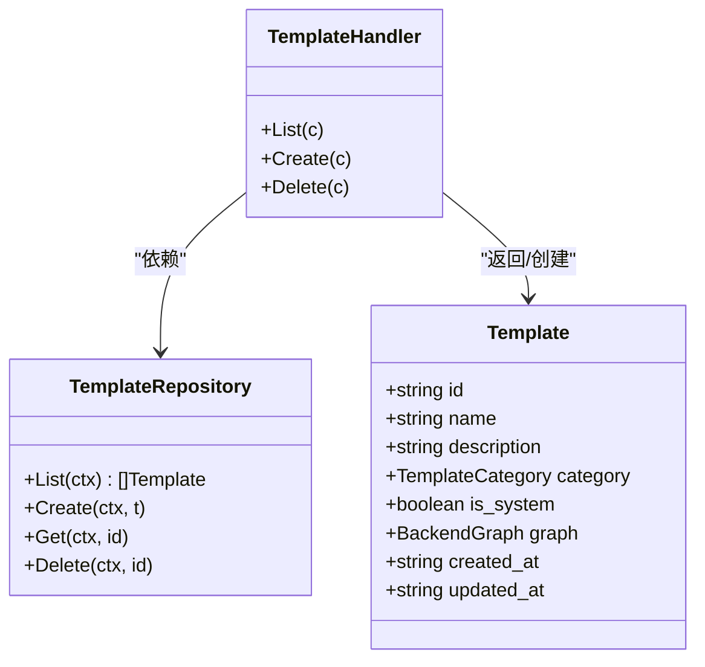
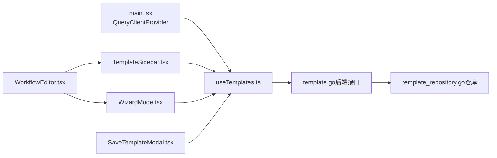

# useTemplates - 模板库管理

<cite>
**本文引用的文件**
- [useTemplates.ts](file://frontend/src/hooks/useTemplates.ts)
- [TemplateSidebar.tsx](file://frontend/src/features/editor/components/TemplateSidebar.tsx)
- [SaveTemplateModal.tsx](file://frontend/src/features/editor/components/SaveTemplateModal.tsx)
- [WizardMode.tsx](file://frontend/src/features/editor/components/Wizard/WizardMode.tsx)
- [WorkflowEditor.tsx](file://frontend/src/features/editor/WorkflowEditor.tsx)
- [template.ts](file://frontend/src/types/template.ts)
- [template.go](file://internal/api/handler/template.go)
- [template_repository.go](file://internal/infrastructure/persistence/template_repository.go)
- [template.go（核心模型）](file://internal/core/workflow/template.go)
- [templates.md（API设计）](file://docs/api/templates.md)
- [SPEC-204-template-sidebar.md（规格）](file://docs/specs/sprint3/SPEC-204-template-sidebar.md)
- [main.tsx（React Query Provider）](file://frontend/src/main.tsx)
</cite>

## 目录
1. [简介](#简介)
2. [项目结构](#项目结构)
3. [核心组件](#核心组件)
4. [架构总览](#架构总览)
5. [详细组件分析](#详细组件分析)
6. [依赖关系分析](#依赖关系分析)
7. [性能考量](#性能考量)
8. [故障排查指南](#故障排查指南)
9. [结论](#结论)
10. [附录](#附录)

## 简介
本文件围绕 useTemplates Hook 的设计与实现进行深入解析，覆盖其如何加载、缓存与管理本地（用户自定义）与系统预置的工作流模板；如何在模板侧边栏与向导模式中被调用，以实现模板的搜索、分类筛选与快速加载到编辑器；以及其内部缓存机制如何减少重复请求、提升性能。同时提供在模板侧边栏与向导模式中的使用示例，展示模板预览、应用与自定义保存流程。

## 项目结构
- 前端通过 React Query 管理模板数据，useTemplates Hook 提供查询、创建与删除模板的能力，并与后端 API 对接。
- 模板侧边栏负责展示模板、分类筛选与删除操作；向导模式提供“意图描述→AI生成→相似模板选择→应用”的流程；保存模板弹窗支持将当前工作流保存为模板。
- 后端提供模板列表、创建与删除接口，模板持久化由仓库层完成。

图表来源
- [useTemplates.ts](file://frontend/src/hooks/useTemplates.ts#L1-L63)
- [TemplateSidebar.tsx](file://frontend/src/features/editor/components/TemplateSidebar.tsx#L1-L134)
- [SaveTemplateModal.tsx](file://frontend/src/features/editor/components/SaveTemplateModal.tsx#L1-L116)
- [WizardMode.tsx](file://frontend/src/features/editor/components/Wizard/WizardMode.tsx#L1-L180)
- [WorkflowEditor.tsx](file://frontend/src/features/editor/WorkflowEditor.tsx#L135-L165)
- [template.go](file://internal/api/handler/template.go#L1-L67)
- [template_repository.go](file://internal/infrastructure/persistence/template_repository.go#L1-L51)

章节来源
- [useTemplates.ts](file://frontend/src/hooks/useTemplates.ts#L1-L63)
- [TemplateSidebar.tsx](file://frontend/src/features/editor/components/TemplateSidebar.tsx#L1-L134)
- [SaveTemplateModal.tsx](file://frontend/src/features/editor/components/SaveTemplateModal.tsx#L1-L116)
- [WizardMode.tsx](file://frontend/src/features/editor/components/Wizard/WizardMode.tsx#L1-L180)
- [WorkflowEditor.tsx](file://frontend/src/features/editor/WorkflowEditor.tsx#L135-L165)
- [template.go](file://internal/api/handler/template.go#L1-L67)
- [template_repository.go](file://internal/infrastructure/persistence/template_repository.go#L1-L51)

## 核心组件
- useTemplates Hook：封装模板的查询、创建与删除，统一使用 React Query 的查询键与失效策略，确保缓存一致性与最小化网络请求。
- TemplateSidebar：模板侧边栏，支持按“全部/系统/我的”三类筛选，展示系统模板与用户自定义模板卡片，支持删除自定义模板。
- SaveTemplateModal：保存为模板弹窗，收集模板元信息并调用创建模板的 Mutation。
- WizardMode：向导模式，提供意图输入、AI生成与相似模板选择，最终将生成图或相似模板应用到编辑器。
- WorkflowEditor：编辑器入口，负责接收模板应用与向导结果，将模板图转换为编辑器可用的图结构。

章节来源
- [useTemplates.ts](file://frontend/src/hooks/useTemplates.ts#L1-L63)
- [TemplateSidebar.tsx](file://frontend/src/features/editor/components/TemplateSidebar.tsx#L1-L134)
- [SaveTemplateModal.tsx](file://frontend/src/features/editor/components/SaveTemplateModal.tsx#L1-L116)
- [WizardMode.tsx](file://frontend/src/features/editor/components/Wizard/WizardMode.tsx#L1-L180)
- [WorkflowEditor.tsx](file://frontend/src/features/editor/WorkflowEditor.tsx#L135-L165)

## 架构总览
useTemplates 作为前端数据层的关键钩子，通过 React Query 的查询键与失效策略，实现模板数据的本地缓存与全局同步。后端提供标准 REST 接口，模板持久化由仓库层完成，确保系统预置模板与用户自定义模板的分离与一致。

图表来源
- [useTemplates.ts](file://frontend/src/hooks/useTemplates.ts#L1-L63)
- [template.go](file://internal/api/handler/template.go#L1-L67)
- [template_repository.go](file://internal/infrastructure/persistence/template_repository.go#L1-L51)
- [main.tsx](file://frontend/src/main.tsx#L1-L20)

## 详细组件分析

### useTemplates Hook：加载、缓存与管理
- 查询模板：使用查询键 ["templates"]，首次请求后由 React Query 缓存；后续相同查询直接命中缓存，避免重复网络请求。
- 创建模板：通过 Mutation 调用 POST /api/v1/templates，成功后使查询键 ["templates"] 失效，触发自动刷新。
- 删除模板：通过 Mutation 调用 DELETE /api/v1/templates/:id，成功后同样失效缓存，保证 UI 与服务端一致。
- 错误处理：对非 2xx 响应抛出错误，便于上层组件统一处理。
- 类型定义：模板与创建输入类型在前端类型文件中定义，确保前后端契约一致。

图表来源
- [useTemplates.ts](file://frontend/src/hooks/useTemplates.ts#L1-L63)
- [main.tsx](file://frontend/src/main.tsx#L1-L20)

章节来源
- [useTemplates.ts](file://frontend/src/hooks/useTemplates.ts#L1-L63)
- [template.ts](file://frontend/src/types/template.ts#L1-L22)

### 模板侧边栏：搜索、分类筛选与快速加载
- 分类筛选：支持“全部/系统/我的”三种过滤，分别渲染系统模板与用户自定义模板区域。
- 预览与应用：点击模板卡片触发 onApply 回调，编辑器接收模板图并重置为新建状态，避免污染模板源。
- 删除自定义模板：在卡片上提供删除按钮，调用删除 Mutation 并失效缓存。
- 加载状态：在加载期间显示骨架屏，提升交互体验。

图表来源
- [TemplateSidebar.tsx](file://frontend/src/features/editor/components/TemplateSidebar.tsx#L1-L134)
- [WorkflowEditor.tsx](file://frontend/src/features/editor/WorkflowEditor.tsx#L142-L154)
- [useTemplates.ts](file://frontend/src/hooks/useTemplates.ts#L1-L63)

章节来源
- [TemplateSidebar.tsx](file://frontend/src/features/editor/components/TemplateSidebar.tsx#L1-L134)
- [WorkflowEditor.tsx](file://frontend/src/features/editor/WorkflowEditor.tsx#L142-L154)
- [SPEC-204-template-sidebar.md](file://docs/specs/sprint3/SPEC-204-template-sidebar.md#L1-L98)

### 向导模式：模板预览、相似模板与应用
- 意图输入与生成：用户输入意图后触发生成，成功后展示推荐图与相似模板列表。
- 应用流程：点击推荐图或相似模板卡片，将图应用到编辑器并关闭向导。
- 与模板库联动：相似模板来源于后端返回的模板集合，可在向导中直接应用。

图表来源
- [WizardMode.tsx](file://frontend/src/features/editor/components/Wizard/WizardMode.tsx#L1-L180)
- [WorkflowEditor.tsx](file://frontend/src/features/editor/WorkflowEditor.tsx#L156-L164)

章节来源
- [WizardMode.tsx](file://frontend/src/features/editor/components/Wizard/WizardMode.tsx#L1-L180)
- [WorkflowEditor.tsx](file://frontend/src/features/editor/WorkflowEditor.tsx#L156-L164)

### 自定义保存：将当前工作流保存为模板
- 表单收集：名称、描述、分类等元信息。
- 创建模板：调用 useCreateTemplate 的 Mutation，成功后提示并关闭弹窗。
- 刷新列表：Mutation 成功后失效模板查询键，触发重新拉取。

图表来源
- [SaveTemplateModal.tsx](file://frontend/src/features/editor/components/SaveTemplateModal.tsx#L1-L116)
- [useTemplates.ts](file://frontend/src/hooks/useTemplates.ts#L1-L63)

章节来源
- [SaveTemplateModal.tsx](file://frontend/src/features/editor/components/SaveTemplateModal.tsx#L1-L116)
- [useTemplates.ts](file://frontend/src/hooks/useTemplates.ts#L1-L63)

### 后端接口与数据模型
- 接口清单：获取模板列表、创建模板、删除模板等，均在 API 文档中定义。
- 数据模型：模板包含 id、name、description、category、is_system、graph、时间戳等字段。
- 仓库层：从数据库读取模板列表，将 graph 字段反序列化为图结构。

图表来源
- [template.go（API处理器）](file://internal/api/handler/template.go#L1-L67)
- [template_repository.go（仓库）](file://internal/infrastructure/persistence/template_repository.go#L1-L51)
- [template.go（核心模型）](file://internal/core/workflow/template.go#L1-L34)
- [templates.md（API设计）](file://docs/api/templates.md#L1-L235)

章节来源
- [template.go（API处理器）](file://internal/api/handler/template.go#L1-L67)
- [template_repository.go（仓库）](file://internal/infrastructure/persistence/template_repository.go#L1-L51)
- [template.go（核心模型）](file://internal/core/workflow/template.go#L1-L34)
- [templates.md（API设计）](file://docs/api/templates.md#L1-L235)

## 依赖关系分析
- 前端依赖 React Query（QueryClientProvider 在根组件中注入），useTemplates 使用查询键与失效策略实现缓存与同步。
- 模板侧边栏与向导模式均依赖 useTemplates 提供的数据与 Mutation。
- 后端模板处理器依赖模板仓库，仓库从数据库读取模板并反序列化图结构。

图表来源
- [main.tsx](file://frontend/src/main.tsx#L1-L20)
- [useTemplates.ts](file://frontend/src/hooks/useTemplates.ts#L1-L63)
- [template.go](file://internal/api/handler/template.go#L1-L67)
- [template_repository.go](file://internal/infrastructure/persistence/template_repository.go#L1-L51)
- [TemplateSidebar.tsx](file://frontend/src/features/editor/components/TemplateSidebar.tsx#L1-L134)
- [WizardMode.tsx](file://frontend/src/features/editor/components/Wizard/WizardMode.tsx#L1-L180)
- [SaveTemplateModal.tsx](file://frontend/src/features/editor/components/SaveTemplateModal.tsx#L1-L116)
- [WorkflowEditor.tsx](file://frontend/src/features/editor/WorkflowEditor.tsx#L135-L165)

章节来源
- [main.tsx](file://frontend/src/main.tsx#L1-L20)
- [useTemplates.ts](file://frontend/src/hooks/useTemplates.ts#L1-L63)
- [template.go](file://internal/api/handler/template.go#L1-L67)
- [template_repository.go](file://internal/infrastructure/persistence/template_repository.go#L1-L51)
- [TemplateSidebar.tsx](file://frontend/src/features/editor/components/TemplateSidebar.tsx#L1-L134)
- [WizardMode.tsx](file://frontend/src/features/editor/components/Wizard/WizardMode.tsx#L1-L180)
- [SaveTemplateModal.tsx](file://frontend/src/features/editor/components/SaveTemplateModal.tsx#L1-L116)
- [WorkflowEditor.tsx](file://frontend/src/features/editor/WorkflowEditor.tsx#L135-L165)

## 性能考量
- 缓存策略：使用统一查询键 ["templates"]，首次请求后缓存命中，避免重复网络请求；创建/删除模板后通过失效策略触发重新拉取，保证数据一致性。
- 本地过滤：模板侧边栏在前端对模板进行分类过滤，减少不必要的网络请求与渲染开销。
- 加载反馈：在加载期间显示骨架屏与加载指示，改善用户体验。
- 图结构处理：应用模板或向导结果时，复制图结构并清空 ID，避免对模板源造成副作用，同时减少不必要的持久化压力。

[本节为通用性能建议，不直接分析具体文件]

## 故障排查指南
- 模板列表为空：检查后端是否正确返回模板；确认查询键 ["templates"] 是否被正确失效与重新拉取。
- 创建模板失败：查看后端返回的错误信息，确认请求体格式与必填字段；前端会根据响应体中的 error 字段抛出错误。
- 删除模板失败：确认模板是否为系统预置模板（不可删除）；检查后端返回的错误信息。
- 应用模板后编辑器未更新：确认 WorkflowEditor 是否正确接收模板图并重置 ID；检查模板卡片的 onApply 回调是否被触发。

章节来源
- [useTemplates.ts](file://frontend/src/hooks/useTemplates.ts#L1-L63)
- [template.go（API处理器）](file://internal/api/handler/template.go#L1-L67)
- [WorkflowEditor.tsx](file://frontend/src/features/editor/WorkflowEditor.tsx#L142-L154)

## 结论
useTemplates Hook 通过 React Query 的查询键与失效策略，实现了模板数据的高效缓存与全局同步；模板侧边栏与向导模式充分利用该 Hook，提供了模板的分类筛选、快速加载与相似模板应用能力；保存模板弹窗则将当前工作流固化为模板，形成完整的模板生命周期闭环。后端接口与仓库层清晰分离职责，确保系统预置模板与用户自定义模板的独立管理与一致呈现。

[本节为总结性内容，不直接分析具体文件]

## 附录
- 模板类型定义与创建输入：见前端类型文件。
- API 设计文档：包含模板列表、详情、创建、更新、删除与实例化接口。
- 规格文档：模板侧边栏布局与交互规范。

章节来源
- [template.ts](file://frontend/src/types/template.ts#L1-L22)
- [templates.md（API设计）](file://docs/api/templates.md#L1-L235)
- [SPEC-204-template-sidebar.md（规格）](file://docs/specs/sprint3/SPEC-204-template-sidebar.md#L1-L98)